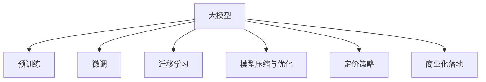

                 

## 1. 背景介绍

随着人工智能技术的高速发展，大模型如GPT-3、BERT等成为了行业热词。这些大模型具备强大的语言理解和生成能力，可以广泛应用于自然语言处理、计算机视觉等多个领域，推动了AI技术的落地应用。然而，随着市场竞争的加剧，大模型也面临着价格战的挑战。如何构建AI大模型创业公司，应对未来激烈的市场竞争，成为每个从业者亟需思考的问题。

### 1.1 问题由来

随着人工智能技术的普及，各大科技巨头、创业公司纷纷投入大量资源进行大模型的研发和部署。这导致市场对大模型的需求大幅提升，价格也随之水涨船高。然而，随着越来越多的玩家进入市场，价格战似乎不可避免。这种趋势下，AI大模型创业公司应该如何应对？

### 1.2 问题核心关键点

AI大模型创业公司面临着诸多挑战，包括但不限于以下几个方面：

- 数据获取与标注成本：大模型需要大量标注数据进行训练，而标注数据的获取和标注成本较高，如何降低这一成本是创业公司亟需解决的问题。
- 算法优化与性能提升：如何优化算法，提升大模型的精度和效率，以满足实际应用场景的需求。
- 市场竞争与定价策略：在激烈的市场竞争中，如何制定合理的价格策略，避免价格战，同时保持竞争力。
- 模型部署与维护：如何将训练好的大模型部署到生产环境，进行高效的实时推理，同时保证模型的稳定性和可靠性。
- 商业化与用户需求：如何从用户角度出发，满足其需求，实现商业化落地。

### 1.3 问题研究意义

应对未来AI大模型的价格战，对于构建成功的AI大模型创业公司具有重要意义：

- 降低成本：通过有效的数据获取与标注策略，优化算法，提升模型性能，降低大模型训练与维护的成本，从而提高企业的利润率。
- 保持竞争力：在激烈的市场竞争中，制定合理的价格策略，避免陷入价格战的泥潭，同时通过技术创新保持竞争力。
- 商业化落地：从用户角度出发，提升模型的实用性，实现商业化落地，推动AI技术的普及和应用。

## 2. 核心概念与联系

### 2.1 核心概念概述

在回答如何应对未来AI大模型的价格战问题前，我们需要先理解以下核心概念：

- **大模型**：如GPT-3、BERT等，具备强大的语言理解和生成能力，可以处理各种复杂的自然语言处理任务。
- **预训练与微调**：大模型通过在大规模无标签数据上预训练，然后通过微调在特定任务上进行调整，以获得更好的性能。
- **迁移学习**：通过将预训练模型的知识迁移到特定任务上，可以大幅度减少训练时间和数据量，提升模型性能。
- **模型压缩与优化**：通过模型压缩、量化等技术，减少模型的参数量和计算资源占用，提高模型的实时推理速度。
- **定价策略**：合理定价策略，不仅关乎公司的财务收益，更会影响市场竞争力和用户满意度。
- **商业化落地**：将大模型应用于实际业务场景，实现商业化落地，推动AI技术的普及和应用。

这些核心概念之间的逻辑关系可以通过以下Mermaid流程图来展示：



这个流程图展示了大模型的核心概念及其之间的关系：

1. 大模型通过预训练获得基础能力。
2. 微调和大模型训练相结合，提升模型在特定任务上的表现。
3. 迁移学习使得大模型可以跨领域应用，减少训练时间和数据量。
4. 模型压缩与优化提高模型效率，支持实时推理。
5. 定价策略影响企业财务和市场竞争力。
6. 商业化落地推动AI技术普及和应用。

## 3. 核心算法原理 & 具体操作步骤

### 3.1 算法原理概述

应对未来AI大模型的价格战，需要综合考虑数据获取与标注、算法优化与性能提升、市场竞争与定价策略、模型部署与维护、商业化与用户需求等多个方面。

### 3.2 算法步骤详解

#### 数据获取与标注

1. **数据来源**：大模型需要大量的标注数据进行训练，可以从公开数据集、网络爬虫、用户生成内容等多种来源获取。
2. **数据标注**：标注数据需要人工进行标注，成本较高。可以考虑使用众包平台或自动标注工具降低成本。
3. **数据清洗**：对标注数据进行清洗，去除噪声和重复数据，提升数据质量。

#### 算法优化与性能提升

1. **模型优化**：使用更先进的算法模型，如Transformer、BERT、GPT-3等，提升模型性能。
2. **参数压缩**：采用模型压缩技术，如剪枝、量化、蒸馏等，减少模型参数量和计算资源占用，提升模型效率。
3. **优化器选择**：选择合适的优化器，如Adam、SGD等，根据不同任务和数据特点进行优化。

#### 市场竞争与定价策略

1. **市场调研**：了解市场竞争态势，制定合理的定价策略。
2. **差异化策略**：通过技术创新和产品差异化，提高模型的竞争力。
3. **客户关系管理**：建立良好的客户关系，提升用户满意度和忠诚度。

#### 模型部署与维护

1. **模型部署**：将训练好的模型部署到生产环境，进行高效的实时推理。
2. **监控与维护**：实时监控模型性能，及时处理异常情况，保障模型稳定性和可靠性。

#### 商业化与用户需求

1. **产品设计**：根据用户需求设计产品，满足用户实际应用场景。
2. **市场营销**：通过营销策略，推广产品，提高市场份额。
3. **用户体验**：提升用户使用体验，实现商业化落地。

### 3.3 算法优缺点

应对未来AI大模型的价格战，具有以下优点：

- **提升效率**：通过模型压缩和优化，提升模型效率，降低计算资源消耗，提高实时推理速度。
- **降低成本**：通过众包平台和自动标注工具，降低数据获取与标注成本，提高模型训练效率。
- **差异化竞争**：通过技术创新和产品差异化，提高模型竞争力，避免陷入价格战。

同时，也存在一些缺点：

- **技术复杂性**：模型压缩和优化技术需要深入理解模型结构和算法原理，对技术要求较高。
- **市场风险**：市场竞争激烈，定价策略需要谨慎制定，避免过度竞争导致亏损。
- **用户需求变化**：用户需求不断变化，产品设计需要及时更新，以保持竞争力。

### 3.4 算法应用领域

应对未来AI大模型的价格战，可以在多个领域进行应用，包括但不限于：

- **自然语言处理**：如文本分类、机器翻译、情感分析等任务，通过预训练和微调提升模型性能。
- **计算机视觉**：如图像识别、目标检测、图像生成等任务，通过迁移学习提高模型泛化能力。
- **语音识别与处理**：如语音识别、语音合成、语音情感分析等任务，通过模型优化和实时推理提升应用体验。
- **推荐系统**：如商品推荐、内容推荐、个性化推荐等任务，通过迁移学习和模型压缩提升推荐效率。

## 4. 数学模型和公式 & 详细讲解 & 举例说明

### 4.1 数学模型构建

本文以自然语言处理任务为例，构建数学模型进行详细讲解。

假设大模型为 $M_{\theta}$，输入为 $x$，输出为 $y$。模型的损失函数为 $\ell$，则最小化损失函数的目标为：

$$
\theta^* = \mathop{\arg\min}_{\theta} \ell(M_{\theta}(x), y)
$$

### 4.2 公式推导过程

以自然语言处理中的文本分类任务为例，假设模型的输出为 $y \in \{0,1\}$，表示正负类别。模型的预测结果为 $M_{\theta}(x)$，则损失函数为：

$$
\ell(M_{\theta}(x), y) = -y\log M_{\theta}(x) - (1-y)\log(1-M_{\theta}(x))
$$

通过反向传播算法，计算损失函数对参数 $\theta$ 的梯度：

$$
\frac{\partial \ell}{\partial \theta} = -\frac{\partial}{\partial \theta}\left[y\log M_{\theta}(x) + (1-y)\log(1-M_{\theta}(x))\right]
$$

### 4.3 案例分析与讲解

以BERT模型为例，BERT通过在大规模无标签文本数据上进行预训练，学习到语言的基本特征和语义关系。在具体任务上，通过微调可以进一步提升模型的性能。例如，在文本分类任务中，微调BERT模型的输出层和分类器，可以得到更好的分类效果。

## 5. 项目实践：代码实例和详细解释说明

### 5.1 开发环境搭建

首先需要搭建开发环境，包括以下步骤：

1. **安装Python**：在开发机上安装Python，建议安装最新版本。
2. **安装依赖库**：安装必要的依赖库，如TensorFlow、PyTorch、NLTK等。
3. **设置环境变量**：设置Python环境变量，保证开发环境的一致性。

### 5.2 源代码详细实现

以下是使用TensorFlow对BERT模型进行微调的Python代码实现：

```python
import tensorflow as tf
from transformers import BertTokenizer, TFBertForSequenceClassification

# 加载模型和tokenizer
tokenizer = BertTokenizer.from_pretrained('bert-base-cased')
model = TFBertForSequenceClassification.from_pretrained('bert-base-cased', num_labels=2)

# 准备训练数据
train_data = ...
train_labels = ...

# 数据预处理
input_ids = tokenizer(train_data, padding=True, truncation=True, return_tensors='tf')
input_ids['input_ids'] = input_ids['input_ids'][:, :64]
attention_mask = input_ids['attention_mask']
labels = train_labels

# 模型训练
model.compile(optimizer=tf.keras.optimizers.Adam(learning_rate=2e-5),
              loss=tf.keras.losses.SparseCategoricalCrossentropy(from_logits=True),
              metrics=['accuracy'])

model.fit(input_ids, labels, epochs=3, batch_size=32, validation_split=0.2)
```

### 5.3 代码解读与分析

上述代码实现了使用TensorFlow对BERT模型进行微调的过程。具体解释如下：

1. **数据预处理**：使用BERT的tokenizer将训练数据转换为模型可处理的input_ids和attention_mask。
2. **模型编译**：使用Adam优化器，交叉熵损失函数，准确率作为评估指标，编译模型。
3. **模型训练**：使用fit方法进行模型训练，设置epoch和batch_size，进行3轮训练，每轮训练2次验证。

### 5.4 运行结果展示

训练完成后，使用测试数据进行模型评估，展示模型效果：

```python
test_data = ...
test_labels = ...

test_input_ids = tokenizer(test_data, padding=True, truncation=True, return_tensors='tf')
test_input_ids['input_ids'] = test_input_ids['input_ids'][:, :64]
test_attention_mask = test_input_ids['attention_mask']

test_loss, test_acc = model.evaluate(test_input_ids, test_labels)
print(f'Test loss: {test_loss}, Test accuracy: {test_acc}')
```

## 6. 实际应用场景

### 6.1 智能客服系统

智能客服系统可以应用大模型微调技术，通过预训练和微调提升模型性能，实现高效、可靠的客户服务。

1. **数据收集**：收集历史客服数据，标注问题与回答，构建监督数据集。
2. **模型训练**：使用预训练的BERT模型，通过微调提升模型在回答客户问题上的性能。
3. **实时推理**：将训练好的模型部署到生产环境，实时推理客户问题，并提供最佳回答。

### 6.2 金融舆情监测

金融舆情监测应用大模型微调技术，可以实时监测市场舆论动向，预测市场变化趋势，规避金融风险。

1. **数据收集**：收集金融领域相关的新闻、报道、评论等文本数据。
2. **模型训练**：使用预训练的BERT模型，通过微调提升模型对金融舆情的识别和分析能力。
3. **实时监测**：将训练好的模型部署到生产环境，实时监测金融舆情，预测市场变化趋势。

### 6.3 个性化推荐系统

个性化推荐系统应用大模型微调技术，可以提升推荐系统的推荐精度，满足用户的个性化需求。

1. **数据收集**：收集用户浏览、点击、评论等行为数据。
2. **模型训练**：使用预训练的BERT模型，通过微调提升模型对用户行为的理解能力。
3. **推荐算法**：将训练好的模型应用于推荐算法，提升推荐系统的个性化推荐能力。

### 6.4 未来应用展望

随着大模型和微调技术的不断发展，未来将在更多领域得到应用，推动AI技术的普及和应用。例如：

- **医疗健康**：应用大模型微调技术，提升医疗诊断和治疗效果，推动医疗智能化发展。
- **教育培训**：应用大模型微调技术，提升教育培训的智能化水平，推动教育公平。
- **智能交通**：应用大模型微调技术，提升智能交通系统的效率和安全性，推动智慧城市建设。

## 7. 工具和资源推荐

### 7.1 学习资源推荐

为了帮助开发者系统掌握大模型微调的理论基础和实践技巧，这里推荐一些优质的学习资源：

1. **《深度学习》（Ian Goodfellow等著）**：全面介绍深度学习的基本概念和算法原理，适合初学者和中级开发者。
2. **《TensorFlow实战》（Manning Publications）**：介绍TensorFlow的使用方法，包括数据预处理、模型训练和评估等。
3. **《Transformers实战》（O’Reilly）**：介绍Transformers库的使用方法，包括预训练模型的加载和微调。
4. **《自然语言处理入门》（周志华等著）**：介绍自然语言处理的基本概念和常用算法，适合初学者和中级开发者。
5. **《自然语言处理论文精选》（NLP Papers）**：收集了NLP领域最新的学术论文，帮助开发者了解最新的研究方向和进展。

### 7.2 开发工具推荐

开发大模型微调项目，离不开优秀的工具支持。以下是几款常用的开发工具：

1. **Jupyter Notebook**：一款轻量级的Python开发环境，支持交互式编程和代码展示。
2. **PyCharm**：一款功能强大的IDE，支持Python开发，包括代码编辑、调试和测试等功能。
3. **TensorBoard**：TensorFlow配套的可视化工具，支持模型的实时监控和调试。
4. **Weights & Biases**：一款实验跟踪工具，支持模型的训练、评估和可视化。
5. **Git**：版本控制系统，帮助团队协作和管理代码版本。

### 7.3 相关论文推荐

大模型和微调技术的发展源于学界的持续研究。以下是几篇奠基性的相关论文，推荐阅读：

1. **Attention is All You Need**：介绍Transformer模型，提出自注意力机制，开启大模型预训练范式。
2. **BERT: Pre-training of Deep Bidirectional Transformers for Language Understanding**：介绍BERT模型，提出预训练任务，提升模型的语义理解能力。
3. **Language Models are Unsupervised Multitask Learners**：介绍GPT-2模型，展示模型的zero-shot学习能力。
4. **Parameter-Efficient Transfer Learning for NLP**：介绍参数高效微调方法，如Adapter等，在减少参数量的情况下提升模型性能。
5. **AdaLoRA: Adaptive Low-Rank Adaptation for Parameter-Efficient Fine-Tuning**：介绍自适应低秩适应的微调方法，在保持模型性能的同时减少参数量。

这些论文代表了大模型微调技术的发展脉络。通过学习这些前沿成果，可以帮助研究者把握学科前进方向，激发更多的创新灵感。

## 8. 总结：未来发展趋势与挑战

### 8.1 总结

本文对大模型创业公司应对未来价格战的方法进行了全面系统的介绍。首先阐述了背景和问题由来，明确了数据获取与标注、算法优化与性能提升、市场竞争与定价策略、模型部署与维护、商业化与用户需求等核心关键点。通过详细讲解核心概念和算法原理，提供了代码实例和详细解释，展示了实际应用场景。同时推荐了学习资源、开发工具和相关论文，帮助开发者掌握大模型微调的技术。

### 8.2 未来发展趋势

展望未来，大模型创业公司将呈现以下几个发展趋势：

1. **技术创新**：通过不断优化算法和模型结构，提升大模型的性能和效率，保持技术领先优势。
2. **数据驱动**：依赖大规模标注数据进行训练，提高模型的泛化能力和性能，满足用户实际需求。
3. **市场扩展**：通过技术创新和产品差异化，扩展市场份额，避免价格战的恶性竞争。
4. **商业化落地**：推动AI技术在垂直行业的落地应用，实现商业化价值。
5. **用户体验**：提升用户体验，增强用户粘性和忠诚度，推动用户口碑和推荐。

### 8.3 面临的挑战

尽管大模型创业公司面临着诸多挑战，但仍可通过以下方式进行应对：

1. **数据标注成本**：通过众包平台和自动标注工具，降低数据获取与标注成本。
2. **模型性能提升**：通过技术创新和算法优化，提升模型性能，满足实际应用需求。
3. **市场竞争策略**：制定合理的定价策略，避免价格战的恶性竞争，保持竞争力。
4. **模型部署与维护**：通过模型压缩和优化，提升模型效率，降低计算资源消耗，实现高效部署和维护。
5. **商业化落地**：从用户需求出发，设计产品，推动AI技术的普及和应用。

### 8.4 研究展望

未来，大模型和微调技术的发展将面临以下挑战：

1. **数据标注成本**：如何降低大规模数据标注的成本，是未来需要解决的问题。
2. **模型性能提升**：如何进一步提升模型的性能，满足实际应用需求。
3. **市场竞争策略**：如何在激烈的市场竞争中制定合理的定价策略，保持竞争力。
4. **模型部署与维护**：如何提升模型效率，实现高效部署和维护。
5. **商业化落地**：如何从用户需求出发，设计产品，推动AI技术的普及和应用。

通过不断应对和解决这些挑战，大模型创业公司将不断提升技术水平和市场竞争力，推动AI技术的普及和应用。

## 9. 附录：常见问题与解答

### Q1: 大模型微调需要多少标注数据？

**A**: 大模型微调需要大量标注数据，通常需要数千乃至数万条标注数据。但实际应用中，可以通过数据增强、迁移学习等技术减少标注数据需求。

### Q2: 大模型微调是否需要从头训练？

**A**: 大模型微调不需要从头训练，只需在预训练模型的基础上进行微调，可以显著减少训练时间和成本。

### Q3: 大模型微调是否可以避免过拟合？

**A**: 通过数据增强、正则化、对抗训练等技术，可以避免大模型微调过程中的过拟合问题，提高模型的泛化能力。

### Q4: 大模型微调需要哪些优化器？

**A**: 常用的优化器包括Adam、SGD、Adafactor等，需要根据具体任务和数据特点选择合适的优化器。

### Q5: 大模型微调需要哪些评估指标？

**A**: 常用的评估指标包括准确率、精确率、召回率、F1分数等，需要根据具体任务选择合适的评估指标。

---

作者：禅与计算机程序设计艺术 / Zen and the Art of Computer Programming

