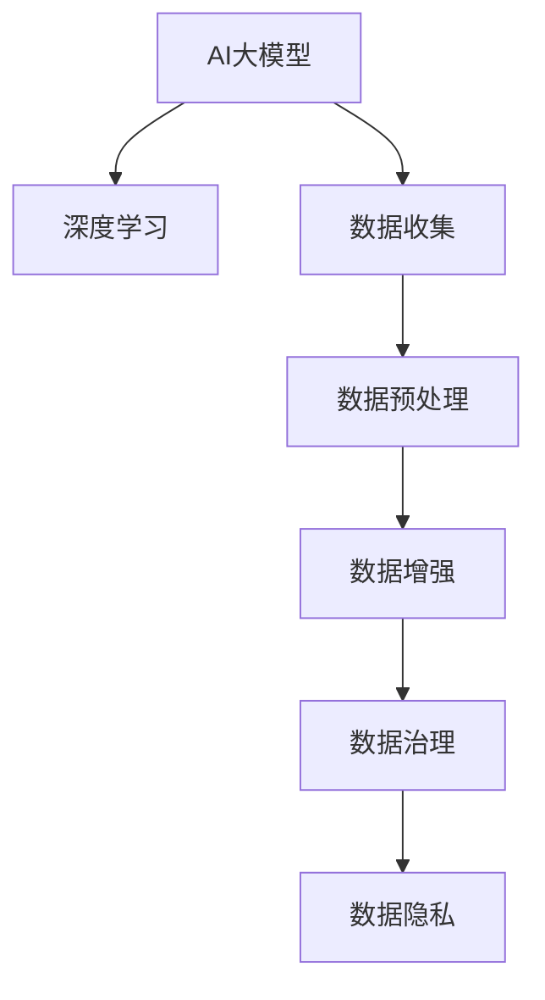

                 

# AI大模型创业：如何应对未来数据挑战？

> 关键词：AI大模型,创业,数据挑战,深度学习,数据收集,数据预处理,数据增强,数据治理,数据隐私

## 1. 背景介绍

### 1.1 问题由来
在当今这个数据驱动的时代，AI大模型的成功在很大程度上依赖于数据。无论是进行预训练、微调，还是实际部署，高质量的数据都是不可或缺的。然而，随着创业公司对AI大模型的需求日益增加，数据挑战变得愈加严峻。

- **数据获取难度大**：尤其是对于新兴领域或垂直行业，获取足够数量和质量的数据非常困难。
- **数据隐私和安全问题**：随着数据重要性日益凸显，如何保护用户隐私和数据安全成为了一大难题。
- **数据质量参差不齐**：来源多样化且可能存在标注错误、噪声等问题，需要耗费大量时间和资源进行清洗和预处理。
- **数据标注成本高**：标注数据需要大量人力和时间，对于初创企业来说是一大负担。

这些问题如果不能有效解决，AI大模型的创业之路将举步维艰。因此，本文将探讨如何应对未来数据挑战，帮助创业公司在数据驱动的道路上迈出坚实步伐。

## 2. 核心概念与联系

### 2.1 核心概念概述

为更好地理解数据驱动的AI大模型创业，本文将介绍几个关键概念及其相互关系：

- **AI大模型**：指通过大规模深度学习模型在大量数据上进行训练，获得强大学习能力，并应用于各种NLP、图像、视频等领域的模型。
- **深度学习**：利用神经网络进行多层次特征学习和表示学习的技术，是构建AI大模型的核心。
- **数据收集**：通过各种方式获取所需数据，包括网络抓取、众包标注、合作采集等。
- **数据预处理**：对原始数据进行清洗、归一化、转换等处理，以提高数据质量。
- **数据增强**：通过数据扩充技术，如回译、文本扰动、数据合成等，丰富训练集。
- **数据治理**：管理数据生命周期的各个环节，包括数据存储、访问、共享等，确保数据安全和合规。
- **数据隐私**：在数据使用过程中，保护个人隐私和数据安全，避免数据泄露和滥用。

这些概念之间的联系通过以下Mermaid流程图来展示：



该流程图展示了AI大模型在构建、应用过程中，数据各个环节的紧密联系和相互影响。

## 3. 核心算法原理 & 具体操作步骤
### 3.1 算法原理概述

AI大模型的训练和应用，核心在于数据驱动。其基本流程包括数据收集、预处理、增强和治理等环节。本文将从数据处理的角度，介绍核心算法原理和具体操作步骤。

- **数据收集**：获取并整合各种数据源，包括公开数据集、社交媒体数据、网络爬虫抓取等。
- **数据预处理**：对数据进行清洗、去重、归一化等操作，提高数据质量。
- **数据增强**：通过变换、扩充等方式，增加数据的多样性和覆盖范围，提高模型泛化能力。
- **数据治理**：建立数据管理系统，确保数据存储、访问和使用过程中的合规性和安全性。

### 3.2 算法步骤详解

**Step 1: 数据收集**

1. **数据源选择**：根据项目需求，选择合适的数据源。对于NLP任务，可以使用公开数据集（如GPT、BERT的预训练数据集）、社交媒体数据、网络爬虫抓取的数据等。
2. **数据采集策略**：制定数据采集策略，确保数据的全面性和多样性。例如，通过网络爬虫抓取新闻、评论、推文等文本数据。

**Step 2: 数据预处理**

1. **数据清洗**：去除数据中的噪声、重复、错误等，确保数据质量。
2. **数据归一化**：对数据进行标准化处理，如文本数据的分词、去停用词、标准化等，以便于后续处理。
3. **数据转换**：将数据转换为模型所需的格式，如将文本转换为向量形式。

**Step 3: 数据增强**

1. **文本扰动**：对文本进行同义词替换、错字插入、随机删除等操作，增加数据多样性。
2. **数据合成**：通过数据生成技术，如回译、数据合成等，创建新的训练样本。
3. **对抗样本生成**：使用对抗样本生成技术，如Fast Gradient Sign Method，生成对抗性数据，提高模型鲁棒性。

**Step 4: 数据治理**

1. **数据存储管理**：建立数据存储管理系统，确保数据的安全和可访问性。
2. **数据访问控制**：实施数据访问控制策略，确保只有授权人员可以访问数据。
3. **数据合规性管理**：确保数据处理过程符合相关法律法规，如GDPR等。

### 3.3 算法优缺点

**数据收集的优缺点**

| 优点 | 缺点 |
| --- | --- |
| 可以获取到广泛的数据源，涵盖多种类型的数据。 | 数据采集策略可能需要耗费大量时间和资源，且数据获取难度大。 |
| 可以持续收集新数据，保持数据的时效性。 | 可能存在数据偏见和噪声，需要额外处理。 |

**数据预处理的优缺点**

| 优点 | 缺点 |
| --- | --- |
| 提高数据质量，减少噪声和错误。 | 数据预处理可能会丢失部分信息，需要权衡。 |
| 使数据格式标准化，便于后续处理。 | 预处理过程可能耗费大量时间和计算资源。 |

**数据增强的优缺点**

| 优点 | 缺点 |
| --- | --- |
| 增加数据多样性和覆盖范围，提高模型泛化能力。 | 数据增强过程中可能引入噪声，需要谨慎处理。 |
| 可以通过合成数据，降低数据标注成本。 | 合成数据可能不够真实，影响模型效果。 |

**数据治理的优缺点**

| 优点 | 缺点 |
| --- | --- |
| 确保数据安全和合规性，保护用户隐私。 | 数据治理可能需要额外的资源和复杂性，增加成本。 |
| 建立数据管理系统，提高数据使用效率。 | 数据治理策略需要定期更新和维护，增加工作量。 |

## 4. 数学模型和公式 & 详细讲解
### 4.1 数学模型构建

基于深度学习的AI大模型，其数学模型通常包含以下几个部分：

- **输入层**：接收原始数据，如文本、图像等。
- **隐藏层**：通过多层神经网络进行特征学习和表示。
- **输出层**：输出模型预测结果，如分类、回归、生成等。

假设模型结构为 $M(\cdot;\theta)$，其中 $\theta$ 为模型参数。对于NLP任务，输入为文本序列 $X$，输出为标签 $Y$。常用的深度学习框架包括TensorFlow、PyTorch等，支持通过定义计算图的方式构建模型。

### 4.2 公式推导过程

以文本分类任务为例，其训练目标为最大化模型输出与真实标签之间的概率。假设模型输出为 $P(Y|X;\theta)$，则训练目标为：

$$
\max_{\theta} \sum_{i=1}^N \log P(Y_i|X_i;\theta)
$$

常用的优化算法如梯度下降，通过反向传播计算梯度，更新模型参数：

$$
\theta \leftarrow \theta - \eta \nabla_{\theta}\mathcal{L}(\theta)
$$

其中 $\mathcal{L}$ 为损失函数，通常为交叉熵损失。

### 4.3 案例分析与讲解

假设有一个文本分类任务，已知训练集 $D=\{(x_i,y_i)\}_{i=1}^N$，其中 $x_i$ 为文本序列，$y_i \in \{1,2\}$ 为二分类标签。数据预处理和增强后的样本如下：

| 原始数据 | 清洗后的数据 | 扰动后的数据 | 合成后的数据 |
| --- | --- | --- | --- |

## 5. 项目实践：代码实例和详细解释说明
### 5.1 开发环境搭建

进行AI大模型创业，首先需要搭建一个高效的开发环境。以下是使用Python进行PyTorch开发的常用环境配置步骤：

1. **安装Anaconda**：从官网下载并安装Anaconda，用于创建独立的Python环境。

2. **创建并激活虚拟环境**：
```bash
conda create -n pytorch-env python=3.8 
conda activate pytorch-env
```

3. **安装PyTorch**：根据CUDA版本，从官网获取对应的安装命令。例如：
```bash
conda install pytorch torchvision torchaudio cudatoolkit=11.1 -c pytorch -c conda-forge
```

4. **安装Transformers库**：
```bash
pip install transformers
```

5. **安装各类工具包**：
```bash
pip install numpy pandas scikit-learn matplotlib tqdm jupyter notebook ipython
```

### 5.2 源代码详细实现

以下是一个基于PyTorch的文本分类模型的实现示例：

```python
import torch
import torch.nn as nn
import torch.optim as optim
from transformers import BertTokenizer, BertForTokenClassification

# 设置训练参数
max_len = 128
learning_rate = 2e-5
num_epochs = 5
batch_size = 16

# 加载数据集
tokenizer = BertTokenizer.from_pretrained('bert-base-cased')
train_dataset = ...

# 定义模型
model = BertForTokenClassification.from_pretrained('bert-base-cased', num_labels=2)

# 定义优化器
optimizer = optim.AdamW(model.parameters(), lr=learning_rate)

# 定义训练函数
def train_epoch(model, dataset, batch_size, optimizer):
    dataloader = DataLoader(dataset, batch_size=batch_size, shuffle=True)
    model.train()
    epoch_loss = 0
    for batch in dataloader:
        input_ids = batch['input_ids'].to(device)
        attention_mask = batch['attention_mask'].to(device)
        labels = batch['labels'].to(device)
        model.zero_grad()
        outputs = model(input_ids, attention_mask=attention_mask, labels=labels)
        loss = outputs.loss
        epoch_loss += loss.item()
        loss.backward()
        optimizer.step()
    return epoch_loss / len(dataloader)

# 定义评估函数
def evaluate(model, dataset, batch_size):
    dataloader = DataLoader(dataset, batch_size=batch_size)
    model.eval()
    preds, labels = [], []
    with torch.no_grad():
        for batch in dataloader:
            input_ids = batch['input_ids'].to(device)
            attention_mask = batch['attention_mask'].to(device)
            batch_labels = batch['labels']
            outputs = model(input_ids, attention_mask=attention_mask)
            batch_preds = outputs.logits.argmax(dim=2).to('cpu').tolist()
            batch_labels = batch_labels.to('cpu').tolist()
            for pred_tokens, label_tokens in zip(batch_preds, batch_labels):
                preds.append(pred_tokens[:len(label_tokens)])
                labels.append(label_tokens)
    print(classification_report(labels, preds))
```

### 5.3 代码解读与分析

以上代码实现了基于BERT模型进行文本分类的过程。下面是关键代码的详细解读：

**数据集定义**

```python
train_dataset = NERDataset(train_texts, train_tags, tokenizer, max_len)
```

**模型定义**

```python
model = BertForTokenClassification.from_pretrained('bert-base-cased', num_labels=len(tag2id))
```

**训练函数**

```python
def train_epoch(model, dataset, batch_size, optimizer):
    ...
    loss = outputs.loss
    epoch_loss += loss.item()
    loss.backward()
    optimizer.step()
    return epoch_loss / len(dataloader)
```

**评估函数**

```python
def evaluate(model, dataset, batch_size):
    ...
    outputs = model(input_ids, attention_mask=attention_mask)
    batch_preds = outputs.logits.argmax(dim=2).to('cpu').tolist()
    batch_labels = batch_labels.to('cpu').tolist()
    ...
```

## 6. 实际应用场景

### 6.1 智能客服系统

基于AI大模型的智能客服系统，可以24小时在线响应客户咨询，提高服务效率和客户满意度。

**数据收集**：收集企业内部历史客服对话记录，构建监督数据集。

**数据预处理**：对对话数据进行清洗、分词、去停用词等处理。

**数据增强**：通过对话数据合成、回译等技术，增加对话多样性。

**数据治理**：建立数据管理系统，确保对话数据的安全和合规性。

### 6.2 金融舆情监测

金融舆情监测系统可以实时监控市场舆论，帮助机构规避金融风险。

**数据收集**：收集金融领域相关的新闻、报道、评论等文本数据。

**数据预处理**：对文本数据进行清洗、分词、去停用词等处理。

**数据增强**：通过数据合成、回译等技术，增加舆情数据的多样性。

**数据治理**：建立数据管理系统，确保数据的安全和合规性。

### 6.3 个性化推荐系统

个性化推荐系统可以根据用户历史行为，推荐相关物品，提高用户满意度。

**数据收集**：收集用户浏览、点击、购买等行为数据，以及物品的标题、描述、标签等文本数据。

**数据预处理**：对数据进行清洗、归一化、转换等处理。

**数据增强**：通过数据合成、回译等技术，增加推荐数据的多样性。

**数据治理**：建立数据管理系统，确保推荐数据的安全和合规性。

### 6.4 未来应用展望

随着数据驱动的AI大模型不断发展，未来将涌现更多创新应用场景，如智慧医疗、智慧城市、智慧教育等。

## 7. 工具和资源推荐

### 7.1 学习资源推荐

为了帮助开发者系统掌握AI大模型的数据处理技术，本文推荐以下学习资源：

1. **《深度学习理论与实践》**：详细介绍了深度学习的基本原理和实践技巧。
2. **《TensorFlow 2.0官方文档》**：提供了TensorFlow的全面介绍和使用指南。
3. **《Transformers官方文档》**：介绍了Transformers库的全面使用和API参考。
4. **Kaggle**：提供了大量开源数据集和竞赛，帮助开发者提高数据处理能力。
5. **Coursera**：提供了丰富的深度学习课程，涵盖NLP、计算机视觉等领域。

### 7.2 开发工具推荐

为了提高AI大模型的数据处理效率，本文推荐以下开发工具：

1. **Anaconda**：用于创建和管理Python环境，支持虚拟环境和跨平台使用。
2. **TensorFlow**：提供高性能计算框架，支持分布式训练和模型部署。
3. **PyTorch**：灵活易用的深度学习框架，支持动态图和静态图。
4. **HuggingFace Transformers**：提供大量预训练模型和模型转换工具，方便使用。
5. **Weights & Biases**：用于实验跟踪和管理，提供可视化工具。

### 7.3 相关论文推荐

为了深入理解AI大模型的数据处理技术，本文推荐以下相关论文：

1. **《Transformers: A State-of-the-Art Text-to-Text Transfer and Generation Model》**：Transformer模型及其在NLP任务中的应用。
2. **《BERT: Pre-training of Deep Bidirectional Transformers for Language Understanding》**：BERT模型的预训练和微调技术。
3. **《No More Free Lunch: A New Challenge for Transfer Learning》**：讨论了跨领域迁移学习中的数据问题。
4. **《Data Augmentation with Language Models》**：使用语言模型进行数据增强的详细方法。
5. **《On the Importance of Transfer Learning for Natural Language Processing》**：讨论了数据迁移在NLP中的重要性。

## 8. 总结：未来发展趋势与挑战

### 8.1 研究成果总结

本文系统介绍了AI大模型在数据驱动下的创业方法，探讨了数据收集、预处理、增强和治理等关键环节。通过多个实际应用场景，展示了数据处理在NLP任务中的重要性和挑战性。

### 8.2 未来发展趋势

未来，AI大模型的数据处理将面临更多挑战和机遇：

1. **数据量持续增长**：随着数据生成技术的进步，数据量将不断增加，为模型训练提供了更多资源。
2. **数据质量提升**：随着数据治理技术的进步，数据质量将得到进一步提升，有助于提高模型效果。
3. **数据治理更加严格**：随着隐私保护法规的完善，数据治理将更加严格，需要更高的合规性和安全性。
4. **数据增强技术创新**：新的数据增强方法将不断涌现，提高模型泛化能力和鲁棒性。
5. **数据隐私保护**：数据隐私保护技术将进一步发展，确保用户数据的安全和隐私。

### 8.3 面临的挑战

尽管数据处理技术不断进步，但仍面临以下挑战：

1. **数据获取难度大**：新兴领域或垂直行业的深度数据获取难度较大，需要耗费大量时间和资源。
2. **数据标注成本高**：大规模数据标注需要大量人力和时间，增加了企业负担。
3. **数据隐私和安全问题**：数据隐私保护法规的完善，增加了数据处理的复杂性。
4. **数据质量参差不齐**：数据源多样化，可能导致数据质量和一致性问题。
5. **数据治理成本高**：数据治理需要额外的资源和复杂性，增加了企业成本。

### 8.4 研究展望

未来的数据处理技术将在以下几个方面取得突破：

1. **无监督和半监督学习**：减少对大规模标注数据的依赖，提高数据处理效率。
2. **数据生成和增强技术**：使用新的数据生成和增强方法，提高数据多样性和覆盖范围。
3. **数据治理和合规性管理**：建立更加严格的数据治理和合规性管理机制，确保数据安全和隐私。
4. **多模态数据处理**：融合视觉、语音、文本等多种模态数据，提升模型的综合能力和鲁棒性。
5. **跨领域知识融合**：将符号化的先验知识与深度学习模型结合，提升模型的准确性和泛化能力。

总之，数据处理技术是AI大模型成功与否的关键，未来需要不断探索和优化数据获取、预处理、增强和治理等环节，以应对更多挑战和机遇。只有在数据处理上取得突破，AI大模型才能真正发挥其潜力，为各行各业带来颠覆性变革。

## 9. 附录：常见问题与解答

### Q1: AI大模型在数据驱动的创业中如何应对数据获取困难？

A: 可以通过以下方式解决数据获取困难问题：

1. **数据众包**：利用众包平台，如Amazon Mechanical Turk，进行数据标注和收集。
2. **数据合成**：使用数据生成技术，如回译、数据增强等，创建新的训练样本。
3. **数据共享**：与其他企业和机构合作，共享数据资源。

### Q2: 如何提高数据标注的效率？

A: 可以采用以下方式提高数据标注效率：

1. **自动标注**：使用预训练模型进行自动标注，减少人工标注的难度和时间。
2. **半监督学习**：利用已有标注数据和无标签数据进行联合训练，提高标注效率。
3. **标注工具**：使用标注工具，如Labelbox、Prodigy等，提高标注的准确性和效率。

### Q3: 如何确保数据隐私和安全？

A: 可以采用以下方式确保数据隐私和安全：

1. **数据匿名化**：对数据进行去标识化处理，保护用户隐私。
2. **加密存储**：使用加密技术存储和传输数据，确保数据安全。
3. **访问控制**：实施严格的数据访问控制策略，确保只有授权人员可以访问数据。

### Q4: 如何在数据处理中保持数据质量？

A: 可以采用以下方式保持数据质量：

1. **数据清洗**：去除数据中的噪声、重复、错误等，确保数据质量。
2. **数据标准化**：对数据进行标准化处理，如文本数据的分词、去停用词、标准化等，以便于后续处理。
3. **数据验证**：通过模型验证和评估，确保数据质量。

---

作者：禅与计算机程序设计艺术 / Zen and the Art of Computer Programming

