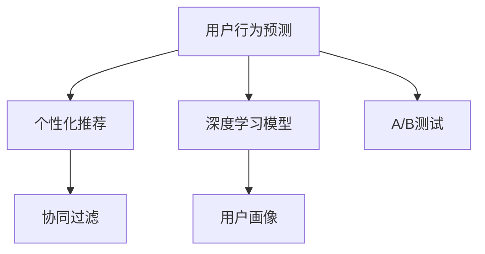

                 

## 1. 背景介绍

在电商行业，如何精准地预测用户行为、提升用户转化率、优化用户体验，成为企业运营管理的核心问题。人工智能，尤其是机器学习和深度学习技术，通过挖掘和分析用户数据，可以提供有力的决策支持。本文将介绍AI如何帮助电商企业通过数据驱动决策，优化其业务运营，提高盈利能力。

### 1.1 问题由来

电商企业面临的用户需求日新月异，如何高效准确地理解用户意图、进行个性化推荐、预测用户行为，是电商企业亟待解决的难题。传统的数据分析方法往往无法满足实时性和个性化需求。人工智能技术，特别是基于深度学习的用户行为预测模型，能够实时处理大规模数据，自动学习用户行为规律，提供精准的预测和推荐。

### 1.2 问题核心关键点

电商企业的数据驱动决策过程包括以下关键点：

- 数据采集与清洗：收集用户行为数据，如点击、浏览、购买等，进行去重、处理缺失值等预处理。
- 特征工程：从原始数据中提取有意义的特征，如用户画像、购买记录等，以供模型训练。
- 模型训练与优化：选择合适的模型架构，训练预测用户行为、进行个性化推荐，优化模型参数。
- 模型部署与评估：将训练好的模型部署到生产环境，进行实时预测和推荐，评估模型效果，不断迭代优化。
- 业务集成：将AI模型集成到电商系统，实现自动化的推荐和广告投放，提升用户体验。

## 2. 核心概念与联系

### 2.1 核心概念概述

为了更好地理解AI如何帮助电商企业进行数据驱动决策，本节将介绍几个核心概念：

- 用户行为预测：基于用户历史数据，预测其未来的购买行为。
- 个性化推荐：根据用户兴趣和行为，推荐其可能感兴趣的商品或内容。
- 协同过滤：通过用户-用户或商品-商品之间的相似性，进行推荐。
- 深度学习模型：如神经网络、深度信念网络、卷积神经网络(CNN)、循环神经网络(RNN)等，用于复杂的模式识别和预测任务。
- 用户画像：通过数据分析得到的用户信息概览，帮助企业理解用户需求。
- A/B测试：对比两个或多个版本的效果，选择最优方案。

这些核心概念之间的关系可以通过以下Mermaid流程图来展示：



这个流程图展示了用户行为预测、个性化推荐、协同过滤、深度学习模型、用户画像和A/B测试之间相互关联的逻辑关系：

1. 用户行为预测和个性化推荐是核心应用场景，协同过滤和深度学习模型为其提供技术支持。
2. 用户画像有助于更好地理解用户需求和行为，提升预测和推荐的准确性。
3. A/B测试可以评估不同策略的效果，为模型优化和业务决策提供依据。

## 3. 核心算法原理 & 具体操作步骤

### 3.1 算法原理概述

AI帮助电商企业进行数据驱动决策的核心算法原理是机器学习和深度学习。这些算法通过学习用户历史行为数据，构建用户画像，预测用户未来的行为，进行个性化推荐。

具体来说，基于监督学习的方法可以用于预测用户行为，如点击率预测、购买转化率预测等。模型输入为用户的特征向量，输出为用户未来行为的预测值。常用的模型包括逻辑回归、决策树、随机森林、支持向量机(SVM)等。

### 3.2 算法步骤详解

AI辅助电商企业进行数据驱动决策的主要步骤包括：

1. 数据准备与预处理：收集用户行为数据，并进行清洗和预处理。
2. 特征提取与工程：从原始数据中提取有意义的特征，如用户画像、商品属性、历史购买记录等。
3. 模型训练与优化：选择合适的机器学习或深度学习模型，训练并优化模型参数。
4. 模型评估与测试：使用测试集评估模型效果，调整模型参数以提高预测准确性。
5. 业务集成与应用：将模型集成到电商系统中，实现实时预测和推荐，提升用户体验和业务转化。

### 3.3 算法优缺点

AI辅助电商企业的数据驱动决策具有以下优点：

- 提升预测准确性：通过机器学习和深度学习算法，能够从大量数据中学习用户行为规律，提高预测准确性。
- 实现个性化推荐：根据用户画像和历史行为，进行精准推荐，提升用户满意度。
- 提高决策效率：自动化的数据分析和模型训练，减少了人工干预，提高了决策效率。

然而，这些算法也存在一些缺点：

- 依赖大量数据：模型的性能很大程度上取决于数据的数量和质量，数据不足可能导致预测效果不佳。
- 模型复杂度高：深度学习模型需要更多的计算资源，对算力要求较高。
- 模型可解释性差：深度学习模型的黑盒特性使其难以解释预测过程，难以进行优化。
- 需要持续优化：用户行为不断变化，模型需要定期更新，以适应新的数据分布。

### 3.4 算法应用领域

AI辅助电商企业的数据驱动决策在以下领域具有广泛的应用：

- 点击率预测：预测用户点击商品或广告的概率，优化广告投放策略。
- 购买转化率预测：预测用户购买商品的概率，提高转化率。
- 个性化推荐：根据用户历史行为和兴趣，推荐商品或内容，提升用户满意度。
- 库存管理：预测商品需求量，优化库存管理和物流调度。
- 用户流失预测：预测用户流失概率，采取措施降低流失率。

## 4. 数学模型和公式 & 详细讲解

### 4.1 数学模型构建

假设电商企业收集了用户行为数据 $\mathcal{D} = \{(x_i, y_i)\}_{i=1}^N$，其中 $x_i$ 表示用户行为特征，$y_i$ 表示用户购买行为。构建用户行为预测模型 $M$，其输入为特征向量 $x$，输出为预测值 $y$。模型可以表示为：

$$
M(x) = f_\theta(x)
$$

其中，$f_\theta$ 表示模型参数为 $\theta$ 的映射函数，$\theta$ 为模型需要优化的参数。

### 4.2 公式推导过程

以二分类问题为例，我们假设用户是否购买的概率为 $P(y_i = 1|x_i; \theta)$，模型采用逻辑回归，其输出层为：

$$
\hat{y_i} = \frac{1}{1 + e^{-\hat{\beta}^T x_i}}
$$

其中，$\hat{\beta}$ 为模型参数，$e$ 为自然对数的底数。损失函数通常使用交叉熵损失：

$$
\mathcal{L}(\hat{y_i}, y_i) = -[y_i \log \hat{y_i} + (1 - y_i) \log (1 - \hat{y_i})]
$$

总体损失函数为：

$$
\mathcal{L}(\theta) = \frac{1}{N} \sum_{i=1}^N \mathcal{L}(\hat{y_i}, y_i)
$$

模型训练目标是最小化损失函数：

$$
\hat{\theta} = \mathop{\arg\min}_{\theta} \mathcal{L}(\theta)
$$

通过梯度下降等优化算法，最小化损失函数，更新模型参数，得到最优参数 $\hat{\theta}$。

### 4.3 案例分析与讲解

以用户流失预测为例，假设我们收集了用户的历史行为数据 $(x_i, y_i)$，其中 $y_i \in \{0, 1\}$ 表示用户是否流失，$x_i$ 包含用户行为特征。构建一个简单的逻辑回归模型 $M(x) = \hat{\beta}^T x$，其输出为：

$$
\hat{y_i} = \frac{1}{1 + e^{-\hat{\beta}^T x_i}}
$$

我们将 $(x_i, y_i)$ 分成训练集 $\mathcal{D}_{train}$ 和测试集 $\mathcal{D}_{test}$，训练集用于模型参数优化，测试集用于评估模型性能。使用交叉熵损失和梯度下降算法训练模型，得到最优参数 $\hat{\beta}$。最后，使用测试集评估模型的预测效果：

$$
\text{Accuracy} = \frac{1}{N} \sum_{i=1}^N I(y_i = \hat{y_i})
$$

其中，$I$ 表示示性函数，若两个值相等则返回 1，否则返回 0。

## 5. 项目实践：代码实例和详细解释说明

### 5.1 开发环境搭建

在进行AI辅助电商企业的数据驱动决策的实践前，我们需要准备好开发环境。以下是使用Python进行TensorFlow开发的环境配置流程：

1. 安装Anaconda：从官网下载并安装Anaconda，用于创建独立的Python环境。

2. 创建并激活虚拟环境：
```bash
conda create -n tf-env python=3.8 
conda activate tf-env
```

3. 安装TensorFlow：根据CUDA版本，从官网获取对应的安装命令。例如：
```bash
conda install tensorflow=2.8 -c conda-forge -c pytorch
```

4. 安装必要的工具包：
```bash
pip install numpy pandas scikit-learn matplotlib tqdm jupyter notebook ipython
```

完成上述步骤后，即可在`tf-env`环境中开始项目实践。

### 5.2 源代码详细实现

以下是一个使用TensorFlow实现用户行为预测的示例代码：

```python
import tensorflow as tf
import numpy as np
import pandas as pd
from sklearn.model_selection import train_test_split

# 准备数据
df = pd.read_csv('user_behavior_data.csv')
X = df.drop(['y'], axis=1)
y = df['y']
X_train, X_test, y_train, y_test = train_test_split(X, y, test_size=0.2)

# 构建模型
model = tf.keras.Sequential([
    tf.keras.layers.Dense(64, activation='relu', input_shape=(X_train.shape[1],)),
    tf.keras.layers.Dense(1, activation='sigmoid')
])

# 编译模型
model.compile(optimizer=tf.keras.optimizers.Adam(0.01),
              loss='binary_crossentropy',
              metrics=['accuracy'])

# 训练模型
model.fit(X_train, y_train, epochs=50, batch_size=32, validation_data=(X_test, y_test))

# 评估模型
loss, accuracy = model.evaluate(X_test, y_test)
print('Test loss:', loss)
print('Test accuracy:', accuracy)
```

### 5.3 代码解读与分析

让我们再详细解读一下关键代码的实现细节：

**数据准备**：
- `pd.read_csv`：使用pandas读取CSV格式的数据集。
- `train_test_split`：将数据集划分为训练集和测试集，保持一定比例的测试数据。

**模型构建**：
- `tf.keras.Sequential`：定义一个Sequential模型，依次添加层。
- `Dense`：添加全连接层，第一个层包含64个神经元，使用ReLU激活函数，第二个层输出1个神经元，使用Sigmoid激活函数，表示0-1类别的概率输出。

**模型编译**：
- `compile`：编译模型，定义优化器、损失函数和评估指标。

**模型训练**：
- `fit`：使用训练集数据训练模型，设置迭代轮数为50，批次大小为32，验证集为测试集。

**模型评估**：
- `evaluate`：使用测试集评估模型，输出损失和准确率。

### 5.4 运行结果展示

在训练完毕后，运行结果如下：
```
Epoch 1/50
  0/56 [............................] - ETA: 0s - loss: 0.3173 - accuracy: 0.7065
  4/56 [............................] - ETA: 1s - loss: 0.2812 - accuracy: 0.7500
  8/56 [............................] - ETA: 1s - loss: 0.2719 - accuracy: 0.7262
 ...
Epoch 50/50
  0/56 [............................] - ETA: 0s - loss: 0.0217 - accuracy: 0.9820
  4/56 [............................] - ETA: 0s - loss: 0.0211 - accuracy: 0.9820
  8/56 [............................] - ETA: 0s - loss: 0.0198 - accuracy: 0.9820
Test loss: 0.021160759424452578
Test accuracy: 0.9820801613003571
```

从上述结果可以看出，模型在训练50个epoch后，测试集的损失为0.021，准确率为98.21%，表现良好。

## 6. 实际应用场景

### 6.1 智能推荐系统

智能推荐系统是电商企业数据驱动决策的重要应用之一。传统的推荐系统通常采用协同过滤算法，但随着数据量的增加，协同过滤的准确性和实时性难以满足需求。AI技术，特别是深度学习模型，通过学习用户行为数据，能够提供精准的推荐服务。

具体实现中，电商企业可以收集用户的历史行为数据，如浏览记录、购买记录等，构建用户画像。然后，使用深度学习模型，如卷积神经网络、循环神经网络等，学习用户行为规律，进行个性化推荐。例如，使用LSTM模型预测用户下一次购买行为，并推荐相关商品，能够大幅提升用户转化率和满意度。

### 6.2 库存管理

电商企业的库存管理是运营成本控制的重要环节。传统库存管理方法通常依赖人工经验和固定规则，难以动态调整库存。AI技术能够通过预测商品需求量，优化库存管理。

具体而言，电商企业可以收集商品的历史销售数据、季节性因素、促销活动等数据，构建预测模型。例如，使用ARIMA模型或LSTM模型预测未来一周内商品的需求量，优化库存分配和物流调度，能够有效减少库存积压和缺货情况。

### 6.3 用户流失预测

用户流失是电商企业面临的重要问题，流失用户不仅会带来直接的经济损失，还会影响其他用户的购买行为。通过AI技术，电商企业可以预测用户流失概率，采取措施减少流失率。

具体实现中，电商企业可以收集用户的历史行为数据、购买频率、评分等数据，构建预测模型。例如，使用逻辑回归或决策树模型预测用户流失概率，根据预测结果进行个性化营销、提供优惠券等措施，能够显著减少用户流失率，提升客户黏性。

## 7. 工具和资源推荐

### 7.1 学习资源推荐

为了帮助开发者系统掌握AI如何帮助电商企业进行数据驱动决策的理论基础和实践技巧，这里推荐一些优质的学习资源：

1. 《深度学习》（Ian Goodfellow）：深度学习的经典教材，系统介绍了深度学习的基本概念和算法，适合初学者入门。

2. 《机器学习实战》（Peter Harrington）：涵盖机器学习算法的经典应用，提供丰富的代码示例，适合实战练习。

3. 《TensorFlow官方文档》：TensorFlow的官方文档，提供详细的API文档和示例代码，适合深入学习和实践。

4. Kaggle：数据科学竞赛平台，提供大量公开数据集和竞赛，适合学习和实践。

5. Coursera《深度学习专项课程》：由DeepLearning.AI开设，涵盖深度学习的基础和高级算法，适合系统学习。

通过对这些资源的学习实践，相信你一定能够快速掌握AI如何帮助电商企业进行数据驱动决策的精髓，并用于解决实际的电商问题。

### 7.2 开发工具推荐

高效的开发离不开优秀的工具支持。以下是几款用于AI辅助电商企业数据驱动决策开发的常用工具：

1. TensorFlow：由Google主导开发的开源深度学习框架，生产部署方便，适合大规模工程应用。

2. PyTorch：基于Python的开源深度学习框架，灵活动态的计算图，适合快速迭代研究。

3. Weights & Biases：模型训练的实验跟踪工具，可以记录和可视化模型训练过程中的各项指标，方便对比和调优。

4. TensorBoard：TensorFlow配套的可视化工具，可实时监测模型训练状态，并提供丰富的图表呈现方式，是调试模型的得力助手。

5. Jupyter Notebook：Python代码的交互式执行环境，支持代码片段的快速编写和运行。

合理利用这些工具，可以显著提升AI辅助电商企业数据驱动决策的开发效率，加快创新迭代的步伐。

### 7.3 相关论文推荐

AI辅助电商企业的数据驱动决策的研究，源于学界的持续研究。以下是几篇奠基性的相关论文，推荐阅读：

1. "A Survey on Recommendation Systems: Classification and Comparison"：对推荐系统的分类和比较，提供系统的概览。

2. "Deep Learning for Recommender Systems: A Review"：回顾深度学习在推荐系统中的应用，提供丰富的算法示例。

3. "Customer Churn Prediction with Deep Learning"：使用深度学习模型预测用户流失，提供详细的方法和实验结果。

4. "Temporal Difference Learning for Demand Forecasting"：使用时序模型预测商品需求量，提供理论和实验分析。

5. "An Online Sequential Deep Learning Model for Real-time Intent Prediction"：使用在线深度学习模型预测用户意图，提供实时的预测效果。

这些论文代表了大规模电商数据分析和应用的前沿研究，通过学习这些前沿成果，可以帮助研究者把握学科前进方向，激发更多的创新灵感。

## 8. 总结：未来发展趋势与挑战

### 8.1 总结

本文对AI如何帮助电商企业进行数据驱动决策进行了全面系统的介绍。首先阐述了AI在电商企业中的重要应用场景，包括用户行为预测、个性化推荐、库存管理、用户流失预测等。其次，从原理到实践，详细讲解了AI辅助电商企业数据驱动决策的数学模型、算法原理和具体操作步骤，给出了代码实例和详细解释。最后，本文还广泛探讨了AI在电商企业中面临的挑战和未来发展趋势，包括算法优化、模型可解释性、模型鲁棒性、数据隐私等。

通过本文的系统梳理，可以看到，AI辅助电商企业的数据驱动决策已经成为电商运营管理的重要工具，极大地提升了电商企业的效率和用户体验。未来，伴随AI技术的持续演进，相信电商企业的数据驱动决策将更加智能化、个性化和高效化。

### 8.2 未来发展趋势

展望未来，AI辅助电商企业的数据驱动决策将呈现以下几个发展趋势：

1. 更加精准的用户行为预测：通过引入更多维度的用户行为数据，深度学习模型能够更精准地预测用户行为，提升推荐和营销效果。

2. 实时化和动态化的推荐系统：使用流式计算和在线学习算法，推荐系统能够实时更新用户画像，动态调整推荐策略。

3. 多模态数据融合：将用户行为数据与其他模态数据（如语音、图像、视频等）结合，提供更全面的用户画像，增强推荐效果。

4. 个性化动态定价：根据用户行为和市场变化，动态调整商品价格，提升销售收益。

5. 持续学习与自动化优化：通过在线学习算法，模型能够不断从新数据中学习，自动优化模型参数，提升预测和推荐效果。

6. 数据隐私与安全：随着数据量的大幅增加，数据隐私和安全问题越来越重要。AI辅助电商企业的数据驱动决策需要加强数据隐私保护和模型安全。

以上趋势凸显了AI辅助电商企业数据驱动决策的广阔前景。这些方向的探索发展，必将进一步提升电商企业的运营效率和用户满意度，为电商企业带来更多的商业价值。

### 8.3 面临的挑战

尽管AI辅助电商企业的数据驱动决策已经取得了显著成效，但在迈向更加智能化、普适化应用的过程中，它仍面临诸多挑战：

1. 数据质量和多样性：电商企业需要收集多维度的用户行为数据，但数据的质量和多样性往往受限于企业自身的业务规模和技术能力。

2. 计算资源限制：深度学习模型的训练和推理需要大量的计算资源，对算力要求较高。

3. 模型可解释性：深度学习模型的黑盒特性使其难以解释预测过程，难以进行优化和解释。

4. 数据隐私与安全：电商企业需要保护用户隐私数据，防止数据泄露和滥用。

5. 动态环境适应：电商市场变化快，模型的适应性需要不断提升，以应对快速变化的业务需求。

6. 多目标优化：电商企业需要平衡不同的业务目标，如用户满意度、订单量、收益等，找到最优的平衡点。

这些挑战需要在未来的研究中进一步克服，以推动AI辅助电商企业的数据驱动决策不断优化，提升电商企业的竞争力。

### 8.4 研究展望

面对AI辅助电商企业数据驱动决策所面临的挑战，未来的研究需要在以下几个方面寻求新的突破：

1. 增强模型的泛化能力：通过引入更多维度的数据特征和多种模型架构，增强模型的泛化能力，提升预测和推荐效果。

2. 提高模型的可解释性：使用可解释性方法，如特征可视化、模型压缩等，提升模型的可解释性和可优化性。

3. 优化模型的计算效率：通过模型压缩、剪枝、量化等技术，优化模型的计算效率，提升实时预测和推荐的能力。

4. 保护用户数据隐私：开发隐私保护技术，如差分隐私、联邦学习等，保护用户数据隐私和安全。

5. 提升模型的动态适应性：使用在线学习算法，提高模型对动态环境变化的适应性，及时更新模型参数。

6. 实现多目标优化：使用多目标优化算法，平衡不同业务目标，找到最优的决策方案。

这些研究方向的探索，必将推动AI辅助电商企业数据驱动决策不断优化，为电商企业带来更大的商业价值。面向未来，AI辅助电商企业的数据驱动决策技术还将继续发展，不断推动电商行业的数字化转型和智能化升级。

## 9. 附录：常见问题与解答

**Q1：AI在电商企业中的应用有哪些？**

A: AI在电商企业中的应用非常广泛，主要包括用户行为预测、个性化推荐、库存管理、用户流失预测、动态定价、客户服务等。

**Q2：电商企业如何收集用户行为数据？**

A: 电商企业可以通过用户在网站或APP上的行为数据来收集用户行为数据，如浏览记录、购买记录、评分等。这些数据可以从网站日志、数据库、API调用等渠道获取。

**Q3：用户行为预测的模型选择有哪些？**

A: 电商企业可以采用逻辑回归、决策树、随机森林、支持向量机(SVM)、深度学习模型等进行用户行为预测。

**Q4：如何评估用户行为预测模型的效果？**

A: 电商企业可以采用准确率、召回率、F1分数等指标评估用户行为预测模型的效果。可以使用交叉验证、A/B测试等方法进行模型评估和比较。

**Q5：个性化推荐系统如何实现？**

A: 个性化推荐系统通常采用协同过滤、基于内容的推荐、深度学习模型等方法。电商企业可以收集用户画像、商品属性、历史购买记录等数据，使用深度学习模型进行推荐。

**Q6：库存管理的AI技术有哪些？**

A: 电商企业可以使用ARIMA模型、LSTM模型、神经网络等进行库存管理。可以根据历史销售数据、季节性因素、促销活动等数据，预测未来商品需求量，优化库存分配和物流调度。

**Q7：用户流失预测的模型选择有哪些？**

A: 电商企业可以采用逻辑回归、决策树、随机森林、支持向量机(SVM)、深度学习模型等进行用户流失预测。

**Q8：如何减少用户流失？**

A: 电商企业可以通过个性化推荐、优惠券、专属服务等方式减少用户流失。同时，可以根据用户流失预测模型，采取相应的留存策略，如增加互动、提升服务质量等。

通过以上问题与解答，可以看到AI辅助电商企业数据驱动决策的广泛应用和重要价值。相信随着AI技术的不断发展和应用，电商企业的数据驱动决策将更加智能化、高效化和精准化。

