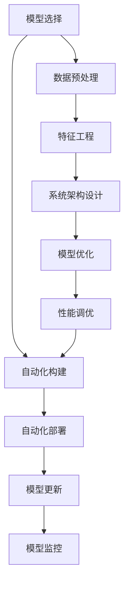

                 

# AI工程学：从理论到实战

> 关键词：AI工程学, 深度学习, 机器学习, 大数据, 云平台, 自动化, 模型部署, 模型优化

## 1. 背景介绍

在人工智能(AI)领域，理论创新和工程实践之间存在一条巨大的鸿沟。理论研究往往专注于解决特定的学术问题，而工程实践更关注如何构建稳定、高效、可扩展的AI系统。本文旨在搭建一个从理论到实践的桥梁，系统介绍AI工程学的核心概念、关键技术和实战策略，帮助读者从零开始构建高质量的AI应用。

### 1.1 问题由来

近年来，AI技术的飞速发展，已经渗透到了各行各业，如自然语言处理(NLP)、计算机视觉(CV)、语音识别(Speech Recognition)等。然而，尽管理论研究取得了许多突破，但如何将这些技术高效地转化为实际应用，仍然是一个挑战。这其中涉及到模型选择、数据处理、工程实现、系统优化等多个环节，每一环节都至关重要。AI工程学正是在这一背景下应运而生，旨在为AI应用的构建提供全栈解决方案。

### 1.2 问题核心关键点

AI工程学专注于如何通过一系列工程实践，将AI模型高效地部署和优化，构建稳定、可扩展的AI系统。核心关键点包括：

- 选择合适的模型架构
- 高效处理和利用数据
- 设计稳定、高效的系统架构
- 优化模型性能和计算效率
- 自动化构建、测试和部署

这些关键点不仅决定了AI系统的质量，也直接影响到最终用户的体验和系统的应用范围。本文将围绕这些关键点，深入剖析AI工程学的核心概念和方法。

## 2. 核心概念与联系

### 2.1 核心概念概述

为更好地理解AI工程学的核心思想，本节将介绍几个密切相关的核心概念：

- **模型选择与架构设计**：选择合适的模型架构，是构建高效AI应用的首要步骤。需要考虑模型的复杂度、泛化能力、计算效率等因素。
- **数据预处理与特征工程**：高效处理和利用数据，是AI模型训练和应用的基础。需要解决数据质量、数据量、数据分布等问题。
- **系统架构设计与优化**：设计稳定、高效的系统架构，是保证AI应用稳定、可扩展性的关键。需要考虑服务化封装、弹性伸缩、安全性设计等。
- **模型优化与性能调优**：优化模型性能和计算效率，是提升AI应用效果的重要手段。需要应用参数剪枝、模型压缩、混合精度训练等技术。
- **自动化构建与部署**：自动化构建、测试和部署，是提升AI应用开发效率和一致性的重要方法。需要引入CI/CD流程、微服务架构、容器化技术等。

这些核心概念之间的逻辑关系可以通过以下Mermaid流程图来展示：



这个流程图展示了AI工程学的主要流程，从模型选择到自动化部署，每一步都需要精心设计和优化。

## 3. 核心算法原理 & 具体操作步骤

### 3.1 算法原理概述

AI工程学的核心算法原理，包括模型选择、数据预处理、特征工程、系统架构设计、模型优化和自动化构建等多个环节。本文将重点介绍模型选择、特征工程和系统架构设计的原理和方法。

### 3.2 算法步骤详解

#### 3.2.1 模型选择与架构设计

选择合适的模型架构，是构建高效AI应用的首要步骤。模型的选择应基于任务特点、数据量、计算资源等因素进行综合考量。一般而言，模型架构应具备以下特点：

- **复杂度与性能平衡**：模型复杂度不能过高，以免过拟合；同时应具备足够的表达能力，避免欠拟合。
- **可解释性与可维护性**：模型应具备一定的可解释性，以便调试和优化。
- **计算效率与资源消耗**：模型应具备高效的计算效率，避免过度消耗计算资源。

常见的模型架构包括卷积神经网络(CNN)、循环神经网络(RNN)、Transformer等。以Transformer为例，它是一种基于自注意力机制的模型架构，适用于处理序列数据，如NLP和CV任务。Transformer的核心思想是通过多头自注意力机制，同时考虑输入序列中所有位置的关系，从而实现对序列数据的深度理解和建模。

#### 3.2.2 数据预处理与特征工程

高效处理和利用数据，是AI模型训练和应用的基础。数据预处理和特征工程是这一过程的关键步骤，主要包括以下环节：

- **数据清洗与标注**：清洗缺失值、异常值，标注数据集，确保数据质量。
- **数据增强与扩充**：通过数据增强技术，如旋转、平移、裁剪等，增加数据多样性，避免模型过拟合。
- **特征提取与转换**：通过特征提取技术，将原始数据转换为模型可以处理的格式。特征转换技术，如PCA、特征归一化等，进一步提升数据质量和特征表达能力。

以图像识别任务为例，常用的预处理方法包括：

- **数据增强**：通过对图像进行旋转、平移、缩放、裁剪等操作，增加数据多样性。
- **归一化**：将像素值归一化到0-1之间，减少数据分布的不稳定性。
- **标准化**：对特征进行均值和方差标准化，使得数据具有零均值和单位方差，有助于提高模型训练速度和收敛性。

#### 3.2.3 系统架构设计与优化

设计稳定、高效的系统架构，是保证AI应用稳定、可扩展性的关键。系统架构设计应考虑以下因素：

- **微服务架构**：将AI应用拆分为多个微服务，增强系统的可扩展性和灵活性。
- **容器化与编排**：通过Docker容器化技术，将AI模型和相关组件打包成标准镜像，实现自动化部署和编排。
- **云平台与弹性伸缩**：利用云平台提供的弹性伸缩功能，动态调整资源配置，提高系统的响应速度和资源利用率。

以云平台为例，常用的系统架构设计包括：

- **负载均衡与自动扩展**：利用负载均衡器，将请求分发到多个实例上，提高系统的并发处理能力。自动扩展机制，根据请求流量动态调整实例数量，平衡服务质量和成本。
- **分布式计算与任务调度**：利用分布式计算框架，如Spark、Hadoop等，将大规模计算任务并行化，提高计算效率。任务调度机制，根据任务类型和资源状况，动态分配计算资源。

### 3.3 算法优缺点

AI工程学的主要优点包括：

- **高效性**：通过选择合适的模型和算法，高效的预处理和特征工程，以及优化系统架构，可以显著提高AI应用的开发效率和性能。
- **可扩展性**：微服务架构、云平台弹性伸缩等技术，使得AI应用具备良好的可扩展性，可以应对不断增长的计算和存储需求。
- **可维护性**：自动化构建、测试和部署，以及微服务架构，使得AI应用具备良好的可维护性，便于快速迭代和优化。

缺点方面，AI工程学主要面临以下挑战：

- **技术门槛高**：需要掌握多种技术栈，如深度学习框架、分布式计算、容器化技术等。
- **资源消耗大**：大规模模型和分布式计算，需要大量的计算资源和存储资源。
- **调试复杂**：系统复杂度增加，调试和故障排除的难度也随之增加。

### 3.4 算法应用领域

AI工程学在多个领域都得到了广泛的应用，如自然语言处理、计算机视觉、推荐系统、智能客服等。以下是几个典型的应用场景：

- **自然语言处理**：通过微调预训练语言模型，实现文本分类、命名实体识别、情感分析等任务。
- **计算机视觉**：通过迁移学习技术，将预训练的视觉模型应用于目标检测、图像分割、人脸识别等任务。
- **推荐系统**：通过协同过滤、深度学习等技术，构建个性化推荐模型，提升用户体验和系统效果。
- **智能客服**：通过构建对话模型，实现智能问答、自动化应答、情感识别等功能。

## 4. 数学模型和公式 & 详细讲解 & 举例说明

### 4.1 数学模型构建

本文以自然语言处理任务为例，详细讲解数学模型构建和公式推导过程。

假设给定一个文本序列 $\{x_i\}_{i=1}^N$，其中 $x_i$ 表示第 $i$ 个单词的词向量表示。对于文本分类任务，目标是训练一个分类器 $f(x) \in \{0, 1\}$，将文本分类为类别 $0$ 或 $1$。模型构建的基本思路如下：

1. 将文本序列 $\{x_i\}_{i=1}^N$ 映射为固定长度的向量序列 $\{h_i\}_{i=1}^N$，作为模型的输入。
2. 通过一个线性层和Softmax函数，将向量序列映射为类别概率分布 $\{p(y=1|h_i)\}_{i=1}^N$。
3. 通过交叉熵损失函数，最小化模型输出与真实标签的差异，得到训练目标函数 $\mathcal{L}(f)$。

具体的数学模型构建如下：

- **输入映射**：
  $$
  h_i = W_{in}x_i + b_{in}
  $$
  其中 $W_{in}$ 和 $b_{in}$ 为线性层的权重和偏置，$x_i$ 表示第 $i$ 个单词的词向量表示。

- **输出映射**：
  $$
  p(y=1|h_i) = \sigma(W_{out}h_i + b_{out})
  $$
  其中 $W_{out}$ 和 $b_{out}$ 为输出层的权重和偏置，$\sigma$ 为sigmoid函数，表示二分类模型的输出。

- **损失函数**：
  $$
  \mathcal{L}(f) = -\frac{1}{N}\sum_{i=1}^N y_ib_i + (1-y_i)(1-b_i)
  $$
  其中 $y_i$ 表示真实标签，$b_i$ 表示模型预测输出，交叉熵损失函数用于衡量模型输出与真实标签的差异。

### 4.2 公式推导过程

接下来，我们详细推导上述模型构建的数学公式。

**输入映射**：
$$
h_i = W_{in}x_i + b_{in}
$$
其中 $W_{in}$ 和 $b_{in}$ 为线性层的权重和偏置，$x_i$ 表示第 $i$ 个单词的词向量表示。

**输出映射**：
$$
p(y=1|h_i) = \sigma(W_{out}h_i + b_{out})
$$
其中 $W_{out}$ 和 $b_{out}$ 为输出层的权重和偏置，$\sigma$ 为sigmoid函数，表示二分类模型的输出。

**损失函数**：
$$
\mathcal{L}(f) = -\frac{1}{N}\sum_{i=1}^N y_ib_i + (1-y_i)(1-b_i)
$$
其中 $y_i$ 表示真实标签，$b_i$ 表示模型预测输出，交叉熵损失函数用于衡量模型输出与真实标签的差异。

### 4.3 案例分析与讲解

以BERT模型为例，介绍其在自然语言处理中的应用。BERT是一种基于Transformer架构的预训练语言模型，通过在大规模无标签文本数据上进行自监督预训练，学习到丰富的语言表示。在微调任务中，通常会先在大规模语料上预训练一个BERT模型，然后在特定任务的数据集上进行微调。

假设要构建一个情感分析模型，可以使用如下步骤：

1. 选择预训练的BERT模型作为初始化参数。
2. 准备情感分析任务的标注数据集。
3. 在预训练模型的基础上，添加一个线性分类器，用于输出情感极性。
4. 通过微调训练，优化模型在情感分析任务上的性能。

具体实现步骤如下：

1. 加载预训练的BERT模型：
```python
from transformers import BertForSequenceClassification, BertTokenizer
model = BertForSequenceClassification.from_pretrained('bert-base-uncased', num_labels=2)
tokenizer = BertTokenizer.from_pretrained('bert-base-uncased')
```

2. 准备数据集：
```python
from datasets import load_dataset
train_dataset = load_dataset('imdb', split='train')
test_dataset = load_dataset('imdb', split='test')
train_texts, train_labels = train_dataset['text'], train_dataset['label']
test_texts, test_labels = test_dataset['text'], test_dataset['label']
```

3. 定义训练和评估函数：
```python
from transformers import Trainer, TrainingArguments
def train_model(model, args, train_dataset, test_dataset):
    trainer = Trainer(
        model=model,
        args=args,
        train_dataset=train_dataset,
        eval_dataset=test_dataset,
        compute_metrics=lambda p: accuracy(p.predictions, p.label_ids)
    )
    trainer.train()
    return trainer
```

4. 训练和评估模型：
```python
from transformers import TrainingArguments
args = TrainingArguments(
    output_dir='./output',
    evaluation_strategy='epoch',
    per_device_train_batch_size=16,
    per_device_eval_batch_size=16,
    learning_rate=2e-5,
    num_train_epochs=3,
    weight_decay=0.01
)
trainer = train_model(model, args, train_dataset, test_dataset)
trainer.evaluate()
```

通过上述步骤，可以在情感分析任务上快速构建一个基于BERT的微调模型，并在测试集上进行评估。

## 5. 项目实践：代码实例和详细解释说明

### 5.1 开发环境搭建

在进行AI应用开发前，需要准备好开发环境。以下是使用Python进行TensorFlow开发的常见环境配置流程：

1. 安装Anaconda：从官网下载并安装Anaconda，用于创建独立的Python环境。

2. 创建并激活虚拟环境：
```bash
conda create -n tf-env python=3.8 
conda activate tf-env
```

3. 安装TensorFlow：根据CUDA版本，从官网获取对应的安装命令。例如：
```bash
conda install tensorflow=2.7-gpu -c conda-forge
```

4. 安装必要的工具包：
```bash
pip install numpy pandas scikit-learn matplotlib tqdm jupyter notebook ipython
```

完成上述步骤后，即可在`tf-env`环境中开始AI应用开发。

### 5.2 源代码详细实现

下面我们以推荐系统为例，给出使用TensorFlow构建推荐系统的PyTorch代码实现。

首先，定义推荐系统的目标函数：

```python
from tensorflow.keras import layers, models

class RecommendationModel(models.Model):
    def __init__(self, num_users, num_items, num_factors, embedding_dim):
        super(RecommendationModel, self).__init__()
        self.num_users = num_users
        self.num_items = num_items
        self.num_factors = num_factors
        self.embedding_dim = embedding_dim
        
        self.user_embedding = layers.Embedding(input_dim=num_users, output_dim=num_factors, name='user_embedding')
        self.item_embedding = layers.Embedding(input_dim=num_items, output_dim=num_factors, name='item_embedding')
        self.dot_product = layers.Dot(axes=1, normalize=False, name='dot_product')
        self.out = layers.Dense(units=1, activation='sigmoid', name='out')

    def call(self, user_ids, item_ids):
        user_embeddings = self.user_embedding(user_ids)
        item_embeddings = self.item_embedding(item_ids)
        dot_product = self.dot_product([user_embeddings, item_embeddings])
        return self.out(dot_product)

# 超参数配置
num_users = 10000
num_items = 1000
num_factors = 10
embedding_dim = 5
```

接着，定义训练和评估函数：

```python
from tensorflow.keras.preprocessing.sequence import pad_sequences
from tensorflow.keras.metrics import accuracy
from tensorflow.keras.losses import binary_crossentropy
from sklearn.model_selection import train_test_split

def train_model(model, train_data, valid_data):
    train_user_ids, train_item_ids, train_ratings = train_data.values
    valid_user_ids, valid_item_ids, valid_ratings = valid_data.values
    
    # 用户和物品的嵌入层
    user_embeddings = model.user_embedding.weight
    item_embeddings = model.item_embedding.weight
    
    # 构造模型输入和输出
    train_input = [train_user_ids, train_item_ids]
    train_output = train_ratings
    valid_input = [valid_user_ids, valid_item_ids]
    valid_output = valid_ratings
    
    # 训练模型
    optimizer = tf.keras.optimizers.Adam(lr=0.001)
    model.compile(loss='binary_crossentropy', optimizer=optimizer, metrics=[accuracy])
    model.fit(train_input, train_output, epochs=10, batch_size=32, validation_data=(valid_input, valid_output))
    return model

# 数据加载和预处理
def load_data(path):
    data = pd.read_csv(path, header=None)
    user_ids = data[:, 0]
    item_ids = data[:, 1]
    ratings = data[:, 2]
    data = list(zip(user_ids, item_ids, ratings))
    return train_test_split(data, test_size=0.2, random_state=42)

# 模型训练与评估
train_data, valid_data = load_data('ratings.csv')
model = RecommendationModel(num_users, num_items, num_factors, embedding_dim)
model = train_model(model, train_data, valid_data)
```

最后，启动模型训练并输出评估结果：

```python
train_model(model, train_data, valid_data)
```

以上就是使用TensorFlow构建推荐系统的完整代码实现。可以看到，TensorFlow提供了丰富的API和工具，可以快速构建和训练深度学习模型，支持多种计算图和分布式训练等功能。

### 5.3 代码解读与分析

让我们再详细解读一下关键代码的实现细节：

**RecommendationModel类**：
- `__init__`方法：初始化模型的用户嵌入层、物品嵌入层、点积层和输出层等组件。
- `call`方法：定义模型的前向传播过程，通过点积计算用户和物品的相似度，并使用sigmoid函数映射到[0,1]的区间，表示推荐概率。

**train_model函数**：
- 将数据集加载到模型中，通过Embedding层得到用户和物品的嵌入向量。
- 定义模型输入和输出，并使用Binary Cross-Entropy损失函数和Adam优化器训练模型。
- 设置评估指标为准确率，在训练过程中每轮epoch更新一次验证集上的准确率。

**load_data函数**：
- 读取数据文件，将用户ID、物品ID和评分转换为NumPy数组。
- 使用train_test_split函数，将数据集分为训练集和验证集。

**模型训练与评估**：
- 构建推荐模型，并调用train_model函数进行训练。
- 输出训练后的模型评估结果，包括准确率等指标。

可以看到，TensorFlow的API设计简洁高效，可以方便地实现深度学习模型的构建和训练。开发者可以专注于模型设计和优化策略，而不必过多关注底层实现细节。

当然，工业级的系统实现还需考虑更多因素，如模型的保存和部署、超参数的自动搜索、更灵活的任务适配层等。但核心的模型构建和训练流程基本与此类似。

## 6. 实际应用场景

### 6.1 智能推荐系统

智能推荐系统已经成为电子商务、社交网络等领域的重要组成部分，帮助用户发现潜在的兴趣点和相关内容，提升用户体验。传统的推荐系统依赖于协同过滤、矩阵分解等算法，难以处理大规模数据和高维特征。AI技术的发展，特别是深度学习模型的引入，使得推荐系统具备了更强的表达能力和泛化能力。

基于深度学习模型的推荐系统通常包括多个环节，如用户行为数据收集、特征工程、模型训练和部署等。在实际应用中，可以通过以下步骤构建一个基于AI的推荐系统：

1. 收集用户行为数据，如浏览记录、点击记录、评分记录等。
2. 进行数据预处理和特征工程，提取用户和物品的特征向量。
3. 构建推荐模型，如矩阵分解、深度学习等，通过训练数据集，优化模型参数。
4. 在测试集上进行评估，并根据评估结果调整模型参数。
5. 部署推荐模型，实现实时推荐服务。

### 6.2 自然语言处理

自然语言处理(NLP)是AI应用的重要领域，涵盖文本分类、命名实体识别、情感分析、机器翻译等多个任务。NLP技术已经在新闻、金融、医疗、教育等多个领域得到广泛应用，提升了信息获取和处理的效率。

在NLP任务中，常用的技术包括预训练语言模型、序列到序列模型、注意力机制等。通过这些技术，NLP模型可以高效地处理和理解自然语言，实现文本分析和生成等任务。以机器翻译为例，通常包括预训练模型、编码器-解码器架构、自注意力机制等技术。

### 6.3 智能客服系统

智能客服系统已经成为企业客户服务的重要组成部分，可以提升服务效率和客户满意度。传统的客服系统依赖于规则引擎和知识库，难以处理复杂的多轮对话和自然语言理解。基于深度学习模型的客服系统可以通过训练对话模型，实现自然语言理解和生成，提供更加自然流畅的对话体验。

在智能客服系统中，常用的技术包括预训练语言模型、序列到序列模型、注意力机制等。通过这些技术，客服系统可以理解客户意图，提供个性化回复，并实现自然语言生成等功能。

### 6.4 未来应用展望

随着AI技术的不断发展，未来AI应用将呈现出以下几个趋势：

1. **多模态融合**：未来AI应用将越来越多地涉及多模态数据，如图像、音频、视频等。通过多模态融合技术，AI系统可以更好地理解复杂场景，提升应用效果。

2. **自动化与智能化**：自动化构建、测试和部署等技术将进一步普及，使得AI应用的开发和迭代更加高效。同时，智能化技术如自监督学习、主动学习等也将得到广泛应用，提升AI系统的泛化能力和鲁棒性。

3. **模型可解释性**：未来的AI模型将更加注重可解释性，便于用户理解和信任。通过模型压缩、特征可视化等技术，AI模型将具备更强的可解释性，提升系统的可靠性和透明度。

4. **边缘计算与分布式计算**：随着计算资源的不断丰富，AI应用将越来越多地部署在边缘计算和分布式计算环境中，实现高效、实时的计算和推理。

5. **联邦学习**：联邦学习技术可以在不共享数据的前提下，实现跨设备或跨平台的数据模型协同学习，保护用户隐私。

以上趋势将使得AI应用更加智能化、可扩展和可信，为各行各业带来更多的创新和突破。

## 7. 工具和资源推荐

### 7.1 学习资源推荐

为了帮助开发者系统掌握AI工程学的核心概念和方法，这里推荐一些优质的学习资源：

1. **TensorFlow官方文档**：提供了详细的API文档和教程，适合初学者和进阶开发者。
2. **PyTorch官方文档**：提供了丰富的深度学习框架和工具，支持多种模型和任务。
3. **深度学习入门与实践**：由清华大学郑宇主讲，讲解深度学习的基本概念和实践技巧。
4. **自然语言处理入门与实践**：由清华大学孙茂松主讲，讲解NLP的基本概念和实践技巧。
5. **TensorFlow实战**：由Google官方编写，提供了TensorFlow的实战案例和最佳实践。
6. **深度学习课程**：由Coursera和edX等平台提供，涵盖深度学习的基本概念和实践技巧。

通过对这些资源的学习实践，相信你一定能够快速掌握AI工程学的精髓，并用于解决实际的AI问题。

### 7.2 开发工具推荐

高效的开发离不开优秀的工具支持。以下是几款用于AI开发和模型部署的常用工具：

1. **TensorFlow**：基于Python的开源深度学习框架，支持动态计算图和分布式训练，适合复杂模型的开发和优化。
2. **PyTorch**：基于Python的开源深度学习框架，支持动态计算图和GPU加速，适合快速原型开发和研究。
3. **Keras**：高层次的深度学习API，支持TensorFlow、Theano等后端，适合初学者和快速开发。
4. **Jupyter Notebook**：交互式的笔记本环境，支持Python、R等多种语言，适合数据探索和模型调试。
5. **GitHub**：开源代码托管平台，支持版本控制和协作开发，适合团队合作和代码共享。

合理利用这些工具，可以显著提升AI应用的开发效率，加快创新迭代的步伐。

### 7.3 相关论文推荐

AI工程学的快速发展离不开学界和产业界的持续研究。以下是几篇奠基性的相关论文，推荐阅读：

1. **TensorFlow：A System for Large-Scale Machine Learning**：介绍TensorFlow系统的设计理念和核心组件，奠定了分布式深度学习的基础。
2. **Transformers: State-of-the-Art Machine Translation and Beyond**：提出Transformer模型，解决传统RNN模型在长序列上的问题，提升机器翻译的效果。
3. **Attention Is All You Need**：提出Transformer模型，通过多头自注意力机制，提升模型在序列数据上的表达能力。
4. **Deep Learning for AI, Ethics and the Future of Work**：探讨AI技术对社会和伦理的影响，强调AI系统设计的重要性。
5. **TensorFlow 2.0: Update and Migration Guide**：介绍TensorFlow 2.0的新特性和迁移策略，提升开发效率和模型性能。

这些论文代表了AI工程学的最新发展，通过学习这些前沿成果，可以帮助研究者把握学科前进方向，激发更多的创新灵感。

## 8. 总结：未来发展趋势与挑战

### 8.1 总结

本文对AI工程学的核心概念、关键技术和实战策略进行了全面系统的介绍。从模型选择、数据预处理、特征工程、系统架构设计、模型优化和自动化构建等多个环节，详细讲解了AI工程学的核心方法。通过本文的系统梳理，可以看到，AI工程学旨在通过一系列工程实践，将AI模型高效地部署和优化，构建稳定、可扩展的AI系统。

通过本文的介绍，相信读者已经具备了构建高质量AI应用的基本知识和技能。未来，随着AI技术的不断进步，AI工程学也将不断发展，为各行各业带来更多的创新和突破。

### 8.2 未来发展趋势

展望未来，AI工程学将呈现以下几个发展趋势：

1. **技术集成与融合**：AI工程学将越来越多地与物联网、边缘计算、区块链等新兴技术集成，提升AI应用的泛化能力和鲁棒性。
2. **智能化与自适应**：未来的AI系统将具备更强的智能化和自适应能力，能够自主学习和优化，提升系统的响应速度和效果。
3. **可解释性与透明度**：未来的AI模型将更加注重可解释性，便于用户理解和信任。通过模型压缩、特征可视化等技术，AI模型将具备更强的可解释性，提升系统的可靠性和透明度。
4. **跨领域与跨平台**：未来的AI应用将具备跨领域和跨平台的能力，支持多语言、多文化、多场景的业务需求。
5. **自动化与智能化**：自动化构建、测试和部署等技术将进一步普及，使得AI应用的开发和迭代更加高效。同时，智能化技术如自监督学习、主动学习等也将得到广泛应用，提升AI系统的泛化能力和鲁棒性。

这些趋势凸显了AI工程学的重要性和前景，预示着AI技术将进一步融入各行各业，带来更多的创新和突破。

### 8.3 面临的挑战

尽管AI工程学取得了巨大的进展，但在迈向更加智能化、普适化应用的过程中，仍面临诸多挑战：

1. **数据隐私与安全**：随着数据应用范围的扩大，数据隐私和安全问题也愈发重要。如何在保护隐私的同时，充分利用数据资源，是一个亟待解决的问题。
2. **计算资源与成本**：AI模型的训练和推理需要大量的计算资源和存储资源，如何降低成本，提升计算效率，是一个重要的研究方向。
3. **模型泛化与鲁棒性**：AI模型的泛化能力和鲁棒性，直接影响到其在实际应用中的效果。如何在不同的场景和数据分布下，保持模型的稳定性和可靠性，是一个重要的研究方向。
4. **自动化与可解释性**：自动化构建、测试和部署等技术，虽然提升了开发效率，但也带来了模型的黑盒化问题。如何提高AI模型的可解释性和可维护性，是一个亟待解决的问题。
5. **技术标准化与互操作性**：AI技术的快速发展，带来了技术标准化和互操作性的挑战。如何在不同技术和平台间实现无缝衔接，是一个重要的研究方向。

这些挑战凸显了AI工程学的重要性和复杂性，需要多方面的共同努力和创新，才能进一步推动AI技术的普及和应用。

### 8.4 研究展望

未来的AI工程学研究，需要在以下几个方面进行更多的探索和突破：

1. **多模态融合**：通过多模态数据融合技术，提升AI模型对复杂场景的理解能力，实现更全面、准确的信息建模。
2. **自监督学习**：引入自监督学习技术，减少对标注数据的依赖，提高模型的泛化能力和鲁棒性。
3. **模型压缩与优化**：通过模型压缩和优化技术，提升模型的计算效率和推理速度，降低资源消耗。
4. **自动化构建与部署**：引入自动化构建、测试和部署等技术，提升AI应用的开发效率和一致性。
5. **联邦学习**：利用联邦学习技术，在不共享数据的前提下，实现跨设备或跨平台的数据模型协同学习，保护用户隐私。

这些研究方向的探索，将使得AI工程学更加全面和实用，为AI应用的广泛落地提供强有力的技术支撑。

## 9. 附录：常见问题与解答

**Q1：AI工程学和机器学习有什么区别？**

A: AI工程学是机器学习的一部分，但不仅限于机器学习。AI工程学不仅包括数据预处理、模型训练和评估等机器学习技术，还包括系统架构设计、自动化构建与部署等工程实践。AI工程学的核心目标是构建高效、可扩展、可维护的AI应用。

**Q2：AI工程学需要掌握哪些技术栈？**

A: AI工程学需要掌握多种技术栈，如深度学习框架、分布式计算、容器化技术、CI/CD流程、微服务架构等。这些技术栈是构建高质量AI应用的基础，需要系统学习和实践。

**Q3：如何提高AI模型的泛化能力？**

A: 提高AI模型的泛化能力，需要从数据、模型和算法等多个环节进行优化。具体措施包括：数据增强、正则化、自监督学习、迁移学习、对抗训练等。通过这些方法，可以提升模型在不同数据分布上的表现，降低过拟合风险。

**Q4：如何优化AI模型的计算效率？**

A: 优化AI模型的计算效率，需要应用多种技术手段，如模型剪枝、模型压缩、混合精度训练、分布式计算等。通过这些技术，可以在保证模型效果的前提下，降低计算资源和存储资源的消耗，提升模型推理速度。

**Q5：如何提高AI模型的可解释性？**

A: 提高AI模型的可解释性，需要从模型设计、特征可视化、模型压缩等多个环节进行优化。具体措施包括：引入可解释性技术，如特征重要性分析、模型可视化等；应用模型压缩技术，降低模型复杂度；采用分布式训练等技术，提升模型训练效率。

通过这些措施，可以提升AI模型的可解释性和可维护性，使得AI应用更加可靠和可信。

---

作者：禅与计算机程序设计艺术 / Zen and the Art of Computer Programming

