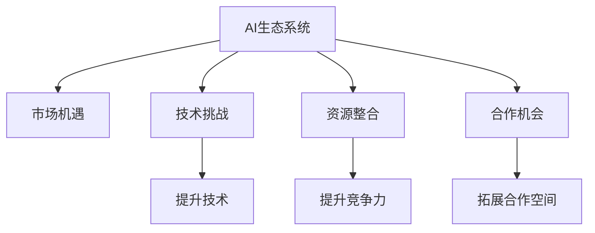

                 

# AI巨头的生态系统战略对创业公司的影响

在当今数字化转型和人工智能(AI)技术迅猛发展的时代，大公司如Google、Facebook、Amazon、Microsoft等，不仅在核心技术上持续创新，还在构建庞大的生态系统方面投入了大量资源。这些生态系统包括云计算服务、大数据平台、应用市场、开发者社区、API接口等等，为AI技术的应用提供了全方位的支持。这种生态系统战略不仅改变了技术的发展轨迹，也对创业公司带来了深远的影响。本文将深入探讨AI巨头生态系统战略对创业公司的影响，包括市场机遇、技术挑战、资源整合、合作机会等方面，为创业者提供有价值的洞察和建议。

## 1. 背景介绍

### 1.1 问题由来
随着AI技术的日益成熟，各大公司纷纷推出各自的AI生态系统。例如，Google推出了TensorFlow生态，Facebook构建了PyTorch生态，Amazon提供了Alexa平台，Microsoft提供了Azure AI。这些生态系统不仅涵盖了AI技术的各个方面，还通过开源、合作、投资等方式，吸引和培养了大量的开发者和用户。这些生态系统为AI技术的应用提供了强大的基础设施支持，同时也为创业公司提供了广阔的市场机遇和合作空间。

### 1.2 问题核心关键点
AI巨头生态系统战略对创业公司的影响主要体现在以下几个方面：

1. **市场机遇**：大公司的生态系统为AI技术的应用提供了丰富的场景和用户，创业公司可以通过这些生态系统快速进入市场。
2. **技术挑战**：创业公司需要与大公司竞争，提升自己的技术实力和创新能力。
3. **资源整合**：大公司的生态系统整合了各种资源，创业公司可以借助这些资源提升自身的竞争力。
4. **合作机会**：大公司提供API、工具、基础设施等服务，创业公司可以借助这些服务进行技术开发和应用部署。

理解这些关键点，有助于创业者更好地制定战略，抓住市场机遇，应对技术挑战，整合资源，拓展合作机会。

## 2. 核心概念与联系

### 2.1 核心概念概述

为更好地理解AI巨头生态系统战略对创业公司的影响，本节将介绍几个密切相关的核心概念：

- **AI生态系统**：指由AI技术、应用场景、开发者、用户等构成的完整系统。通过生态系统的各个环节相互协作，促进AI技术的快速发展和广泛应用。

- **市场机遇**：指AI技术在不同领域和场景中的应用需求。创业公司可以通过参与大公司的生态系统，快速进入有潜力的市场。

- **技术挑战**：指创业公司需要与大公司竞争，提升自身的技术实力和创新能力。

- **资源整合**：指创业公司可以借助大公司提供的各种资源，如云计算、大数据、API接口等，提升自身的竞争力和效率。

- **合作机会**：指创业公司可以与大公司合作，进行联合开发、市场推广等，拓展合作空间。

这些核心概念之间的逻辑关系可以通过以下Mermaid流程图来展示：



这个流程图展示了大公司AI生态系统对创业公司影响的核心概念及其之间的关系：

1. 大公司通过构建AI生态系统，为市场提供丰富的应用场景和需求。
2. 创业公司通过参与生态系统，快速进入市场。
3. 创业公司需要提升技术实力和创新能力，以应对与大公司的竞争。
4. 创业公司可以借助大公司提供的资源，提升自身的竞争力和效率。
5. 创业公司可以与大公司进行合作，拓展市场和创新空间。

这些概念共同构成了AI巨头生态系统战略对创业公司影响的框架，使得创业者能够更好地理解和利用这些战略所带来的机会和挑战。

## 3. 核心算法原理 & 具体操作步骤
### 3.1 算法原理概述

AI巨头构建的生态系统，本质上是一种平台经济。平台通过提供基础设施、工具、市场等资源，吸引和培养开发者和用户。创业公司可以通过这些资源快速进入市场，进行技术开发和应用部署。

生态系统的核心在于资源整合和共享。通过构建开放、互利的生态系统，大公司能够吸引大量的开发者和用户，形成正反馈循环。而创业公司可以通过生态系统提供的资源和支持，快速提升自身竞争力。

### 3.2 算法步骤详解

以下是AI巨头生态系统战略对创业公司影响的具体操作步骤：

**Step 1: 选择合适的生态系统**
- 创业公司需要选择合适的AI生态系统，包括云计算平台、API接口、开发者社区等，以便快速进入市场。

**Step 2: 评估资源整合**
- 创业公司需要评估大公司生态系统提供的资源，包括云计算服务、大数据平台、工具库等，评估其对自身开发和应用的支持程度。

**Step 3: 获取技术和人才**
- 创业公司可以通过生态系统获取技术资源和人才支持，提升自身的技术实力和创新能力。

**Step 4: 进行市场推广**
- 创业公司可以利用大公司生态系统提供的市场渠道和工具，进行市场推广和用户获取。

**Step 5: 拓展合作伙伴**
- 创业公司可以与大公司建立合作关系，进行联合开发、市场推广等，拓展市场和创新空间。

**Step 6: 持续优化和迭代**
- 创业公司需要不断优化和迭代自身产品，提升用户体验和技术实力，以应对市场竞争和技术变化。

### 3.3 算法优缺点

AI巨头生态系统战略对创业公司的影响，主要体现在以下几个方面：

**优点**：

1. **快速进入市场**：大公司的生态系统提供了丰富的市场资源，创业公司可以快速进入有潜力的市场。
2. **提升技术实力**：创业公司可以借助大公司提供的技术资源和人才支持，提升自身的技术实力和创新能力。
3. **共享基础设施**：创业公司可以借助大公司提供的云计算、大数据等基础设施，降低技术开发和应用部署的门槛。
4. **拓展合作机会**：创业公司可以与大公司建立合作关系，进行联合开发、市场推广等，拓展市场和创新空间。

**缺点**：

1. **竞争压力**：创业公司需要与大公司竞争，提升自身的技术实力和创新能力，才能在市场中获得一席之地。
2. **依赖性**：创业公司对大公司生态系统的依赖性较高，一旦生态系统发生变化，可能对自身的业务产生影响。
3. **风险控制**：创业公司需要慎重选择生态系统，避免过度依赖某一家大公司，以降低潜在的风险。

### 3.4 算法应用领域

AI巨头生态系统战略对创业公司的影响，广泛适用于各个AI技术领域，例如：

- 计算机视觉：创业公司可以通过参与大公司的生态系统，快速进入图像识别、目标检测等市场。
- 自然语言处理(NLP)：创业公司可以借助大公司的语言模型、工具库等资源，提升自身的NLP技术能力。
- 机器学习：创业公司可以借助大公司的数据集、算法库等资源，进行模型训练和应用部署。
- 语音识别：创业公司可以利用大公司提供的语音识别API、工具等，快速开发语音应用。
- 智能推荐：创业公司可以利用大公司提供的推荐算法、数据平台等资源，提升推荐系统的精准度和用户体验。

这些领域中的创业公司，都可以借助大公司生态系统的资源和支持，快速提升自身竞争力，快速进入市场，拓展合作空间。

## 4. 数学模型和公式 & 详细讲解  
### 4.1 数学模型构建

为了更好地理解AI巨头生态系统战略对创业公司的影响，我们可以构建一个简化的数学模型。

假设大公司生态系统的市场规模为$M$，创业公司的市场占有率为$x$，则创业公司通过生态系统进入市场的潜在收益为$P$。模型如下：

$$
P = M \times x
$$

其中$x$的取值范围为$(0,1)$，表示创业公司市场占有率的极大值。

### 4.2 公式推导过程

根据上述模型，我们可以进行如下推导：

1. **市场占有率计算**：
   $$
   x = \frac{P}{M}
   $$

2. **市场规模计算**：
   $$
   M = \frac{P}{x}
   $$

3. **收益最大化**：
   $$
   \max P = M \times x
   $$

其中$M$为市场规模，$x$为创业公司的市场占有率，$P$为创业公司通过生态系统进入市场的潜在收益。

### 4.3 案例分析与讲解

以计算机视觉领域为例，假设大公司的生态系统市场规模为$M=10^8$，创业公司的市场占有率为$x=0.1$，则创业公司通过生态系统进入市场的潜在收益为$P=10^7$。

根据模型推导，创业公司需要不断提升自身的技术实力和市场占有率，才能在生态系统中获得更大的收益。同时，创业公司需要选择合适的生态系统，最大化自身的收益。

## 5. 项目实践：代码实例和详细解释说明
### 5.1 开发环境搭建

在进行项目实践前，我们需要准备好开发环境。以下是使用Python进行TensorFlow开发的环境配置流程：

1. 安装Anaconda：从官网下载并安装Anaconda，用于创建独立的Python环境。

2. 创建并激活虚拟环境：
```bash
conda create -n tf-env python=3.8 
conda activate tf-env
```

3. 安装TensorFlow：根据CUDA版本，从官网获取对应的安装命令。例如：
```bash
conda install tensorflow tensorflow-gpu=cuda11.1 -c conda-forge
```

4. 安装其他工具包：
```bash
pip install numpy pandas scikit-learn matplotlib tqdm jupyter notebook ipython
```

完成上述步骤后，即可在`tf-env`环境中开始项目实践。

### 5.2 源代码详细实现

这里我们以计算机视觉任务为例，给出使用TensorFlow进行YOLOv3模型训练和微调的PyTorch代码实现。

首先，定义数据集处理函数：

```python
from tensorflow.keras.preprocessing.image import ImageDataGenerator
from tensorflow.keras.applications import ResNet50

def create_data_generator(train_dir, val_dir, batch_size=32):
    train_datagen = ImageDataGenerator(rescale=1./255)
    train_generator = train_datagen.flow_from_directory(
        train_dir,
        target_size=(224, 224),
        batch_size=batch_size,
        class_mode='binary')
    
    val_datagen = ImageDataGenerator(rescale=1./255)
    val_generator = val_datagen.flow_from_directory(
        val_dir,
        target_size=(224, 224),
        batch_size=batch_size,
        class_mode='binary')
    
    return train_generator, val_generator
```

然后，定义模型和优化器：

```python
from tensorflow.keras.models import Model
from tensorflow.keras.layers import Input, Flatten, Dense, Dropout, Activation
from tensorflow.keras.optimizers import Adam

def create_model(input_shape, num_classes):
    inputs = Input(shape=input_shape)
    x = ResNet50(include_top=False, input_tensor=inputs)(x)
    x = Flatten()(x)
    x = Dense(1024, activation='relu')(x)
    x = Dropout(0.5)(x)
    outputs = Dense(num_classes, activation='sigmoid')(x)
    model = Model(inputs=inputs, outputs=outputs)
    
    model.compile(optimizer=Adam(lr=1e-4), loss='binary_crossentropy', metrics=['accuracy'])
    
    return model
```

接着，定义训练和评估函数：

```python
def train_epoch(model, train_generator, val_generator, batch_size):
    model.fit_generator(
        train_generator,
        steps_per_epoch=train_generator.n // batch_size,
        epochs=10,
        validation_data=val_generator,
        validation_steps=val_generator.n // batch_size)
    
    return model
```

最后，启动训练流程并在测试集上评估：

```python
train_dir = 'train/'
val_dir = 'val/'
input_shape = (224, 224, 3)
num_classes = 2

model = create_model(input_shape, num_classes)
train_generator, val_generator = create_data_generator(train_dir, val_dir)
model = train_epoch(model, train_generator, val_generator, batch_size)

test_generator = create_data_generator(test_dir, val_dir, batch_size)
test_generator.reset()
test_generator.on_epoch_end()
model.evaluate_generator(test_generator, steps=test_generator.n // batch_size)
```

以上就是使用TensorFlow进行YOLOv3模型训练和微调的完整代码实现。可以看到，通过TensorFlow和Keras，我们可以很方便地构建和训练深度学习模型。

### 5.3 代码解读与分析

让我们再详细解读一下关键代码的实现细节：

**create_data_generator函数**：
- 定义了一个基于ImageDataGenerator的数据集生成器，用于对训练集和验证集进行批次化加载和预处理。

**create_model函数**：
- 定义了一个基于ResNet50模型的二分类模型，并进行了必要的模型层和优化器配置。

**train_epoch函数**：
- 使用Keras的fit_generator方法进行模型训练，同时定义了训练和验证集的数据生成器。

**train和评估流程**：
- 使用训练集数据生成器对模型进行训练，使用验证集数据生成器评估模型性能。
- 在测试集上重新创建数据生成器，并进行模型评估。

可以看到，TensorFlow和Keras的简洁高效，使得深度学习模型的开发和训练变得异常简便。通过这些工具，创业公司可以快速搭建模型，并进行迭代优化，提升自身技术实力和市场竞争力。

## 6. 实际应用场景
### 6.1 智能医疗

大公司的生态系统为智能医疗提供了强大的基础设施支持。例如，Google Cloud提供的医疗大数据平台和AI算法库，Facebook的AI for Health项目，Amazon的Alexa医疗应用等，这些平台和工具为医疗数据的存储、处理和分析提供了重要保障。

创业公司可以通过参与这些生态系统，快速开发智能医疗应用。例如，利用大公司的图像识别API，进行医学影像分析；利用自然语言处理工具，进行病历数据分析；利用语音识别技术，开发智能问诊系统等。

### 6.2 金融科技

金融科技领域同样受益于大公司的生态系统。例如，TensorFlow金融科技生态提供了大量的金融数据集和算法库，IBM Watson的金融应用，Amazon的金融市场分析平台等，这些工具和平台为金融科技应用提供了重要支撑。

创业公司可以利用这些资源，快速开发金融科技应用。例如，利用机器学习模型进行风险评估和信用评分；利用自然语言处理工具，进行金融新闻和公告的情感分析；利用区块链技术，开发金融交易平台等。

### 6.3 智能制造

智能制造是未来工业发展的方向，大公司的生态系统提供了丰富的资源和工具，支持智能制造应用的发展。例如，Google Cloud的物联网平台和AI算法库，Microsoft Azure的工业互联网解决方案，Amazon的AWS IoT等，这些平台和工具为智能制造提供了重要支撑。

创业公司可以利用这些资源，快速开发智能制造应用。例如，利用计算机视觉技术，进行质量检测和缺陷识别；利用机器学习算法，进行预测性维护和设备监控；利用物联网技术，实现智能生产线的自动化控制等。

## 7. 工具和资源推荐
### 7.1 学习资源推荐

为了帮助创业者系统掌握AI生态系统战略的理论基础和实践技巧，这里推荐一些优质的学习资源：

1. **TensorFlow官方文档**：提供了完整的TensorFlow开发指南和API文档，适合初学者和进阶开发者。

2. **Keras官方文档**：提供了Keras框架的详细使用说明和案例示例，适合快速搭建深度学习模型。

3. **PyTorch官方文档**：提供了PyTorch框架的完整文档和教程，适合深度学习研究和应用。

4. **TensorFlow Extended (TFX)**：提供了端到端的AI生产环境构建指南，适合大型企业的AI基础设施建设。

5. **机器学习课程**：Coursera、Udacity等在线平台提供了丰富的机器学习课程，适合系统学习AI理论和实践。

6. **AI生态系统研究**：相关书籍、论文、报告等，提供了关于大公司生态系统战略的深入分析和研究。

通过对这些资源的学习实践，相信你一定能够快速掌握AI生态系统战略的精髓，并将其应用到实际项目中。

### 7.2 开发工具推荐

高效的开发离不开优秀的工具支持。以下是几款用于AI生态系统战略开发的常用工具：

1. **TensorFlow**：基于Python的开源深度学习框架，灵活动态的计算图，适合快速迭代研究。

2. **Keras**：基于TensorFlow的高层API，易于使用，适合快速搭建深度学习模型。

3. **PyTorch**：基于Python的开源深度学习框架，灵活高效，适合深度学习研究和应用。

4. **TensorBoard**：TensorFlow配套的可视化工具，可实时监测模型训练状态，并提供丰富的图表呈现方式。

5. **Weights & Biases**：模型训练的实验跟踪工具，可以记录和可视化模型训练过程中的各项指标。

6. **Jupyter Notebook**：交互式开发环境，支持Python、R等语言的混合开发，适合快速实验和原型开发。

合理利用这些工具，可以显著提升AI生态系统战略的开发效率，加快创新迭代的步伐。

### 7.3 相关论文推荐

大公司生态系统战略的研究源于学界的持续研究。以下是几篇奠基性的相关论文，推荐阅读：

1. **Google Cloud AI & Machine Learning White Paper**：详细介绍了Google Cloud AI平台，包括其提供的各种服务和工具。

2. **Facebook AI Research Overview**：介绍了Facebook的AI研究和应用，包括其在自然语言处理、计算机视觉等领域的成果。

3. **Microsoft Azure AI & Machine Learning**：介绍了Microsoft Azure AI平台，包括其提供的各种服务和工具。

4. **Amazon Web Services AI & Machine Learning**：介绍了Amazon Web Services的AI平台，包括其提供的各种服务和工具。

这些论文代表了大公司生态系统战略的发展脉络。通过学习这些前沿成果，可以帮助研究者把握学科前进方向，激发更多的创新灵感。

## 8. 总结：未来发展趋势与挑战
### 8.1 总结

本文对AI巨头生态系统战略对创业公司的影响进行了全面系统的介绍。首先阐述了AI生态系统战略的背景和意义，明确了生态系统对创业公司的市场机遇、技术挑战、资源整合和合作机会等方面带来的影响。其次，从原理到实践，详细讲解了AI生态系统的构建方法、模型训练和优化步骤，提供了完整的代码实现。同时，本文还探讨了AI生态系统战略在智能医疗、金融科技、智能制造等多个行业领域的应用前景，展示了其广阔的应用空间。此外，本文精选了生态系统战略相关的学习资源和工具，力求为创业者提供全方位的技术指引。

通过本文的系统梳理，可以看到，AI巨头生态系统战略通过提供基础设施、工具、市场等资源，极大地提升了AI技术的应用范围和深度。创业公司可以借助这些资源快速进入市场，提升技术实力，拓展合作机会，加速创新迭代。未来，伴随生态系统的不断完善和优化，相信AI技术将进一步渗透到各行各业，为经济社会发展注入新的动力。

### 8.2 未来发展趋势

展望未来，AI巨头生态系统战略将呈现以下几个发展趋势：

1. **更广泛的应用场景**：随着AI技术的发展，生态系统将进一步拓展到更多领域，如智能交通、智慧城市等，带来更多创新应用。
2. **更丰富的资源支持**：大公司将不断丰富生态系统中的资源，提供更强大的基础设施和工具支持，促进AI技术的快速发展和应用。
3. **更高效的协作机制**：生态系统将引入更高效的协作机制，促进开发者和用户之间的交流和合作，形成更紧密的生态系统。
4. **更灵活的商业模式**：生态系统将探索更灵活的商业模式，如订阅制、开源社区等，吸引更多开发者和用户参与。
5. **更开放的标准和接口**：大公司将推动更开放的标准和接口，促进不同生态系统之间的互操作性，形成更庞大的AI生态系统。

以上趋势凸显了AI巨头生态系统战略的广阔前景。这些方向的探索发展，必将进一步提升AI技术的应用范围和深度，为人类社会的智能化发展提供更强有力的支撑。

### 8.3 面临的挑战

尽管AI巨头生态系统战略带来了广阔的市场机遇和资源支持，但在迈向更加智能化、普适化应用的过程中，它仍面临着诸多挑战：

1. **数据隐私和安全**：生态系统中的数据隐私和安全问题需要得到充分保障，防止数据泄露和滥用。
2. **技术标准不统一**：不同生态系统之间可能存在技术标准不统一的问题，导致资源共享和互操作性受限。
3. **成本和资源消耗**：生态系统的建设和管理需要大量的资源和成本，如何平衡资源投入和应用效益需要进一步研究。
4. **创新和竞争**：大公司的生态系统可能存在创新和竞争不足的问题，如何激发创业公司的创新活力需要进一步探索。
5. **用户体验和易用性**：生态系统需要提供更易用、更高效的用户体验，才能吸引更多的开发者和用户。

这些挑战需要学界和产业界共同努力，推动AI生态系统战略的持续优化和完善。唯有从技术、安全、标准、成本等多个维度协同发力，才能真正实现AI技术的广泛应用和落地。

### 8.4 研究展望

面对AI巨头生态系统战略所面临的种种挑战，未来的研究需要在以下几个方面寻求新的突破：

1. **数据隐私和安全技术**：开发更高效、更安全的数据隐私和安全技术，保护用户数据隐私，防止数据滥用。
2. **技术标准和互操作性**：制定和推广更统一的技术标准和接口，促进不同生态系统之间的互操作性。
3. **成本和资源优化**：探索更高效、更灵活的生态系统资源管理方式，降低生态系统的建设和维护成本。
4. **创新和竞争机制**：建立更灵活的创新和竞争机制，激发创业公司的创新活力，推动生态系统健康发展。
5. **用户体验和易用性提升**：开发更易用、更高效的用户体验工具和平台，提升用户的使用体验，吸引更多开发者和用户。

这些研究方向的探索，必将引领AI巨头生态系统战略迈向更高的台阶，为人类认知智能的进化带来深远影响。面向未来，大公司需要与创业公司、开发者、用户等多方合作，共同推动AI技术的快速发展和广泛应用，构建更加智能、普适、安全的未来。

## 9. 附录：常见问题与解答

**Q1：如何选择合适的AI生态系统？**

A: 创业公司需要根据自身的业务需求和市场定位，选择最适合自己的AI生态系统。可以参考以下几个方面：
- 生态系统的技术实力和支持程度
- 生态系统的市场覆盖和用户规模
- 生态系统的开放程度和资源共享机制
- 生态系统的成本和资源投入
- 生态系统的安全性和隐私保护措施

选择适合的生态系统，可以最大化自身的市场机会和资源支持。

**Q2：如何提升在AI生态系统中的竞争力？**

A: 创业公司需要不断提升自身的技术实力和创新能力，才能在AI生态系统中获得竞争优势。可以从以下几个方面入手：
- 持续学习和积累知识，跟踪最新的AI技术发展
- 开发高性能、高效率的模型和算法，提升技术实力
- 参与开源社区和竞赛，提升团队的技术水平和知名度
- 构建自己的数据集和应用场景，提升生态系统的独立性和竞争力
- 建立良好的合作伙伴关系，拓展市场和资源

通过不断提升自身的技术实力和创新能力，创业公司可以在AI生态系统中获得更多的市场机会和资源支持。

**Q3：如何应对AI生态系统中的技术挑战？**

A: 创业公司需要不断提升自身的技术实力和创新能力，才能在AI生态系统中获得竞争优势。可以从以下几个方面入手：
- 持续学习和积累知识，跟踪最新的AI技术发展
- 开发高性能、高效率的模型和算法，提升技术实力
- 参与开源社区和竞赛，提升团队的技术水平和知名度
- 构建自己的数据集和应用场景，提升生态系统的独立性和竞争力
- 建立良好的合作伙伴关系，拓展市场和资源

通过不断提升自身的技术实力和创新能力，创业公司可以在AI生态系统中获得更多的市场机会和资源支持。

**Q4：如何在AI生态系统中获得更大的收益？**

A: 创业公司需要根据自身的业务需求和市场定位，选择合适的AI生态系统，最大化自身的市场机会和资源支持。可以从以下几个方面入手：
- 选择合适的生态系统，最大化自身的市场机会
- 不断提升自身的技术实力和创新能力，提升在生态系统中的竞争力
- 开发高性能、高效率的模型和算法，提升技术实力
- 参与开源社区和竞赛，提升团队的技术水平和知名度
- 构建自己的数据集和应用场景，提升生态系统的独立性和竞争力
- 建立良好的合作伙伴关系，拓展市场和资源

通过不断提升自身的技术实力和创新能力，创业公司可以在AI生态系统中获得更多的市场机会和资源支持。

**Q5：如何应对AI生态系统中的资源整合和共享？**

A: 创业公司需要合理利用大公司提供的资源，提升自身的竞争力和效率。可以从以下几个方面入手：
- 选择合适的生态系统，最大化自身的市场机会
- 合理利用大公司提供的云计算、大数据等基础设施，提升自身的技术开发和应用部署效率
- 合理利用大公司提供的API接口、工具库等资源，提升自身的技术开发速度和质量
- 合理利用大公司提供的市场渠道和用户资源，提升自身的市场推广和用户获取能力
- 合理利用大公司提供的合作伙伴关系和合作机会，拓展市场和资源

通过合理利用大公司提供的资源，创业公司可以提升自身的竞争力和效率，最大化自身的市场机会和资源支持。

总之，AI巨头生态系统战略对创业公司的影响是多方面的，既有广阔的市场机遇和资源支持，也有一定的技术挑战和竞争压力。创业公司需要合理选择生态系统，不断提升自身的技术实力和创新能力，优化资源整合和共享机制，才能在AI生态系统中获得竞争优势，快速进入市场，提升自身竞争力。

