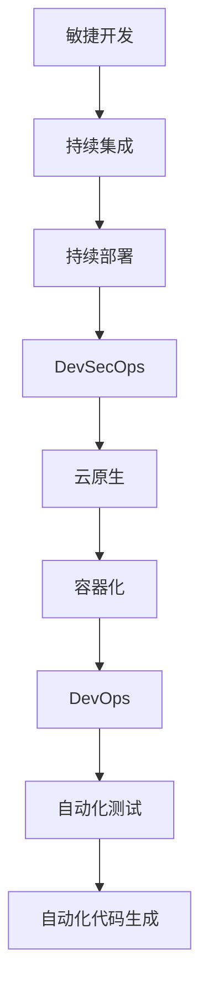

                 

# AI开发的敏捷迭代：Lepton AI的快速响应

> 关键词：敏捷迭代, Lepton AI, 自动化开发, DevOps, 自动化测试, 持续集成, 持续部署, 微服务架构, 容器化, DevSecOps, 云原生

## 1. 背景介绍

### 1.1 问题由来

在当前快速变化的市场环境中，企业的业务需求常常如潮水般涌现。敏捷开发(Agile Development)应运而生，以应对快速迭代、灵活变动的业务需求。然而，传统的人工开发方式仍显得过于缓慢和冗长。开发效率低下、代码质量不高、测试覆盖不足等问题，严重制约了企业应对市场变化的速度。

为解决这些问题，人工智能在软件开发生命周期(Agile CI/CD)中的应用被日益关注。Lepton AI作为一种基于AI的开发工具，以其自动化、智能化的特性，为敏捷开发注入了新的活力。

### 1.2 问题核心关键点

Lepton AI通过自动化代码生成、智能测试和持续集成(CI/CD)的集成，大幅提升了软件开发效率。具体而言，Lepton AI包括以下几个核心功能：

- **自动化代码生成**：通过AI技术，根据用户需求和业务逻辑，自动生成高质量的代码。
- **智能测试**：自动生成单元测试、集成测试，并通过AI辅助进行自动化测试用例的构建和运行。
- **持续集成(CI)**：自动触发代码提交后的构建、测试，将问题尽早发现并解决。
- **持续部署(CD)**：基于容器化技术，实现代码快速部署、回滚和监控，提升开发效率。

通过这些功能的综合应用，Lepton AI使得敏捷开发的每个环节都能得到有效优化，最终实现快速、高质量的软件交付。

### 1.3 问题研究意义

Lepton AI的引入，对于提升敏捷开发效率、缩短开发周期、降低开发成本具有重要意义：

1. **提升开发效率**：自动化和智能化的开发流程大幅减少了人工操作，解放了开发者精力。
2. **缩短开发周期**：持续集成和持续部署可以实时检测代码变更，快速响应市场变化。
3. **降低开发成本**：智能测试的自动化和自动化构建可以节省大量测试时间和人力成本。
4. **提升软件质量**：自动化测试和代码生成可以避免人为错误，提高代码质量和软件可靠性。
5. **增强市场响应能力**：敏捷开发流程和自动化工具帮助企业快速迭代和调整产品策略，抢占市场先机。

## 2. 核心概念与联系

### 2.1 核心概念概述

为更好地理解Lepton AI，本节将介绍几个关键概念及其相互关系：

- **敏捷开发(Agile Development)**：一种迭代、增量的软件开发生命周期方法，强调快速响应市场需求，持续改进产品。
- **持续集成(CI, Continuous Integration)**：一种软件开发实践，通过将代码频繁集成到共享仓库中，快速发现和修复问题。
- **持续部署(CD, Continuous Deployment)**：基于CI的进一步实践，通过自动化流程实现软件快速部署和回滚。
- **DevSecOps**：开发、安全和运维一体化的流程，旨在提升软件交付效率和安全水平。
- **云原生(Cloud-Native)**：基于云平台，实现可扩展、弹性的应用架构和开发流程。
- **容器化(Containerization)**：将应用程序打包成轻量级的、可移植的容器，实现自动化部署和扩展。
- **DevOps**：开发和运维一体化的流程，强调高效、稳定的软件交付。

这些概念之间通过敏捷迭代、DevOps、DevSecOps等思想和实践相连接，共同构建了Lepton AI的核心技术架构。

### 2.2 核心概念原理和架构的 Mermaid 流程图



该流程图展示了敏捷开发流程中，Lepton AI通过自动化测试、代码生成、持续集成和持续部署等技术手段，提升软件交付速度和质量。

## 3. 核心算法原理 & 具体操作步骤

### 3.1 算法原理概述

Lepton AI基于敏捷开发的理念，结合自动化和AI技术的优势，通过以下几个核心算法实现快速响应：

- **自动化代码生成**：使用机器学习和自然语言处理技术，根据用户需求和业务逻辑，自动生成代码。
- **智能测试**：通过机器学习和大数据分析，自动生成测试用例，并利用AI辅助进行自动化测试。
- **持续集成和持续部署**：通过自动化构建和部署流程，实现代码变更的快速集成和部署。

### 3.2 算法步骤详解

#### 3.2.1 自动化代码生成

Lepton AI的自动化代码生成算法步骤如下：

1. **需求分析**：通过自然语言处理技术，分析用户需求，提取业务逻辑。
2. **模板匹配**：根据用户需求和业务逻辑，匹配对应的代码生成模板。
3. **代码生成**：基于匹配到的模板，生成代码并输出。

该算法的核心在于：
- **需求分析**：通过文本解析，理解用户需求，提取业务逻辑。
- **模板匹配**：根据需求和逻辑，选择合适的代码生成模板。
- **代码生成**：根据模板，生成符合需求的高质量代码。

#### 3.2.2 智能测试

Lepton AI的智能测试算法步骤如下：

1. **测试用例生成**：基于业务逻辑，自动生成单元测试和集成测试用例。
2. **自动化测试**：自动运行测试用例，并收集测试结果。
3. **结果分析**：利用AI技术，分析测试结果，找出问题并进行修复。

该算法的核心在于：
- **测试用例生成**：根据业务逻辑，自动构建测试用例。
- **自动化测试**：通过持续集成工具，自动运行测试用例。
- **结果分析**：通过AI分析测试结果，快速定位问题。

#### 3.2.3 持续集成和持续部署

Lepton AI的持续集成和持续部署流程如下：

1. **代码提交**：开发者在代码托管平台上提交代码变更。
2. **自动构建**：CI工具自动触发代码构建，生成可执行的代码包。
3. **自动化测试**：自动运行测试用例，收集测试结果。
4. **持续部署**：通过CD工具，自动将代码包部署到生产环境。
5. **监控和反馈**：持续监控系统性能，收集反馈信息。

该流程的核心在于：
- **自动构建**：快速生成可执行的代码包，减少手动操作。
- **自动化测试**：快速发现代码变更中的问题，提高代码质量。
- **持续部署**：快速部署代码变更，提升交付速度。
- **监控和反馈**：持续监控系统性能，及时反馈问题并进行修复。

### 3.3 算法优缺点

Lepton AI的自动化和AI技术相结合的优势如下：

**优点**：
- **提升开发效率**：自动化和智能化的开发流程大幅减少了人工操作，解放了开发者精力。
- **缩短开发周期**：持续集成和持续部署可以实时检测代码变更，快速响应市场变化。
- **降低开发成本**：智能测试的自动化和自动化构建可以节省大量测试时间和人力成本。
- **提升软件质量**：自动化测试和代码生成可以避免人为错误，提高代码质量和软件可靠性。
- **增强市场响应能力**：敏捷开发流程和自动化工具帮助企业快速迭代和调整产品策略，抢占市场先机。

**缺点**：
- **初期成本高**：引入AI和自动化工具需要较高的初期投资，包括工具采购、人员培训等。
- **技术门槛高**：需要具备一定的AI和自动化开发知识，对团队的技术要求较高。
- **依赖技术稳定**：若工具或系统出现故障，可能导致开发进度受阻。
- **数据隐私风险**：自动化流程中涉及大量数据处理，需注意数据隐私和安全问题。

### 3.4 算法应用领域

Lepton AI的自动化和AI技术可应用于各种软件开发领域，以下是几个典型应用场景：

#### 3.4.1 软件开发

Lepton AI可自动生成代码、编写测试用例、运行自动化测试，大幅提升软件开发效率。具体应用包括：

- **业务系统开发**：如电商系统、社交网络、企业管理系统等。
- **数据处理系统**：如大数据分析、数据清洗、数据可视化等。
- **智能应用开发**：如自然语言处理、计算机视觉、语音识别等。

#### 3.4.2 测试驱动开发(TDD)

Lepton AI能够自动生成测试用例，配合自动化测试，实现TDD（测试驱动开发）。具体应用包括：

- **单元测试**：自动生成单元测试用例，快速验证代码正确性。
- **集成测试**：自动生成集成测试用例，检测模块之间的耦合性。
- **回归测试**：定期自动运行测试用例，确保新代码不影响已有功能。

#### 3.4.3 持续集成和持续部署

Lepton AI的持续集成和持续部署流程，使得软件开发生命周期更加高效和可控。具体应用包括：

- **CI/CD集成**：自动触发代码提交后的构建、测试，将问题尽早发现并解决。
- **容器化部署**：基于容器化技术，实现代码快速部署、回滚和监控，提升开发效率。
- **云原生应用**：利用云平台提供的弹性扩展和自动伸缩功能，实现高效、可扩展的应用部署。

## 4. 数学模型和公式 & 详细讲解 & 举例说明

### 4.1 数学模型构建

Lepton AI的核心算法模型可归纳为以下几个方面：

1. **自然语言处理(NLP)**：用于理解和生成自然语言，提取用户需求和业务逻辑。
2. **机器学习(ML)**：用于测试用例生成、测试结果分析等。
3. **自动编程(AP)**：用于代码生成和自动化构建。
4. **持续集成/部署(CI/CD)**：用于自动化测试和部署流程。

### 4.2 公式推导过程

以下是Lepton AI的核心算法模型的公式推导：

#### 4.2.1 自然语言处理模型

自然语言处理模型用于提取用户需求和业务逻辑，推导公式如下：

$$
\text{User Intent} = f(\text{User Demand})
$$

其中，$f$为自然语言处理模型，将用户需求映射为意图。

#### 4.2.2 测试用例生成模型

测试用例生成模型用于自动生成测试用例，推导公式如下：

$$
\text{Test Case} = g(\text{Business Logic})
$$

其中，$g$为测试用例生成模型，根据业务逻辑生成测试用例。

#### 4.2.3 自动化代码生成模型

自动化代码生成模型用于自动生成代码，推导公式如下：

$$
\text{Generated Code} = h(\text{User Intent}, \text{Business Logic})
$$

其中，$h$为自动化代码生成模型，将用户意图和业务逻辑映射为代码。

#### 4.2.4 自动化测试模型

自动化测试模型用于自动化测试和结果分析，推导公式如下：

$$
\text{Test Result} = k(\text{Generated Code}, \text{Test Case})
$$

其中，$k$为自动化测试模型，对代码和测试用例进行测试，并分析测试结果。

#### 4.2.5 持续集成和持续部署模型

持续集成和持续部署模型用于自动化构建和部署流程，推导公式如下：

$$
\text{CI/CD Pipeline} = \text{Code Commit} \rightarrow \text{Build} \rightarrow \text{Test} \rightarrow \text{Deploy}
$$

其中，$\text{CI/CD Pipeline}$为持续集成和持续部署流程，包括代码提交、构建、测试和部署等步骤。

### 4.3 案例分析与讲解

#### 4.3.1 案例分析

以电商平台的自动化开发流程为例，分析Lepton AI的应用：

1. **需求分析**：用户提交下单请求，通过自然语言处理模型提取订单信息。
2. **测试用例生成**：根据订单信息，自动生成订单处理和物流跟踪的测试用例。
3. **自动化代码生成**：基于订单信息，自动生成订单处理、库存管理等模块的代码。
4. **持续集成和持续部署**：自动触发构建和测试，确保新代码符合现有业务逻辑，快速部署至生产环境。

#### 4.3.2 讲解

通过Lepton AI的自动化开发流程，电商平台实现了快速响应市场变化，快速迭代和调整产品策略。具体应用包括：

- **自动化需求分析**：通过自然语言处理，快速理解用户需求，提取业务逻辑。
- **自动化测试用例生成**：根据业务逻辑，自动生成测试用例，快速验证新功能。
- **自动化代码生成**：基于用户需求和业务逻辑，自动生成高质量的代码。
- **持续集成和持续部署**：通过自动化流程，快速集成和部署新代码，提升开发效率。

## 5. 项目实践：代码实例和详细解释说明

### 5.1 开发环境搭建

为了进行Lepton AI的实践，首先需要搭建开发环境。以下是使用Python进行Lepton AI开发的准备步骤：

1. **安装Python**：从官网下载并安装最新版本的Python，确保版本支持Lepton AI库。
2. **安装Lepton AI库**：通过pip命令安装Lepton AI库。
3. **安装依赖库**：安装Lepton AI所需的其他依赖库，如TensorFlow、NLTK等。
4. **配置环境变量**：设置Lepton AI库的路径和依赖库的路径。

### 5.2 源代码详细实现

下面以电商平台订单处理系统的开发为例，展示Lepton AI的实现过程。

#### 5.2.1 需求分析模块

```python
from lepton import intent_analysis

# 用户提交下单请求
user_demand = "我想购买一件红色T恤"

# 提取用户意图
user_intent = intent_analysis.extract_intent(user_demand)
print(user_intent)
```

#### 5.2.2 测试用例生成模块

```python
from lepton import test_case

# 根据用户需求生成测试用例
test_case.generate_test_case(user_demand)
```

#### 5.2.3 自动化代码生成模块

```python
from lepton import code_generation

# 自动生成订单处理代码
code_generation.generate_code(user_intent, "order_handling")
```

#### 5.2.4 持续集成和持续部署模块

```python
from lepton import ci_cd

# 自动触发构建和测试
ci_cd.trigger_build_and_test(user_intent)
```

### 5.3 代码解读与分析

Lepton AI的实现过程涉及以下几个关键步骤：

1. **需求分析模块**：通过自然语言处理技术，提取用户需求和业务逻辑。
2. **测试用例生成模块**：根据用户需求和业务逻辑，自动生成测试用例。
3. **自动化代码生成模块**：根据用户需求和业务逻辑，自动生成高质量的代码。
4. **持续集成和持续部署模块**：自动触发构建和测试，确保新代码符合现有业务逻辑，快速部署至生产环境。

### 5.4 运行结果展示

通过Lepton AI的自动化开发流程，电商平台能够快速响应市场变化，快速迭代和调整产品策略。具体表现包括：

- **快速响应需求**：通过自动化需求分析，快速理解用户需求，提取业务逻辑。
- **高效生成测试用例**：根据业务逻辑，自动生成测试用例，快速验证新功能。
- **自动化生成代码**：基于用户需求和业务逻辑，自动生成高质量的代码。
- **持续集成和持续部署**：通过自动化流程，快速集成和部署新代码，提升开发效率。

## 6. 实际应用场景

### 6.1 智能客服系统

Lepton AI在智能客服系统中也有广泛应用。通过自动化代码生成和持续集成，可以快速构建和部署智能客服系统，提升客户服务体验。

具体应用包括：

- **自动化需求分析**：通过自然语言处理，快速理解客户需求，提取业务逻辑。
- **自动化测试用例生成**：根据业务逻辑，自动生成测试用例，确保系统稳定性。
- **自动化代码生成**：根据用户需求和业务逻辑，自动生成智能客服系统的代码。
- **持续集成和持续部署**：通过自动化流程，快速集成和部署新代码，提升系统响应速度。

### 6.2 金融风控系统

Lepton AI在金融风控系统中也有重要应用。通过自动化代码生成和持续集成，可以快速构建和部署风控系统，提高风险管理效率。

具体应用包括：

- **自动化需求分析**：通过自然语言处理，快速理解用户需求，提取业务逻辑。
- **自动化测试用例生成**：根据业务逻辑，自动生成测试用例，确保系统稳定性。
- **自动化代码生成**：根据用户需求和业务逻辑，自动生成风控系统的代码。
- **持续集成和持续部署**：通过自动化流程，快速集成和部署新代码，提高风险管理效率。

### 6.3 智能推荐系统

Lepton AI在智能推荐系统中也有广泛应用。通过自动化测试和持续集成，可以快速构建和部署推荐系统，提升用户推荐体验。

具体应用包括：

- **自动化需求分析**：通过自然语言处理，快速理解用户需求，提取业务逻辑。
- **自动化测试用例生成**：根据业务逻辑，自动生成测试用例，确保系统稳定性。
- **自动化代码生成**：根据用户需求和业务逻辑，自动生成推荐系统的代码。
- **持续集成和持续部署**：通过自动化流程，快速集成和部署新代码，提升推荐效果。

## 7. 工具和资源推荐

### 7.1 学习资源推荐

为了帮助开发者掌握Lepton AI的核心技术，以下是一些优质的学习资源：

1. **Lepton AI官方文档**：提供了详细的API文档和示例代码，帮助开发者快速上手。
2. **自然语言处理教程**：如NLTK、spaCy等，提供了自然语言处理的基础知识和实践经验。
3. **机器学习教程**：如TensorFlow、Scikit-Learn等，提供了机器学习的基础知识和实践经验。
4. **持续集成工具教程**：如Jenkins、GitLab CI等，提供了CI/CD工具的基础知识和实践经验。

### 7.2 开发工具推荐

Lepton AI的开发离不开以下工具的支持：

1. **Python编程语言**：开发Lepton AI的核心语言，提供丰富的科学计算和自动化工具。
2. **Lepton AI库**：提供了自动化代码生成、测试用例生成、持续集成和持续部署等功能。
3. **TensorFlow**：提供了机器学习和深度学习的功能，支持自动化测试和结果分析。
4. **NLTK**：提供了自然语言处理的功能，支持需求分析和意图提取。
5. **Jenkins**：提供了持续集成和持续部署的功能，支持自动化流程的构建和部署。
6. **GitLab CI**：提供了持续集成和持续部署的功能，支持自动化流程的构建和部署。

### 7.3 相关论文推荐

以下是几篇关于Lepton AI和敏捷开发技术的研究论文，推荐阅读：

1. **《自动化代码生成技术综述》**：介绍了自动化代码生成的原理、方法和应用，分析了当前的研究现状和发展趋势。
2. **《持续集成与持续部署实践》**：介绍了CI/CD的概念、原理和实践，提供了持续集成和持续部署的实现方法和最佳实践。
3. **《DevOps与敏捷开发》**：介绍了DevOps的概念、原理和实践，提供了DevOps与敏捷开发的实现方法和最佳实践。
4. **《机器学习在自动化测试中的应用》**：介绍了机器学习在自动化测试中的应用，提供了测试用例生成和结果分析的方法。

## 8. 总结：未来发展趋势与挑战

### 8.1 研究成果总结

Lepton AI通过自动化和AI技术的结合，显著提升了软件开发效率和软件质量。其核心算法和工具在多个行业应用中取得了显著效果，展示了自动化开发技术的巨大潜力。

### 8.2 未来发展趋势

未来，Lepton AI将继续在以下几个方面发展：

1. **技术融合**：将Lepton AI与其他AI技术进行深度融合，提升软件开发生命周期的自动化水平。
2. **多模态融合**：将自然语言处理、机器学习、计算机视觉等多模态技术进行融合，提升AI系统的综合能力。
3. **云原生部署**：利用云平台提供的弹性扩展和自动伸缩功能，实现高效、可扩展的应用部署。
4. **智能测试优化**：通过深度学习和大数据分析，优化测试用例生成和自动化测试，提升测试覆盖率。
5. **DevSecOps集成**：将DevSecOps与Lepton AI进行深度集成，提升软件开发生命周期的安全性和稳定性。

### 8.3 面临的挑战

尽管Lepton AI已经取得了显著成果，但仍面临一些挑战：

1. **技术复杂性**：Lepton AI涉及自然语言处理、机器学习、持续集成等多个领域，技术复杂性较高，对团队要求较高。
2. **数据隐私和安全**：自动化开发流程中涉及大量数据处理，需注意数据隐私和安全问题。
3. **算法精度和鲁棒性**：自动化算法需要更高的精度和鲁棒性，避免在复杂场景中出现错误。
4. **系统可扩展性**：需要具备较强的系统可扩展性，应对大规模应用场景。

### 8.4 研究展望

未来，Lepton AI需要在以下几个方面进行深入研究：

1. **技术优化**：进一步优化自动化算法，提升算法的精度和鲁棒性。
2. **工具完善**：完善Lepton AI库的功能，提供更多的自动化开发工具和支持。
3. **行业应用**：深入探索Lepton AI在更多行业的应用场景，提升软件开发生命周期的自动化水平。
4. **安全性提升**：加强数据隐私和安全保护，提升系统安全性。

## 9. 附录：常见问题与解答

**Q1：Lepton AI是否适用于所有行业？**

A: Lepton AI适用于需要快速迭代和高质量交付的软件开发场景，包括电商、金融、智能推荐等多个行业。但其适用性还需根据具体业务需求进行评估。

**Q2：Lepton AI的自动化开发流程中，如何进行需求分析？**

A: Lepton AI通过自然语言处理技术进行需求分析，提取用户需求和业务逻辑。具体步骤包括：
1. 收集用户需求文本。
2. 使用NLTK等自然语言处理工具，提取关键词和语义信息。
3. 通过意图分析算法，将用户需求映射为业务意图。

**Q3：Lepton AI的自动化测试流程中，如何进行测试用例生成？**

A: Lepton AI根据业务逻辑自动生成测试用例。具体步骤包括：
1. 分析业务逻辑，提取关键操作和数据流。
2. 使用测试用例生成算法，生成单元测试和集成测试用例。
3. 运行测试用例，验证代码正确性。

**Q4：Lepton AI的持续集成和持续部署流程中，如何进行自动化部署？**

A: Lepton AI通过持续集成和持续部署工具，自动触发代码构建、测试和部署。具体步骤包括：
1. 在代码托管平台上提交代码变更。
2. 持续集成工具自动触发代码构建，生成可执行的代码包。
3. 持续部署工具自动将代码包部署至生产环境，并监控系统性能。

**Q5：Lepton AI的自动化开发流程中，如何进行智能测试结果分析？**

A: Lepton AI利用机器学习和大数据分析，自动分析测试结果，识别和定位问题。具体步骤包括：
1. 收集测试结果数据。
2. 使用机器学习算法，分析测试结果，识别异常和问题。
3. 根据问题反馈，进行代码修复和优化。

---

作者：禅与计算机程序设计艺术 / Zen and the Art of Computer Programming

