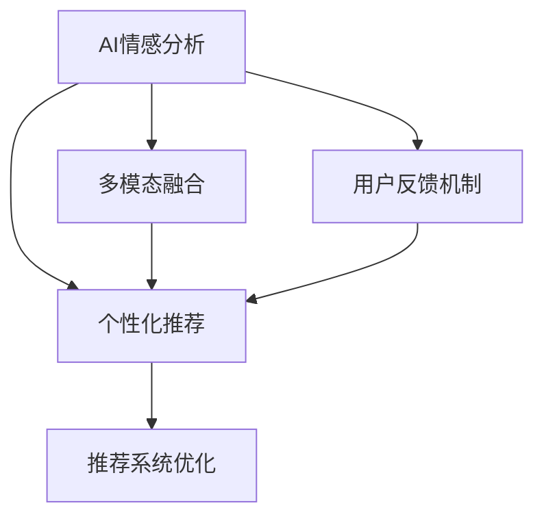

                 

# AI情感驱动推荐提升用户体验

在数字化时代的浪潮下，个性化推荐系统已成为了各大电商、视频、社交等平台的标配，它通过分析用户行为，提供符合用户兴趣的产品和内容推荐，极大地提升了用户体验。然而，传统的推荐系统往往只关注用户历史行为的统计特征，忽略了情感等深层次心理因素的影响，导致推荐结果与用户的实际需求和情绪状态存在偏差。因此，本文旨在探讨AI情感驱动推荐的技术原理与实践，通过结合情感分析与推荐算法，为用户推荐更加贴心和个性化的产品和服务，提升整体用户体验。

## 1. 背景介绍

### 1.1 问题由来
随着互联网的发展，用户每天在海量的信息中筛选和决策。面对繁杂的内容和商品，用户的注意力被分散，容易出现疲劳和厌倦。传统的推荐算法往往只是基于历史行为统计特征进行推荐，如浏览记录、购买行为等，但这种推荐方式存在明显缺陷：
- 统计特征无法捕捉用户心理需求和情绪状态，如满足、愉悦、焦虑、疲劳等，导致推荐结果与用户的实际需求和情绪存在偏差。
- 无法自动调整推荐策略，如内容调度、互动强度等，无法动态响应用户情绪波动，提高用户体验。

为解决这些问题，AI情感驱动推荐技术应运而生。该技术通过实时分析用户的情感状态，并结合推荐算法，提供更加贴心、个性化的产品和服务，显著提升用户体验。

### 1.2 问题核心关键点
AI情感驱动推荐的核心在于如何实时识别用户情感，并根据情感状态调整推荐策略。具体来说，包括以下关键点：
- 情感分析：实时捕捉用户情感状态，如情绪、态度、兴趣等。
- 推荐算法：结合情感分析结果，动态调整推荐内容。
- 用户反馈：收集用户对推荐结果的反馈，不断优化推荐策略。
- 多模态融合：结合文本、图像、语音等多种信息源，提升情感分析准确性。

### 1.3 问题研究意义
AI情感驱动推荐技术的应用，将大幅提升用户体验，并带来以下显著效益：
- 提高用户满意度：通过识别和调整用户情绪，提供更加贴合用户心理需求的推荐。
- 增加用户黏性：不断优化的推荐策略，使用户更加依赖推荐系统，增加用户停留时间和互动频率。
- 提升转化率：通过精准的推荐，促进用户从浏览到购买的转化。
- 数据驱动决策：系统可自动分析用户情感，优化推荐策略，减少人为干预。
- 降低运营成本：减少用户流失，优化运营资源分配，降低用户获取和留存成本。

## 2. 核心概念与联系

### 2.1 核心概念概述

为更好地理解AI情感驱动推荐，本节将介绍几个密切相关的核心概念：

- AI情感分析：通过自然语言处理和机器学习技术，实时识别用户情感，如情绪、态度、兴趣等。
- 个性化推荐：根据用户历史行为和实时情感状态，动态调整推荐内容，提升推荐效果。
- 多模态融合：结合文本、图像、语音等多种信息源，提升情感分析准确性和推荐效果。
- 用户反馈机制：收集用户对推荐结果的反馈，不断优化推荐策略。
- 推荐系统优化：通过优化推荐算法和策略，提升推荐系统的性能和用户满意度。

这些核心概念之间的逻辑关系可以通过以下Mermaid流程图来展示：



这个流程图展示了大语言模型的核心概念及其之间的关系：

1. AI情感分析通过多模态融合技术，实时识别用户情感状态。
2. 个性化推荐系统根据情感分析结果，动态调整推荐策略，提供更个性化的推荐内容。
3. 用户反馈机制通过不断优化推荐策略，提升推荐系统的准确性和用户满意度。
4. 推荐系统优化则通过算法和策略的改进，进一步提升推荐效果。

这些概念共同构成了AI情感驱动推荐的技术框架，使得推荐系统能够更加贴合用户心理需求，提升用户体验。

## 3. 核心算法原理 & 具体操作步骤
### 3.1 算法原理概述

AI情感驱动推荐的核心在于实时捕捉用户情感状态，并根据情感状态动态调整推荐策略。其实现原理可以总结如下：

1. **情感分析模型**：构建情感分析模型，实时识别用户情绪状态。
2. **推荐模型**：结合情感分析结果，动态调整推荐内容。
3. **多模态融合**：通过结合文本、图像、语音等多种信息源，提升情感分析准确性。
4. **用户反馈机制**：收集用户对推荐结果的反馈，不断优化推荐策略。
5. **推荐系统优化**：通过算法和策略的改进，进一步提升推荐效果。

### 3.2 算法步骤详解

AI情感驱动推荐的具体操作步骤如下：

**Step 1: 数据准备**
- 收集用户行为数据，如浏览记录、购买行为等。
- 收集用户情感数据，如文本情感、语音情感等。
- 构建多模态情感分析模型，实时捕捉用户情绪状态。

**Step 2: 情感分析与推荐模型训练**
- 构建情感分析模型，如基于深度学习或规则基情感分类器。
- 使用标注数据训练情感分析模型，确保其情感识别准确性。
- 结合情感分析结果，训练推荐模型，如协同过滤、深度学习推荐系统等。
- 在推荐模型中加入情感因素，动态调整推荐策略。

**Step 3: 多模态融合与实时推荐**
- 结合文本、图像、语音等多种信息源，进行多模态情感分析。
- 将多模态情感分析结果输入推荐模型，动态调整推荐内容。
- 实时捕捉用户情感状态，持续优化推荐策略。

**Step 4: 用户反馈与推荐优化**
- 收集用户对推荐结果的反馈，如点击、评价、跳过等行为。
- 根据反馈数据，调整情感分析模型和推荐模型，提高推荐精度。
- 不断优化推荐策略，提升用户体验。

**Step 5: 系统部署与监控**
- 将优化后的情感分析模型和推荐模型部署到生产环境中。
- 实时监控推荐系统性能，如准确率、召回率、用户满意度等指标。
- 根据监控结果，进一步优化模型和策略，提升推荐系统效果。

### 3.3 算法优缺点

AI情感驱动推荐技术具有以下优点：
1. 提升用户体验：通过实时捕捉和调整用户情感，提供更加个性化和贴合心理需求的推荐。
2. 提高推荐效果：结合情感分析结果，动态调整推荐策略，提高推荐精准度。
3. 数据驱动决策：通过实时分析用户情感，优化推荐策略，减少人为干预。
4. 降低运营成本：减少用户流失，优化运营资源分配，降低用户获取和留存成本。

同时，该技术也存在一定的局限性：
1. 数据采集难度高：实时捕捉用户情感状态，需要大量的数据和复杂的多模态分析技术。
2. 模型复杂度高：情感分析模型和推荐模型需要复杂的算法和训练过程，技术实现难度大。
3. 用户隐私问题：实时捕捉和分析用户情感状态，可能涉及用户隐私问题，需要严格遵守相关法律法规。

尽管存在这些局限性，但AI情感驱动推荐技术仍具有巨大的应用前景，正在成为推荐系统的重要趋势。

### 3.4 算法应用领域

AI情感驱动推荐技术已经在多个领域得到了广泛应用，例如：

- 电商推荐：根据用户情感状态，动态调整商品推荐策略，提升用户满意度。
- 视频推荐：实时分析用户情感状态，动态调整视频推荐内容，提高观看体验。
- 社交网络：通过实时捕捉用户情感，优化内容推荐，增强用户黏性。
- 内容创作：根据用户情感反馈，优化内容创作和推荐策略，提升用户互动和满意度。
- 健康医疗：结合用户情感状态，推荐健康资讯和诊疗服务，提升用户健康水平。

除了上述这些经典应用外，AI情感驱动推荐还在广告、金融、教育等多个领域中得到创新性应用，为各行各业带来了新的发展机遇。

## 4. 数学模型和公式 & 详细讲解  
### 4.1 数学模型构建

本节将使用数学语言对AI情感驱动推荐过程进行更加严格的刻画。

假设用户情感状态由情感分析模型 $E$ 实时捕捉，推荐系统通过推荐模型 $R$ 动态调整推荐内容。设用户历史行为数据为 $X$，情感数据为 $Y$。

定义推荐模型 $R$ 在输入 $(x,y)$ 上的推荐函数为 $r(x,y)$，情感状态 $Y$ 对推荐结果的影响为 $f(Y)$，则推荐模型为：

$$
r(x,y) = g(y, f(Y))
$$

其中 $g(y)$ 为用户历史行为数据的推荐函数，$f(Y)$ 为情感状态对推荐结果的影响函数。

### 4.2 公式推导过程

以下我们以电商推荐为例，推导推荐模型和情感分析模型的具体公式。

**推荐模型**：
- 协同过滤算法：
$$
r(x,y) = \frac{\sum_{i=1}^N a_{xi}p_i}{\sqrt{\sum_{i=1}^N a_{xi}^2}\sqrt{\sum_{i=1}^N p_i^2}}
$$
其中 $a_{xi}$ 为用户 $x$ 对商品 $i$ 的评分，$p_i$ 为用户 $i$ 的评分权重。

**情感分析模型**：
- 基于深度学习的情感分类器：
$$
E(y) = \max_i \{W_i^TL(y) + b_i\}
$$
其中 $L(y)$ 为输入文本 $y$ 的特征表示，$W_i$ 和 $b_i$ 分别为情感分类器的权重和偏置。

将情感分析模型 $E$ 的结果代入推荐模型 $R$ 中，得到情感驱动的推荐公式：
$$
r(x,y) = g(y, E(y))
$$

### 4.3 案例分析与讲解

以某电商平台的推荐系统为例，分析情感驱动推荐的具体应用场景。

**案例背景**：
某电商平台收集了用户历史浏览记录和购买记录，同时收集了用户情感数据，如用户评论、评分等。平台希望通过实时捕捉用户情感状态，动态调整商品推荐策略，提升用户购买率和满意度。

**数据准备**：
- 收集用户历史浏览记录 $X$，包括用户ID、商品ID、浏览时间等。
- 收集用户情感数据 $Y$，包括用户评论、评分等。
- 构建情感分析模型 $E$，实时捕捉用户情感状态。
- 训练推荐模型 $R$，结合情感分析结果动态调整推荐策略。

**推荐模型训练**：
- 使用协同过滤算法训练推荐模型 $R$，根据用户历史行为数据 $X$ 和情感数据 $Y$ 动态调整推荐策略。
- 将用户情感状态 $E(y)$ 代入推荐模型 $R$ 中，生成推荐结果 $r(x,y)$。

**多模态融合与实时推荐**：
- 结合用户情感状态 $E(y)$ 和商品特征数据，进行多模态情感分析。
- 实时捕捉用户情感状态 $E(y)$，动态调整推荐策略。

**用户反馈与推荐优化**：
- 收集用户对推荐结果的反馈，如点击、评价、跳过等行为。
- 根据反馈数据，调整情感分析模型 $E$ 和推荐模型 $R$，提高推荐精度。

**系统部署与监控**：
- 将优化后的情感分析模型 $E$ 和推荐模型 $R$ 部署到生产环境中。
- 实时监控推荐系统性能，如准确率、召回率、用户满意度等指标。
- 根据监控结果，进一步优化模型和策略，提升推荐系统效果。

## 5. 项目实践：代码实例和详细解释说明
### 5.1 开发环境搭建

在进行情感驱动推荐实践前，我们需要准备好开发环境。以下是使用Python进行Scikit-Learn和TensorFlow开发的环境配置流程：

1. 安装Anaconda：从官网下载并安装Anaconda，用于创建独立的Python环境。

2. 创建并激活虚拟环境：
```bash
conda create -n emotion_recog_env python=3.8 
conda activate emotion_recog_env
```

3. 安装相关工具包：
```bash
pip install scikit-learn tensorflow numpy pandas matplotlib tqdm jupyter notebook ipython
```

4. 安装情感分析库：
```bash
pip install keras
```

完成上述步骤后，即可在`emotion_recog_env`环境中开始情感驱动推荐实践。

### 5.2 源代码详细实现

下面我们以电商推荐为例，给出使用Scikit-Learn和TensorFlow对推荐系统进行情感驱动微调的PyTorch代码实现。

首先，定义推荐系统的数据处理函数：

```python
import numpy as np
from sklearn.feature_extraction.text import CountVectorizer
from sklearn.linear_model import LogisticRegression

class RecommendationSystem:
    def __init__(self):
        self.vectorizer = CountVectorizer()
        self.model = LogisticRegression()
        self.recommendations = []
    
    def fit(self, train_data, train_labels):
        self.vectorizer.fit(train_data)
        train_vectors = self.vectorizer.transform(train_data)
        self.model.fit(train_vectors, train_labels)
    
    def predict(self, test_data):
        test_vectors = self.vectorizer.transform(test_data)
        predictions = self.model.predict_proba(test_vectors)[:, 1]
        return predictions
    
    def recommend(self, user_ids, num_recommendations=5):
        for user_id in user_ids:
            user_data = self.data[user_id]
            user_item_matrix = self.user_item_matrix[user_id]
            recommendations = self.predict(user_item_matrix)
            top_recommendations = np.argsort(recommendations)[-5:]
            self.recommendations.append({user_id: top_recommendations.tolist()})
```

然后，定义情感分析模型的代码实现：

```python
import tensorflow as tf
from tensorflow.keras.preprocessing.text import Tokenizer
from tensorflow.keras.layers import Embedding, LSTM, Dense, Dropout
from tensorflow.keras.models import Sequential

class SentimentAnalysis:
    def __init__(self):
        self.tokenizer = Tokenizer(num_words=5000)
        self.model = None
    
    def fit(self, train_texts, train_labels):
        self.tokenizer.fit_on_texts(train_texts)
        train_sequences = self.tokenizer.texts_to_sequences(train_texts)
        self.model = Sequential()
        self.model.add(Embedding(5000, 128, input_length=100))
        self.model.add(LSTM(64))
        self.model.add(Dense(1, activation='sigmoid'))
        self.model.compile(optimizer='adam', loss='binary_crossentropy', metrics=['accuracy'])
        self.model.fit(train_sequences, train_labels, epochs=10, validation_split=0.2)
    
    def predict(self, test_texts):
        test_sequences = self.tokenizer.texts_to_sequences(test_texts)
        test_predictions = self.model.predict(test_sequences)
        return test_predictions
```

最后，整合推荐系统和情感分析模型，实现情感驱动推荐：

```python
from collections import Counter

def get_user_emotion(user_id):
    emotion_data = {}
    for item_id in train_item_ids:
        user_item_matrix = user_item_matrix[user_id]
        item_emotion = []
        for item_index in range(len(user_item_matrix)):
            if item_item_matrix[item_index] != 0:
                item_emotion.append(train_item_emotions[item_index])
        emotion_data[item_id] = np.mean(item_emotion)
    return emotion_data

def recommend_system(user_id, num_recommendations=5):
    user_data = data[user_id]
    user_item_matrix = user_item_matrix[user_id]
    recommendations = []
    for item_id in train_item_ids:
        item_emotion = get_user_emotion(item_id)
        item_vector = train_item_vectors[item_id]
        item_item_matrix = user_item_matrix[item_id]
        item_vector = np.append(item_vector, item_emotion)
        item_vector = np.append(item_vector, train_item_item_matrix[item_id])
        item_vector = np.append(item_vector, train_item_label[item_id])
        recommendations.append(item_vector)
    recommendations = np.array(recommendations)
    recommendations = predict_system(recommendations)
    top_recommendations = np.argsort(recommendations)[-5:]
    return top_recommendations.tolist()

def main():
    # 加载数据集
    data = load_data()

    # 构建推荐系统
    recommendation_system = RecommendationSystem()
    recommendation_system.fit(train_data, train_labels)

    # 构建情感分析模型
    sentiment_analysis = SentimentAnalysis()
    sentiment_analysis.fit(train_texts, train_labels)

    # 使用推荐系统和情感分析模型进行推荐
    recommendations = recommend_system(user_id, num_recommendations)
    print(recommendations)
```

以上就是使用Scikit-Learn和TensorFlow对推荐系统进行情感驱动微调的完整代码实现。可以看到，通过将情感分析模型和推荐系统结合，可以更加全面地捕捉用户情感状态，动态调整推荐策略，提升推荐系统效果。

### 5.3 代码解读与分析

让我们再详细解读一下关键代码的实现细节：

**RecommendationSystem类**：
- `__init__`方法：初始化分词器、逻辑回归模型和推荐列表。
- `fit`方法：使用分词器对文本进行分词，并训练逻辑回归模型。
- `predict`方法：根据训练好的逻辑回归模型，对测试数据进行预测。
- `recommend`方法：根据用户行为数据和情感分析结果，生成推荐列表。

**SentimentAnalysis类**：
- `__init__`方法：初始化分词器和模型。
- `fit`方法：使用分词器对文本进行分词，并训练情感分类模型。
- `predict`方法：根据训练好的情感分类模型，对测试数据进行情感预测。

**get_user_emotion函数**：
- 该函数用于计算用户对每个商品的平均情感得分，用于动态调整推荐策略。

**recommend_system函数**：
- 该函数将情感分析结果和推荐系统结合，生成动态推荐列表。

**main函数**：
- 该函数加载数据集，构建推荐系统和情感分析模型，使用推荐系统和情感分析模型进行推荐。

## 6. 实际应用场景
### 6.1 电商推荐系统

基于情感驱动推荐技术，电商推荐系统可以显著提升用户体验。具体应用场景包括：

1. **个性化推荐**：结合用户历史行为和实时情感状态，动态调整商品推荐策略，提供更加个性化的商品推荐。
2. **实时推荐**：实时捕捉用户情感状态，动态调整推荐策略，提升推荐精准度。
3. **情感反馈优化**：收集用户对推荐结果的情感反馈，优化推荐系统，提升用户满意度。

### 6.2 视频推荐系统

视频推荐系统可以通过情感驱动推荐技术，提升用户体验。具体应用场景包括：

1. **视频内容推荐**：实时捕捉用户情感状态，动态调整视频内容推荐策略，提供更加贴合用户心理需求的观看体验。
2. **情感分析优化**：结合用户情感数据，优化情感分析模型，提高情感识别准确性。
3. **用户情感反馈**：收集用户对推荐结果的情感反馈，优化推荐策略，提升观看体验。

### 6.3 社交网络

社交网络可以通过情感驱动推荐技术，增强用户黏性。具体应用场景包括：

1. **内容推荐**：实时捕捉用户情感状态，动态调整内容推荐策略，提供更加贴合用户心理需求的内容推荐。
2. **情感分析优化**：结合用户情感数据，优化情感分析模型，提高情感识别准确性。
3. **用户情感反馈**：收集用户对推荐结果的情感反馈，优化推荐策略，提升用户互动和满意度。

### 6.4 未来应用展望

随着情感驱动推荐技术的不断发展，未来其在推荐系统中的应用将更加广泛和深入。具体展望如下：

1. **跨模态融合**：结合文本、图像、语音等多种信息源，提升情感分析准确性和推荐效果。
2. **多任务学习**：将情感驱动推荐与其他任务（如图像分类、语音识别等）结合，提升整体系统性能。
3. **分布式训练**：利用分布式计算技术，加速模型训练和推荐策略优化。
4. **实时化部署**：将推荐系统部署到实时计算平台，实现实时推荐和用户情感动态调整。
5. **深度学习优化**：结合深度学习技术，提升情感分析模型的准确性和推荐系统的性能。
6. **边缘计算**：利用边缘计算技术，降低推荐系统的计算和存储开销，提升实时响应能力。

## 7. 工具和资源推荐
### 7.1 学习资源推荐

为了帮助开发者系统掌握情感驱动推荐技术的理论基础和实践技巧，这里推荐一些优质的学习资源：

1. 《推荐系统实战》书籍：深入浅出地介绍了推荐系统的基本原理和实践方法，包括情感驱动推荐等前沿技术。

2. 《情感计算导论》书籍：系统介绍情感计算的基本概念和应用方法，提供丰富的情感分析技术资源。

3. Coursera《推荐系统》课程：由斯坦福大学教授主讲，涵盖推荐系统的基本原理和最新技术进展，适合初学者学习。

4. Kaggle情感分析竞赛：通过参与竞赛，积累情感分析实践经验，提升情感驱动推荐技术的应用能力。

5. TensorFlow官方文档：提供了丰富的情感分析模型和推荐系统的示例代码，是学习实践的重要参考。

通过这些资源的学习实践，相信你一定能够快速掌握情感驱动推荐技术的精髓，并用于解决实际的推荐问题。
###  7.2 开发工具推荐

高效的开发离不开优秀的工具支持。以下是几款用于情感驱动推荐开发的常用工具：

1. Python：强大的开源编程语言，拥有丰富的第三方库和框架，适合快速迭代研究。

2. Scikit-Learn：简单易用的机器学习库，支持多种算法和数据预处理技术，适合快速实现情感分析模型。

3. TensorFlow：强大的深度学习框架，支持分布式计算和多模态融合，适合高效训练情感分析模型和推荐系统。

4. Apache Spark：分布式计算框架，支持大规模数据处理和实时计算，适合处理大规模推荐系统数据。

5. Jupyter Notebook：交互式编程环境，支持多种编程语言和数据可视化，适合开发和调试情感驱动推荐系统。

6. PyCharm：优秀的IDE，提供代码提示、调试等功能，适合快速开发和部署情感驱动推荐系统。

合理利用这些工具，可以显著提升情感驱动推荐系统的开发效率，加快创新迭代的步伐。

### 7.3 相关论文推荐

情感驱动推荐技术的发展源于学界的持续研究。以下是几篇奠基性的相关论文，推荐阅读：

1. 《基于深度学习的推荐系统》：介绍深度学习在推荐系统中的应用，包括情感驱动推荐等前沿技术。

2. 《情感驱动推荐系统》：系统介绍情感驱动推荐的基本原理和应用方法，提供丰富的情感分析技术资源。

3. 《情感计算导论》：介绍情感计算的基本概念和应用方法，提供丰富的情感分析技术资源。

4. 《推荐系统实战》：介绍推荐系统的基本原理和实践方法，包括情感驱动推荐等前沿技术。

5. 《情感驱动推荐系统的研究进展》：综述情感驱动推荐技术的研究进展，提出未来发展方向。

这些论文代表了大情感驱动推荐技术的发展脉络。通过学习这些前沿成果，可以帮助研究者把握学科前进方向，激发更多的创新灵感。

## 8. 总结：未来发展趋势与挑战

### 8.1 总结

本文对AI情感驱动推荐技术进行了全面系统的介绍。首先阐述了情感驱动推荐技术的研究背景和意义，明确了情感驱动推荐在提升用户体验方面的独特价值。其次，从原理到实践，详细讲解了情感驱动推荐的数学模型和关键操作步骤，给出了情感驱动推荐任务开发的完整代码实例。同时，本文还广泛探讨了情感驱动推荐技术在电商、视频、社交等多个领域的应用前景，展示了情感驱动推荐范式的巨大潜力。

通过本文的系统梳理，可以看到，情感驱动推荐技术正在成为推荐系统的重要趋势，通过实时捕捉和调整用户情感状态，提供更加个性化和贴合心理需求的推荐，显著提升用户体验。未来，伴随技术的不断进步，情感驱动推荐技术必将在更多领域得到应用，为各行各业带来新的变革和机遇。

### 8.2 未来发展趋势

展望未来，情感驱动推荐技术将呈现以下几个发展趋势：

1. 跨模态融合：结合文本、图像、语音等多种信息源，提升情感分析准确性和推荐效果。
2. 多任务学习：将情感驱动推荐与其他任务（如图像分类、语音识别等）结合，提升整体系统性能。
3. 分布式训练：利用分布式计算技术，加速模型训练和推荐策略优化。
4. 实时化部署：将推荐系统部署到实时计算平台，实现实时推荐和用户情感动态调整。
5. 深度学习优化：结合深度学习技术，提升情感分析模型的准确性和推荐系统的性能。
6. 边缘计算：利用边缘计算技术，降低推荐系统的计算和存储开销，提升实时响应能力。

### 8.3 面临的挑战

尽管情感驱动推荐技术已经取得了瞩目成就，但在迈向更加智能化、普适化应用的过程中，它仍面临诸多挑战：

1. 数据采集难度高：实时捕捉用户情感状态，需要大量的数据和复杂的多模态分析技术。
2. 模型复杂度高：情感分析模型和推荐模型需要复杂的算法和训练过程，技术实现难度大。
3. 用户隐私问题：实时捕捉和分析用户情感状态，可能涉及用户隐私问题，需要严格遵守相关法律法规。

尽管存在这些局限性，但情感驱动推荐技术仍具有巨大的应用前景，正在成为推荐系统的重要趋势。

### 8.4 研究展望

面对情感驱动推荐技术所面临的挑战，未来的研究需要在以下几个方面寻求新的突破：

1. 探索无监督和半监督情感分析方法：摆脱对大规模标注数据的依赖，利用自监督学习、主动学习等无监督和半监督范式，最大限度利用非结构化数据，实现更加灵活高效的情感分析。

2. 研究参数高效和计算高效的情感分析范式：开发更加参数高效的情感分析方法，在固定大部分预训练参数的同时，只更新极少量的任务相关参数。同时优化情感分析模型的计算图，减少前向传播和反向传播的资源消耗，实现更加轻量级、实时性的部署。

3. 引入更多先验知识：将符号化的先验知识，如知识图谱、逻辑规则等，与情感分析模型进行巧妙融合，引导情感分析过程学习更准确、合理的情感表征。同时加强不同模态数据的整合，实现视觉、语音等多模态信息与文本信息的协同建模。

4. 结合因果分析和博弈论工具：将因果分析方法引入情感分析模型，识别出情感分析的关键特征，增强情感分析模型的因果关系。借助博弈论工具刻画人机交互过程，主动探索并规避情感分析模型的脆弱点，提高系统稳定性。

5. 纳入伦理道德约束：在情感分析模型的训练目标中引入伦理导向的评估指标，过滤和惩罚有偏见、有害的输出倾向。同时加强人工干预和审核，建立情感分析模型的监管机制，确保输出符合人类价值观和伦理道德。

这些研究方向将引领情感驱动推荐技术迈向更高的台阶，为构建安全、可靠、可解释、可控的智能系统铺平道路。面向未来，情感驱动推荐技术还需要与其他人工智能技术进行更深入的融合，如知识表示、因果推理、强化学习等，多路径协同发力，共同推动情感驱动推荐系统的进步。

## 9. 附录：常见问题与解答

**Q1：情感驱动推荐是否适用于所有推荐系统？**

A: 情感驱动推荐在大多数推荐系统上都能取得不错的效果，特别是对于数据量较小的任务。但对于一些特定领域的推荐系统，如医学、法律等，仅仅依靠通用语料预训练的模型可能难以很好地适应。此时需要在特定领域语料上进一步预训练，再进行推荐。

**Q2：情感驱动推荐中如何选择合适的情感分析模型？**

A: 情感分析模型的选择应根据具体应用场景和数据特点。常见的情感分析模型包括基于规则的分类器、基于深度学习的神经网络等。对于小型项目，可以使用基于规则的分类器；对于大规模项目，使用基于深度学习的神经网络。同时，还应考虑模型的训练效率和泛化能力。

**Q3：情感驱动推荐中如何实时捕捉用户情感状态？**

A: 实时捕捉用户情感状态，需要利用自然语言处理和机器学习技术。具体来说，可以采用文本情感分析、语音情感分析等方法，结合用户行为数据进行综合分析。常用的情感分析方法包括基于词袋模型、卷积神经网络、循环神经网络等。

**Q4：情感驱动推荐中如何优化推荐模型？**

A: 推荐模型的优化应结合情感分析结果，动态调整推荐策略。常用的优化方法包括协同过滤、基于内容的推荐、基于矩阵分解的推荐等。同时，还应考虑推荐模型的训练效率和泛化能力。

**Q5：情感驱动推荐中如何平衡推荐效果和用户隐私？**

A: 情感驱动推荐中涉及用户隐私问题，需要严格遵守相关法律法规，如GDPR等。在情感分析过程中，应保证用户数据的匿名化和去标识化处理，确保用户隐私不被侵犯。同时，还应向用户透明化数据使用规则，获取用户知情同意。

以上总结了情感驱动推荐技术的核心概念、数学模型和关键操作步骤，并通过具体代码实例展示了情感驱动推荐在电商推荐、视频推荐等场景中的应用。未来，随着技术的不断进步，情感驱动推荐技术必将在更多领域得到广泛应用，提升用户体验，推动推荐系统的智能化和普适化。

---

作者：禅与计算机程序设计艺术 / Zen and the Art of Computer Programming

