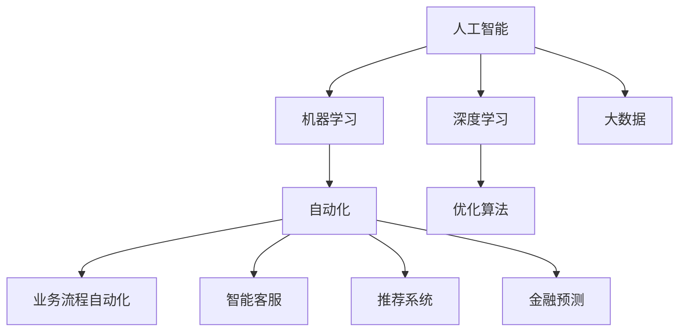

                 

# AI技术在商业中的发展趋势

> 关键词：人工智能,商业应用,机器学习,深度学习,大数据,自动化,优化算法,未来展望

## 1. 背景介绍

随着科技的快速发展和计算能力的不断提高，人工智能（AI）技术在商业领域的应用日益广泛和深入。从传统的自动化生产到现代的智能客服、推荐系统、金融预测等，AI技术的融入正在改变企业的运营方式和竞争格局。本文旨在探讨AI技术在商业中的发展趋势，以及其对企业未来发展的潜在影响。

## 2. 核心概念与联系

### 2.1 核心概念概述

在探讨AI技术在商业中的应用时，我们需要了解几个关键概念及其相互联系：

- **人工智能（AI）**：使用计算机科学和数据分析来模拟、扩展和扩展人类智能的技术。包括机器学习、深度学习、自然语言处理等。
- **机器学习（ML）**：一种通过数据训练模型以自动改进性能的技术。
- **深度学习（DL）**：一种特殊的机器学习，使用多层神经网络模拟人脑处理信息的方式。
- **大数据（Big Data）**：涉及处理大型数据集的技术和分析方法，用于揭示模式和趋势。
- **自动化（Automation）**：通过使用软件和AI技术自动执行业务流程和任务。
- **优化算法**：用于优化问题求解的算法，包括线性规划、整数规划、非线性规划等。

这些概念构成了AI技术的核心，它们相互关联，共同推动了商业应用的发展。

### 2.2 核心概念原理和架构的 Mermaid 流程图



这个流程图展示了AI技术在商业应用中的主要组成部分及其相互关系。机器学习、深度学习和大数据为自动化和智能应用提供了技术支撑，而自动化和智能应用又反过来推动了AI技术的发展。

## 3. 核心算法原理 & 具体操作步骤

### 3.1 算法原理概述

AI技术在商业中的应用主要基于以下几个算法原理：

- **监督学习**：使用标记数据来训练模型，使其能够预测新数据。
- **无监督学习**：从未标记数据中学习，发现数据中的模式和结构。
- **强化学习**：通过与环境的交互，学习如何在特定环境中做出最优决策。
- **迁移学习**：将在一个任务上学到的知识应用到另一个相关任务中。

这些算法原理在商业应用中广泛使用，例如通过监督学习训练的推荐系统能够预测用户偏好，无监督学习可以用于用户细分和市场分析，强化学习可以用于优化供应链和物流管理，迁移学习可以加速新产品的市场适应。

### 3.2 算法步骤详解

AI技术在商业中的操作步骤通常包括以下几个关键步骤：

1. **数据收集与预处理**：收集相关的数据，并进行清洗和预处理，以便于后续分析。
2. **模型训练与验证**：选择合适的算法和模型，使用数据进行训练，并通过验证集评估模型性能。
3. **模型部署与优化**：将模型部署到实际环境中，并根据反馈进行优化和调整。
4. **持续学习与更新**：根据新数据和新业务需求，持续更新和优化模型，保持其性能和适用性。

这些步骤在不同的商业应用中可能会有所差异，但基本的思路是一致的。

### 3.3 算法优缺点

AI技术在商业应用中具有以下优点：

- **提高效率**：自动化流程和智能决策可以大幅提升业务效率，降低人力成本。
- **增强决策支持**：AI技术提供的深度分析和预测能力，为决策者提供有力支持。
- **优化资源配置**：通过数据分析和模型预测，优化资源配置，提高资源利用率。
- **提高客户体验**：智能客服和推荐系统等应用提升了客户满意度和服务质量。

同时，AI技术也存在一些缺点：

- **成本高**：初始数据收集、模型训练和部署成本较高。
- **依赖数据质量**：模型的性能高度依赖于数据质量，数据偏差可能影响模型结果。
- **伦理和安全问题**：AI模型可能存在偏见和歧视，数据隐私和安全问题需要特别关注。
- **需要专业知识**：开发和维护AI模型需要高水平的技术和专业知识。

### 3.4 算法应用领域

AI技术在商业中的应用领域非常广泛，以下是几个典型的应用场景：

1. **自动化生产**：通过机器人、自动化设备和智能管理系统，实现生产过程的自动化和智能化。
2. **智能客服**：使用自然语言处理和机器学习技术，提供24/7的客户服务。
3. **推荐系统**：根据用户行为和偏好，推荐商品、内容等。
4. **金融预测**：使用机器学习和深度学习技术，进行市场预测、风险评估等。
5. **供应链管理**：优化供应链流程，提高物流和库存管理效率。
6. **智能营销**：利用大数据和机器学习技术，进行精准营销和客户细分。
7. **数据分析**：使用大数据分析技术，发现市场趋势和消费者行为模式。

## 4. 数学模型和公式 & 详细讲解 & 举例说明

### 4.1 数学模型构建

在商业应用中，AI技术的数学模型构建通常包括以下几个部分：

- **特征工程**：从原始数据中提取有意义的特征，以便于模型训练。
- **模型选择**：选择合适的算法和模型，如线性回归、决策树、神经网络等。
- **损失函数**：定义损失函数，衡量模型预测结果与实际结果之间的差异。
- **优化算法**：选择优化算法，如梯度下降、随机梯度下降等，最小化损失函数。

### 4.2 公式推导过程

以线性回归模型为例，假设有一个自变量 $x$ 和一个因变量 $y$，线性回归模型的目标是最小化预测值 $y$ 与实际值 $y$ 之间的误差平方和：

$$
\min_{\theta} \sum_{i=1}^{n} (y_i - \theta_0 - \theta_1 x_i)^2
$$

其中 $\theta_0$ 和 $\theta_1$ 是模型的参数，$n$ 是样本数量。通过梯度下降等优化算法，可以求解得到 $\theta_0$ 和 $\theta_1$ 的值，从而构建出线性回归模型。

### 4.3 案例分析与讲解

假设某电商平台希望预测用户的购买行为，可以使用线性回归模型来构建用户购买预测模型。通过收集用户的浏览历史、购买记录等数据，对其进行特征工程，然后训练线性回归模型，并使用该模型对新用户进行购买预测。

## 5. 项目实践：代码实例和详细解释说明

### 5.1 开发环境搭建

在项目实践中，首先需要搭建好开发环境。以下是使用Python和Scikit-Learn进行线性回归模型开发的示例环境配置：

1. 安装Python和Scikit-Learn：
```bash
sudo apt-get update
sudo apt-get install python3 python3-pip
pip3 install scikit-learn
```

2. 安装其他依赖包：
```bash
pip3 install pandas numpy matplotlib
```

### 5.2 源代码详细实现

以下是一个使用Scikit-Learn库实现线性回归模型的Python代码示例：

```python
import pandas as pd
from sklearn.linear_model import LinearRegression
from sklearn.model_selection import train_test_split
from sklearn.metrics import mean_squared_error

# 加载数据
data = pd.read_csv('data.csv')

# 分割数据集
X = data[['feature1', 'feature2', 'feature3']]
y = data['target']
X_train, X_test, y_train, y_test = train_test_split(X, y, test_size=0.2, random_state=42)

# 训练模型
model = LinearRegression()
model.fit(X_train, y_train)

# 预测
y_pred = model.predict(X_test)

# 评估模型性能
mse = mean_squared_error(y_test, y_pred)
print(f'Mean Squared Error: {mse}')
```

### 5.3 代码解读与分析

在这个代码示例中，我们首先加载了一个名为 `data.csv` 的数据集，并将其分割为训练集和测试集。然后，我们使用 `LinearRegression` 类创建了一个线性回归模型，并使用训练集数据对其进行训练。最后，我们使用测试集数据对模型进行预测，并计算预测结果与实际结果之间的均方误差。

### 5.4 运行结果展示

在运行上述代码后，我们可以看到模型在测试集上的均方误差。该值越小，表示模型的预测精度越高。通过不断调整模型的参数和优化算法，可以进一步提高模型的性能。

## 6. 实际应用场景

### 6.1 自动化生产

在自动化生产领域，AI技术可以用于机器人路径规划、生产调度、质量检测等方面。例如，使用机器视觉技术对产品进行检测，使用强化学习算法优化机器人路径规划，提高生产效率和产品质量。

### 6.2 智能客服

智能客服系统利用自然语言处理和机器学习技术，通过分析用户输入的问题，自动提供答案或转接至人工客服。这大大提升了客户服务的响应速度和效率。

### 6.3 推荐系统

推荐系统通过分析用户的历史行为数据，为用户推荐感兴趣的商品、内容等。这不仅提高了用户满意度，也增加了企业的销售额。

### 6.4 金融预测

金融预测是AI在商业中应用的重要领域。通过分析历史数据和市场趋势，AI技术可以预测股票价格、利率变化等，帮助企业做出更好的投资决策。

## 7. 工具和资源推荐

### 7.1 学习资源推荐

为了帮助开发者掌握AI技术在商业中的应用，以下是一些推荐的资源：

1. **《机器学习实战》**：介绍机器学习基础和常用算法的实践案例，适合初学者入门。
2. **《深度学习》（Ian Goodfellow 著）**：深度学习领域的经典教材，全面介绍了深度学习的基本概念和实现方法。
3. **Coursera 机器学习课程**：由斯坦福大学Andrew Ng教授主讲的机器学习课程，内容丰富，覆盖了从监督学习到深度学习等多个方面。
4. **Kaggle 数据科学竞赛**：参加Kaggle比赛，实战练习AI技术在商业中的应用，提升实战能力。

### 7.2 开发工具推荐

AI技术在商业中的开发需要依赖一些强大的工具，以下是几个推荐的开发工具：

1. **PyTorch**：一个开源的深度学习框架，支持动态图计算和灵活的模型定义。
2. **TensorFlow**：由Google开发的深度学习框架，适合大规模生产部署。
3. **Scikit-Learn**：一个基于Python的机器学习库，提供了丰富的算法和工具。
4. **Jupyter Notebook**：一个交互式的开发环境，支持代码编写、数据分析和可视化。

### 7.3 相关论文推荐

为了深入了解AI技术在商业中的发展趋势，以下是一些推荐的相关论文：

1. **《机器学习：原理、算法与应用》**：周志华著，介绍了机器学习的原理、算法和应用，是机器学习领域的经典教材。
2. **《深度学习：一种新的基于数据的学习方法》**：Ian Goodfellow 著，介绍了深度学习的基本概念和实现方法。
3. **《大规模数据集上的深度学习》**：Geoffrey Hinton 著，介绍了在大规模数据集上训练深度神经网络的方法。
4. **《强化学习：一种新的学习方式》**：Richard Sutton 和 Andrew Barto 著，介绍了强化学习的基本概念和应用。

## 8. 总结：未来发展趋势与挑战

### 8.1 未来发展趋势

AI技术在商业中的未来发展趋势包括以下几个方面：

1. **自动化程度提高**：自动化技术将在更多的业务场景中得到应用，提高效率和降低成本。
2. **数据驱动决策**：通过大数据分析和机器学习，企业将更加依赖数据驱动的决策。
3. **跨领域融合**：AI技术将在不同领域和业务之间实现更广泛的应用和融合。
4. **人机协作**：AI技术与人类协作将更加紧密，提升人机交互体验和智能化水平。
5. **伦理和安全**：AI技术的伦理和安全问题将受到更多关注，需要制定相应的规范和标准。

### 8.2 面临的挑战

AI技术在商业中面临的挑战主要包括：

1. **数据质量和隐私**：数据质量不佳和隐私问题可能影响AI技术的实际应用效果。
2. **技术门槛高**：开发和维护AI技术需要高水平的专业知识和技能。
3. **市场接受度**：部分企业和用户对AI技术仍存在疑虑，需要更多的时间和教育来提高接受度。
4. **伦理和法律问题**：AI技术可能带来伦理和法律问题，需要制定相应的规范和标准。
5. **技术进步速度**：AI技术发展迅速，企业需要不断跟进新技术和趋势。

### 8.3 研究展望

未来，AI技术在商业中的应用将更加广泛和深入。研究展望包括：

1. **提升数据质量**：开发更加高效的数据清洗和预处理技术，提高数据质量。
2. **降低技术门槛**：开发易于使用和部署的AI工具和平台，降低技术门槛。
3. **推动伦理规范**：制定AI技术的伦理规范和标准，确保其安全、可靠和公平。
4. **加速技术创新**：加强AI技术的基础研究和应用研究，推动技术进步。

## 9. 附录：常见问题与解答

**Q1：AI技术在商业中的应用前景如何？**

A: AI技术在商业中的应用前景非常广阔。通过自动化、智能化和数据驱动，AI技术能够提升效率、降低成本、提高客户体验，为企业带来巨大的竞争优势。

**Q2：AI技术在开发和部署过程中需要注意哪些问题？**

A: 在开发和部署AI技术时，需要注意以下几个问题：
1. 数据收集和预处理：确保数据的质量和完整性，进行有效的特征工程。
2. 模型选择和训练：选择合适的算法和模型，确保模型的准确性和鲁棒性。
3. 优化和调参：根据业务需求和数据特点，优化模型参数，进行超参数调优。
4. 部署和监控：将模型部署到实际环境中，进行持续监控和优化。

**Q3：AI技术在商业中可能面临哪些伦理和安全问题？**

A: AI技术在商业中可能面临以下伦理和安全问题：
1. 数据隐私：如何保护用户数据隐私，防止数据泄露和滥用。
2. 偏见和歧视：AI模型可能存在偏见和歧视，需要制定相应的伦理规范。
3. 公平性：确保AI技术在不同群体之间公平使用，避免出现不公平现象。
4. 安全性：AI系统可能存在安全漏洞，需要进行风险评估和防护。

---

作者：禅与计算机程序设计艺术 / Zen and the Art of Computer Programming

