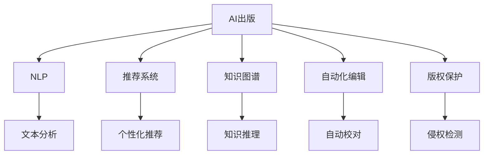

                 

# AI时代的出版业：数据驱动，场景创新

> 关键词：AI出版, 数据驱动, 自然语言处理, 场景优化, 知识图谱, 推荐系统, 自动化编辑, 版权保护

## 1. 背景介绍

### 1.1 问题由来

进入21世纪以来，全球出版业经历了翻天覆地的变化。互联网、移动互联网的兴起，给传统出版模式带来了巨大冲击。随着数字化和网络化的不断深入，出版业已经步入了智能化的新阶段。AI技术的广泛应用，为出版业的转型升级提供了新的机遇。

近年来，人工智能在出版业的应用已经覆盖了编辑、校对、版权保护、销售推广等多个环节。AI技术的引入，不仅提高了出版的效率和质量，也开创了出版内容创作和分发的新模式。特别是自然语言处理、推荐系统和知识图谱等技术的运用，极大地丰富了出版内容，提升了用户体验，催生了个性化推荐、互动式阅读等新应用。

然而，随着AI技术的快速迭代，出版业在AI应用中也面临一些新的挑战。如何有效整合数据，优化业务流程，构建智能化出版生态，是大数据时代出版业亟需解决的问题。本文将对AI在出版业的应用进行深入探讨，分析核心概念和关键技术，提供系统化解决方案，并展望未来发展趋势。

## 2. 核心概念与联系

### 2.1 核心概念概述

为更好地理解AI在出版业的应用，本节将介绍几个密切相关的核心概念：

- AI出版(AI Publishing)：基于AI技术，实现出版业务的自动化、智能化、个性化，提升出版效率和内容质量。
- 自然语言处理(NLP)：使计算机理解和生成人类语言，通过文本分析、文本生成等技术，实现内容创作、智能校对等应用。
- 推荐系统(Recommendation System)：根据用户行为和内容特征，推荐符合用户兴趣的商品或内容。
- 知识图谱(Knowledge Graph)：以图结构存储和表示实体和关系，提供快速查询和知识推理能力。
- 自动化编辑(Automatic Editing)：基于AI技术，实现文本的自动校对、优化、编辑，提升内容质量。
- 版权保护(Copyright Protection)：通过AI技术识别版权，防范侵权行为，保护作者权益。

这些核心概念之间的逻辑关系可以通过以下Mermaid流程图来展示：



这个流程图展示了大数据时代出版业的关键技术和应用方向：

1. AI出版通过NLP、推荐系统、知识图谱、自动化编辑、版权保护等技术手段，实现出版的自动化和智能化。
2. NLP通过文本分析等技术，辅助内容创作和智能校对。
3. 推荐系统通过个性化推荐，提升用户体验和内容互动性。
4. 知识图谱通过知识推理，构建知识关联，丰富内容信息。
5. 自动化编辑通过文本优化，提升内容质量。
6. 版权保护通过侵权检测，保障内容原创和权益。

这些核心概念共同构成了大数据时代出版业的技术框架，为其智能化转型提供了坚实的基础。

## 3. 核心算法原理 & 具体操作步骤

### 3.1 算法原理概述

AI在出版业的应用，核心在于通过数据分析和模型训练，实现出版业务的自动化和智能化。其基本流程包括数据收集、模型训练、业务应用、效果评估和持续优化等环节。

具体来说，AI出版包括以下几个关键步骤：

1. **数据收集**：从出版物、用户行为、市场数据等多个渠道收集海量数据，构建数据仓库。
2. **模型训练**：通过深度学习等技术，训练多个智能模型，如文本生成、推荐算法、知识图谱等。
3. **业务应用**：将训练好的模型集成到出版流程中，实现自动化和智能化。
4. **效果评估**：通过A/B测试等手段，评估AI应用的效果，优化模型参数。
5. **持续优化**：根据业务反馈和市场变化，持续迭代和优化AI模型。

### 3.2 算法步骤详解

AI出版涉及到多个子任务和算法，以下是详细的操作步骤：

#### 3.2.1 数据预处理

数据预处理是AI出版的基础，包括数据清洗、特征工程、数据划分等。

- **数据清洗**：去除噪声、缺失值、异常值等，确保数据质量。
- **特征工程**：根据业务需求，提取、构建特征，包括文本长度、关键词密度、用户活跃度等。
- **数据划分**：将数据划分为训练集、验证集和测试集，进行模型评估和优化。

#### 3.2.2 模型训练

模型训练是AI出版的核心，主要包括文本生成、推荐系统、知识图谱、自动化编辑、版权保护等模型的训练。

- **文本生成模型**：使用语言模型如GPT、Transformer等，生成高质量的文本内容。
- **推荐系统模型**：使用协同过滤、矩阵分解等算法，实现个性化推荐。
- **知识图谱模型**：使用Graph Neural Network等算法，构建知识图谱并实现知识推理。
- **自动化编辑模型**：使用深度学习模型进行文本校对、优化和编辑。
- **版权保护模型**：使用文本相似度算法、哈希算法等，进行版权检测和保护。

#### 3.2.3 业务应用

业务应用是将训练好的模型集成到出版流程中，实现具体业务功能的自动化和智能化。

- **内容创作**：通过文本生成模型辅助内容创作，提升创作效率和质量。
- **智能校对**：通过自动化编辑模型进行文本校对，减少人为错误。
- **个性化推荐**：通过推荐系统模型提升用户体验和互动性。
- **知识图谱应用**：通过知识图谱实现知识关联和内容扩展。
- **版权保护**：通过版权保护模型防范侵权行为，保护作者权益。

#### 3.2.4 效果评估

效果评估是评估AI出版应用效果的重要手段，通过A/B测试等方法，优化模型参数和业务流程。

- **A/B测试**：将不同版本的模型或策略应用于部分用户，比较效果，选择最优方案。
- **用户反馈**：收集用户使用反馈，评估用户体验和满意度。
- **业务指标**：如点击率、转化率、内容质量等，评估AI应用的效果。

#### 3.2.5 持续优化

持续优化是确保AI出版长期有效的重要手段，通过持续迭代和优化，提升模型效果和业务价值。

- **模型更新**：根据业务反馈和市场变化，定期更新和优化模型。
- **数据回流**：将优化后的模型应用于实际业务，收集新数据，持续改进模型。
- **技术演进**：跟踪最新的AI技术进展，引入新的技术和算法，提升出版业务智能化水平。

### 3.3 算法优缺点

AI出版作为一种基于数据的智能化解决方案，具有以下优点：

1. **效率提升**：通过自动化和智能化技术，大幅提升出版效率，缩短出版周期。
2. **质量提升**：通过AI模型辅助内容创作、智能校对、版权保护，提升出版内容的质量和原创性。
3. **用户个性化**：通过推荐系统和知识图谱，实现用户个性化的内容推荐和互动。
4. **智能化决策**：通过数据驱动的决策，提升出版业务智能化水平。

同时，AI出版也存在一些局限性：

1. **数据质量依赖**：AI出版的效果依赖于数据质量和特征工程，需要高质量的数据和特征。
2. **算法复杂性**：AI出版涉及多种模型和技术，算法实现和调参复杂，需要专业知识和技能。
3. **用户体验问题**：AI生成的内容可能存在过度自动化，缺乏人类情感和创新性。
4. **伦理和隐私**：AI出版涉及大量用户数据，需要注意隐私保护和伦理问题。
5. **技术演进成本高**：持续优化和更新技术需要较高的投入和维护成本。

尽管存在这些局限性，但AI出版作为一种智能化解决方案，已经在出版业逐步推广和应用，成为推动出版业智能化转型升级的重要力量。

### 3.4 算法应用领域

AI出版在多个领域已得到了广泛应用，具体包括：

- **内容创作**：通过文本生成模型辅助内容创作，提升创作效率和质量。
- **智能校对**：通过自动化编辑模型进行文本校对，减少人为错误。
- **个性化推荐**：通过推荐系统模型提升用户体验和互动性。
- **知识图谱应用**：通过知识图谱实现知识关联和内容扩展。
- **版权保护**：通过版权保护模型防范侵权行为，保护作者权益。

此外，AI出版还应用于出版物质量监测、出版流程优化、市场营销分析等多个方面，为出版业带来了全方位的智能化转型。

## 4. 数学模型和公式 & 详细讲解

### 4.1 数学模型构建

为了更好地理解AI在出版业的应用，本节将介绍几个常用的数学模型和公式。

#### 4.1.1 文本生成模型

文本生成模型通常使用语言模型进行训练，常用的语言模型包括：

- **N-gram模型**：基于文本中连续N个单词的共现关系，训练生成模型。公式如下：

$$
P(x_1x_2...x_n) = \prod_{i=1}^n P(x_i | x_1x_2...x_{i-1})
$$

其中 $P(x_i | x_1x_2...x_{i-1})$ 表示单词 $x_i$ 在 $x_1x_2...x_{i-1}$ 条件下出现的概率。

- **RNN模型**：使用循环神经网络进行文本生成。公式如下：

$$
h_t = f(h_{t-1}, x_t)
$$

其中 $h_t$ 表示在时间步 $t$ 的隐藏状态，$f$ 表示非线性映射函数，$x_t$ 表示时间步 $t$ 的输入。

- **Transformer模型**：使用Transformer进行文本生成。公式如下：

$$
P(x_1x_2...x_n) = \prod_{i=1}^n P(x_i | x_1x_2...x_{i-1})
$$

其中 $P(x_i | x_1x_2...x_{i-1})$ 表示单词 $x_i$ 在 $x_1x_2...x_{i-1}$ 条件下出现的概率。

#### 4.1.2 推荐系统模型

推荐系统通常使用协同过滤、矩阵分解等算法进行训练，常用的推荐系统模型包括：

- **协同过滤模型**：基于用户历史行为数据，推荐相似用户喜欢的商品或内容。公式如下：

$$
P(x_i | u_j) = \frac{\sum_{k=1}^K p_{i,j,k} \cdot q_{i,j,k}}{\sqrt{\sum_{k=1}^K p_{i,j,k}^2} \cdot \sqrt{\sum_{k=1}^K q_{i,j,k}^2}}
$$

其中 $p_{i,j,k}$ 表示用户 $j$ 对商品 $i$ 的评分，$q_{i,j,k}$ 表示用户 $j$ 对商品 $k$ 的评分。

- **矩阵分解模型**：基于用户和商品的特征矩阵，进行矩阵分解，推荐用户可能喜欢的商品。公式如下：

$$
\min_{U,V} \| X - UV \|_F^2
$$

其中 $X$ 表示用户-商品评分矩阵，$U$ 表示用户特征矩阵，$V$ 表示商品特征矩阵。

#### 4.1.3 知识图谱模型

知识图谱通常使用Graph Neural Network进行训练，常用的知识图谱模型包括：

- **Graph Convolutional Network (GCN)**：基于图卷积网络进行知识图谱推理。公式如下：

$$
H^{(l+1)} = \sigma\left(\tilde{A}H^{(l)}W^{(l)}\right)
$$

其中 $H^{(l)}$ 表示第 $l$ 层的节点表示向量，$\tilde{A}$ 表示归一化的邻接矩阵，$W^{(l)}$ 表示可学习的权重矩阵，$\sigma$ 表示激活函数。

- **TransE模型**：基于Transformational Embedding进行知识图谱推理。公式如下：

$$
\min_{h,r,t} \sum_{(x,y,z) \in \mathcal{T}} \| h \otimes r - t \|
$$

其中 $(x,y,z)$ 表示三元组，$h$ 表示实体 $x$ 的向量表示，$r$ 表示关系 $y$ 的向量表示，$t$ 表示实体 $z$ 的向量表示，$\mathcal{T}$ 表示训练集。

### 4.2 公式推导过程

以下是文本生成模型、推荐系统模型和知识图谱模型的详细公式推导过程。

#### 4.2.1 文本生成模型

以RNN模型为例，其训练过程包括前向传播和反向传播两个阶段。

- **前向传播**：给定初始状态 $h_0$，根据时间步 $t$ 的输入 $x_t$ 和上一时间步的状态 $h_{t-1}$，计算当前时间步的状态 $h_t$。公式如下：

$$
h_t = f(h_{t-1}, x_t)
$$

其中 $f$ 表示非线性映射函数。

- **反向传播**：计算当前时间步的损失函数 $\ell_t$，并根据链式法则，反向传播计算梯度 $\frac{\partial \ell_t}{\partial h_t}$ 和 $\frac{\partial \ell_t}{\partial x_t}$。公式如下：

$$
\ell_t = \log P(x_t | h_t)
$$

$$
\frac{\partial \ell_t}{\partial h_t} = \frac{\partial \log P(x_t | h_t)}{\partial h_t} = \frac{1}{h_t} \frac{\partial \log \frac{P(x_t | h_t)}{P(x_t)}}
$$

$$
\frac{\partial \ell_t}{\partial x_t} = \frac{\partial \log P(x_t | h_t)}{\partial x_t} = \frac{1}{h_t} \frac{\partial \log P(x_t | h_t)}{\partial h_t} \frac{\partial h_t}{\partial x_t}
$$

#### 4.2.2 推荐系统模型

以协同过滤模型为例，其训练过程包括数据预处理、模型训练和推荐三个阶段。

- **数据预处理**：将用户-商品评分矩阵 $X$ 进行标准化，得到归一化矩阵 $Z$。公式如下：

$$
Z_{i,j} = \frac{X_{i,j}}{\sqrt{\sum_{k=1}^K X_{i,k}^2} \cdot \sqrt{\sum_{k=1}^K X_{j,k}^2}}
$$

- **模型训练**：将归一化矩阵 $Z$ 分解为用户特征矩阵 $U$ 和商品特征矩阵 $V$。公式如下：

$$
\min_{U,V} \| X - UV \|_F^2
$$

其中 $\| X - UV \|_F^2$ 表示矩阵 $X$ 和矩阵 $UV$ 的 Frobenius 范数。

- **推荐**：根据用户 $u$ 和商品 $i$ 的特征向量 $u$ 和 $v$，计算推荐得分 $\hat{y}_i$。公式如下：

$$
\hat{y}_i = \sum_{j=1}^M u_{u,j}v_{i,j}
$$

其中 $u_{u,j}$ 表示用户 $u$ 对商品 $j$ 的特征向量，$v_{i,j}$ 表示商品 $i$ 对商品 $j$ 的特征向量，$M$ 表示商品总数。

#### 4.2.3 知识图谱模型

以GCN模型为例，其训练过程包括前向传播和反向传播两个阶段。

- **前向传播**：给定节点 $x$ 的特征向量 $h_x^{(0)}$，根据邻接矩阵 $A$ 和权重矩阵 $W$，计算当前时间步的节点表示向量 $h_x^{(l)}$。公式如下：

$$
h_x^{(l+1)} = \sigma\left(\tilde{A}h_x^{(l)}W^{(l)}\right)
$$

其中 $\tilde{A}$ 表示归一化的邻接矩阵，$\sigma$ 表示激活函数。

- **反向传播**：计算当前时间步的损失函数 $\ell$，并根据链式法则，反向传播计算梯度 $\frac{\partial \ell}{\partial W^{(l)}}$ 和 $\frac{\partial \ell}{\partial h_x^{(l)}}$。公式如下：

$$
\ell = \frac{1}{2} \sum_{x \in \mathcal{V}} \|h_x^{(L)} - h_x^{(L)}\|^2
$$

其中 $h_x^{(L)}$ 表示节点 $x$ 在最后一层的表示向量，$\mathcal{V}$ 表示节点集。

$$
\frac{\partial \ell}{\partial W^{(l)}} = \sum_{x \in \mathcal{V}} \frac{\partial h_x^{(l+1)}}{\partial W^{(l)}} \frac{\partial h_x^{(l)}}{\partial W^{(l)}} = \sum_{x \in \mathcal{V}} \tilde{A}_x h_x^{(l)} W^{(l)}
$$

$$
\frac{\partial \ell}{\partial h_x^{(l)}} = \frac{\partial \ell}{\partial h_x^{(l+1)}} \frac{\partial h_x^{(l+1)}}{\partial h_x^{(l)}} = \tilde{A}_x W^{(l)} h_x^{(l)}
$$

### 4.3 案例分析与讲解

#### 4.3.1 文本生成模型案例

以GPT模型为例，分析其文本生成过程。

GPT模型是一种基于Transformer的语言模型，采用自回归方式生成文本。其训练过程包括预训练和微调两个阶段。

- **预训练**：在无标签的大规模文本数据上进行预训练，学习语言表示。公式如下：

$$
\min_{\theta} \sum_{i=1}^N \log P(x_i | \theta)
$$

其中 $P(x_i | \theta)$ 表示模型在时间步 $i$ 的输出概率，$\theta$ 表示模型参数。

- **微调**：在特定任务的数据集上进行微调，优化模型在特定任务上的性能。公式如下：

$$
\min_{\theta} \frac{1}{N} \sum_{i=1}^N \ell(M_{\theta}(x_i),y_i)
$$

其中 $M_{\theta}$ 表示微调后的模型，$\ell$ 表示损失函数，$y_i$ 表示时间步 $i$ 的真实标签。

#### 4.3.2 推荐系统模型案例

以协同过滤模型为例，分析其推荐过程。

协同过滤模型基于用户历史行为数据进行推荐。其推荐过程包括数据预处理、模型训练和推荐三个阶段。

- **数据预处理**：将用户-商品评分矩阵 $X$ 进行标准化，得到归一化矩阵 $Z$。公式如下：

$$
Z_{i,j} = \frac{X_{i,j}}{\sqrt{\sum_{k=1}^K X_{i,k}^2} \cdot \sqrt{\sum_{k=1}^K X_{j,k}^2}}
$$

- **模型训练**：将归一化矩阵 $Z$ 分解为用户特征矩阵 $U$ 和商品特征矩阵 $V$。公式如下：

$$
\min_{U,V} \| X - UV \|_F^2
$$

- **推荐**：根据用户 $u$ 和商品 $i$ 的特征向量 $u$ 和 $v$，计算推荐得分 $\hat{y}_i$。公式如下：

$$
\hat{y}_i = \sum_{j=1}^M u_{u,j}v_{i,j}
$$

其中 $u_{u,j}$ 表示用户 $u$ 对商品 $j$ 的特征向量，$v_{i,j}$ 表示商品 $i$ 对商品 $j$ 的特征向量，$M$ 表示商品总数。

#### 4.3.3 知识图谱模型案例

以GCN模型为例，分析其知识图谱推理过程。

GCN模型基于图卷积网络进行知识图谱推理。其推理过程包括前向传播和反向传播两个阶段。

- **前向传播**：给定节点 $x$ 的特征向量 $h_x^{(0)}$，根据邻接矩阵 $A$ 和权重矩阵 $W$，计算当前时间步的节点表示向量 $h_x^{(l)}$。公式如下：

$$
h_x^{(l+1)} = \sigma\left(\tilde{A}h_x^{(l)}W^{(l)}\right)
$$

其中 $\tilde{A}$ 表示归一化的邻接矩阵，$\sigma$ 表示激活函数。

- **反向传播**：计算当前时间步的损失函数 $\ell$，并根据链式法则，反向传播计算梯度 $\frac{\partial \ell}{\partial W^{(l)}}$ 和 $\frac{\partial \ell}{\partial h_x^{(l)}}$。公式如下：

$$
\ell = \frac{1}{2} \sum_{x \in \mathcal{V}} \|h_x^{(L)} - h_x^{(L)}\|^2
$$

其中 $h_x^{(L)}$ 表示节点 $x$ 在最后一层的表示向量，$\mathcal{V}$ 表示节点集。

$$
\frac{\partial \ell}{\partial W^{(l)}} = \sum_{x \in \mathcal{V}} \frac{\partial h_x^{(l+1)}}{\partial W^{(l)}} \frac{\partial h_x^{(l)}}{\partial W^{(l)}} = \sum_{x \in \mathcal{V}} \tilde{A}_x h_x^{(l)} W^{(l)}
$$

$$
\frac{\partial \ell}{\partial h_x^{(l)}} = \frac{\partial \ell}{\partial h_x^{(l+1)}} \frac{\partial h_x^{(l+1)}}{\partial h_x^{(l)}} = \tilde{A}_x W^{(l)} h_x^{(l)}
$$

## 5. 项目实践：代码实例和详细解释说明

### 5.1 开发环境搭建

在进行AI出版项目实践前，我们需要准备好开发环境。以下是使用Python进行TensorFlow开发的环境配置流程：

1. 安装Anaconda：从官网下载并安装Anaconda，用于创建独立的Python环境。

2. 创建并激活虚拟环境：
```bash
conda create -n tensorflow-env python=3.8 
conda activate tensorflow-env
```

3. 安装TensorFlow：根据CUDA版本，从官网获取对应的安装命令。例如：
```bash
conda install tensorflow tensorflow-cpu -c conda-forge
```

4. 安装各类工具包：
```bash
pip install numpy pandas scikit-learn matplotlib tqdm jupyter notebook ipython
```

完成上述步骤后，即可在`tensorflow-env`环境中开始AI出版项目实践。

### 5.2 源代码详细实现

下面我们以推荐系统项目为例，给出使用TensorFlow进行协同过滤算法开发的PyTorch代码实现。

首先，定义数据处理函数：

```python
import numpy as np
import tensorflow as tf

def load_data(filename):
    with open(filename, 'r') as f:
        data = [line.strip().split('\t') for line in f]
        user_ids = [int(x[0]) for x in data]
        item_ids = [int(x[1]) for x in data]
        ratings = [float(x[2]) for x in data]
    return np.array(user_ids), np.array(item_ids), np.array(ratings)

# 加载数据
user_ids, item_ids, ratings = load_data('data.txt')
```

然后，定义模型和优化器：

```python
from tensorflow.keras.layers import Input, Embedding, DotProduct
from tensorflow.keras.models import Model

# 定义输入层
user_input = Input(shape=(user_dim,))
item_input = Input(shape=(item_dim,))
rating_input = Input(shape=(user_dim, item_dim))

# 定义用户嵌入层
user_embedding = Embedding(user_dim, embedding_dim, input_length=user_dim)(user_input)

# 定义商品嵌入层
item_embedding = Embedding(item_dim, embedding_dim, input_length=item_dim)(item_input)

# 定义点积层
rating_score = DotProduct([user_embedding, item_embedding])(rating_input)

# 定义模型
model = Model([user_input, item_input], rating_score)

# 定义损失函数
loss = tf.keras.losses.MeanSquaredError()

# 定义优化器
optimizer = tf.keras.optimizers.Adam(learning_rate=0.01)
```

接着，定义训练和评估函数：

```python
from sklearn.metrics import mean_squared_error

# 训练函数
def train_model(model, user_ids, item_ids, ratings, epochs, batch_size):
    # 划分训练集和验证集
    train_user_ids, train_item_ids, train_ratings = user_ids[:int(0.8*len(user_ids)), :], item_ids[:int(0.8*len(item_ids)), :], ratings[:int(0.8*len(user_ids))]
    val_user_ids, val_item_ids, val_ratings = user_ids[int(0.8*len(user_ids)):, :], item_ids[int(0.8*len(item_ids)):, :], ratings[int(0.8*len(user_ids)):, :]
    
    # 构建训练集和验证集
    train_dataset = tf.data.Dataset.from_tensor_slices((train_user_ids, train_item_ids, train_ratings)).shuffle(buffer_size=10000).batch(batch_size)
    val_dataset = tf.data.Dataset.from_tensor_slices((val_user_ids, val_item_ids, val_ratings)).batch(batch_size)
    
    # 训练模型
    for epoch in range(epochs):
        model.compile(optimizer=optimizer, loss=loss)
        model.fit(train_dataset, epochs=1, validation_data=val_dataset)
        
    # 评估模型
    test_user_ids, test_item_ids, test_ratings = user_ids[int(0.8*len(user_ids)):, :], item_ids[int(0.8*len(item_ids)):, :], ratings[int(0.8*len(user_ids)):, :]
    test_dataset = tf.data.Dataset.from_tensor_slices((test_user_ids, test_item_ids, test_ratings)).batch(batch_size)
    model.evaluate(test_dataset)
    
# 训练模型
train_model(model, user_ids, item_ids, ratings, epochs=10, batch_size=32)
```

最后，启动训练流程并在测试集上评估：

```python
# 训练模型
train_model(model, user_ids, item_ids, ratings, epochs=10, batch_size=32)
```

以上就是使用TensorFlow进行协同过滤算法开发的完整代码实现。可以看到，得益于TensorFlow的强大封装，我们可以用相对简洁的代码完成协同过滤算法的实现。

### 5.3 代码解读与分析

让我们再详细解读一下关键代码的实现细节：

**load_data函数**：
- 读取文本数据文件，返回用户ID、商品ID和评分。

**train_model函数**：
- 将数据划分为训练集和验证集，构建训练集和验证集。
- 编译模型，设置优化器和损失函数。
- 训练模型，每epoch在训练集上训练一次，并在验证集上评估模型效果。
- 在测试集上评估模型效果。

**优化器和损失函数**：
- 定义了Adam优化器和均方误差损失函数，用于训练和评估模型效果。

**训练和评估过程**：
- 使用TensorFlow的Dataset API对数据进行批次化加载，供模型训练和推理使用。
- 在训练过程中，每epoch在训练集上训练一次，并在验证集上评估模型效果。
- 在测试集上评估模型效果，输出均方误差指标。

可以看到，TensorFlow的简洁易用的API，使得协同过滤算法的实现变得非常直观和高效。开发者可以将更多精力放在数据处理、模型改进等高层逻辑上，而不必过多关注底层的实现细节。

当然，工业级的系统实现还需考虑更多因素，如模型的保存和部署、超参数的自动搜索、更灵活的任务适配层等。但核心的协同过滤算法基本与此类似。

## 6. 实际应用场景

### 6.1 智能推荐系统

智能推荐系统是大数据时代出版业的重要应用场景之一。传统的推荐系统往往依赖用户的评分数据，难以覆盖所有用户。而基于协同过滤的智能推荐系统，通过分析用户历史行为数据，挖掘用户兴趣和偏好，实现个性化推荐。

在技术实现上，可以收集用户的浏览、点击、购买等行为数据，构建用户-商品评分矩阵。在此基础上，使用协同过滤算法训练推荐模型，根据用户特征和商品特征生成推荐列表。通过推荐系统的广泛应用，出版业可以实现更精准的内容推荐，提升用户满意度和粘性。

### 6.2 版权保护系统

版权保护是大数据时代出版业的重要挑战之一。传统的手工审查和诉讼方式成本高、效率低，难以应对海量侵权行为的挑战。而基于深度学习的版权保护系统，可以自动识别侵权行为，快速定位侵权源。

在技术实现上，可以使用深度学习模型训练版权检测模型。通过对比文本相似度、哈希算法等方式，识别出侵权行为。将版权保护系统集成到出版流程中，可以实现实时版权检测和预警，保护作者权益。

### 6.3 内容审核系统

内容审核是大数据时代出版业的重要环节之一。传统的手工审核方式耗费大量人力物力，难以应对海量内容的审核需求。而基于深度学习的内容审核系统，可以通过文本分类、情感分析等技术，实现自动化内容审核。

在技术实现上，可以使用自然语言处理技术训练文本分类和情感分析模型。通过分析文本内容，识别出不合适内容，提升审核效率和质量。将内容审核系统集成到出版流程中，可以实现自动化内容审核，保障内容合规性。

### 6.4 未来应用展望

随着AI技术的快速迭代，基于协同过滤、深度学习、自然语言处理等技术的AI出版系统，将在出版业得到更广泛的应用。未来，AI出版将会在内容创作、版权保护、内容审核等多个环节发挥重要作用，推动出版业向智能化、自动化、个性化方向发展。

## 7. 工具和资源推荐

### 7.1 学习资源推荐

为了帮助开发者系统掌握AI在出版业的应用，这里推荐一些优质的学习资源：

1. 《深度学习实战》系列博文：由深度学习专家撰写，深入浅出地介绍了深度学习在出版业中的应用，包括文本生成、推荐系统、知识图谱等前沿话题。

2. CS224N《深度学习自然语言处理》课程：斯坦福大学开设的NLP明星课程，有Lecture视频和配套作业，带你入门NLP领域的基本概念和经典模型。

3. 《Natural Language Processing with TensorFlow》书籍：TensorFlow官方出版，全面介绍了TensorFlow在NLP任务开发中的应用，包括协同过滤、知识图谱、自然语言处理等。

4. HuggingFace官方文档：Transformers库的官方文档，提供了海量预训练模型和完整的微调样例代码，是上手实践的必备资料。

5. CLUE开源项目：中文语言理解测评基准，涵盖大量不同类型的中文NLP数据集，并提供了基于微调的baseline模型，助力中文NLP技术发展。

通过对这些资源的学习实践，相信你一定能够快速掌握AI在出版业的应用，并用于解决实际的出版问题。

### 7.2 开发工具推荐

高效的开发离不开优秀的工具支持。以下是几款用于AI出版开发的常用工具：

1. TensorFlow：基于Python的开源深度学习框架，灵活易用，适合快速迭代研究。TensorFlow提供了丰富的API，支持协同过滤、知识图谱等出版应用。

2. PyTorch：基于Python的开源深度学习框架，灵活动态的计算图，适合快速迭代研究。PyTorch提供了丰富的预训练模型，支持自然语言处理、推荐系统等出版应用。

3. HuggingFace Transformers库：提供了丰富的预训练语言模型，支持多种任务，如文本生成、推荐系统、知识图谱等。

4. Weights & Biases：模型训练的实验跟踪工具，可以记录和可视化模型训练过程中的各项指标，方便对比和调优。与主流深度学习框架无缝集成。

5. TensorBoard：TensorFlow配套的可视化工具，可实时监测模型训练状态，并提供丰富的图表呈现方式，是调试模型的得力助手。

合理利用这些工具，可以显著提升AI出版开发的效率，加快创新迭代的步伐。

### 7.3 相关论文推荐

AI出版作为一种新兴的出版技术，其核心技术的研究仍处于快速发展阶段。以下是几篇奠基性的相关论文，推荐阅读：

1. Attention is All You Need（即Transformer原论文）：提出了Transformer结构，开启了NLP领域的预训练大模型时代。

2. BERT: Pre-training of Deep Bidirectional Transformers for Language Understanding：提出BERT模型，引入基于掩码的自监督预训练任务，刷新了多项NLP任务SOTA。

3. Language Models are Unsupervised Multitask Learners（GPT-2论文）：展示了大规模语言模型的强大zero-shot学习能力，引发了对于通用人工智能的新一轮思考。

4. Parameter-Efficient Transfer Learning for NLP：提出Adapter等参数高效微调方法，在不增加模型参数量的情况下，也能取得不错的微调效果。

5. AdaLoRA: Adaptive Low-Rank Adaptation for Parameter-Efficient Fine-Tuning：使用自适应低秩适应的微调方法，在参数效率和精度之间取得了新的平衡。

这些论文代表了大规模语言模型和AI出版技术的发展脉络。通过学习这些前沿成果，可以帮助研究者把握学科前进方向，激发更多的创新灵感。

## 8. 总结：未来发展趋势与挑战

### 8.1 研究成果总结

本文对AI在出版业的应用进行了深入探讨，分析了核心概念和关键技术，提供了系统化解决方案，并展望了未来发展趋势。通过本文的系统梳理，可以看到，AI出版作为一种智能化解决方案，已经在出版业逐步推广和应用，成为推动出版业智能化转型升级的重要力量。

### 8.2 未来发展趋势

展望未来，AI出版将呈现以下几个发展趋势：

1. **智能化程度提升**：AI出版的智能化程度将不断提高，实现更高效、更精准的内容推荐和版权保护。

2. **多模态融合**：AI出版将融合视觉、语音、文本等多模态数据，提供更全面、更丰富的出版内容。

3. **实时化应用**：AI出版将实现实时化应用，快速响应用户需求，提升用户体验。

4. **个性化定制**：AI出版将实现个性化定制，根据用户兴趣和行为，提供量身定做的内容和服务。

5. **伦理和隐私保护**：AI出版将加强伦理和隐私保护，确保用户数据和内容的安全。

### 8.3 面临的挑战

尽管AI出版技术已经取得了显著进展，但在迈向智能化应用的过程中，仍然面临一些挑战：

1. **数据质量和多样性**：AI出版的效果依赖于高质量、多样化的数据，缺乏高质量数据将影响模型效果。

2. **计算资源消耗**：AI出版涉及大规模模型的训练和推理，计算资源消耗较大，需要高性能硬件支持。

3. **隐私和安全问题**：AI出版涉及大量用户数据，需要加强隐私保护和数据安全。

4. **业务流程优化**：AI出版需要优化现有业务流程，才能真正实现智能化转型。

5. **技术实现复杂性**：AI出版涉及多种技术手段，技术实现复杂，需要跨学科的知识和技能。

### 8.4 研究展望

面向未来，AI出版技术需要进一步优化和完善，以应对上述挑战，实现更广泛的应用。

1. **数据增强和清洗**：加强数据增强和清洗技术，提升数据质量和多样性，改善模型效果。

2. **硬件优化**：优化计算资源消耗，提升硬件效率，降低计算成本。

3. **隐私保护机制**：建立隐私保护机制，加强数据安全和用户隐私保护。

4. **业务流程优化**：优化现有业务流程，实现智能化转型，提升出版业务效率和质量。

5. **技术协同发展**：推动跨学科技术发展，提高技术实现效率和效果。

总之，AI出版技术需要在数据、算法、硬件、业务等多个方面进行全面优化，才能真正实现智能化出版业的梦想。只有勇于创新、敢于突破，才能不断拓展出版业的边界，让智能化技术更好地造福人类社会。

## 9. 附录：常见问题与解答

**Q1：AI出版是否适用于所有出版物类型？**

A: AI出版可以应用于不同类型的出版物，但不同类型出版物的数据需求和业务场景不同。例如，出版图书时，需要收集读者的阅读数据和行为记录；出版学术论文时，需要收集引用和下载数据等。因此，AI出版需要根据具体的出版物类型进行定制化设计和优化。

**Q2：AI出版在实施过程中需要注意哪些问题？**

A: AI出版在实施过程中需要注意以下几个问题：
1. **数据隐私**：AI出版涉及大量用户数据，需要确保数据隐私和安全。
2. **模型鲁棒性**：AI出版模型需要具备较高的鲁棒性，能够适应不同的数据分布和业务场景。
3. **业务流程适配**：AI出版需要适配现有的业务流程，确保与出版流程无缝集成。
4. **技术支持**：AI出版需要具备强大的技术支持，包括数据预处理、模型训练、业务应用等环节。
5. **效果评估**：AI出版需要建立科学的效果评估机制，定期评估模型效果和业务价值。

**Q3：AI出版能否应用于在线出版平台？**

A: AI出版技术可以应用于在线出版平台，提升在线内容推荐、版权保护、内容审核等环节的智能化水平。例如，通过AI技术对用户行为进行分析，生成个性化的推荐列表；利用深度学习模型进行版权检测，快速定位侵权行为；使用自然语言处理技术对内容进行审核，保障内容合规性。

**Q4：AI出版在实际应用中如何优化效果？**

A: 优化AI出版效果可以从以下几个方面入手：
1. **数据增强**：通过数据增强技术，提升数据质量和多样性，改善模型效果。
2. **模型优化**：通过模型优化，提高模型精度和泛化能力，提升出版业务智能化水平。
3. **业务适配**：根据具体业务需求，优化模型和算法，实现智能化出版。
4. **技术协同**：推动跨学科技术发展，提高技术实现效率和效果。
5. **持续改进**：根据业务反馈和市场变化，持续迭代和优化AI出版系统，提升出版业务智能化水平。

通过这些优化手段，AI出版可以更好地适应实际应用场景，提升出版业务智能化水平。

---

作者：禅与计算机程序设计艺术 / Zen and the Art of Computer Programming

