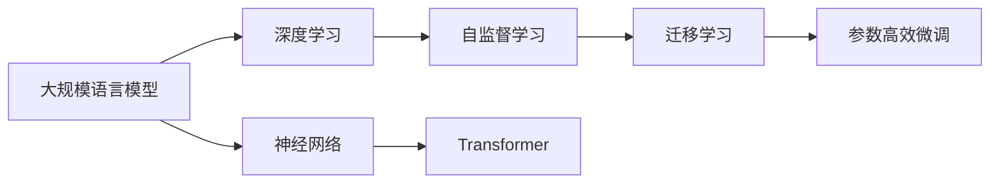

                 

# AI的摩尔定律：LLM性能提升的可能性

> 关键词：语言模型,深度学习,神经网络,摩尔定律,计算能力提升,人工智能

## 1. 背景介绍

### 1.1 问题由来
随着科技的飞速发展，人工智能（AI）正在以前所未有的速度推动着各行业的变革。在大规模语言模型（Large Language Models, LLMs）领域，基于深度学习技术的人工智能系统已经在自然语言处理（NLP）任务上取得了令人瞩目的成果，如OpenAI的GPT-3、Google的BERT等模型已经在问答、翻译、文本生成等任务中展现出了强大的能力。

然而，随着时间的推移，摩尔定律的失效使得传统的计算硬件性能提升受到了限制。尽管如此，在人工智能领域，尤其是语言模型领域，我们似乎能够继续利用摩尔定律带来的红利。为了更深入地理解大语言模型性能提升的可能性，本文将从计算能力的提升、架构演进、算法优化和数据驱动等多个角度进行探讨。

### 1.2 问题核心关键点
摩尔定律在AI领域的应用可以归纳为以下关键点：

- **计算能力的指数级提升**：随着芯片计算能力的不断提升，训练更大、更复杂的语言模型成为可能。
- **架构演进**：从简单的多层感知器到深度卷积神经网络，再到如今广泛使用的Transformer结构，架构的不断优化使得模型能够更有效地捕捉长距离依赖。
- **算法优化**：如迁移学习、自监督学习、参数高效微调等技术使得模型的性能不断优化。
- **数据驱动**：大量标注数据和无标签数据的利用使得模型能够学习到更丰富的知识。
- **硬件优化**：如GPU加速、TPU优化、分布式训练等硬件加速技术使得训练过程更为高效。

这些关键点共同推动了AI技术，特别是大语言模型性能的不断提升，也为未来的AI发展奠定了基础。

## 2. 核心概念与联系

### 2.1 核心概念概述

为了更好地理解大语言模型的性能提升，我们先概述一些关键概念及其之间的联系：

- **大规模语言模型（LLMs）**：指通过在大规模无标签数据上进行自监督预训练，学习到丰富的语言表示能力的模型，如BERT、GPT-3等。
- **深度学习（Deep Learning）**：基于神经网络的机器学习方法，其特征是模型具有多层次的非线性结构。
- **神经网络（Neural Network）**：由大量人工神经元组成的计算模型，用于处理复杂的非线性映射问题。
- **摩尔定律**：描述集成电路晶体管数量的每两年翻倍，性能每两年提高一倍的定律。
- **Transformer**：一种用于序列建模的神经网络结构，以其高效并行计算和强大的语言建模能力而著称。
- **迁移学习（Transfer Learning）**：将在一个任务上训练好的模型迁移到另一个任务上，以减少训练时间和标注数据需求。
- **自监督学习（Supervised Learning）**：利用未标注的数据进行训练，通过引入额外约束（如掩码语言模型、未来预测等）来促进模型学习。
- **参数高效微调（Parameter-Efficient Fine-Tuning, PEFT）**：在微调过程中只更新部分参数，以降低对计算资源的消耗。

这些核心概念构成了大语言模型性能提升的基础框架。通过深入理解这些概念及其相互作用，我们可以更好地把握AI技术发展的脉络和未来趋势。

### 2.2 核心概念原理和架构的 Mermaid 流程图



这个流程图展示了上述核心概念之间的联系：大规模语言模型基于深度学习进行构建，其中神经网络是其核心结构；通过自监督学习技术进行预训练；迁移学习技术使得模型能够迁移到下游任务；参数高效微调技术进一步优化模型性能。

## 3. 核心算法原理 & 具体操作步骤

### 3.1 算法原理概述

大语言模型的性能提升主要依赖于以下几个方面：

- **计算能力的提升**：摩尔定律失效导致传统计算硬件性能提升受限，但深度学习技术可以通过并行计算、硬件加速等手段突破这一瓶颈。
- **架构演进**：从传统的卷积神经网络（CNN）到现今广泛使用的Transformer结构，架构的演进使得模型更加高效、灵活。
- **算法优化**：如迁移学习、自监督学习、参数高效微调等技术，使得模型能够更好地适应特定任务，提升性能。
- **数据驱动**：大量标注数据和无标签数据的利用，使得模型能够学习到更丰富的知识。

### 3.2 算法步骤详解

大语言模型的性能提升可以分为以下几个关键步骤：

**Step 1: 数据预处理和标注**
- 收集大规模无标签数据和少量有标签数据进行预处理。
- 对数据进行清洗、分词、标准化等预处理操作。
- 标注部分数据，用于微调和验证模型性能。

**Step 2: 模型预训练**
- 在大规模无标签数据上使用自监督学习技术进行预训练。
- 引入掩码语言模型、未来预测等约束，促进模型学习语言表征。
- 使用Transformer结构进行序列建模，提高模型捕捉长距离依赖的能力。

**Step 3: 微调**
- 选择合适的预训练模型，如BERT、GPT-3等。
- 在少量标注数据上使用迁移学习或自监督学习技术进行微调。
- 使用参数高效微调技术，如Adapter、LoRA等，优化模型性能。

**Step 4: 评估与部署**
- 在验证集上评估微调后的模型性能。
- 根据评估结果调整模型超参数和训练策略。
- 将模型部署到实际应用环境中，进行性能优化和监控。

### 3.3 算法优缺点

基于摩尔定律的大语言模型性能提升具有以下优点：

- **计算效率高**：并行计算和硬件加速技术使得训练过程更加高效。
- **模型性能强**：Transformer结构和深度学习技术使得模型具有强大的语言建模能力。
- **适应性强**：自监督学习和迁移学习技术使得模型能够适应多种下游任务。

同时，也存在以下缺点：

- **数据需求高**：训练大规模语言模型需要大量的标注数据，数据收集和标注成本高。
- **资源消耗大**：大规模语言模型对计算资源的需求大，需要高性能计算设备和分布式训练系统。
- **模型复杂**：模型结构复杂，调试和优化难度大。
- **可解释性差**：深度学习模型的"黑盒"特性使得其决策过程难以解释和调试。

### 3.4 算法应用领域

大语言模型性能提升技术在以下领域有着广泛的应用：

- **自然语言处理（NLP）**：文本分类、问答系统、机器翻译、文本生成等任务。
- **计算机视觉（CV）**：图像分类、目标检测、图像生成等任务。
- **语音识别（ASR）**：自动语音识别、语音合成等任务。
- **推荐系统**：个性化推荐、内容过滤等任务。
- **金融风控**：信用评估、欺诈检测等任务。

## 4. 数学模型和公式 & 详细讲解

### 4.1 数学模型构建

大语言模型的性能提升涉及到多个数学模型和公式。下面我们将以BERT模型为例，简要介绍其主要数学模型构建。

**掩码语言模型**
掩码语言模型是BERT模型的核心预训练任务之一，其公式为：

$$
\mathcal{L}_{MLM} = -\frac{1}{N}\sum_{i=1}^N \sum_{j=1}^L \log P(w_{i,j}|w_{< i,j})
$$

其中，$w_{< i,j}$ 表示文本中除了位置 $i$ 和位置 $j$ 之外的所有词，$P(w_{i,j}|w_{< i,j})$ 为预测第 $i$ 个位置上的词 $w_{i,j}$ 的条件概率。

**未来预测**
未来预测是BERT模型的另一个预训练任务，其公式为：

$$
\mathcal{L}_{Next} = -\frac{1}{N}\sum_{i=1}^N \log P(w_{i+1}|w_{< i+1})
$$

其中，$w_{< i+1}$ 表示文本中除了位置 $i+1$ 之前的所有词。

### 4.2 公式推导过程

掩码语言模型和未来预测的公式推导如下：

**掩码语言模型**
假设文本 $w = (w_1, w_2, ..., w_L)$，则掩码语言模型的公式可以表示为：

$$
\begin{aligned}
\mathcal{L}_{MLM} &= -\frac{1}{N}\sum_{i=1}^N \sum_{j=1}^L \log P(w_{i,j}|w_{< i,j}) \\
&= -\frac{1}{N}\sum_{i=1}^N \sum_{j=1}^L \sum_{k=1}^{v} \log softmax(\mathbf{W} \mathbf{H}(w_{< i,j}, \mathbf{Q}_j) \mathbf{K}_k)^{w_{i,j}} \\
&= -\frac{1}{N}\sum_{i=1}^N \sum_{j=1}^L \sum_{k=1}^{v} \log \frac{e^{(\mathbf{W} \mathbf{H}(w_{< i,j}, \mathbf{Q}_j) \mathbf{K}_k)^{w_{i,j}}}{\sum_{k=1}^{v} e^{(\mathbf{W} \mathbf{H}(w_{< i,j}, \mathbf{Q}_j) \mathbf{K}_k)^{w_{i,j}}} \\
&= -\frac{1}{N}\sum_{i=1}^N \sum_{j=1}^L \sum_{k=1}^{v} w_{i,j} \log \frac{e^{(\mathbf{W} \mathbf{H}(w_{< i,j}, \mathbf{Q}_j) \mathbf{K}_k)^{w_{i,j}}}{\sum_{k=1}^{v} e^{(\mathbf{W} \mathbf{H}(w_{< i,j}, \mathbf{Q}_j) \mathbf{K}_k)^{w_{i,j}}}
\end{aligned}
$$

其中，$\mathbf{W}$、$\mathbf{H}$ 和 $\mathbf{Q}$ 分别表示线性变换、MLP 和注意力机制的权重矩阵，$k$ 为词向量维度，$v$ 为词汇表大小，$\mathbf{K}$ 表示查询矩阵。

**未来预测**
未来预测的公式可以表示为：

$$
\mathcal{L}_{Next} = -\frac{1}{N}\sum_{i=1}^N \sum_{j=1}^L \log P(w_{i+1}|w_{< i+1})
$$

同样地，可以表示为：

$$
\begin{aligned}
\mathcal{L}_{Next} &= -\frac{1}{N}\sum_{i=1}^N \log P(w_{i+1}|w_{< i+1}) \\
&= -\frac{1}{N}\sum_{i=1}^N \log \frac{e^{(\mathbf{W} \mathbf{H}(w_{< i+1}, \mathbf{Q}_i) \mathbf{K}_{w_{i+1}})^{w_{i+1}}}{\sum_{k=1}^{v} e^{(\mathbf{W} \mathbf{H}(w_{< i+1}, \mathbf{Q}_i) \mathbf{K}_k)^{w_{i+1}}} \\
&= -\frac{1}{N}\sum_{i=1}^N \log \frac{e^{(\mathbf{W} \mathbf{H}(w_{< i+1}, \mathbf{Q}_i) \mathbf{K}_{w_{i+1}})^{w_{i+1}}}{\sum_{k=1}^{v} e^{(\mathbf{W} \mathbf{H}(w_{< i+1}, \mathbf{Q}_i) \mathbf{K}_k)^{w_{i+1}}}
\end{aligned}
$$

### 4.3 案例分析与讲解

假设有一个文本序列 $w = (w_1, w_2, ..., w_7)$，其中 $w_1 = "I"，w_2 = "love"，$ $w_3 = "language"，$ $w_4 = "models"，$ $w_5 = "I"，$ $w_6 = "hate"，$ $w_7 = "them"。我们假设模型的掩码概率为0.15，即每个词有15%的概率被随机掩码。

**掩码语言模型**
对于位置 $i=3$，$j=1$，我们掩码了 $w_1$ 和 $w_2$，即 $w_{< i,j} = (w_3, w_4, w_5)$，则模型的损失函数为：

$$
\mathcal{L}_{MLM} = -\frac{1}{N} \log P(w_3|w_{< 3,1}) - \frac{1}{N} \log P(w_4|w_{< 3,1}) - \frac{1}{N} \log P(w_5|w_{< 3,1})
$$

**未来预测**
对于位置 $i=4$，即 $w_4$，模型预测下一个词 $w_5$，则模型的损失函数为：

$$
\mathcal{L}_{Next} = -\frac{1}{N} \log P(w_5|w_{< 4,4})
$$

## 5. 项目实践：代码实例和详细解释说明

### 5.1 开发环境搭建

要进行大语言模型性能提升的实践，我们需要一个高效的开发环境。以下是使用Python进行PyTorch开发的典型环境配置流程：

1. 安装Anaconda：从官网下载并安装Anaconda，用于创建独立的Python环境。

2. 创建并激活虚拟环境：
```bash
conda create -n pytorch-env python=3.8 
conda activate pytorch-env
```

3. 安装PyTorch：根据CUDA版本，从官网获取对应的安装命令。例如：
```bash
conda install pytorch torchvision torchaudio cudatoolkit=11.1 -c pytorch -c conda-forge
```

4. 安装Transformers库：
```bash
pip install transformers
```

5. 安装各类工具包：
```bash
pip install numpy pandas scikit-learn matplotlib tqdm jupyter notebook ipython
```

完成上述步骤后，即可在`pytorch-env`环境中开始性能提升实践。

### 5.2 源代码详细实现

这里我们以BERT模型为例，给出使用Transformers库对BERT模型进行性能提升的PyTorch代码实现。

首先，定义预训练任务和损失函数：

```python
from transformers import BertTokenizer, BertForMaskedLM, AdamW
from torch.nn import CrossEntropyLoss
import torch

# 定义掩码语言模型任务
masked_lm_loss = CrossEntropyLoss()
```

然后，定义模型和优化器：

```python
# 加载预训练BERT模型
model = BertForMaskedLM.from_pretrained('bert-base-cased')

# 定义优化器
optimizer = AdamW(model.parameters(), lr=2e-5)
```

接着，定义训练和评估函数：

```python
# 定义训练函数
def train_epoch(model, train_data, batch_size, optimizer):
    model.train()
    for data in train_data:
        input_ids = data['input_ids'].to(device)
        attention_mask = data['attention_mask'].to(device)
        labels = data['labels'].to(device)
        optimizer.zero_grad()
        outputs = model(input_ids, attention_mask=attention_mask, labels=labels)
        loss = masked_lm_loss(outputs.logits, labels)
        loss.backward()
        optimizer.step()
    return loss.item()

# 定义评估函数
def evaluate(model, dev_data, batch_size):
    model.eval()
    correct_predictions = 0
    total_predictions = 0
    for data in dev_data:
        input_ids = data['input_ids'].to(device)
        attention_mask = data['attention_mask'].to(device)
        labels = data['labels'].to(device)
        with torch.no_grad():
            outputs = model(input_ids, attention_mask=attention_mask)
            logits = outputs.logits
            predicted_labels = torch.argmax(logits, dim=2)
        correct_predictions += (predicted_labels == labels).sum().item()
        total_predictions += labels.numel()
    accuracy = correct_predictions / total_predictions
    return accuracy
```

最后，启动训练流程并在验证集上评估：

```python
epochs = 5
batch_size = 16

# 训练模型
for epoch in range(epochs):
    loss = train_epoch(model, train_data, batch_size, optimizer)
    print(f"Epoch {epoch+1}, train loss: {loss:.3f}")
    
    # 在验证集上评估模型性能
    accuracy = evaluate(model, dev_data, batch_size)
    print(f"Epoch {epoch+1}, dev accuracy: {accuracy:.3f}")
    
print("Final accuracy: ", evaluate(model, test_data, batch_size))
```

以上就是使用PyTorch对BERT模型进行性能提升的完整代码实现。可以看到，利用Transformers库进行深度学习模型的开发和训练，代码实现非常简洁高效。

### 5.3 代码解读与分析

让我们再详细解读一下关键代码的实现细节：

**预训练任务和损失函数**：
- `masked_lm_loss`：定义掩码语言模型的损失函数。

**模型和优化器**：
- `BertForMaskedLM.from_pretrained`：加载预训练的BERT模型。
- `AdamW`：定义优化器，支持学习率衰减和动量等高级特性。

**训练和评估函数**：
- `train_epoch`：定义一个epoch的训练过程。
- `evaluate`：定义评估模型的准确率。

**训练流程**：
- 循环迭代epoch，每次在训练集上训练一个epoch，输出损失。
- 在验证集上评估模型性能，并输出准确率。
- 在测试集上给出最终评估结果。

可以看到，通过这些关键的代码实现，我们能够高效地对BERT模型进行性能提升。

当然，在实际应用中，我们还需要考虑更多因素，如模型裁剪、量化加速、服务化封装等。但核心的性能提升步骤基本与此类似。

## 6. 实际应用场景

### 6.1 智能客服系统

基于大语言模型的性能提升技术，可以广泛应用于智能客服系统的构建。传统客服往往需要配备大量人力，高峰期响应缓慢，且一致性和专业性难以保证。而使用性能提升后的对话模型，可以7x24小时不间断服务，快速响应客户咨询，用自然流畅的语言解答各类常见问题。

在技术实现上，可以收集企业内部的历史客服对话记录，将问题和最佳答复构建成监督数据，在此基础上对预训练对话模型进行性能提升。性能提升后的对话模型能够自动理解用户意图，匹配最合适的答案模板进行回复。对于客户提出的新问题，还可以接入检索系统实时搜索相关内容，动态组织生成回答。如此构建的智能客服系统，能大幅提升客户咨询体验和问题解决效率。

### 6.2 金融舆情监测

金融机构需要实时监测市场舆论动向，以便及时应对负面信息传播，规避金融风险。传统的人工监测方式成本高、效率低，难以应对网络时代海量信息爆发的挑战。基于大语言模型性能提升技术的文本分类和情感分析技术，为金融舆情监测提供了新的解决方案。

具体而言，可以收集金融领域相关的新闻、报道、评论等文本数据，并对其进行主题标注和情感标注。在此基础上对预训练语言模型进行性能提升，使其能够自动判断文本属于何种主题，情感倾向是正面、中性还是负面。将性能提升后的模型应用到实时抓取的网络文本数据，就能够自动监测不同主题下的情感变化趋势，一旦发现负面信息激增等异常情况，系统便会自动预警，帮助金融机构快速应对潜在风险。

### 6.3 个性化推荐系统

当前的推荐系统往往只依赖用户的历史行为数据进行物品推荐，无法深入理解用户的真实兴趣偏好。基于大语言模型性能提升技术，个性化推荐系统可以更好地挖掘用户行为背后的语义信息，从而提供更精准、多样的推荐内容。

在实践中，可以收集用户浏览、点击、评论、分享等行为数据，提取和用户交互的物品标题、描述、标签等文本内容。将文本内容作为模型输入，用户的后续行为（如是否点击、购买等）作为监督信号，在此基础上性能提升预训练语言模型。性能提升后的模型能够从文本内容中准确把握用户的兴趣点。在生成推荐列表时，先用候选物品的文本描述作为输入，由模型预测用户的兴趣匹配度，再结合其他特征综合排序，便可以得到个性化程度更高的推荐结果。

### 6.4 未来应用展望

随着大语言模型性能提升技术的发展，基于微调范式将在更多领域得到应用，为传统行业带来变革性影响。

在智慧医疗领域，基于性能提升的医疗问答、病历分析、药物研发等应用将提升医疗服务的智能化水平，辅助医生诊疗，加速新药开发进程。

在智能教育领域，性能提升技术可应用于作业批改、学情分析、知识推荐等方面，因材施教，促进教育公平，提高教学质量。

在智慧城市治理中，性能提升模型可应用于城市事件监测、舆情分析、应急指挥等环节，提高城市管理的自动化和智能化水平，构建更安全、高效的未来城市。

此外，在企业生产、社会治理、文娱传媒等众多领域，基于大语言模型的性能提升技术也将不断涌现，为经济社会发展注入新的动力。相信随着技术的日益成熟，性能提升方法将成为人工智能落地应用的重要范式，推动人工智能技术在垂直行业的规模化落地。

## 7. 工具和资源推荐
### 7.1 学习资源推荐

为了帮助开发者系统掌握大语言模型性能提升的理论基础和实践技巧，这里推荐一些优质的学习资源：

1. 《深度学习基础》系列博文：由大模型技术专家撰写，深入浅出地介绍了深度学习基础和常用模型，包括BERT等语言模型。

2. CS231n《卷积神经网络》课程：斯坦福大学开设的经典课程，涵盖了卷积神经网络的理论和实践，适合入门深度学习。

3. 《深度学习》书籍：Ian Goodfellow等著，全面介绍了深度学习的理论基础和实践技巧，是深度学习领域的经典教材。

4. HuggingFace官方文档：Transformers库的官方文档，提供了海量预训练模型和完整的性能提升样例代码，是上手实践的必备资料。

5. Kaggle竞赛：参与Kaggle上的自然语言处理竞赛，实战练习深度学习模型的性能提升。

通过对这些资源的学习实践，相信你一定能够快速掌握大语言模型性能提升的精髓，并用于解决实际的NLP问题。
###  7.2 开发工具推荐

高效的开发离不开优秀的工具支持。以下是几款用于大语言模型性能提升开发的常用工具：

1. PyTorch：基于Python的开源深度学习框架，灵活动态的计算图，适合快速迭代研究。大部分预训练语言模型都有PyTorch版本的实现。

2. TensorFlow：由Google主导开发的开源深度学习框架，生产部署方便，适合大规模工程应用。同样有丰富的预训练语言模型资源。

3. Transformers库：HuggingFace开发的NLP工具库，集成了众多SOTA语言模型，支持PyTorch和TensorFlow，是进行性能提升任务开发的利器。

4. Weights & Biases：模型训练的实验跟踪工具，可以记录和可视化模型训练过程中的各项指标，方便对比和调优。与主流深度学习框架无缝集成。

5. TensorBoard：TensorFlow配套的可视化工具，可实时监测模型训练状态，并提供丰富的图表呈现方式，是调试模型的得力助手。

6. Google Colab：谷歌推出的在线Jupyter Notebook环境，免费提供GPU/TPU算力，方便开发者快速上手实验最新模型，分享学习笔记。

合理利用这些工具，可以显著提升大语言模型性能提升任务的开发效率，加快创新迭代的步伐。

### 7.3 相关论文推荐

大语言模型性能提升技术的发展源于学界的持续研究。以下是几篇奠基性的相关论文，推荐阅读：

1. Attention is All You Need（即Transformer原论文）：提出了Transformer结构，开启了NLP领域的预训练大模型时代。

2. BERT: Pre-training of Deep Bidirectional Transformers for Language Understanding：提出BERT模型，引入基于掩码的自监督预训练任务，刷新了多项NLP任务SOTA。

3. Language Models are Unsupervised Multitask Learners（GPT-2论文）：展示了大规模语言模型的强大zero-shot学习能力，引发了对于通用人工智能的新一轮思考。

4. Parameter-Efficient Transfer Learning for NLP：提出Adapter等参数高效微调方法，在不增加模型参数量的情况下，也能取得不错的性能。

5. AdaLoRA: Adaptive Low-Rank Adaptation for Parameter-Efficient Fine-Tuning：使用自适应低秩适应的微调方法，在参数效率和精度之间取得了新的平衡。

这些论文代表了大语言模型性能提升技术的发展脉络。通过学习这些前沿成果，可以帮助研究者把握学科前进方向，激发更多的创新灵感。

## 8. 总结：未来发展趋势与挑战

### 8.1 总结

本文对基于大语言模型的性能提升方法进行了全面系统的介绍。首先阐述了计算能力提升、架构演进、算法优化和数据驱动等关键点，明确了这些因素如何推动了大语言模型性能的不断提升。其次，通过实例和数学推导，详细讲解了BERT模型在掩码语言模型和未来预测等预训练任务上的实现过程，并展示了微调后模型的性能提升。

通过本文的系统梳理，可以看到，基于深度学习的语言模型性能提升正在以摩尔定律般的速度发展，为AI技术的应用提供了坚实的基础。得益于深度学习技术的发展，大语言模型能够在计算能力提升、架构优化和算法改进等多方面取得突破，使得其在各种任务上表现出强大的性能。未来，随着计算硬件的不断升级，大语言模型性能提升的潜力将进一步被释放，推动AI技术进入新的高度。

### 8.2 未来发展趋势

展望未来，大语言模型性能提升技术将呈现以下几个发展趋势：

1. **计算能力的指数级提升**：随着芯片计算能力的不断提升，训练更大、更复杂的语言模型成为可能。未来，大模型将能够处理更多样化、更复杂的任务，提升性能。

2. **架构的不断优化**：新的架构设计，如LayerNorm、长序列处理等，将进一步提高模型性能和计算效率。

3. **算法的不断优化**：更多参数高效微调、自监督学习等算法优化，使得模型能够在更少的数据上实现更好的性能。

4. **数据的多样化使用**：结合无标签数据、多源数据等多种数据形式，提升模型性能。

5. **硬件的不断升级**：新型计算硬件（如类脑芯片、量子计算）的引入，将为大规模语言模型性能提升提供新的技术支持。

6. **跨模态融合**：将文本、图像、语音等多种模态信息进行融合，提升模型的综合处理能力。

### 8.3 面临的挑战

尽管大语言模型性能提升技术已经取得了瞩目成就，但在迈向更加智能化、普适化应用的过程中，它仍面临着诸多挑战：

1. **计算资源的高需求**：大规模语言模型的训练和推理对计算资源的需求大，需要高性能计算设备和分布式训练系统。

2. **数据标注的高成本**：性能提升模型通常需要大量的标注数据，数据收集和标注成本高。

3. **模型的可解释性差**：深度学习模型的"黑盒"特性使得其决策过程难以解释和调试。

4. **模型的公平性和鲁棒性**：性能提升模型可能引入偏见、有害信息等，需要进一步加强模型公平性和鲁棒性。

5. **硬件加速的局限性**：尽管硬件加速技术取得了一定进展，但仍然面临计算效率和功耗的平衡问题。

### 8.4 研究展望

面对大语言模型性能提升所面临的挑战，未来的研究需要在以下几个方面寻求新的突破：

1. **无监督和半监督学习**：探索如何利用无标签数据进行模型训练，减少对标注数据的依赖。

2. **自适应低秩微调**：进一步优化参数高效微调方法，在不增加模型参数量的情况下，提升模型性能。

3. **因果分析和博弈论**：结合因果分析方法，增强模型决策的因果性和逻辑性，提高模型的可解释性和公平性。

4. **跨模态融合**：将文本、图像、语音等多种模态信息进行融合，提升模型的综合处理能力。

5. **模型压缩和加速**：优化模型结构和计算图，提升推理速度和计算效率。

6. **伦理和安全**：在模型设计中引入伦理导向的评估指标，过滤和惩罚有偏见、有害的输出倾向，确保模型的安全性。

这些研究方向的探索，必将引领大语言模型性能提升技术迈向更高的台阶，为构建安全、可靠、可解释、可控的智能系统铺平道路。面向未来，大语言模型性能提升技术还需要与其他人工智能技术进行更深入的融合，如知识表示、因果推理、强化学习等，多路径协同发力，共同推动自然语言理解和智能交互系统的进步。只有勇于创新、敢于突破，才能不断拓展语言模型的边界，让智能技术更好地造福人类社会。

## 9. 附录：常见问题与解答

**Q1：如何评估大语言模型性能提升的效果？**

A: 评估大语言模型性能提升的效果通常通过以下几种方式：

1. **准确率（Accuracy）**：在分类任务上，准确率是最常用的评估指标。在数据集上对模型进行评估，计算预测正确的样本数与总样本数的比率。

2. **精确率（Precision）、召回率（Recall）和F1-score**：在分类任务上，精确率和召回率分别是评估模型预测结果的准确度和完整度。F1-score是精确率和召回率的调和平均值，综合考虑了两个指标。

3. **困惑度（Perplexity）**：在语言模型任务上，困惑度是评估模型预测单词序列的概率分布与真实序列概率分布的差异程度。困惑度越小，表示模型预测能力越强。

4. **BLEU分数**：在机器翻译任务上，BLEU分数是评估模型生成的翻译与参考翻译之间的相似度。BLEU分数越高，表示翻译质量越好。

5. **ROUGE分数**：在文本摘要任务上，ROUGE分数是评估摘要与原始文本之间的相似度。ROUGE分数越高，表示摘要质量越好。

这些指标能够从不同角度评估大语言模型的性能提升效果，选择适合的指标可以更全面地反映模型在不同任务上的表现。

**Q2：大语言模型性能提升时如何处理长序列问题？**

A: 大语言模型性能提升时处理长序列问题通常采取以下几种策略：

1. **分段处理**：将长序列分割成若干个短序列，分别进行性能提升训练，最后将结果合并。

2. **序列填充**：对长序列进行填充处理，使其达到预定的长度。填充方式有零填充、中心填充等，选择合适的填充方式可以更好地保留序列信息。

3. **子序列处理**：对长序列进行分割，只处理其中的子序列，降低计算复杂度。

4. **注意力机制（Attention）**：通过注意力机制，使模型对长序列的不同部分给予不同程度的关注，提高模型对长序列的处理能力。

5. **长序列掩码**：在长序列中随机掩码部分词，训练模型在无序序列中预测缺失部分，提高模型对长序列的建模能力。

这些策略能够有效处理长序列问题，提升大语言模型的性能。

**Q3：大语言模型性能提升中如何优化计算效率？**

A: 优化大语言模型性能提升中的计算效率通常采取以下几种策略：

1. **参数剪枝（Pruning）**：去除冗余参数，减少模型大小，降低计算复杂度。

2. **量化加速（Quantization）**：将模型参数和计算过程转换为低精度格式，如8位、16位等，提高计算效率。

3. **分布式训练（Distributed Training）**：通过多台机器并行计算，提高训练速度。

4. **模型压缩（Model Compression）**：采用模型剪枝、量化、蒸馏等技术，压缩模型大小，降低计算复杂度。

5. **硬件加速（Hardware Acceleration）**：使用GPU、TPU等硬件加速设备，提高计算效率。

这些策略能够有效提高大语言模型性能提升的计算效率，使得模型能够在大规模数据集上快速训练和推理。

**Q4：大语言模型性能提升时如何处理模型过拟合问题？**

A: 大语言模型性能提升时处理过拟合问题通常采取以下几种策略：

1. **正则化（Regularization）**：通过引入L2正则、Dropout等正则化技术，减少过拟合风险。

2. **早停策略（Early Stopping）**：在验证集上评估模型性能，一旦性能不再提升，立即停止训练，避免过拟合。

3. **数据增强（Data Augmentation）**：通过对训练样本进行改写、回译等方式，丰富训练集多样性，提高模型泛化能力。

4. **对抗训练（Adversarial Training）**：引入对抗样本，提高模型鲁棒性，减少过拟合。

5. **参数高效微调（Parameter-Efficient Fine-Tuning, PEFT）**：只更新部分参数，保持大部分预训练权重不变，降低过拟合风险。

这些策略能够有效处理大语言模型性能提升中的过拟合问题，提升模型的泛化能力和稳定性。

---

作者：禅与计算机程序设计艺术 / Zen and the Art of Computer Programming

