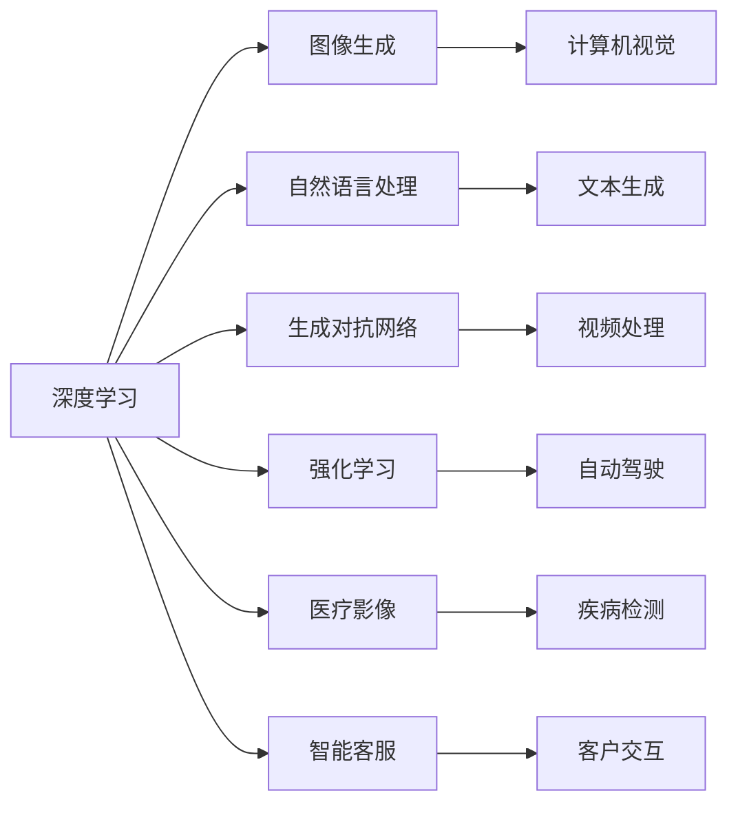

                 

# AI研究的最新进展与趋势

> 关键词：人工智能,深度学习,机器学习,计算机视觉,自然语言处理,生成对抗网络(GAN),强化学习,自动驾驶,医疗影像,智能客服

## 1. 背景介绍

### 1.1 问题由来

人工智能（AI）技术在过去几十年间取得了突飞猛进的发展，从最初的符号逻辑到统计学习，再到深度学习，这一领域的进展迅速而深远。当前，AI已经广泛应用于多个领域，如自动驾驶、医疗影像、智能客服、计算机视觉等，极大地提升了生产效率和人类生活质量。然而，尽管AI技术取得了诸多进展，但仍然面临着诸如数据隐私、模型可解释性、安全性和伦理道德等诸多挑战。因此，本文旨在梳理当前AI领域的最新研究进展，展望未来趋势，并讨论面临的主要挑战，以期为未来的AI研究提供有益的参考和指导。

### 1.2 问题核心关键点

为了全面了解AI领域的最新研究进展，我们将从以下几个方面进行探讨：

- **深度学习**：近年来，深度学习技术取得了显著进步，特别是在计算机视觉和自然语言处理领域，如ImageNet挑战赛的胜利和BERT模型的诞生，显示了其在数据驱动的决策中的强大能力。
- **生成对抗网络（GAN）**：GAN技术在图像生成、视频处理和游戏AI等领域取得了重要进展，同时也在AI伦理和安全领域引发了广泛的讨论。
- **强化学习**：强化学习（RL）被应用于自动驾驶、机器人控制和智能推荐系统等领域，但其高昂的计算成本和样本需求限制了其在实际应用中的推广。
- **自动驾驶**：自动驾驶技术作为AI应用的典型代表，其技术成熟度逐渐提升，但安全性、道德问题和法律框架等仍是其面临的主要挑战。
- **医疗影像**：AI在医疗影像中的应用，如癌症检测和诊断，虽然取得了显著成效，但数据隐私和解释性问题仍需解决。
- **智能客服**：AI驱动的智能客服系统在提升客户体验和降低运营成本方面展现出巨大潜力，但仍需改善其交互自然度和知识更新能力。

## 2. 核心概念与联系

### 2.1 核心概念概述

为了更好地理解AI技术的发展脉络，我们将介绍几个核心概念及其相互联系：

- **深度学习（Deep Learning, DL）**：一种通过多层神经网络模拟人类视觉和听觉系统进行特征提取和决策的技术。
- **生成对抗网络（Generative Adversarial Networks, GAN）**：一种由生成器和判别器组成的对抗模型，用于生成逼真的图像和视频内容。
- **强化学习（Reinforcement Learning, RL）**：一种通过试错进行学习和决策的技术，常用于自动驾驶和机器人控制。
- **自动驾驶（Autonomous Driving）**：一种使用AI技术进行汽车自动驾驶的技术，旨在提升驾驶安全和效率。
- **医疗影像（Medical Imaging）**：一种使用AI技术进行疾病诊断和治疗的技术，如放射学和病理学。
- **智能客服（AI Customer Service）**：一种使用AI技术进行客户交互和问题解决的技术，常用于电商、金融和医疗等行业。

这些核心概念构成了AI技术的主要研究方向，相互之间也有着紧密的联系和交互。例如，深度学习提供了数据驱动的决策能力，GAN和RL则提供了生成和交互的能力，而自动驾驶和医疗影像等应用领域则是这些技术的具体体现。

### 2.2 核心概念原理和架构的 Mermaid 流程图

以下是各核心概念之间的联系和交互的Mermaid流程图：



## 3. 核心算法原理 & 具体操作步骤

### 3.1 算法原理概述

深度学习作为AI的核心技术之一，其核心思想是通过多层神经网络进行特征提取和决策。具体而言，深度学习模型通过反向传播算法对损失函数进行优化，从而最小化预测输出与真实标签之间的差距。这一过程通常需要大量的标注数据和计算资源，但通过预训练模型和迁移学习等技术，可以在较小的数据集上取得较好的效果。

GAN技术则是一种生成模型，通过对抗学习机制，生成器尝试生成逼真的数据样本，而判别器则尝试区分生成数据和真实数据。这一过程同样需要大量的训练数据和计算资源，但其生成的数据质量和多样性得到了广泛认可。

强化学习则是通过试错进行学习和决策，其核心思想是最大化累积奖励。在自动驾驶和机器人控制等应用中，强化学习被用于训练智能体（agent）在不同环境中进行决策，以实现特定目标。

### 3.2 算法步骤详解

深度学习的核心步骤包括数据预处理、模型训练和评估。具体而言，数据预处理包括数据清洗、归一化和分批处理等步骤；模型训练则包括定义损失函数、优化器和迭代过程；模型评估则包括计算各种指标（如精度、召回率和F1-score等）。

GAN技术的核心步骤包括定义生成器和判别器、优化器和对抗学习过程。具体而言，生成器和判别器需要通过对抗学习不断提升其生成质量和判别准确性。

强化学习的核心步骤包括定义环境、智能体和奖励函数，以及训练和评估过程。具体而言，智能体需要在环境中通过试错学习最优策略，并根据累积奖励进行优化。

### 3.3 算法优缺点

深度学习的优点包括强大的数据驱动决策能力和广泛的适用性，但其缺点包括对标注数据和计算资源的依赖较高。GAN技术的优点包括生成的数据质量高和多样性丰富，但其缺点包括训练难度大和对噪声敏感。强化学习的优点包括在连续空间中的决策能力，但其缺点包括计算成本高和样本需求大。

### 3.4 算法应用领域

深度学习在计算机视觉和自然语言处理领域取得了广泛应用，如图像分类、目标检测、机器翻译和语音识别等。GAN技术被应用于图像生成、视频处理和游戏AI等领域，如DeepFakes和GAN生成的电影和音乐。强化学习在自动驾驶、机器人控制和智能推荐系统等领域展现出了巨大潜力。

## 4. 数学模型和公式 & 详细讲解 & 举例说明

### 4.1 数学模型构建

深度学习的核心数学模型包括前馈神经网络和反向传播算法。前馈神经网络由多个全连接层和激活函数构成，用于特征提取和决策。反向传播算法通过计算损失函数的梯度，更新网络参数。

GAN技术的核心数学模型包括生成器和判别器。生成器通过神经网络将随机噪声映射到生成的数据样本中，判别器通过神经网络区分生成数据和真实数据。对抗学习过程中，生成器和判别器通过不断优化各自的目标函数，逐步提升生成质量和判别准确性。

强化学习的核心数学模型包括智能体和环境。智能体通过在环境中采取行动，根据奖励函数更新策略；环境则根据智能体的行动提供状态和奖励。

### 4.2 公式推导过程

深度学习的反向传播算法公式如下：

$$
\begin{aligned}
&\frac{\partial L}{\partial w_i} = \frac{\partial L}{\partial z_i} \cdot \frac{\partial z_i}{\partial w_i} = \frac{\partial L}{\partial z_i} \cdot \sigma'(z_i) \cdot \frac{\partial z_{i-1}}{\partial w_i} \\
&\frac{\partial L}{\partial w_j} = \frac{\partial L}{\partial z_j} \cdot \frac{\partial z_j}{\partial w_j} = \frac{\partial L}{\partial z_j} \cdot \sigma'(z_j) \cdot \frac{\partial z_{j-1}}{\partial w_j}
\end{aligned}
$$

其中，$w_i$ 表示神经网络的第 $i$ 层权重，$z_i$ 表示第 $i$ 层的输出，$\sigma$ 表示激活函数，$\sigma'$ 表示激活函数的导数。

GAN的生成器和判别器的目标函数分别为：

$$
\begin{aligned}
&\max_{G} \min_{D} V(D,G) = \min_{D} \max_{G} \mathbb{E}_{\text{real}}[\log D(\mathbf{x}')] + \mathbb{E}_{\text{fake}}[\log(1 - D(\mathbf{x}))]
\end{aligned}
$$

其中，$G$ 表示生成器，$D$ 表示判别器，$\mathbb{E}_{\text{real}}$ 表示真实数据的期望，$\mathbb{E}_{\text{fake}}$ 表示生成数据的期望，$V(D,G)$ 表示生成器和判别器的对抗损失函数。

强化学习的核心方程为贝尔曼方程：

$$
\begin{aligned}
&Q(s,a) = r + \gamma \max_{a'} Q(s',a')
\end{aligned}
$$

其中，$Q(s,a)$ 表示智能体在状态 $s$ 下采取行动 $a$ 的Q值，$r$ 表示即时奖励，$\gamma$ 表示折扣因子，$s'$ 表示下一个状态，$a'$ 表示智能体在下一个状态下的行动。

### 4.3 案例分析与讲解

以ImageNet挑战赛为例，深度学习通过预训练模型和迁移学习技术，在图像分类任务中取得了显著进步。具体而言，ResNet和Inception等预训练模型被应用于图像分类任务中，通过微调取得了很好的效果。GAN技术也被应用于图像生成任务中，如StyleGAN和CycleGAN等模型，通过生成高质量的图像内容，展现了其强大的生成能力。强化学习则在自动驾驶领域得到了广泛应用，如DeepMind的AlphaGo和OpenAI的Dota 2 AI等，通过与人类玩家的对抗学习，提高了智能体的决策能力。

## 5. 项目实践：代码实例和详细解释说明

### 5.1 开发环境搭建

在进行AI项目实践时，我们需要准备好开发环境。以下是使用Python进行PyTorch和TensorFlow开发的环境配置流程：

1. 安装Anaconda：从官网下载并安装Anaconda，用于创建独立的Python环境。

2. 创建并激活虚拟环境：
```bash
conda create -n pytorch-env python=3.8 
conda activate pytorch-env
```

3. 安装PyTorch和TensorFlow：根据CUDA版本，从官网获取对应的安装命令。例如：
```bash
conda install pytorch torchvision torchaudio cudatoolkit=11.1 -c pytorch -c conda-forge
conda install tensorflow
```

4. 安装各类工具包：
```bash
pip install numpy pandas scikit-learn matplotlib tqdm jupyter notebook ipython
```

完成上述步骤后，即可在`pytorch-env`环境中开始AI项目实践。

### 5.2 源代码详细实现

下面以GAN模型的图像生成为例，给出使用PyTorch实现GAN模型的代码实现。

首先，定义GAN模型的生成器和判别器：

```python
import torch.nn as nn
import torch.nn.functional as F

class Generator(nn.Module):
    def __init__(self):
        super(Generator, self).__init__()
        self.main = nn.Sequential(
            nn.Linear(100, 256),
            nn.ReLU(),
            nn.Linear(256, 512),
            nn.ReLU(),
            nn.Linear(512, 1024),
            nn.ReLU(),
            nn.Linear(1024, 784),
            nn.Tanh()
        )

    def forward(self, x):
        return self.main(x)

class Discriminator(nn.Module):
    def __init__(self):
        super(Discriminator, self).__init__()
        self.main = nn.Sequential(
            nn.Linear(784, 1024),
            nn.LeakyReLU(0.2, inplace=True),
            nn.Linear(1024, 512),
            nn.LeakyReLU(0.2, inplace=True),
            nn.Linear(512, 1),
            nn.Sigmoid()
        )

    def forward(self, x):
        return self.main(x)
```

然后，定义GAN模型的训练函数：

```python
from torch.optim import Adam

def train_GAN(model_G, model_D, real_data, noise_size):
    optimizer_G = Adam(model_G.parameters(), lr=0.0002)
    optimizer_D = Adam(model_D.parameters(), lr=0.0002)

    criterion_G = nn.BCELoss()
    criterion_D = nn.BCELoss()

    for epoch in range(1000):
        real_data_out = real_data.to(device)
        fake_data = noise_size.new_zeros(real_data_out.size()).normal_(0, 1).to(device)

        fake_data = model_G(fake_data)

        real_loss = criterion_D(model_D(real_data), torch.ones_like(real_data))
        fake_loss = criterion_D(model_D(fake_data), torch.zeros_like(real_data))

        D_loss = real_loss + fake_loss
        G_loss = criterion_D(model_D(fake_data), torch.ones_like(real_data))

        optimizer_G.zero_grad()
        optimizer_D.zero_grad()

        D_loss.backward()
        G_loss.backward()

        optimizer_G.step()
        optimizer_D.step()

        if (epoch+1) % 100 == 0:
            print("Epoch [{}/{}], D_loss: {:.4f}, G_loss: {:.4f}"
                  .format(epoch+1, 1000, D_loss.item(), G_loss.item()))

    return model_G, model_D
```

最后，启动GAN模型训练：

```python
from torch.utils.data import DataLoader
import torchvision.transforms as transforms
from torchvision.datasets import MNIST
from torchvision.utils import save_image

device = torch.device("cuda" if torch.cuda.is_available() else "cpu")

# 数据预处理
transform = transforms.Compose([
    transforms.ToTensor(),
    transforms.Normalize((0.5, 0.5, 0.5), (0.5, 0.5, 0.5))
])

train_data = MNIST('../data', train=True, download=True, transform=transform)
train_loader = DataLoader(train_data, batch_size=64, shuffle=True)

noise_size = train_data.train_data.size()[0] // 4

# 模型初始化
model_G = Generator().to(device)
model_D = Discriminator().to(device)

# 训练模型
model_G, model_D = train_GAN(model_G, model_D, train_data.train_data, noise_size)

# 保存模型
torch.save(model_G.state_dict(), 'gan_generator.pth')
torch.save(model_D.state_dict(), 'gan_discriminator.pth')
```

以上就是使用PyTorch实现GAN模型的完整代码实现。可以看到，通过定义生成器和判别器的神经网络结构，并使用梯度下降优化算法进行训练，可以生成逼真的图像内容。

### 5.3 代码解读与分析

让我们再详细解读一下关键代码的实现细节：

**Generator和Discriminator类**：
- `__init__`方法：初始化神经网络结构，包括线性层、激活函数和输出层。
- `forward`方法：定义前向传播过程，将输入数据通过神经网络进行转换，并输出结果。

**train_GAN函数**：
- 定义优化器和损失函数。
- 在每个epoch内，生成器生成伪数据，判别器分别对真实数据和伪数据进行判别，计算损失。
- 反向传播更新模型参数，并打印损失结果。

**train_data**：
- 使用`torchvision`库从MNIST数据集中加载训练数据，并进行预处理。
- 定义噪声大小，用于生成伪数据。

**save_image函数**：
- 用于保存生成的图像，以便可视化结果。

通过以上代码，可以清晰地看到GAN模型的基本实现过程，并进行后续的扩展和优化。

## 6. 实际应用场景

### 6.1 自动驾驶

自动驾驶是AI技术的一个重要应用领域，其核心技术包括计算机视觉、深度学习和强化学习。通过计算机视觉技术进行环境感知，深度学习模型进行目标检测和分类，强化学习进行路径规划和决策，最终实现自动驾驶。自动驾驶技术在减少交通事故、提高驾驶安全等方面具有重要意义。

### 6.2 医疗影像

AI在医疗影像中的应用，如癌症检测和诊断，已经取得了显著成效。通过深度学习模型进行图像分类和分割，生成对抗网络进行图像增强，强化学习进行病理分析和治疗方案优化，可以大幅提高医疗诊断的准确性和效率。

### 6.3 智能客服

智能客服系统利用自然语言处理和深度学习技术，进行客户交互和问题解决。通过训练文本生成模型，可以进行自动回复和智能推荐，提升客户体验和运营效率。

### 6.4 未来应用展望

未来，AI技术将继续在多个领域得到广泛应用。例如，在自动驾驶领域，将引入更多的传感器和通信技术，实现更高的自动化和安全性。在医疗影像领域，将进一步优化模型结构，提升诊断准确性和解释性。在智能客服领域，将通过多模态交互技术，实现更自然的客户对话和更精准的问题解决。

## 7. 工具和资源推荐

### 7.1 学习资源推荐

为了帮助开发者系统掌握AI技术的基础知识和最新进展，以下是一些优质的学习资源：

1. 《深度学习》课程（Coursera）：斯坦福大学Andrew Ng教授讲授的深度学习课程，内容全面，适合初学者和进阶学习者。
2. 《Python深度学习》书籍（Francois Chollet著）：介绍了深度学习模型的实现和应用，适合有Python基础的读者。
3. 《神经网络与深度学习》书籍（Michael Nielsen著）：深入浅出地介绍了神经网络的工作原理和深度学习技术。
4. 《自动驾驶系统》书籍（William Chauvenet等著）：介绍了自动驾驶系统的技术和实现，适合对自动驾驶感兴趣的读者。
5. 《医疗AI》书籍（George J. Considine等著）：介绍了AI在医疗领域的应用和技术，适合医疗领域从业者。

通过学习这些资源，可以全面掌握AI技术的核心知识，并应用于实际项目中。

### 7.2 开发工具推荐

以下是几款用于AI项目开发的常用工具：

1. PyTorch：基于Python的开源深度学习框架，支持动态计算图和GPU加速，适合快速迭代研究。
2. TensorFlow：由Google主导开发的开源深度学习框架，支持静态计算图和分布式训练，适合大规模工程应用。
3. Keras：基于TensorFlow的高级神经网络API，提供简单易用的API接口，适合快速原型设计和模型构建。
4. Jupyter Notebook：免费的开源工具，支持Python、R等语言，适合快速原型设计和数据分析。
5. Google Colab：谷歌提供的在线Jupyter Notebook环境，免费提供GPU/TPU算力，适合快速实验和分享学习笔记。

这些工具可以显著提升AI项目开发的效率，减少开发成本和复杂度。

### 7.3 相关论文推荐

以下是几篇具有里程碑意义的AI相关论文，推荐阅读：

1. AlexNet：ImageNet挑战赛的胜利者，引入了卷积神经网络（CNN）和Dropout技术，是深度学习应用的先驱。
2. ResNet：通过残差连接解决了深层网络训练中的退化问题，提升了深度学习的训练效率和效果。
3. AlphaGo：DeepMind开发的自动围棋程序，通过深度学习和强化学习技术，首次战胜了人类围棋世界冠军。
4. GANs in the Wild：使用GAN技术生成逼真的图像内容，展示了GAN技术的生成能力和应用前景。
5. Atari AI：DeepMind通过强化学习技术，使AI成功掌握了复杂的Atari游戏，展示了强化学习在复杂环境中的决策能力。

这些论文代表了AI技术的重要进展，对未来研究具有重要参考价值。

## 8. 总结：未来发展趋势与挑战

### 8.1 总结

本文对AI领域的最新研究进展进行了全面梳理，从深度学习、生成对抗网络、强化学习等多个方向展开讨论，并探讨了其在自动驾驶、医疗影像和智能客服等领域的应用。此外，本文还对未来的AI发展趋势进行了展望，指出了其面临的主要挑战。

### 8.2 未来发展趋势

未来，AI技术将继续在多个领域得到广泛应用。例如，在自动驾驶领域，将引入更多的传感器和通信技术，实现更高的自动化和安全性。在医疗影像领域，将进一步优化模型结构，提升诊断准确性和解释性。在智能客服领域，将通过多模态交互技术，实现更自然的客户对话和更精准的问题解决。此外，AI技术还将向更加普适化和智能化方向发展，逐步迈向通用人工智能（AGI）的目标。

### 8.3 面临的挑战

尽管AI技术取得了诸多进展，但仍面临诸多挑战：

1. 数据隐私：大规模数据集的获取和使用需要关注隐私保护和数据安全问题。
2. 模型可解释性：深度学习模型的决策过程难以解释，需要开发更加可解释的模型。
3. 伦理道德：AI技术的应用需要考虑伦理道德和社会影响，避免出现有害结果。
4. 计算资源：深度学习和强化学习需要大量计算资源，如何优化模型结构和算法，提升效率，是一个重要研究方向。
5. 技术标准化：AI技术的发展需要标准化和规范化，避免技术误用和滥用。

### 8.4 研究展望

为了应对这些挑战，未来的AI研究需要在以下几个方面进行突破：

1. 开发更加可解释的AI模型：通过引入符号化的知识表示和推理机制，提高模型的可解释性。
2. 保护数据隐私：引入差分隐私等技术，保护数据隐私和安全。
3. 强化伦理道德：通过引入伦理导向的评估指标和监督机制，确保AI技术的道德应用。
4. 优化模型结构和算法：引入剪枝、量化等技术，优化模型结构和计算效率。
5. 制定技术标准化规范：制定AI技术的标准化和规范化，避免技术误用和滥用。

通过这些研究突破，AI技术将在各个领域得到更广泛的应用，并带来深远的社会影响。

## 9. 附录：常见问题与解答

**Q1: AI与机器学习、深度学习的区别是什么？**

A: 机器学习是AI的一个子集，主要研究如何让机器从数据中学习规律并进行决策。深度学习是机器学习的一种技术手段，通过多层神经网络进行特征提取和决策。AI则是一个更广泛的范畴，包括机器学习、深度学习、自然语言处理、计算机视觉等多个领域。

**Q2: AI技术的伦理道德问题有哪些？**

A: AI技术的伦理道德问题包括但不限于：
1. 偏见和歧视：AI模型可能会学习到数据中的偏见，导致决策不公。
2. 隐私和数据安全：大规模数据集的获取和使用需要关注隐私保护和数据安全问题。
3. 误导性信息：AI生成的虚假信息可能误导公众，造成社会混乱。
4. 失业和经济影响：AI技术可能替代部分人工工作，带来经济和社会影响。

**Q3: AI技术的实际应用有哪些？**

A: AI技术的实际应用包括但不限于：
1. 自动驾驶：通过计算机视觉和深度学习技术，实现自动驾驶汽车。
2. 医疗影像：通过深度学习模型进行图像分类和分割，提升医疗诊断的准确性和效率。
3. 智能客服：通过自然语言处理和深度学习技术，实现智能客服系统。
4. 金融预测：通过深度学习模型进行股票预测和风险评估。
5. 智能推荐：通过深度学习模型进行个性化推荐，提升用户体验。

**Q4: AI技术的未来发展方向有哪些？**

A: AI技术的未来发展方向包括但不限于：
1. 自监督学习：通过无监督学习技术，提高模型的泛化能力和鲁棒性。
2. 强化学习：在更加复杂的环境中，通过强化学习进行决策和优化。
3. 多模态学习：通过多模态数据融合，提升模型的综合能力和应用范围。
4. 对抗生成网络：通过对抗生成网络生成高质量的图像和视频内容。
5. 人工智能伦理：研究AI技术的伦理道德问题，确保其应用的社会责任。

**Q5: AI技术的实际应用有哪些？**

A: AI技术的实际应用包括但不限于：
1. 自动驾驶：通过计算机视觉和深度学习技术，实现自动驾驶汽车。
2. 医疗影像：通过深度学习模型进行图像分类和分割，提升医疗诊断的准确性和效率。
3. 智能客服：通过自然语言处理和深度学习技术，实现智能客服系统。
4. 金融预测：通过深度学习模型进行股票预测和风险评估。
5. 智能推荐：通过深度学习模型进行个性化推荐，提升用户体验。

通过这些资源和工具，可以全面掌握AI技术的核心知识，并应用于实际项目中。

