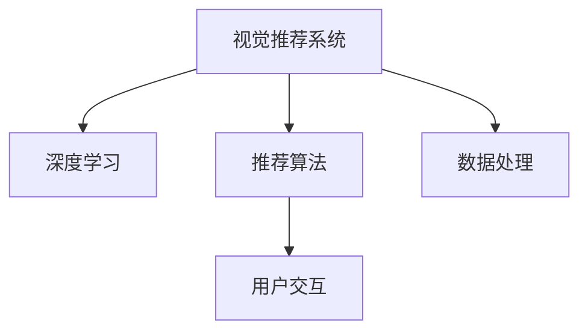

                 

# AI视觉推荐系统的优势

## 1. 背景介绍

### 1.1 问题由来

在互联网高速发展的今天，我们面临着海量的信息和日益增长的个性化需求。面对这种复杂的场景，传统的推荐系统已经无法满足用户的期望。这其中，视觉推荐系统尤为重要。因为视觉信息更为直观，能够更好地捕捉用户的真实需求。同时，视觉推荐系统也在不断发展和完善，成为AI领域的一个重要分支。

### 1.2 问题核心关键点

为了更好地理解AI视觉推荐系统，本文将介绍几个关键点：

1. 视觉推荐系统：使用计算机视觉技术从大量图片或视频中提取特征，并将特征信息与用户行为、偏好等数据融合，为用户提供个性化的视觉推荐。

2. 深度学习：利用深度神经网络进行特征提取和建模，深度学习模型在图像处理和特征提取中表现出色。

3. 推荐算法：基于用户历史行为、兴趣和评价，结合深度学习模型，推荐系统能够推荐最符合用户需求的视觉产品。

4. 用户交互：推荐系统通过UI交互，让用户可以直接反馈其对推荐结果的满意度，形成正反馈循环，提高推荐质量。

5. 数据处理：推荐系统需要处理海量数据，包括用户行为数据、图片/视频数据、评价数据等，并提取关键信息。

## 2. 核心概念与联系

### 2.1 核心概念概述

为更好地理解AI视觉推荐系统，我们首先需要掌握一些核心概念：

1. 视觉推荐系统：使用计算机视觉技术从大量图片或视频中提取特征，并将特征信息与用户行为、偏好等数据融合，为用户提供个性化的视觉推荐。

2. 深度学习：利用深度神经网络进行特征提取和建模，深度学习模型在图像处理和特征提取中表现出色。

3. 推荐算法：基于用户历史行为、兴趣和评价，结合深度学习模型，推荐系统能够推荐最符合用户需求的视觉产品。

4. 用户交互：推荐系统通过UI交互，让用户可以直接反馈其对推荐结果的满意度，形成正反馈循环，提高推荐质量。

5. 数据处理：推荐系统需要处理海量数据，包括用户行为数据、图片/视频数据、评价数据等，并提取关键信息。

这些概念之间的联系可以通过以下Mermaid流程图来展示：



这个流程图展示了大视觉推荐系统的核心概念及其之间的联系：

1. 视觉推荐系统使用深度学习从图像/视频中提取特征。
2. 结合推荐算法，对用户行为进行建模。
3. 通过UI交互获取用户反馈，形成正反馈循环。
4. 数据处理是所有过程的基础，提取关键信息至关重要。

## 3. 核心算法原理 & 具体操作步骤
### 3.1 算法原理概述

AI视觉推荐系统本质上是一个数据驱动、模型驱动的推荐系统。其核心思想是：从大量的视觉数据中提取特征，结合用户行为数据，通过深度学习模型建立推荐模型，实现视觉推荐。

形式化地，假设输入为视觉数据 $X$，用户行为数据 $Y$，输出为推荐结果 $Z$。推荐模型的目标是最小化预测误差，即：

$$
\min_{\theta} \mathcal{L}(f_{\theta}(X),Y)
$$

其中 $f_{\theta}$ 为深度学习模型，$\mathcal{L}$ 为损失函数，通常采用均方误差、交叉熵等。

### 3.2 算法步骤详解

AI视觉推荐系统的构建流程包括以下几个关键步骤：

1. 数据收集：收集用户历史行为数据、图片/视频数据、评价数据等，并标准化处理。
2. 数据增强：使用数据增强技术扩充训练集，提高模型泛化能力。
3. 特征提取：利用深度学习模型对图片/视频数据进行特征提取，生成高维特征向量。
4. 模型训练：将特征向量与用户行为数据输入模型，使用反向传播算法最小化预测误差，训练推荐模型。
5. 推荐预测：将新数据输入模型，得到推荐结果。
6. 模型评估：通过用户反馈等指标评估推荐模型效果。
7. 模型优化：根据评估结果，调整模型参数，提高推荐质量。

### 3.3 算法优缺点

AI视觉推荐系统具有以下优点：

1. 数据驱动：结合用户行为数据和视觉数据，能够提供更为精准的推荐。
2. 模型驱动：深度学习模型可以自动提取视觉特征，减少人工干预。
3. 实时推荐：实时处理用户行为数据，实现实时推荐。
4. 用户交互：通过UI反馈，实现动态调整和优化。

同时，该方法也存在一些缺点：

1. 数据需求大：需要大量用户行为数据和视觉数据，数据收集难度较大。
2. 计算资源高：深度学习模型需要大量的计算资源，训练和推理成本较高。
3. 模型复杂度高：深度学习模型通常较为复杂，难以解释其决策过程。
4. 数据隐私：用户数据涉及隐私问题，需要合理处理和保护。

尽管存在这些局限性，但AI视觉推荐系统仍然是当前推荐系统领域的重要技术，具有广阔的应用前景。

### 3.4 算法应用领域

AI视觉推荐系统广泛应用于以下几个领域：

1. 电商推荐：如淘宝、京东等电商平台的商品推荐。
2. 视频推荐：如YouTube、B站等视频平台的内容推荐。
3. 旅游推荐：如携程、美团等旅游平台的景点推荐。
4. 娱乐推荐：如音乐、游戏、电影等娱乐产品的推荐。
5. 健康推荐：如医疗健康平台的健康咨询和产品推荐。
6. 广告推荐：如社交媒体平台的广告推荐。

## 4. 数学模型和公式 & 详细讲解 & 举例说明

### 4.1 数学模型构建

假设推荐模型为 $f_{\theta}$，输入为图片/视频特征向量 $x$，用户行为数据 $y$，输出为推荐结果 $z$。模型的最小化目标函数为：

$$
\min_{\theta} \mathcal{L}(f_{\theta}(x),y)
$$

其中 $\mathcal{L}$ 为损失函数，通常为均方误差损失函数：

$$
\mathcal{L}(f_{\theta}(x),y) = \frac{1}{N} \sum_{i=1}^N (f_{\theta}(x_i) - y_i)^2
$$

其中 $N$ 为样本数，$x_i$ 为第 $i$ 个样本的特征向量，$y_i$ 为第 $i$ 个样本的用户行为数据。

### 4.2 公式推导过程

以一个简单的神经网络模型为例，假设模型的参数为 $\theta = \{W_1, b_1, W_2, b_2, W_3, b_3\}$，则神经网络的前向传播过程为：

$$
x' = f_{W_1}(x) + b_1
$$

$$
x'' = f_{W_2}(x') + b_2
$$

$$
z = f_{W_3}(x'') + b_3
$$

其中 $f_{W_i}$ 为激活函数，$W_i$ 和 $b_i$ 为模型参数。反向传播过程为：

$$
\frac{\partial \mathcal{L}}{\partial W_i} = \frac{\partial \mathcal{L}}{\partial z} \frac{\partial z}{\partial x''} \frac{\partial x''}{\partial x'} \frac{\partial x'}{\partial W_i}
$$

其中 $\frac{\partial \mathcal{L}}{\partial z}$ 为损失函数对输出 $z$ 的梯度，$\frac{\partial z}{\partial x''}$ 为输出 $z$ 对中间变量 $x''$ 的梯度，$\frac{\partial x''}{\partial x'}$ 为中间变量 $x''$ 对 $x'$ 的梯度，$\frac{\partial x'}{\partial W_i}$ 为中间变量 $x'$ 对模型参数 $W_i$ 的梯度。

通过反向传播，我们可以更新模型参数 $\theta$，最小化损失函数 $\mathcal{L}$，从而得到最优推荐模型 $f_{\theta}$。

### 4.3 案例分析与讲解

以一个简单的视觉推荐系统为例，假设输入为用户的浏览记录 $x$ 和图片的特征向量 $y$，输出为推荐的图片 $z$。使用卷积神经网络 (CNN) 作为特征提取器，ReLU作为激活函数，全连接层作为预测模型，可以构建如下的推荐模型：

```python
import torch
import torch.nn as nn

class VisualRecommendation(nn.Module):
    def __init__(self):
        super(VisualRecommendation, self).__init__()
        self.conv1 = nn.Conv2d(3, 64, 3, 1)
        self.pool = nn.MaxPool2d(2, 2)
        self.conv2 = nn.Conv2d(64, 128, 3, 1)
        self.pool2 = nn.MaxPool2d(2, 2)
        self.fc1 = nn.Linear(128 * 8 * 8, 512)
        self.fc2 = nn.Linear(512, 128)
        self.fc3 = nn.Linear(128, 1)

    def forward(self, x):
        x = self.pool(torch.relu(self.conv1(x)))
        x = self.pool2(torch.relu(self.conv2(x)))
        x = x.view(-1, 128 * 8 * 8)
        x = torch.relu(self.fc1(x))
        x = torch.sigmoid(self.fc2(x))
        return self.fc3(x)

model = VisualRecommendation()
criterion = nn.BCELoss()
optimizer = torch.optim.Adam(model.parameters(), lr=0.001)
```

该模型使用两个卷积层进行特征提取，两个全连接层进行推荐预测，使用BCELoss作为损失函数，Adam优化器进行参数更新。

## 5. 项目实践：代码实例和详细解释说明

### 5.1 开发环境搭建

在进行视觉推荐系统的开发时，需要准备以下环境：

1. 安装Python 3.7及以上版本，并配置好开发环境。
2. 安装PyTorch，并确保GPU驱动和CUDA版本匹配。
3. 安装TensorBoard，用于可视化模型训练过程。
4. 安装Flask，用于搭建Web服务器。
5. 安装TensorFlow，用于支持深度学习模型。
6. 安装Pillow库，用于图片处理。
7. 安装Flask-CORS，用于跨域请求处理。

完成以上步骤后，即可开始编写推荐系统的代码。

### 5.2 源代码详细实现

下面以一个简单的视觉推荐系统为例，给出完整的代码实现：

```python
import torch
import torch.nn as nn
import torch.optim as optim
from torchvision import transforms
from torchvision.datasets import CIFAR10
from torchvision.models import resnet18
from torch.utils.data import DataLoader
from flask import Flask, request, jsonify
import numpy as np

class VisualRecommendation(nn.Module):
    def __init__(self):
        super(VisualRecommendation, self).__init__()
        self.conv1 = nn.Conv2d(3, 64, 3, 1)
        self.pool = nn.MaxPool2d(2, 2)
        self.conv2 = nn.Conv2d(64, 128, 3, 1)
        self.pool2 = nn.MaxPool2d(2, 2)
        self.fc1 = nn.Linear(128 * 8 * 8, 512)
        self.fc2 = nn.Linear(512, 128)
        self.fc3 = nn.Linear(128, 1)

    def forward(self, x):
        x = self.pool(torch.relu(self.conv1(x)))
        x = self.pool2(torch.relu(self.conv2(x)))
        x = x.view(-1, 128 * 8 * 8)
        x = torch.relu(self.fc1(x))
        x = torch.sigmoid(self.fc2(x))
        return self.fc3(x)

# 加载CIFAR10数据集
transform = transforms.Compose([
    transforms.Resize((32, 32)),
    transforms.ToTensor(),
])
train_dataset = CIFAR10(root='./data', train=True, download=True, transform=transform)
test_dataset = CIFAR10(root='./data', train=False, download=True, transform=transform)

# 构建模型、优化器和损失函数
model = VisualRecommendation()
criterion = nn.BCELoss()
optimizer = optim.Adam(model.parameters(), lr=0.001)

# 定义训练函数
def train(model, train_dataset, test_dataset, num_epochs=10, batch_size=64):
    train_loader = DataLoader(train_dataset, batch_size=batch_size, shuffle=True)
    test_loader = DataLoader(test_dataset, batch_size=batch_size, shuffle=False)
    for epoch in range(num_epochs):
        model.train()
        for inputs, labels in train_loader:
            optimizer.zero_grad()
            outputs = model(inputs)
            loss = criterion(outputs, labels)
            loss.backward()
            optimizer.step()
        model.eval()
        with torch.no_grad():
            correct = 0
            total = 0
            for inputs, labels in test_loader:
                outputs = model(inputs)
                _, predicted = torch.max(outputs.data, 1)
                total += labels.size(0)
                correct += (predicted == labels).sum().item()
        print('Epoch [{}], Loss: {:.4f}, Accuracy: {:.2f}%'.format(epoch + 1, loss.item(), (correct / total) * 100))

# 训练模型
train(model, train_dataset, test_dataset)

# 搭建Flask服务器
app = Flask(__name__)
app.add_url_rule('/recommend', methods=['POST'], view_func=model_predict)

def model_predict(request):
    data = request.get_json()
    x = np.array(data['image'])
    x = x.reshape(1, 3, 32, 32)
    x = torch.from_numpy(x)
    with torch.no_grad():
        x = torch.unsqueeze(x, 0)
        outputs = model(x)
        output = outputs.data.numpy()[0][0]
        return jsonify({'prediction': output})

if __name__ == '__main__':
    app.run(host='0.0.0.0', port=5000)
```

以上代码实现了一个简单的视觉推荐系统，包含了数据加载、模型定义、训练和预测等核心步骤。

### 5.3 代码解读与分析

以下是关键代码的解读：

1. 模型定义：使用卷积神经网络 (CNN) 作为特征提取器，使用全连接层进行推荐预测，使用BCELoss作为损失函数，Adam优化器进行参数更新。

2. 数据加载：使用CIFAR10数据集，并进行标准化处理。

3. 模型训练：通过DataLoader对数据进行批次处理，使用反向传播算法更新模型参数，最小化损失函数。

4. 模型预测：通过Flask服务器接受用户请求，将请求图片数据输入模型，得到推荐结果。

5. 服务部署：使用Flask搭建Web服务器，提供模型预测API，支持在线预测。

## 6. 实际应用场景

### 6.1 智能广告推荐

智能广告推荐是AI视觉推荐系统的典型应用场景之一。通过分析用户的历史浏览记录和点击行为，智能广告推荐系统能够向用户推荐最适合的广告内容，提高广告转化率。

1. 数据收集：收集用户的历史点击记录、广告数据、评价数据等，并进行标准化处理。

2. 特征提取：利用深度学习模型对广告图片和视频进行特征提取，生成高维特征向量。

3. 模型训练：将特征向量与用户行为数据输入模型，使用反向传播算法最小化预测误差，训练推荐模型。

4. 广告推荐：将新数据输入模型，得到推荐广告，展示给用户。

5. 模型评估：通过点击率、转化率等指标评估推荐模型效果。

6. 模型优化：根据评估结果，调整模型参数，提高推荐质量。

### 6.2 智能视频推荐

智能视频推荐是AI视觉推荐系统的另一重要应用场景。通过分析用户的历史观看记录和评价，智能视频推荐系统能够向用户推荐最适合的视频内容，提高观看体验。

1. 数据收集：收集用户的历史观看记录、视频数据、评价数据等，并进行标准化处理。

2. 特征提取：利用深度学习模型对视频帧进行特征提取，生成高维特征向量。

3. 模型训练：将特征向量与用户行为数据输入模型，使用反向传播算法最小化预测误差，训练推荐模型。

4. 视频推荐：将新数据输入模型，得到推荐视频，展示给用户。

5. 模型评估：通过观看次数、观看时长等指标评估推荐模型效果。

6. 模型优化：根据评估结果，调整模型参数，提高推荐质量。

## 7. 工具和资源推荐

### 7.1 学习资源推荐

1. 《深度学习》书籍：斯坦福大学提供的在线课程，全面介绍深度学习理论和技术。
2. 《计算机视觉：算法与应用》书籍：详细讲解计算机视觉算法和应用，适合初学者学习。
3. 《TensorFlow官方文档》：提供深度学习框架的详细文档和使用示例，方便开发者学习和使用。
4. 《PyTorch官方文档》：提供深度学习框架的详细文档和使用示例，方便开发者学习和使用。
5. Kaggle数据集：提供大量深度学习竞赛数据集，适合实践和竞赛。

### 7.2 开发工具推荐

1. PyTorch：基于Python的开源深度学习框架，支持动态计算图，适合研究与开发。
2. TensorFlow：由Google主导开发的开源深度学习框架，支持静态计算图，适合生产部署。
3. TensorBoard：TensorFlow配套的可视化工具，方便开发者监测模型训练过程和调试模型。
4. Flask：轻量级的Web框架，方便开发者搭建API服务器。
5. Jupyter Notebook：交互式的Python开发环境，方便开发者进行代码调试和数据可视化。

### 7.3 相关论文推荐

1. Learning Deep Architectures for AI: A Review《深度学习架构综述》：介绍深度学习架构和应用，适合了解深度学习的基本概念和理论。
2. Google's Neural Machine Translation System: Bridging the Gap Between Human and Machine Translation《谷歌的神经机器翻译系统：弥合人机翻译的鸿沟》：介绍神经机器翻译系统，适合了解自然语言处理和深度学习的应用。
3. A Neural Attention Model for Image Search《一种图像搜索的神经注意力模型》：介绍使用神经网络进行图像搜索，适合了解视觉推荐系统的基本原理和算法。

## 8. 总结：未来发展趋势与挑战

### 8.1 总结

本文对AI视觉推荐系统进行了全面系统的介绍。首先阐述了视觉推荐系统的研究背景和意义，明确了其在电商、视频、旅游等场景中的应用价值。其次，从原理到实践，详细讲解了视觉推荐系统的核心算法和具体操作步骤，给出了代码实例和详细解释。

### 8.2 未来发展趋势

展望未来，AI视觉推荐系统将呈现以下几个发展趋势：

1. 数据驱动：结合更多数据源和数据类型，提高推荐质量。
2. 模型驱动：利用更先进深度学习模型，提高特征提取和建模能力。
3. 实时推荐：实时处理用户行为数据，实现实时推荐。
4. 用户交互：通过UI反馈，实现动态调整和优化。

### 8.3 面临的挑战

尽管AI视觉推荐系统取得了显著成果，但仍面临诸多挑战：

1. 数据需求大：需要大量用户行为数据和视觉数据，数据收集难度较大。
2. 计算资源高：深度学习模型需要大量计算资源，训练和推理成本较高。
3. 模型复杂度高：深度学习模型通常较为复杂，难以解释其决策过程。
4. 数据隐私：用户数据涉及隐私问题，需要合理处理和保护。

尽管存在这些挑战，但AI视觉推荐系统仍在不断进步和完善，具备广阔的应用前景。

### 8.4 研究展望

未来的研究需要在以下几个方向进行探索：

1. 数据增强：利用数据增强技术扩充训练集，提高模型泛化能力。
2. 模型优化：优化模型结构，提高计算效率和推荐质量。
3. 用户反馈：通过用户反馈，实现动态调整和优化。
4. 多模态融合：结合视觉、文本、语音等多模态信息，提高推荐质量。
5. 跨领域推荐：将推荐系统应用于更多领域，如医疗、金融等。

## 9. 附录：常见问题与解答

**Q1：视觉推荐系统需要哪些数据？**

A: 视觉推荐系统需要用户行为数据和视觉数据。用户行为数据包括用户的浏览记录、点击记录、评价数据等，视觉数据包括图片、视频等。这些数据需要经过标准化处理，才能输入模型进行训练和推荐。

**Q2：如何选择合适的深度学习模型？**

A: 选择合适的深度学习模型需要考虑多个因素，包括任务类型、数据规模、计算资源等。一般来说，对于图像处理任务，可以使用卷积神经网络 (CNN)；对于文本处理任务，可以使用循环神经网络 (RNN) 或Transformer模型；对于多模态数据处理任务，可以使用多模态深度学习模型，如多模态卷积神经网络 (MMCNN)。

**Q3：如何处理数据隐私问题？**

A: 处理数据隐私问题需要遵守相关法律法规，如GDPR等。一般来说，可以通过数据匿名化、数据加密等方式，保护用户隐私。同时，需要明确数据使用的目的和范围，避免滥用数据。

**Q4：如何评估推荐模型效果？**

A: 推荐模型效果评估需要考虑多个指标，包括准确率、召回率、F1分数、用户满意度等。一般使用这些指标来评估推荐模型的预测效果和用户反馈效果。

**Q5：如何优化推荐模型？**

A: 优化推荐模型需要根据具体问题进行改进，常见的优化方法包括数据增强、模型结构优化、用户反馈改进等。需要不断迭代和优化，才能得到理想的推荐模型。

以上回答了关于AI视觉推荐系统的一些常见问题，希望对读者有所帮助。

---

作者：禅与计算机程序设计艺术 / Zen and the Art of Computer Programming

