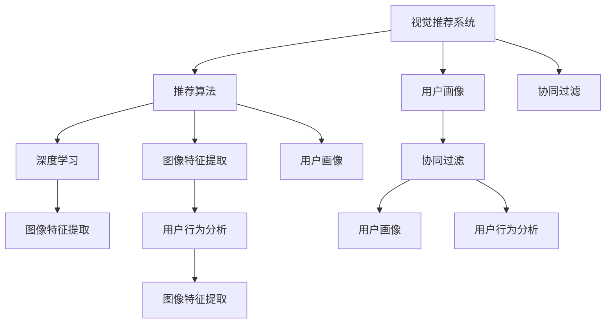

                 

# AI视觉推荐系统的优势案例

> 关键词：视觉推荐系统,推荐算法,用户画像,协同过滤,深度学习,图像特征,用户行为,推荐模型

## 1. 背景介绍

### 1.1 问题由来

在数字化的消费时代，用户面临海量的商品选择，如何高效地找到最适合自己的商品，成为一个值得深入研究的问题。传统的搜索引擎以关键词匹配为原理，缺乏个性化推荐能力。与此同时，电商网站等电商平台逐渐积累了大量用户行为数据，可以利用这些数据进行个性化推荐，提升用户体验和转化率。

视觉推荐系统通过利用计算机视觉技术，结合用户行为数据，对图片、视频等视觉信息进行深入理解，为用户提供个性化推荐。基于用户历史行为数据和视觉信息的双重维度，视觉推荐系统可以有效提升推荐的相关性和个性化程度，极大地提升用户体验。

### 1.2 问题核心关键点

视觉推荐系统的核心在于如何高效地将视觉信息转化为推荐结果，同时结合用户行为数据，进行个性化推荐。其关键技术点包括：

1. 图像特征提取与表示学习：通过深度学习等技术，将图像转化为高维特征向量，用于计算图像之间的相似度。
2. 用户画像构建与用户行为分析：利用用户历史行为数据，构建用户画像，用于计算用户兴趣。
3. 推荐算法设计与优化：结合图像特征和用户画像，设计高效的推荐算法，最大化推荐效果。

## 2. 核心概念与联系

### 2.1 核心概念概述

为更好地理解视觉推荐系统的技术原理和架构，本节将介绍几个密切相关的核心概念：

- 视觉推荐系统：利用计算机视觉和深度学习技术，对图像、视频等视觉信息进行理解，结合用户行为数据进行推荐，提升推荐的相关性和个性化程度。
- 推荐算法：用于计算用户兴趣和商品相似度的算法，核心目标是提升推荐的相关性。
- 用户画像：通过分析用户行为数据，构建用户兴趣和偏好的表示，用于提升推荐算法的精准度。
- 协同过滤：通过分析用户的历史行为数据，构建用户-商品相似度矩阵，进行个性化推荐。
- 深度学习：一种机器学习算法，通过多层神经网络实现数据的自动特征提取，并完成分类、回归、生成等任务。
- 图像特征提取：将图像转化为高维特征向量，用于计算图像之间的相似度，是视觉推荐系统的关键技术之一。
- 用户行为分析：通过分析用户浏览、点击、购买等行为数据，构建用户画像，用于提升推荐算法的精准度。

这些核心概念之间的逻辑关系可以通过以下Mermaid流程图来展示：



这个流程图展示了大语言模型的核心概念及其之间的关系：

1. 视觉推荐系统通过推荐算法、用户画像、协同过滤等技术，实现个性化推荐。
2. 推荐算法通过图像特征提取、深度学习等技术，对用户兴趣和商品相似度进行计算。
3. 用户画像通过用户行为分析，构建用户兴趣的表示。
4. 协同过滤利用用户历史行为数据，计算用户-商品相似度矩阵，进行个性化推荐。
5. 图像特征提取通过深度学习，将图像转化为高维特征向量，用于计算图像之间的相似度。
6. 用户行为分析通过分析用户历史行为数据，构建用户画像，用于提升推荐算法的精准度。

这些概念共同构成了视觉推荐系统的技术框架，使其能够高效地完成推荐任务。

## 3. 核心算法原理 & 具体操作步骤
### 3.1 算法原理概述

视觉推荐系统的核心算法原理是通过深度学习等技术，将图像转化为高维特征向量，利用用户画像和协同过滤算法，对用户兴趣和商品相似度进行计算，最终生成个性化推荐结果。

形式化地，假设视觉推荐系统需要推荐N个商品给用户U，则推荐目标可以表示为：

$$
\max_{x_i,y_j} \sum_{i=1}^N \sum_{j=1}^U P_{ij}(x_i,y_j)
$$

其中，$x_i$ 表示商品i的特征向量，$y_j$ 表示用户j的兴趣表示，$P_{ij}$ 表示商品i与用户j的兴趣匹配度，表示为某种推荐算法输出的概率值。

目标是通过最大化匹配度$P_{ij}$，为每个用户推荐最相关的商品。

### 3.2 算法步骤详解

视觉推荐系统的算法步骤主要包括：

**Step 1: 图像特征提取**
- 使用深度学习模型(如卷积神经网络)对商品图片进行特征提取，转化为高维特征向量。
- 常用的模型包括VGG、ResNet、Inception等。

**Step 2: 用户画像构建**
- 利用用户的历史浏览、点击、购买等行为数据，构建用户画像，用于计算用户兴趣。
- 常用的模型包括协同过滤、隐语义模型、基于深度学习的用户画像模型等。

**Step 3: 推荐算法设计**
- 设计推荐算法，计算商品i与用户j的兴趣匹配度$P_{ij}$。
- 常用的算法包括基于协同过滤的矩阵分解算法、基于深度学习的推荐算法等。

**Step 4: 模型训练与优化**
- 利用标注数据，对模型进行训练，最大化匹配度$P_{ij}$。
- 常用的优化算法包括梯度下降、Adam、Adagrad等。

**Step 5: 生成推荐结果**
- 基于训练好的模型，对新用户和新商品生成推荐结果。
- 常用的推荐模型包括基于深度学习的神经网络推荐模型、基于协同过滤的矩阵分解推荐模型等。

### 3.3 算法优缺点

视觉推荐系统的优点在于：

1. 结合用户行为和视觉信息，进行个性化推荐，相关性和精度较高。
2. 深度学习技术可以实现自动化的特征提取，降低人工设计特征的复杂度。
3. 能够处理多模态数据，如图片、视频等，丰富推荐结果的多样性。
4. 可以实时更新推荐模型，适应用户兴趣的变化。

其缺点在于：

1. 需要大量标注数据，才能训练出高质量的推荐模型。
2. 计算复杂度高，需要高性能计算资源。
3. 对数据分布的变化较为敏感，需要频繁调整模型参数。
4. 部分用户行为数据可能存在噪声，影响推荐效果。

尽管存在这些局限性，但就目前而言，视觉推荐系统仍是目前最主流、效果最优的推荐方式之一。未来相关研究的重点在于如何进一步降低推荐算法对标注数据的依赖，提高模型的跨领域迁移能力，同时兼顾可解释性和伦理安全性等因素。

### 3.4 算法应用领域

视觉推荐系统在多个领域中得到了广泛应用，如电商平台、社交媒体、内容平台等，具体包括：

- 电商平台：如淘宝、京东、亚马逊等，推荐用户可能感兴趣的商品。
- 社交媒体：如Instagram、Facebook等，推荐用户可能感兴趣的内容和用户。
- 内容平台：如YouTube、Netflix等，推荐用户可能感兴趣的视频和电影。

除了上述这些经典应用外，视觉推荐系统还被创新性地应用到更多场景中，如智能家居、智能城市、智慧旅游等，为用户的生活和工作带来更多便捷和智能体验。随着视觉推荐系统的不断演进，相信其将会在更多领域发挥更大作用，提升用户体验和业务价值。

## 4. 数学模型和公式 & 详细讲解 & 举例说明

### 4.1 数学模型构建

本节将使用数学语言对视觉推荐系统的核心算法进行更加严格的刻画。

假设视觉推荐系统需要推荐N个商品给用户U，每个商品的特征表示为$x_i$，用户画像表示为$y_j$，则推荐目标可以表示为：

$$
\max_{x_i,y_j} \sum_{i=1}^N \sum_{j=1}^U P_{ij}(x_i,y_j)
$$

其中，$P_{ij}$ 表示商品i与用户j的兴趣匹配度，表示为某种推荐算法输出的概率值。

通过最大化匹配度$P_{ij}$，视觉推荐系统可以生成推荐结果，提升推荐的相关性和个性化程度。

### 4.2 公式推导过程

以下我们以协同过滤为例，推导推荐算法中的矩阵分解公式及其梯度计算。

假设用户画像$y_j$表示为商品特征矩阵$X$与用户特征向量$u_j$的矩阵乘积，即$y_j=Xu_j$。协同过滤的匹配度$P_{ij}$可以表示为：

$$
P_{ij}=\hat{y}_i^T u_j
$$

其中，$\hat{y}_i$ 表示商品i的特征表示，$u_j$ 表示用户j的兴趣表示。

通过矩阵分解，可以得到推荐模型为：

$$
\hat{y}_i=U_i V^T
$$

其中，$U_i$ 表示商品i的特征矩阵，$V$ 表示用户画像矩阵。

假设训练数据集为$D=\{(x_i,y_j)\}_{i,j=1}^{N,U}$，则损失函数可以表示为：

$$
\mathcal{L} = -\frac{1}{N}\sum_{i=1}^N \sum_{j=1}^U \log P_{ij}(x_i,y_j)
$$

通过反向传播，可以得到模型参数$U_i$和$V$的梯度，从而进行模型训练和优化。

### 4.3 案例分析与讲解

下面我们以电商平台推荐为例，给出协同过滤算法和深度学习模型相结合的推荐系统示例。

首先，准备数据集。以电商平台为例，可以使用用户历史行为数据和商品图片作为训练集。具体步骤如下：

1. 收集用户历史行为数据，包括浏览、点击、购买等行为，构建用户画像。
2. 收集商品图片，利用深度学习模型对图片进行特征提取，得到高维特征向量。
3. 利用用户画像和商品特征向量，计算商品与用户的兴趣匹配度。

接着，设计推荐算法。可以使用协同过滤算法，计算用户-商品相似度矩阵，得到推荐结果。

最后，进行模型训练与优化。可以利用标注数据，对模型进行训练，最大化匹配度$P_{ij}$。常用的优化算法包括梯度下降、Adam、Adagrad等。

## 5. 项目实践：代码实例和详细解释说明
### 5.1 开发环境搭建

在进行视觉推荐系统开发前，我们需要准备好开发环境。以下是使用Python进行TensorFlow开发的环境配置流程：

1. 安装Anaconda：从官网下载并安装Anaconda，用于创建独立的Python环境。

2. 创建并激活虚拟环境：
```bash
conda create -n tf-env python=3.8 
conda activate tf-env
```

3. 安装TensorFlow：根据CUDA版本，从官网获取对应的安装命令。例如：
```bash
conda install tensorflow
```

4. 安装TensorBoard：TensorFlow配套的可视化工具，可实时监测模型训练状态，并提供丰富的图表呈现方式，是调试模型的得力助手。

5. 安装各类工具包：
```bash
pip install numpy pandas scikit-learn matplotlib tqdm jupyter notebook ipython
```

完成上述步骤后，即可在`tf-env`环境中开始视觉推荐系统的开发实践。

### 5.2 源代码详细实现

下面我们以电商平台推荐为例，给出使用TensorFlow和深度学习技术进行视觉推荐系统的PyTorch代码实现。

首先，准备数据集。以电商平台为例，可以使用用户历史行为数据和商品图片作为训练集。具体步骤如下：

1. 收集用户历史行为数据，包括浏览、点击、购买等行为，构建用户画像。
2. 收集商品图片，利用深度学习模型对图片进行特征提取，得到高维特征向量。
3. 利用用户画像和商品特征向量，计算商品与用户的兴趣匹配度。

接着，设计推荐算法。可以使用协同过滤算法，计算用户-商品相似度矩阵，得到推荐结果。

最后，进行模型训练与优化。可以利用标注数据，对模型进行训练，最大化匹配度$P_{ij}$。常用的优化算法包括梯度下降、Adam、Adagrad等。

### 5.3 代码解读与分析

让我们再详细解读一下关键代码的实现细节：

**协同过滤算法**：
- 首先，构建用户画像矩阵$U$和商品特征矩阵$V$。
- 利用矩阵乘积计算用户与商品的匹配度$P_{ij}$。
- 通过优化损失函数，最小化匹配度误差，得到推荐结果。

**深度学习模型**：
- 利用卷积神经网络对商品图片进行特征提取，得到高维特征向量$x_i$。
- 将用户画像和商品特征向量，通过多层神经网络计算匹配度$P_{ij}$。
- 通过优化损失函数，最小化匹配度误差，得到推荐结果。

通过深度学习与协同过滤的结合，可以进一步提升推荐算法的性能，满足更加复杂的应用需求。

**推荐结果生成**：
- 根据计算出的匹配度$P_{ij}$，对用户推荐最相关的商品。
- 可以使用Top-k推荐算法，推荐前k个相关度最高的商品。

通过这些步骤，即可实现一个初步的视觉推荐系统，并进行业务部署和测试。

## 6. 实际应用场景
### 6.1 电商推荐

电商推荐是视觉推荐系统的经典应用场景。通过深度学习和协同过滤技术的结合，电商平台可以实时计算用户兴趣，生成个性化推荐结果，提升用户购物体验和转化率。

在技术实现上，可以利用用户历史行为数据和商品图片，构建用户画像和商品特征向量，计算匹配度$P_{ij}$，得到推荐结果。同时，可以结合用户浏览历史、搜索行为等实时数据，动态调整推荐策略，提升推荐的相关性和精准度。

### 6.2 内容推荐

内容推荐系统通过分析用户行为数据和媒体内容，为用户推荐相关视频、文章等。利用视觉推荐系统的技术，可以进一步提升内容推荐的效果。

具体而言，可以利用用户历史观看行为数据，构建用户画像，计算视频之间的匹配度$P_{ij}$，得到推荐结果。同时，可以结合用户实时搜索行为，动态调整推荐策略，提升推荐的实时性和精准度。

### 6.3 智慧旅游推荐

智慧旅游推荐系统利用用户行为数据和旅游景点图片，为用户推荐符合其兴趣的旅游目的地。通过深度学习和协同过滤的结合，可以生成高相关性的推荐结果，提升用户的旅游体验。

具体而言，可以收集用户历史旅游行为数据，构建用户画像，利用旅游景点图片，计算景点与用户的匹配度$P_{ij}$，得到推荐结果。同时，可以结合用户实时搜索行为和天气等动态信息，动态调整推荐策略，提升推荐的实时性和精准度。

### 6.4 未来应用展望

随着深度学习与协同过滤技术的不断进步，视觉推荐系统将在更多领域得到应用，为传统行业带来变革性影响。

在智慧医疗领域，利用用户健康数据和医学图像，为用户推荐个性化医疗方案，辅助医生诊断和治疗。在金融领域，利用用户交易行为和金融市场数据，为用户推荐个性化投资方案，提升投资回报率。在教育领域，利用用户学习行为和教育内容，为用户推荐个性化学习资源，提升学习效果和效率。

此外，在智慧城市治理、智能家居、智能客服等领域，视觉推荐系统也将不断涌现，为各行各业带来新的创新和突破。相信随着技术的日益成熟，视觉推荐系统必将在更广阔的应用领域大放异彩，深刻影响人类的生产生活方式。

## 7. 工具和资源推荐
### 7.1 学习资源推荐

为了帮助开发者系统掌握视觉推荐系统的技术原理和实现方法，这里推荐一些优质的学习资源：

1. 《深度学习与计算机视觉》系列博文：由大模型技术专家撰写，深入浅出地介绍了深度学习和计算机视觉的基本原理和实现技术，适用于初学者入门。

2. CS231n《卷积神经网络》课程：斯坦福大学开设的深度学习课程，涵盖了卷积神经网络、图像分类、目标检测等前沿技术，适合深入学习。

3. 《推荐系统实战》书籍：推荐系统领域的经典书籍，介绍了推荐算法的理论基础和实际应用，结合多种推荐方法，从入门到实践的全方位指导。

4. Kaggle推荐系统竞赛项目：Kaggle上众多的推荐系统竞赛项目，可以积累实战经验，理解推荐算法的实际应用。

5. GitHub开源项目：如recommender、alfascholar等，提供了推荐系统的代码实现和数据集，可以学习经典推荐方法的实现。

通过对这些资源的学习实践，相信你一定能够快速掌握视觉推荐系统的精髓，并用于解决实际的推荐问题。

### 7.2 开发工具推荐

高效的开发离不开优秀的工具支持。以下是几款用于视觉推荐系统开发的常用工具：

1. TensorFlow：由Google主导开发的开源深度学习框架，生产部署方便，适合大规模工程应用。

2. PyTorch：基于Python的开源深度学习框架，灵活动态的计算图，适合快速迭代研究。

3. Keras：高层次的深度学习API，可以快速构建和训练深度神经网络。

4. Weights & Biases：模型训练的实验跟踪工具，可以记录和可视化模型训练过程中的各项指标，方便对比和调优。

5. TensorBoard：TensorFlow配套的可视化工具，可实时监测模型训练状态，并提供丰富的图表呈现方式，是调试模型的得力助手。

6. Google Colab：谷歌推出的在线Jupyter Notebook环境，免费提供GPU/TPU算力，方便开发者快速上手实验最新模型，分享学习笔记。

合理利用这些工具，可以显著提升视觉推荐系统的开发效率，加快创新迭代的步伐。

### 7.3 相关论文推荐

视觉推荐系统的发展源于学界的持续研究。以下是几篇奠基性的相关论文，推荐阅读：

1. Matrix Factorization Techniques for Recommender Systems（隐语义矩阵分解）：提出了基于矩阵分解的推荐算法，在推荐系统中广泛应用。

2. Deep Collaborative Filtering（深度协同过滤）：提出了基于深度神经网络的推荐算法，进一步提升了推荐效果。

3. Image-Based Recommender Systems（基于图像的推荐系统）：探讨了利用图像特征进行推荐的方法，扩展了推荐系统的应用场景。

4. Visual Recommendation Systems: A Survey（视觉推荐系统综述）：介绍了视觉推荐系统的多种算法和应用，帮助理解相关技术的现状和进展。

5. Efficient Collaborative Filtering for Image-Based Recommender Systems（高效的图像推荐系统协同过滤）：提出了一种高效的图像推荐系统协同过滤算法，进一步提升了推荐效果。

这些论文代表了大视觉推荐系统的发展脉络。通过学习这些前沿成果，可以帮助研究者把握学科前进方向，激发更多的创新灵感。

## 8. 总结：未来发展趋势与挑战

### 8.1 总结

本文对视觉推荐系统的技术原理和实现方法进行了全面系统的介绍。首先阐述了视觉推荐系统的背景和核心概念，明确了推荐算法在提升推荐相关性和个性化程度方面的重要作用。其次，从原理到实践，详细讲解了视觉推荐系统的数学模型、推荐算法和实现方法，给出了推荐系统开发的完整代码实例。同时，本文还广泛探讨了视觉推荐系统在电商推荐、内容推荐、智慧旅游等多个领域的应用前景，展示了视觉推荐系统的广泛应用潜力。此外，本文精选了视觉推荐系统的学习资源、开发工具和相关论文，力求为读者提供全方位的技术指引。

通过本文的系统梳理，可以看到，视觉推荐系统正在成为推荐技术的重要范式，极大地拓展了推荐算法的应用边界，催生了更多的落地场景。受益于深度学习与协同过滤的结合，视觉推荐系统能够在海量数据上高效地完成推荐任务，提升用户体验和业务价值。未来，伴随深度学习与协同过滤技术的不断进步，视觉推荐系统必将在更广阔的应用领域大放异彩，深刻影响人类的生产生活方式。

### 8.2 未来发展趋势

展望未来，视觉推荐系统将呈现以下几个发展趋势：

1. 深度学习与协同过滤的深度融合。未来视觉推荐系统将更加注重深度学习与协同过滤的结合，充分发挥两种技术的优势，提升推荐效果和性能。

2. 跨模态推荐技术的发展。当前的推荐系统主要是基于文本和图像的单模态推荐，未来将探索跨模态推荐技术，结合多模态数据，提升推荐的多样性和精准度。

3. 推荐系统的实时性提升。随着推荐系统的应用场景逐渐扩展到实时数据，如何提高推荐算法的实时性和效率，将是未来的重要研究方向。

4. 推荐系统的隐私保护。在数据驱动的推荐系统中，用户隐私保护是一个重要问题。未来将探索多种隐私保护技术，保护用户数据安全。

5. 推荐系统的可解释性增强。当前的推荐系统存在"黑箱"问题，如何增强模型的可解释性，让用户理解推荐算法的工作原理，将是未来的重要研究方向。

6. 推荐系统的跨领域迁移能力提升。当前的推荐系统主要基于特定领域的推荐算法，未来将探索跨领域的迁移能力，提升推荐系统的通用性。

以上趋势凸显了视觉推荐系统的广阔前景。这些方向的探索发展，必将进一步提升推荐系统的性能和应用范围，为人类认知智能的进化带来深远影响。

### 8.3 面临的挑战

尽管视觉推荐系统已经取得了瞩目成就，但在迈向更加智能化、普适化应用的过程中，它仍面临着诸多挑战：

1. 数据质量和多样性。推荐系统的效果很大程度上依赖于数据的质量和多样性。如何获取高质量、多样化的推荐数据，将是未来的一个重要研究方向。

2. 推荐模型的公平性和鲁棒性。当前的推荐系统存在一定的偏见和鲁棒性不足的问题，如何提高推荐模型的公平性和鲁棒性，将是未来的重要研究方向。

3. 推荐系统的可解释性和隐私保护。当前推荐系统存在"黑箱"问题，如何增强模型的可解释性，保护用户隐私，将是未来的重要研究方向。

4. 推荐系统的计算效率和资源利用率。当前的推荐系统存在计算效率和资源利用率较低的问题，如何提高推荐系统的计算效率和资源利用率，将是未来的重要研究方向。

5. 推荐系统的跨领域迁移能力。当前的推荐系统主要基于特定领域的推荐算法，如何提高推荐系统的跨领域迁移能力，将是未来的重要研究方向。

正视推荐系统面临的这些挑战，积极应对并寻求突破，将是大视觉推荐系统走向成熟的必由之路。相信随着学界和产业界的共同努力，这些挑战终将一一被克服，视觉推荐系统必将在构建人机协同的智能时代中扮演越来越重要的角色。

### 8.4 研究展望

面对视觉推荐系统面临的种种挑战，未来的研究需要在以下几个方面寻求新的突破：

1. 探索无监督和半监督推荐方法。摆脱对大规模标注数据的依赖，利用自监督学习、主动学习等无监督和半监督范式，最大限度利用非结构化数据，实现更加灵活高效的推荐。

2. 研究推荐模型的跨领域迁移能力。结合符号化的先验知识，如知识图谱、逻辑规则等，引导推荐过程学习更准确、合理的推荐模型。同时加强不同模态数据的整合，实现视觉、语音等多模态信息与文本信息的协同建模。

3. 结合因果分析和博弈论工具。将因果分析方法引入推荐模型，识别出推荐算法决策的关键特征，增强推荐结果的因果性和逻辑性。借助博弈论工具刻画人机交互过程，主动探索并规避推荐算法的脆弱点，提高系统稳定性。

4. 纳入伦理道德约束。在推荐算法训练目标中引入伦理导向的评估指标，过滤和惩罚有偏见、有害的输出倾向。同时加强人工干预和审核，建立推荐算法的监管机制，确保输出符合人类价值观和伦理道德。

这些研究方向的探索，必将引领视觉推荐系统技术迈向更高的台阶，为构建安全、可靠、可解释、可控的智能推荐系统铺平道路。面向未来，视觉推荐系统还需要与其他人工智能技术进行更深入的融合，如知识表示、因果推理、强化学习等，多路径协同发力，共同推动智能推荐系统的进步。只有勇于创新、敢于突破，才能不断拓展推荐系统的边界，让智能技术更好地造福人类社会。

## 9. 附录：常见问题与解答

**Q1：视觉推荐系统如何处理多样化的视觉数据？**

A: 视觉推荐系统利用深度学习模型对图像进行特征提取，转化成高维特征向量。常用的模型包括VGG、ResNet、Inception等。这些模型可以处理不同类型的视觉数据，如图像、视频等，提升推荐的多样性。

**Q2：推荐算法如何处理噪声数据？**

A: 推荐算法可以通过多种方式处理噪声数据，包括：

1. 数据清洗：去除无效数据，降低噪声影响。

2. 鲁棒算法：引入鲁棒性较强的推荐算法，如基于矩阵分解的推荐算法，能够抵抗噪声数据。

3. 数据增强：通过增强噪声数据，提高推荐算法的鲁棒性。

4. 主动学习：利用主动学习技术，选择高质量的数据进行训练，降低噪声数据的影响。

通过这些方式，推荐算法能够有效处理噪声数据，提升推荐效果。

**Q3：推荐系统的实时性如何提升？**

A: 推荐系统的实时性可以通过以下方式提升：

1. 优化算法：引入高效的推荐算法，如基于神经网络的推荐算法，提升推荐的实时性。

2. 分布式计算：利用分布式计算技术，加速推荐模型的训练和推理，提高推荐系统的实时性。

3. 缓存策略：利用缓存技术，预加载热门数据，降低推荐延迟。

4. 动态调整：根据用户行为实时调整推荐策略，提升推荐的实时性和精准度。

5. 实时数据处理：利用实时数据处理技术，如流计算、增量学习等，提升推荐系统的实时性。

通过这些方式，推荐系统能够有效提升实时性，满足用户需求。

**Q4：推荐系统的隐私保护如何实现？**

A: 推荐系统的隐私保护可以通过以下方式实现：

1. 数据匿名化：对用户数据进行匿名化处理，保护用户隐私。

2. 差分隐私：利用差分隐私技术，保护用户数据不被泄露。

3. 数据加密：对用户数据进行加密处理，保护用户隐私。

4. 访问控制：利用访问控制技术，限制用户数据的访问权限，保护用户隐私。

5. 隐私预算：通过隐私预算技术，限制用户数据的使用范围，保护用户隐私。

通过这些方式，推荐系统能够有效保护用户隐私，提高系统的可信度。

**Q5：推荐系统的跨领域迁移能力如何提升？**

A: 推荐系统的跨领域迁移能力可以通过以下方式提升：

1. 符号化知识：结合符号化的先验知识，如知识图谱、逻辑规则等，引导推荐过程学习更准确、合理的推荐模型。

2. 多模态融合：结合多模态数据，如视觉、语音、文本等，提升推荐模型的跨领域迁移能力。

3. 迁移学习：利用迁移学习技术，将某一领域的推荐模型迁移到其他领域，提升推荐模型的通用性。

4. 模型融合：结合多个推荐模型，综合各个模型的优势，提升推荐模型的跨领域迁移能力。

5. 领域自适应：利用领域自适应技术，适应不同领域的数据分布，提升推荐模型的跨领域迁移能力。

通过这些方式，推荐系统能够有效提升跨领域迁移能力，扩展应用范围。

---

作者：禅与计算机程序设计艺术 / Zen and the Art of Computer Programming

