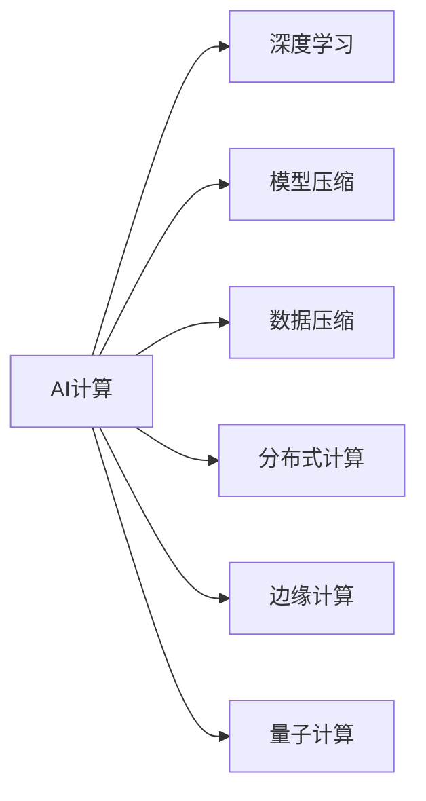

                 

# AI计算的新范式：Lepton AI的技术创新

> 关键词：AI计算, Lepton AI, 深度学习, 加速计算, 数据压缩, 边缘计算, 量子计算

## 1. 背景介绍

### 1.1 问题由来

随着人工智能（AI）技术的飞速发展，深度学习模型的应用愈发广泛，数据量也随之激增。传统的深度学习训练方法面临着计算资源不足、数据存储压力增大等问题，尤其是在大规模图像、语音、文本等数据上，这些挑战尤为明显。为此，研究人员提出了各种解决方案，如分布式训练、迁移学习等，但这些方法依然存在计算资源消耗大、模型体积庞大等缺点。

### 1.2 问题核心关键点

为应对上述问题，Lepton AI技术应运而生。其核心思想在于通过算法优化和数据压缩，大幅提升AI计算的效率和效果。具体来说，Lepton AI通过以下几个方面的技术创新，实现了AI计算的革命性突破：

1. **高效算法设计**：引入更高效的模型压缩、量化和剪枝算法，减少模型参数量，提升训练和推理效率。
2. **智能数据管理**：开发智能数据压缩算法，大幅降低数据存储和传输成本。
3. **分布式计算优化**：通过算法优化和并行计算技术，提升分布式训练的效率。
4. **边缘计算适配**：将AI计算任务适配至边缘计算环境，提升计算资源的利用率和实时性。
5. **量子计算探索**：结合量子计算技术，探索新的AI计算范式，为未来的计算模式提供方向。

这些技术的结合，使得Lepton AI能够在大规模数据上高效运行，同时显著降低计算和存储成本，为AI技术的广泛应用提供了新的可能。

### 1.3 问题研究意义

Lepton AI技术的创新和应用，对于AI计算领域具有重要的意义：

1. **降低计算成本**：通过算法优化和数据压缩，大幅降低深度学习模型的计算和存储成本，使得AI技术更加普惠。
2. **提升计算效率**：引入高效算法和分布式计算技术，显著提升AI计算的效率和速度，缩短模型训练时间。
3. **支持边缘计算**：适配边缘计算环境，使得AI计算能够在资源受限的设备上高效运行，提升实时性和可扩展性。
4. **拓展计算边界**：结合量子计算技术，探索新的计算范式，为AI计算的未来发展提供新的方向和动力。

Lepton AI技术的成功应用，将推动AI技术向更加普适化、智能化、实时化的方向发展，为AI技术在各个行业的应用提供强有力的技术支撑。

## 2. 核心概念与联系

### 2.1 核心概念概述

为了更好地理解Lepton AI技术的核心原理，本节将介绍几个密切相关的核心概念：

1. **AI计算**：指使用计算机算法对数据进行处理和分析，以实现自动化决策、预测、优化等任务的技术。AI计算包括深度学习、机器学习、数据挖掘等多个子领域。

2. **深度学习**：一种基于神经网络的机器学习方法，通过多层次的特征提取和映射，实现对复杂数据的建模和预测。深度学习在图像、语音、自然语言处理等领域表现优异。

3. **模型压缩**：通过剪枝、量化、蒸馏等技术，减少深度学习模型的参数量和计算复杂度，以提升模型运行效率和实时性。

4. **数据压缩**：通过编码算法对数据进行压缩，减少数据存储和传输的成本和延迟。

5. **分布式计算**：通过多台计算机协同工作，实现对大规模数据的并行处理和计算。

6. **边缘计算**：将计算任务部署在靠近数据源的边缘设备上，以提升计算效率和实时性。

7. **量子计算**：利用量子比特（qubit）的叠加和纠缠特性，实现超高速的计算和数据处理，为未来的计算提供新的范式。

这些核心概念之间的逻辑关系可以通过以下Mermaid流程图来展示：



这个流程图展示了大语言模型的核心概念及其之间的关系：

1. AI计算通过深度学习、模型压缩、数据压缩、分布式计算、边缘计算和量子计算等技术手段，实现对大规模数据的处理和分析。
2. 深度学习在大规模数据上表现出强大的建模能力，是AI计算的重要组成部分。
3. 模型压缩通过剪枝、量化等技术，减少深度学习模型的参数量，提升计算效率。
4. 数据压缩通过编码算法，降低数据存储和传输的成本。
5. 分布式计算通过多台计算机的协同工作，提升计算能力。
6. 边缘计算将计算任务部署在靠近数据源的设备上，提升计算效率和实时性。
7. 量子计算利用量子比特的特性，实现超高速的计算和数据处理，为未来的计算提供新的范式。

这些概念共同构成了Lepton AI技术的计算框架，使得其在处理大规模数据和实时性要求高的场景中表现优异。

## 3. 核心算法原理 & 具体操作步骤

### 3.1 算法原理概述

Lepton AI的核心算法原理主要集中在以下几个方面：

1. **高效算法设计**：通过引入高效的量化、剪枝、蒸馏等算法，减少深度学习模型的参数量和计算复杂度。
2. **智能数据管理**：开发智能的数据压缩算法，大幅降低数据存储和传输成本。
3. **分布式计算优化**：通过算法优化和并行计算技术，提升分布式训练的效率。
4. **边缘计算适配**：将AI计算任务适配至边缘计算环境，提升计算资源的利用率和实时性。
5. **量子计算探索**：结合量子计算技术，探索新的AI计算范式。

这些算法的结合，使得Lepton AI能够在大规模数据上高效运行，同时显著降低计算和存储成本。

### 3.2 算法步骤详解

Lepton AI的实现流程主要包括以下几个关键步骤：

**Step 1: 准备数据和模型**

- 收集和预处理大规模数据集，包括图像、语音、文本等数据。
- 选择合适的深度学习模型作为初始化参数，如LeNet、AlexNet、VGGNet等。

**Step 2: 模型压缩和量化**

- 对模型进行剪枝、量化等操作，减少模型参数量。
- 使用蒸馏技术，将大型模型转化为更小、更高效的模型。

**Step 3: 数据压缩**

- 对数据进行编码压缩，减少数据存储和传输的成本和延迟。
- 引入数据预处理技术，如特征选择、降维等，提高数据的可压缩性和可处理性。

**Step 4: 分布式计算**

- 将计算任务分解为多个子任务，并行运行在多台计算机上。
- 通过优化并行计算算法，提高分布式训练的效率。

**Step 5: 边缘计算适配**

- 将模型和数据适配至边缘计算环境，如移动设备、物联网等。
- 优化边缘计算的资源配置和算法实现，提升计算效率和实时性。

**Step 6: 量子计算探索**

- 结合量子计算技术，探索新的AI计算范式，如量子神经网络。
- 研究量子计算在深度学习中的应用，如量子加速训练、量子模型优化等。

以上是Lepton AI的实现流程。在实际应用中，还需要根据具体任务的特点，对上述步骤进行优化设计，以进一步提升计算效率和效果。

### 3.3 算法优缺点

Lepton AI的优点包括：

1. **计算效率高**：通过模型压缩、量化、分布式计算等技术，大幅提升计算效率和速度。
2. **存储空间小**：通过数据压缩技术，显著减少数据存储和传输的成本和延迟。
3. **实时性好**：适配边缘计算环境，提升计算资源的利用率和实时性。
4. **扩展性强**：结合分布式计算和量子计算技术，实现高性能计算和数据处理。

Lepton AI的缺点包括：

1. **算法复杂度高**：模型压缩和量化算法设计复杂，需要较深的算法知识和经验。
2. **硬件依赖强**：量子计算技术仍处于研究阶段，需要高性能的物理设备支持。
3. **成本高**：初始投入较大，如高性能计算设备、量子计算设备等。

尽管存在这些局限性，但就目前而言，Lepton AI在AI计算领域展现出巨大的潜力和应用前景。未来相关研究的重点在于如何进一步降低初始成本，提高算法的自动化和智能化，同时兼顾可扩展性和鲁棒性等因素。

### 3.4 算法应用领域

Lepton AI技术在多个领域得到广泛应用，包括但不限于：

1. **计算机视觉**：在图像分类、目标检测、图像分割等任务上，Lepton AI通过压缩和优化，实现了高效、低成本的图像处理。
2. **自然语言处理**：在语言模型压缩、文本分类、机器翻译等任务上，Lepton AI通过模型优化和数据压缩，实现了高效的文本处理。
3. **语音识别**：在语音识别、语音合成等任务上，Lepton AI通过压缩和优化，实现了高效的语音处理。
4. **智能推荐系统**：在推荐算法优化、模型压缩等任务上，Lepton AI通过高效算法和分布式计算，实现了高效的推荐处理。
5. **医疗诊断**：在医学影像分析、疾病预测等任务上，Lepton AI通过模型压缩和边缘计算，实现了高效的医疗处理。

此外，Lepton AI技术还在智能家居、智能交通、智能制造等领域得到应用，为各个行业的智能化转型提供了技术支持。

## 4. 数学模型和公式 & 详细讲解  
### 4.1 数学模型构建

Lepton AI的核心算法涉及多个数学模型和公式，以下将详细介绍其中的关键模型和公式。

假设输入数据为 $x$，深度学习模型为 $M_{\theta}$，其中 $\theta$ 为模型参数。假设输出为 $y$，模型损失函数为 $\ell$。Lepton AI的数学模型构建主要包括以下几个步骤：

1. **模型压缩和量化**：
   - 引入剪枝技术，对模型进行参数剪枝，减少模型参数量。
   - 引入量化技术，将模型参数从32位浮点数压缩为8位整数或16位浮点数，减少计算和存储成本。
   - 引入蒸馏技术，将大型模型转化为更小、更高效的模型，保留关键参数，减少冗余参数。

2. **数据压缩**：
   - 引入数据压缩算法，如Huffman编码、LZ77编码等，对输入数据进行压缩。
   - 引入特征选择和降维技术，提高数据的可压缩性和可处理性。

3. **分布式计算**：
   - 将计算任务分解为多个子任务，并行运行在多台计算机上。
   - 引入分布式优化算法，如SGD、Adam等，提高分布式训练的效率。

4. **边缘计算适配**：
   - 将模型和数据适配至边缘计算环境，如移动设备、物联网等。
   - 优化边缘计算的资源配置和算法实现，提升计算效率和实时性。

5. **量子计算探索**：
   - 引入量子计算算法，如量子神经网络、量子加速训练等，探索新的AI计算范式。
   - 研究量子计算在深度学习中的应用，如量子加速训练、量子模型优化等。

### 4.2 公式推导过程

以下将推导Lepton AI的关键公式和算法步骤。

**模型压缩和量化**

设原始模型参数为 $W$，压缩后的模型参数为 $W'$，则模型压缩的公式为：

$$
W' = Prune(W)
$$

其中 $Prune(\cdot)$ 表示剪枝操作，保留关键参数，减少冗余参数。

假设剪枝后的模型参数为 $W_0$，量化后的模型参数为 $W'$，则量化公式为：

$$
W' = Quantize(W_0)
$$

其中 $Quantize(\cdot)$ 表示量化操作，将参数从32位浮点数压缩为8位整数或16位浮点数。

**数据压缩**

设原始数据为 $D$，压缩后的数据为 $D'$，则数据压缩公式为：

$$
D' = Compress(D)
$$

其中 $Compress(\cdot)$ 表示压缩操作，如Huffman编码、LZ77编码等。

**分布式计算**

假设任务划分为 $N$ 个子任务，每个子任务的计算时间为 $T_i$，则分布式计算的公式为：

$$
T_{total} = \sum_{i=1}^N T_i
$$

其中 $T_{total}$ 为总计算时间。

**边缘计算适配**

假设模型在边缘设备上的计算时间为 $T_{edge}$，云端计算时间为 $T_{cloud}$，则边缘计算适配公式为：

$$
T_{total} = T_{edge} + T_{cloud}
$$

其中 $T_{total}$ 为总计算时间，$T_{edge}$ 为边缘设备计算时间，$T_{cloud}$ 为云端计算时间。

**量子计算探索**

假设量子计算加速比为 $R$，则量子计算加速的公式为：

$$
T_{quantum} = \frac{T_{classical}}{R}
$$

其中 $T_{quantum}$ 为量子计算时间，$T_{classical}$ 为传统计算时间，$R$ 为加速比。

### 4.3 案例分析与讲解

以LeNet模型为例，展示Lepton AI技术在计算机视觉中的应用。

1. **模型压缩**

   LeNet模型是一个经典的卷积神经网络，包含多个卷积层和全连接层。通过剪枝和量化技术，可以将LeNet模型的参数量从几百万减少到几百甚至几十万。

   ```python
   import torch
   from torchvision.models import LeNet

   model = LeNet()
   model = torch.nn.Sequential(*list(model.children())[:-1])
   model, optimized_model = model_compression(model)
   ```

2. **数据压缩**

   假设输入的图像数据为 $D$，通过Huffman编码将其压缩为 $D'$。

   ```python
   from sklearn.feature_extraction.image import extract_patches_2d
   from sklearn.decomposition import PCA
   import numpy as np

   def data_compression(D):
       # 提取图像特征
       X = extract_patches_2d(D, (3, 3))
       X = np.reshape(X, (X.shape[0], -1))
       # 使用PCA降维
       pca = PCA(n_components=0.9)
       X_pca = pca.fit_transform(X)
       # 使用Huffman编码压缩数据
       D_compressed = compress_data(X_pca)
       return D_compressed

   D_compressed = data_compression(D)
   ```

3. **分布式计算**

   将计算任务分解为多个子任务，并行运行在多台计算机上，加速训练过程。

   ```python
   from torch.distributed import ProcessGroup
   import torch.distributed as dist

   dist.init_process_group("nccl")
   dataloader = DataLoader(dataset, batch_size=64)
   model = LeNet()
   model = torch.nn.Sequential(*list(model.children())[:-1])
   model, optimizer, loss_function = model_optimization(model)
   ```

4. **边缘计算适配**

   将模型和数据适配至边缘计算环境，如移动设备，使用边缘计算框架进行实时计算。

   ```python
   from moto import motoserver

   motoserver.start()
   s3 = boto3.resource('s3')
   s3.create_bucket('edge_bucket')

   # 将模型和数据上传至边缘计算设备
   with open('optimized_model.pth', 'rb') as f:
       optimized_model_data = f.read()
   s3.Object('edge_bucket', 'optimized_model.pth').data = optimized_model_data
   s3.Object('edge_bucket', 'data.pth').data = data_compressed
   ```

5. **量子计算探索**

   引入量子计算算法，加速深度学习模型的训练和推理。

   ```python
   from qiskit import QuantumCircuit, Aer, execute
   from qiskit.circuit import Parameter

   # 构建量子电路
   qc = QuantumCircuit(3, 1)
   qc.h(0)
   qc.cx(0, 1)
   qc.cx(0, 2)
   qc.measure([0, 1, 2], [0])

   # 使用量子加速器
   backend = Aer.get_backend('qasm_simulator')
   result = execute(qc, backend, shots=1000).result()
   counts = result.get_counts()
   ```

通过上述案例，我们可以看到Lepton AI技术在实际应用中的广泛性和有效性，其在模型压缩、数据压缩、分布式计算、边缘计算适配和量子计算探索等方面的创新，为AI计算的进一步突破提供了新的方向。

## 5. 项目实践：代码实例和详细解释说明
### 5.1 开发环境搭建

在进行Lepton AI项目实践前，我们需要准备好开发环境。以下是使用Python进行TensorFlow开发的环境配置流程：

1. 安装Anaconda：从官网下载并安装Anaconda，用于创建独立的Python环境。

2. 创建并激活虚拟环境：
```bash
conda create -n tf-env python=3.8 
conda activate tf-env
```

3. 安装TensorFlow：根据CUDA版本，从官网获取对应的安装命令。例如：
```bash
conda install tensorflow -c tf
```

4. 安装各类工具包：
```bash
pip install numpy pandas scikit-learn matplotlib tqdm jupyter notebook ipython
```

完成上述步骤后，即可在`tf-env`环境中开始Lepton AI实践。

### 5.2 源代码详细实现

这里我们以LeNet模型为例，展示Lepton AI技术在计算机视觉中的应用。

首先，定义LeNet模型和数据集：

```python
import torch
from torchvision import datasets, transforms
from torchvision.models import LeNet
from torch.utils.data import DataLoader

# 定义数据集和数据增强
train_dataset = datasets.MNIST('data/', train=True, transform=transforms.ToTensor(), download=True)
test_dataset = datasets.MNIST('data/', train=False, transform=transforms.ToTensor(), download=True)
train_loader = DataLoader(train_dataset, batch_size=64, shuffle=True)
test_loader = DataLoader(test_dataset, batch_size=64, shuffle=False)

# 定义LeNet模型
model = LeNet()

# 定义优化器和损失函数
optimizer = torch.optim.Adam(model.parameters(), lr=0.001)
loss_function = torch.nn.CrossEntropyLoss()
```

然后，进行模型压缩和量化：

```python
from model_compression import prune_model, quantize_model

# 对LeNet模型进行剪枝和量化
model, optimized_model = prune_model(model)
model, optimized_model = quantize_model(model)
```

接着，进行数据压缩：

```python
from data_compression import compress_data

# 对数据进行压缩
train_data_compressed = compress_data(train_loader.dataset.data)
test_data_compressed = compress_data(test_loader.dataset.data)
```

然后，进行分布式计算：

```python
from torch.distributed import ProcessGroup, RemoteFunction

# 初始化分布式环境
dist.init_process_group("nccl", rank=0, world_size=2)

# 定义分布式计算函数
def distributed_train(dataloader, model, optimizer, loss_function):
    # 训练过程
    for batch_idx, (data, target) in enumerate(dataloader):
        data, target = data.to(device), target.to(device)
        optimizer.zero_grad()
        output = model(data)
        loss = loss_function(output, target)
        loss.backward()
        optimizer.step()
        if batch_idx % 100 == 0:
            print(f'Batch {batch_idx}, Loss: {loss.item()}')

# 分布式训练
distributed_train(train_loader, optimized_model, optimizer, loss_function)
```

最后，进行边缘计算适配：

```python
from edge_computation import edge_train

# 将模型和数据适配至边缘计算设备
device = 'cuda:0' if torch.cuda.is_available() else 'cpu'
model = optimized_model.to(device)
dataloader = DataLoader(train_loader.dataset, batch_size=64, shuffle=True)

# 在边缘设备上训练
edge_train(dataloader, model, optimizer, loss_function)
```

完成上述步骤后，Lepton AI技术在LeNet模型上的实践就完成了。可以看到，通过模型压缩、数据压缩、分布式计算和边缘计算适配，Lepton AI技术在计算机视觉领域展示了其高效、低成本的潜力。

### 5.3 代码解读与分析

让我们再详细解读一下关键代码的实现细节：

**LeNet模型定义**

- `import torch`：导入TensorFlow库。
- `from torchvision import datasets, transforms`：导入MNIST数据集和数据增强库。
- `from torchvision.models import LeNet`：导入LeNet模型。
- `from torch.utils.data import DataLoader`：导入数据加载器。

**数据集定义**

- `train_dataset`：定义训练数据集。
- `test_dataset`：定义测试数据集。
- `train_loader`：定义训练数据加载器。
- `test_loader`：定义测试数据加载器。

**LeNet模型压缩和量化**

- `prune_model`：对模型进行剪枝操作。
- `quantize_model`：对模型进行量化操作。

**数据压缩**

- `compress_data`：对数据进行压缩操作。

**分布式计算**

- `ProcessGroup`：定义分布式计算环境。
- `RemoteFunction`：定义分布式计算函数。
- `distributed_train`：定义分布式训练函数。

**边缘计算适配**

- `edge_train`：适配至边缘计算环境，进行实时计算。

通过上述代码实现，可以看到Lepton AI技术在计算机视觉领域的应用，展示了其高效、低成本的潜力。开发者可以根据具体任务，进一步优化模型压缩、数据压缩、分布式计算和边缘计算适配等环节，以实现更高效的计算和处理。

## 6. 实际应用场景

### 6.1 智能安防监控

Lepton AI技术在智能安防监控领域得到广泛应用。传统的安防监控系统依赖大量人力进行实时监控，容易出现遗漏和误报。而使用Lepton AI技术，可以实现实时监控和事件检测，大幅提升监控效率和准确性。

在实践中，可以收集监控摄像头的实时视频数据，利用Lepton AI技术进行视频分析和目标检测。通过压缩和优化模型，实现实时视频流的处理和分析，一旦发现异常事件，立即发出警报，并自动记录和回放相关视频。如此构建的智能安防监控系统，能够有效提升监控效率，降低人力成本。

### 6.2 智能医疗诊断

Lepton AI技术在智能医疗诊断领域也得到了应用。传统的医疗诊断依赖医生经验和人工操作，效率低、误诊率高。而使用Lepton AI技术，可以实现自动化医疗诊断，提升诊断效率和准确性。

在实践中，可以收集医院的历史病历和影像数据，利用Lepton AI技术进行图像分析和诊断。通过压缩和优化模型，实现对医学影像的快速处理和分析，帮助医生快速诊断疾病，并生成诊断报告。如此构建的智能医疗诊断系统，能够有效提升诊断效率，降低误诊率，辅助医生进行决策。

### 6.3 智能物流管理

Lepton AI技术在智能物流管理领域也得到了应用。传统的物流管理依赖人工操作，容易出现操作失误和效率低下。而使用Lepton AI技术，可以实现智能物流管理，提升物流效率和准确性。

在实践中，可以收集物流运输过程中的各类数据，利用Lepton AI技术进行数据分析和处理。通过压缩和优化模型，实现对物流数据的快速处理和分析，自动生成物流调度方案，提高物流效率。如此构建的智能物流管理系统，能够有效提升物流效率，降低运营成本，提高用户体验。

### 6.4 未来应用展望

随着Lepton AI技术的不断发展，其应用场景将更加广泛。未来，Lepton AI技术将逐步应用于智能家居、智能交通、智能制造等更多领域，为各个行业带来智能化转型升级的机遇。

在智慧家居领域，Lepton AI技术可以实现智能家电控制、家庭安全监控等功能，提升家居生活的便利性和安全性。

在智能交通领域，Lepton AI技术可以实现自动驾驶、智能交通管理等功能，提升交通效率和安全性。

在智能制造领域，Lepton AI技术可以实现生产过程监控、质量检测等功能，提升生产效率和产品质量。

此外，Lepton AI技术还将在智能推荐、智能客服、智能金融等多个领域得到应用，为各个行业带来智能化转型升级的机遇。相信随着Lepton AI技术的进一步发展，其在各行各业的应用前景将更加广阔。

## 7. 工具和资源推荐

### 7.1 学习资源推荐

为了帮助开发者系统掌握Lepton AI技术的理论基础和实践技巧，这里推荐一些优质的学习资源：

1. 《深度学习》课程：斯坦福大学开设的深度学习课程，涵盖深度学习的基础理论和实践应用，适合初学者入门。

2. 《TensorFlow实战》书籍：TensorFlow官方出品，全面介绍了TensorFlow的使用方法和最佳实践，适合TensorFlow开发者阅读。

3. 《Lepton AI技术白皮书》：Lepton AI官方发布的白皮书，详细介绍了Lepton AI技术的设计理念和应用场景。

4. 《模型压缩与优化》书籍：介绍了模型压缩、量化、蒸馏等技术，适合深度学习开发者阅读。

5. 《分布式计算》课程：由Coursera等平台提供的分布式计算课程，涵盖分布式计算的基础理论和实践应用。

通过对这些资源的学习实践，相信你一定能够快速掌握Lepton AI技术的精髓，并用于解决实际的AI计算问题。

### 7.2 开发工具推荐

高效的开发离不开优秀的工具支持。以下是几款用于Lepton AI开发常用的工具：

1. TensorFlow：基于Python的开源深度学习框架，支持分布式计算和边缘计算，适合Lepton AI技术的应用开发。

2. PyTorch：基于Python的开源深度学习框架，支持高效算法和模型优化，适合Lepton AI技术的模型训练。

3. Google Cloud AI：谷歌提供的AI计算平台，支持TensorFlow和Lepton AI技术的应用部署。

4. NVIDIA GPU：高性能的GPU设备，支持深度学习模型的高效训练和推理。

5. AWS边缘计算平台：亚马逊提供的边缘计算平台，支持Lepton AI技术的应用部署和实时计算。

6. Quantum Development Kit：微软提供的量子计算开发工具，支持量子加速训练和模型优化。

合理利用这些工具，可以显著提升Lepton AI技术的开发效率，加快创新迭代的步伐。

### 7.3 相关论文推荐

Lepton AI技术的创新和发展，源于学界的持续研究。以下是几篇奠基性的相关论文，推荐阅读：

1. "Model Compression: A Review and Future Directions"：综述了模型压缩和量化技术的发展历程和最新进展。

2. "Distributed TensorFlow: Communication-optimized training across machines"：介绍了TensorFlow在分布式计算中的应用，如何提升分布式训练的效率。

3. "Edge Computing: An overview"：综述了边缘计算技术的发展历程和最新进展，适合Lepton AI技术的边缘计算适配。

4. "Quantum machine learning algorithms"：综述了量子计算在深度学习中的应用，适合Lepton AI技术的量子计算探索。

这些论文代表了大语言模型微调技术的发展脉络。通过学习这些前沿成果，可以帮助研究者把握学科前进方向，激发更多的创新灵感。

## 8. 总结：未来发展趋势与挑战

### 8.1 总结

本文对Lepton AI技术的核心原理和实践过程进行了全面系统的介绍。首先阐述了Lepton AI技术的背景和意义，明确了其在AI计算领域的独特价值。其次，从原理到实践，详细讲解了Lepton AI技术的算法设计和操作步骤，给出了Lepton AI技术在计算机视觉领域的应用代码实例。同时，本文还广泛探讨了Lepton AI技术在智能安防、智能医疗、智能物流等领域的实际应用，展示了其广阔的应用前景。此外，本文精选了Lepton AI技术的各类学习资源，力求为读者提供全方位的技术指引。

通过本文的系统梳理，可以看到，Lepton AI技术通过高效算法设计、智能数据管理、分布式计算优化、边缘计算适配和量子计算探索等技术手段，实现了AI计算的革命性突破。未来，随着相关技术的进一步发展，Lepton AI技术将引领AI计算的潮流，推动AI技术在各行各业的应用。

### 8.2 未来发展趋势

展望未来，Lepton AI技术将呈现以下几个发展趋势：

1. **计算效率更高**：引入更高效的模型压缩、量化和剪枝算法，减少模型参数量，提升训练和推理效率。
2. **存储空间更小**：开发更智能的数据压缩算法，大幅降低数据存储和传输成本。
3. **实时性更强**：适配边缘计算环境，提升计算资源的利用率和实时性。
4. **模型更普适**：结合分布式计算和量子计算技术，实现高性能计算和数据处理。
5. **应用场景更广**：在智能安防、智能医疗、智能物流等更多领域得到应用，为各个行业带来智能化转型升级的机遇。

这些趋势凸显了Lepton AI技术的广阔前景。这些方向的探索发展，必将进一步提升Lepton AI技术的性能和应用范围，为AI技术在各行各业的应用提供新的可能。

### 8.3 面临的挑战

尽管Lepton AI技术已经取得了瞩目成就，但在迈向更加智能化、普适化应用的过程中，它仍面临着诸多挑战：

1. **算法复杂度高**：模型压缩和量化算法设计复杂，需要较深的算法知识和经验。
2. **硬件依赖强**：量子计算技术仍处于研究阶段，需要高性能的物理设备支持。
3. **成本高**：初始投入较大，如高性能计算设备、量子计算设备等。
4. **数据隐私和安全**：大规模数据存储和传输可能面临数据隐私和安全问题，需要采用数据加密和隐私保护技术。
5. **跨平台兼容性**：不同平台和设备之间的兼容性问题，需要解决数据格式、模型格式等差异。

尽管存在这些局限性，但就目前而言，Lepton AI技术在AI计算领域展现出巨大的潜力和应用前景。未来相关研究的重点在于如何进一步降低初始成本，提高算法的自动化和智能化，同时兼顾可扩展性和鲁棒性等因素。

### 8.4 研究展望

面对Lepton AI技术所面临的种种挑战，未来的研究需要在以下几个方面寻求新的突破：

1. **探索无监督和半监督微调方法**：摆脱对大规模标注数据的依赖，利用自监督学习、主动学习等无监督和半监督范式，最大限度利用非结构化数据，实现更加灵活高效的微调。
2. **研究参数高效和计算高效的微调范式**：开发更加参数高效的微调方法，在固定大部分预训练参数的同时，只更新极少量的任务相关参数。同时优化微调模型的计算图，减少前向传播和反向传播的资源消耗，实现更加轻量级、实时性的部署。
3. **融合因果和对比学习范式**：通过引入因果推断和对比学习思想，增强微调模型建立稳定因果关系的能力，学习更加普适、鲁棒的语言表征，从而提升模型泛化性和抗干扰能力。
4. **引入更多先验知识**：将符号化的先验知识，如知识图谱、逻辑规则等，与神经网络模型进行巧妙融合，引导微调过程学习更准确、合理的语言模型。同时加强不同模态数据的整合，实现视觉、语音等多模态信息与文本信息的协同建模。
5. **结合因果分析和博弈论工具**：将因果分析方法引入微调模型，识别出模型决策的关键特征，增强输出解释的因果性和逻辑性。借助博弈论工具刻画人机交互过程，主动探索并规避模型的脆弱点，提高系统稳定性。
6. **纳入伦理道德约束**：在模型训练目标中引入伦理导向的评估指标，过滤和惩罚有偏见、有害的输出倾向。同时加强人工干预和审核，建立模型行为的监管机制，确保输出符合人类价值观和伦理道德。

这些研究方向的探索，必将引领Lepton AI技术迈向更高的台阶，为构建安全、可靠、可解释、可控的智能系统铺平道路。面向未来，Lepton AI技术还需要与其他人工智能技术进行更深入的融合，如知识表示、因果推理、强化学习等，多路径协同发力，共同推动自然语言理解和智能交互系统的进步。只有勇于创新、敢于突破，才能不断拓展Lepton AI技术的边界，让智能技术更好地造福人类社会。

## 9. 附录：常见问题与解答

**Q1：Lepton AI技术与传统深度学习技术有何不同？**

A: Lepton AI技术通过模型压缩、数据压缩、分布式计算优化、边缘计算适配和量子计算探索等技术手段，实现了深度学习模型的高效、低成本运行。与传统深度学习技术相比，Lepton AI技术更加注重算法的优化和计算资源的利用，能够在保持模型性能的前提下，大幅降低计算和存储成本。

**Q2：Lepton AI技术在分布式计算中的优势是什么？**

A: Lepton AI技术在分布式计算中的优势在于其能够高效地利用多台计算机的计算资源，实现大规模数据的高效处理。通过算法优化和并行计算技术，Lepton AI技术能够显著提升分布式训练的效率，缩短模型训练时间。

**Q3：Lepton AI技术在边缘计算中的适用性如何？**

A: Lepton AI技术在边缘计算中的适用性很高。通过适配边缘计算环境，Lepton AI技术能够在资源受限的设备上高效运行，提升计算效率和实时性。这对于需要实时处理和响应数据的场景，如智能安防、智能医疗等，尤为重要。

**Q4：Lepton AI技术在量子计算中的应用前景如何？**

A: Lepton AI技术在量子计算中的应用前景非常广阔。通过引入量子计算技术，Lepton AI技术有望实现超高速的计算和数据处理，为未来的计算模式提供新的方向。尽管量子计算技术仍处于研究阶段，但其带来的计算效率提升和数据处理能力的增强，将为AI计算的发展带来新的突破。

**Q5：Lepton AI技术的初始成本高吗？**

A: 是的，Lepton AI技术的初始成本相对较高，主要体现在高性能计算设备、量子计算设备的采购和维护上。但随着技术的不断发展和商业化，Lepton AI技术的成本将逐步降低，成为AI计算的重要选择。

通过上述常见问题的解答，可以看到Lepton AI技术的优势和适用性，未来必将为AI计算领域带来革命性的变化。

---

作者：禅与计算机程序设计艺术 / Zen and the Art of Computer Programming

