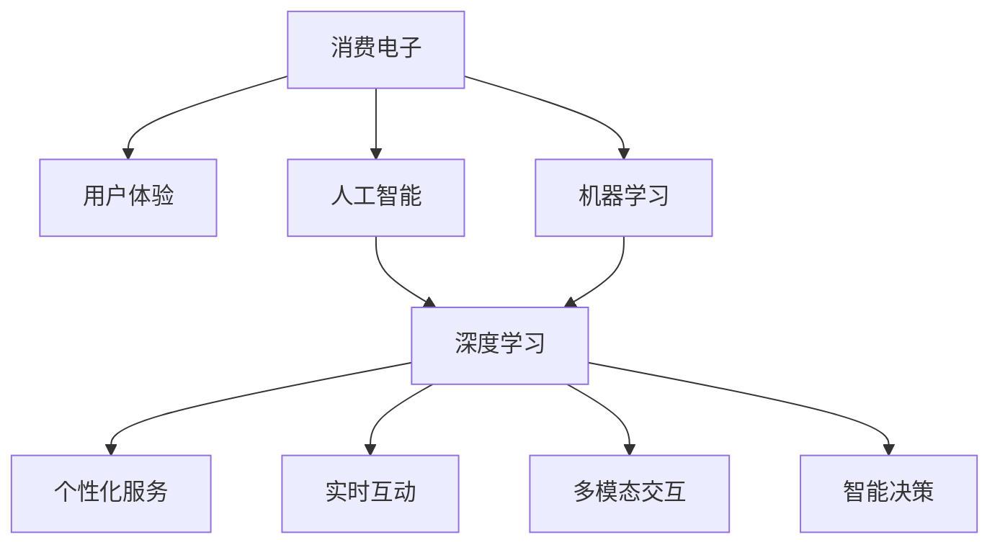

                 

# AI赋能消费电子与用户体验

## 1. 背景介绍

### 1.1 问题由来
近年来，随着人工智能技术的迅猛发展，消费者电子设备（Consumer Electronics）的功能和性能得到了前所未有的提升，用户体验（User Experience, UX）也逐步从单一功能向个性化、智能化转变。AI技术的赋能使得消费电子设备更加智能、便捷、个性化，满足了消费者的多样化需求，提升了用户体验。

### 1.2 问题核心关键点
当前消费电子设备的用户体验提升主要依赖于以下几方面：
- 数据驱动的个性化服务：通过收集用户数据，如使用习惯、偏好等，提供个性化推荐、智能控制等功能。
- 实时互动和反馈：通过语音助手、智能家居等技术，实现实时的人机互动和反馈，提升用户的即时使用体验。
- 多模态交互：集成视觉、听觉、触觉等多种交互方式，提供更丰富的用户体验。
- 智能决策和建议：基于大数据和机器学习算法，为用户提供精准的决策和建议，如购物推荐、健康管理等。

## 2. 核心概念与联系

### 2.1 核心概念概述

为了更好地理解AI技术如何赋能消费电子与用户体验，本节将介绍几个密切相关的核心概念：

- **消费电子（Consumer Electronics, CE）**：指面向家庭、个人用户生产的各种电子设备，如智能手机、智能手表、智能音箱、智能家居设备等。消费电子已经成为人们日常生活的重要组成部分。
- **用户体验（User Experience, UX）**：指用户在使用产品和服务时的整体感受，包括功能性、易用性、美观性、安全性等方面。良好的用户体验可以提升用户满意度和忠诚度。
- **人工智能（Artificial Intelligence, AI）**：指模拟人类智能过程的计算机程序和算法，通过学习和推理实现自动化决策和任务执行。
- **机器学习（Machine Learning, ML）**：指通过算法让计算机从数据中学习并作出预测或决策，是AI的重要组成部分。
- **深度学习（Deep Learning, DL）**：指一种基于多层神经网络的机器学习技术，可以处理大规模非结构化数据，广泛应用于语音识别、图像处理、自然语言处理等领域。

这些概念之间的逻辑关系可以通过以下Mermaid流程图来展示：



这个流程图展示了几组概念之间的联系：

1. 消费电子通过人工智能技术，如深度学习，提升用户体验。
2. 人工智能技术包含机器学习和深度学习，机器学习基于数据驱动的决策，深度学习通过复杂的多层神经网络进行特征提取和模式识别。
3. 深度学习是机器学习的重要分支，它通过更复杂的网络结构和更丰富的参数配置，使得模型能够处理更大规模的数据和更复杂的任务。
4. 人工智能技术可以通过个性化服务、实时互动、多模态交互和智能决策等形式，全面提升用户体验。

## 3. 核心算法原理 & 具体操作步骤

### 3.1 算法原理概述

AI技术在消费电子中的应用，主要是通过深度学习模型，尤其是卷积神经网络（Convolutional Neural Networks, CNN）和循环神经网络（Recurrent Neural Networks, RNN）等，实现对用户行为、偏好和环境的理解和预测。具体来说，主要包括：

- **特征提取**：通过深度学习模型，对用户数据进行特征提取，如语音、图像、文本等。
- **行为建模**：基于提取的特征，建立用户行为模型，预测用户的下一步行为或需求。
- **个性化推荐**：根据用户行为模型，提供个性化的推荐服务，如音乐、视频、商品等。
- **智能控制**：通过用户行为模型，实现智能家居设备的自动控制，如灯光、空调、窗帘等。
- **实时互动**：通过语音识别、自然语言处理等技术，实现实时的人机互动，提升用户体验。

### 3.2 算法步骤详解

基于深度学习的AI技术在消费电子中的应用，主要分为以下几个步骤：

**Step 1: 数据收集与预处理**
- 收集用户数据，如使用日志、行为记录、传感器数据等。
- 对收集的数据进行清洗和预处理，去除噪声和异常值。

**Step 2: 特征提取与建模**
- 选择合适的深度学习模型，如卷积神经网络（CNN）或循环神经网络（RNN）。
- 对用户数据进行特征提取，如提取图像中的边缘、角点，提取语音中的声谱图等。
- 基于提取的特征，训练深度学习模型，建立用户行为模型。

**Step 3: 个性化推荐与智能控制**
- 根据用户行为模型，提供个性化的推荐服务。
- 通过用户行为模型，实现智能家居设备的自动控制。

**Step 4: 实时互动与反馈**
- 通过语音识别和自然语言处理技术，实现实时的人机互动。
- 根据用户的反馈，不断调整和优化模型，提升用户体验。

### 3.3 算法优缺点

AI技术在消费电子中的应用，具有以下优点：

- **提升用户体验**：通过深度学习模型，可以实现个性化推荐、智能控制、实时互动等功能，提升用户体验。
- **功能丰富**：深度学习技术可以处理大规模非结构化数据，实现多种功能，如智能家居、智能音箱等。
- **性能优越**：深度学习模型在大规模数据上表现优异，可以提升产品性能。

同时，该方法也存在一些局限性：

- **数据依赖**：深度学习模型需要大量的标注数据进行训练，数据收集和标注成本较高。
- **计算资源需求高**：深度学习模型训练和推理需要高性能的计算资源，成本较高。
- **模型复杂度高**：深度学习模型参数较多，训练和推理复杂度较高。
- **可解释性不足**：深度学习模型通常是"黑盒"模型，难以解释其决策过程。

尽管存在这些局限性，但AI技术在消费电子中的应用已经成为主流趋势，未来还有更广阔的发展空间。

### 3.4 算法应用领域

AI技术在消费电子中的应用，主要体现在以下几个领域：

- **智能家居**：通过深度学习模型，实现智能家居设备的自动控制和智能化管理，如智能灯光、空调、窗帘等。
- **智能音箱**：通过深度学习模型，实现语音识别、自然语言处理和个性化推荐，提供智能语音助手服务。
- **智能手表**：通过深度学习模型，实现健康监测、运动追踪和智能提醒等功能。
- **智能电视**：通过深度学习模型，实现智能推荐、语音控制和自然语言理解等。
- **智能眼镜**：通过深度学习模型，实现图像识别、语音识别和智能推荐等。

## 4. 数学模型和公式 & 详细讲解  
### 4.1 数学模型构建

在AI技术赋能消费电子与用户体验的过程中，深度学习模型是核心组成部分。这里以图像分类任务为例，介绍基于卷积神经网络（CNN）的深度学习模型的数学模型构建。

设输入图像为 $x \in \mathbb{R}^{H \times W \times C}$，其中 $H$、$W$ 分别为图像的高度和宽度，$C$ 为图像的通道数。输出为 $y \in \{1,2,\ldots,K\}$，$K$ 为分类数目。模型的目标是最小化预测输出与真实标签之间的交叉熵损失。

### 4.2 公式推导过程

假设卷积神经网络模型由 $L$ 层构成，每层包含若干卷积层和池化层，最后一层为全连接层。模型训练过程如下：

1. 前向传播：将输入图像 $x$ 逐层传递，得到最终输出 $y$。
2. 计算损失函数：$J(y,\hat{y})$，其中 $\hat{y}$ 为模型预测输出。
3. 反向传播：计算损失函数对模型参数的梯度，更新模型参数。

以第一层卷积层为例，其前向传播公式为：

$$
z^{[1]} = W^{[1]} x + b^{[1]}
$$

其中 $W^{[1]}$ 为卷积核矩阵，$x$ 为输入图像，$b^{[1]}$ 为偏置向量。

反向传播公式为：

$$
\frac{\partial J}{\partial W^{[1]}} = \frac{\partial J}{\partial z^{[1]}} \frac{\partial z^{[1]}}{\partial W^{[1]}}
$$

其中 $\frac{\partial J}{\partial z^{[1]}}$ 为损失函数对前向传播输出 $z^{[1]}$ 的梯度，$\frac{\partial z^{[1]}}{\partial W^{[1]}}$ 为前向传播输出对卷积核矩阵的梯度。

通过不断迭代前向传播和反向传播，更新模型参数，最小化损失函数，最终得到训练好的深度学习模型。

### 4.3 案例分析与讲解

以智能音箱的语音识别为例，介绍基于深度学习的AI技术在消费电子中的应用。

**Step 1: 数据收集与预处理**
- 收集用户语音数据，并进行预处理，如降噪、分帧、特征提取等。

**Step 2: 特征提取与建模**
- 使用卷积神经网络（CNN）提取语音特征，建立语音识别模型。
- 在大量标注的语音数据上进行训练，最小化预测输出与真实标签之间的交叉熵损失。

**Step 3: 实时互动与反馈**
- 在智能音箱上部署训练好的语音识别模型，实现实时语音识别和自然语言处理。
- 根据用户的反馈，不断调整和优化模型，提升语音识别的准确性和鲁棒性。

## 5. 项目实践：代码实例和详细解释说明

### 5.1 开发环境搭建

在进行AI技术赋能消费电子与用户体验的项目开发时，需要使用一些专业的开发工具和框架。以下是常用工具和框架的搭建方法：

1. Python环境搭建：
   - 安装Anaconda或Miniconda，创建虚拟环境。
   - 安装必要的Python库，如TensorFlow、Keras、PyTorch等。

2. 深度学习框架安装：
   - 安装TensorFlow，使用pip或conda安装。
   - 安装Keras，使用pip安装。
   - 安装PyTorch，使用conda或pip安装。

3. 数据处理工具安装：
   - 安装NumPy、Pandas、Scikit-Learn等数据处理工具，使用pip或conda安装。

4. 开发环境搭建完成，即可进行AI技术赋能消费电子与用户体验的开发实践。

### 5.2 源代码详细实现

以下是使用TensorFlow和Keras框架进行智能音箱语音识别的代码实现：

```python
import tensorflow as tf
from tensorflow.keras.layers import Input, Conv2D, MaxPooling2D, Flatten, Dense, Dropout
from tensorflow.keras.models import Model
from tensorflow.keras.optimizers import Adam
from tensorflow.keras.losses import CategoricalCrossentropy

# 定义输入层
input_layer = Input(shape=(40, 80, 1))

# 定义卷积层和池化层
conv1 = Conv2D(32, kernel_size=(3, 3), activation='relu')(input_layer)
pool1 = MaxPooling2D(pool_size=(2, 2))(conv1)

conv2 = Conv2D(64, kernel_size=(3, 3), activation='relu')(pool1)
pool2 = MaxPooling2D(pool_size=(2, 2))(conv2)

# 定义全连接层
flatten = Flatten()(pool2)
dense1 = Dense(128, activation='relu')(flatten)
dropout1 = Dropout(0.5)(dense1)

dense2 = Dense(64, activation='relu')(dropout1)
dropout2 = Dropout(0.5)(dense2)

# 定义输出层
output_layer = Dense(10, activation='softmax')(dropout2)

# 定义模型
model = Model(inputs=input_layer, outputs=output_layer)

# 编译模型
model.compile(optimizer=Adam(lr=0.001), loss=CategoricalCrossentropy(), metrics=['accuracy'])

# 训练模型
model.fit(X_train, y_train, epochs=10, batch_size=64, validation_data=(X_test, y_test))
```

### 5.3 代码解读与分析

上述代码实现了基于卷积神经网络的语音识别模型，具体解析如下：

1. 输入层：定义输入数据的形状，即40个时间步、80个频谱点、1个通道。
2. 卷积层和池化层：通过卷积和池化操作，提取输入数据中的特征。
3. 全连接层：将卷积层和池化层提取的特征展开为一维向量，送入全连接层进行分类。
4. 输出层：使用softmax激活函数输出10个类别的概率分布。
5. 模型编译：使用Adam优化器和交叉熵损失函数进行模型训练。
6. 模型训练：使用训练数据对模型进行训练，并在测试数据上进行验证。

## 6. 实际应用场景

### 6.1 智能家居

智能家居是AI技术赋能消费电子与用户体验的重要领域之一。通过深度学习模型，可以实现智能家居设备的自动控制和智能化管理，如智能灯光、空调、窗帘等。用户可以通过语音助手或手机App，实现对这些设备的控制和查询，提升家居生活的便捷性和舒适性。

**具体实现步骤：**
1. 收集家庭环境数据，如温度、湿度、光照等。
2. 通过深度学习模型，建立环境感知模型，预测环境状态。
3. 根据环境状态，自动调整家居设备的运行状态，如开灯、关窗等。

### 6.2 智能手表

智能手表通过深度学习模型，可以实现健康监测、运动追踪和智能提醒等功能。用户可以通过手表监测自己的健康状况，获得运动建议和天气提醒等。

**具体实现步骤：**
1. 收集用户健康数据，如心率、血氧、步数等。
2. 通过深度学习模型，建立健康监测模型，预测健康状态。
3. 根据健康状态，给出运动建议和提醒信息。

### 6.3 智能电视

智能电视通过深度学习模型，可以实现智能推荐、语音控制和自然语言理解等。用户可以通过语音助手或遥控器，实现对这些设备的控制和查询，提升电视观看的便捷性和舒适性。

**具体实现步骤：**
1. 收集用户观看历史数据，如观看时间、频道、节目等。
2. 通过深度学习模型，建立用户行为模型，预测用户的观看兴趣。
3. 根据用户兴趣，推荐相关节目和频道。

### 6.4 未来应用展望

未来，AI技术在消费电子中的应用将会更加广泛和深入。以下是一些未来应用展望：

1. **智能眼镜**：通过深度学习模型，实现图像识别、语音识别和智能推荐等功能，提升用户的视觉体验。
2. **智能车载系统**：通过深度学习模型，实现自然语言处理、语音控制和智能导航等功能，提升用户的驾驶体验。
3. **智能穿戴设备**：通过深度学习模型，实现健康监测、运动追踪和智能提醒等功能，提升用户的身体状态监测和健康管理。
4. **智能家电**：通过深度学习模型，实现家居设备的智能控制和智能化管理，提升家居生活的便捷性和舒适性。
5. **智能机器人**：通过深度学习模型，实现自然语言理解、图像识别和智能决策等功能，提升用户与机器人的互动体验。

## 7. 工具和资源推荐

### 7.1 学习资源推荐

为了帮助开发者系统掌握AI技术在消费电子中的应用，以下是一些优质的学习资源：

1. TensorFlow官方文档：TensorFlow是深度学习领域的主流框架，其官方文档详细介绍了TensorFlow的使用方法和实践案例。
2. Keras官方文档：Keras是深度学习框架中的轻量级框架，其官方文档提供了丰富的教程和示例。
3. PyTorch官方文档：PyTorch是深度学习框架中的另一个主流选择，其官方文档详细介绍了PyTorch的使用方法和实践案例。
4. Coursera《深度学习专项课程》：由深度学习领域的专家授课，系统介绍深度学习的基本原理和实践技巧。
5. Udacity《深度学习纳米学位》：提供深度学习的高级课程和实战项目，帮助开发者全面掌握深度学习技术。

通过对这些资源的学习实践，相信你一定能够快速掌握AI技术在消费电子中的应用，并用于解决实际的消费电子问题。

### 7.2 开发工具推荐

在进行AI技术赋能消费电子与用户体验的开发时，需要使用一些专业的开发工具和框架。以下是常用工具和框架的推荐：

1. TensorFlow：基于Python的开源深度学习框架，灵活动态的计算图，适合快速迭代研究。TensorFlow提供了丰富的预训练模型和训练工具。
2. Keras：由TensorFlow支持的高级深度学习框架，提供了简单易用的API，适合快速搭建和训练模型。
3. PyTorch：由Facebook开发的深度学习框架，提供了灵活的计算图和动态图机制，适合研究新算法和模型。
4. Weights & Biases：模型训练的实验跟踪工具，可以记录和可视化模型训练过程中的各项指标，方便对比和调优。
5. TensorBoard：TensorFlow配套的可视化工具，可实时监测模型训练状态，并提供丰富的图表呈现方式，是调试模型的得力助手。

合理利用这些工具，可以显著提升AI技术赋能消费电子与用户体验的开发效率，加快创新迭代的步伐。

### 7.3 相关论文推荐

以下是几篇奠基性的相关论文，推荐阅读：

1. AlexNet：2012年ImageNet图像识别比赛冠军，标志着深度学习在图像处理领域的成功。
2. GoogLeNet：2014年ImageNet图像识别比赛冠军，提出了Inception模块，提升了深度学习模型的计算效率。
3. VGGNet：2014年ImageNet图像识别比赛冠军，通过使用小尺寸卷积核和堆叠层，提升了深度学习模型的性能。
4. ResNet：2015年ImageNet图像识别比赛冠军，提出了残差连接模块，解决了深度学习模型的退化问题。
5. Transformer：2017年提出的自注意力机制，实现了自然语言处理领域的重大突破。

这些论文代表了大数据和深度学习技术的发展脉络，通过学习这些前沿成果，可以帮助研究者把握学科前进方向，激发更多的创新灵感。

## 8. 总结：未来发展趋势与挑战

### 8.1 总结

本文对AI技术在消费电子中的应用进行了全面系统的介绍。首先阐述了AI技术在消费电子中的重要性和应用前景，明确了其对用户体验的显著提升。其次，从原理到实践，详细讲解了AI技术在消费电子中的应用方法和技术细节，给出了AI技术赋能消费电子与用户体验的完整代码实例。同时，本文还广泛探讨了AI技术在智能家居、智能手表、智能电视等多个领域的应用场景，展示了AI技术的广阔前景。最后，本文精选了AI技术在消费电子中的应用资源，力求为读者提供全方位的技术指引。

通过本文的系统梳理，可以看到，AI技术在消费电子中的应用已经成为主流趋势，极大地提升了用户体验和产品性能。未来，伴随AI技术的持续演进，AI技术在消费电子中的应用也将更加广泛和深入，带来更多创新和突破。

### 8.2 未来发展趋势

展望未来，AI技术在消费电子中的应用将呈现以下几个发展趋势：

1. **个性化体验**：通过深度学习模型，实现对用户行为的全面理解，提供更加个性化的服务，提升用户体验。
2. **智能化决策**：基于大数据和深度学习模型，实现对复杂环境的智能化决策，提升产品的智能化水平。
3. **多模态交互**：集成视觉、听觉、触觉等多种交互方式，提供更丰富的用户体验。
4. **低延迟实时响应**：通过深度学习模型的优化和硬件加速，实现低延迟实时响应，提升用户体验的即时性。
5. **跨平台协同**：实现不同设备之间的协同和数据共享，提升用户体验的连贯性和一致性。

### 8.3 面临的挑战

尽管AI技术在消费电子中的应用已经取得了显著成果，但在迈向更加智能化、普适化应用的过程中，它仍面临着诸多挑战：

1. **数据隐私和安全**：深度学习模型需要大量的用户数据进行训练，如何保护用户隐私和数据安全，防止数据泄露和滥用，是一大难题。
2. **计算资源需求高**：深度学习模型需要高性能的计算资源，如何优化模型结构，降低计算成本，是一大挑战。
3. **模型可解释性不足**：深度学习模型通常是"黑盒"模型，难以解释其决策过程，如何增强模型的可解释性，提升用户信任度，是一大挑战。
4. **多设备协同问题**：实现不同设备之间的协同和数据共享，需要解决设备间的异构性、数据同步等问题，是一大挑战。
5. **用户体验一致性**：不同设备之间的用户体验不一致，如何实现一致的用户体验，是一大挑战。

尽管存在这些挑战，但通过持续的技术创新和优化，AI技术在消费电子中的应用将会不断突破，为用户带来更优质的体验和服务。

### 8.4 研究展望

面对AI技术在消费电子中的种种挑战，未来的研究需要在以下几个方面寻求新的突破：

1. **数据隐私保护**：通过数据匿名化、差分隐私等技术，保护用户隐私和数据安全。
2. **模型压缩和加速**：开发更轻量级的模型，使用硬件加速技术，降低计算成本。
3. **模型可解释性**：引入可解释性方法，如LIME、SHAP等，增强模型的可解释性，提升用户信任度。
4. **跨设备协同**：研究跨设备协同算法，解决设备间的异构性、数据同步等问题，实现无缝协同。
5. **用户体验一致性**：通过界面设计、数据同步等技术，实现不同设备之间的一致用户体验。

通过这些研究方向的探索，相信AI技术在消费电子中的应用将会更加智能化、普适化，为人类生活带来更多便利和创新。

## 9. 附录：常见问题与解答

**Q1：AI技术在消费电子中的应用是否会引发隐私泄露问题？**

A: AI技术在消费电子中的应用，需要大量的用户数据进行训练和推理，确实存在数据隐私泄露的风险。为保护用户隐私，可以采取以下措施：
1. 数据匿名化：将用户数据进行去标识化处理，保护用户隐私。
2. 差分隐私：通过添加噪声等技术，保护用户数据的安全性。
3. 本地训练：将部分数据和模型在本地设备上进行训练和推理，减少数据泄露风险。
4. 加密通信：使用加密技术保护数据在传输过程中的安全性。

**Q2：AI技术在消费电子中的应用是否会引发用户对模型的不信任？**

A: 深度学习模型通常是"黑盒"模型，难以解释其决策过程，用户可能对模型的结果产生质疑。为增强用户信任，可以采取以下措施：
1. 模型可解释性：引入可解释性方法，如LIME、SHAP等，增强模型的可解释性，提升用户信任度。
2. 透明化设计：通过界面设计、文档编写等手段，提高模型的透明度和可理解性。
3. 用户反馈机制：建立用户反馈机制，根据用户反馈不断优化模型，提升用户满意度。

**Q3：AI技术在消费电子中的应用是否会引发设备间的协同问题？**

A: 实现不同设备之间的协同和数据共享，需要解决设备间的异构性、数据同步等问题。为实现设备间的协同，可以采取以下措施：
1. 统一标准：制定统一的通信协议和数据格式，确保不同设备之间的数据互通。
2. 数据同步：通过数据同步技术，确保不同设备之间的数据一致性。
3. 联邦学习：通过联邦学习等技术，在本地设备上进行模型训练和参数更新，减少数据传输和计算成本。
4. 边缘计算：通过边缘计算技术，在本地设备上进行数据处理和模型推理，提升用户体验。

**Q4：AI技术在消费电子中的应用是否会引发用户体验一致性问题？**

A: 不同设备之间的用户体验不一致，可能会影响用户的使用体验。为实现一致的用户体验，可以采取以下措施：
1. 界面设计：通过界面设计，确保不同设备之间的一致用户体验。
2. 数据同步：通过数据同步技术，确保不同设备之间的数据一致性。
3. 一致性算法：使用一致性算法，确保不同设备之间的一致用户体验。
4. 多设备协同：通过跨设备协同算法，实现无缝协同。

**Q5：AI技术在消费电子中的应用是否会引发计算资源需求高的问题？**

A: 深度学习模型需要高性能的计算资源，如何优化模型结构，降低计算成本，是一大挑战。为优化模型结构，可以采取以下措施：
1. 模型压缩：通过模型压缩技术，降低模型参数和计算资源需求。
2. 硬件加速：使用硬件加速技术，提升模型的计算效率。
3. 模型并行：使用模型并行技术，降低计算成本。
4. 分布式训练：通过分布式训练技术，在多台设备上进行模型训练，提升训练效率。

通过这些措施，可以优化AI技术在消费电子中的应用，降低计算资源需求，提升用户体验和系统性能。

**Q6：AI技术在消费电子中的应用是否会引发数据隐私和安全问题？**

A: AI技术在消费电子中的应用，需要大量的用户数据进行训练和推理，确实存在数据隐私泄露的风险。为保护用户隐私，可以采取以下措施：
1. 数据匿名化：将用户数据进行去标识化处理，保护用户隐私。
2. 差分隐私：通过添加噪声等技术，保护用户数据的安全性。
3. 本地训练：将部分数据和模型在本地设备上进行训练和推理，减少数据泄露风险。
4. 加密通信：使用加密技术保护数据在传输过程中的安全性。

通过这些措施，可以保护用户隐私和数据安全，提升AI技术在消费电子中的应用效果。

---

作者：禅与计算机程序设计艺术 / Zen and the Art of Computer Programming

