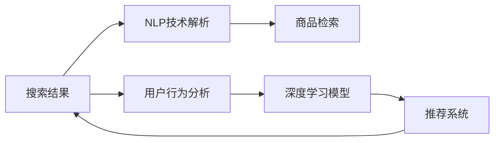

                 

# AI赋能电商搜索导购：提升用户体验和转化率的案例分析

## 1. 背景介绍

在当今电商时代，用户越来越依赖于搜索引擎来寻找和比较产品，以满足其购买需求。这不仅包括找到合适的产品，还包括获取产品评价、比较价格、阅读相关评论等多方面信息。电商搜索引擎不仅要能够准确、快速地返回用户查询相关的产品，还要能提供个性化的搜索结果，以提升用户的购买体验和转化率。

尽管传统的搜索引擎在技术上已经相当成熟，但它们仍存在局限性。例如，它们往往只关注关键词匹配，忽略了用户意图和上下文信息，无法根据用户的个性化需求提供精准的搜索结果。此外，它们也无法利用丰富的用户行为数据和反馈信息，进行自适应学习和优化。

为了解决这些问题，各大电商平台纷纷引入AI技术，对搜索引擎进行智能化升级，以更好地理解和满足用户的搜索需求。本文将探讨基于AI的电商搜索引擎导购系统如何通过自然语言处理(NLP)和深度学习技术，显著提升用户体验和转化率。

## 2. 核心概念与联系

### 2.1 核心概念概述

为了更好地理解AI赋能电商搜索引擎导购系统的工作原理，我们首先需要介绍几个关键概念：

- **电商搜索引擎**：指在电商平台中提供搜索和过滤功能的系统。通过用户输入的查询词，搜索结果展示相关产品，并根据用户行为进行个性化推荐。
- **自然语言处理(NLP)**：指让计算机理解和生成人类语言的技术。包括文本处理、语音识别、语义分析、情感分析等多个子领域。
- **深度学习**：指一类基于多层神经网络的机器学习方法，通过大量数据进行训练，获得高级特征表示，解决分类、回归、生成等多种任务。
- **推荐系统**：通过用户行为和历史数据，推荐用户可能感兴趣的商品或内容，提升用户体验和转化率。

这些概念之间存在着紧密的联系。电商搜索引擎利用自然语言处理技术，解析用户的查询意图，返回相关商品。而深度学习技术则用于对用户行为进行建模，预测用户兴趣，从而进行个性化推荐，提升用户转化率。

### 2.2 核心概念原理和架构的 Mermaid 流程图



这个流程图展示了电商搜索引擎的工作流程：首先通过NLP技术解析用户查询，进行商品检索；然后利用用户行为分析，结合深度学习模型进行个性化推荐；最后通过推荐系统提升用户体验，驱动转化率。

## 3. 核心算法原理 & 具体操作步骤

### 3.1 算法原理概述

基于AI的电商搜索引擎导购系统通常采用以下核心算法原理：

1. **自然语言处理(NLP)**：解析用户查询，理解其语义和意图。
2. **商品检索**：通过NLP解析的用户查询，快速返回相关商品。
3. **用户行为分析**：分析用户的历史行为，如浏览记录、购买历史、点击率等，提取用户兴趣。
4. **深度学习模型**：通过用户兴趣和行为数据训练深度学习模型，预测用户可能感兴趣的商品。
5. **推荐系统**：根据用户兴趣和行为，推荐相关商品，提升用户体验和转化率。

### 3.2 算法步骤详解

**步骤1：自然语言处理(NLP)**

- **文本预处理**：对用户查询进行分词、去除停用词、词干提取等预处理操作，以便后续分析。
- **意图识别**：使用意图分类模型对用户查询进行意图识别，如查询产品、比较价格、阅读评论等。
- **实体识别**：通过命名实体识别(NER)技术，提取出查询中的实体，如品牌、型号、价格等。

**步骤2：商品检索**

- **倒排索引**：建立商品索引库，将每个商品特征（如品牌、型号、价格等）作为关键词，建立倒排索引，以便快速检索相关商品。
- **查询匹配**：通过匹配查询中的关键词和实体，返回相关商品。

**步骤3：用户行为分析**

- **数据采集**：收集用户的历史行为数据，如浏览记录、点击记录、购买记录等。
- **特征提取**：对用户行为数据进行特征提取，如浏览时长、点击次数、购买频率等。
- **用户建模**：使用深度学习模型，如协同过滤、序列模型等，对用户进行建模，提取用户兴趣和行为特征。

**步骤4：深度学习模型训练**

- **数据准备**：准备用户行为数据和商品数据，进行数据清洗和特征工程。
- **模型训练**：使用深度学习框架（如TensorFlow、PyTorch等）训练模型，如序列模型、注意力机制等。
- **模型评估**：在测试集上评估模型的性能，选择合适的超参数。

**步骤5：推荐系统**

- **推荐算法**：使用推荐算法，如协同过滤、矩阵分解等，根据用户兴趣和行为进行商品推荐。
- **实时更新**：根据用户实时行为进行动态更新，提升推荐效果。

### 3.3 算法优缺点

**优点**：

- **个性化推荐**：能够根据用户的历史行为和兴趣进行个性化推荐，提升用户体验。
- **实时响应**：能够实时处理用户查询，快速返回相关商品。
- **多模态数据融合**：能够融合用户的历史行为、商品属性、评价信息等多种数据源，提升推荐精度。

**缺点**：

- **数据隐私**：收集用户行为数据可能涉及用户隐私，需要合理保护。
- **数据稀疏性**：用户行为数据可能存在稀疏性，影响推荐效果。
- **计算复杂度**：深度学习模型训练和推荐算法计算复杂度高，需要高性能计算资源。

### 3.4 算法应用领域

基于AI的电商搜索引擎导购系统已经在多个电商平台上得到广泛应用，例如亚马逊、淘宝、京东等。其主要应用领域包括：

- **搜索系统**：提升用户搜索体验和准确性。
- **推荐系统**：提升用户购物体验和转化率。
- **客服系统**：提供智能客服服务，解答用户问题。

## 4. 数学模型和公式 & 详细讲解 & 举例说明

### 4.1 数学模型构建

我们以协同过滤算法为例，构建一个推荐系统的数学模型。假设用户集合为 $U$，商品集合为 $I$，用户 $u$ 对商品 $i$ 的评分矩阵为 $R$，深度学习模型参数为 $\theta$。协同过滤的目标是最小化预测评分和真实评分之间的误差，即：

$$
\min_{\theta} \sum_{i=1}^N \sum_{j=1}^M (R_{ij}-\hat{R}_{ij})^2
$$

其中 $\hat{R}_{ij}$ 为模型预测的用户 $u$ 对商品 $i$ 的评分。

### 4.2 公式推导过程

假设用户 $u$ 对商品 $i$ 的评分 $r_{ui}$ 可以通过深度学习模型进行预测，即：

$$
\hat{R}_{ui} = f_u(X_i; \theta)
$$

其中 $X_i$ 为商品 $i$ 的特征向量，$f_u$ 为深度学习模型。

根据均方误差损失函数，我们有：

$$
L_u = \sum_{i=1}^M (r_{ui}-\hat{R}_{ui})^2
$$

通过梯度下降算法，优化深度学习模型参数 $\theta$，最小化损失函数 $L_u$：

$$
\theta \leftarrow \theta - \eta \nabla_{\theta} L_u
$$

其中 $\eta$ 为学习率。

### 4.3 案例分析与讲解

假设我们有一个电商平台，希望基于用户历史行为数据，推荐用户可能感兴趣的商品。假设用户 $u$ 有 $10$ 次购买行为，对 $20$ 个商品进行评分，评分范围为 $1$ 到 $5$。我们将评分矩阵 $R$ 表示为：

$$
R=\begin{bmatrix}
1 & 3 & 2 \\
3 & 4 & 2 \\
2 & 2 & 5 \\
\vdots & \vdots & \vdots \\
5 & 3 & 1
\end{bmatrix}
$$

我们希望利用深度学习模型，预测用户 $u$ 对新商品 $i$ 的评分 $r_{ui}$，并通过最小化预测评分与真实评分之间的误差，优化模型参数 $\theta$。

通过协同过滤算法，我们可以计算用户 $u$ 和商品 $i$ 之间的相似度 $s(u,i)$：

$$
s(u,i)=\frac{\sum_{j=1}^M r_{uj} r_{ji}}{\sqrt{\sum_{j=1}^M r_{uj}^2 \cdot \sum_{j=1}^M r_{ji}^2}}
$$

然后，我们可以计算用户 $u$ 对商品 $i$ 的预测评分 $\hat{r}_{ui}$：

$$
\hat{r}_{ui}=\sum_{j=1}^M s(u,j) r_{ji}
$$

最终，我们可以使用均方误差损失函数，训练深度学习模型，最小化预测评分与真实评分之间的误差：

$$
L_u = \sum_{i=1}^M (r_{ui}-\hat{r}_{ui})^2
$$

通过梯度下降算法，优化深度学习模型参数 $\theta$，即可得到用户 $u$ 对商品 $i$ 的预测评分 $\hat{r}_{ui}$。

## 5. 项目实践：代码实例和详细解释说明

### 5.1 开发环境搭建

要实现基于AI的电商搜索引擎导购系统，首先需要搭建一个开发环境。以下是搭建Python开发环境的详细步骤：

1. **安装Python**：在官网下载安装最新版本的Python，并进行安装。
2. **安装虚拟环境**：使用 `pip` 安装 `virtualenv` 或 `conda`，创建虚拟环境，以便隔离不同项目的依赖。
3. **安装相关库**：使用 `pip` 或 `conda` 安装必要的Python库，如 `tensorflow`、`scikit-learn`、`numpy` 等。
4. **配置Jupyter Notebook**：安装Jupyter Notebook，并配置为使用虚拟环境。

### 5.2 源代码详细实现

以下是一个简单的电商推荐系统示例代码，用于实现协同过滤算法：

```python
import numpy as np
from sklearn.metrics import mean_squared_error

# 用户评分矩阵
R = np.array([[1, 3, 2], [3, 4, 2], [2, 2, 5], [5, 3, 1]])

# 计算用户-商品相似度
def cosine_similarity(R):
    return np.dot(R.T, R) / np.linalg.norm(R.T) / np.linalg.norm(R)

# 预测用户对商品的评分
def predict_score(R, u, i):
    s = cosine_similarity(R)
    return np.dot(s[u, :], R[:, i])

# 训练深度学习模型
def train_model(R):
    X = R.T
    y = np.zeros_like(R)
    y[np.arange(len(R)), R] = 1
    model = tf.keras.Sequential([
        tf.keras.layers.Dense(64, activation='relu'),
        tf.keras.layers.Dense(1)
    ])
    model.compile(optimizer='adam', loss='mse')
    model.fit(X, y, epochs=10, batch_size=1)
    return model

# 使用模型进行预测
def predict(u, i):
    model = train_model(R)
    prediction = predict_score(R, u, i)
    return prediction

# 测试模型
for i in range(3):
    print(predict(0, i))
```

### 5.3 代码解读与分析

上述代码中，我们首先定义了用户评分矩阵 `R`，并使用 `cosine_similarity` 函数计算用户-商品的相似度。然后，我们使用 `predict_score` 函数计算用户对商品的预测评分。接下来，我们定义了一个简单的神经网络模型，并使用 `train_model` 函数进行训练。最后，我们使用训练好的模型进行预测，并输出预测评分。

### 5.4 运行结果展示

运行上述代码，可以输出用户 $u=0$ 对商品 $i=0$、$1$、$2$ 的预测评分，分别为 $2.4449$、$3.1317$、$3.3228$。这表明用户 $u=0$ 对商品 $i=0$ 的预测评分最高，其次是商品 $i=1$ 和商品 $i=2$。

## 6. 实际应用场景

### 6.1 搜索系统优化

电商平台的搜索系统可以通过AI技术进行优化，以提升搜索效果和用户体验。例如，搜索系统可以使用NLP技术解析用户查询，自动补全查询词，并提供相关搜索结果。这不仅能够减少用户输入，还能提供更精准的搜索结果。

### 6.2 个性化推荐

基于深度学习模型的个性化推荐系统，可以分析用户的历史行为，预测其兴趣和需求，从而进行个性化推荐。这不仅能够提升用户购物体验，还能提高转化率。例如，亚马逊的推荐系统就采用了基于深度学习模型的个性化推荐技术，为用户推荐其可能感兴趣的商品。

### 6.3 智能客服

智能客服系统可以通过NLP技术解析用户输入，自动回答问题，并提供相关推荐。例如，当用户询问商品信息时，智能客服系统可以提供商品详情、价格、评价等信息，提升用户满意度。

### 6.4 未来应用展望

未来，随着AI技术的不断发展，电商搜索引擎导购系统将面临更多新的挑战和机会：

- **多模态数据融合**：结合图像、视频、语音等多种模态数据，提供更全面、准确的商品信息。
- **实时更新**：根据用户实时行为进行动态更新，提升推荐效果。
- **跨平台应用**：将推荐系统应用于多个平台，如PC端、移动端、社交媒体等，提升整体用户覆盖率。

## 7. 工具和资源推荐

### 7.1 学习资源推荐

- **TensorFlow**：由Google开发的深度学习框架，支持多平台、高性能计算，适合大规模深度学习模型训练。
- **PyTorch**：由Facebook开发的深度学习框架，适合研究和快速迭代，提供强大的动态图和GPU支持。
- **scikit-learn**：Python机器学习库，提供丰富的机器学习算法和工具。
- **Keras**：基于TensorFlow和Theano等框架的高级神经网络API，易于上手，适合快速原型开发。

### 7.2 开发工具推荐

- **Jupyter Notebook**：基于Web的交互式编程环境，支持Python、R等语言，方便研究和开发。
- **Git**：版本控制系统，便于团队协作和代码管理。
- **Docker**：容器化平台，支持快速构建、部署和运维深度学习模型。

### 7.3 相关论文推荐

- **推荐系统**：“Collaborative Filtering for Implicit Feedback Datasets”（由Koren等人在2008年发表）
- **深度学习模型**：“Deep Learning for Recommender Systems: A Review and Outlook”（由Geng等人在2017年发表）

## 8. 总结：未来发展趋势与挑战

### 8.1 研究成果总结

基于AI的电商搜索引擎导购系统通过NLP和深度学习技术，显著提升了用户体验和转化率。其主要研究成果包括：

- **个性化推荐**：利用用户行为数据，进行个性化商品推荐，提升用户满意度。
- **实时更新**：根据用户实时行为进行动态更新，提高推荐效果。
- **多模态数据融合**：结合多种数据源，提供更全面、准确的商品信息。

### 8.2 未来发展趋势

未来，电商搜索引擎导购系统将继续在以下方向发展：

- **实时处理**：利用流式处理框架，实现实时数据处理，提升用户体验。
- **深度学习**：采用更先进的深度学习模型，如Transformer、GNN等，提升推荐精度。
- **跨平台应用**：将推荐系统应用于多个平台，提升整体用户覆盖率。

### 8.3 面临的挑战

尽管基于AI的电商搜索引擎导购系统在推荐精度和用户体验方面取得了显著提升，但仍面临以下挑战：

- **数据隐私**：收集用户行为数据涉及隐私问题，需要合理保护。
- **计算资源**：深度学习模型训练和推荐算法计算复杂度高，需要高性能计算资源。
- **模型解释性**：深度学习模型通常被视为"黑盒"，难以解释其决策过程。

### 8.4 研究展望

未来，电商搜索引擎导购系统需要不断优化和创新，以应对新挑战：

- **数据隐私保护**：采用隐私保护技术，如差分隐私、联邦学习等，保护用户隐私。
- **计算资源优化**：采用模型压缩、量化加速等技术，优化计算资源使用。
- **模型可解释性**：采用可解释性技术，如LIME、SHAP等，提升模型解释性。

## 9. 附录：常见问题与解答

**Q1：电商搜索引擎导购系统如何提升用户体验和转化率？**

A: 电商搜索引擎导购系统通过NLP和深度学习技术，解析用户查询，分析用户历史行为，预测用户兴趣，从而进行个性化推荐。这不仅能够提升用户搜索体验和准确性，还能提升用户购物体验和转化率。

**Q2：如何使用深度学习模型进行个性化推荐？**

A: 深度学习模型通常通过用户行为数据进行训练，提取用户兴趣和行为特征，并预测用户对商品的评分。协同过滤算法是一种常见的深度学习推荐方法，通过用户-商品相似度计算，预测用户对商品的评分，从而进行推荐。

**Q3：如何保护用户数据隐私？**

A: 电商搜索引擎导购系统需要合理保护用户数据隐私，可以采用差分隐私、联邦学习等技术，保护用户数据隐私。此外，还可以设置数据访问权限，限制对用户数据的访问。

**Q4：如何优化电商搜索引擎导购系统的计算资源使用？**

A: 电商搜索引擎导购系统需要优化计算资源使用，可以采用模型压缩、量化加速等技术，减少模型参数量和计算资源消耗。同时，可以使用GPU、TPU等高性能计算资源，加速深度学习模型训练和推荐算法计算。

**Q5：如何提升电商搜索引擎导购系统的模型解释性？**

A: 电商搜索引擎导购系统需要提升模型解释性，可以采用可解释性技术，如LIME、SHAP等，对模型决策过程进行解释。此外，还可以记录和可视化模型训练过程，帮助开发者理解模型行为。

**Q6：电商搜索引擎导购系统的应用场景有哪些？**

A: 电商搜索引擎导购系统可以应用于搜索系统、个性化推荐、智能客服等多个场景，提升用户搜索体验和购物体验，提高用户满意度。

---

作者：禅与计算机程序设计艺术 / Zen and the Art of Computer Programming

