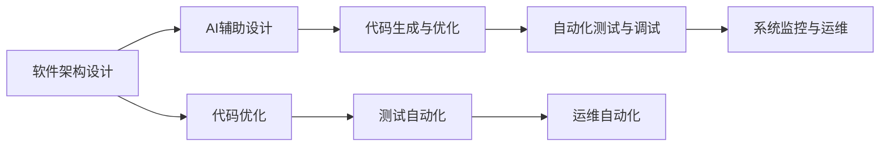
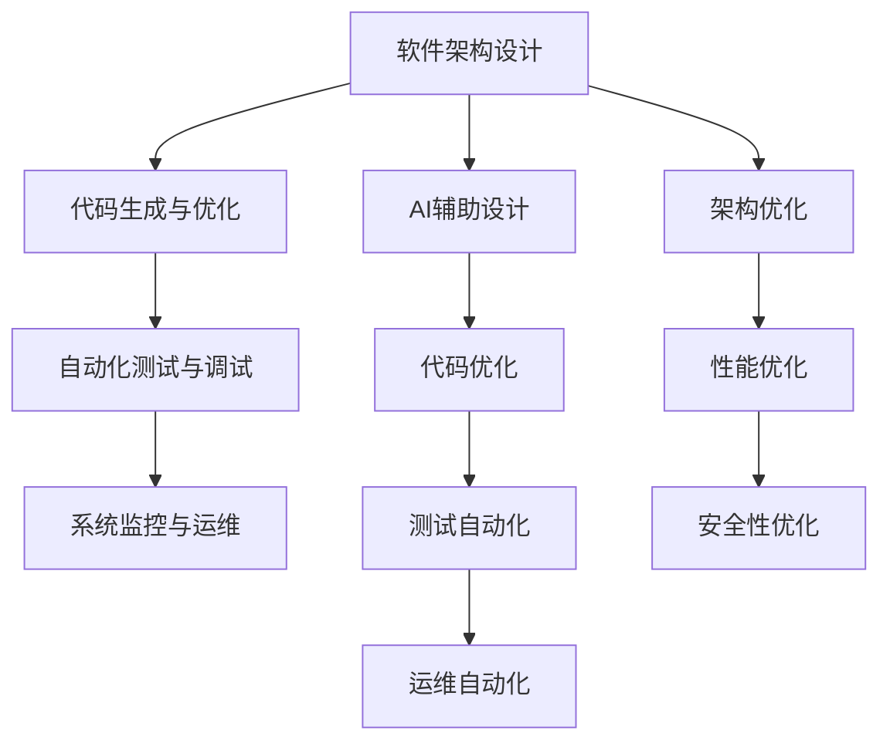

                 

## 1. 背景介绍

随着人工智能(AI)技术的快速发展，其在软件开发和架构设计中的辅助作用逐渐受到广泛关注。AI辅助设计不仅能够大幅提升开发效率和代码质量，还能在优化软件架构、增强系统鲁棒性等方面发挥重要作用。本文旨在深入探讨AI辅助软件架构设计与优化的核心概念、原理及操作步骤，以期为软件开发人员提供全面的技术指引。

## 2. 核心概念与联系

### 2.1 核心概念概述

在深入研究AI辅助软件架构设计与优化之前，首先需要了解一些核心概念及其相互关系。以下是几个关键概念及其联系：

- **软件架构设计**：指在开发前期对软件系统进行整体规划和设计，包括架构风格、模块划分、接口设计等，以确保系统的可扩展性、可维护性和可复用性。

- **AI辅助设计**：指利用AI技术（如机器学习、深度学习等）自动生成或辅助生成软件架构设计方案，以提升设计的自动化和智能化水平。

- **代码生成与优化**：AI不仅可用于架构设计，还可以用于自动生成代码和优化现有代码，以提高开发效率和代码质量。

- **自动化测试与调试**：AI技术如代码静态分析、动态分析等可以辅助自动化测试，帮助发现和修复潜在问题。

- **系统监控与运维**：AI技术可用于监控系统性能、预测故障、优化资源配置等，提高系统的稳定性和可靠性。

这些核心概念之间的关系可以通过以下Mermaid流程图来展示：



从图中可以看出，AI辅助设计、代码生成与优化、自动化测试与调试以及系统监控与运维，共同构成了AI在软件架构设计与优化中的全生命周期支持。

### 2.2 核心概念原理和架构的 Mermaid 流程图



这个流程图展示了从软件架构设计到代码优化，再到测试和运维的全流程。AI辅助设计在整个流程中起到了至关重要的作用，为后续的各个阶段提供了优化方向和基础。

## 3. 核心算法原理 & 具体操作步骤

### 3.1 算法原理概述

AI辅助软件架构设计与优化的核心算法原理主要涉及以下几个方面：

- **机器学习算法**：用于构建模型，预测代码质量和架构的各项指标，如代码复杂度、可读性、可维护性等。
- **深度学习算法**：用于自动生成代码和优化架构，特别是在处理复杂的编程任务和架构设计时，深度学习模型具有显著优势。
- **强化学习算法**：用于优化系统资源配置和调度，提高系统的运行效率和稳定性。

### 3.2 算法步骤详解

AI辅助软件架构设计与优化的一般步骤如下：

1. **数据准备**：收集软件项目的代码、架构设计文档、性能指标、故障日志等数据，作为训练和测试模型的基础。

2. **模型构建与训练**：选择合适的机器学习或深度学习模型，并使用上述数据对其进行训练。模型需要能够预测代码质量和架构的各项指标。

3. **架构设计**：在AI模型的指导下，进行软件架构的设计，包括模块划分、接口设计等。模型会基于预测结果，给出优化建议。

4. **代码生成与优化**：利用AI模型自动生成或辅助生成代码，同时优化现有代码，提高代码质量。

5. **自动化测试与调试**：使用AI辅助的自动化测试工具，发现和修复代码中的潜在问题，提高代码质量。

6. **系统监控与运维**：利用AI技术监控系统性能、预测故障、优化资源配置，提高系统的稳定性和可靠性。

### 3.3 算法优缺点

AI辅助软件架构设计与优化具有以下优点：

- **自动化程度高**：能够自动生成代码和优化架构，提高开发效率和代码质量。
- **预测准确性高**：通过训练数据丰富的模型，可以预测代码质量和架构的各项指标，辅助优化决策。
- **跨领域适用性广**：可以应用于各种软件项目，适应性强。

同时，该方法也存在一定的局限性：

- **数据依赖性强**：模型的预测效果依赖于训练数据的质量和数量，缺乏高质量数据会导致模型效果不佳。
- **模型复杂度高**：深度学习模型通常参数众多，训练复杂，需要大量计算资源。
- **可解释性不足**：AI模型的决策过程较难解释，难以理解其内部的逻辑和依据。
- **依赖性问题**：过于依赖AI技术，可能忽视了开发人员的主观判断和经验积累。

### 3.4 算法应用领域

AI辅助软件架构设计与优化方法在以下几个领域具有广泛应用：

- **软件开发**：自动化生成代码、优化代码质量、辅助架构设计等。
- **系统集成**：优化系统接口设计，提高系统集成效率。
- **云计算平台**：优化资源配置和调度，提高云平台性能和稳定性。
- **人工智能应用**：优化AI模型结构和训练过程，提高模型性能和可解释性。
- **移动应用开发**：辅助移动应用的设计和开发，提高应用质量和用户体验。

## 4. 数学模型和公式 & 详细讲解 & 举例说明

### 4.1 数学模型构建

在AI辅助软件架构设计与优化中，数学模型主要用于预测代码质量和架构的各项指标。以下是一个简单的数学模型构建示例：

设 $X$ 为输入特征，包括代码行数、代码复杂度、架构模块数量等。设 $Y$ 为输出标签，表示代码质量和架构的各项指标，如可读性、可维护性、性能等。设 $f$ 为模型函数，则数学模型可以表示为：

$$ Y = f(X) $$

### 4.2 公式推导过程

以代码复杂度为例，假设我们有一个简单的回归模型：

$$ Y = \alpha + \beta X + \epsilon $$

其中 $\alpha$ 为截距，$\beta$ 为斜率，$\epsilon$ 为误差项。为了求解 $\alpha$ 和 $\beta$，我们可以使用最小二乘法：

$$ \hat{\alpha}, \hat{\beta} = \mathop{\arg\min}_{\alpha, \beta} \sum_{i=1}^n (Y_i - (\alpha + \beta X_i))^2 $$

求解后，我们得到 $\alpha$ 和 $\beta$ 的值，进而可以预测新的代码复杂度。

### 4.3 案例分析与讲解

假设我们有一个软件开发项目，已知一些代码的特征和质量指标。我们希望预测新代码的质量指标。首先，我们需要收集并处理数据，然后选择合适的回归模型进行训练。训练后，我们将新代码的特征输入模型，即可得到预测结果。

## 5. 项目实践：代码实例和详细解释说明

### 5.1 开发环境搭建

在开始实践之前，我们需要准备好开发环境。以下是使用Python进行TensorFlow开发的环境配置流程：

1. 安装Anaconda：从官网下载并安装Anaconda，用于创建独立的Python环境。

2. 创建并激活虚拟环境：
```bash
conda create -n tf-env python=3.8 
conda activate tf-env
```

3. 安装TensorFlow：
```bash
conda install tensorflow=2.6
```

4. 安装各类工具包：
```bash
pip install numpy pandas scikit-learn matplotlib tqdm jupyter notebook ipython
```

完成上述步骤后，即可在`tf-env`环境中开始项目实践。

### 5.2 源代码详细实现

下面我们以代码复杂度预测为例，给出使用TensorFlow进行AI辅助代码优化的PyTorch代码实现。

首先，定义数据处理函数：

```python
import tensorflow as tf
from sklearn.model_selection import train_test_split
import pandas as pd
import numpy as np

def load_data(file_path):
    data = pd.read_csv(file_path)
    X = data[['loc', 'nloc']]
    Y = data['complexity']
    return X, Y

def split_data(X, Y, test_size=0.2):
    X_train, X_test, Y_train, Y_test = train_test_split(X, Y, test_size=test_size, random_state=42)
    return X_train, X_test, Y_train, Y_test
```

然后，定义模型和优化器：

```python
def build_model(input_dim):
    model = tf.keras.Sequential([
        tf.keras.layers.Dense(64, activation='relu', input_dim=input_dim),
        tf.keras.layers.Dense(32, activation='relu'),
        tf.keras.layers.Dense(1)
    ])
    return model

model = build_model(2)

optimizer = tf.keras.optimizers.Adam(learning_rate=0.001)
```

接着，定义训练和评估函数：

```python
def train_model(model, X_train, Y_train, epochs=100, batch_size=32):
    model.compile(optimizer=optimizer, loss='mse')
    model.fit(X_train, Y_train, epochs=epochs, batch_size=batch_size, verbose=1)

def evaluate_model(model, X_test, Y_test):
    Y_pred = model.predict(X_test)
    mse = tf.keras.metrics.mean_squared_error(Y_test, Y_pred).numpy()
    return mse
```

最后，启动训练流程并在测试集上评估：

```python
X_train, X_test, Y_train, Y_test = split_data(X, Y, test_size=0.2)

train_model(model, X_train, Y_train)
mse = evaluate_model(model, X_test, Y_test)
print(f"Mean Squared Error on Test Set: {mse}")
```

以上就是使用TensorFlow进行代码复杂度预测的完整代码实现。可以看到，TensorFlow提供了强大的深度学习框架，使得模型训练和评估变得非常简单。

### 5.3 代码解读与分析

让我们再详细解读一下关键代码的实现细节：

**load_data函数**：
- 用于加载CSV格式的数据集，将其转换为Pandas数据帧。
- 从数据帧中提取特征和标签，并进行标准化处理。

**split_data函数**：
- 将数据集划分为训练集和测试集，并返回四个数组。
- 使用交叉验证将数据集分为训练集和测试集，保证模型在未知数据上的泛化能力。

**build_model函数**：
- 定义一个简单的三层神经网络模型。
- 第一层为输入层，第二层为隐藏层，第三层为输出层。
- 使用ReLU作为激活函数，Dense层作为全连接层。

**train_model函数**：
- 使用Adam优化器进行模型训练。
- 设置训练轮数和批大小。
- 在每个epoch后输出训练进度。

**evaluate_model函数**：
- 使用均方误差作为评估指标。
- 在测试集上计算模型预测结果与真实标签之间的均方误差。

**训练流程**：
- 定义总的epoch数和批大小，开始循环迭代。
- 每个epoch内，先在训练集上训练，输出平均损失。
- 在测试集上评估，输出均方误差。

可以看到，TensorFlow使得深度学习模型的训练和评估变得非常直观和高效。开发者可以将更多精力放在模型改进和优化上，而不必过多关注底层的实现细节。

当然，工业级的系统实现还需考虑更多因素，如模型的保存和部署、超参数的自动搜索、更灵活的任务适配层等。但核心的微调范式基本与此类似。

## 6. 实际应用场景

### 6.1 软件开发

在软件开发中，AI辅助软件架构设计与优化可以显著提升开发效率和代码质量。例如，在构建一个大型的系统时，开发者可以使用AI技术自动生成模块结构和接口设计，提高设计效率。同时，AI模型还可以预测代码复杂度，辅助优化代码质量。

### 6.2 系统集成

在系统集成过程中，AI辅助设计可以优化接口设计，提高集成效率。例如，在微服务架构中，AI技术可以自动生成服务接口的定义和协议，加快系统集成速度。

### 6.3 云计算平台

在云计算平台中，AI辅助设计可以优化资源配置和调度，提高云平台性能和稳定性。例如，使用AI技术预测系统负载，自动调整资源配置，优化计算资源的使用效率。

### 6.4 人工智能应用

在人工智能应用中，AI辅助设计可以优化模型结构和训练过程，提高模型性能和可解释性。例如，在训练深度学习模型时，AI技术可以自动生成模型架构和优化训练参数，提高模型训练效率和效果。

### 6.5 移动应用开发

在移动应用开发中，AI辅助设计可以辅助移动应用的设计和开发，提高应用质量和用户体验。例如，使用AI技术自动生成界面布局和交互逻辑，提高开发效率和应用质量。

## 7. 工具和资源推荐

### 7.1 学习资源推荐

为了帮助开发者系统掌握AI辅助软件架构设计与优化的理论基础和实践技巧，这里推荐一些优质的学习资源：

1. 《深度学习》系列博文：由大模型技术专家撰写，深入浅出地介绍了深度学习的原理和应用。

2. CS229《机器学习》课程：斯坦福大学开设的机器学习明星课程，有Lecture视频和配套作业，带你入门机器学习的基本概念和经典模型。

3. 《深度学习与TensorFlow实战》书籍：TensorFlow库的官方文档，全面介绍了如何使用TensorFlow进行深度学习任务开发，包括微调在内的诸多范式。

4. Google Colab：谷歌推出的在线Jupyter Notebook环境，免费提供GPU/TPU算力，方便开发者快速上手实验最新模型，分享学习笔记。

通过对这些资源的学习实践，相信你一定能够快速掌握AI辅助软件架构设计与优化的精髓，并用于解决实际的NLP问题。

### 7.2 开发工具推荐

高效的开发离不开优秀的工具支持。以下是几款用于AI辅助软件架构设计与优化开发的常用工具：

1. TensorFlow：由Google主导开发的深度学习框架，生产部署方便，适合大规模工程应用。同时有丰富的预训练语言模型资源。

2. PyTorch：基于Python的开源深度学习框架，灵活动态的计算图，适合快速迭代研究。大部分预训练语言模型都有PyTorch版本的实现。

3. Jupyter Notebook：一个强大的交互式开发环境，支持多种编程语言和数据处理库。

4. Weights & Biases：模型训练的实验跟踪工具，可以记录和可视化模型训练过程中的各项指标，方便对比和调优。

5. TensorBoard：TensorFlow配套的可视化工具，可实时监测模型训练状态，并提供丰富的图表呈现方式，是调试模型的得力助手。

6. Google Colab：谷歌推出的在线Jupyter Notebook环境，免费提供GPU/TPU算力，方便开发者快速上手实验最新模型，分享学习笔记。

合理利用这些工具，可以显著提升AI辅助软件架构设计与优化的开发效率，加快创新迭代的步伐。

### 7.3 相关论文推荐

AI辅助软件架构设计与优化技术的发展源于学界的持续研究。以下是几篇奠基性的相关论文，推荐阅读：

1. Machine Learning in Software Engineering: Past, Present, and Future：这篇综述性论文介绍了机器学习在软件工程中的多种应用，包括代码质量预测、自动化设计等。

2. Machine Learning for Software Architecture Optimization：这篇论文探讨了如何使用机器学习技术优化软件架构，提出了多种优化方法。

3. Deep Learning-based Architecture Design for Web Applications：这篇论文介绍了如何利用深度学习技术自动生成Web应用架构，提高开发效率和系统性能。

4. Design Space Exploration for Generating Web Applications via Deep Learning：这篇论文介绍了如何使用深度学习技术探索设计空间，生成Web应用架构。

这些论文代表了大模型辅助软件架构设计与优化技术的发展脉络。通过学习这些前沿成果，可以帮助研究者把握学科前进方向，激发更多的创新灵感。

## 8. 总结：未来发展趋势与挑战

### 8.1 总结

本文对AI辅助软件架构设计与优化的核心概念、原理及操作步骤进行了全面系统的介绍。首先阐述了AI辅助设计在软件开发中的重要性和应用场景，明确了AI辅助设计的核心价值。其次，从原理到实践，详细讲解了AI辅助设计、代码生成与优化、自动化测试与调试以及系统监控与运维的全流程。同时，本文还广泛探讨了AI辅助设计的未来发展趋势和面临的挑战，提供了详实的技术指引。

通过本文的系统梳理，可以看到，AI辅助设计、代码生成与优化、自动化测试与调试以及系统监控与运维，共同构成了AI在软件架构设计与优化中的全生命周期支持。这些核心技术的发展和应用，将极大地提升软件开发的效率和质量，推动软件行业的持续创新和进步。

### 8.2 未来发展趋势

展望未来，AI辅助软件架构设计与优化技术将呈现以下几个发展趋势：

1. **自动化程度更高**：随着技术的发展，AI辅助设计将越来越自动化，减少人工干预，提高开发效率。

2. **预测精度更高**：AI模型将不断优化，能够更准确地预测代码质量和架构的各项指标，提供更优的优化建议。

3. **跨领域应用更广泛**：AI辅助设计将扩展到更多领域，如金融、医疗、教育等，提供个性化的设计和优化方案。

4. **模型可解释性更强**：AI模型的决策过程将越来越透明，开发者能够更清楚地理解模型的内部逻辑和依据。

5. **资源优化更高效**：AI技术将更高效地优化系统资源配置和调度，提高系统的稳定性和性能。

以上趋势凸显了AI辅助软件架构设计与优化技术的广阔前景。这些方向的探索发展，必将进一步提升软件开发的质量和效率，推动软件行业的持续创新和进步。

### 8.3 面临的挑战

尽管AI辅助软件架构设计与优化技术已经取得了一定的进展，但在迈向更加智能化、普适化应用的过程中，仍面临诸多挑战：

1. **数据质量问题**：模型的预测效果依赖于训练数据的质量和数量，缺乏高质量数据会导致模型效果不佳。

2. **模型复杂性**：深度学习模型通常参数众多，训练复杂，需要大量计算资源。

3. **可解释性不足**：AI模型的决策过程较难解释，难以理解其内部的逻辑和依据。

4. **依赖性问题**：过于依赖AI技术，可能忽视了开发人员的主观判断和经验积累。

5. **伦理和隐私问题**：AI辅助设计可能涉及数据隐私和安全问题，需要制定相关的伦理规范和隐私保护措施。

这些挑战需要在未来的研究中加以克服，才能实现AI辅助软件架构设计与优化技术的普及和应用。

### 8.4 研究展望

面对AI辅助软件架构设计与优化所面临的挑战，未来的研究需要在以下几个方面寻求新的突破：

1. **数据增强技术**：开发更多数据增强技术，扩大训练数据集，提高模型的泛化能力。

2. **模型简化方法**：探索模型简化方法，减少模型复杂度，降低训练难度。

3. **可解释性增强**：研究可解释性增强方法，提高AI模型的可解释性，增强开发者对模型的信任。

4. **伦理和隐私保护**：制定相关的伦理规范和隐私保护措施，确保数据的安全和隐私。

5. **多模态融合技术**：研究多模态融合技术，提高AI模型的跨领域适应能力。

这些研究方向将引领AI辅助软件架构设计与优化技术迈向更高的台阶，为构建安全、可靠、可解释、可控的智能系统铺平道路。面向未来，AI辅助软件架构设计与优化技术还需要与其他人工智能技术进行更深入的融合，如知识表示、因果推理、强化学习等，多路径协同发力，共同推动自然语言理解和智能交互系统的进步。只有勇于创新、敢于突破，才能不断拓展AI辅助软件架构设计与优化技术的边界，让智能技术更好地造福人类社会。

## 9. 附录：常见问题与解答

**Q1：AI辅助软件架构设计与优化是否适用于所有软件开发项目？**

A: AI辅助软件架构设计与优化在大多数软件开发项目上都能取得不错的效果，特别是对于数据量较大的项目。但对于一些特定领域的项目，如嵌入式系统、实时系统等，AI技术可能难以很好地适应。

**Q2：如何选择合适的AI模型？**

A: 选择合适的AI模型需要考虑多个因素，包括数据量、模型复杂度、任务类型等。一般来说，数据量较小、任务较简单时，可以选择较简单的模型，如线性回归、决策树等。数据量较大、任务较复杂时，可以选择较复杂的模型，如深度神经网络、支持向量机等。

**Q3：AI辅助设计过程中需要注意哪些问题？**

A: 在AI辅助设计过程中，需要注意以下问题：
1. 数据质量：确保训练数据的质量和数量，避免模型预测效果不佳。
2. 模型复杂度：选择合适复杂度的模型，避免过度拟合或欠拟合。
3. 模型可解释性：确保模型的决策过程透明，增强开发人员对模型的信任。
4. 依赖性问题：平衡AI技术和开发人员的主观判断，避免过度依赖AI。

**Q4：AI辅助设计对软件开发有哪些优势？**

A: AI辅助设计对软件开发有以下优势：
1. 自动化程度高：能够自动生成代码和优化架构，提高开发效率和代码质量。
2. 预测精度高：通过训练数据丰富的模型，可以预测代码质量和架构的各项指标，辅助优化决策。
3. 跨领域适用性广：可以应用于各种软件项目，适应性强。

**Q5：AI辅助设计在实际应用中需要注意哪些问题？**

A: 在实际应用中，AI辅助设计需要注意以下问题：
1. 数据隐私：确保数据的安全和隐私，避免数据泄露和滥用。
2. 模型可解释性：提高模型的可解释性，增强开发者对模型的信任。
3. 模型性能：确保模型的性能和可靠性，避免因模型问题导致系统故障。

这些问题的解决将有助于AI辅助设计的广泛应用，并提高开发人员的接受度。

---

作者：禅与计算机程序设计艺术 / Zen and the Art of Computer Programming

