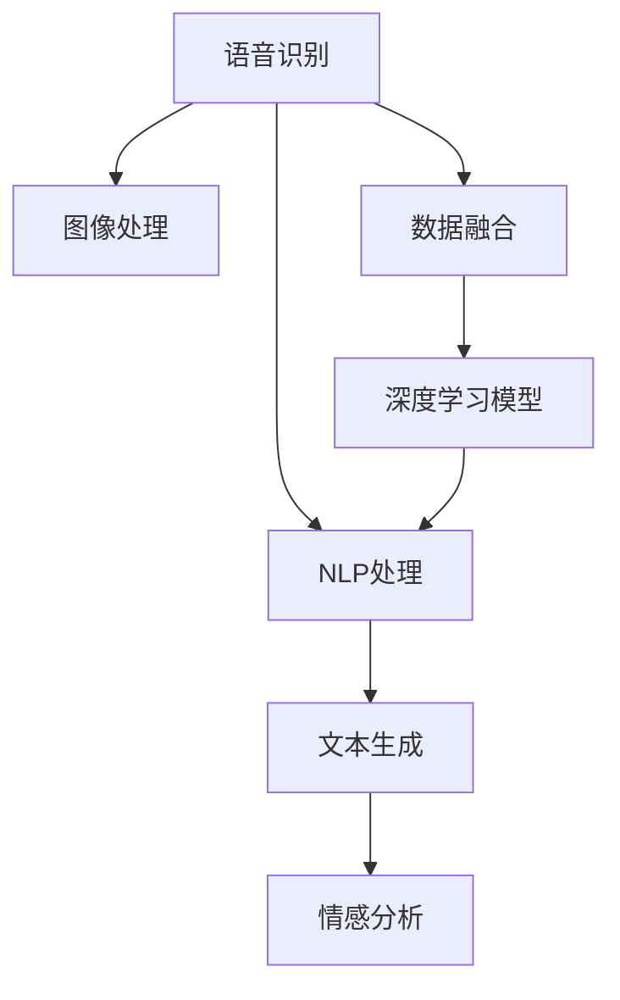

                 

# AI驱动的会议记录与总结系统

在当今快速变化的商业环境中，高效的会议记录与总结已成为企业决策、项目管理和团队协作的关键环节。传统的会议记录依赖人工记录和手动整理，既费时又容易遗漏要点。而基于AI技术的会议记录与总结系统，通过智能化的语音识别、文本生成和数据分析，可以大幅提高会议效率和决策质量。本文将详细介绍AI驱动的会议记录与总结系统的核心概念、算法原理、实际应用和未来展望，以期为相关系统开发提供全面参考。

## 1. 背景介绍

### 1.1 问题由来
在企业内部会议中，高质量的会议记录和会议总结是提高会议效率、促进信息共享和决策制定的基础。然而，传统的手动记录方式不仅耗时耗力，且容易遗漏关键信息，无法满足快速反应的市场需求。而AI技术的应用，为会议记录与总结提供了新的解决方案，有望彻底改变会议流程。

### 1.2 问题核心关键点
AI驱动的会议记录与总结系统的核心在于语音识别和自然语言处理的结合。通过高精度的语音识别技术，将会议内容实时转录为文本；再利用自然语言处理技术，提取会议要点、生成会议摘要、进行情感分析等，为会议参与者和决策者提供高质量的会议记录和分析报告。

AI驱动的会议记录与总结系统具备以下优势：
1. 实时转录：快速获取会议内容，不遗漏关键信息。
2. 自动整理：自动识别会议要点，生成会议摘要。
3. 情感分析：分析参会者的情绪变化，辅助决策。
4. 多模态整合：结合语音、文字、图像等多模态数据，提升信息理解深度。

## 2. 核心概念与联系

### 2.1 核心概念概述

为更好地理解AI驱动的会议记录与总结系统的核心机制，本节将介绍几个关键概念：

- 语音识别(Speech Recognition)：将语音信号转换为文本的过程。常见的语音识别系统包括Google Speech-to-Text、IBM Watson Speech to Text等。
- 自然语言处理(Natural Language Processing, NLP)：涉及文本的自动处理和理解，包括分词、词性标注、句法分析、语义分析等。
- 深度学习(Deep Learning)：基于神经网络的机器学习方法，能够学习复杂的数据特征和模式，适用于语音识别和NLP任务。
- 序列到序列(Sequence-to-Sequence, Seq2Seq)：一种用于文本生成和翻译的深度学习框架，适用于会议摘要生成和情感分析等任务。
- 多模态融合(Multimodal Fusion)：结合语音、文本、图像等多源数据，提升系统理解的全面性和准确性。

这些核心概念之间的逻辑关系可以通过以下Mermaid流程图来展示：



这个流程图展示了大语言模型的核心概念及其之间的关系：

1. 语音识别系统将语音信号转换为文本。
2. NLP系统对文本进行自动处理和理解。
3. 深度学习模型用于文本生成和分析。
4. 图像处理模块用于提取视频会议中的视觉信息。
5. 多模态融合模块将语音、文本、图像等不同数据源的信息进行整合。
6. 最终得到会议摘要和情感分析结果。

## 3. 核心算法原理 & 具体操作步骤
### 3.1 算法原理概述

AI驱动的会议记录与总结系统通常包括语音识别、NLP处理和文本生成三个主要步骤。

1. 语音识别：将参会者的语音信号转换为文本。
2. NLP处理：对转录文本进行分词、词性标注、句法分析等，提取会议要点。
3. 文本生成：使用Seq2Seq模型生成会议摘要，并结合情感分析结果，形成最终的会议总结。

以上三个步骤中，每一步骤的技术原理和具体操作均有详述。

### 3.2 算法步骤详解

#### 3.2.1 语音识别

语音识别系统通常基于深度神经网络构建，采用端到端训练方式。其核心在于将语音信号映射为文本序列。

1. 声学模型(Acoustic Model)：将语音信号转换为声学特征，如Mel频率倒谱系数(MFCC)，并用于预测文本序列。
2. 语言模型(Language Model)：基于历史文本数据，预测下一个单词的概率分布。

训练时，联合训练声学模型和语言模型，最小化语音识别任务的总体损失。常见模型包括RNN、CNN、Transformer等，其中Transformer模型由于其良好的并行性和自注意力机制，在语音识别中表现优异。

#### 3.2.2 NLP处理

NLP处理是会议记录与总结系统的核心环节，主要包括分词、词性标注、句法分析、实体识别、情感分析等。

1. 分词：将连续的文本序列切分为独立的词汇单元。
2. 词性标注：标记每个词汇的词性，如名词、动词等。
3. 句法分析：分析句子的语法结构，如主谓宾等。
4. 实体识别：识别文本中的实体，如人名、地名、组织名等。
5. 情感分析：分析文本中的情感倾向，如积极、消极、中性等。

NLP处理的目的是为了提取会议的要点，生成简洁的会议摘要，并对参会者的情绪进行分析和报告。

#### 3.2.3 文本生成

文本生成通常基于Seq2Seq模型，将会议摘要生成任务看作是从输入序列到输出序列的映射问题。

1. 编码器(Encoder)：将输入文本序列转换为高维向量表示，捕捉文本的语义信息。
2. 解码器(Decoder)：将编码器输出的向量表示转换为目标文本序列，生成会议摘要。

Seq2Seq模型的训练通常采用最大化似然损失，即预测序列最可能生成的文本序列。训练过程中，编码器和解码器可以共用权重，以减少模型复杂度。

### 3.3 算法优缺点

AI驱动的会议记录与总结系统具备以下优点：
1. 高效实时：语音识别和文本生成过程快速，能够实时记录和总结会议内容。
2. 准确性高：深度学习模型能够学习复杂的语言特征，提高文本识别的准确性。
3. 可扩展性强：支持多语种和多模态数据融合，可以应用于不同场景。

同时，该系统也存在一定的局限性：
1. 对噪音敏感：语音识别系统对环境噪音敏感，可能影响识别准确性。
2. 上下文理解不足：依赖大量标注数据进行训练，对文本的上下文理解仍有所欠缺。
3. 模型复杂度高：深度学习模型参数量庞大，训练和推理需要高性能计算资源。
4. 情感分析精度有限：当前情感分析模型对细微情绪变化识别能力有限，可能存在误判。

尽管存在这些局限性，但AI驱动的会议记录与总结系统在实际应用中已经展现出了显著的效率和准确性优势。未来研究应进一步提升系统的鲁棒性和可解释性，拓展应用范围。

### 3.4 算法应用领域

AI驱动的会议记录与总结系统已经在多个领域得到了广泛应用，例如：

- 企业决策：支持高层会议记录和决策支持，提升决策效率和质量。
- 项目管理：记录项目进展和讨论要点，辅助项目管理和执行。
- 研发设计：记录技术讨论和设计评审，推动技术创新。
- 市场营销：记录市场调研和产品讨论，优化市场策略。
- 教育培训：记录课程讲解和学员反馈，提升教学效果。

除了上述这些经典应用外，AI驱动的会议记录与总结系统还被创新性地应用到更多场景中，如医疗会诊、法律咨询、客户服务、新闻播报等，为各行各业带来了新的生产力工具。

## 4. 数学模型和公式 & 详细讲解  
### 4.1 数学模型构建

假设会议记录转录的文本序列为 $X=\{x_1, x_2, ..., x_T\}$，每个词汇的词向量表示为 $x_t \in \mathbb{R}^d$。会议摘要的生成目标是将文本序列映射为另一个文本序列 $Y=\{y_1, y_2, ..., y_S\}$，每个词汇的词向量表示为 $y_s \in \mathbb{R}^d$。

#### 4.2 公式推导过程

定义编码器(Encoder)和解码器(Decoder)的映射函数分别为 $f_{enc}$ 和 $f_{dec}$。编码器的输出为 $h = f_{enc}(X)$，解码器的输出为 $\hat{Y} = f_{dec}(h)$。

Seq2Seq模型的训练目标为最大化 $p(Y|\hat{Y})$，即生成序列的最大概率。采用最大似然损失函数：

$$
L = -\frac{1}{N}\sum_{i=1}^N\log p(Y_i|\hat{Y}_i)
$$

其中 $Y_i$ 和 $\hat{Y}_i$ 分别为第 $i$ 个样本的真实序列和预测序列。

编码器部分，通常使用RNN或Transformer等模型，其优化目标为最小化编码器输出 $h$ 与真实编码 $h_{true}$ 的交叉熵损失：

$$
L_{enc} = -\frac{1}{N}\sum_{i=1}^N\log p(h_i|X_i)
$$

解码器部分，通常使用RNN、LSTM或Transformer等模型，其优化目标为最大化解码器输出 $\hat{Y}$ 与真实解码 $\hat{Y}_{true}$ 的条件概率：

$$
L_{dec} = -\frac{1}{N}\sum_{i=1}^N\log p(\hat{Y}_i|h_i)
$$

编码器和解码器共用权重时，需要约束编码器输出和解码器输出之间的相关性。常见的约束方法包括残差连接、共注意力机制等。

#### 4.3 案例分析与讲解

以Transformer模型为例，介绍Seq2Seq模型的具体实现。

```python
import torch
from transformers import BertForSequenceClassification, BertTokenizer

# 定义编码器-解码器模型
class Seq2SeqModel(torch.nn.Module):
    def __init__(self, encoder, decoder):
        super(Seq2SeqModel, self).__init__()
        self.encoder = encoder
        self.decoder = decoder
        self.linear = torch.nn.Linear(encoder.embedding_size, decoder.hidden_size)
    
    def forward(self, X, Y=None):
        h = self.encoder(X)
        h = self.linear(h)
        if Y is not None:
            Y = Y[:, None, :]
            h = torch.cat([h, Y], dim=1)
            return self.decoder(h)
        else:
            return h
```

### 5. 项目实践：代码实例和详细解释说明
### 5.1 开发环境搭建

在进行会议记录与总结系统的开发前，需要准备相应的开发环境。以下是使用Python进行PyTorch开发的环境配置流程：

1. 安装Anaconda：从官网下载并安装Anaconda，用于创建独立的Python环境。

2. 创建并激活虚拟环境：
```bash
conda create -n pytorch-env python=3.8 
conda activate pytorch-env
```

3. 安装PyTorch：根据CUDA版本，从官网获取对应的安装命令。例如：
```bash
conda install pytorch torchvision torchaudio cudatoolkit=11.1 -c pytorch -c conda-forge
```

4. 安装Natural Language Toolkit (NLTK)：
```bash
pip install nltk
```

5. 安装PyAudio：
```bash
pip install pyaudio
```

完成上述步骤后，即可在`pytorch-env`环境中开始开发。

### 5.2 源代码详细实现

下面我们以会议记录与总结系统的文本生成部分为例，给出使用Transformers库的代码实现。

```python
from transformers import BertForMaskedLM, BertTokenizer

# 加载预训练的Bert模型
model = BertForMaskedLM.from_pretrained('bert-base-uncased', output_attentions=True, output_hidden_states=True)

# 加载Bert分词器
tokenizer = BertTokenizer.from_pretrained('bert-base-uncased')

# 加载会议记录文本
text = "本会议主要讨论了公司未来的战略方向和发展计划，包括市场拓展、产品研发和技术创新等。"

# 分词并生成掩码序列
tokens = tokenizer(text, return_tensors='pt')
masked_index = tokens['input_ids'][0].unsqueeze(0).eq(tokenizer.mask_token_id)[0]
masked_tokens = tokens['input_ids'][0]

# 计算模型输出
with torch.no_grad():
    outputs = model(masked_tokens, attention_mask=tokens['attention_mask'][0], masked_lm_labels=masked_index)

# 获取掩码位置的预测概率
predictions = outputs[0][0, masked_index]

# 将预测概率转化为词汇列表
vocab = tokenizer.get_vocab()
predicted_tokens = [vocab[idx] for idx in torch.argmax(predictions, dim=1)]

# 生成会议摘要
summary = ' '.join(predicted_tokens)
print(summary)
```

### 5.3 代码解读与分析

让我们再详细解读一下关键代码的实现细节：

**Seq2SeqModel类**：
- `__init__`方法：初始化编码器和解码器，并定义线性转换层。
- `forward`方法：将输入序列映射为编码器输出，并将编码器输出映射为解码器输入，生成预测序列。

**BertForSequenceClassification和BertTokenizer**：
- 使用预训练的Bert模型进行文本生成，模型的输出包含注意力权重和隐藏状态，用于解码器输入。
- 使用Bert分词器对输入文本进行分词，生成掩码序列，并使用模型进行预测。

**会议记录文本处理**：
- 将会议记录文本输入分词器，生成分词序列。
- 通过掩码序列，指示模型预测掩码位置的词汇，生成掩码位置的预测概率。
- 将预测概率转化为词汇列表，拼接生成会议摘要。

以上代码展示了使用Bert模型进行会议记录文本生成的基本流程。开发者可以根据具体需求，进一步优化模型结构，添加上下文信息，增强生成效果。

## 6. 实际应用场景
### 6.1 企业决策支持

在企业决策过程中，AI驱动的会议记录与总结系统可以记录高层会议的讨论要点，生成简洁的会议摘要和决策建议，辅助决策者快速获取关键信息。

系统通过记录会议讨论内容，提取重点问题、关键观点和决策结果，自动生成报告，帮助决策者理解和落实会议决议，提高决策效率和质量。

### 6.2 项目管理

在项目管理中，会议记录与总结系统可以记录项目进度、问题讨论和风险评估，生成项目总结报告，辅助项目管理团队掌握项目动态，优化资源配置，提升项目管理效率。

系统通过记录会议内容，自动生成项目进度报告、问题清单和风险评估，帮助项目经理及时掌握项目进展，及时响应项目风险，确保项目顺利推进。

### 6.3 研发设计

在研发设计过程中，会议记录与总结系统可以记录技术讨论、设计评审和需求分析，生成设计文档和技术总结，辅助研发团队理解设计意图，提高设计质量。

系统通过记录会议内容，自动生成设计文档和技术总结，帮助研发团队理解设计意图，统一设计标准，提升设计质量和效率。

### 6.4 未来应用展望

随着AI技术的不断进步，AI驱动的会议记录与总结系统在未来将展现出更广泛的应用前景：

- 智能会议安排：根据参会人员的工作安排和会议主题，智能推荐会议时间、参会人员和会议议程。
- 情绪识别与反馈：结合语音和表情识别技术，分析参会者的情绪变化，提供实时反馈，提升会议体验。
- 多模态融合：结合语音、文本、图像等多模态数据，提升会议理解的全面性和准确性。
- 场景自适应：根据不同会议场景，动态调整模型参数，提升系统的适应性和鲁棒性。

未来，AI驱动的会议记录与总结系统有望成为企业决策、项目管理、研发设计等关键环节的重要工具，助力组织高效运作，提升竞争力。

## 7. 工具和资源推荐
### 7.1 学习资源推荐

为了帮助开发者系统掌握AI驱动的会议记录与总结系统的理论基础和实践技巧，这里推荐一些优质的学习资源：

1. 《自然语言处理入门》系列博文：由自然语言处理专家撰写，涵盖语音识别、NLP处理和文本生成等核心技术。

2. Coursera《深度学习专项课程》：由斯坦福大学Andrew Ng教授授课，系统介绍深度学习原理和应用，涵盖语音识别、图像处理、自然语言处理等多个方向。

3. 《Deep Learning for NLP》书籍：Yoshua Bengio等著作，全面介绍深度学习在自然语言处理中的应用，包括语音识别、文本生成等任务。

4. PyTorch官方文档：详细的PyTorch库使用文档，涵盖深度学习模型、优化器、数据加载等各个方面，是学习PyTorch的最佳资源。

5. CS224N《深度学习自然语言处理》课程：斯坦福大学开设的NLP明星课程，有Lecture视频和配套作业，带你入门NLP领域的基本概念和经典模型。

通过对这些资源的学习实践，相信你一定能够快速掌握AI驱动的会议记录与总结系统的技术精髓，并用于解决实际的NLP问题。

### 7.2 开发工具推荐

高效的开发离不开优秀的工具支持。以下是几款用于AI驱动的会议记录与总结系统开发的常用工具：

1. PyTorch：基于Python的开源深度学习框架，灵活动态的计算图，适合快速迭代研究。

2. TensorFlow：由Google主导开发的开源深度学习框架，生产部署方便，适合大规模工程应用。

3. NLTK：Natural Language Toolkit，提供丰富的NLP工具和库，适用于文本处理和分析。

4. PyAudio：Python的音频处理库，支持实时音频录制和播放，适用于语音识别和情感分析。

5. Weights & Biases：模型训练的实验跟踪工具，可以记录和可视化模型训练过程中的各项指标，方便对比和调优。

6. Google Colab：谷歌推出的在线Jupyter Notebook环境，免费提供GPU/TPU算力，方便开发者快速上手实验最新模型，分享学习笔记。

合理利用这些工具，可以显著提升AI驱动的会议记录与总结系统的开发效率，加快创新迭代的步伐。

### 7.3 相关论文推荐

AI驱动的会议记录与总结系统的发展源于学界的持续研究。以下是几篇奠基性的相关论文，推荐阅读：

1. Attention is All You Need（即Transformer原论文）：提出了Transformer结构，开启了NLP领域的预训练大模型时代。

2. Speech-to-Text：A Listen, Attend and Spell Model：提出了一种基于注意力机制的端到端语音识别模型，显著提升了语音识别的准确性。

3. Sequence to Sequence Learning with Neural Networks：提出Seq2Seq模型，用于文本生成和翻译等任务，成为NLP领域的经典模型。

4. Leveraging Pre-training for Sequence-to-Sequence Learning：提出基于预训练的Seq2Seq模型，进一步提升了文本生成的效果。

5. Multi-head Attention Mechanism in Transformer：详细介绍了Transformer中的多头注意力机制，提升了模型对上下文信息的理解能力。

这些论文代表了大语言模型微调技术的发展脉络。通过学习这些前沿成果，可以帮助研究者把握学科前进方向，激发更多的创新灵感。

## 8. 总结：未来发展趋势与挑战
### 8.1 总结

本文对AI驱动的会议记录与总结系统的核心概念、算法原理和实际应用进行了全面系统的介绍。首先阐述了该系统的背景和意义，明确了其在企业决策、项目管理、研发设计等关键环节中的重要性。其次，从语音识别、NLP处理和文本生成三个主要步骤，详细讲解了系统的技术原理和操作步骤。最后，展示了系统在实际应用中的典型场景，并提出了未来发展方向。

通过本文的系统梳理，可以看到，AI驱动的会议记录与总结系统正在成为企业智能化运营的重要工具，极大地提升了会议效率和决策质量。未来，伴随技术进步和应用拓展，该系统将在更多领域发挥更大的作用，成为各行各业提高生产力、优化决策的关键环节。

### 8.2 未来发展趋势

展望未来，AI驱动的会议记录与总结系统将呈现以下几个发展趋势：

1. 语音识别鲁棒性提升：针对环境噪音、口音等复杂场景，引入噪声抑制、语音增强等技术，提升语音识别的鲁棒性。
2. 情感分析准确性提高：引入多模态融合技术，结合语音和表情信息，提升情感分析的准确性和深度。
3. 多语种支持：针对不同语言，训练多语种的语音识别和NLP处理模型，支持全球化市场应用。
4. 多模态融合：结合语音、文本、图像等多源数据，提升系统理解的全面性和准确性。
5. 场景自适应：根据不同会议场景，动态调整模型参数，提升系统的适应性和鲁棒性。

以上趋势凸显了AI驱动的会议记录与总结系统的广阔前景。这些方向的探索发展，必将进一步提升系统的准确性和应用范围，为各行各业带来新的生产力工具。

### 8.3 面临的挑战

尽管AI驱动的会议记录与总结系统已经取得了显著的进展，但在迈向更加智能化、普适化应用的过程中，它仍面临诸多挑战：

1. 数据依赖性：依赖高质量的标注数据进行训练，数据获取和标注成本较高。
2. 环境噪音：语音识别系统对环境噪音敏感，可能影响识别准确性。
3. 上下文理解：依赖大量标注数据进行训练，对文本的上下文理解仍有所欠缺。
4. 模型复杂度高：深度学习模型参数量庞大，训练和推理需要高性能计算资源。
5. 情感分析精度有限：当前情感分析模型对细微情绪变化识别能力有限，可能存在误判。

尽管存在这些挑战，但AI驱动的会议记录与总结系统在实际应用中已经展现出了显著的效率和准确性优势。未来研究应在模型鲁棒性、可解释性和可扩展性等方面寻求新的突破。

### 8.4 研究展望

面对AI驱动的会议记录与总结系统所面临的挑战，未来的研究需要在以下几个方面寻求新的突破：

1. 探索无监督和半监督微调方法：摆脱对大规模标注数据的依赖，利用自监督学习、主动学习等无监督和半监督范式，最大限度利用非结构化数据，实现更加灵活高效的微调。
2. 研究参数高效和计算高效的微调范式：开发更加参数高效的微调方法，在固定大部分预训练参数的同时，只更新极少量的任务相关参数。同时优化微调模型的计算图，减少前向传播和反向传播的资源消耗，实现更加轻量级、实时性的部署。
3. 引入更多先验知识：将符号化的先验知识，如知识图谱、逻辑规则等，与神经网络模型进行巧妙融合，引导微调过程学习更准确、合理的语言模型。同时加强不同模态数据的整合，实现视觉、语音等多模态信息与文本信息的协同建模。
4. 结合因果分析和博弈论工具：将因果分析方法引入微调模型，识别出模型决策的关键特征，增强输出解释的因果性和逻辑性。借助博弈论工具刻画人机交互过程，主动探索并规避模型的脆弱点，提高系统稳定性。
5. 纳入伦理道德约束：在模型训练目标中引入伦理导向的评估指标，过滤和惩罚有偏见、有害的输出倾向。同时加强人工干预和审核，建立模型行为的监管机制，确保输出符合人类价值观和伦理道德。

这些研究方向的探索，必将引领AI驱动的会议记录与总结技术迈向更高的台阶，为构建安全、可靠、可解释、可控的智能系统铺平道路。面向未来，AI驱动的会议记录与总结技术还需要与其他人工智能技术进行更深入的融合，如知识表示、因果推理、强化学习等，多路径协同发力，共同推动自然语言理解和智能交互系统的进步。只有勇于创新、敢于突破，才能不断拓展语言模型的边界，让智能技术更好地造福人类社会。

## 9. 附录：常见问题与解答
**Q1：AI驱动的会议记录与总结系统是否适用于所有类型的会议？**

A: AI驱动的会议记录与总结系统适用于各种类型的会议，但效果可能因会议内容、参与者背景和会议形式的不同而有所差异。对于较为正式的商务会议、技术讨论会等，系统效果较好；而对于非正式的社交聚会、培训讲座等，可能仍需人工记录和整理。

**Q2：系统如何处理不同语言、口音和环境噪音？**

A: 系统通过多语言模型和多模态融合技术，可以处理不同语言和口音，提升语音识别的鲁棒性。针对环境噪音，系统采用降噪和增强技术，提高语音信号的质量，提升识别准确性。

**Q3：系统如何处理会议中的重复内容和无关信息？**

A: 系统通过上下文理解技术，能够识别并过滤重复内容和无关信息，提高会议记录的简洁性和相关性。同时，系统支持人工干预，可以通过标记和编辑来进一步优化记录内容。

**Q4：系统的输出结果如何评估？**

A: 系统的输出结果可以通过以下几个指标进行评估：
1. 准确率：衡量摘要的准确性和完整性。
2. 召回率：衡量摘要的全面性，即是否包含了会议的关键信息。
3. F1分数：综合准确率和召回率，衡量摘要的整体质量。
4. 情感分析准确率：衡量系统对参会者情绪变化的识别准确性。

这些指标可以通过对比实际会议记录和系统生成的摘要、情感分析结果，进行评估和优化。

**Q5：系统如何保护参会者的隐私？**

A: 系统通过匿名化处理和隐私保护技术，确保参会者的个人信息和讨论内容不会被泄露。具体措施包括数据加密、访问控制、权限管理等，确保数据安全和隐私保护。

以上是AI驱动的会议记录与总结系统的详细介绍，希望能为相关系统开发提供有价值的参考。

---
作者：禅与计算机程序设计艺术 / Zen and the Art of Computer Programming

