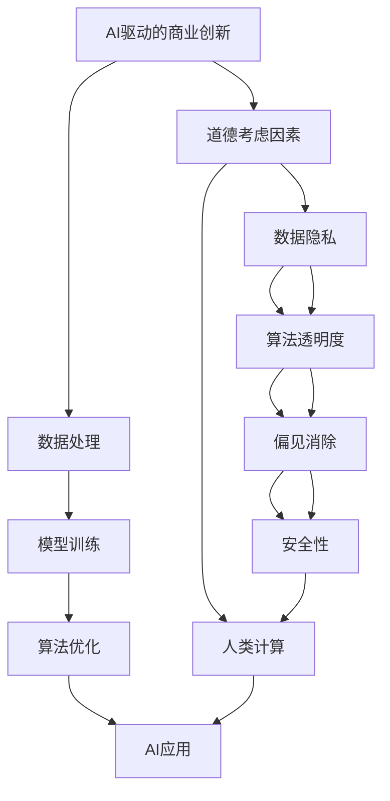

                 

## 1. 背景介绍

随着人工智能技术的迅猛发展，AI驱动的商业创新已经成为推动全球经济增长的重要引擎。然而，在AI技术落地应用的过程中，涉及到的伦理、隐私、公平、安全等道德考虑因素也日益成为社会关注的焦点。文章旨在探讨AI在商业中应用所面临的道德挑战，以及如何平衡创新与发展，确保AI技术的健康可持续发展。

## 2. 核心概念与联系

### 2.1 核心概念概述

- **AI驱动的商业创新**：利用人工智能技术（如机器学习、深度学习、自然语言处理等）推动企业产品、服务、流程的自动化、智能化，提升企业竞争力。
- **道德考虑因素**：在AI商业应用中，涉及到的伦理、隐私、公平、安全等方面的考量，如数据隐私保护、算法透明性、偏见消除、模型安全性等。
- **人类计算**：通过AI技术处理和分析人类劳动的结果，即将人类计算转变为AI计算，以期提高效率和准确性。

### 2.2 核心概念原理和架构的 Mermaid 流程图



这个流程图展示了AI驱动的商业创新与道德考虑因素的联系，其中数据隐私、算法透明度、偏见消除、安全性等因素构成了人类计算的基础，而这些因素共同决定了AI应用的实际效果。

## 3. 核心算法原理 & 具体操作步骤

### 3.1 算法原理概述

AI驱动的商业创新涉及到数据处理、模型训练、算法优化等步骤，其核心算法原理主要包括：

- **数据预处理**：清洗、标准化、归一化、特征工程等。
- **模型训练**：选择合适的模型结构，使用训练数据集进行优化训练。
- **算法优化**：采用正则化、Dropout、梯度裁剪等技术提升模型性能。

### 3.2 算法步骤详解

1. **数据预处理**：
   - 数据清洗：去除噪音、缺失值、重复数据等。
   - 数据标准化：将数据转换为标准正态分布，提高模型的鲁棒性。
   - 特征工程：根据业务需求，设计合适的特征指标，提高模型预测能力。

2. **模型训练**：
   - 选择合适的模型架构，如神经网络、支持向量机等。
   - 设定合适的超参数，如学习率、批次大小、迭代轮数等。
   - 使用优化算法进行模型优化，如随机梯度下降(SGD)、Adam等。

3. **算法优化**：
   - 正则化：防止过拟合，如L2正则、Dropout等。
   - 梯度裁剪：防止梯度爆炸或消失，保证训练稳定性。
   - 超参数搜索：使用网格搜索、随机搜索等方法寻找最优参数组合。

### 3.3 算法优缺点

#### 优点：
- 数据驱动：基于大量数据训练的模型，决策过程更具科学性和客观性。
- 自动化：自动化处理和分析数据，提高工作效率。
- 可扩展性：随着数据和算力的增加，模型性能可不断提升。

#### 缺点：
- 数据依赖：模型性能高度依赖于数据质量，低质量数据可能导致错误决策。
- 黑盒模型：复杂的模型结构难以解释，缺乏透明度。
- 安全风险：模型可能被恶意攻击，存在数据泄露和模型滥用的风险。

### 3.4 算法应用领域

AI驱动的商业创新已经广泛应用于以下领域：

- **零售**：个性化推荐、库存管理、客户服务自动化等。
- **金融**：信用评分、风险评估、欺诈检测等。
- **医疗**：疾病诊断、医疗影像分析、患者管理等。
- **制造**：质量控制、生产调度、设备维护等。

## 4. 数学模型和公式 & 详细讲解 & 举例说明

### 4.1 数学模型构建

AI驱动的商业创新涉及到的数学模型主要包括：

- **回归模型**：如线性回归、逻辑回归等，用于预测数值型变量。
- **分类模型**：如决策树、随机森林、支持向量机等，用于分类问题。
- **聚类模型**：如K-means、层次聚类等，用于数据分组。

### 4.2 公式推导过程

以线性回归模型为例，其公式为：

$$
\hat{y} = \theta_0 + \theta_1x_1 + \theta_2x_2 + \cdots + \theta_nx_n
$$

其中，$\theta$ 为模型参数，$x$ 为输入特征，$\hat{y}$ 为预测输出。

### 4.3 案例分析与讲解

假设有一家电商平台，希望通过AI模型推荐产品，提高用户购买转化率。首先收集用户浏览记录、购买记录等数据，预处理后进行特征工程，设计特征如用户年龄、浏览时间、购买金额等。使用线性回归模型对历史数据进行训练，得到模型参数，再对新用户输入数据进行预测，推荐可能感兴趣的商品。

## 5. 项目实践：代码实例和详细解释说明

### 5.1 开发环境搭建

1. 安装Python：下载并安装Python，确保版本在3.6及以上。
2. 安装必要的库：安装NumPy、Pandas、scikit-learn、TensorFlow等。
3. 创建虚拟环境：使用virtualenv或conda创建虚拟环境，以隔离开发依赖。

### 5.2 源代码详细实现

```python
import pandas as pd
import numpy as np
from sklearn.model_selection import train_test_split
from sklearn.linear_model import LinearRegression

# 加载数据
data = pd.read_csv('data.csv')
X = data[['age', 'time', 'amount']]
y = data['convert']

# 划分训练集和测试集
X_train, X_test, y_train, y_test = train_test_split(X, y, test_size=0.2, random_state=42)

# 构建模型
model = LinearRegression()
model.fit(X_train, y_train)

# 预测并评估
y_pred = model.predict(X_test)
print('模型评估结果：', model.score(X_test, y_test))
```

### 5.3 代码解读与分析

- **数据加载**：使用Pandas库加载数据集，定义输入特征和输出变量。
- **数据划分**：使用train_test_split函数将数据集划分为训练集和测试集。
- **模型训练**：使用LinearRegression模型进行训练，拟合训练数据。
- **模型评估**：使用score函数评估模型在测试集上的表现，打印评估结果。

### 5.4 运行结果展示

通过上述代码，可以得到模型在测试集上的评估结果，如MSE、RMSE、R²等指标，以评估模型的预测性能。

## 6. 实际应用场景

### 6.1 零售业

AI在零售业中的应用包括智能推荐、库存管理、顾客服务自动化等。以智能推荐为例，通过分析用户历史购买数据和行为数据，构建推荐模型，为用户推荐可能感兴趣的商品，提升销售额。

### 6.2 金融行业

在金融领域，AI可以用于信用评分、风险评估、欺诈检测等。通过分析用户信用历史、交易记录等数据，构建分类模型，评估用户信用风险，预测欺诈行为，保护金融机构的安全。

### 6.3 医疗行业

AI在医疗领域的应用包括疾病诊断、医疗影像分析、患者管理等。通过分析医疗影像数据、病历数据等，构建模型，辅助医生进行疾病诊断和治疗决策，提高医疗服务质量。

### 6.4 未来应用展望

随着AI技术的不断进步，未来AI驱动的商业创新将广泛应用于更多领域，如教育、能源、交通等。通过AI技术优化业务流程、提升服务质量、创造新价值，推动经济社会的发展。

## 7. 工具和资源推荐

### 7.1 学习资源推荐

1. **Coursera《机器学习》课程**：由斯坦福大学Andrew Ng教授讲授，系统介绍机器学习的基础理论和应用方法。
2. **Google AI自监督学习论文集**：包含多篇关于自监督学习的论文，为AI商业应用提供理论支持。
3. **DeepLearning.AI《深度学习》课程**：由吴恩达教授讲授，深入浅出地介绍深度学习的基础知识和应用案例。

### 7.2 开发工具推荐

1. **Jupyter Notebook**：支持Python、R等语言，提供交互式编程环境，便于数据分析和模型调试。
2. **TensorFlow**：由Google开发，支持分布式计算，适用于大规模深度学习模型的训练。
3. **PyTorch**：由Facebook开发，支持动态计算图，便于研究和原型开发。

### 7.3 相关论文推荐

1. **《AI伦理：原则与实践》**：探讨AI伦理的基本原则和实践方法，确保AI技术的健康发展。
2. **《公平与透明机器学习》**：研究如何消除算法偏见，提高机器学习的公平性和透明度。
3. **《安全与隐私保护的AI》**：探讨AI系统的安全性和隐私保护问题，确保用户数据安全。

## 8. 总结：未来发展趋势与挑战

### 8.1 研究成果总结

AI驱动的商业创新在推动经济发展、提高效率、创造新价值方面发挥了重要作用，但也面临诸多道德和伦理挑战。如何平衡创新与发展，确保AI技术的健康可持续发展，是当前研究的重要课题。

### 8.2 未来发展趋势

1. **数据驱动**：基于大规模数据集训练的模型将逐渐取代传统规则模型，提升决策的科学性和客观性。
2. **自动化与智能化**：AI技术将深入融合到各个行业，提升企业智能化水平，推动产业升级。
3. **跨领域应用**：AI技术将突破传统领域，拓展到更多新兴领域，如教育、能源、交通等。

### 8.3 面临的挑战

1. **数据质量**：数据噪声、缺失、不一致等问题仍需解决，确保数据的高质量。
2. **模型透明性**：复杂的黑盒模型难以解释，需要提高模型的透明性和可解释性。
3. **安全与隐私**：数据泄露、模型滥用等安全问题需引起重视，确保数据和模型安全。

### 8.4 研究展望

未来研究将聚焦于以下几个方向：

1. **数据治理**：建立数据治理标准和规范，确保数据质量和安全。
2. **算法透明性**：研究如何提高算法的透明性和可解释性，增强用户信任。
3. **公平与偏见**：研究消除算法偏见的方法，确保算法的公平性和公正性。

## 9. 附录：常见问题与解答

**Q1：AI在商业应用中是否会替代人类？**

A: AI可以在某些领域替代人类，但无法完全替代。AI主要在数据分析、模式识别等方面具有优势，但在创造力、情感理解、道德判断等方面仍需人类介入。AI与人类互补，共同推动商业创新。

**Q2：AI在商业应用中如何确保数据隐私？**

A: 数据隐私保护是AI商业应用中的重要问题。可以通过数据匿名化、加密、访问控制等手段保护数据隐私，同时制定相应的法律法规，规范数据使用和保护。

**Q3：AI模型在预测过程中如何避免偏见？**

A: 避免偏见需要从数据、模型、评估等多个方面入手。数据方面，确保数据集的多样性和代表性；模型方面，引入公平性约束，调整模型权重；评估方面，使用公平性评估指标，监控模型性能。

**Q4：AI在商业应用中如何确保模型安全性？**

A: 确保模型安全性需从多个层面入手，如数据加密、访问控制、模型检测等。同时，建立模型审计机制，定期评估模型安全性，确保模型不会被恶意攻击和滥用。

**Q5：AI在商业应用中如何提高模型透明性？**

A: 提高模型透明性需从模型设计、模型解释、用户教育等多个方面入手。设计简单易懂的模型，使用可解释的模型结构，提供模型解释工具，向用户解释模型工作原理。

---

作者：禅与计算机程序设计艺术 / Zen and the Art of Computer Programming

