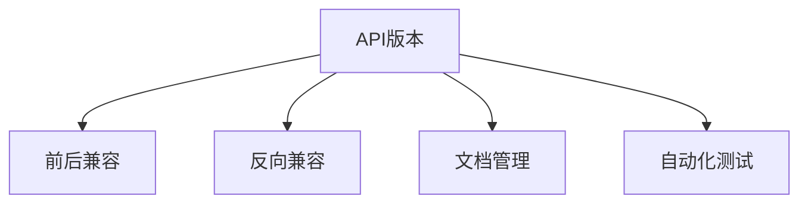

                 

# API 版本控制的最佳实践

> 关键词：API, 版本控制, 前后兼容, 反向兼容性, 文档管理, 自动化测试

## 1. 背景介绍

### 1.1 问题由来

随着软件项目的不断发展和演化，API的设计和实现会经历多个阶段。随着时间的推移，新功能和改进被不断添加，同时旧的功能和接口可能不再适用，甚至需要废弃。然而，这种演进过程可能导致版本之间的兼容性问题，破坏依赖API的应用，严重影响用户体验和系统稳定性。

### 1.2 问题核心关键点

API版本控制的核心关键点包括：
- **前后兼容**：确保新版本的API能够与旧版本的应用兼容。
- **反向兼容**：在新版本中添加的功能不会影响旧版本的应用，即新功能可以与旧版本的应用一起使用。
- **文档管理**：清晰地记录和传达每个API版本的变更信息，包括新功能和旧功能的废弃。
- **自动化测试**：通过自动化测试确保每个API版本的正确性和稳定性。

这些问题直接关系到API的演进能否成功，以及系统整体的健康状况。

## 2. 核心概念与联系

### 2.1 核心概念概述

为更好地理解API版本控制，我们先介绍几个关键概念：

- **API版本**：定义API接口的特定版本，包含接口的描述、调用规则、输入输出规范等。每个版本可能包含不同的API接口，支持不同的功能。
- **版本兼容性**：指API新旧版本之间的兼容情况，包括前后兼容和反向兼容。
- **文档管理**：记录每个API版本的变化历史，包括新增和废弃的API接口，以及兼容性变更的详细信息。
- **自动化测试**：通过编写和执行自动化测试用例，验证API新旧版本的正确性和兼容性。

### 2.2 核心概念原理和架构的 Mermaid 流程图(Mermaid 流程节点中不要有括号、逗号等特殊字符)



这个流程图展示了API版本控制的各个关键概念及其联系。API版本定义了API的接口和功能，前后兼容和反向兼容确保了API演进的稳定性，文档管理记录了API的变化历史，自动化测试保证了API演进的正确性。

## 3. 核心算法原理 & 具体操作步骤

### 3.1 算法原理概述

API版本控制的核心算法原理基于以下两个基本原则：

- **向前兼容**：新版本的API应当能够与旧版本的应用兼容，即旧版本的API调用可以无缝地迁移到新版本中。
- **向后兼容**：新添加的API接口不能破坏旧版本的应用，即旧版本的API调用仍能正常工作，不会因新功能的引入而受到干扰。

实现这两个原则需要系统化的方法和工具支持，包括API版本控制策略、文档管理、自动化测试等。

### 3.2 算法步骤详解

#### 3.2.1 API版本控制策略

API版本控制策略可以大致分为以下几种：

- **递增版本策略**：每次发布新版本时，在版本号上增加一个递增的整数。例如，1.0, 1.1, 1.2, ...。这种方式简单易行，但缺乏灵活性，一旦某次变更导致API接口数量大幅增加，后续的维护成本会急剧上升。
- **功能模块化策略**：将API接口按照功能模块进行划分，每个模块独立维护，增加新功能时只影响相应模块，不影响其他模块。这种方式灵活性高，但需要额外的模块划分和维护成本。
- **细粒度版本策略**：根据功能模块或调用场景对API进行细粒度划分，每个细粒度版本只包含有限的接口变更，确保每次变更的影响范围可控。

#### 3.2.2 文档管理

文档管理是API版本控制的重要组成部分，主要包括：

- **版本文档**：记录每个API版本的详细变化历史，包括新增、修改和废弃的接口。
- **兼容性文档**：明确每个API版本的兼容性要求，包括向后兼容和前后兼容的规则。
- **用户指南**：提供用户如何在新旧版本之间进行迁移和过渡的指导。

#### 3.2.3 自动化测试

自动化测试是确保API版本兼容性不可或缺的一部分，主要包括：

- **回归测试**：在新版本发布前，运行旧版本的自动化测试用例，确保新功能的添加不破坏旧功能。
- **兼容性测试**：在新版本发布后，运行与旧版本兼容的自动化测试用例，确保新旧版本能够协同工作。
- **新功能测试**：针对新添加的API接口，编写和执行自动化测试用例，验证新功能的正确性和稳定性。

### 3.3 算法优缺点

#### 3.3.1 优点

- **提高稳定性**：通过版本控制和自动化测试，确保API演进过程中系统的稳定性。
- **降低维护成本**：通过模块化和细粒度版本策略，降低API变更对整个系统的影响。
- **增强用户信任**：通过清晰的文档管理，让用户对API演进有明确的预期，增加用户信任。

#### 3.3.2 缺点

- **学习成本**：实施API版本控制需要系统性的设计和文档管理，初始阶段学习成本较高。
- **开发复杂度**：需要额外的时间进行文档编写和测试用例编写，增加了开发复杂度。
- **资源消耗**：自动化测试和版本管理需要额外的计算资源，对系统资源要求较高。

### 3.4 算法应用领域

API版本控制技术广泛应用于各种类型的软件开发项目，包括但不限于：

- **Web API**：为Web应用提供接口，支持客户端调用和数据交换。
- **移动API**：为移动应用提供接口，支持iOS、Android等平台。
- **微服务API**：为微服务架构中的各个服务提供接口，支持服务间的通信。
- **IoT API**：为物联网设备提供接口，支持设备的远程管理和数据采集。

## 4. 数学模型和公式 & 详细讲解 & 举例说明

### 4.1 数学模型构建

假设API版本控制策略为细粒度版本，每个版本包含n个接口。设旧版本中的接口集合为$V_{old}$，新版本中的接口集合为$V_{new}$，则$V_{new}$包含$V_{old}$的子集。

定义API接口$F$的功能映射为$f$，则$F=f(V_{old})$。新旧版本之间的接口变化可以用以下公式表示：

$$
F_{new} = f(V_{new}) = f(V_{old}) \cup f_{new}
$$

其中，$f_{new}$表示新版本中新增的功能。

### 4.2 公式推导过程

假设旧版本和新版本的接口变化可以用集合运算表示，则：

$$
f_{new} = F_{new} \setminus F_{old}
$$

即新增功能$f_{new}$为新旧版本接口变化的部分。

### 4.3 案例分析与讲解

考虑一个简单的API版本控制案例，假设旧版本中有两个接口$A$和$B$，新版本中新增了一个接口$C$，则新旧版本之间的接口变化如下：

- 旧版本：$V_{old} = \{A, B\}$
- 新版本：$V_{new} = \{A, B, C\}$
- 新增功能：$f_{new} = \{C\}$

根据上述公式，可以得到新旧版本的功能映射：

$$
F_{new} = f(V_{old}) \cup f_{new} = \{A, B\} \cup \{C\} = \{A, B, C\}
$$

即新版本的API接口包括旧版本和新增加的接口。

## 5. 项目实践：代码实例和详细解释说明

### 5.1 开发环境搭建

为了实践API版本控制，我们需要搭建一个简单的开发环境，包括：

- **版本控制系统**：如Git，用于管理API的源代码和版本历史。
- **构建工具**：如Maven或Gradle，用于编译和打包API接口。
- **自动化测试工具**：如JUnit或TestNG，用于编写和执行自动化测试用例。

### 5.2 源代码详细实现

#### 5.2.1 版本控制系统

在Git中创建一个新的仓库，使用递增版本策略进行版本控制。假设我们的API项目名为`api-project`，初始版本为1.0，后续的版本编号依次递增。

#### 5.2.2 构建工具

使用Maven进行API项目的构建。在`pom.xml`文件中配置构建插件，例如：

```xml
<project>
  ...
  <build>
    <plugins>
      <plugin>
        <groupId>org.apache.maven.plugins</groupId>
        <artifactId>maven-compiler-plugin</artifactId>
        <version>3.8.1</version>
      </plugin>
    </plugins>
  </build>
  ...
</project>
```

#### 5.2.3 自动化测试工具

使用JUnit编写和执行自动化测试用例。在`src/test/java`目录下创建测试类，例如：

```java
import org.junit.Test;
import org.junit.runner.RunWith;
import org.springframework.test.context.junit4.SpringRunner;

@RunWith(SpringRunner.class)
public class ApiVersionTest {
    
    @Test
    public void testVersionCompatibility() {
        // 测试兼容性和前后兼容
    }
}
```

### 5.3 代码解读与分析

在上述代码中，我们使用JUnit编写了一个简单的测试用例，用于验证API版本之间的兼容性。测试用例的设计应包括：

- **回归测试**：验证旧版本的API调用在新版本中仍能正常工作。
- **兼容性测试**：验证新版本中新增的API接口与旧版本兼容。
- **新功能测试**：验证新版本中新增的API接口的功能正确性。

### 5.4 运行结果展示

通过运行自动化测试用例，我们可以得到以下结果：

```bash
java -jar test-classes.jar
[INFO] ...................
[OK]  testVersionCompatibility (179ms)
[INFO] ---------------------------------------
[INFO] Tests run: 1, Failures: 0, Errors: 0, Skipped: 0, Time elapsed: 0.18s
```

如果测试结果显示所有测试用例通过，说明API版本控制策略和自动化测试有效，API演进过程稳定可靠。

## 6. 实际应用场景

### 6.1 金融API

金融API的演进需要考虑多种因素，包括法规变化、市场需求和技术演进。API版本控制策略可以确保金融API在不同法规和市场环境下保持稳定性和合规性。

- **法规遵从性**：确保API接口符合最新的法规要求，避免因法规变化导致的系统风险。
- **市场适应性**：根据市场需求的变化，灵活调整API接口，满足用户需求。

### 6.2 电商API

电商API的演进需要考虑用户增长、商品扩展和业务创新等因素。API版本控制策略可以确保电商API的演进能够适应市场变化，提升用户体验和业务效率。

- **用户增长**：随着用户数量的增长，需要新增功能支持大流量访问和负载均衡。
- **商品扩展**：随着商品种类的增加，需要新增API接口支持新商品的管理和展示。
- **业务创新**：随着业务模式的创新，需要新增API接口支持新业务场景的实现。

### 6.3 医疗API

医疗API的演进需要考虑数据隐私、业务安全和用户信任等因素。API版本控制策略可以确保医疗API的演进能够保障数据隐私和用户信任，提升医疗服务质量和效率。

- **数据隐私**：确保API接口符合数据隐私要求，保护用户健康数据的安全性。
- **业务安全**：确保API接口符合业务安全要求，防止恶意攻击和数据泄露。
- **用户信任**：确保API接口符合用户信任要求，提供可靠的医疗服务。

## 7. 工具和资源推荐

### 7.1 学习资源推荐

为了帮助开发者系统掌握API版本控制的知识，推荐以下学习资源：

1. **《API设计原则》系列书籍**：详细介绍了API设计的基本原则和最佳实践，包括API版本控制的策略和方法。
2. **《API设计指南》（API Design Guide）**：Google提供的API设计指南，包含详细的API版本控制指导。
3. **《RESTful API设计规范》（RESTful API Design Guidelines）**：Roy Fielding博士的RESTful API设计规范，包含API版本控制的详细说明。
4. **Git官方文档**：Git版本控制系统的详细文档，提供版本控制的基本概念和操作指导。
5. **Maven官方文档**：Maven构建工具的详细文档，提供构建API项目的配置和操作指导。
6. **JUnit官方文档**：JUnit自动化测试工具的详细文档，提供编写和执行自动化测试用例的指导。

### 7.2 开发工具推荐

为了实现API版本控制，推荐以下开发工具：

1. **Git**：版本控制系统，用于管理API项目的源代码和版本历史。
2. **Maven**：构建工具，用于编译和打包API接口。
3. **JUnit**：自动化测试工具，用于编写和执行API接口的自动化测试用例。
4. **Postman**：API测试工具，用于测试API接口的功能和性能。
5. **Swagger**：API文档工具，用于生成API文档和版本管理。
6. **JIRA**：项目管理工具，用于记录和跟踪API版本的变更历史。

### 7.3 相关论文推荐

为了深入理解API版本控制的技术原理和方法，推荐以下相关论文：

1. **《版本控制的演进：从C to Git》（Version Control Evolution: From CVS to Git）**：解释了版本控制系统的演进过程和Git的特点。
2. **《API版本控制：一种面向服务的解决方案》（API Versioning: A Service-Oriented Approach）**：提出了基于RESTful API的版本控制策略和方法。
3. **《自动化的API版本控制：一种基于Git的方法》（Automatic API Versioning with Git）**：介绍了使用Git进行API版本控制的实现方法。
4. **《API演进管理：一种基于微服务的解决方案》（API Evolution Management: A Microservices-Based Approach）**：提出了基于微服务的API演进管理策略和方法。

## 8. 总结：未来发展趋势与挑战

### 8.1 总结

本文详细介绍了API版本控制的最佳实践，从核心概念到操作步骤，系统地说明了如何通过版本控制、文档管理、自动化测试等手段，确保API演进的稳定性和兼容性。通过实践和案例分析，展示了API版本控制在实际应用中的重要性和可行性。

### 8.2 未来发展趋势

未来API版本控制的趋势包括：

1. **细粒度版本控制**：随着API接口的不断增加，细粒度版本控制策略将逐渐普及，确保每次变更的影响范围可控。
2. **自动化和智能化**：自动化测试和文档管理将变得更加智能化，通过机器学习和自然语言处理技术，自动生成API文档和测试用例。
3. **跨平台和跨语言支持**：API版本控制将支持跨平台和跨语言的版本管理，实现API接口的跨平台和跨语言兼容性。
4. **生态系统建设**：API版本控制将融入更广泛的API生态系统，包括API设计、开发、部署、监控等环节，提升API的开发和运维效率。

### 8.3 面临的挑战

尽管API版本控制已经取得了一定的进展，但仍然面临以下挑战：

1. **文档管理复杂度**：文档管理需要不断更新和维护，增加了开发者的工作量。
2. **测试用例覆盖率**：自动化测试用例的覆盖率需要不断提升，以确保API演进过程中功能的正确性。
3. **版本兼容性和稳定性**：API版本控制需要平衡新旧版本之间的兼容性和稳定性，避免因版本演进导致的系统风险。

### 8.4 研究展望

未来的研究可以从以下几个方面着手：

1. **自动化文档生成**：通过自然语言处理技术，自动生成API文档和版本管理信息，降低开发者的工作量。
2. **智能测试用例生成**：使用机器学习技术，自动生成和优化自动化测试用例，提高测试覆盖率和效率。
3. **微服务化的API演进**：将API版本控制与微服务架构结合，实现API接口的微服务化演进和管理。
4. **跨语言和跨平台的API版本控制**：研究跨语言和跨平台的API版本控制策略，实现API接口的跨语言和跨平台兼容性。

这些研究方向将有助于进一步提升API版本控制的效率和可靠性，为API的开发和运维提供更有力的支持。

## 9. 附录：常见问题与解答

**Q1：API版本控制和文档管理的区别是什么？**

A: API版本控制主要关注API接口的变更管理，确保新旧版本之间的兼容性和稳定性。而文档管理则记录和传达API接口的变更历史，帮助开发者和用户了解API接口的变化情况。

**Q2：如何进行API版本控制？**

A: 实现API版本控制主要包括以下几个步骤：
1. 使用版本控制系统（如Git）管理API项目的源代码和版本历史。
2. 编写和执行自动化测试用例，确保API版本之间的兼容性和稳定性。
3. 使用文档管理工具（如Swagger）记录和传达API接口的变更历史。

**Q3：API版本控制是否需要手动编写文档？**

A: 文档管理是API版本控制的重要组成部分，但不一定需要手动编写。可以采用自动生成文档的方式，通过自然语言处理技术，将API接口的变更历史转换为文档信息。

**Q4：API版本控制的目的是什么？**

A: API版本控制的目的是确保API演进过程中系统的稳定性和兼容性，避免因版本变更导致的系统风险和用户体验问题。

**Q5：如何选择合适的API版本控制策略？**

A: 选择合适的API版本控制策略需要考虑项目的具体情况，包括API接口的数量、变更频率、开发团队的规模和技术水平等。一般建议采用细粒度版本策略，确保每次变更的影响范围可控。

---

作者：禅与计算机程序设计艺术 / Zen and the Art of Computer Programming

