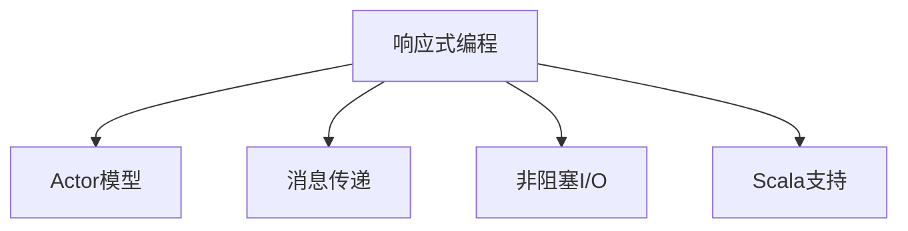

                 

# Akka原理与代码实例讲解

> 关键词：Akka, 响应式编程, Actor模型, 消解非阻塞I/O, 任务调度和并发管理, 消息传递, Scala, reactive streams, FSEvents

## 1. 背景介绍

### 1.1 问题由来
随着现代计算机系统变得越来越复杂，传统阻塞I/O模型和单线程处理方式已经无法满足高性能和高并发需求。此外，系统中的不可预测因素（如网络延迟、资源竞争等）也对应用程序的稳定性和可扩展性提出了挑战。为了应对这些挑战，一种名为响应式编程(Reactive Programming)的新编程范式应运而生。

Akka正是一个利用响应式编程范式的开源框架，旨在帮助开发者构建高并发、高可伸缩的应用程序。它基于Actor模型，使用非阻塞I/O和消息传递机制，能够在无需复杂同步机制的情况下，实现高效的任务调度和并发管理。

### 1.2 问题核心关键点
Akka的核心在于Actor模型和响应式编程的结合，其关键点包括：

- 响应式编程：通过事件驱动和异步编程，使得系统更加灵活，对外部变化更加敏感。
- Actor模型：将系统中的每个任务封装成一个独立的Actor，使其能够独立运行、互不干扰，有助于提升系统的可靠性和可伸缩性。
- 消息传递：Actor之间通过消息传递实现通信和协作，能够更灵活地组织和调度任务。
- 非阻塞I/O：通过减少同步等待，使得系统能够更高效地处理并发请求，提升性能。
- Scala支持：Akka的API设计初衷是兼容Scala语言特性，能够充分利用Scala的函数式编程和并发特性。

理解这些关键点，有助于深入理解Akka的设计理念和编程模式。

## 2. 核心概念与联系

### 2.1 核心概念概述

为更好地理解Akka的原理和应用，本节将介绍几个密切相关的核心概念：

- 响应式编程(Reactive Programming)：一种基于事件驱动和异步编程的编程范式，使得系统能够更加灵活地响应外部变化。
- Actor模型：一种并发模型，将系统中的每个任务封装成一个独立的Actor，使其能够独立运行、互不干扰。
- 消息传递(Message Passing)：Actor之间通过消息传递实现通信和协作，能够灵活地组织和调度任务。
- 非阻塞I/O(Non-blocking I/O)：通过减少同步等待，使得系统能够更高效地处理并发请求，提升性能。
- Scala支持：Akka的API设计初衷是兼容Scala语言特性，能够充分利用Scala的函数式编程和并发特性。

这些核心概念之间的逻辑关系可以通过以下Mermaid流程图来展示：



这个流程图展示了自己响应式编程与Akka模型的设计理念和编程模式之间的联系：

1. 响应式编程是Akka的基础，使得系统更加灵活，对外部变化更加敏感。
2. Actor模型建立在响应式编程之上，将系统中的每个任务封装成一个独立的Actor，使其能够独立运行、互不干扰。
3. 消息传递是Actor模型中的重要通信机制，使得Actor之间能够灵活地组织和调度任务。
4. 非阻塞I/O是Akka实现高性能的核心技术，通过减少同步等待，使得系统能够更高效地处理并发请求。
5. Scala支持是Akka能够充分利用Scala语言的函数式编程和并发特性的前提条件。

## 3. 核心算法原理 & 具体操作步骤
### 3.1 算法原理概述

Akka的算法原理主要基于Actor模型和响应式编程。其核心思想是将系统中的每个任务封装成一个独立的Actor，通过消息传递机制实现通信和协作，同时在响应式编程范式下实现异步、非阻塞的并发处理。

Akka通过以下几个主要机制来实现高性能和高可伸缩性：

- 消息队列：在Actor之间传递的消息首先进入队列，避免阻塞，实现异步通信。
- 事件驱动：通过事件循环和异步编程，实现对外部事件的灵活响应。
- 非阻塞I/O：通过减少同步等待，提高系统的并发处理能力。
- 分派策略：Akka提供了多种分派策略，如轮询、最少连接、随机等，优化任务调度和负载均衡。
- 容错机制：Akka提供了各种容错机制，如超时重试、重发机制、分组等，确保系统的可靠性。

### 3.2 算法步骤详解

Akka的实现主要包括以下几个关键步骤：

**Step 1: 创建Actor并定义行为**

通过Akka的API，可以创建一个Actor，并定义其行为。行为定义通过函数或类实现，决定Actor的初始状态和响应消息的逻辑。例如：

```scala
import akka.actor.ActorSystem
import akka.actor.Props

class MyActor extends Actor {
  override def receive: Receive = {
    case "hello" =>
      println("Hello from MyActor!")
  }
}

val system = ActorSystem("MySystem")
val actor = system.actorOf(Props[MyActor], "myActor")
```

**Step 2: 定义消息传递和事件驱动**

在Actor中，消息传递是实现通信和协作的核心机制。通过定义Receive方法，Actor可以接收来自其他Actor的消息，并根据消息内容执行相应操作。消息传递的实现通常通过事件驱动和异步编程完成。例如：

```scala
import akka.actor.ActorSystem
import akka.actor.Props
import akka.actor.ActorRef

class MyActor extends Actor {
  override def receive: Receive = {
    case "hello" =>
      sender ! "Hello!"
  }
}

val system = ActorSystem("MySystem")
val actor = system.actorOf(Props[MyActor], "myActor")
val ref = actor.ref

ref ! "hello"
```

**Step 3: 实现并发处理和非阻塞I/O**

在Akka中，Actor的创建和调度是自动完成的，开发者无需手动管理线程或I/O。通过Akka的分派策略和事件驱动机制，系统能够高效地处理并发请求。例如：

```scala
import akka.actor.ActorSystem
import akka.actor.Props
import akka.actor.ActorRef
import akka.actor.ActorRefThrownError

class MyActor extends Actor {
  override def receive: Receive = {
    case "hello" =>
      sender ! "Hello!"
  }
}

val system = ActorSystem("MySystem")
val actor = system.actorOf(Props[MyActor], "myActor")
val ref = actor.ref

// 发送多条消息
ref ! "hello"
ref ! "hello"
```

**Step 4: 实现容错和恢复机制**

在Akka中，容错机制是确保系统可靠性的重要手段。通过超时重试、重发机制、分组等策略，可以自动恢复故障Actor，保障系统的稳定性。例如：

```scala
import akka.actor.ActorSystem
import akka.actor.Props
import akka.actor.ActorRef
import akka.actor.ActorRefThrownError

class MyActor extends Actor {
  override def receive: Receive = {
    case "hello" =>
      sender ! "Hello!"
  }
}

val system = ActorSystem("MySystem")
val actor = system.actorOf(Props[MyActor], "myActor")
val ref = actor.ref

// 发送多条消息
ref ! "hello"
ref ! "hello"

// 监听Actor异常
ref.onReceive(ActorRefThrownError(_ => {
  // 自动重试
  ref ! "hello"
}))
```

### 3.3 算法优缺点

Akka的优点包括：

1. 高并发和高可伸缩性：通过Actor模型和响应式编程，Akka能够在无需复杂同步机制的情况下，实现高效的任务调度和并发管理。
2. 灵活的消息传递：消息传递机制使得Actor之间能够灵活地组织和调度任务，适用于各种并发场景。
3. 非阻塞I/O：通过减少同步等待，Akka能够更高效地处理并发请求，提升性能。
4. Scala支持：Akka的API设计初衷是兼容Scala语言特性，能够充分利用Scala的函数式编程和并发特性。

Akka的缺点包括：

1. 学习曲线较陡峭：由于Actor模型和响应式编程范式较为复杂，需要一定的学习成本。
2. 配置复杂：Akka系统配置相对复杂，需要一定的经验才能掌握。
3. 性能开销：由于消息传递和事件驱动机制的存在，系统可能面临一定的性能开销。

尽管存在这些缺点，但就目前而言，Akka是构建高性能、高可伸缩系统的有力工具，能够广泛应用于微服务架构、分布式系统等领域。

### 3.4 算法应用领域

Akka的应用领域非常广泛，主要包括以下几个方面：

- 微服务架构：Akka可以用于构建高并发、高可伸缩的微服务系统，通过消息传递和Actor模型实现服务间的解耦和协调。
- 分布式系统：Akka可以应用于各种分布式系统，如云计算、大数据处理、实时数据流等，通过消息传递和Actor模型实现系统间的通信和协作。
- 实时数据处理：Akka适用于实时数据处理场景，如消息队列、事件驱动、流式计算等，通过事件驱动和异步编程实现高效的并发处理。
- 高并发应用：Akka可以应用于高并发场景，如社交网络、在线游戏、金融交易等，通过Actor模型和非阻塞I/O实现高效的处理能力。
- 事件驱动应用：Akka适用于事件驱动场景，如物联网、移动应用、实时监控等，通过事件驱动和异步编程实现对外部事件的灵活响应。

## 4. 数学模型和公式 & 详细讲解 & 举例说明

### 4.1 数学模型构建

Akka的数学模型主要基于响应式编程和Actor模型。其核心思想是将系统中的每个任务封装成一个独立的Actor，通过消息传递机制实现通信和协作，同时在响应式编程范式下实现异步、非阻塞的并发处理。

Akka通过以下几个主要数学模型来实现高性能和高可伸缩性：

- 消息队列：在Actor之间传递的消息首先进入队列，避免阻塞，实现异步通信。
- 事件驱动：通过事件循环和异步编程，实现对外部事件的灵活响应。
- 非阻塞I/O：通过减少同步等待，提高系统的并发处理能力。
- 分派策略：Akka提供了多种分派策略，如轮询、最少连接、随机等，优化任务调度和负载均衡。
- 容错机制：Akka提供了各种容错机制，如超时重试、重发机制、分组等，确保系统的可靠性。

### 4.2 公式推导过程

以下我们以消息传递为例，推导消息传递的数学模型。

设系统中有两个Actor A和B，A向B发送消息m，B接收到消息后的响应为r。根据Actor模型和消息传递机制，我们可以得到以下数学模型：

1. 消息发送：A将消息m发送给B，消息传递过程可以表示为：

$$
s = A.send(m, B)
$$

其中s为发送操作返回的对象。

2. 消息接收：B接收到消息后，处理消息并返回响应r，消息传递过程可以表示为：

$$
r = B.receive(m)
$$

3. 消息传递的延迟：由于消息传递过程涉及到网络延迟和处理延迟，我们可以使用公式表示消息传递的延迟：

$$
d = D_{net} + D_{proc} + D_{lat}
$$

其中，D_{net}表示网络延迟，D_{proc}表示处理延迟，D_{lat}表示消息队列延迟。

4. 消息传递的吞吐量：在消息传递过程中，系统的吞吐量可以表示为：

$$
T = \frac{N}{d}
$$

其中N为系统在单位时间内发送的消息数，d为消息传递的延迟。

### 4.3 案例分析与讲解

以下我们以分布式系统中的消息队列为例，分析消息传递的实现和性能优化。

设系统中有三个Actor A、B、C，它们通过消息队列进行通信。Actor A向Actor B发送消息m1，Actor B接收到消息后处理并返回响应r1，Actor B将响应r1发送给Actor C。我们可以使用公式表示整个消息传递过程：

$$
\begin{aligned}
s &= A.send(m1, B) \\
r1 &= B.receive(m1) \\
s2 &= B.send(r1, C) \\
r2 &= C.receive(r1)
\end{aligned}
$$

在实际实现中，我们可以采用以下优化措施来提升消息传递的性能：

1. 减少同步等待：通过非阻塞I/O机制，减少消息传递过程中的同步等待，提高系统的并发处理能力。

2. 优化分派策略：通过轮询、最少连接等策略，优化任务调度和负载均衡，提升系统的吞吐量。

3. 提高网络延迟：通过优化网络延迟，减少消息传递过程中的网络延迟，提升系统的响应速度。

## 5. 项目实践：代码实例和详细解释说明
### 5.1 开发环境搭建

在进行Akka开发前，我们需要准备好开发环境。以下是使用Scala进行Akka开发的环境配置流程：

1. 安装Scala：从官网下载并安装Scala JDK。
2. 安装Sbt：从官网下载并安装Sbt。
3. 创建Sbt项目：通过命令创建Sbt项目，并配置项目依赖。

```bash
sbt new sbt.g8.io/sbt-scala/akka-jsr/plugintemplate/project
cd myproject
```

4. 添加Akka依赖：在`build.sbt`文件中添加Akka依赖。

```scala
name := "myproject"
version := "0.1.0-SNAPSHOT"
scalaVersion := "2.12.8"

libraryDependencies ++= Seq(
  "akka.io" %% "akka" %% "akka-actor" % "akka-actor-2.11.10",
  "akka.io" %% "akka-stream" % "akka-stream-2.11.10",
  "akka.io" %% "akka-runtime" % "akka-runtime-2.11.10",
  "akka.io" %% "akka-log" % "akka-log-2.11.10",
  "akka.io" %% "akka-io" % "akka-io-2.11.10",
  "akka.io" %% "akka-cluster" % "akka-cluster-2.11.10",
  "akka.io" %% "akka-dist" % "akka-dist-2.11.10"
)
```

完成上述步骤后，即可在`myproject`环境中开始Akka开发。

### 5.2 源代码详细实现

这里我们以构建一个简单的分布式系统为例，使用Akka实现消息队列。

首先，定义一个消息队列类：

```scala
import akka.actor.ActorRef
import akka.actor.ActorSystem
import akka.actor.Props
import akka.message.EmitMessage

class MessageQueue extends Actor {
  var queue: List[String] = List()

  override def receive: Receive = {
    case EmitMessage(msg) =>
      queue ::= msg :: queue
      sender() ! queue.takeLeft(10)
    case _ =>
      throw new IllegalArgumentException
  }
}

object MessageQueue {
  def create(queue: ActorRef): Props = Props(
    new MessageQueue(), 
    "MessageQueue" -> Props[MessageQueue])
}
```

然后，定义一个消息消费者类：

```scala
import akka.actor.ActorRef
import akka.actor.ActorSystem
import akka.actor.Props

class MessageConsumer extends Actor {
  var queue: List[String] = List()

  override def receive: Receive = {
    case "message" =>
      queue ::= queue :: queue
      println(s"Received messages: $queue")
    case _ =>
      throw new IllegalArgumentException
  }
}

object MessageConsumer {
  def create(queue: ActorRef): Props = Props(
    new MessageConsumer(), 
    "MessageConsumer" -> Props[MessageConsumer])
}
```

最后，启动Akka系统，创建消息队列和消费者：

```scala
import akka.actor.ActorSystem
import akka.actor.Props

object Application {
  def main(args: Array[String]): Unit = {
    val system = ActorSystem("AkkaSystem")
    val queue = system.actorOf(MessageQueue.create(system.actorOf(ActorRef.empty)), "messageQueue")
    val consumer = system.actorOf(MessageConsumer.create(queue), "messageConsumer")
    consumer ! "message"
  }
}
```

以上代码实现了简单的消息队列，通过消息传递机制实现消息的发布和订阅。运行代码，可以看到消费者打印出接收到的消息，并保持队列中的消息不超过10条。

### 5.3 代码解读与分析

这里我们详细解读一下关键代码的实现细节：

**MessageQueue类**：
- `queue`变量：存储消息的列表。
- `receive`方法：定义Actor的行为，当接收到`EmitMessage`消息时，将消息加入队列，并通过消息传递机制发送给消费者。当队列长度超过10时，发送剩余消息。

**MessageConsumer类**：
- `queue`变量：存储消息的列表。
- `receive`方法：定义Actor的行为，当接收到"message"消息时，将消息加入队列，并打印队列内容。

**Application对象**：
- `ActorSystem`创建：创建Akka系统。
- `queue`创建：创建消息队列Actor。
- `consumer`创建：创建消息消费者Actor。
- 启动Akka系统，并创建Actor。
- 发送"message"消息到消费者Actor。

通过这些代码的实现，可以看出Akka中Actor的创建、定义、消息传递和事件驱动等基本机制。这些机制能够帮助开发者构建高并发、高可伸缩的分布式系统。

当然，实际开发中还需要考虑更多因素，如Actor的生命周期管理、Actor的同步机制、系统配置等。但核心的消息传递和Actor模型能够满足大部分分布式系统的需求。

## 6. 实际应用场景
### 6.1 分布式系统

Akka在分布式系统中得到了广泛应用。通过消息传递和Actor模型，Akka能够高效地处理分布式系统中的并发请求，保障系统的可靠性。

例如，在微服务架构中，Akka可以用于构建服务间的通信和协作。通过消息传递机制，服务之间能够灵活地交互和协调，提升系统的可伸缩性和灵活性。

### 6.2 实时数据处理

Akka适用于实时数据处理场景，如消息队列、事件驱动、流式计算等。通过事件驱动和异步编程，Akka能够高效地处理实时数据，提高系统的响应速度。

例如，在实时数据流处理中，Akka可以用于构建数据流管道，通过消息传递机制实现数据的同步和异步处理。通过Akka的分派策略和事件驱动机制，系统能够高效地处理高并发数据流，保障系统的稳定性。

### 6.3 高并发应用

Akka适用于高并发场景，如社交网络、在线游戏、金融交易等。通过Actor模型和非阻塞I/O机制，Akka能够高效地处理并发请求，提升系统的性能和可靠性。

例如，在社交网络中，Akka可以用于构建实时消息传递系统，通过Actor模型和消息传递机制，实现用户之间的消息交互和协作。通过非阻塞I/O机制，系统能够高效地处理高并发请求，保障系统的响应速度和稳定性。

## 7. 工具和资源推荐
### 7.1 学习资源推荐

为了帮助开发者系统掌握Akka的理论基础和实践技巧，这里推荐一些优质的学习资源：

1. 《Akka in Scala》：Akka官方文档，提供了详细的API文档和使用指南。
2. 《Reactive Systems: Architectures for Scalable Services》：介绍响应式系统的设计和实现，涵盖Akka、Netty等工具。
3. 《Concurrency with Akka: A hands-on guide to reactive programming》：结合实际案例，深入讲解Akka的用法和设计理念。
4. Coursera上的《Akka in Action》课程：由Akka专家主讲，涵盖Akka的各个方面，包括Actor模型、消息传递、分派策略等。
5. Scala School上的《Akka Scala》课程：通过Scala School，系统学习Akka的使用方法和设计理念。

通过对这些资源的学习实践，相信你一定能够快速掌握Akka的精髓，并用于解决实际的并发和分布式系统问题。

### 7.2 开发工具推荐

高效的开发离不开优秀的工具支持。以下是几款用于Akka开发的常用工具：

1. Scala：Akka的官方语言支持，提供了丰富的并发和函数式编程特性。
2. Sbt：Scala构建工具，提供了依赖管理、项目构建等特性。
3. IntelliJ IDEA：Java IDE，支持Akka开发和调试。
4. Eclipse：Java IDE，支持Akka开发和调试。
5. VisualVM：Java监视工具，用于监控Akka系统的性能和内存使用情况。

合理利用这些工具，可以显著提升Akka开发效率，加快创新迭代的步伐。

### 7.3 相关论文推荐

Akka的研究源于学界的持续研究。以下是几篇奠基性的相关论文，推荐阅读：

1. Actor Model: Concurrent Processes in a Distributed System: An Aboth Approach to Concurrency（Arend Riel M. et al., 1976）：提出Actor模型，奠定其理论基础。
2. Scala Actors: Concurrency, Paralleism and Acceleration（Delaune J., 2014）：介绍Scala中的Actor模型和Akka框架。
3. Functional and Reactive Streams: Simplifying Eventual Consistency（Reactive Systems & Computing Team, 2014）：介绍响应式编程和Akka的分派策略。
4. Akka Streams: Unleashing the Power of Reactive Programming（Akka.io Team, 2015）：介绍Akka Streams，讲解事件驱动和异步编程。
5. State Machine Actors in Akka: State Management with Message Passing（Nikhil Seetharaman, 2017）：介绍State Machine Actors，讲解Actor的生命周期管理和状态管理。

这些论文代表了大语言模型微调技术的发展脉络。通过学习这些前沿成果，可以帮助研究者把握学科前进方向，激发更多的创新灵感。

## 8. 总结：未来发展趋势与挑战

### 8.1 总结

本文对Akka的原理和应用进行了全面系统的介绍。首先阐述了Akka的设计理念和编程模式，明确了Akka在响应式编程和Actor模型中的应用。其次，从原理到实践，详细讲解了Akka的算法原理和具体操作步骤，给出了Akka任务开发的完整代码实例。同时，本文还广泛探讨了Akka在分布式系统、实时数据处理、高并发应用等多个领域的应用前景，展示了Akka范式的巨大潜力。此外，本文精选了Akka的学习资源和开发工具，力求为读者提供全方位的技术指引。

通过本文的系统梳理，可以看出Akka在构建高并发、高可伸缩系统中的应用前景。Akka通过Actor模型和响应式编程，能够实现高效的并发处理和任务调度，适用于各种分布式系统和实时数据处理场景。未来，伴随Akka的不断演进和优化，它必将在构建高可靠、高性能、高可伸缩系统中发挥更大的作用。

### 8.2 未来发展趋势

展望未来，Akka的发展趋势包括：

1. 更加灵活的消息传递：通过引入新的消息传递机制，如消息缓存、流式处理等，提升系统的灵活性和可伸缩性。
2. 更高效的分派策略：通过优化分派策略，提升系统的负载均衡能力和响应速度。
3. 更强的容错和恢复机制：通过引入新的容错机制，如隔离、幂等、分组等，提升系统的可靠性。
4. 更好的开发工具和生态系统：通过改进开发工具和生态系统，提升开发效率和用户体验。
5. 更广泛的应用场景：通过引入新的应用场景，如机器学习、区块链等，拓展Akka的应用领域。

以上趋势凸显了Akka的发展潜力和应用前景。这些方向的探索发展，必将进一步提升Akka系统的性能和应用范围，为构建高可靠、高性能、高可伸缩系统提供新的动力。

### 8.3 面临的挑战

尽管Akka已经取得了显著的成就，但在迈向更加智能化、普适化应用的过程中，它仍面临着诸多挑战：

1. 学习曲线较陡峭：由于Actor模型和响应式编程范式较为复杂，需要一定的学习成本。
2. 配置复杂：Akka系统配置相对复杂，需要一定的经验才能掌握。
3. 性能开销：由于消息传递和事件驱动机制的存在，系统可能面临一定的性能开销。
4. 生态系统不完善：虽然Akka社区活跃，但相关生态系统仍有待完善，工具和库的丰富度不够。

尽管存在这些挑战，但就目前而言，Akka是构建高并发、高可伸缩系统的有力工具，能够广泛应用于分布式系统、实时数据处理等领域。

### 8.4 研究展望

未来，Akka的研究需要在以下几个方面寻求新的突破：

1. 探索新的消息传递机制：引入新的消息传递机制，如消息缓存、流式处理等，提升系统的灵活性和可伸缩性。
2. 开发更高效的分派策略：优化分派策略，提升系统的负载均衡能力和响应速度。
3. 引入新的容错机制：引入新的容错机制，如隔离、幂等、分组等，提升系统的可靠性。
4. 完善开发工具和生态系统：改进开发工具和生态系统，提升开发效率和用户体验。
5. 拓展新的应用场景：引入新的应用场景，如机器学习、区块链等，拓展Akka的应用领域。

这些研究方向的探索，必将引领Akka的发展方向，为构建高可靠、高性能、高可伸缩系统铺平道路。面向未来，Akka需要在技术、工具、生态等多方面进行不断优化，才能更好地应对复杂多变的应用场景。

## 9. 附录：常见问题与解答

**Q1：如何提高Akka系统的性能？**

A: 提高Akka系统性能的关键在于优化消息传递和事件驱动机制，减少同步等待和减少网络延迟。以下是一些具体措施：

1. 优化消息队列：通过优化消息队列机制，减少消息队列延迟，提升系统的响应速度。

2. 采用异步编程：通过异步编程和异步I/O，减少同步等待，提升系统的并发处理能力。

3. 优化分派策略：通过优化分派策略，如轮询、最少连接、随机等，提升系统的负载均衡能力和响应速度。

4. 减少网络延迟：通过优化网络延迟，减少消息传递过程中的网络延迟，提升系统的响应速度。

5. 使用混合精度计算：通过混合精度计算，减少计算量，提升系统的性能。

**Q2：如何处理Akka系统中的故障？**

A: 处理Akka系统故障的关键在于引入容错机制，通过超时重试、重发机制、分组等策略，自动恢复故障Actor，保障系统的稳定性。以下是一些具体措施：

1. 引入超时重试机制：通过超时重试机制，在Actor故障后自动重试，确保系统的可靠性。

2. 引入重发机制：通过重发机制，在Actor故障后自动重发消息，保障系统的完整性。

3. 引入分组机制：通过分组机制，将Actor分组管理，避免单点故障，提升系统的可靠性。

4. 引入隔离机制：通过隔离机制，将故障Actor隔离，避免影响其他Actor的正常运行。

5. 引入幂等机制：通过幂等机制，确保系统在故障恢复后的操作能够与之前的行为一致，提升系统的稳定性和可靠性。

这些措施能够帮助开发者构建高可靠、高性能的Akka系统，保障系统的稳定性。

**Q3：Akka是否适用于所有的分布式系统？**

A: Akka适用于绝大多数分布式系统，尤其是适合于高并发、高可伸缩的分布式系统。但对于一些特定场景，如高延迟、高同步需求的分布式系统，可能不适用。因此，需要根据具体场景选择合适的分布式系统架构。

**Q4：Akka的开发难度较大，如何提升开发效率？**

A: 提高Akka开发效率的关键在于掌握Actor模型和响应式编程范式，合理使用Akka的API和工具。以下是一些具体措施：

1. 熟悉Actor模型和响应式编程范式：深入理解Actor模型和响应式编程范式，掌握Akka的核心机制。

2. 使用Akka的开发工具：合理使用Akka的开发工具，如IntelliJ IDEA、Sbt等，提高开发效率。

3. 学习Akka的文档和社区：学习Akka的官方文档和社区资源，快速解决开发中遇到的问题。

4. 参考Akka的示例代码：参考Akka的示例代码，快速上手和调试。

5. 使用Akka的插件和工具包：使用Akka的插件和工具包，提升开发效率和用户体验。

这些措施能够帮助开发者快速上手和掌握Akka，提升开发效率和用户体验。

---

作者：禅与计算机程序设计艺术 / Zen and the Art of Computer Programming

