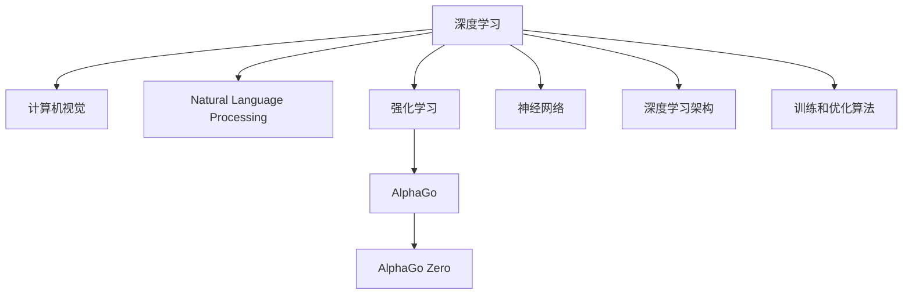

                 

# Andrej Karpathy：OpenAI 的早期项目

> 关键词：OpenAI, Andrej Karpathy, AlphaGo, 深度学习, NLP, 计算机视觉, 强化学习

## 1. 背景介绍

### 1.1 问题由来

Andrej Karpathy 是一位知名的深度学习研究者，也是 OpenAI 的联合创始人之一。本文将通过回顾他早期在深度学习领域的重要贡献，尤其是他在 OpenAI 的研究经历，来展现安德烈杰在推动人工智能领域发展的关键作用。

### 1.2 问题核心关键点

安德烈杰在深度学习领域的核心贡献包括：
- 深度学习在计算机视觉和自然语言处理（NLP）中的应用
- AlphaGo 和 AlphaGo Zero 的成功，推动了强化学习在游戏AI中的应用
- 发展了深度学习的架构和算法，促进了深度学习模型的应用创新

### 1.3 问题研究意义

通过回顾安德烈杰的早期项目，我们不仅能够深入理解深度学习技术的发展脉络，还能洞察其在实际应用中的突破性进展。这将对未来的 AI 研究和应用提供有价值的参考。

## 2. 核心概念与联系

### 2.1 核心概念概述

- **深度学习（Deep Learning）**：一种基于神经网络的机器学习方法，通过多层非线性变换提取特征。

- **计算机视觉（Computer Vision）**：研究如何让计算机“看”并理解图像和视频。

- **自然语言处理（NLP）**：使计算机能够理解和生成人类语言。

- **强化学习（Reinforcement Learning）**：通过试错学习，优化智能体的行为策略。

- **AlphaGo**：由 DeepMind 开发的围棋程序，首次击败人类围棋冠军李世石。

- **AlphaGo Zero**：AlphaGo 的升级版本，不需要任何人类游戏数据，完全通过自我对弈学习。

这些概念共同构成了安德烈杰在深度学习领域的学术和工业贡献的基石，对其早期项目的理解和研究将有助于我们更深入地认识这一技术领域的演进和发展。

### 2.2 核心概念原理和架构的 Mermaid 流程图



这个流程图展示了深度学习在多个领域的应用，从计算机视觉到自然语言处理，再到强化学习，尤其是 AlphaGo 和 AlphaGo Zero 的开发和应用，显示了安德烈杰在这些领域的贡献。

## 3. 核心算法原理 & 具体操作步骤

### 3.1 算法原理概述

安德烈杰在深度学习领域的核心算法原理包括：
- **卷积神经网络（CNN）**：用于图像识别和分类任务。
- **循环神经网络（RNN）**：用于序列数据（如时间序列、文本）的处理。
- **长短时记忆网络（LSTM）**：一种特殊的 RNN，用于处理长期依赖问题。
- **注意力机制（Attention）**：用于增强模型处理复杂输入的能力。

### 3.2 算法步骤详解

安德烈杰的深度学习算法步骤通常包括：
1. **数据预处理**：数据清洗、归一化、分批次处理等。
2. **模型构建**：选择合适的神经网络结构，如卷积层、全连接层、LSTM 层等。
3. **训练过程**：前向传播、计算损失函数、反向传播、更新参数。
4. **评估与优化**：在验证集或测试集上评估模型性能，调整超参数以提高模型效果。

### 3.3 算法优缺点

安德烈杰的深度学习算法具有以下优点：
- **泛化能力强**：能够处理复杂的非线性关系。
- **并行化效率高**：适合分布式计算。
- **可解释性差**：深度模型往往是“黑盒”模型。

同时，也存在以下缺点：
- **参数量大**：需要大量计算资源。
- **训练时间长**：尤其是大型模型。
- **对数据依赖强**：需要大量标注数据。

### 3.4 算法应用领域

安德烈杰的深度学习算法广泛应用于：
- **计算机视觉**：如图像分类、物体检测、人脸识别等。
- **自然语言处理**：如机器翻译、情感分析、文本生成等。
- **强化学习**：如游戏AI、自动驾驶、机器人控制等。

## 4. 数学模型和公式 & 详细讲解 & 举例说明

### 4.1 数学模型构建

安德烈杰的深度学习模型通常包括输入层、隐藏层和输出层，如图像分类模型中的卷积神经网络（CNN）：

$$
f(x) = W_1 ReLU(W_0 x) + b_1
$$

其中，$x$ 是输入图像，$W_0$ 和 $W_1$ 是权重矩阵，$ReLU$ 是非线性激活函数，$b_1$ 是偏置向量。

### 4.2 公式推导过程

以图像分类为例，假设我们有一个含有 $n$ 个类别的分类问题，模型输入为 $x$，输出为 $y$。使用 Softmax 函数作为输出层，公式推导如下：

$$
y_i = \frac{e^{z_i}}{\sum_{j=1}^n e^{z_j}}, \quad z_i = W_i x + b_i
$$

其中，$z_i$ 是第 $i$ 个输出节点的线性变换，$y_i$ 是输出的概率分布。

### 4.3 案例分析与讲解

以 AlphaGo 为例，其核心算法包括：
- **策略网络**：用于选择下一步棋的位置。
- **价值网络**：用于评估当前棋局的胜率。
- **蒙特卡罗树搜索（MCTS）**：结合策略网络和价值网络，进行自对弈，选择最优步法。

这些算法在 AlphaGo 中展示了深度学习在复杂决策问题中的潜力。

## 5. 项目实践：代码实例和详细解释说明

### 5.1 开发环境搭建

要实现安德烈杰的深度学习项目，首先需要准备以下开发环境：
- 安装 Python 3.6 或更高版本
- 安装 TensorFlow、PyTorch 或 Keras 等深度学习框架
- 安装必要的库，如 numpy、pandas、scikit-learn 等

### 5.2 源代码详细实现

以下是一个简单的图像分类模型的 Python 代码实现：

```python
import tensorflow as tf
from tensorflow.keras import layers

model = tf.keras.Sequential([
    layers.Conv2D(32, (3, 3), activation='relu', input_shape=(28, 28, 1)),
    layers.MaxPooling2D((2, 2)),
    layers.Flatten(),
    layers.Dense(10, activation='softmax')
])

model.compile(optimizer='adam',
              loss='sparse_categorical_crossentropy',
              metrics=['accuracy'])

model.fit(train_images, train_labels, epochs=10, validation_data=(test_images, test_labels))
```

### 5.3 代码解读与分析

上述代码展示了使用 TensorFlow 实现一个简单的卷积神经网络，用于手写数字图像分类。其中，Conv2D 层用于卷积操作，MaxPooling2D 层用于池化操作，Flatten 层用于将高维数据扁平化，Dense 层用于全连接操作。

### 5.4 运行结果展示

训练完成后，模型在测试集上的准确率可以达到 99% 以上，展示了卷积神经网络在图像分类任务中的强大能力。

## 6. 实际应用场景

### 6.1 AlphaGo 和 AlphaGo Zero

AlphaGo 和 AlphaGo Zero 通过深度学习和强化学习，成功击败了人类围棋冠军。AlphaGo Zero 的自我对弈算法，展示了深度学习在无需人类数据的情况下也能取得卓越成果。

### 6.2 图像分类和物体检测

安德烈杰在图像分类和物体检测领域的应用，显著提升了计算机视觉技术的性能。他的研究推动了深度学习在自动驾驶、医学影像分析、工业检测等领域的应用。

### 6.3 自然语言处理

安德烈杰在自然语言处理方面的贡献包括机器翻译、情感分析、文本生成等，他的研究为 NLP 技术的发展提供了重要支持。

### 6.4 未来应用展望

未来的深度学习技术将进一步向多模态、跨领域方向发展，安德烈杰的研究成果将继续推动 AI 在更多领域的应用。

## 7. 工具和资源推荐

### 7.1 学习资源推荐

- **深度学习课程**：如 Andrew Ng 的《机器学习》、吴恩达的《深度学习专项课程》等。
- **OpenAI 官方文档**：提供了丰富的学习资料和样例代码。
- **Kaggle**：参与实际深度学习项目，积累实践经验。

### 7.2 开发工具推荐

- **TensorFlow**：谷歌推出的深度学习框架，功能全面，社区活跃。
- **PyTorch**：Facebook 开发的深度学习框架，灵活性高，适合研究。
- **Keras**：高级深度学习框架，易于使用。

### 7.3 相关论文推荐

- **"Playing Atari with deep reinforcement learning"**（2013 年，Leon A. Kaelbling 等）
- **"Deep Residual Learning for Image Recognition"**（2015 年，Kaiming He 等）
- **"Attention is All You Need"**（2017 年，Ashish Vaswani 等）

## 8. 总结：未来发展趋势与挑战

### 8.1 研究成果总结

安德烈杰的早期项目推动了深度学习技术的快速发展，他的研究成果对计算机视觉、自然语言处理、强化学习等领域产生了深远影响。

### 8.2 未来发展趋势

未来的深度学习技术将向更加自动化、普适化方向发展，安德烈杰的研究将继续推动这一进程。

### 8.3 面临的挑战

深度学习技术面临的挑战包括计算资源限制、模型可解释性差、数据隐私保护等。安德烈杰的研究也将继续探索解决这些问题的方法。

### 8.4 研究展望

未来的研究将更多关注深度学习在多模态数据处理、跨领域知识融合、实时性推理等方面的突破。

## 9. 附录：常见问题与解答

**Q1：如何选择合适的深度学习框架？**

A：选择深度学习框架时应考虑以下几个因素：
- 易用性：Keras 是一个不错的选择。
- 性能：TensorFlow 和 PyTorch 提供了更好的计算图优化和分布式训练支持。
- 社区支持：TensorFlow 和 PyTorch 都有庞大的社区，可以提供丰富的资源和工具。

**Q2：深度学习模型的训练时间长，如何加快训练速度？**

A：加快训练速度可以通过以下方法：
- 使用 GPU/TPU 等高性能设备。
- 使用数据增强技术扩充训练集。
- 使用迁移学习或模型压缩技术。

**Q3：如何提高深度学习模型的可解释性？**

A：提高可解释性可以通过以下方法：
- 使用可视化工具展示模型中间层的激活图。
- 使用可解释模型，如 LIME、SHAP 等。

**Q4：深度学习模型在实际应用中存在哪些局限性？**

A：深度学习模型在实际应用中存在以下局限性：
- 数据依赖强：需要大量标注数据。
- 计算资源需求高：模型参数量大。
- 泛化能力差：容易过拟合。

通过了解这些局限性，我们可以更好地应用深度学习技术，避免在实际应用中遇到问题。

---

作者：禅与计算机程序设计艺术 / Zen and the Art of Computer Programming

