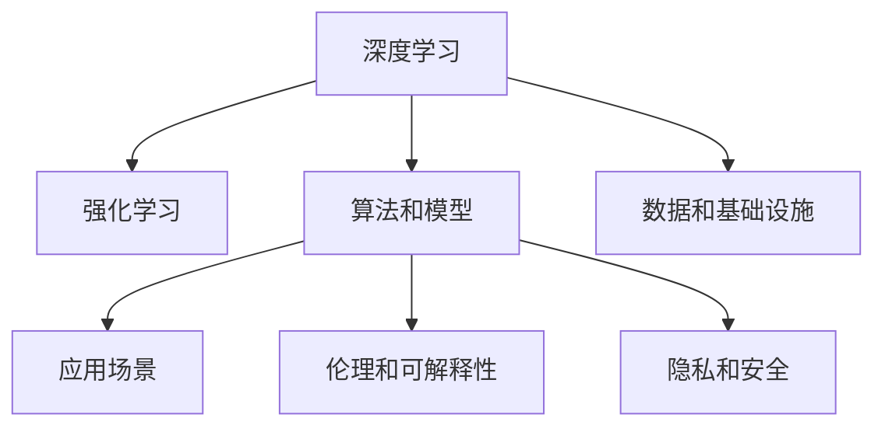

                 

## 1. 背景介绍

### 1.1 问题由来
Andrej Karpathy是深度学习领域的前沿专家，曾对深度学习的众多重要方向做出重要贡献，包括卷积神经网络、循环神经网络、强化学习、视觉理解等。他的研究为深度学习的发展奠定了基础，影响了众多后来的研究者和工程师。

在深度学习逐渐成为人工智能领域的核心技术后，关于人工智能未来的发展前景引起了广泛讨论。作为一名站在技术前沿的深度学习专家，Karpathy对人工智能未来的发展有着独到的见解。本文将从Karpathy的观点出发，探讨人工智能未来可能的发展方向及其挑战。

### 1.2 问题核心关键点
Karpathy认为，人工智能的未来发展前景主要包括以下几个方面：

1. **算法和模型**：深度学习、强化学习等算法的不断改进和优化，将使得人工智能系统变得更加高效、鲁棒。
2. **数据和基础设施**：大规模、高质量数据集和先进计算基础设施，为AI模型提供了强大的支持。
3. **应用场景**：AI将在医疗、金融、自动驾驶、智能制造等更多领域得到广泛应用。
4. **伦理和可解释性**：AI系统的伦理和可解释性问题将成为重要研究方向，确保AI系统的公平性和透明性。
5. **隐私和安全**：随着AI系统的普及，隐私保护和安全问题将受到更多关注。

通过对这些关键点的分析，可以更好地理解Karpathy对人工智能未来发展的预测和期望。

## 2. 核心概念与联系

### 2.1 核心概念概述

为了更好地理解Karpathy的观点，我们需要对一些关键概念进行概述：

1. **深度学习(Deep Learning)**：一种基于神经网络的机器学习技术，通过多层次的非线性变换，可以从数据中提取复杂的特征和模式。

2. **强化学习(Reinforcement Learning)**：一种通过与环境交互，通过奖励信号学习最优策略的机器学习方法。

3. **算法和模型**：包括卷积神经网络、循环神经网络、生成对抗网络等，这些算法和模型在深度学习中发挥了重要作用。

4. **数据和基础设施**：指大规模、高质量的数据集和先进的计算基础设施，如GPU、TPU等，为AI模型提供了强大的支持。

5. **应用场景**：AI技术将在医疗、金融、自动驾驶、智能制造等多个领域得到广泛应用。

6. **伦理和可解释性**：确保AI系统的公平性、透明性和可解释性，是人工智能发展中不可忽视的问题。

7. **隐私和安全**：随着AI系统的普及，数据隐私和安全问题将受到更多关注。

这些核心概念之间的逻辑关系可以通过以下Mermaid流程图来展示：



这个流程图展示了大语言模型的核心概念及其之间的关系：

1. 深度学习为AI提供了强大的算法支持。
2. 强化学习进一步优化了AI模型的学习和决策能力。
3. 算法和模型的不断改进，使得AI系统变得更加高效和鲁棒。
4. 数据和基础设施为AI模型的训练和应用提供了保障。
5. AI技术在医疗、金融、自动驾驶、智能制造等多个领域得到应用。
6. 伦理和可解释性问题对AI系统的公平性和透明性提出了要求。
7. 隐私和安全问题随着AI系统的普及将受到更多关注。

## 3. 核心算法原理 & 具体操作步骤

### 3.1 算法原理概述

Karpathy认为，人工智能的未来发展将依赖于以下几个算法和模型的不断改进和优化：

1. **卷积神经网络(Convolutional Neural Networks, CNNs)**：在图像识别、语音识别等任务中表现优异，通过卷积操作提取局部特征。
2. **循环神经网络(Recurrent Neural Networks, RNNs)**：在自然语言处理、时间序列预测等任务中具有优势，通过循环操作捕捉时间序列信息。
3. **生成对抗网络(Generative Adversarial Networks, GANs)**：通过两个神经网络之间的对抗训练，生成逼真的图像、音频等内容。
4. **变分自编码器(Variational Autoencoders, VAEs)**：用于数据生成、降维等任务，通过编码和解码过程学习数据的分布。
5. **Transformer模型**：在自然语言处理任务中表现突出，通过自注意力机制捕捉序列间的复杂依赖关系。

### 3.2 算法步骤详解

Karpathy认为，人工智能的未来发展将遵循以下步骤：

1. **数据收集和预处理**：收集大规模、高质量的数据，并进行预处理，如归一化、数据增强等。
2. **模型选择和设计**：选择合适的算法和模型架构，并根据任务特点进行调整。
3. **模型训练**：在大规模数据集上进行训练，通过反向传播和优化算法更新模型参数。
4. **模型评估和优化**：在验证集上进行评估，根据性能指标调整模型参数或尝试新的模型结构。
5. **模型部署和应用**：将训练好的模型部署到实际应用场景中，进行实时推理和预测。

### 3.3 算法优缺点

Karpathy对人工智能算法的优缺点进行了深入分析：

**优点**：
1. **高效性**：深度学习和强化学习等算法具有高效处理复杂数据的能力，适用于大规模数据集和复杂任务。
2. **可解释性**：一些最新的研究方法和工具（如LIME、SHAP等）正在帮助解决模型的可解释性问题，使得AI系统的决策过程更加透明。
3. **泛化能力**：经过充分训练的AI模型具有良好的泛化能力，可以适应不同的应用场景和数据分布。

**缺点**：
1. **计算资源需求高**：深度学习模型通常需要大量的计算资源进行训练和推理，这对硬件设备提出了高要求。
2. **过拟合风险**：大规模数据集可能存在过拟合风险，需要进行正则化、dropout等技术进行控制。
3. **数据偏见**：训练数据集的偏见可能导致AI系统的决策过程存在不公平性，需要进行数据清洗和多样性增强。

### 3.4 算法应用领域

Karpathy认为，人工智能技术将在以下领域得到广泛应用：

1. **医疗领域**：用于疾病诊断、治疗方案推荐、药物研发等，改善医疗服务的质量和效率。
2. **金融领域**：用于风险评估、欺诈检测、投资策略制定等，提升金融机构的决策能力。
3. **自动驾驶**：用于环境感知、路径规划、智能决策等，推动自动驾驶技术的普及。
4. **智能制造**：用于预测性维护、质量控制、供应链优化等，提升制造业的自动化水平。
5. **智能客服**：用于自然语言处理、情感分析、意图识别等，提升客户服务体验和效率。

这些应用领域展示了人工智能技术的广泛前景和潜力，Karpathy对此充满期待。

## 4. 数学模型和公式 & 详细讲解 & 举例说明

### 4.1 数学模型构建

Karpathy认为，构建数学模型是人工智能发展的关键步骤。以下是一个典型的深度学习模型数学模型构建示例：

1. **输入层**：输入数据集，包括训练集、验证集和测试集。
2. **隐藏层**：多个卷积层和池化层，用于提取局部特征和进行降维。
3. **输出层**：全连接层或softmax层，用于生成最终的分类或回归结果。

### 4.2 公式推导过程

以卷积神经网络为例，Karpathy详细介绍了卷积神经网络的推导过程：

1. **卷积层**：通过卷积操作提取局部特征，公式为：
   $$
   y = f(w * x + b)
   $$
   其中 $w$ 为卷积核，$x$ 为输入数据，$b$ 为偏置项。

2. **池化层**：对卷积层的输出进行降维和特征提取，公式为：
   $$
   y = max(x)
   $$
   其中 $x$ 为卷积层的输出。

3. **全连接层**：将池化层的输出展开成向量，通过线性变换生成最终结果，公式为：
   $$
   y = Wx + b
   $$
   其中 $W$ 为权重矩阵，$x$ 为向量，$b$ 为偏置项。

### 4.3 案例分析与讲解

以图像分类任务为例，Karpathy详细分析了卷积神经网络在该任务上的应用过程：

1. **数据预处理**：对输入图像进行归一化和数据增强。
2. **模型训练**：使用随机梯度下降等优化算法，在训练集上不断调整模型参数。
3. **模型评估**：在验证集上进行评估，选择合适的超参数和模型结构。
4. **模型应用**：在测试集上进行预测，并评估模型的泛化能力。

## 5. 项目实践：代码实例和详细解释说明

### 5.1 开发环境搭建

Karpathy认为，开发环境搭建是AI项目成功的重要前提。以下是一个典型的人工智能开发环境搭建示例：

1. **Python环境**：选择Python 3.x版本，并安装必要的库和工具。
2. **深度学习框架**：选择TensorFlow或PyTorch，并根据项目需求进行配置。
3. **数据集管理**：使用TensorFlow或PyTorch的数据集管理工具，方便数据预处理和加载。
4. **模型训练和推理**：使用TensorFlow或PyTorch的训练和推理功能，进行模型训练和推理。
5. **可视化工具**：使用TensorBoard或PyTorch的可视化功能，监控模型训练过程和结果。

### 5.2 源代码详细实现

以下是一个使用TensorFlow实现卷积神经网络的代码示例：

```python
import tensorflow as tf
from tensorflow.keras import layers

# 定义卷积神经网络模型
model = tf.keras.Sequential([
    layers.Conv2D(32, (3, 3), activation='relu', input_shape=(32, 32, 3)),
    layers.MaxPooling2D((2, 2)),
    layers.Conv2D(64, (3, 3), activation='relu'),
    layers.MaxPooling2D((2, 2)),
    layers.Conv2D(64, (3, 3), activation='relu'),
    layers.Flatten(),
    layers.Dense(64, activation='relu'),
    layers.Dense(10)
])

# 编译模型
model.compile(optimizer='adam', loss=tf.keras.losses.SparseCategoricalCrossentropy(from_logits=True), metrics=['accuracy'])

# 训练模型
model.fit(train_images, train_labels, epochs=10, validation_data=(val_images, val_labels))

# 评估模型
test_loss, test_acc = model.evaluate(test_images, test_labels, verbose=2)

# 推理预测
predictions = model.predict(test_images)
```

### 5.3 代码解读与分析

以上代码实现了一个基本的卷积神经网络模型，并进行了训练、评估和预测。Karpathy对代码的解读和分析如下：

1. **模型定义**：使用Sequential模型定义卷积神经网络的结构，包括卷积层、池化层和全连接层。
2. **模型编译**：选择合适的优化器、损失函数和评估指标，进行模型编译。
3. **模型训练**：使用fit方法进行模型训练，指定训练集、验证集和训练轮数。
4. **模型评估**：使用evaluate方法在测试集上评估模型性能，获取损失和准确率。
5. **模型预测**：使用predict方法进行模型预测，得到最终的预测结果。

## 6. 实际应用场景

### 6.4 未来应用展望

Karpathy对人工智能的未来应用前景充满期待。他预测，未来AI将在以下领域得到广泛应用：

1. **医疗领域**：用于疾病诊断、治疗方案推荐、药物研发等，改善医疗服务的质量和效率。
2. **金融领域**：用于风险评估、欺诈检测、投资策略制定等，提升金融机构的决策能力。
3. **自动驾驶**：用于环境感知、路径规划、智能决策等，推动自动驾驶技术的普及。
4. **智能制造**：用于预测性维护、质量控制、供应链优化等，提升制造业的自动化水平。
5. **智能客服**：用于自然语言处理、情感分析、意图识别等，提升客户服务体验和效率。

Karpathy认为，人工智能技术将在这些领域不断突破，带来深远的影响。

## 7. 工具和资源推荐

### 7.1 学习资源推荐

为了帮助开发者系统掌握深度学习和人工智能技术，Karpathy推荐以下学习资源：

1. **Coursera课程**：选择Deep Learning Specialization课程，由Andrew Ng讲授，涵盖深度学习的基础知识和前沿技术。
2. **Kaggle竞赛**：参加Kaggle数据科学竞赛，实战练习深度学习模型训练和优化。
3. **深度学习框架官方文档**：阅读TensorFlow或PyTorch的官方文档，掌握最新功能和优化技巧。
4. **学术论文和博客**：关注ArXiv和Google Scholar等学术平台，阅读最新的深度学习论文和博客文章。
5. **GitHub开源项目**：在GitHub上查找深度学习开源项目，学习和参考优秀的代码实现。

### 7.2 开发工具推荐

Karpathy推荐以下开发工具，以提高深度学习项目的开发效率和质量：

1. **PyCharm**：Google开发的Python IDE，支持深度学习框架和库的开发。
2. **TensorBoard**：TensorFlow的可视化工具，用于监控模型训练过程和结果。
3. **Jupyter Notebook**：支持Python和其他编程语言的交互式开发环境，方便实验和协作。
4. **PyTorch Lightning**：基于PyTorch的快速开发框架，支持模型训练、评估和部署。

### 7.3 相关论文推荐

Karpathy推荐以下深度学习领域的经典论文，以帮助读者深入理解深度学习技术：

1. **AlexNet：ImageNet大规模视觉识别挑战赛**：提出卷积神经网络在图像识别任务中的优异表现。
2. **LSTM：Long Short-Term Memory**：提出循环神经网络在时间序列预测和自然语言处理任务中的应用。
3. **GANs：Generative Adversarial Networks**：提出生成对抗网络在图像生成和数据增强中的应用。
4. **VAEs：Variational Autoencoders**：提出变分自编码器在数据生成和降维中的应用。
5. **Transformer：Attention is All You Need**：提出Transformer模型在自然语言处理任务中的卓越性能。

## 8. 总结：未来发展趋势与挑战

### 8.1 研究成果总结

Karpathy对人工智能的发展进行了全面总结，认为以下技术将推动AI技术的进一步发展：

1. **深度学习**：卷积神经网络、循环神经网络和生成对抗网络等算法将不断改进和优化。
2. **强化学习**：通过与环境交互，进一步优化AI模型的学习和决策能力。
3. **大数据**：大规模、高质量的数据集和先进的计算基础设施为AI模型提供了强大的支持。

### 8.2 未来发展趋势

Karpathy对人工智能的未来发展趋势进行了预测：

1. **高效算法**：深度学习、强化学习等算法将不断改进，使得AI系统变得更加高效和鲁棒。
2. **广泛应用**：AI技术将在医疗、金融、自动驾驶、智能制造等多个领域得到广泛应用。
3. **伦理和可解释性**：确保AI系统的公平性、透明性和可解释性，是人工智能发展中不可忽视的问题。
4. **隐私和安全**：随着AI系统的普及，数据隐私和安全问题将受到更多关注。

### 8.3 面临的挑战

Karpathy认为，人工智能发展仍面临诸多挑战：

1. **计算资源需求高**：深度学习模型通常需要大量的计算资源进行训练和推理，这对硬件设备提出了高要求。
2. **过拟合风险**：大规模数据集可能存在过拟合风险，需要进行正则化、dropout等技术进行控制。
3. **数据偏见**：训练数据集的偏见可能导致AI系统的决策过程存在不公平性，需要进行数据清洗和多样性增强。

### 8.4 研究展望

Karpathy对未来研究进行了展望，认为以下研究方向将推动AI技术的进一步发展：

1. **算法改进**：进一步改进深度学习、强化学习等算法，提高模型效率和鲁棒性。
2. **数据优化**：优化数据预处理和增强技术，提高数据质量和多样性。
3. **伦理和可解释性**：研究确保AI系统的公平性、透明性和可解释性的方法。
4. **隐私和安全**：研究数据隐私保护和AI系统安全防范技术。

## 9. 附录：常见问题与解答

**Q1：深度学习和强化学习有什么区别？**

A: 深度学习是一种基于神经网络的机器学习技术，通过多层次的非线性变换，可以从数据中提取复杂的特征和模式。强化学习是一种通过与环境交互，通过奖励信号学习最优策略的机器学习方法。深度学习和强化学习在处理复杂数据和优化决策过程方面都有优势，但应用场景和实现方式有所不同。

**Q2：卷积神经网络和循环神经网络的区别是什么？**

A: 卷积神经网络主要用于图像和视频数据的处理，通过卷积操作提取局部特征。循环神经网络主要用于时间序列数据的处理，通过循环操作捕捉时间序列信息。两者在数据处理方式和模型结构上有明显区别，适用于不同的应用场景。

**Q3：生成对抗网络是什么？**

A: 生成对抗网络是一种通过两个神经网络之间的对抗训练，生成逼真的图像、音频等内容。其中一个网络生成假样本，另一个网络判断样本的真实性，两者通过对抗训练不断改进，生成高质量的样本。生成对抗网络在图像生成、数据增强等领域有广泛应用。

**Q4：卷积神经网络在图像识别任务中如何应用？**

A: 卷积神经网络在图像识别任务中通过卷积操作提取局部特征，然后通过池化操作进行降维和特征提取。最后通过全连接层进行分类，生成最终的预测结果。卷积神经网络在图像识别任务中表现优异，适用于复杂的图像分类和物体检测等任务。

**Q5：如何优化深度学习模型的训练过程？**

A: 深度学习模型的训练过程可以通过以下方法进行优化：
1. 数据增强：通过回译、近义替换等方式扩充训练集，提高模型的泛化能力。
2. 正则化：使用L2正则、Dropout、Early Stopping等技术，防止模型过度适应小规模训练集。
3. 参数高效微调：使用参数高效微调技术，在固定大部分预训练参数的情况下，只更新极少量的任务相关参数。
4. 模型裁剪：去除不必要的层和参数，减小模型尺寸，加快推理速度。
5. 量化加速：将浮点模型转为定点模型，压缩存储空间，提高计算效率。

---

作者：禅与计算机程序设计艺术 / Zen and the Art of Computer Programming

