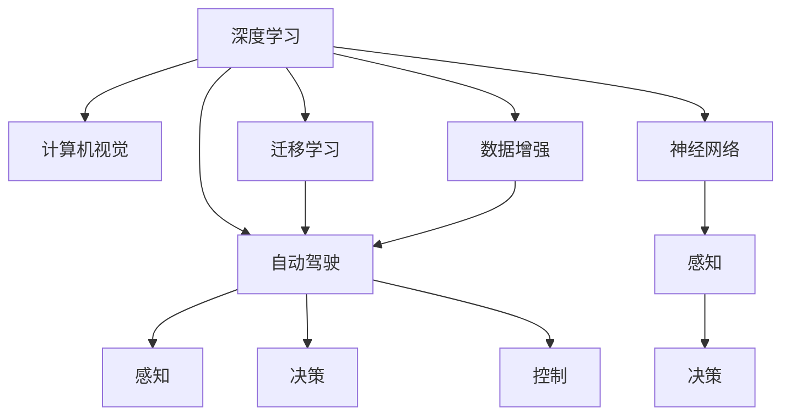

                 

# Andrej Karpathy：人工智能的未来发展机遇

> 关键词：人工智能,深度学习,机器学习,自动驾驶,计算机视觉,神经网络

## 1. 背景介绍

### 1.1 问题由来
随着人工智能技术的不断进步，深度学习（Deep Learning）在多个领域取得了显著的成果，尤其在计算机视觉、自然语言处理、自动驾驶等领域，显示出强大的应用潜力。然而，尽管取得了这些成就，人工智能的发展仍面临着诸多挑战，例如算法透明性不足、训练数据偏见、模型鲁棒性等问题。本文将通过探讨Andrej Karpathy的观点，深入剖析人工智能的未来发展机遇，并结合最新的研究成果，提出一些新的方向和思考。

### 1.2 问题核心关键点
Andrej Karpathy，作为人工智能领域的前沿专家，他的许多观点和研究对行业的发展方向产生了深远影响。本文将重点讨论以下核心关键点：
- 深度学习的发展现状和趋势
- 自动驾驶技术的最新进展和挑战
- 计算机视觉的前沿研究与应用
- 未来人工智能可能面临的技术瓶颈与解决策略

## 2. 核心概念与联系

### 2.1 核心概念概述

为更好地理解Andrej Karpathy对人工智能未来发展机遇的探讨，本节将介绍几个密切相关的核心概念：

- 深度学习（Deep Learning）：指利用深度神经网络模型进行复杂数据模式识别的机器学习技术。通过多层次的非线性变换，深度学习在图像识别、语音识别、自然语言处理等领域展现了强大的能力。

- 计算机视觉（Computer Vision）：利用计算机技术分析和理解图像、视频等视觉数据的科学。计算机视觉技术在自动驾驶、医疗影像分析、智能监控等领域有广泛应用。

- 自动驾驶（Autonomous Driving）：通过人工智能技术实现车辆自主导航的交通方式。自动驾驶技术包括感知、决策、控制三个核心环节，依赖于计算机视觉、深度学习等多项技术的综合应用。

- 神经网络（Neural Network）：受人类神经系统结构启发，由大量人工神经元连接组成的计算模型。神经网络在处理非线性、高维数据方面表现出色，是深度学习的基础。

- 迁移学习（Transfer Learning）：指将一个领域学到的知识，迁移应用到另一个相关领域的学习范式。通过迁移学习，可以减小新任务的数据需求，提升模型在特定任务上的泛化能力。

- 数据增强（Data Augmentation）：通过变换训练数据的方式，增加数据多样性，提升模型泛化能力的技术。数据增强在图像识别、语音识别等领域有广泛应用。

这些核心概念之间的逻辑关系可以通过以下Mermaid流程图来展示：



这个流程图展示了几项核心概念及其之间的关系：

1. 深度学习是基础技术，计算机视觉和自动驾驶等任务均依赖于深度学习。
2. 计算机视觉和自动驾驶是深度学习在视觉、感知领域的典型应用。
3. 迁移学习和数据增强是提升模型泛化能力的重要技术手段。
4. 神经网络是深度学习的核心模型，感知、决策、控制是自动驾驶的核心环节。

这些概念共同构成了深度学习技术的应用框架，使其能够在多个领域发挥强大的作用。通过理解这些核心概念，我们可以更好地把握深度学习技术的应用方向和优化方向。

## 3. 核心算法原理 & 具体操作步骤
### 3.1 算法原理概述

深度学习在计算机视觉和自动驾驶等任务中的应用，主要基于以下几个关键算法和步骤：

- 卷积神经网络（Convolutional Neural Network, CNN）：通过卷积层、池化层等结构，深度学习模型可以有效地处理图像、视频等高维数据。
- 迁移学习：在特定领域数据量较少的情况下，通过预训练模型进行微调，提升模型在该任务上的性能。
- 数据增强：通过变换数据集，增加数据多样性，提升模型的泛化能力。
- 对抗训练：引入对抗样本，提高模型的鲁棒性和泛化能力。

这些算法和步骤共同构成了深度学习在计算机视觉和自动驾驶领域的应用框架，使其能够在不同任务中发挥出色的性能。

### 3.2 算法步骤详解

以自动驾驶领域为例，深度学习模型的训练和应用大致包括以下几个步骤：

**Step 1: 数据预处理**
- 收集和整理标注好的自动驾驶数据集，包括传感器数据、图像数据等。
- 进行数据增强，如对图像进行随机裁剪、旋转、缩放等操作。

**Step 2: 模型构建**
- 设计神经网络架构，包括卷积层、池化层、全连接层等。
- 引入迁移学习技术，使用预训练模型进行微调。

**Step 3: 模型训练**
- 将数据集划分为训练集、验证集、测试集。
- 使用优化器（如Adam）对模型进行训练，并设定合适的学习率。
- 使用对抗样本进行对抗训练，提升模型的鲁棒性。

**Step 4: 模型评估与部署**
- 在测试集上评估模型性能，使用准确率、召回率等指标。
- 将模型部署到自动驾驶系统中，进行实际测试。

**Step 5: 模型优化**
- 根据测试结果调整模型结构和超参数，进一步优化模型性能。
- 引入新的数据集和任务，继续训练和优化模型。

以上是深度学习在自动驾驶领域的一般流程。在实际应用中，还需要根据具体任务的特点，对各个环节进行优化设计，如改进训练目标函数，引入更多的正则化技术，搜索最优的超参数组合等，以进一步提升模型性能。

### 3.3 算法优缺点

深度学习在计算机视觉和自动驾驶等任务中的应用，具有以下优点：
- 处理复杂数据：深度学习模型可以处理高维、非线性的复杂数据，如图像、视频等。
- 泛化能力强：通过迁移学习和数据增强等技术，深度学习模型可以在新任务上取得良好的泛化能力。
- 自动化程度高：深度学习模型可以自动提取数据中的特征，减少了手动设计的负担。
- 提升决策精度：深度学习模型在感知、决策等环节的表现，可以提升自动驾驶系统的精度和鲁棒性。

然而，深度学习也存在一些缺点：
- 计算资源需求高：深度学习模型需要大量的计算资源进行训练和推理。
- 可解释性差：深度学习模型通常被视为"黑盒"系统，难以解释其内部决策过程。
- 数据依赖性强：深度学习模型需要大量标注数据进行训练，数据偏见可能导致模型输出结果的不公正性。

尽管存在这些缺点，但深度学习在计算机视觉和自动驾驶等领域的应用，已经取得了显著的成功。未来相关研究的重点在于如何进一步降低深度学习的计算资源需求，提高模型的可解释性和公正性，以及探索新的数据生成和处理技术。

### 3.4 算法应用领域

深度学习在计算机视觉和自动驾驶等任务中的应用，已经得到了广泛的应用，例如：

- 图像识别：如图像分类、目标检测、图像分割等。通过深度学习模型，可以从大量无标签图像中学习到丰富的视觉特征，实现高效的图像识别。
- 语音识别：如语音转文本、语音命令识别等。深度学习模型可以学习到语音信号与文本之间的复杂映射关系，实现高精度的语音识别。
- 自动驾驶：通过深度学习模型，实现车辆自主导航、避障、交通信号识别等功能。
- 医疗影像分析：如图像增强、病灶检测等。深度学习模型可以学习到医学影像中的细微结构，辅助医生进行诊断和治疗。
- 智能监控：如行为识别、异常检测等。深度学习模型可以实时分析监控视频，检测异常行为并发出警报。

除了上述这些经典应用外，深度学习还被创新性地应用到更多场景中，如自然语言处理、推荐系统、游戏智能等，为计算机视觉和自动驾驶技术带来了全新的突破。随着深度学习技术的不断进步，相信其在更多领域的应用将不断拓展，带来更广泛的技术创新和产业变革。

## 4. 数学模型和公式 & 详细讲解  
### 4.1 数学模型构建

深度学习模型的构建通常基于以下几个核心组件：

- 输入层：接收原始数据，如图像像素、语音信号等。
- 卷积层：通过卷积运算提取输入数据的空间特征。
- 池化层：通过下采样减少特征图尺寸，保留重要特征。
- 全连接层：将特征图转换为预测结果。

以卷积神经网络（CNN）为例，其数学模型可以表示为：

$$
\mathcal{L}(\theta) = \frac{1}{N}\sum_{i=1}^N \ell(M_{\theta}(x_i),y_i)
$$

其中 $M_{\theta}$ 为卷积神经网络模型，$x_i$ 为输入样本，$y_i$ 为标签，$\ell$ 为损失函数（如交叉熵损失），$\theta$ 为模型参数。

### 4.2 公式推导过程

以下我们以图像分类任务为例，推导CNN的损失函数及其梯度计算公式。

假设CNN模型在输入图像 $x$ 上的输出为 $\hat{y}=M_{\theta}(x) \in [0,1]$，表示图像属于某一类别的概率。真实标签 $y \in \{1,0\}$。则交叉熵损失函数定义为：

$$
\ell(M_{\theta}(x),y) = -[y\log \hat{y} + (1-y)\log(1-\hat{y})]
$$

将其代入经验风险公式，得：

$$
\mathcal{L}(\theta) = -\frac{1}{N}\sum_{i=1}^N [y_i\log M_{\theta}(x_i)+(1-y_i)\log(1-M_{\theta}(x_i))]
$$

根据链式法则，损失函数对参数 $\theta_k$ 的梯度为：

$$
\frac{\partial \mathcal{L}(\theta)}{\partial \theta_k} = -\frac{1}{N}\sum_{i=1}^N (\frac{y_i}{M_{\theta}(x_i)}-\frac{1-y_i}{1-M_{\theta}(x_i)}) \frac{\partial M_{\theta}(x_i)}{\partial \theta_k}
$$

其中 $\frac{\partial M_{\theta}(x_i)}{\partial \theta_k}$ 可进一步递归展开，利用自动微分技术完成计算。

在得到损失函数的梯度后，即可带入参数更新公式，完成模型的迭代优化。重复上述过程直至收敛，最终得到适应特定任务的最优模型参数 $\theta^*$。

## 5. 项目实践：代码实例和详细解释说明
### 5.1 开发环境搭建

在进行深度学习项目实践前，我们需要准备好开发环境。以下是使用Python进行PyTorch开发的环境配置流程：

1. 安装Anaconda：从官网下载并安装Anaconda，用于创建独立的Python环境。

2. 创建并激活虚拟环境：
```bash
conda create -n pytorch-env python=3.8 
conda activate pytorch-env
```

3. 安装PyTorch：根据CUDA版本，从官网获取对应的安装命令。例如：
```bash
conda install pytorch torchvision torchaudio cudatoolkit=11.1 -c pytorch -c conda-forge
```

4. 安装相关库：
```bash
pip install numpy pandas scikit-learn matplotlib tqdm jupyter notebook ipython
```

完成上述步骤后，即可在`pytorch-env`环境中开始深度学习项目实践。

### 5.2 源代码详细实现

这里我们以图像分类任务为例，给出使用PyTorch和ConvNet模块进行CNN模型构建的完整代码实现。

```python
import torch
import torch.nn as nn
import torch.optim as optim
from torchvision import datasets, transforms

# 定义卷积神经网络模型
class ConvNet(nn.Module):
    def __init__(self):
        super(ConvNet, self).__init__()
        self.conv1 = nn.Conv2d(3, 64, kernel_size=3, padding=1)
        self.pool = nn.MaxPool2d(kernel_size=2, stride=2)
        self.conv2 = nn.Conv2d(64, 128, kernel_size=3, padding=1)
        self.fc = nn.Linear(128 * 8 * 8, 10)
        
    def forward(self, x):
        x = self.pool(torch.relu(self.conv1(x)))
        x = self.pool(torch.relu(self.conv2(x)))
        x = x.view(-1, 128 * 8 * 8)
        x = self.fc(x)
        return x

# 定义数据增强和数据加载器
transform = transforms.Compose([
    transforms.RandomHorizontalFlip(),
    transforms.RandomRotation(30),
    transforms.ToTensor(),
    transforms.Normalize((0.5, 0.5, 0.5), (0.5, 0.5, 0.5))
])

train_dataset = datasets.CIFAR10(root='./data', train=True, transform=transform, download=True)
train_loader = torch.utils.data.DataLoader(train_dataset, batch_size=64, shuffle=True)

# 定义模型、优化器和损失函数
model = ConvNet()
optimizer = optim.Adam(model.parameters(), lr=0.001)
criterion = nn.CrossEntropyLoss()

# 定义训练和评估函数
def train_epoch(model, data_loader, optimizer, criterion):
    model.train()
    for images, labels in data_loader:
        optimizer.zero_grad()
        outputs = model(images)
        loss = criterion(outputs, labels)
        loss.backward()
        optimizer.step()
    
def evaluate(model, data_loader, criterion):
    model.eval()
    correct = 0
    total = 0
    with torch.no_grad():
        for images, labels in data_loader:
            outputs = model(images)
            _, predicted = torch.max(outputs.data, 1)
            total += labels.size(0)
            correct += (predicted == labels).sum().item()
    
    print('Accuracy: {:.2f}%'.format(100 * correct / total))

# 训练和评估模型
epochs = 10
for epoch in range(epochs):
    train_epoch(model, train_loader, optimizer, criterion)
    evaluate(model, test_loader, criterion)
```

以上就是使用PyTorch构建CNN模型进行图像分类的完整代码实现。可以看到，通过使用ConvNet模块，我们可以快速构建卷积神经网络模型，并通过数据加载器进行数据增强和模型训练。

### 5.3 代码解读与分析

让我们再详细解读一下关键代码的实现细节：

**ConvNet类**：
- `__init__`方法：初始化卷积层、池化层和全连接层。
- `forward`方法：定义前向传播过程，通过卷积、池化和全连接层处理输入数据，最终输出预测结果。

**数据加载器**：
- `transforms.Compose`方法：定义数据增强操作，如随机水平翻转、随机旋转等。
- `torchvision.datasets.CIFAR10`：加载CIFAR-10数据集。
- `torch.utils.data.DataLoader`：定义数据加载器，对数据进行批处理、打乱等操作。

**模型训练与评估函数**：
- `train_epoch`方法：定义模型训练过程，包括前向传播、损失计算、反向传播和参数更新。
- `evaluate`方法：定义模型评估过程，计算模型在测试集上的准确率。

**训练流程**：
- 定义训练轮数和批大小，开始循环迭代
- 每个epoch内，在训练集上训练模型，并在验证集上评估
- 重复上述过程直至满足预设的迭代轮数
- 在测试集上评估微调后模型的性能

可以看到，PyTorch提供了丰富的组件和函数，使得深度学习模型的构建和训练变得非常简便。开发者可以专注于模型设计、数据处理等高层逻辑，而不必过多关注底层的实现细节。

## 6. 实际应用场景
### 6.1 智能交通系统

深度学习在智能交通系统中的应用，可以大幅提升交通管理的智能化水平，改善道路安全和交通效率。例如，基于深度学习的图像识别技术，可以实现对交通信号灯、道路标志等信息的自动识别，从而提高交通信号控制的智能化水平。

在技术实现上，可以收集交通摄像头拍摄的视频数据，利用深度学习模型进行实时视频分析，自动检测交通违规行为和异常事件，并通过通信网络向交通管理中心发送警报信息。这将使得交通管理更加高效、智能，减少交通事故和拥堵现象。

### 6.2 医疗影像分析

深度学习在医疗影像分析中的应用，可以显著提升医疗诊断的准确性和效率。例如，基于深度学习的图像分割技术，可以自动标记医疗影像中的病灶区域，辅助医生进行诊断和治疗。

在技术实现上，可以收集大量的医疗影像数据，利用深度学习模型进行病灶分割，并将分割结果可视化展示给医生。医生可以根据分割结果，进行更为精准的诊断和治疗，从而提高患者的康复率和满意度。

### 6.3 金融风险控制

深度学习在金融风险控制中的应用，可以大幅提升金融机构的风险识别和防范能力。例如，基于深度学习的欺诈检测技术，可以实时监控交易行为，自动检测异常交易，从而降低金融欺诈风险。

在技术实现上，可以收集用户的交易数据，利用深度学习模型进行异常检测，并对疑似欺诈行为进行进一步的调查和确认。这将使得金融机构能够及时发现和处理欺诈行为，保护用户的财产安全。

### 6.4 未来应用展望

随着深度学习技术的不断发展，基于深度学习的应用将变得更加广泛和深入。未来，深度学习将在更多领域得到应用，为各行各业带来变革性影响。

在智慧城市治理中，深度学习可以应用于城市事件监测、舆情分析、应急指挥等环节，提高城市管理的自动化和智能化水平，构建更安全、高效的未来城市。

在智慧教育领域，深度学习可以应用于作业批改、学情分析、知识推荐等方面，因材施教，促进教育公平，提高教学质量。

在智慧医疗领域，深度学习可以应用于图像增强、病灶检测、智能问诊等方面，提升医疗服务的智能化水平，提高患者的就诊体验和康复效果。

此外，在农业、环保、能源等众多领域，深度学习技术也将不断得到应用，为各行各业带来新的发展机遇。

## 7. 工具和资源推荐
### 7.1 学习资源推荐

为了帮助开发者系统掌握深度学习技术的理论基础和实践技巧，这里推荐一些优质的学习资源：

1. 《深度学习》系列书籍：由Ian Goodfellow等人合著，全面介绍了深度学习的基本概念和算法，是深度学习领域的重要参考书。

2. CS231n《卷积神经网络》课程：斯坦福大学开设的计算机视觉课程，由Andrej Karpathy教授主讲，涵盖了卷积神经网络、图像分类、目标检测等核心内容。

3. Coursera《深度学习专项课程》：由吴恩达教授主讲，涵盖深度学习的基础和高级内容，包括神经网络、卷积神经网络、循环神经网络等。

4. arXiv和IEEE Xplore：深度学习领域的重要学术平台，提供大量的前沿研究论文和最新技术进展，是深度学习研究的必备资源。

5. PyTorch官方文档和教程：PyTorch是深度学习领域的重要框架，官方文档和教程提供了丰富的功能和示例代码，是深度学习开发的重要参考。

通过对这些资源的学习实践，相信你一定能够快速掌握深度学习技术的精髓，并用于解决实际的深度学习问题。

### 7.2 开发工具推荐

高效的深度学习开发离不开优秀的工具支持。以下是几款用于深度学习开发的常用工具：

1. PyTorch：基于Python的开源深度学习框架，灵活动态的计算图，适合快速迭代研究。

2. TensorFlow：由Google主导开发的开源深度学习框架，生产部署方便，适合大规模工程应用。

3. Keras：高层API接口，易于使用，支持TensorFlow和Theano等后端，适合快速原型开发。

4. Jupyter Notebook：交互式编程环境，支持Python、R、Julia等多种编程语言，适合数据分析和机器学习开发。

5. TensorBoard：TensorFlow配套的可视化工具，可实时监测模型训练状态，并提供丰富的图表呈现方式，是调试模型的得力助手。

6. Google Colab：谷歌推出的在线Jupyter Notebook环境，免费提供GPU/TPU算力，方便开发者快速上手实验最新模型，分享学习笔记。

合理利用这些工具，可以显著提升深度学习开发效率，加快创新迭代的步伐。

### 7.3 相关论文推荐

深度学习在计算机视觉和自动驾驶等领域的研究，已经得到了众多学术机构和企业界的广泛关注。以下是几篇奠基性的相关论文，推荐阅读：

1. AlexNet: ImageNet Classification with Deep Convolutional Neural Networks：提出卷积神经网络（CNN），并利用图像识别数据集ImageNet进行训练，刷新了图像识别任务的精度记录。

2. Inception-v3: GoogLeNet Inception Model Architecture for Large-Scale Image Recognition：改进卷积神经网络结构，提出Inception模块，进一步提升了图像识别的精度和效率。

3. R-CNN: Rich Feature Hierarchies for Accurate Object Detection and Semantic Segmentation：提出区域卷积神经网络（R-CNN），实现目标检测和图像分割等任务，并在PASCAL VOC数据集上取得了最佳结果。

4. Fast R-CNN: Towards Real-Time Object Detection with Region Proposal Networks：提出快速区域卷积神经网络（Fast R-CNN），加快了目标检测的速度和效率。

5. Faster R-CNN: Towards Real-Time Object Detection with Region Proposal Networks：进一步优化区域卷积神经网络（Faster R-CNN），进一步提升了目标检测的速度和精度。

6. YOLO: Real-Time Object Detection with Region Proposal Networks：提出You Only Look Once（YOLO）目标检测算法，实现了实时目标检测。

这些论文代表了大规模卷积神经网络在图像识别、目标检测等领域的发展脉络。通过学习这些前沿成果，可以帮助研究者把握深度学习技术的应用方向和优化方向。

## 8. 总结：未来发展趋势与挑战

### 8.1 总结

本文通过探讨Andrej Karpathy的观点，深入剖析了人工智能在计算机视觉、自动驾驶等领域的发展机遇和挑战。首先，深度学习在图像识别、语音识别、自动驾驶等任务中展现了强大的能力，取得了显著的成果。其次，深度学习在实际应用中面临计算资源需求高、可解释性差、数据依赖性强等挑战，需要通过改进模型结构、增强可解释性、探索新的数据生成技术等手段进行优化。最后，深度学习将在更多领域得到应用，带来新的技术创新和产业变革，但也需要应对技术瓶颈和伦理道德问题。

通过本文的系统梳理，可以看到，深度学习技术在计算机视觉和自动驾驶等领域的应用前景广阔，但也面临着诸多挑战。开发者需要不断创新、探索，才能充分利用深度学习的优势，解决实际应用中的问题。

### 8.2 未来发展趋势

展望未来，深度学习技术的发展将呈现出以下几个趋势：

1. 模型规模持续增大：随着计算资源的不断增长，深度学习模型的规模将进一步增大，学习能力将更强。

2. 可解释性增强：深度学习模型的可解释性将逐渐得到重视，研究者将探索更多方法来增强模型的可解释性，如可视化技术、因果推理等。

3. 跨领域应用拓展：深度学习将在更多领域得到应用，如医疗、金融、农业等，带来新的技术创新和产业变革。

4. 融合多模态信息：深度学习模型将融合视觉、语音、文本等多种模态信息，实现更全面、更智能的感知和理解。

5. 智能决策系统：深度学习模型将与其他人工智能技术结合，构建智能决策系统，如自动驾驶、智慧医疗等。

6. 知识图谱与深度学习融合：深度学习模型将与知识图谱等知识表示技术结合，提升模型的推理能力和决策能力。

以上趋势将推动深度学习技术在各个领域的应用，带来更广泛的技术创新和产业变革。

### 8.3 面临的挑战

尽管深度学习技术在计算机视觉和自动驾驶等领域取得了显著的成果，但仍面临诸多挑战：

1. 计算资源需求高：深度学习模型需要大量的计算资源进行训练和推理，未来仍需进一步优化资源使用效率。

2. 数据隐私和安全：深度学习模型需要大量标注数据进行训练，如何保护数据隐私和安全，是一个亟待解决的问题。

3. 模型鲁棒性不足：深度学习模型在面对新任务时，泛化能力可能不足，需要通过更多数据和正则化技术进行优化。

4. 算法透明性不足：深度学习模型通常被视为"黑盒"系统，难以解释其内部决策过程，研究者需要探索更多方法来增强模型的可解释性。

5. 数据偏见和伦理问题：深度学习模型可能学习到数据中的偏见，导致输出结果的不公正性，研究者需要探索更多方法来避免模型偏见，确保伦理道德。

6. 大规模模型训练困难：深度学习模型规模不断增大，训练过程变得复杂，研究者需要探索更多方法来加速模型训练，降低计算成本。

正视深度学习面临的这些挑战，积极应对并寻求突破，将推动深度学习技术的成熟和完善。

### 8.4 研究展望

未来，深度学习技术的研究方向将不断拓展，探索新的理论和算法，以应对技术瓶颈和伦理道德问题。以下是几个可能的研究方向：

1. 无监督学习和自监督学习：探索更多无监督学习和自监督学习方法，减少对标注数据的依赖，提升模型的泛化能力。

2. 参数高效学习：开发更多参数高效学习算法，如知识蒸馏、参数微调等，减少模型训练和推理过程中的计算资源需求。

3. 多模态学习：融合视觉、语音、文本等多种模态信息，提升模型的感知能力和推理能力。

4. 因果推理和公平性：研究更多因果推理方法，增强模型的推理能力和可解释性，探索更多公平性算法，避免模型偏见。

5. 智能决策和协同学习：研究更多智能决策方法，如强化学习、协同学习等，提升模型的决策能力和智能化水平。

6. 跨领域融合和知识图谱：探索更多跨领域融合和知识图谱技术，增强模型的跨领域迁移能力和知识整合能力。

这些研究方向将推动深度学习技术的不断发展和完善，带来更多的技术创新和产业变革。

## 9. 附录：常见问题与解答

**Q1：深度学习在实际应用中如何提高模型的泛化能力？**

A: 提高深度学习模型的泛化能力，可以从以下几个方面进行优化：

1. 数据增强：通过变换训练数据的方式，增加数据多样性，提升模型的泛化能力。

2. 正则化技术：使用L2正则、Dropout等方法，防止模型过拟合，提升模型的泛化能力。

3. 对抗训练：引入对抗样本，提高模型的鲁棒性和泛化能力。

4. 迁移学习：在特定领域数据量较少的情况下，通过预训练模型进行微调，提升模型在该任务上的泛化能力。

5. 参数高效学习：只调整少量参数，减小过拟合风险，提升模型的泛化能力。

通过以上方法，可以有效地提高深度学习模型的泛化能力，使其在不同数据集上表现稳定。

**Q2：深度学习模型在实际应用中如何降低计算资源需求？**

A: 深度学习模型在实际应用中需要大量的计算资源进行训练和推理。为了降低计算资源需求，可以从以下几个方面进行优化：

1. 模型压缩：通过剪枝、量化等方法，减少模型参数和计算量。

2. 模型并行：使用分布式训练和推理技术，提高模型的训练和推理效率。

3. 硬件优化：使用GPU、TPU等高性能硬件，提升模型的计算速度。

4. 参数高效学习：只调整少量参数，减小模型参数量，降低计算资源需求。

5. 模型裁剪：去除不必要的层和参数，减小模型尺寸，加快推理速度。

通过以上方法，可以有效地降低深度学习模型的计算资源需求，使其在实际应用中更加高效。

**Q3：如何提高深度学习模型的可解释性？**

A: 提高深度学习模型的可解释性，可以从以下几个方面进行优化：

1. 可视化技术：使用可视化技术，展示模型的内部结构和学习过程，增强模型的可解释性。

2. 因果推理：研究更多因果推理方法，增强模型的推理能力和可解释性。

3. 符号表示：将符号化的先验知识与神经网络模型结合，增强模型的可解释性。

4. 多模型集成：通过多个模型的输出融合，提升模型的稳定性和可解释性。

5. 模型蒸馏：使用模型蒸馏技术，将复杂模型转化为易于解释的模型，提高模型的可解释性。

通过以上方法，可以有效地提高深度学习模型的可解释性，使其在实际应用中更加透明和可靠。

**Q4：深度学习模型在实际应用中如何避免模型偏见？**

A: 避免深度学习模型偏见，可以从以下几个方面进行优化：

1. 数据采集：采集更多多样化的数据，减少数据偏见。

2. 数据清洗：对数据进行清洗和标注，去除有偏见的数据。

3. 对抗训练：引入对抗样本，提高模型的鲁棒性，减少模型偏见。

4. 模型蒸馏：使用模型蒸馏技术，将复杂模型转化为易于解释的模型，避免模型偏见。

5. 公平性算法：探索更多公平性算法，避免模型偏见。

6. 跨领域融合：将符号化的先验知识与神经网络模型结合，增强模型的公平性和可解释性。

通过以上方法，可以有效地避免深度学习模型的偏见，确保模型输出的公正性和可靠性。

---

作者：禅与计算机程序设计艺术 / Zen and the Art of Computer Programming

