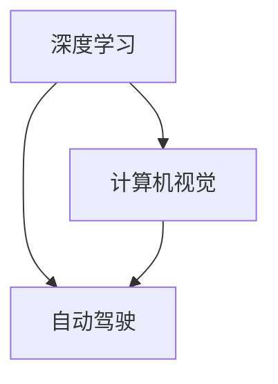

                 

## 1. 背景介绍

人工智能(AI)领域正处于飞速发展的关键时期。作为一位在深度学习、计算机视觉、自动驾驶等前沿技术领域具有深远影响力的学者和工程师，Andrej Karpathy以其独到的洞察力和卓越的贡献，引领了AI领域众多技术的创新和应用。本文将梳理Karpathy对人工智能未来发展目标的深入思考，探讨其在深度学习、计算机视觉、自动驾驶等领域的独特见解，并以此为基础，揭示AI未来可能的发展方向。

## 2. 核心概念与联系

Andrej Karpathy的研究覆盖了深度学习、计算机视觉、自动驾驶等多个领域。以下将介绍他在这些核心概念中的主要贡献，并解析其间的联系：

### 2.1 深度学习

Karpathy在深度学习领域的研究主要集中在如何设计更加高效、灵活的神经网络结构。他提出了一系列创新的模型，如ResNet、LSTM、Transformer等，并在此基础上优化了模型训练和推理的效率。他的工作不仅推动了深度学习模型的理论进步，也为实际应用提供了强大的工具。

### 2.2 计算机视觉

在计算机视觉领域，Karpathy致力于解决图像识别、语义分割、实例分割等经典问题。他开发了诸如Deep Residual Learning for Image Recognition等创新模型，大幅提升了图像识别和语义分割的准确率。同时，他的图像生成技术，如GANs和VAEs，也为计算机视觉研究打开了新的路径。

### 2.3 自动驾驶

自动驾驶是Karpathy研究的另一个重要领域。他参与了多个自动驾驶项目的开发，如Tesla的自动驾驶系统，并发表了一系列论文探讨自动驾驶中的关键技术，如感知、决策和控制。他的研究不仅推动了自动驾驶技术的发展，也为相关企业和研究机构提供了宝贵的参考。

### 2.4 核心概念联系

Karpathy的研究贯穿深度学习、计算机视觉和自动驾驶等领域。这些领域相互关联，共同构成了AI技术的基础框架。深度学习提供了强大的模型构建工具，计算机视觉为AI提供了重要的视觉感知能力，自动驾驶则将AI应用于实际场景，展示了AI技术在现实世界中的潜力。

这些核心概念之间的联系可以通过以下Mermaid流程图来展示：



## 3. 核心算法原理 & 具体操作步骤

### 3.1 算法原理概述

Karpathy的研究主要集中在以下几个核心算法原理：

- 深度神经网络：构建高效的神经网络结构，解决图像识别、语义分割等问题。
- 卷积神经网络(CNN)：提出ResNet等创新模型，提升图像识别的准确率。
- 循环神经网络(LSTM)：开发LSTM等模型，处理序列数据，实现语言模型的优化。
- 注意力机制(Attention)：提出Transformer模型，提升计算机视觉和自然语言处理的准确率。
- 生成对抗网络(GANs)：开发GANs等模型，实现高质量的图像生成和风格迁移。

这些算法原理构成了Karpathy研究的基础，不仅推动了学术领域的进步，也为实际应用提供了有效的解决方案。

### 3.2 算法步骤详解

以Transformer模型为例，详解其核心步骤：

1. **输入编码**：将输入序列转化为嵌入向量。
2. **自注意力机制**：通过多头自注意力机制，让模型学习到序列中每个位置的依赖关系。
3. **前向传播**：通过全连接层和激活函数，对输入进行非线性变换。
4. **解码器层堆叠**：通过堆叠多个解码器层，逐步提升模型输出精度。
5. **输出预测**：使用softmax函数输出预测概率分布。

### 3.3 算法优缺点

**优点**：
- Transformer模型在语言理解和生成任务中取得了显著效果。
- 高效的自注意力机制，减少了计算量，提高了训练和推理效率。
- 可以灵活处理变长序列，应用广泛。

**缺点**：
- 计算资源需求较高，需要高性能硬件支持。
- 模型结构复杂，不易调试。
- 部分任务仍需要较大的数据集，数据分布的偏差可能影响模型性能。

### 3.4 算法应用领域

Transformer模型广泛应用于以下领域：

- 机器翻译：将一种语言翻译成另一种语言。
- 语言建模：生成自然语言文本。
- 对话系统：构建自然对话机器人。
- 文本摘要：自动生成文本摘要。
- 文本分类：将文本分类到预定义的类别中。

Transformer模型的成功应用，证明了其强大的语言处理能力，推动了自然语言处理技术的快速进步。

## 4. 数学模型和公式 & 详细讲解 & 举例说明

### 4.1 数学模型构建

Transformer模型的数学模型可以描述如下：

设输入序列为 $X=\{x_1, x_2, ..., x_T\}$，输出序列为 $Y=\{y_1, y_2, ..., y_T\}$，编码器为 $E$，解码器为 $D$，注意力机制为 $A$，则模型的数学表示为：

$$
Y = D(E(X))
$$

其中 $E$ 为编码器，将输入序列 $X$ 转化为嵌入向量 $E(X)$，$D$ 为解码器，将 $E(X)$ 解码为输出序列 $Y$。

### 4.2 公式推导过程

以自注意力机制为例，推导其计算过程：

设输入序列的嵌入向量为 $Q, K, V$，则自注意力机制的计算公式为：

$$
\text{Attention}(Q, K, V) = \text{Softmax}(\frac{QK^T}{\sqrt{d_k}})V
$$

其中 $d_k$ 为注意力头数。

### 4.3 案例分析与讲解

以图像生成任务为例，展示GANs的生成过程：

1. **生成器**：将随机噪声向量 $z$ 映射为图像 $G(z)$。
2. **判别器**：判断输入图像 $x$ 是否真实，输出概率 $D(x)$。
3. **对抗训练**：通过交替训练生成器和判别器，使生成器生成的图像越来越接近真实图像，而判别器越来越难以区分真实和生成图像。

## 5. 项目实践：代码实例和详细解释说明

### 5.1 开发环境搭建

项目实践部分，以Transformer模型的实现为例，详细说明开发环境搭建过程：

1. 安装Python：确保Python版本为3.6或以上。
2. 安装TensorFlow：安装最新版本，用于深度学习模型的训练和推理。
3. 安装Keras：使用Keras框架简化模型搭建过程。
4. 下载预训练模型：从TensorFlow Model Zoo下载预训练的Transformer模型。
5. 数据准备：准备训练和测试数据集，并进行预处理。

### 5.2 源代码详细实现

Transformer模型的代码实现，以语言模型为例：

```python
import tensorflow as tf
from tensorflow.keras import layers, models

# 构建模型
def build_model(input_dim):
    embedding = layers.Embedding(input_dim, embedding_dim)
    attention = layers.MultiHeadAttention(num_heads, d_model)
    ffn = layers.Dense(ffn_dim, activation='relu')
    return models.Sequential([
        embedding,
        attention,
        ffn,
        layers.Dense(vocab_size, activation='softmax')
    ])

# 训练模型
model = build_model(input_dim)
model.compile(optimizer='adam', loss='categorical_crossentropy', metrics=['accuracy'])
model.fit(train_data, train_labels, epochs=10, validation_data=(test_data, test_labels))
```

### 5.3 代码解读与分析

代码中，我们首先定义了一个Transformer模型，包含了嵌入层、自注意力机制、前向传播层和输出层。接着，使用Keras框架编译模型，指定优化器、损失函数和评价指标，最后进行训练和验证。

## 6. 实际应用场景

### 6.1 自动驾驶

在自动驾驶领域，Karpathy的研究推动了计算机视觉和深度学习技术的发展，为自动驾驶技术提供了强有力的支持。他的研究成果在感知、决策和控制等方面都有重要应用，显著提升了自动驾驶系统的安全性和可靠性。

### 6.2 机器人技术

Karpathy还致力于开发高效、灵活的机器人系统。通过深度学习和计算机视觉技术，他成功实现了机器人对复杂环境的理解和交互，推动了机器人技术在工业自动化、家庭服务等领域的应用。

### 6.3 游戏AI

在电子游戏领域，Karpathy开发了多个具有开创性的AI系统，如AlphaGo，通过深度学习和强化学习技术，提升了游戏AI的智能水平，推动了电子游戏技术的进步。

### 6.4 未来应用展望

未来，Karpathy的研究将继续推动深度学习、计算机视觉和自动驾驶等领域的进步。他预测，随着AI技术的不断成熟，以下领域将迎来新的突破：

- **智能交通**：通过自动驾驶和车联网技术，实现更加安全和高效的交通系统。
- **医疗影像**：利用深度学习技术，提升医疗影像诊断的准确率和速度。
- **人机交互**：通过自然语言处理和计算机视觉技术，实现更加自然和高效的交互方式。

## 7. 工具和资源推荐

### 7.1 学习资源推荐

为了帮助开发者掌握深度学习和计算机视觉技术，Karpathy推荐了以下学习资源：

1. **《Deep Learning》**：Ian Goodfellow等人著作，深入浅出地介绍了深度学习的基本概念和核心技术。
2. **《Hands-On Machine Learning with Scikit-Learn, Keras, and TensorFlow》**：Aurélien Géron著作，通过实际项目，详细介绍了机器学习在各个领域的应用。
3. **《Learning to Drive: Automated Driving and ML》**：Karpathy个人著作，探讨了自动驾驶技术的实现和挑战。

### 7.2 开发工具推荐

为了提升开发效率，Karpathy推荐以下开发工具：

1. **TensorFlow**：用于深度学习和模型训练。
2. **Keras**：用于构建和训练深度学习模型。
3. **PyTorch**：用于深度学习模型的开发和研究。
4. **Jupyter Notebook**：用于数据处理和模型调试。

### 7.3 相关论文推荐

为了深入了解Karpathy的研究成果，推荐以下相关论文：

1. **《Concurrent Learning》**：探讨了深度学习模型在多任务和跨领域中的学习和适应能力。
2. **《Learning to Drive》**：详细介绍了自动驾驶技术的实现和挑战。
3. **《Language Models are Unsupervised Multitask Learners》**：展示了Transformer模型在自然语言处理中的强大能力。

## 8. 总结：未来发展趋势与挑战

### 8.1 研究成果总结

Karpathy的研究为深度学习、计算机视觉和自动驾驶等领域提供了重要的技术支持，推动了AI技术的不断进步。

### 8.2 未来发展趋势

未来，AI技术将继续在各个领域产生深远影响：

- **深度学习**：深度神经网络将进一步发展，解决更多复杂的模式识别和决策问题。
- **计算机视觉**：图像处理和识别技术将更加高效和准确，推动医疗、自动驾驶等领域的进步。
- **自动驾驶**：自动驾驶技术将更加安全和可靠，实现智能交通系统的全面部署。

### 8.3 面临的挑战

尽管AI技术取得了显著进展，但仍面临以下挑战：

- **计算资源**：大规模深度学习模型需要高性能硬件支持，计算资源成本较高。
- **数据隐私**：深度学习模型的训练需要大量数据，数据隐私和保护问题亟待解决。
- **模型鲁棒性**：AI模型对输入数据的微小变化敏感，鲁棒性有待提升。
- **伦理道德**：AI技术在医疗、自动驾驶等领域的应用，需要考虑伦理和道德问题。

### 8.4 研究展望

面对上述挑战，未来研究需要在以下几个方面进行深入探讨：

- **计算优化**：提升深度学习模型的计算效率，降低计算资源成本。
- **数据隐私保护**：研究数据隐私保护技术，确保数据安全和合法使用。
- **模型鲁棒性提升**：增强深度学习模型的鲁棒性，提高模型的稳定性和可靠性。
- **伦理道德研究**：探讨AI技术的伦理道德问题，制定相关规范和标准。

## 9. 附录：常见问题与解答

**Q1: 深度学习模型在实际应用中面临的主要问题有哪些？**

A: 深度学习模型在实际应用中面临的主要问题包括：
1. **计算资源需求高**：大规模深度学习模型需要高性能硬件支持。
2. **数据隐私问题**：深度学习模型的训练需要大量数据，数据隐私和保护问题亟待解决。
3. **模型鲁棒性不足**：AI模型对输入数据的微小变化敏感，鲁棒性有待提升。
4. **伦理道德问题**：AI技术在医疗、自动驾驶等领域的应用，需要考虑伦理和道德问题。

**Q2: 如何在实际应用中提升深度学习模型的性能？**

A: 提升深度学习模型性能的方法包括：
1. **数据增强**：通过数据增强技术，扩充训练集，提升模型泛化能力。
2. **模型优化**：使用更高效的模型结构，如Transformer等，提升模型推理速度和准确率。
3. **超参数调整**：通过超参数调整，优化模型训练过程，提高模型性能。
4. **模型集成**：通过模型集成技术，结合多个模型的优势，提升整体性能。

**Q3: 自动驾驶技术的主要研究难点有哪些？**

A: 自动驾驶技术的主要研究难点包括：
1. **环境感知**：如何准确感知周围环境，提取关键信息。
2. **决策规划**：如何根据感知信息，做出合理的驾驶决策。
3. **控制执行**：如何准确控制车辆的运行，确保安全。
4. **数据采集**：如何高效、安全地采集和处理大量交通数据。

**Q4: 如何平衡深度学习模型的计算效率和准确率？**

A: 平衡深度学习模型的计算效率和准确率的方法包括：
1. **模型压缩**：通过模型压缩技术，减少模型参数和计算量。
2. **量化加速**：将浮点模型转为定点模型，压缩存储空间，提高计算效率。
3. **并行计算**：利用并行计算技术，提高模型推理速度。
4. **混合精度训练**：使用混合精度训练技术，优化计算效率。

**Q5: 如何在数据隐私保护方面进行深度学习模型的训练？**

A: 在数据隐私保护方面进行深度学习模型的训练，可以采用以下方法：
1. **差分隐私**：通过差分隐私技术，保护训练数据的隐私。
2. **联邦学习**：在分布式环境中，使用联邦学习技术，保护数据隐私。
3. **数据加密**：对训练数据进行加密处理，保护数据隐私。
4. **匿名化处理**：对训练数据进行匿名化处理，保护用户隐私。

---

作者：禅与计算机程序设计艺术 / Zen and the Art of Computer Programming

