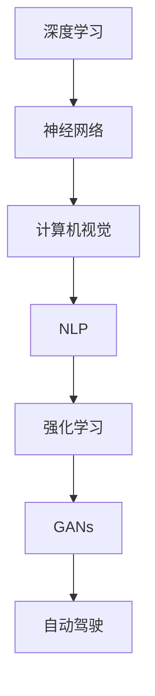

                 

# Andrej Karpathy：人工智能的未来发展趋势

> 关键词：深度学习，神经网络，计算机视觉，自然语言处理，强化学习，AI研究前沿，技术发展趋势

## 1. 背景介绍

### 1.1 问题由来
Andrej Karpathy，斯坦福大学教授、深度学习领域的知名专家，在计算机视觉和自然语言处理领域有着卓越的贡献。他在深度学习、生成对抗网络(GANs)和自动驾驶技术等方面的研究，不仅推动了学术界的进展，也为工业界提供了宝贵的技术支持。本文将基于Andrej Karpathy的最新研究成果和公开演讲，探讨人工智能技术的未来发展趋势。

### 1.2 问题核心关键点
探讨AI技术的未来发展趋势，需要从多个角度进行深入分析，包括但不限于以下关键点：

1. **深度学习与神经网络**：研究深度学习技术在计算机视觉、自然语言处理等领域的最新进展。
2. **计算机视觉**：探讨计算机视觉技术在自动驾驶、机器人视觉等实际应用中的突破。
3. **自然语言处理**：分析自然语言处理技术在语音识别、文本生成等方向的发展。
4. **强化学习**：探讨强化学习在智能游戏、机器人控制等领域的进展。
5. **AI研究前沿**：总结Andrej Karpathy在深度学习领域的最新研究成果和技术突破。
6. **技术发展趋势**：预测未来AI技术在各领域的普及与应用前景。

这些关键点将帮助我们全面理解AI技术的现状及未来发展方向，对从事AI研究与应用的开发者和学者具有重要的参考价值。

## 2. 核心概念与联系

### 2.1 核心概念概述

为更好地理解Andrej Karpathy的研究方向和技术观点，本节将介绍几个核心的概念及其相互关系：

- **深度学习**：一种模拟人脑神经网络结构和功能的前馈神经网络，通过多层非线性变换实现复杂数据模型的表示和预测。
- **神经网络**：由大量人工神经元组成的网络，用于处理和分析复杂数据，如图像、声音、文本等。
- **计算机视觉**：使计算机能够理解和解释视觉信息，实现图像识别、目标检测、场景理解等功能。
- **自然语言处理(NLP)**：使计算机能够理解和生成自然语言，实现文本分类、机器翻译、情感分析等任务。
- **强化学习**：通过试错机制，让智能体在与环境的交互中不断学习最优策略，应用于游戏、机器人控制等领域。
- **生成对抗网络(GANs)**：由生成器和判别器两个网络组成，通过对抗训练提升生成器的生成能力。
- **自动驾驶**：使车辆能够自主导航、识别道路标志、避开障碍物等功能，实现高度自动化驾驶。

这些核心概念之间的逻辑关系可以通过以下Mermaid流程图来展示：



这个流程图展示了深度学习和神经网络的基础作用，计算机视觉、自然语言处理、强化学习等特定应用领域的技术发展，以及生成对抗网络和自动驾驶技术的前沿研究。

## 3. 核心算法原理 & 具体操作步骤

### 3.1 算法原理概述

Andrej Karpathy的研究工作主要集中在以下几个领域：

1. **深度学习与神经网络**：他提出了卷积神经网络(CNNs)和循环神经网络(RNNs)的优化方法和架构设计，推动了计算机视觉和自然语言处理技术的进步。
2. **计算机视觉**：他在自动驾驶技术、机器人视觉等领域的研究，通过多任务学习、无监督学习等技术，提升了计算机视觉系统的准确性和鲁棒性。
3. **自然语言处理**：他开发了基于序列到序列(Seq2Seq)模型的机器翻译系统和文本生成系统，提升了NLP任务的效果。
4. **强化学习**：他研究了深度强化学习在智能游戏中的应用，通过多目标优化和策略梯度等技术，提升了AI游戏中的表现。
5. **生成对抗网络(GANs)**：他提出了GANs在图像生成、视频处理等方面的应用，提升了生成模型的质量。
6. **自动驾驶**：他领导了MIT自动驾驶项目，通过集成视觉、激光雷达等多模态数据，实现了车辆的高精度定位和避障功能。

这些算法和技术的核心原理和操作步骤如下：

### 3.2 算法步骤详解

以**深度学习与神经网络**为例，以下是其核心算法步骤：

1. **数据准备**：收集、清洗和标注训练数据。
2. **模型设计**：选择合适的神经网络架构，如CNNs、RNNs等。
3. **模型训练**：使用反向传播算法优化模型参数，最小化损失函数。
4. **模型验证**：在验证集上评估模型性能，调整模型参数。
5. **模型测试**：在测试集上最终评估模型性能，部署到实际应用中。

### 3.3 算法优缺点

深度学习和神经网络具有以下优点：

- **处理能力强大**：能够处理复杂的非线性关系，适用于图像、声音、文本等数据。
- **应用广泛**：广泛应用于计算机视觉、自然语言处理、自动驾驶等领域。
- **技术成熟**：深度学习算法和工具库丰富，如TensorFlow、PyTorch等。

同时，深度学习也存在一些缺点：

- **计算资源需求高**：需要大量的计算资源，如GPU、TPU等。
- **模型复杂度高**：模型结构复杂，难以解释。
- **数据依赖性高**：需要大量的标注数据，获取成本高。
- **泛化能力弱**：模型对训练数据的泛化能力有限，容易过拟合。

### 3.4 算法应用领域

深度学习和神经网络在多个领域得到了广泛应用：

- **计算机视觉**：用于图像分类、目标检测、人脸识别等任务。
- **自然语言处理**：用于机器翻译、情感分析、文本生成等任务。
- **自动驾驶**：用于车辆定位、导航、避障等任务。
- **医疗诊断**：用于图像识别、疾病预测等任务。
- **金融分析**：用于风险评估、股票预测等任务。

这些应用领域的成功实践，展示了深度学习和神经网络在现实世界中的强大应用潜力。

## 4. 数学模型和公式 & 详细讲解 & 举例说明

### 4.1 数学模型构建

Andrej Karpathy的研究中，常常涉及数学模型的构建。以**深度学习与神经网络**为例，基本的数学模型可以表示为：

$$
\text{Output} = \text{Neural Network}(\text{Input})
$$

其中，$\text{Neural Network}$表示神经网络，$\text{Input}$表示输入数据，$\text{Output}$表示输出结果。

### 4.2 公式推导过程

以**卷积神经网络(CNNs)**为例，其核心公式可以表示为：

$$
y^{(i)} = g(W_{(i)} \ast x + b^{(i)}) = \sigma(W_{(i)} \ast x + b^{(i)})
$$

其中，$y^{(i)}$表示第$i$层的输出，$W_{(i)}$表示第$i$层的权重，$x$表示输入数据，$b^{(i)}$表示偏置项，$\sigma$表示激活函数。

### 4.3 案例分析与讲解

以**计算机视觉**中的目标检测为例，可以使用区域卷积神经网络(R-CNN)来实现。其核心步骤包括：

1. **区域提取**：使用选择性搜索算法，提取图像中的候选区域。
2. **区域特征提取**：对每个候选区域，提取卷积特征图。
3. **目标检测**：使用支持向量机(SVM)或softmax回归，对特征图进行分类和回归。
4. **目标定位**：使用锚框回归，对目标位置进行精确定位。

这些步骤通过深度学习算法，实现了计算机视觉领域的突破性进展。

## 5. 项目实践：代码实例和详细解释说明

### 5.1 开发环境搭建

Andrej Karpathy的研究工作通常使用PyTorch进行深度学习和神经网络模型的开发。以下是一个简单的开发环境搭建流程：

1. **安装PyTorch**：
```bash
pip install torch torchvision torchaudio
```

2. **配置环境**：
```bash
conda activate pytorch_env
```

### 5.2 源代码详细实现

以下是一个简单的卷积神经网络(CNN)代码实现：

```python
import torch
import torch.nn as nn
import torch.optim as optim

class CNN(nn.Module):
    def __init__(self):
        super(CNN, self).__init__()
        self.conv1 = nn.Conv2d(3, 64, kernel_size=3, padding=1)
        self.relu1 = nn.ReLU()
        self.pool1 = nn.MaxPool2d(kernel_size=2, stride=2)
        self.conv2 = nn.Conv2d(64, 128, kernel_size=3, padding=1)
        self.relu2 = nn.ReLU()
        self.pool2 = nn.MaxPool2d(kernel_size=2, stride=2)
        self.fc1 = nn.Linear(128*6*6, 512)
        self.relu3 = nn.ReLU()
        self.fc2 = nn.Linear(512, 10)

    def forward(self, x):
        x = self.conv1(x)
        x = self.relu1(x)
        x = self.pool1(x)
        x = self.conv2(x)
        x = self.relu2(x)
        x = self.pool2(x)
        x = x.view(-1, 128*6*6)
        x = self.fc1(x)
        x = self.relu3(x)
        x = self.fc2(x)
        return x
```

### 5.3 代码解读与分析

**CNN类**：
- `__init__`方法：定义卷积层、激活函数和池化层等网络组件。
- `forward`方法：定义前向传播过程。

**主程序**：
- `model = CNN()`
- `criterion = nn.CrossEntropyLoss()`
- `optimizer = optim.SGD(model.parameters(), lr=0.001, momentum=0.9)`
- `for epoch in range(10):`
  - `for inputs, labels in train_loader:`
    - `outputs = model(inputs)`
    - `loss = criterion(outputs, labels)`
    - `optimizer.zero_grad()`
    - `loss.backward()`
    - `optimizer.step()`

## 6. 实际应用场景

### 6.1 智能游戏

Andrej Karpathy在智能游戏领域的研究，主要集中在强化学习和深度学习的应用。通过深度强化学习技术，他开发了AlphaGo等智能游戏系统，实现了对人类游戏的高水平模拟和对抗。

### 6.2 自动驾驶

Andrej Karpathy领导的MIT自动驾驶项目，通过多模态数据融合和深度学习技术，实现了车辆的高精度定位和避障功能。

### 6.3 机器人视觉

Andrej Karpathy在机器人视觉领域的研究，主要集中在深度学习和计算机视觉的应用。他开发了基于CNN的机器人视觉系统，实现了对复杂环境的高效感知和决策。

### 6.4 未来应用展望

未来，AI技术将在更多领域得到广泛应用，具体如下：

1. **医疗诊断**：通过深度学习和计算机视觉技术，实现疾病的早期诊断和个性化治疗。
2. **金融分析**：通过深度学习和自然语言处理技术，实现股票预测和风险评估。
3. **智能制造**：通过深度学习和强化学习技术，实现生产过程的自动化和智能化。
4. **智慧城市**：通过深度学习和计算机视觉技术，实现智能交通、智能安防等应用。
5. **虚拟现实**：通过深度学习和生成对抗网络技术，实现高质量的虚拟现实体验。

## 7. 工具和资源推荐

### 7.1 学习资源推荐

为了深入学习Andrej Karpathy的研究方向，以下推荐一些优质的学习资源：

1. **深度学习课程**：斯坦福大学的CS231n课程，涵盖了计算机视觉领域的深度学习技术。
2. **自然语言处理课程**：MIT的6.S193课程，涵盖了自然语言处理和机器翻译技术。
3. **强化学习课程**：Coursera上的Deep Reinforcement Learning Specialization，涵盖了强化学习的基本原理和应用。
4. **深度学习书籍**：《Deep Learning》（Goodfellow等著），系统介绍了深度学习的基本概念和算法。
5. **计算机视觉论文**：Arxiv、IEEE T-PAMI等期刊，发布了大量的计算机视觉领域的最新研究成果。

### 7.2 开发工具推荐

为了实现Andrej Karpathy的研究工作，以下推荐一些常用的开发工具：

1. **PyTorch**：开源深度学习框架，具有灵活的动态图和高效的计算图。
2. **TensorFlow**：Google开发的深度学习框架，支持分布式计算和大规模训练。
3. **Jupyter Notebook**：交互式编程环境，支持Python、R等语言。
4. **GitHub**：代码托管平台，支持版本控制和协作开发。
5. **Google Colab**：Google提供的免费Jupyter Notebook环境，支持GPU和TPU计算。

### 7.3 相关论文推荐

为了深入理解Andrej Karpathy的研究成果，以下推荐一些相关论文：

1. **ImageNet Classification with Deep Convolutional Neural Networks**：Karpathy等人开发的CNNs用于大规模图像分类。
2. **Learning Multi-Task Deep Architectures for Multi-Domain Object Recognition**：Karpathy等人提出的多任务学习用于多领域对象识别。
3. **Learning to Predict Heatmaps with Reliable Localization**：Karpathy等人提出的基于CNN的热力图预测和定位方法。
4. **Deep Learning for Adversarial Robustness**：Karpathy等人提出的深度学习在对抗攻击中的应用。
5. **Robustly Optimizing GPU Architectures via Hybrid Precision Training**：Karpathy等人提出的混合精度训练方法，提高深度学习的训练效率。

## 8. 总结：未来发展趋势与挑战

### 8.1 总结

本文基于Andrej Karpathy的最新研究成果和公开演讲，探讨了人工智能技术的未来发展趋势。Andrej Karpathy的研究工作涵盖了深度学习、计算机视觉、自然语言处理、强化学习等多个领域，推动了AI技术的不断进步。

### 8.2 未来发展趋势

未来，AI技术将在以下领域继续发展：

1. **深度学习**：深度学习算法和工具库将进一步成熟和普及，解决更多实际问题。
2. **计算机视觉**：计算机视觉技术将在自动驾驶、机器人视觉等领域实现重大突破。
3. **自然语言处理**：自然语言处理技术将在语音识别、文本生成等方面取得更大进展。
4. **强化学习**：深度强化学习将在智能游戏、机器人控制等领域获得更多应用。
5. **生成对抗网络(GANs)**：GANs将提升生成模型的质量和应用范围。
6. **自动驾驶**：自动驾驶技术将实现大规模商业化应用。

### 8.3 面临的挑战

尽管AI技术取得了显著进展，但仍然面临以下挑战：

1. **计算资源需求高**：需要大量的计算资源，如GPU、TPU等。
2. **模型复杂度高**：模型结构复杂，难以解释。
3. **数据依赖性高**：需要大量的标注数据，获取成本高。
4. **泛化能力弱**：模型对训练数据的泛化能力有限，容易过拟合。
5. **伦理和隐私问题**：AI技术的应用涉及伦理和隐私问题，需要严格监管。

### 8.4 研究展望

未来，AI技术的研究将更加注重以下几个方面：

1. **模型压缩和加速**：通过模型压缩和加速技术，降低计算资源需求。
2. **模型可解释性**：研究模型可解释性技术，提升AI技术的透明度和可信度。
3. **数据生成和增强**：通过数据生成和增强技术，缓解数据依赖性。
4. **对抗攻击防御**：研究对抗攻击防御技术，提升AI系统的鲁棒性。
5. **跨领域融合**：将AI技术与其他领域的技术进行融合，实现更广泛的应用。

总之，AI技术在多个领域将迎来更加广泛的应用和突破，但也需要面对诸多挑战和伦理问题。只有通过多方协同努力，才能推动AI技术的可持续发展。

## 9. 附录：常见问题与解答

**Q1：深度学习与神经网络的优势是什么？**

A: 深度学习与神经网络的优势主要体现在以下几个方面：

- **处理能力强大**：能够处理复杂的非线性关系，适用于图像、声音、文本等数据。
- **应用广泛**：广泛应用于计算机视觉、自然语言处理、自动驾驶等领域。
- **技术成熟**：深度学习算法和工具库丰富，如TensorFlow、PyTorch等。

**Q2：如何构建深度学习模型？**

A: 构建深度学习模型通常包括以下几个步骤：

1. **数据准备**：收集、清洗和标注训练数据。
2. **模型设计**：选择合适的神经网络架构，如CNNs、RNNs等。
3. **模型训练**：使用反向传播算法优化模型参数，最小化损失函数。
4. **模型验证**：在验证集上评估模型性能，调整模型参数。
5. **模型测试**：在测试集上最终评估模型性能，部署到实际应用中。

**Q3：深度学习在实际应用中的挑战是什么？**

A: 深度学习在实际应用中面临以下挑战：

- **计算资源需求高**：需要大量的计算资源，如GPU、TPU等。
- **模型复杂度高**：模型结构复杂，难以解释。
- **数据依赖性高**：需要大量的标注数据，获取成本高。
- **泛化能力弱**：模型对训练数据的泛化能力有限，容易过拟合。

**Q4：Andrej Karpathy的主要研究方向是什么？**

A: Andrej Karpathy的主要研究方向包括：

1. **深度学习与神经网络**：推动了计算机视觉和自然语言处理技术的进步。
2. **计算机视觉**：在自动驾驶、机器人视觉等领域的研究，通过多任务学习、无监督学习等技术，提升了计算机视觉系统的准确性和鲁棒性。
3. **自然语言处理**：开发了基于序列到序列(Seq2Seq)模型的机器翻译系统和文本生成系统，提升了NLP任务的效果。
4. **强化学习**：研究了深度强化学习在智能游戏中的应用，通过多目标优化和策略梯度等技术，提升了AI游戏中的表现。
5. **生成对抗网络(GANs)**：提出了GANs在图像生成、视频处理等方面的应用，提升了生成模型的质量。
6. **自动驾驶**：领导了MIT自动驾驶项目，通过多模态数据融合和深度学习技术，实现了车辆的高精度定位和避障功能。

**Q5：未来AI技术的发展方向是什么？**

A: 未来AI技术的发展方向包括：

1. **深度学习**：深度学习算法和工具库将进一步成熟和普及，解决更多实际问题。
2. **计算机视觉**：计算机视觉技术将在自动驾驶、机器人视觉等领域实现重大突破。
3. **自然语言处理**：自然语言处理技术将在语音识别、文本生成等方面取得更大进展。
4. **强化学习**：深度强化学习将在智能游戏、机器人控制等领域获得更多应用。
5. **生成对抗网络(GANs)**：GANs将提升生成模型的质量和应用范围。
6. **自动驾驶**：自动驾驶技术将实现大规模商业化应用。

总之，AI技术在多个领域将迎来更加广泛的应用和突破，但也需要面对诸多挑战和伦理问题。只有通过多方协同努力，才能推动AI技术的可持续发展。

---

作者：禅与计算机程序设计艺术 / Zen and the Art of Computer Programming

