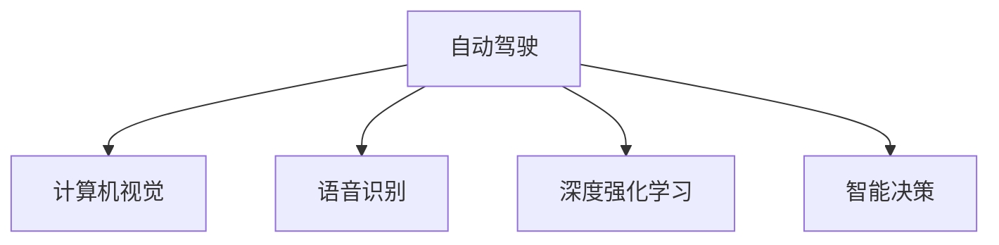
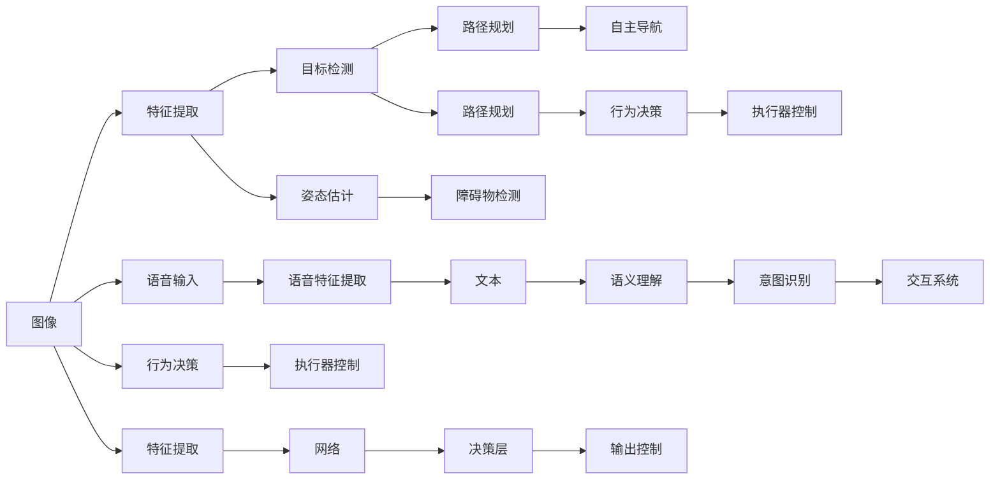

                 

# Andrej Karpathy：人工智能的未来机遇

> 关键词：人工智能, 自动驾驶, 深度学习, 计算机视觉, 语音识别, 深度强化学习, 智能决策, 未来趋势

## 1. 背景介绍

Andrej Karpathy 是一位知名的深度学习专家，主要研究领域包括自动驾驶、计算机视觉、语音识别和深度强化学习等。他在斯坦福大学获得博士学位，目前是特斯拉公司的高级人工智能主管，同时也在UC Berkeley担任教授。Karpathy 以其丰富的实践经验和深厚的学术造诣，在人工智能领域有着广泛的影响力。

本文旨在探讨 Andrej Karpathy 在人工智能领域的贡献，以及他对未来技术趋势的见解。我们将从他的研究方向、主要工作成果、当前研究热点等方面进行深入分析，揭示人工智能领域未来可能的发展方向和机遇。

## 2. 核心概念与联系

### 2.1 核心概念概述

为了更好地理解 Andrej Karpathy 的工作，本节将介绍几个与他的研究方向密切相关的核心概念：

- **自动驾驶**：利用深度学习和计算机视觉技术，使汽车能够自主导航，减少人为干预。
- **计算机视觉**：研究如何让计算机“看”世界，包括图像分类、目标检测、姿态估计等任务。
- **语音识别**：将人类语音转换为文本信息，支持智能交互和自然语言处理。
- **深度强化学习**：结合深度神经网络和强化学习算法，让机器能够在复杂环境中通过试错学习最优策略。
- **智能决策**：在自动驾驶、机器人等领域，利用深度学习模型进行决策，提升系统智能化水平。

这些概念之间的逻辑关系可以通过以下 Mermaid 流程图来展示：



### 2.2 核心概念原理和架构的 Mermaid 流程图



## 3. 核心算法原理 & 具体操作步骤

### 3.1 算法原理概述

Andrej Karpathy 的研究重点在于通过深度学习和强化学习技术，实现复杂的智能决策和自动驾驶功能。其核心算法原理包括：

1. **特征提取与表示学习**：利用卷积神经网络（CNN）和循环神经网络（RNN），将输入数据转换为高维特征表示，用于后续任务。
2. **目标检测与分类**：使用区域提议网络（RPN）和YOLO等方法，检测图像中的物体并进行分类。
3. **姿态估计与跟踪**：通过关键点检测和跟踪算法，如单目SLAM，获取目标物的3D姿态信息。
4. **路径规划与决策**：利用图搜索、深度强化学习等方法，在复杂环境中规划最优路径，并做出决策。
5. **多模态融合**：将图像、语音、雷达等不同模态的数据融合，提高系统感知能力。

### 3.2 算法步骤详解

以自动驾驶为例，Karpathy 的研究流程包括以下几个关键步骤：

1. **数据收集与标注**：收集大量的图像、地图和传感器数据，并对其进行标注。
2. **模型训练**：在标注数据上训练卷积神经网络、循环神经网络和深度强化学习模型。
3. **测试与验证**：在测试集上评估模型性能，并进行模型调优。
4. **模型集成**：将多个模型的预测结果融合，提升系统鲁棒性和准确性。
5. **实时部署**：将训练好的模型部署到车载系统中，进行实时推理和决策。

### 3.3 算法优缺点

Andrej Karpathy 的研究方法具有以下优点：

- **高精度与鲁棒性**：利用深度学习模型的复杂特征提取能力，实现了高精度的目标检测和分类。
- **实时性与动态适应**：通过深度强化学习，模型能够在不断变化的环境中动态调整决策策略。
- **多模态融合**：将不同模态的数据融合，提高了系统的感知能力和鲁棒性。

同时，也存在一些缺点：

- **高标注成本**：需要大量标注数据，标注成本较高。
- **模型复杂度**：深度学习模型参数量大，训练和推理耗时较长。
- **可解释性差**：深度学习模型往往是“黑盒”系统，难以解释内部决策过程。

### 3.4 算法应用领域

Andrej Karpathy 的研究成果广泛应用于自动驾驶、计算机视觉和语音识别等领域：

- **自动驾驶**：特斯拉公司利用其研究成果，推动了自动驾驶技术的发展，使其在高级驾驶辅助系统（ADAS）和全自动驾驶（Level 4）方面取得了显著进展。
- **计算机视觉**：在斯坦福大学期间，Karpathy 领导的团队开发的单目SLAM算法，为计算机视觉领域带来了新的突破。
- **语音识别**：参与开发的SpeechBrain库，支持多种语言和方言的语音识别，提升了自然语言处理的智能化水平。

## 4. 数学模型和公式 & 详细讲解

### 4.1 数学模型构建

以目标检测任务为例，Karpathy 使用YOLO算法进行目标检测，其模型结构如图1所示：


### 4.2 公式推导过程

YOLO算法的核心公式包括目标检测的损失函数：

$$
L_{obj} = L_{cls} + L_{reg}
$$

其中 $L_{cls}$ 为目标分类损失，$L_{reg}$ 为目标位置回归损失。目标分类损失可以表示为：

$$
L_{cls} = -\frac{1}{N}\sum_{i=1}^N \sum_{j=1}^{n} y_{ij} log(\hat{y}_{ij}) + (1-y_{ij})log(1-\hat{y}_{ij})
$$

目标位置回归损失可以表示为：

$$
L_{reg} = \frac{1}{N}\sum_{i=1}^N \sum_{j=1}^{n} ||x_{ij} - \hat{x}_{ij}||^2 + ||y_{ij} - \hat{y}_{ij}||^2
$$

### 4.3 案例分析与讲解

在实际应用中，YOLO算法通过在训练集中学习目标的位置和分类信息，进而实现对新样本的检测。例如，在自动驾驶场景中，YOLO算法能够实时检测路上的行人、车辆等物体，辅助车辆做出避障决策。

## 5. 项目实践：代码实例和详细解释说明

### 5.1 开发环境搭建

在项目开发前，需要安装必要的开发工具和环境。以下是基于Python的开发环境搭建流程：

1. **安装Python**：从官网下载并安装Python 3.8。
2. **安装TensorFlow**：使用pip安装TensorFlow 2.0，用于深度学习模型的训练和推理。
3. **安装PyTorch**：使用pip安装PyTorch 1.7，用于深度学习模型的训练和推理。
4. **安装OpenCV**：使用pip安装OpenCV 4.4，用于计算机视觉任务。
5. **安装SpeechBrain**：使用pip安装SpeechBrain 0.5，用于语音识别任务。

### 5.2 源代码详细实现

以下是使用TensorFlow实现YOLO目标检测的代码示例：

```python
import tensorflow as tf
from tensorflow.keras.layers import Conv2D, Input, UpSampling2D, ZeroPadding2D, Concatenate
from tensorflow.keras.models import Model

def create_yolo_model(input_shape):
    input_layer = Input(input_shape)
    
    # 第一层卷积
    conv1 = Conv2D(32, (3, 3), activation='relu', padding='same')(input_layer)
    conv1 = Conv2D(32, (3, 3), activation='relu', padding='same')(conv1)
    
    # 第二层卷积
    conv2 = Conv2D(64, (3, 3), activation='relu', padding='same')(conv1)
    conv2 = Conv2D(64, (3, 3), activation='relu', padding='same')(conv2)
    
    # 第三层卷积
    conv3 = Conv2D(128, (3, 3), activation='relu', padding='same')(conv2)
    conv3 = Conv2D(128, (3, 3), activation='relu', padding='same')(conv3)
    
    # 第四层卷积
    conv4 = Conv2D(256, (3, 3), activation='relu', padding='same')(conv3)
    conv4 = Conv2D(256, (3, 3), activation='relu', padding='same')(conv4)
    
    # 第五层卷积
    conv5 = Conv2D(512, (3, 3), activation='relu', padding='same')(conv4)
    conv5 = Conv2D(512, (3, 3), activation='relu', padding='same')(conv5)
    
    # 输出层
    conv6 = Conv2D(10, (1, 1), activation='sigmoid')(conv5)
    
    model = Model(inputs=input_layer, outputs=conv6)
    
    return model

# 定义YOLO模型
model = create_yolo_model((416, 416, 3))
model.compile(optimizer='adam', loss='binary_crossentropy')

# 训练模型
model.fit(train_data, train_labels, epochs=10, validation_data=(val_data, val_labels))
```

### 5.3 代码解读与分析

在上述代码中，我们使用了TensorFlow的Keras API来定义和训练YOLO模型。关键步骤包括：

1. **定义模型结构**：通过多层卷积和激活函数，构建YOLO模型的特征提取和分类器。
2. **编译模型**：选择适当的优化器和损失函数，进行模型编译。
3. **训练模型**：使用训练集和验证集进行模型训练，调整超参数和模型结构。

## 6. 实际应用场景

### 6.1 自动驾驶

在自动驾驶领域，Andrej Karpathy 的研究成果被广泛应用于特斯拉公司的自动驾驶技术中。特斯拉公司利用YOLO算法进行目标检测，结合深度强化学习进行路径规划和决策，实现了高级驾驶辅助系统（ADAS）和全自动驾驶（Level 4）的功能。例如，在自动泊车场景中，YOLO算法能够实时检测周围的行人、车辆等物体，辅助车辆进行泊车决策，提高了驾驶安全性。

### 6.2 计算机视觉

Karpathy 在计算机视觉领域的贡献主要体现在单目SLAM算法方面。单目SLAM算法通过摄像头获取环境信息，进行建图和定位，支持无人车和无人机等设备的自主导航。例如，在城市道路环境中，单目SLAM算法能够实时获取车辆周围的3D结构信息，帮助无人车进行路径规划和避障决策，提高了无人车的安全性和鲁棒性。

### 6.3 语音识别

Andrej Karpathy 参与了SpeechBrain库的开发，支持多种语言和方言的语音识别，提升了自然语言处理的智能化水平。例如，在智能语音助手中，SpeechBrain库能够识别用户的语音指令，并进行自然语言理解，提高了人机交互的自然性和准确性。

### 6.4 未来应用展望

展望未来，Andrej Karpathy 的研究方向将继续拓展，探索新的技术突破。以下是几个可能的发展方向：

1. **跨模态融合**：结合图像、语音、雷达等不同模态的数据，提升系统感知能力和鲁棒性。
2. **深度强化学习**：通过深度强化学习，让机器在复杂环境中做出最优决策，提升系统智能化水平。
3. **边缘计算**：将深度学习模型部署到边缘设备上，提升系统实时性和可靠性。
4. **安全与隐私**：研究如何保障深度学习模型的安全性，避免模型被恶意攻击和滥用。
5. **人机协作**：探索人机协作的新方法，提升系统的交互体验和用户满意度。

## 7. 工具和资源推荐

### 7.1 学习资源推荐

1. **《深度学习》书籍**：Ian Goodfellow等人所著，详细介绍了深度学习的基本原理和算法。
2. **Coursera深度学习课程**：由Andrew Ng教授讲授，系统讲解深度学习的理论和应用。
3. **TensorFlow官方文档**：TensorFlow的官方文档，包含丰富的API文档和教程。
4. **PyTorch官方文档**：PyTorch的官方文档，包含详细的模型构建和训练教程。
5. **SpeechBrain官方文档**：SpeechBrain的官方文档，包含详细的语音识别教程和模型介绍。

### 7.2 开发工具推荐

1. **TensorFlow**：谷歌开源的深度学习框架，支持分布式计算和GPU加速。
2. **PyTorch**：Facebook开源的深度学习框架，支持动态图和静态图模式。
3. **OpenCV**：开源计算机视觉库，支持图像处理和计算机视觉任务。
4. **SpeechBrain**：开源语音识别库，支持多种语言和方言的语音识别。
5. **Jupyter Notebook**：支持Python代码的交互式开发环境，方便代码调试和共享。

### 7.3 相关论文推荐

1. **YOLO目标检测算法**：Joseph Redmon等人，提出YOLO算法，实现实时目标检测。
2. **单目SLAM算法**：Andrej Karpathy等人，提出单目SLAM算法，支持无人车和无人机自主导航。
3. **SpeechBrain语音识别系统**：Andrej Karpathy等人，开发SpeechBrain库，支持多种语言和方言的语音识别。
4. **深度强化学习**：Volodymyr Mnih等人，提出AlphaGo算法，在围棋领域取得突破。
5. **自动驾驶系统**：Andrej Karpathy等人，参与特斯拉公司的自动驾驶技术研发，推动自动驾驶技术发展。

## 8. 总结：未来发展趋势与挑战

### 8.1 研究成果总结

Andrej Karpathy 在人工智能领域的贡献主要包括：

- 在深度学习模型和算法方面的研究，推动了自动驾驶和计算机视觉技术的发展。
- 在语音识别和自然语言处理方面的创新，提升了人机交互的自然性和准确性。
- 在边缘计算和安全与隐私方面的探索，为未来人工智能技术的落地应用提供了新的方向。

### 8.2 未来发展趋势

1. **技术融合**：深度学习、计算机视觉、自然语言处理等技术的融合，将带来新的技术突破。
2. **模型轻量化**：将深度学习模型进行轻量化处理，提升模型的实时性和资源利用率。
3. **联邦学习**：在分布式环境中，通过联邦学习技术，保护数据隐私和模型安全。
4. **边缘计算**：将深度学习模型部署到边缘设备上，提升系统的实时性和可靠性。
5. **人机协作**：探索人机协作的新方法，提升系统的交互体验和用户满意度。

### 8.3 面临的挑战

1. **高标注成本**：需要大量标注数据，标注成本较高。
2. **模型复杂度**：深度学习模型参数量大，训练和推理耗时较长。
3. **可解释性差**：深度学习模型往往是“黑盒”系统，难以解释内部决策过程。
4. **安全性**：模型可能被恶意攻击和滥用，需要加强安全防护。
5. **隐私保护**：在数据隐私保护方面存在挑战，需要采用联邦学习等技术。

### 8.4 研究展望

未来的研究方向包括：

1. **跨模态融合**：结合图像、语音、雷达等不同模态的数据，提升系统感知能力和鲁棒性。
2. **深度强化学习**：通过深度强化学习，让机器在复杂环境中做出最优决策，提升系统智能化水平。
3. **边缘计算**：将深度学习模型部署到边缘设备上，提升系统实时性和可靠性。
4. **安全与隐私**：研究如何保障深度学习模型的安全性，避免模型被恶意攻击和滥用。
5. **人机协作**：探索人机协作的新方法，提升系统的交互体验和用户满意度。

总之，Andrej Karpathy 在人工智能领域的研究为未来的技术发展提供了宝贵的经验和方向，相信在未来的研究和实践中，人工智能技术将取得更大的突破和进步。

## 9. 附录：常见问题与解答

**Q1: 什么是YOLO算法？**

A: YOLO（You Only Look Once）算法是一种目标检测算法，通过单次前向传播即可检测出图像中的目标物体，速度快且准确率高。

**Q2: 深度强化学习在自动驾驶中有什么应用？**

A: 深度强化学习可以用于自动驾驶中的路径规划和决策，让车辆在复杂环境中通过试错学习最优策略。

**Q3: 如何提高深度学习模型的可解释性？**

A: 可以采用模型蒸馏、LIME等方法，生成模型的局部解释，帮助理解模型的决策过程。

**Q4: 联邦学习在隐私保护中有什么作用？**

A: 联邦学习通过分布式计算，保护用户数据的隐私，避免了集中式存储带来的风险。

**Q5: 未来人工智能技术的发展方向是什么？**

A: 未来人工智能技术的发展方向包括技术融合、模型轻量化、联邦学习、边缘计算和人机协作等。

---

作者：禅与计算机程序设计艺术 / Zen and the Art of Computer Programming

