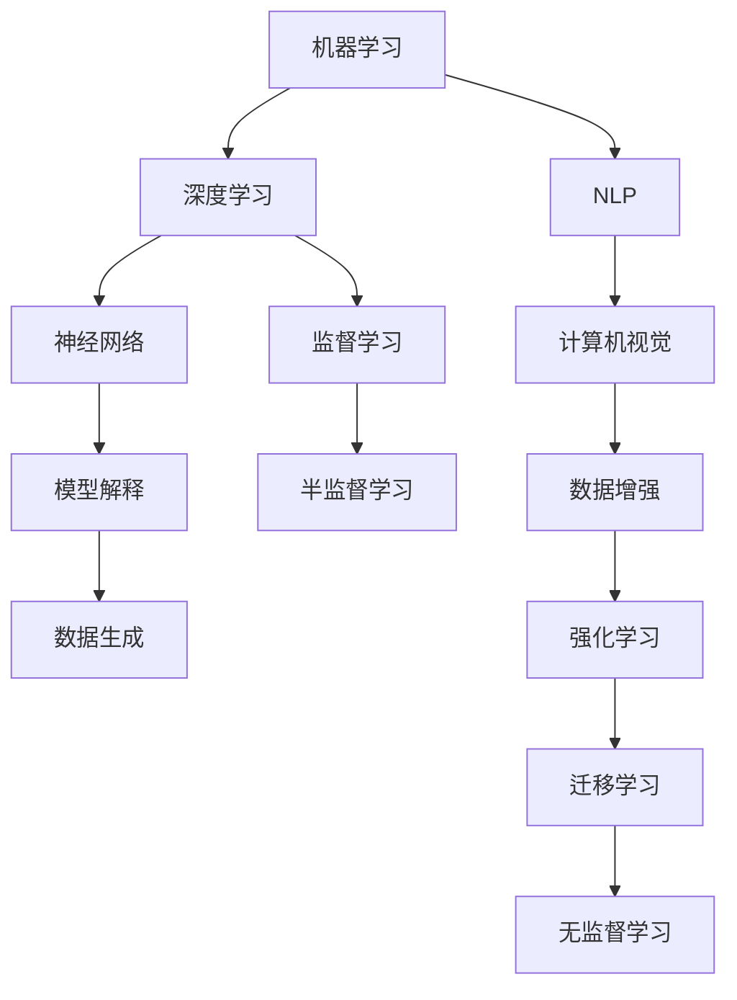

                 

# Andrej Karpathy：人工智能的科学意义

> 关键词：人工智能, 机器学习, 深度学习, 神经网络, 模型解释, 自然语言处理, 计算机视觉

## 1. 背景介绍

Andrej Karpathy 是斯坦福大学计算机科学教授，同时担任特斯拉首席人工智能科学家，被誉为深度学习领域的顶尖专家之一。他的研究涵盖了计算机视觉、机器学习、深度神经网络等多个方向，并在实际应用中取得了显著成果。Karpathy 同时也是一位活跃的科普作家和演讲者，通过通俗易懂的语言和生动的案例，让广大读者和听众能够更好地理解和掌握复杂的 AI 概念。

在本文中，我们将聚焦于 Andrej Karpathy 对人工智能的科学意义的阐述。通过梳理他的相关观点和论述，希望能为读者提供一个深入理解人工智能的科学意义，并对其未来发展趋势进行前瞻性思考。

## 2. 核心概念与联系

### 2.1 核心概念概述

Andrej Karpathy 在其著作和讲座中，多次强调了人工智能的科学意义。这些概念主要包括以下几个方面：

- **机器学习**：通过算法和模型从数据中学习规律，并应用于实际问题解决。
- **深度学习**：利用多层次的神经网络结构，模拟人类大脑处理复杂任务的能力。
- **神经网络**：由大量神经元相互连接构成的模型，可以处理高维数据并发现复杂的非线性关系。
- **模型解释**：研究如何理解和解释机器学习模型的决策过程和结果，提升模型的可信度和可解释性。
- **自然语言处理**（NLP）：使计算机能够理解和处理人类语言，实现语音识别、文本生成等任务。
- **计算机视觉**：让计算机“看懂”图片和视频，进行目标检测、图像生成等。

这些概念相互交织，构成了安德烈·卡帕西对人工智能的理解框架。接下来，我们将进一步阐述这些概念的内在联系和应用。

### 2.2 核心概念原理和架构的 Mermaid 流程图



此图表展示了机器学习、深度学习、神经网络、模型解释、NLP、计算机视觉等概念之间的联系和转换关系。例如，深度学习通过多层次神经网络实现对数据的深度理解，而神经网络则作为深度学习的核心结构。此外，模型解释通过可视化和技术手段，帮助理解模型的决策过程。NLP和计算机视觉则通过深度学习模型，处理语言和图像数据。

## 3. 核心算法原理 & 具体操作步骤

### 3.1 算法原理概述

安德烈·卡帕西认为，人工智能的核心在于模型的构建和优化。深度学习模型的训练过程，通过大量数据和复杂算法，不断调整模型参数以提高其预测准确性。这一过程的核心是损失函数、反向传播和梯度下降等关键技术。

在实际应用中，常见的深度学习模型包括卷积神经网络（CNN）、循环神经网络（RNN）、Transformer 等。这些模型通过不同层次的特征提取和转换，从原始数据中提取出有意义的特征表示，进而实现对特定任务的处理。

### 3.2 算法步骤详解

深度学习模型的训练过程通常分为以下几个步骤：

1. **数据准备**：收集并预处理数据，确保数据集的多样性和代表性。
2. **模型构建**：选择合适的模型结构，如CNN、RNN、Transformer等，并设置相应的超参数。
3. **训练过程**：使用优化算法（如SGD、Adam等）和损失函数（如交叉熵、均方误差等），在训练数据上迭代更新模型参数。
4. **验证与调参**：通过验证集评估模型性能，调整模型超参数以优化模型表现。
5. **测试**：在测试集上评估模型性能，完成模型部署和应用。

### 3.3 算法优缺点

深度学习模型在处理复杂任务方面表现出色，但同时也存在一些缺点：

- **过拟合**：在训练集上表现良好，但在测试集上表现不佳。
- **高计算成本**：需要大量的计算资源和时间进行训练。
- **可解释性差**：深度学习模型通常被视为"黑盒"，难以解释其内部工作机制。
- **数据依赖**：模型的性能高度依赖于训练数据的质量和数量。

### 3.4 算法应用领域

深度学习模型在多个领域中得到了广泛应用，如计算机视觉、自然语言处理、医疗、金融等。这些应用领域中，深度学习模型通过处理高维数据和复杂任务，取得了显著的成果。

- **计算机视觉**：用于图像分类、目标检测、图像生成等任务。
- **自然语言处理**：用于文本分类、情感分析、机器翻译、对话系统等任务。
- **医疗**：用于疾病诊断、医学图像分析等任务。
- **金融**：用于风险评估、股票预测等任务。

## 4. 数学模型和公式 & 详细讲解 & 举例说明

### 4.1 数学模型构建

深度学习模型通常基于神经网络架构进行构建。以下以卷积神经网络（CNN）为例，展示其数学模型构建过程。

设输入为 $x$，卷积核为 $W$，卷积层的输出为 $y$，则卷积操作的数学模型可以表示为：

$$ y = \sigma(\sum_{i,j} x[i,j] * W[i,j] + b) $$

其中，$\sigma$ 为激活函数（如ReLU），$b$ 为偏置项。

### 4.2 公式推导过程

以全连接层为例，其数学模型可以表示为：

$$ z = Wx + b $$
$$ y = \sigma(z) $$

其中，$W$ 为权重矩阵，$b$ 为偏置向量，$x$ 为输入向量，$\sigma$ 为激活函数。

### 4.3 案例分析与讲解

以图像分类为例，CNN通过多个卷积层和池化层提取图像特征，并通过全连接层进行分类。在训练过程中，模型通过反向传播算法更新权重矩阵和偏置向量，使得损失函数最小化，从而提高模型在测试集上的分类准确率。

## 5. 项目实践：代码实例和详细解释说明

### 5.1 开发环境搭建

在开始项目实践前，需要准备Python环境、深度学习框架（如TensorFlow、PyTorch等）和相关库（如NumPy、Pandas等）。可以通过以下命令在Python中安装这些库：

```bash
pip install tensorflow
pip install torch
pip install numpy pandas
```

### 5.2 源代码详细实现

以下是一个简单的图像分类模型实现，使用TensorFlow和Keras构建：

```python
from tensorflow.keras.models import Sequential
from tensorflow.keras.layers import Conv2D, MaxPooling2D, Flatten, Dense

# 构建模型
model = Sequential()
model.add(Conv2D(32, (3, 3), activation='relu', input_shape=(28, 28, 1)))
model.add(MaxPooling2D((2, 2)))
model.add(Conv2D(64, (3, 3), activation='relu'))
model.add(MaxPooling2D((2, 2)))
model.add(Conv2D(64, (3, 3), activation='relu'))
model.add(Flatten())
model.add(Dense(64, activation='relu'))
model.add(Dense(10, activation='softmax'))

# 编译模型
model.compile(optimizer='adam', loss='categorical_crossentropy', metrics=['accuracy'])

# 训练模型
model.fit(train_images, train_labels, epochs=10, validation_data=(test_images, test_labels))
```

### 5.3 代码解读与分析

在上述代码中，我们首先定义了一个Sequential模型，并添加了多个卷积层、池化层和全连接层。每个卷积层和全连接层都需要设置激活函数和损失函数，并使用优化器进行模型训练。

在训练过程中，我们使用了训练集和测试集进行模型验证，并通过`fit`函数进行模型训练。通过不断调整模型参数和优化器设置，可以提高模型的分类准确率。

### 5.4 运行结果展示

在训练完成后，我们可以通过以下代码进行模型测试：

```python
test_loss, test_acc = model.evaluate(test_images, test_labels)
print('Test accuracy:', test_acc)
```

通过测试集上的准确率，我们可以评估模型的性能，并发现模型在分类任务上的表现。

## 6. 实际应用场景

### 6.4 未来应用展望

安德烈·卡帕西认为，未来人工智能的应用将更加广泛和深入。以下是一些可能的应用场景：

- **自动驾驶**：利用计算机视觉和深度学习技术，实现车辆的自主驾驶。
- **健康医疗**：通过医学影像分析、疾病预测等技术，提升医疗诊断和治疗效率。
- **金融风控**：利用深度学习模型进行风险评估、股票预测等，帮助金融机构降低风险。
- **智能家居**：通过语音识别、图像处理等技术，实现智能家居的自动化管理。

## 7. 工具和资源推荐

### 7.1 学习资源推荐

- **深度学习基础**：《深度学习》（Ian Goodfellow）和《Python深度学习》（Francois Chollet）。
- **计算机视觉**：《计算机视觉：模型、学习和推理》（Simon J.D. Prince）。
- **自然语言处理**：《自然语言处理综论》（Daniel Jurafsky和James H. Martin）。

### 7.2 开发工具推荐

- **深度学习框架**：TensorFlow、PyTorch、Keras。
- **数据处理工具**：Pandas、NumPy。
- **可视化工具**：TensorBoard、Matplotlib。

### 7.3 相关论文推荐

- **深度学习**：《深度学习》（Goodfellow 等）。
- **计算机视觉**：《计算机视觉：模型、学习和推理》（Simon J.D. Prince）。
- **自然语言处理**：《自然语言处理综论》（Daniel Jurafsky和James H. Martin）。

## 8. 总结：未来发展趋势与挑战

### 8.1 研究成果总结

安德烈·卡帕西的研究成果主要集中在深度学习模型的构建和优化上。通过一系列关键算法和模型的提出，他推动了计算机视觉和自然语言处理领域的进步。

### 8.2 未来发展趋势

未来，人工智能将进一步融合各个领域的技术，实现更加广泛和深入的应用。以下趋势值得关注：

- **跨领域融合**：人工智能将与物联网、区块链、量子计算等技术结合，实现跨领域的协同创新。
- **模型可解释性**：通过模型解释和可视化技术，提升模型的可解释性和可信度。
- **数据高效性**：通过数据生成、数据增强等技术，提高模型的数据利用效率。
- **模型自动化**：利用自动化调参和模型优化技术，提高模型训练的效率和精度。

### 8.3 面临的挑战

尽管人工智能在多个领域取得了显著进展，但仍面临一些挑战：

- **数据隐私**：如何在保护用户隐私的前提下，利用数据进行模型训练。
- **伦理道德**：如何确保人工智能系统的公平性、透明性和安全性。
- **资源消耗**：大规模模型的训练和推理需要大量的计算资源，如何实现高效、低成本的部署。
- **模型解释**：如何更好地理解和解释深度学习模型的决策过程。

### 8.4 研究展望

未来，研究者需要关注以下几个方向：

- **可解释性**：研究如何更好地理解和解释深度学习模型的决策过程，提高模型的可信度和可解释性。
- **数据生成**：通过生成对抗网络（GAN）等技术，生成高质量的合成数据，提高模型的训练效率和泛化能力。
- **跨领域融合**：将人工智能与物联网、区块链、量子计算等技术结合，实现跨领域的协同创新。
- **伦理道德**：研究如何在人工智能系统的设计和使用中，确保公平性、透明性和安全性。

## 9. 附录：常见问题与解答

**Q1：如何理解深度学习的科学意义？**

A：深度学习通过多层次的神经网络结构，模拟人类大脑处理复杂任务的能力。它利用大量的数据和复杂的算法，不断调整模型参数以提高其预测准确性。深度学习的科学意义在于其能够处理高维数据和复杂任务，为人工智能提供了新的工具和方法。

**Q2：如何提高深度学习模型的可解释性？**

A：通过模型解释和可视化技术，可以更好地理解和解释深度学习模型的决策过程。常见的模型解释方法包括特征可视化、梯度分析、可解释性增强等。这些方法能够帮助用户更好地理解模型的内部机制，提高模型的可信度和可解释性。

**Q3：如何在保护用户隐私的前提下，利用数据进行模型训练？**

A：可以通过差分隐私（Differential Privacy）等技术，对用户数据进行匿名化处理，保护用户隐私的同时，实现数据的高效利用。此外，还可以通过数据生成、数据增强等技术，提高模型的数据利用效率。

**Q4：如何确保人工智能系统的公平性、透明性和安全性？**

A：在人工智能系统的设计和实现过程中，需要充分考虑公平性、透明性和安全性。可以通过公平性约束、透明性机制、安全性设计等手段，确保系统的公平性、透明性和安全性。此外，还需要进行定期审核和更新，确保系统符合伦理道德标准。

作者：禅与计算机程序设计艺术 / Zen and the Art of Computer Programming

