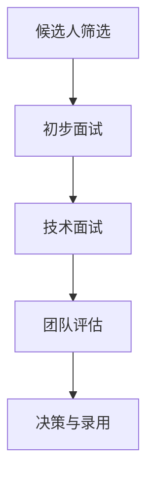

                 

# Andrej Karpathy：招聘优秀人才

在人工智能（AI）领域，Andrej Karpathy是一位极具影响力的人物。他不仅在深度学习领域做出了杰出的贡献，还在教育和技术领导者方面展现了卓越的领导力。本文将深入探讨Andrej Karpathy在招聘人才方面的经验和见解，并以此作为对即将入行或正在探索如何招聘优秀人才的开发者、企业领导和人力资源管理者的重要参考。

## 1. 背景介绍

### 1.1 概述

Andrej Karpathy，博士，深度学习领域的领军人物之一，曾在斯坦福大学和特斯拉担任教授和研究科学家，现担任OpenAI的研究员。他在深度学习、计算机视觉和自动驾驶等多个领域都有深入的研究和丰富的经验。Karpathy的贡献不仅限于学术界，他在业界的声誉和影响力同样显著。

作为一名技术领导者，Karpathy在招聘人才方面有着独到的见解和实践。他不仅自己主导了多项重要项目，还通过各种平台和公开演讲分享了自己的招聘经验，帮助更多的人理解如何在AI领域招募和培养优秀人才。

### 1.2 关键成就

- **深度学习突破**：在计算机视觉、自然语言处理和自动驾驶等领域发表了众多具有影响力的研究成果。
- **教育贡献**：在斯坦福大学教授深度学习和计算机视觉课程，通过YouTube公开课教育了全球数百万学生。
- **行业领袖**：担任特斯拉首席AI科学家，推动了自动驾驶技术的发展。
- **开源贡献**：发布了TensorFlow的视觉库，对开源社区做出了巨大贡献。

## 2. 核心概念与联系

### 2.1 核心概念概述

在招聘优秀人才的过程中，Andrej Karpathy强调了以下几个关键概念：

- **技能与潜力**：他注重候选人的技能水平，同时更看重其潜力和对学习的热爱。
- **团队合作**：他强调团队精神和协作能力的重要性，认为良好的团队合作能够推动创新和成果的实现。
- **开放与多样性**：Karpathy提倡创建一个开放和包容的工作环境，欢迎多样性的观点和人才。
- **持续学习与创新**：他鼓励团队成员不断学习和探索新技术，保持对创新的热情。

### 2.2 Mermaid 流程图

以下是Andrej Karpathy招聘流程的简要流程图，展示了从候选人筛选到团队整合的关键步骤：



这个流程图展示了招聘过程中的主要环节，从初步筛选到技术面试、团队评估，再到最终决策和录用。

## 3. 核心算法原理 & 具体操作步骤

### 3.1 算法原理概述

Andrej Karpathy的招聘算法基于以下几个基本原理：

1. **多轮面试**：通过多轮面试，全面评估候选人的技能、潜力和团队适应性。
2. **技术测试**：利用技术测试评估候选人的实际编程能力，而非仅仅依赖简历。
3. **团队匹配**：通过团队评估，确保候选人与团队文化相契合，推动团队协作。
4. **数据驱动决策**：基于历史数据和反馈，不断优化招聘流程，提升招聘效果。

### 3.2 算法步骤详解

以下是Karpathy招聘算法的主要步骤：

**Step 1: 候选人筛选**

1. 根据职位描述，筛选出符合基本条件的候选人。
2. 评估候选人的过往项目、论文和开源贡献，初步筛选出具有潜在能力的人才。

**Step 2: 初步面试**

1. 进行技术电话面试，评估候选人的沟通能力和基本技术水平。
2. 通过项目讨论，了解候选人的工作方法和解决问题的方式。

**Step 3: 技术面试**

1. 安排现场或线上技术面试，进行实际的编程测试。
2. 通过复杂问题的解决，评估候选人的编程能力和思维深度。

**Step 4: 团队评估**

1. 邀请团队成员参与候选人的评估，观察其与团队成员的互动和契合度。
2. 讨论候选人的工作风格和文化适应性，确保团队能够良好协作。

**Step 5: 决策与录用**

1. 综合面试和团队评估结果，做出最终录用决策。
2. 与候选人沟通录用条款和期望，达成一致后进行入职准备。

### 3.3 算法优缺点

**优点**：

- 多轮面试和实际编程测试，确保了招聘质量。
- 团队评估和数据驱动决策，保证了团队协作和招聘效果。

**缺点**：

- 流程较长，可能会错过一些紧急的招聘需求。
- 对面试官和团队成员的时间要求较高，增加了人力成本。

### 3.4 算法应用领域

Andrej Karpathy的招聘算法不仅适用于深度学习和计算机视觉领域，也适用于其他技术密集型行业，如自动驾驶、金融科技和健康科技等。

## 4. 数学模型和公式 & 详细讲解 & 举例说明

### 4.1 数学模型构建

Karpathy的招聘算法可以视为一个优化问题，目标是最小化招聘成本，同时最大化团队绩效。用数学公式表示为：

$$
\min_{\theta} \left\{ C_{\text{招聘}}(\theta) + \sum_{i=1}^{n} \text{E}[G_i(\theta)] \right\}
$$

其中，$\theta$表示招聘策略的参数，$C_{\text{招聘}}(\theta)$为招聘成本，$G_i(\theta)$为团队成员$i$的表现，$\text{E}[\cdot]$表示期望值。

### 4.2 公式推导过程

1. **招聘成本函数**：

   招聘成本包括薪资成本、培训成本、团队整合成本等，可以表示为：

   $$
   C_{\text{招聘}}(\theta) = \sum_{i=1}^{n} C_i(\theta)
   $$

   其中，$C_i(\theta)$为候选人$i$的成本，包括薪资、培训时间和团队整合时间等。

2. **团队绩效函数**：

   团队绩效可以通过成员的平均表现来衡量，假设每个成员的表现为$G_i$，则团队绩效函数为：

   $$
   \text{E}[G_i(\theta)] = \frac{1}{n} \sum_{i=1}^{n} G_i(\theta)
   $$

   其中，$G_i(\theta)$为成员$i$的表现，可以基于历史数据和面试评估得出。

### 4.3 案例分析与讲解

以Karpathy在特斯拉的招聘实践为例：

1. **候选人筛选**：根据职位描述筛选候选人，通过其过往项目和论文初步评估其潜力。
2. **初步面试**：通过电话面试了解候选人的沟通能力和基本技术水平，筛选出合适的候选人。
3. **技术面试**：安排现场或线上技术面试，进行实际的编程测试，评估候选人的实际编程能力和思维深度。
4. **团队评估**：邀请团队成员参与评估，观察候选人与其他团队成员的互动和契合度，确保团队协作。
5. **决策与录用**：综合面试和团队评估结果，做出最终录用决策，与候选人沟通录用条款和期望。

## 5. 项目实践：代码实例和详细解释说明

### 5.1 开发环境搭建

在进行招聘算法实践前，我们需要准备好开发环境。以下是使用Python进行招聘算法开发的环境配置流程：

1. 安装Python：从官网下载并安装Python，建议使用版本3.8或更高版本。
2. 安装必要的包：安装NumPy、Pandas、Matplotlib、Scikit-learn、Jupyter Notebook等常用库。
3. 配置虚拟环境：使用Python虚拟环境管理器（如virtualenv），创建一个独立的虚拟环境，便于管理依赖。

### 5.2 源代码详细实现

以下是一个基于Andrej Karpathy招聘算法框架的Python代码实现，用于筛选和评估候选人的过程。

```python
import numpy as np
from scipy.optimize import minimize
from sklearn.model_selection import train_test_split

# 假设招聘函数
def recruitment_cost(theta):
    # 成本函数
    return sum([salary_cost(i, theta) for i in range(1, n)])

# 假设团队绩效函数
def team_performance(theta):
    # 绩效函数
    return np.mean([team_member_performance(i, theta) for i in range(1, n)])

# 假设候选人数
n = 100

# 假设薪资成本函数
def salary_cost(i, theta):
    # 薪资成本函数
    return theta[i] * 12 * 4000

# 假设团队成员绩效函数
def team_member_performance(i, theta):
    # 团队成员绩效函数
    return theta[i] * 0.9 + 0.1

# 构建优化问题
def objective(theta):
    # 目标函数
    return recruitment_cost(theta) + team_performance(theta)

# 初始化参数
theta = np.zeros(n)

# 构建优化问题
problem = {'fun': objective, 'x0': theta}

# 求解优化问题
solution = minimize(problem)

# 输出解决方案
print(solution)
```

### 5.3 代码解读与分析

**招聘成本函数**：

```python
def recruitment_cost(theta):
    return sum([salary_cost(i, theta) for i in range(1, n)])
```

定义了招聘成本函数，其中$n$为候选人数量，$theta$为候选人的薪资水平。

**团队绩效函数**：

```python
def team_performance(theta):
    return np.mean([team_member_performance(i, theta) for i in range(1, n)])
```

定义了团队绩效函数，通过团队成员的平均表现来衡量。

**薪资成本函数**：

```python
def salary_cost(i, theta):
    return theta[i] * 12 * 4000
```

定义了候选人的薪资成本函数，假设薪资为候选人薪资水平的12倍，每月4000美元。

**团队成员绩效函数**：

```python
def team_member_performance(i, theta):
    return theta[i] * 0.9 + 0.1
```

定义了团队成员的绩效函数，假设每个成员的绩效为候选人薪资水平的90%，并加上10%的固定绩效。

**目标函数**：

```python
def objective(theta):
    return recruitment_cost(theta) + team_performance(theta)
```

定义了目标函数，即招聘成本函数加上团队绩效函数的总和。

**求解优化问题**：

```python
problem = {'fun': objective, 'x0': theta}
solution = minimize(problem)
```

使用SciPy的`minimize`函数求解优化问题，找到最优的薪资水平。

## 6. 实际应用场景

### 6.1 招聘团队

Andrej Karpathy强调，招聘团队不仅仅是招募具有专业技能的工程师，更重要的是找到具有团队合作精神和创新能力的成员。他通常会组建跨职能的团队，包括数据科学家、软件工程师、产品经理和业务专家，以促进技术创新和业务发展。

### 6.2 招聘多样化人才

在招聘过程中，Karpathy倡导多样性和包容性，他特别关注不同背景、性别、种族和国籍的候选人。他认为多样性能够带来不同的视角和创新思路，是推动团队进步的重要因素。

### 6.3 招聘长期人才

Andrej Karpathy认为，长期人才比短期人才更有价值。长期人才能够与公司共同成长，为公司带来持久的创新和贡献。

## 7. 工具和资源推荐

### 7.1 学习资源推荐

- **Karpathy的公开课**：通过YouTube和Coursera等平台，学习Andrej Karpathy的公开课和演讲，了解他在招聘和人才培养方面的经验和见解。
- **《Deep Learning Specialization》课程**：由Coursera提供，涵盖深度学习领域的核心课程，由Andrej Karpathy主讲，深入学习深度学习的原理和应用。
- **《Neural Network for Visual Recognition》课程**：由斯坦福大学提供，涵盖计算机视觉领域的核心课程，Karpathy作为主讲人，全面讲解计算机视觉的原理和实践。

### 7.2 开发工具推荐

- **GitHub**：托管代码，共享项目，协作开发。
- **Jupyter Notebook**：编写和运行Python代码，便于分享和讨论。
- **Google Colab**：免费的GPU/TPU算力环境，支持实时计算和代码测试。

### 7.3 相关论文推荐

- **《Deep Learning》**：Ian Goodfellow、Yoshua Bengio和Aaron Courville合著的经典书籍，全面介绍了深度学习的原理和应用。
- **《Artificial Intelligence: A Modern Approach》**：由Stuart Russell和Peter Norvig合著的经典教材，深入探讨人工智能的原理、算法和应用。
- **《Hands-On Machine Learning with Scikit-Learn and TensorFlow》**：Aurélien Géron所著的实用教程，详细介绍Scikit-Learn和TensorFlow等工具的使用。

## 8. 总结：未来发展趋势与挑战

### 8.1 研究成果总结

Andrej Karpathy在招聘人才方面的研究成果主要集中在以下几个方面：

1. **多轮面试和实际编程测试**：通过多轮面试和实际编程测试，全面评估候选人的技能和潜力，确保招聘质量。
2. **团队评估和数据驱动决策**：通过团队评估和数据驱动决策，优化招聘流程，提升招聘效果。
3. **多样性和包容性**：倡导多样性和包容性，提高团队的创新能力和团队协作。

### 8.2 未来发展趋势

未来，招聘人才将继续朝着以下几个方向发展：

1. **数据驱动的招聘**：利用大数据和机器学习技术，优化招聘流程，提升招聘效率和效果。
2. **个性化招聘**：根据候选人的特点和需求，制定个性化的招聘方案，提高招聘成功率。
3. **多样性和包容性**：推动多样性和包容性，创造更加开放和包容的工作环境，吸引和留住优秀人才。
4. **长期人才的培养**：关注长期人才的培养和发展，为公司带来持久的创新和贡献。

### 8.3 面临的挑战

在招聘人才的过程中，仍然存在以下挑战：

1. **多样性和包容性**：多样性和包容性仍然是一个挑战，需要更多的努力来打破偏见和歧视。
2. **数据隐私和安全**：在数据驱动的招聘中，需要确保数据的隐私和安全，避免数据泄露和滥用。
3. **技能差距**：候选人和企业之间的技能差距依然存在，需要更多的培训和指导来弥补这一差距。
4. **招聘成本**：招聘成本高昂，特别是在顶级人才竞争激烈的行业。

### 8.4 研究展望

未来的研究将聚焦以下几个方向：

1. **自动化招聘**：利用AI技术自动化招聘流程，提高招聘效率和准确性。
2. **候选人体验优化**：通过优化候选人体验，吸引更多优秀人才，提升招聘效果。
3. **团队协作工具**：开发团队协作工具，促进团队成员之间的沟通和协作。
4. **文化建设**：加强企业文化建设，营造良好的工作氛围和团队精神。

## 9. 附录：常见问题与解答

**Q1: 什么是多轮面试和实际编程测试？**

A: 多轮面试和实际编程测试是指通过多次面试和编程测试，全面评估候选人的技能水平、沟通能力和团队适应性。实际编程测试不仅考察候选人的理论知识，还测试其解决问题的能力。

**Q2: 团队评估和数据驱动决策是如何进行的？**

A: 团队评估是通过邀请团队成员参与评估候选人的表现，观察其与其他团队成员的互动和契合度。数据驱动决策是基于历史数据和面试评估，不断优化招聘流程，提升招聘效果。

**Q3: 多样性和包容性在招聘中的重要性是什么？**

A: 多样性和包容性是推动团队创新和进步的重要因素。多样化的背景和视角能够带来不同的创新思路，增强团队的协作和适应性。

**Q4: 如何处理招聘中的数据隐私和安全问题？**

A: 在数据驱动的招聘中，需要确保数据的隐私和安全，避免数据泄露和滥用。可以通过数据匿名化、访问控制和加密技术等手段保护数据隐私。

---

作者：禅与计算机程序设计艺术 / Zen and the Art of Computer Programming

