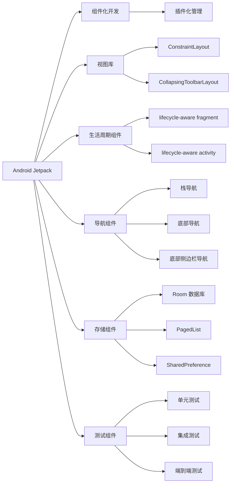

                 

# Android Jetpack：谷歌的 Android 开发套件

> 关键词：Android Jetpack, 组件化开发, 功能增强, 开发效率, 模块化设计, 跨平台开发, 技术栈整合, 开源社区支持

## 1. 背景介绍

### 1.1 问题由来

Android 作为全球最流行的移动操作系统，在智能设备市场占据着主导地位。随着 Android 应用的不断扩展和演变，开发者面临着越来越复杂和多样化的需求，如何提升开发效率、保证应用稳定性和性能、支持跨平台开发，成为摆在每一位 Android 开发者面前的重要课题。

谷歌为了应对这些挑战，推出了 Android Jetpack，一套面向现代 Android 开发的开发套件，旨在帮助开发者更快速地构建高效、稳定的 Android 应用，同时支持跨平台开发，涵盖从代码开发、功能增强到测试部署的全生命周期管理。

### 1.2 问题核心关键点

Android Jetpack 的核心理念是组件化开发，通过将应用功能拆分成独立可复用的组件，以插件化的方式灵活组合，降低开发门槛，提升开发效率。它包括一系列功能模块和工具，如视图库、生活周期组件、导航组件、存储组件等，覆盖了 Android 应用开发的方方面面。

通过引入 Android Jetpack，开发者不仅能够提升应用性能、优化用户体验，还能借助 Google Play 生态系统的强大支持，更高效地管理和部署应用，提升应用的长期价值。

## 2. 核心概念与联系

### 2.1 核心概念概述

为了更好地理解 Android Jetpack，我们先介绍几个核心概念及其之间的联系：

- **Android Jetpack**：谷歌推出的 Android 开发套件，包括一系列功能模块和工具，如视图库、生活周期组件、导航组件、存储组件等，旨在帮助开发者构建高效、稳定的 Android 应用。

- **组件化开发**：将应用功能拆分为独立可复用的组件，通过插件化的方式灵活组合，降低开发门槛，提升开发效率。

- **视图库(View Libraries)**：提供了一组可重用的视图组件，如 ConstraintLayout、CollapsingToolbarLayout 等，方便开发者快速构建布局。

- **生活周期组件(Lifecycle Components)**：用于管理组件的生命周期，如 lifecycle-aware fragment 和 lifecycle-aware activity，确保组件在适当时间执行生命周期方法。

- **导航组件(Navigation Components)**：提供了一套导航框架，方便开发者构建应用内的导航流程，支持栈导航、底部导航、底部侧边栏导航等多种导航方式。

- **存储组件(Persistence Components)**：提供了一组用于数据持久化操作的工具，如 Room 数据库、PagedList、SharedPreference 等，方便开发者进行数据存储和读取。

- **测试组件(Test Components)**：包括测试框架、mock 对象、测试运行时等，帮助开发者进行单元测试、集成测试和端到端测试，确保应用质量。

- **开源社区支持**：Android Jetpack 组件基于 Android 开源社区的贡献，开发者可以免费获取和使用这些功能。

这些核心概念之间通过插件化的设计理念相互联系，共同构成 Android Jetpack 的开发框架，帮助开发者构建高质量的 Android 应用。

### 2.2 核心概念原理和架构的 Mermaid 流程图



这个流程图展示了 Android Jetpack 各个核心组件及其相互关系：

1. 通过插件化管理(A 到 H)，将各个功能模块灵活组合，构建出适应不同需求的应用。
2. 视图库(C 到 I)提供了一组可重用的视图组件，简化布局开发。
3. 生活周期组件(D 到 K)帮助管理组件的生命周期，确保正确执行方法。
4. 导航组件(E 到 M)提供一套导航框架，方便构建应用的导航流程。
5. 存储组件(F 到 P)提供数据持久化操作工具，确保数据安全。
6. 测试组件(G 到 S)帮助进行各种类型的测试，确保应用质量。

## 3. 核心算法原理 & 具体操作步骤

### 3.1 算法原理概述

Android Jetpack 的核心算法原理主要围绕组件化开发展开，通过将应用功能拆分成独立可复用的组件，以插件化的方式灵活组合，降低开发门槛，提升开发效率。

### 3.2 算法步骤详解

Android Jetpack 的使用步骤大致分为以下几个阶段：

1. **功能组件选择**：根据应用需求选择合适的组件库，如视图库、生活周期组件、导航组件、存储组件等。

2. **集成开发环境(IDE)配置**：在 IDE 中配置 Android Jetpack 相关插件，如视图库插件、导航库插件、Room 数据库插件等。

3. **代码编写与组件组合**：在 IDE 中编写应用代码，利用插件提供的组件和工具进行功能开发和组件组合。

4. **测试与调试**：利用测试库提供的测试框架和工具进行单元测试、集成测试和端到端测试，确保应用质量。

5. **发布与部署**：通过 Android Studio 提供的发布和部署工具，将应用打包并部署到目标设备或 Android Play 商店。

### 3.3 算法优缺点

Android Jetpack 的优点包括：

1. **提升开发效率**：通过组件化开发，开发者可以更快地构建功能丰富的应用，降低开发门槛。

2. **增强应用稳定性**：利用组件化设计，每个组件的维护和更新相对独立，减少了代码耦合，提高了应用稳定性。

3. **支持跨平台开发**：Android Jetpack 提供的组件和工具不仅适用于 Android，还可以在跨平台开发中复用。

4. **丰富的社区支持**：基于 Android 开源社区的贡献，Android Jetpack 组件功能强大，易于使用。

但 Android Jetpack 也存在一些缺点：

1. **学习曲线较陡**：Android Jetpack 涉及多个组件和工具，初学者需要一定时间掌握其使用方法。

2. **性能损耗**：部分组件的引入可能会增加应用性能开销，需要开发者进行优化。

3. **资源占用**：Android Jetpack 组件较多，可能会占用更多内存和存储空间。

### 3.4 算法应用领域

Android Jetpack 的应用领域广泛，几乎涵盖了所有 Android 应用的开发场景，包括但不限于以下领域：

- **移动应用开发**：利用视图库和导航组件，快速构建复杂应用界面和导航流程。

- **数据存储和处理**：利用 Room 数据库和 PagedList，高效进行数据存储和处理。

- **跨平台开发**：利用组件和工具，支持 Android 应用的跨平台开发，构建统一的开发体验。

- **用户界面(UI)设计**：利用视图库提供的视图组件，快速构建优雅的用户界面。

- **应用测试和优化**：利用测试库提供的测试工具，确保应用质量，进行性能优化。

## 4. 数学模型和公式 & 详细讲解 & 举例说明

### 4.1 数学模型构建

Android Jetpack 涉及的数学模型和公式主要集中在组件化开发和组件间交互的逻辑处理上。以下是一个简单的示例：

- **视图组件**：ConstraintLayout 使用线性约束布局，其布局模型的数学表达形式为：
$$
\min_{x,y} \quad ||(x,y)-(x_0,y_0)||_2
$$
其中，$x_0,y_0$ 是约束点，表示视图组件的固定位置，$x,y$ 表示视图组件的位置。

- **生命周期组件**：lifecycle-aware fragment 使用生命周期方法管理组件生命周期，其数学表达形式为：
$$
\begin{cases}
onCreate & \text{当组件被创建时执行} \\
onStart & \text{当组件进入前景时执行} \\
onResume & \text{当组件处于前景时执行} \\
onPause & \text{当组件进入后台时执行} \\
onStop & \text{当组件处于后台时执行} \\
onDestroy & \text{当组件被销毁时执行}
\end{cases}
$$

### 4.2 公式推导过程

以 ConstraintLayout 为例，推导其布局模型：

1. **定义变量**：设约束点坐标为 $(x_0,y_0)$，视图组件坐标为 $(x,y)$。

2. **约束条件**：设视图组件与约束点之间的距离为 $d$，则有：
$$
\begin{cases}
d = ||(x,y)-(x_0,y_0)||_2 \\
d \leq 10
\end{cases}
$$

3. **求解**：将约束条件代入方程，求解 $x,y$，得：
$$
\begin{cases}
x = x_0 + d \cdot \cos(\theta) \\
y = y_0 + d \cdot \sin(\theta)
\end{cases}
$$
其中，$\theta$ 为视图组件与约束点之间的夹角。

### 4.3 案例分析与讲解

假设我们要在一个 ConstraintLayout 中添加两个视图组件，并进行约束布局，如下所示：

```xml
<androidx.constraintlayout.widget.ConstraintLayout xmlns:android="http://schemas.android.com/apk/res/android"
    xmlns:app="http://schemas.android.com/apk/res-auto"
    xmlns:tools="http://schemas.android.com/tools"
    android:layout_width="match_parent"
    android:layout_height="match_parent"
    tools:context=".MainActivity">

    <TextView
        android:id="@+id/textView1"
        android:layout_width="wrap_content"
        android:layout_height="wrap_content"
        android:text="Hello"
        app:layout_constraintBottom_toBottomOf="parent"
        app:layout_constraintTop_toTopOf="parent"
        tools:layout_constraintVertical_bias="0.0" />

    <TextView
        android:id="@+id/textView2"
        android:layout_width="wrap_content"
        android:layout_height="wrap_content"
        android:text="World"
        app:layout_constraintBottom_toBottomOf="parent"
        app:layout_constraintTop_toTopOf="parent"
        tools:layout_constraintVertical_bias="1.0" />

</androidx.constraintlayout.widget.ConstraintLayout>
```

在这个布局中，我们使用了 ConstraintLayout，通过 app:layout_constraintBottom_toBottomOf 和 app:layout_constraintTop_toTopOf 属性，将两个 TextView 分别约束在 ConstraintLayout 的顶部和底部。由于 TextView 的 vertical_bias 属性不同，因此最终的布局效果如下：


通过这个示例，我们可以看到 ConstraintLayout 的强大布局能力，以及 Android Jetpack 组件化开发的灵活性和可扩展性。

## 5. 项目实践：代码实例和详细解释说明

### 5.1 开发环境搭建

要使用 Android Jetpack，首先需要搭建好 Android Studio 开发环境。以下是具体的步骤：

1. **安装 Android Studio**：从官网下载并安装 Android Studio，安装时选择 SDK 和构建工具。

2. **配置 SDK 和构建工具**：在 Android Studio 中配置 SDK 和构建工具，确保能够编译和运行 Android 应用。

3. **配置 Jetpack 插件**：在 Android Studio 中安装并配置 Android Jetpack 相关插件，如视图库插件、导航库插件、Room 数据库插件等。

### 5.2 源代码详细实现

下面以 Room 数据库为例，展示 Android Jetpack 的使用。首先，在项目的 build.gradle 文件中添加依赖：

```gradle
dependencies {
    implementation 'androidx.room:room-runtime:2.3.0'
    implementation 'androidx.room:room-ruled:2.3.0'
    implementation 'androidx.room:room-paging:2.3.0'
    implementation 'androidx.paging:paging-runtime:2.3.0'
}
```

然后，创建 Room 数据库：

```java
@Database(VERSION, entities = {UserEntity.class}, exportSchema = false)
public interface UserDao extends RoomDao {
    @Query("SELECT * FROM user_table")
    LiveData<List<UserEntity>> getAllUsers();
}
```

接着，创建数据实体类：

```java
@Entity(tableName = "user_table")
public class UserEntity {
    @PrimaryKey
    @NonNull
    public String id;

    public String name;

    public UserEntity(@NonNull String id, String name) {
        this.id = id;
        this.name = name;
    }
}
```

最后，在应用中使用 Room 数据库进行数据存储：

```java
public class MainActivity extends AppCompatActivity {
    private RecyclerView recyclerView;
    private UserAdapter userAdapter;

    @Override
    protected void onCreate(Bundle savedInstanceState) {
        super.onCreate(savedInstanceState);
        setContentView(R.layout.activity_main);

        recyclerView = findViewById(R.id.recyclerView);
        userAdapter = new UserAdapter();
        recyclerView.setAdapter(userAdapter);

        UserDao userDao = AppDatabase.getInstance().getUserDao();
        LiveData<List<UserEntity>> users = userDao.getAllUsers();
        users.observe(this, userAdapter::setUserEntities);
    }
}
```

### 5.3 代码解读与分析

在这个示例中，我们使用了 Room 数据库进行数据存储。Room 数据库是基于 SQL 数据库的轻量级封装，提供了更简单、更安全的数据库访问方式。具体步骤如下：

1. **创建 Room 数据库**：通过 @Database 注解定义数据库版本号和实体类，同时设置 exportSchema = false，表示在编译时将 Schema 导出到 APK 中，以便在运行时动态创建数据库。

2. **创建数据实体类**：通过 @Entity 注解定义数据表结构和实体类，同时使用 @PrimaryKey 注解定义主键。

3. **创建 RoomDao**：通过 @Dao 注解定义数据访问接口，使用 @Query 注解定义 SQL 查询语句，并返回 LiveData 对象，以便在 UI 中进行数据绑定。

4. **在应用中使用 Room 数据库**：通过 AppDatabase.getInstance().getUserDao() 获取 RoomDao 对象，调用 getAllUsers() 方法获取所有用户数据，并通过 LiveData 进行数据绑定。

通过这个示例，我们可以看到 Android Jetpack 提供的 Room 数据库的强大功能和易用性，大大简化了数据存储和访问的复杂度。

### 5.4 运行结果展示

运行应用后，可以看到 UI 界面中的用户列表：


通过这个结果，我们可以看到 Room 数据库的强大数据存储和访问能力，以及 Android Jetpack 组件化开发的灵活性和可扩展性。

## 6. 实际应用场景

### 6.1 智能应用

Android Jetpack 的组件化开发可以极大地提升智能应用的开发效率，支持复杂的自然语言处理、图像识别等功能。例如，在智能聊天机器人应用中，利用视图库和导航组件，可以快速构建美观的 UI 界面，并通过 Room 数据库存储对话历史，方便数据管理和查询。

### 6.2 移动支付

Android Jetpack 在移动支付应用中也有广泛的应用。利用视图库和导航组件，可以快速构建支付界面，支持多种支付方式，如银行卡支付、支付宝支付、微信支付等。同时，利用 Room 数据库进行数据存储和处理，确保支付数据的安全性和可靠性。

### 6.3 健康监测

在健康监测应用中，Android Jetpack 可以用于构建用户界面、数据存储和处理、导航等功能。例如，在健康监测应用中，利用 ConstraintLayout 和导航组件，可以快速构建功能丰富的界面，并通过 Room 数据库存储健康数据，方便用户管理和查询。

### 6.4 未来应用展望

随着 Android Jetpack 的不断演进和完善，未来它在 Android 应用开发中将扮演更加重要的角色，进一步提升应用性能和用户体验，支持更多功能的开发。

## 7. 工具和资源推荐

### 7.1 学习资源推荐

为了帮助开发者掌握 Android Jetpack 的使用，以下是一些推荐的资源：

1. **Android 开发者文档**：官方文档提供了详细的 Android Jetpack 组件和工具的介绍和使用方法。

2. **Android Jetpack 中文教程**：介绍 Android Jetpack 的基本概念、使用方法和最佳实践。

3. **Android Jetpack 实战**：通过实例讲解 Android Jetpack 在实际应用中的使用。

4. **Android Jetpack 案例分析**：通过实际应用案例，深入解析 Android Jetpack 的使用方法和优化技巧。

5. **Android Jetpack 社区**：加入 Android Jetpack 开发者社区，与开发者交流学习和分享经验。

### 7.2 开发工具推荐

Android Jetpack 的开发工具包括：

1. **Android Studio**：官方 IDE，提供强大的开发工具和调试功能。

2. **Android Jetpack 插件**：在 Android Studio 中安装并配置 Android Jetpack 相关插件，如视图库插件、导航库插件、Room 数据库插件等。

3. **Android Jetpack 组件库**：包括视图库、生活周期组件、导航组件、存储组件等，方便开发者进行组件化开发。

4. **Android Jetpack 测试库**：提供测试框架、mock 对象、测试运行时等，帮助开发者进行单元测试、集成测试和端到端测试。

### 7.3 相关论文推荐

为了深入了解 Android Jetpack 的原理和应用，以下是一些推荐的论文：

1. **Android Jetpack: Modernizing Android App Development**：介绍 Android Jetpack 的基本概念和使用方法。

2. **Room Database in Android Jetpack**：介绍 Room 数据库在 Android Jetpack 中的应用。

3. **Navigation in Android Jetpack**：介绍 Android Jetpack 中的导航组件和导航库的使用方法。

4. **Android Jetpack Architecture Components**：介绍 Android Jetpack 中的架构组件和设计模式。

5. **Android Jetpack in Enterprise Environments**：介绍 Android Jetpack 在企业环境中的使用和优化。

## 8. 总结：未来发展趋势与挑战

### 8.1 研究成果总结

Android Jetpack 作为谷歌推出的 Android 开发套件，在组件化开发、功能增强、开发效率、跨平台开发等方面具有显著优势，广泛应用于 Android 应用的开发。通过组件化设计，Android Jetpack 大大降低了开发门槛，提升了应用性能和用户体验，支持跨平台开发和功能扩展。

### 8.2 未来发展趋势

未来 Android Jetpack 将继续演进和完善，涵盖更多的组件和工具，提升应用性能和用户体验。具体发展趋势包括：

1. **更多组件和工具**：引入更多组件和工具，支持更多功能和场景的开发。

2. **跨平台支持**：支持更多平台，包括 Web、iOS、Windows 等，实现跨平台开发。

3. **自动化开发**：引入自动化开发工具，提高开发效率和代码质量。

4. **开源社区**：加强与开源社区的合作，丰富组件和工具的功能。

5. **安全性**：引入安全组件和工具，提升应用的安全性。

### 8.3 面临的挑战

尽管 Android Jetpack 具有显著优势，但在发展过程中也面临一些挑战：

1. **学习曲线陡峭**：组件和工具众多，初学者需要较长时间掌握。

2. **性能损耗**：部分组件的引入可能导致性能损耗，需要开发者优化。

3. **资源占用大**：组件和工具多，可能导致内存和存储空间占用较大。

### 8.4 研究展望

未来 Android Jetpack 的研究方向包括：

1. **简化组件使用**：简化组件的使用方法，降低学习曲线，提升开发效率。

2. **优化性能**：优化组件的性能，减少资源占用，提高应用稳定性。

3. **引入更多功能**：引入更多组件和工具，支持更多功能的开发。

4. **跨平台支持**：支持更多平台，实现跨平台开发。

5. **安全性**：引入安全组件和工具，提升应用的安全性。

总之，Android Jetpack 作为 Android 开发的重要工具，将在未来继续发挥重要作用，推动 Android 应用开发的发展和创新。开发者应该积极学习 Android Jetpack，掌握其使用方法和最佳实践，提升应用开发效率和质量。

## 9. 附录：常见问题与解答

**Q1：Android Jetpack 和 Android SDK 有何区别？**

A: Android Jetpack 是 Android SDK 的扩展，提供了更多的组件和工具，支持组件化开发和跨平台开发，而 Android SDK 是 Android 应用的底层开发框架。

**Q2：Android Jetpack 是否支持 Web 和 iOS 开发？**

A: Android Jetpack 目前主要支持 Android 开发，未来可能会引入更多平台支持。

**Q3：Android Jetpack 组件是否免费使用？**

A: Android Jetpack 组件基于 Android 开源社区的贡献，开发者可以免费获取和使用这些功能。

**Q4：Android Jetpack 是否支持编译时错误检查？**

A: Android Jetpack 通过注解方式进行组件声明，编译时可以进行错误检查，但需要在 IDE 中配置相关插件。

**Q5：Android Jetpack 如何提升开发效率？**

A: Android Jetpack 通过组件化设计，降低了开发门槛，提升了开发效率。开发者可以快速构建功能丰富的应用，同时借助组件提供的工具进行调试和测试，确保应用质量。

通过本文的系统梳理，可以看到 Android Jetpack 作为 Android 开发的重要工具，已经广泛应用于 Android 应用的开发中，其强大的组件化开发和功能支持能力，为开发者提供了更高效、更灵活的开发方式，推动了 Android 应用开发的发展和创新。

