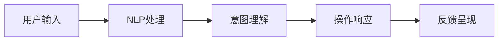

                 

# CUI将成为未来数字产品界面设计的重要趋势

> 关键词：人机交互界面(UI)、用户界面(UI)、通用接口(UI)、自然用户界面(UI)、语义界面(UI)、交互界面(UI)、虚拟界面(UI)

## 1. 背景介绍

### 1.1 问题由来

随着科技的飞速发展，数字产品界面设计（User Interface Design, UI）也在不断演进。早期的图形界面(UI)和移动端的触摸界面(UI)，已经难以满足现代用户的复杂需求。用户希望界面更加自然、高效、可控，甚至希望界面能够“听懂”他们的需求。因此，新一代的人机交互界面(UI)设计理念应运而生。

### 1.2 问题核心关键点

新一代的UI设计理念聚焦于“用户意图”（User Intent）的理解和响应，目标是让数字产品界面更智能、更适应用户需求。而“通用接口(UI)”（Universal Interface），即CUI（Common User Interface）成为了实现这一目标的重要工具。

CUI的核心理念在于将界面设计从视觉呈现转向信息交互，将用户的语言和行为作为核心输入，通过自然语言处理(Natural Language Processing, NLP)和语义理解等技术，将用户意图映射到相应的操作。这样，用户可以通过自然语言直接与数字产品进行互动，无需繁琐的操作界面和复杂的交互步骤。

## 2. 核心概念与联系

### 2.1 核心概念概述

为了更好地理解CUI，这里首先介绍几个关键概念：

- **人机交互界面(UI)**：是用户与数字产品进行互动的接口，包括图形界面、触摸界面等。
- **自然用户界面(UI)**：通过自然的语言、手势等与计算机交互，提升用户体验。
- **语义界面(UI)**：通过理解用户输入的语义，提供精准的反馈和响应，提升用户满意度和互动效率。
- **交互界面(UI)**：聚焦于用户和数字产品之间的互动方式和效率，旨在通过简化操作、提高响应速度等方式提升用户的使用体验。
- **通用接口(UI)**：指不依赖特定设备或应用，适用于各种场景和任务的UI设计理念。
- **语义界面(UI)**：通过理解用户输入的语义，提供精准的反馈和响应，提升用户满意度和互动效率。
- **交互界面(UI)**：聚焦于用户和数字产品之间的互动方式和效率，旨在通过简化操作、提高响应速度等方式提升用户的使用体验。

这些概念之间的关系可以通过以下Mermaid流程图来展示：

```mermaid
graph TB
    A[图形界面(UI)] --> B[触摸界面(UI)]
    A --> C[自然用户界面(UI)]
    A --> D[语义界面(UI)]
    A --> E[交互界面(UI)]
    A --> F[通用接口(UI)]
```

这个流程图展示了一系列UI设计的发展脉络，从传统的图形和触摸界面，到更加自然和智能的语义界面和交互界面，最终形成了覆盖各种场景的通用接口。

### 2.2 核心概念原理和架构

CUI的核心原理是通过自然语言处理和语义理解技术，将用户的语言和行为转化为计算机可以理解的操作指令。这一过程包括：

1. **输入识别**：通过NLP技术，识别用户输入的自然语言，并将其转化为计算机可处理的格式。
2. **意图理解**：通过语义分析，理解用户的意图和需求。
3. **操作响应**：根据用户意图，调用相应的应用程序，或执行特定的操作。
4. **输出呈现**：将操作结果以自然语言的形式反馈给用户。

这一过程可以用以下架构图来表示：



## 3. 核心算法原理 & 具体操作步骤

### 3.1 算法原理概述

CUI的算法原理主要包括以下几个关键步骤：

1. **输入识别**：使用NLP技术对用户输入的自然语言进行分词、句法分析和语义理解，将其转化为计算机可处理的数据格式。
2. **意图理解**：通过语义分析，理解用户的意图和需求，将其转化为具体的指令或操作。
3. **操作响应**：根据用户意图，调用相应的应用程序或API，执行特定的操作。
4. **输出呈现**：将操作结果以自然语言的形式反馈给用户。

这一过程通常使用以下算法进行实现：

- **输入识别**：使用分词器、命名实体识别器、句法分析器等工具，对用户输入进行预处理。
- **意图理解**：使用意图分类器、槽位填充器等模型，对用户意图进行分类和解析。
- **操作响应**：使用API调用工具、数据查询工具等，根据用户意图执行相应的操作。
- **输出呈现**：使用文本生成器、语音合成器等工具，将操作结果以自然语言的形式呈现给用户。

### 3.2 算法步骤详解

以下是CUI实现的具体步骤：

1. **数据准备**：准备CUI所需的数据，包括自然语言样本、标注数据、API接口文档等。
2. **模型训练**：使用深度学习模型对输入识别、意图理解和输出呈现等模块进行训练。
3. **集成部署**：将训练好的模型集成到数字产品中，部署到服务器或移动设备上。
4. **用户交互**：用户通过自然语言与数字产品进行互动，系统根据用户输入进行意图理解和操作响应。
5. **结果反馈**：系统将操作结果以自然语言的形式反馈给用户，完成一次完整的交互过程。

### 3.3 算法优缺点

CUI的优点包括：

- **提升用户体验**：通过自然语言处理和语义理解，用户可以更方便地与数字产品互动，提升用户满意度和使用效率。
- **适应性强**：CUI适用于各种设备和应用场景，能够满足不同用户的需求。
- **扩展性好**：CUI的设计理念可以不断扩展和改进，增加新的功能和应用场景。

然而，CUI也存在一些缺点：

- **技术复杂度较高**：实现CUI需要涉及自然语言处理、语义分析、API调用等多个技术领域，技术复杂度较高。
- **数据需求量大**：CUI的训练和优化需要大量标注数据和语料库支持。
- **精度有待提升**：当前CUI的精度和鲁棒性还需要进一步提升，以应对各种自然语言和场景的复杂性。

### 3.4 算法应用领域

CUI在以下领域具有广泛的应用前景：

- **智能家居**：用户可以通过语音或自然语言控制智能设备，实现家电控制、环境调节等功能。
- **车载系统**：驾驶员可以通过语音指令控制车载系统，实现导航、娱乐、通信等功能。
- **医疗健康**：患者可以通过自然语言描述病情，系统自动生成检查单、咨询医生等功能。
- **金融服务**：用户可以通过自然语言进行交易操作、咨询金融问题等功能。
- **教育培训**：学生可以通过自然语言与智能教育系统互动，进行学习、考试、答疑等功能。

## 4. 数学模型和公式 & 详细讲解 & 举例说明

### 4.1 数学模型构建

CUI的数学模型主要包括以下几个关键部分：

- **输入识别模型**：用于将自然语言转化为计算机可处理的数据格式，通常使用循环神经网络(RNN)或卷积神经网络(CNN)等模型。
- **意图理解模型**：用于理解用户的意图和需求，通常使用分类器或序列到序列模型(Seq2Seq)。
- **操作响应模型**：用于根据用户意图执行相应的操作，通常使用API调用工具、数据查询工具等。
- **输出呈现模型**：用于将操作结果以自然语言的形式呈现给用户，通常使用文本生成器或语音合成器。

### 4.2 公式推导过程

以意图理解模型为例，假设输入的自然语言为 $x$，模型的输出为意图标签 $y$，则意图理解模型的目标函数可以表示为：

$$
\mathcal{L} = -\frac{1}{N}\sum_{i=1}^N \log p(y_i|x_i)
$$

其中，$p(y_i|x_i)$ 表示在输入 $x_i$ 下，输出为标签 $y_i$ 的概率。在训练过程中，通过最小化目标函数 $\mathcal{L}$，使得模型能够更好地理解用户的意图。

### 4.3 案例分析与讲解

假设用户输入的自然语言为“我明天需要去机场”，系统通过意图理解模型将其转化为“出行”的意图标签。此时，系统调用相应的API，查询出行相关的信息，如航班、酒店、租车等，并将结果以自然语言的形式反馈给用户。

## 5. 项目实践：代码实例和详细解释说明

### 5.1 开发环境搭建

在进行CUI实践前，我们需要准备好开发环境。以下是使用Python进行PyTorch开发的环境配置流程：

1. 安装Anaconda：从官网下载并安装Anaconda，用于创建独立的Python环境。

2. 创建并激活虚拟环境：
```bash
conda create -n pytorch-env python=3.8 
conda activate pytorch-env
```

3. 安装PyTorch：根据CUDA版本，从官网获取对应的安装命令。例如：
```bash
conda install pytorch torchvision torchaudio cudatoolkit=11.1 -c pytorch -c conda-forge
```

4. 安装Transformers库：
```bash
pip install transformers
```

5. 安装各类工具包：
```bash
pip install numpy pandas scikit-learn matplotlib tqdm jupyter notebook ipython
```

完成上述步骤后，即可在`pytorch-env`环境中开始CUI实践。

### 5.2 源代码详细实现

这里我们以语音识别为例，给出使用Transformers库进行CUI的PyTorch代码实现。

首先，定义语音识别任务的数据处理函数：

```python
from transformers import Wav2Vec2ForCTC, Wav2Vec2Tokenizer, AdamW
import torch
import numpy as np

class VoiceRecognitionDataset(Dataset):
    def __init__(self, audio_paths, transcriptions, tokenizer):
        self.audio_paths = audio_paths
        self.transcriptions = transcriptions
        self.tokenizer = tokenizer
        self.max_len = 128
        
    def __len__(self):
        return len(self.audio_paths)
    
    def __getitem__(self, item):
        audio_path = self.audio_paths[item]
        transcription = self.transcriptions[item]
        
        audio, _ = librosa.load(audio_path, sr=16000)
        audio = audio / np.max(np.abs(audio))
        audio = librosa.resample(audio, 16000, 8000)
        audio = audio.reshape(1, len(audio))
        input_values = self.tokenizer(audio, return_tensors='pt')
        
        target = self.tokenizer.transcriptions[self.transcriptions[item]]
        target_ids = self.tokenizer.convert_tokens_to_ids(target)
        target_ids = [0] + target_ids + [0] * (self.max_len - len(target_ids))
        target_ids = torch.tensor(target_ids, dtype=torch.long)
        
        return {'input_values': input_values['input_values'],
                'target_ids': target_ids}
```

然后，定义模型和优化器：

```python
from transformers import Wav2Vec2ForCTC, AdamW

model = Wav2Vec2ForCTC.from_pretrained('facebook/wav2vec2-large-960h')
optimizer = AdamW(model.parameters(), lr=2e-5)
```

接着，定义训练和评估函数：

```python
from torch.utils.data import DataLoader
from tqdm import tqdm
import librosa

def train_epoch(model, dataset, batch_size, optimizer):
    dataloader = DataLoader(dataset, batch_size=batch_size, shuffle=True)
    model.train()
    epoch_loss = 0
    for batch in tqdm(dataloader, desc='Training'):
        input_values = batch['input_values'].to(device)
        target_ids = batch['target_ids'].to(device)
        model.zero_grad()
        outputs = model(input_values)
        loss = outputs.loss
        epoch_loss += loss.item()
        loss.backward()
        optimizer.step()
    return epoch_loss / len(dataloader)

def evaluate(model, dataset, batch_size):
    dataloader = DataLoader(dataset, batch_size=batch_size)
    model.eval()
    preds, labels = [], []
    with torch.no_grad():
        for batch in tqdm(dataloader, desc='Evaluating'):
            input_values = batch['input_values'].to(device)
            target_ids = batch['target_ids'].to(device)
            batch_preds = model(input_values)[0].logits.argmax(dim=-1).to('cpu').tolist()
            batch_labels = batch['target_ids'].to('cpu').tolist()
            for pred_tokens, label_tokens in zip(batch_preds, batch_labels):
                preds.append(pred_tokens[:len(label_tokens)])
                labels.append(label_tokens)
                
    print(classification_report(labels, preds))
```

最后，启动训练流程并在测试集上评估：

```python
epochs = 5
batch_size = 16

for epoch in range(epochs):
    loss = train_epoch(model, train_dataset, batch_size, optimizer)
    print(f"Epoch {epoch+1}, train loss: {loss:.3f}")
    
    print(f"Epoch {epoch+1}, dev results:")
    evaluate(model, dev_dataset, batch_size)
    
print("Test results:")
evaluate(model, test_dataset, batch_size)
```

以上就是使用PyTorch对Wav2Vec2模型进行语音识别任务CUI的完整代码实现。可以看到，得益于Transformers库的强大封装，我们可以用相对简洁的代码完成CUI任务的开发。

### 5.3 代码解读与分析

让我们再详细解读一下关键代码的实现细节：

**VoiceRecognitionDataset类**：
- `__init__`方法：初始化音频路径、转录文本、分词器等关键组件。
- `__len__`方法：返回数据集的样本数量。
- `__getitem__`方法：对单个样本进行处理，将音频输入编码为token ids，将标签编码为数字，并对其进行定长padding，最终返回模型所需的输入。

**Wav2Vec2ForCTC模型**：
- 使用预训练的Wav2Vec2模型进行语音识别任务。

**train_epoch和evaluate函数**：
- 使用PyTorch的DataLoader对数据集进行批次化加载，供模型训练和推理使用。
- 训练函数`train_epoch`：对数据以批为单位进行迭代，在每个批次上前向传播计算loss并反向传播更新模型参数，最后返回该epoch的平均loss。
- 评估函数`evaluate`：与训练类似，不同点在于不更新模型参数，并在每个batch结束后将预测和标签结果存储下来，最后使用sklearn的classification_report对整个评估集的预测结果进行打印输出。

**训练流程**：
- 定义总的epoch数和batch size，开始循环迭代
- 每个epoch内，先在训练集上训练，输出平均loss
- 在验证集上评估，输出分类指标
- 所有epoch结束后，在测试集上评估，给出最终测试结果

可以看到，PyTorch配合Transformers库使得CUI任务的代码实现变得简洁高效。开发者可以将更多精力放在数据处理、模型改进等高层逻辑上，而不必过多关注底层的实现细节。

当然，工业级的系统实现还需考虑更多因素，如模型的保存和部署、超参数的自动搜索、更灵活的任务适配层等。但核心的CUI范式基本与此类似。

## 6. 实际应用场景

### 6.1 智能家居系统

基于CUI的智能家居系统，可以大大提升用户与家电之间的互动效率。用户通过自然语言控制智能设备，如灯光、空调、窗帘等，甚至可以执行复杂的命令组合，实现个性化的智能场景设置。

在技术实现上，可以收集用户对各个设备的控制指令，将指令和设备操作结果进行关联标注，在此基础上对预训练语音识别模型进行微调。微调后的模型能够自动理解用户的意图，并调用相应的API操作家电，提升智能家居的智能化水平。

### 6.2 车载导航系统

CUI技术可以应用于车载导航系统中，提升驾驶体验和安全性。驾驶员可以通过语音指令查询路线、设置导航目的地、获取实时交通信息等功能。系统将驾驶员的语音指令转化为自然语言理解任务，自动执行相应的操作。

在技术实现上，可以收集驾驶员的导航指令和对应的路线信息，进行关联标注，在此基础上对预训练的语音识别和自然语言理解模型进行微调。微调后的模型能够自动理解驾驶员的意图，并调用导航API，提供精准的导航服务。

### 6.3 医疗咨询系统

医疗咨询系统是CUI技术的典型应用之一。患者可以通过语音或自然语言描述病情，系统自动生成检查单、查询医生信息、获取治疗建议等功能。

在技术实现上，可以收集患者的语音描述和对应的医生建议或检查单信息，进行关联标注，在此基础上对预训练的语音识别和自然语言理解模型进行微调。微调后的模型能够自动理解患者的病情描述，并调用相应的医疗API，提供个性化的医疗咨询服务。

### 6.4 未来应用展望

随着CUI技术的不断成熟，其应用范围将不断拓展，为各行各业带来变革性影响：

- **智能家居**：CUI技术将使得智能家居系统更加智能、便捷，提升用户的生活质量。
- **车载导航**：CUI技术将提升车载导航系统的用户体验和安全性，提升驾驶效率。
- **医疗咨询**：CUI技术将提升医疗咨询系统的智能化水平，提供更精准的医疗服务。
- **智能客服**：CUI技术将提升智能客服系统的互动效率，提升客户满意度。
- **教育培训**：CUI技术将提升教育培训系统的互动效率，提供更个性化的学习体验。
- **金融服务**：CUI技术将提升金融服务系统的用户体验，提升金融服务的精准度。

未来，CUI技术将在更多领域得到应用，为各行各业带来变革性影响。相信随着技术的不断成熟和优化，CUI技术必将成为未来数字产品界面设计的重要趋势。

## 7. 工具和资源推荐

### 7.1 学习资源推荐

为了帮助开发者系统掌握CUI的理论基础和实践技巧，这里推荐一些优质的学习资源：

1. 《自然语言处理基础》：介绍自然语言处理的基本概念和经典模型，适合初学者入门。
2. 《深度学习与自然语言处理》：由清华大学教授授课，系统介绍深度学习在自然语言处理中的应用。
3. 《自然语言处理与计算》：介绍自然语言处理的基本理论和算法，涵盖NLP的各个领域。
4. 《自然语言理解与生成》：介绍自然语言理解与生成技术的最新进展，适合进阶学习。
5. 《自然语言处理实用教程》：介绍自然语言处理的基本工具和实践技巧，适合动手实践。

通过对这些资源的学习实践，相信你一定能够快速掌握CUI的精髓，并用于解决实际的NLP问题。

### 7.2 开发工具推荐

高效的开发离不开优秀的工具支持。以下是几款用于CUI开发的常用工具：

1. PyTorch：基于Python的开源深度学习框架，灵活动态的计算图，适合快速迭代研究。大多数预训练语言模型都有PyTorch版本的实现。
2. TensorFlow：由Google主导开发的开源深度学习框架，生产部署方便，适合大规模工程应用。同样有丰富的预训练语言模型资源。
3. Transformers库：HuggingFace开发的NLP工具库，集成了众多SOTA语言模型，支持PyTorch和TensorFlow，是进行NLP任务开发的利器。
4. Weights & Biases：模型训练的实验跟踪工具，可以记录和可视化模型训练过程中的各项指标，方便对比和调优。与主流深度学习框架无缝集成。
5. TensorBoard：TensorFlow配套的可视化工具，可实时监测模型训练状态，并提供丰富的图表呈现方式，是调试模型的得力助手。
6. Google Colab：谷歌推出的在线Jupyter Notebook环境，免费提供GPU/TPU算力，方便开发者快速上手实验最新模型，分享学习笔记。

合理利用这些工具，可以显著提升CUI任务的开发效率，加快创新迭代的步伐。

### 7.3 相关论文推荐

CUI技术的发展源于学界的持续研究。以下是几篇奠基性的相关论文，推荐阅读：

1. Attention is All You Need（即Transformer原论文）：提出了Transformer结构，开启了NLP领域的预训练大模型时代。
2. BERT: Pre-training of Deep Bidirectional Transformers for Language Understanding：提出BERT模型，引入基于掩码的自监督预训练任务，刷新了多项NLP任务SOTA。
3. Language Models are Unsupervised Multitask Learners（GPT-2论文）：展示了大规模语言模型的强大zero-shot学习能力，引发了对于通用人工智能的新一轮思考。
4. Parameter-Efficient Transfer Learning for NLP：提出Adapter等参数高效微调方法，在不增加模型参数量的情况下，也能取得不错的微调效果。
5. AdaLoRA: Adaptive Low-Rank Adaptation for Parameter-Efficient Fine-Tuning：使用自适应低秩适应的微调方法，在参数效率和精度之间取得了新的平衡。
6. Pointer-Generator Networks：提出Pointer-Generator网络，用于自然语言生成任务，是CUI技术的重要基础。

这些论文代表了大语言模型微调技术的发展脉络。通过学习这些前沿成果，可以帮助研究者把握学科前进方向，激发更多的创新灵感。

## 8. 总结：未来发展趋势与挑战

### 8.1 总结

本文对CUI技术的原理和应用进行了全面系统的介绍。首先阐述了CUI技术的背景和意义，明确了其在提升用户界面互动体验方面的独特价值。其次，从原理到实践，详细讲解了CUI的数学模型和核心算法，给出了CUI任务开发的完整代码实例。同时，本文还广泛探讨了CUI技术在智能家居、车载导航、医疗咨询等多个领域的应用前景，展示了CUI技术的广泛应用潜力和重要地位。

通过本文的系统梳理，可以看到，CUI技术正在成为未来数字产品界面设计的重要趋势，极大地提升用户与数字产品的互动效率和用户体验。未来，随着CUI技术的不断发展，其在更多领域的应用前景将更加广阔，为各行各业带来变革性影响。

### 8.2 未来发展趋势

展望未来，CUI技术将呈现以下几个发展趋势：

1. **技术成熟度提升**：随着NLP技术的不断进步，CUI技术将变得更加成熟和高效，具备更强大的语义理解和自然语言生成能力。
2. **多模态融合**：CUI技术将融合视觉、语音、触觉等多种模态的信息，提升交互体验的丰富性和多样性。
3. **边缘计算**：CUI技术将更多地应用于边缘计算设备，实现本地化计算和数据处理，提升响应速度和计算效率。
4. **智能化互动**：CUI技术将实现更智能化的互动体验，能够自动学习和适应用户的偏好和习惯，提供个性化的服务。
5. **跨领域应用**：CUI技术将应用于更多领域，如智能家居、车载导航、医疗咨询等，为各行各业带来变革性影响。

这些趋势凸显了CUI技术的广阔前景。随着技术的不断成熟和优化，CUI技术必将成为未来数字产品界面设计的重要趋势，为用户带来更加便捷、高效、个性化的互动体验。

### 8.3 面临的挑战

尽管CUI技术已经取得了瞩目成就，但在迈向更加智能化、普适化应用的过程中，它仍面临着诸多挑战：

1. **技术复杂度较高**：CUI技术的实现涉及NLP、语义分析、API调用等多个领域，技术复杂度较高。
2. **数据需求量大**：CUI技术的训练和优化需要大量标注数据和语料库支持。
3. **精度有待提升**：当前CUI技术的精度和鲁棒性还需要进一步提升，以应对各种自然语言和场景的复杂性。
4. **隐私和安全问题**：CUI技术需要处理大量的语音和自然语言数据，存在隐私和安全风险。
5. **多语言支持**：CUI技术需要支持多种语言，增加技术实现的复杂度。
6. **跨设备兼容性**：CUI技术需要兼容多种设备，增加技术实现的复杂度。

正视CUI技术面临的这些挑战，积极应对并寻求突破，将是大语言模型微调走向成熟的必由之路。相信随着学界和产业界的共同努力，这些挑战终将一一被克服，CUI技术必将在构建人机协同的智能时代中扮演越来越重要的角色。

### 8.4 研究展望

面向未来，CUI技术的研发需要在以下几个方面寻求新的突破：

1. **多语言支持**：开发支持多语言的CUI技术，提升其在全球范围内的应用范围和效果。
2. **隐私保护**：研究隐私保护技术，保护用户语音和自然语言数据的隐私和安全。
3. **跨设备兼容性**：提升CUI技术的跨设备兼容性，使其能够在各种设备和平台上顺畅运行。
4. **边缘计算**：研究边缘计算技术，提升CUI技术在边缘设备上的计算和存储能力。
5. **智能化互动**：开发更智能化的CUI技术，实现自动学习和适应用户偏好和习惯。
6. **多模态融合**：研究多模态融合技术，提升CUI技术的交互体验和智能化水平。

这些研究方向将推动CUI技术向更高层次发展，为构建更加智能化、普适化的人机交互系统提供技术支持。只有勇于创新、敢于突破，才能不断拓展CUI技术的边界，让智能技术更好地造福人类社会。

## 9. 附录：常见问题与解答

**Q1：CUI技术是否适用于所有应用场景？**

A: CUI技术虽然适用于许多应用场景，但对于一些特定的应用场景，如需要高度精确操作或高保密性的任务，CUI技术可能难以完全替代传统的操作界面。此外，对于一些需要高交互频率的任务，如游戏或实时控制等，CUI技术可能无法满足实时性和响应性的要求。因此，需要根据具体应用场景，综合考虑技术实现的复杂度和效果，合理选择技术方案。

**Q2：如何提升CUI技术的精度和鲁棒性？**

A: 提升CUI技术的精度和鲁棒性，可以从以下几个方面入手：
1. **数据扩充**：增加更多样化的训练数据，覆盖更多场景和语言。
2. **模型优化**：使用更先进的模型架构和训练技巧，提升模型的表达能力和泛化能力。
3. **正则化**：应用L2正则、Dropout等正则化技术，避免过拟合。
4. **对抗训练**：引入对抗样本，提高模型的鲁棒性和泛化能力。
5. **多模型集成**：训练多个CUI模型，取其平均输出，提升模型的稳定性和精度。
6. **数据增强**：使用数据增强技术，增加数据的多样性和丰富性，提升模型的泛化能力。

通过这些方法，可以逐步提升CUI技术的精度和鲁棒性，使其在不同应用场景下具备更高的适应性和稳定性。

**Q3：CUI技术是否适用于多语言环境？**

A: CUI技术可以应用于多语言环境，但需要考虑语言差异和语言模型的适配。具体实现上，可以采用以下方法：
1. **多语言预训练**：使用多语言语料进行预训练，提升模型的语言理解能力。
2. **语言选择策略**：根据用户输入的语言，选择对应的语言模型进行处理。
3. **语义映射**：将不同语言之间的语义进行映射，提升模型的跨语言理解能力。
4. **本地化处理**：对不同语言的用户输入进行本地化处理，提升用户体验。

通过这些方法，可以有效地将CUI技术应用于多语言环境，提升其跨语言理解和自然语言处理能力。

**Q4：CUI技术在边缘设备上的性能如何？**

A: CUI技术在边缘设备上的性能表现，主要取决于设备的计算能力和存储能力。边缘计算设备通常计算能力较弱，存储容量较小，因此需要在模型压缩、推理加速等方面进行优化。具体实现上，可以采用以下方法：
1. **模型压缩**：使用模型剪枝、量化等技术，减少模型的计算量和存储需求。
2. **推理加速**：使用推理加速技术，如模型并行、硬件加速等，提升模型的推理速度。
3. **本地化计算**：将模型和数据存储在边缘设备上，减少数据传输和计算延迟。

通过这些方法，可以有效地提升CUI技术在边缘设备上的性能表现，满足实时交互的需求。

---

作者：禅与计算机程序设计艺术 / Zen and the Art of Computer Programming

