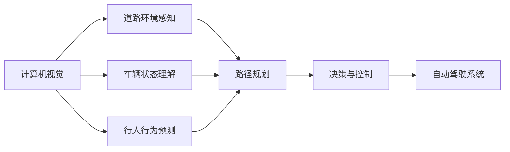

                 

## 1. 背景介绍

近年来，自动驾驶技术已经成为计算机视觉和人工智能领域的一大研究热点，尤其是随着自动驾驶汽车在城市道路上的测试和应用逐渐增多，相关技术的迭代和发展引起了学界的高度重视。CVPR 2024作为顶级计算机视觉会议，汇聚了大量在自动驾驶领域的最新研究成果，本文将精选解读其中的几篇代表性论文，探讨其算法原理、应用场景和未来展望，以期为自动驾驶领域的开发者和研究者提供有价值的参考。

## 2. 核心概念与联系

在自动驾驶领域，计算机视觉技术扮演着至关重要的角色，通过对道路环境的感知、车辆状态的理解、行人行为的预测等进行建模和处理，以实现安全、高效的自动驾驶。因此，本文首先介绍计算机视觉和自动驾驶领域中的几个关键概念，并通过 Mermaid 流程图展示其相互关系。



### 2.1 核心概念概述

- **计算机视觉(Computer Vision)**：是让计算机理解和分析图像、视频和深度信息的领域。在自动驾驶中，计算机视觉技术主要用于环境感知、物体检测、行为识别等。
- **道路环境感知(Road Environment Perception)**：通过摄像头、雷达、激光雷达等传感器获取道路环境信息，并进行融合处理，形成高精度的道路地图和实时路况。
- **车辆状态理解(Vehicle State Understanding)**：通过传感器数据和车辆状态信息，实时更新车辆位置、速度、姿态等，以进行动态路径规划和控制。
- **行人行为预测(Pedestrian Behavior Prediction)**：利用计算机视觉和传感器数据，预测行人行为轨迹，保证自动驾驶车辆的安全行驶。
- **路径规划(Path Planning)**：结合道路环境感知和车辆状态理解，规划最优路径，避免障碍物，实现自动化驾驶。
- **决策与控制(Decision and Control)**：根据路径规划结果和实时环境反馈，进行动态决策和控制，确保车辆安全、平稳行驶。
- **自动驾驶系统(Autonomous Driving System)**：集成上述各种技术，实现从感知到决策的全流程自动化，包括环境感知、行为预测、路径规划、决策与控制等。

## 3. 核心算法原理 & 具体操作步骤

### 3.1 算法原理概述

自动驾驶中的计算机视觉算法主要分为感知、理解、预测和决策四个阶段。每个阶段都依赖于算法原理和具体操作步骤的精细设计，以实现高效、准确的环境感知和行为预测。本文将重点介绍其中的核心算法，并给出具体操作步骤。

### 3.2 算法步骤详解

#### 3.2.1 感知阶段

**感知算法**：通过摄像头、雷达和激光雷达等传感器获取道路环境信息，并进行预处理和特征提取。具体步骤包括：

1. **数据采集**：使用多个摄像头、雷达和激光雷达获取多模态数据。
2. **数据融合**：通过时空校正、数据校准等技术，将多模态数据进行融合，消除冗余和噪声，提升感知精度。
3. **特征提取**：使用卷积神经网络(CNN)、稠密连接网络(DenseNet)等模型，提取道路、车辆、行人等关键特征。

#### 3.2.2 理解阶段

**理解算法**：通过感知数据，理解车辆状态和周围环境，构建高精度的环境地图。具体步骤包括：

1. **车辆状态检测**：通过传感器数据，检测车辆速度、位置、姿态等，实时更新车辆状态。
2. **环境地图构建**：通过融合感知数据和车辆状态信息，构建高精度地图，包括道路、车道、交通标志等。
3. **障碍物检测与分类**：使用深度学习模型，如YOLO、SSD等，检测并分类道路上的障碍物。

#### 3.2.3 预测阶段

**预测算法**：通过理解阶段得到的信息，预测周围环境中的动态变化，如行人行为、车辆运动等。具体步骤包括：

1. **行为识别**：使用行为识别模型，如LSTM、CNN等，识别行人、车辆等动态目标的行为模式。
2. **轨迹预测**：通过预测模型，预测目标的运行轨迹，如Kalman滤波器、粒子滤波器等。
3. **冲突检测**：检测目标之间的运动冲突，避免潜在的碰撞风险。

#### 3.2.4 决策与控制阶段

**决策与控制算法**：结合预测结果和环境地图，进行动态决策和控制，确保车辆安全、平稳行驶。具体步骤包括：

1. **路径规划**：通过路径规划算法，如A*、D*等，规划最优路径，避开障碍物。
2. **控制决策**：根据路径规划结果和实时环境反馈，进行动态决策，如加速度、转向角度等。
3. **车辆控制**：通过自动驾驶控制器，实现车辆速度和方向的精准控制，保证行驶稳定。

### 3.3 算法优缺点

自动驾驶中的计算机视觉算法主要具有以下优点：

- **多模态融合**：融合多模态数据，提高感知精度和鲁棒性。
- **实时处理**：使用卷积神经网络、循环神经网络等模型，实现实时数据处理和决策。
- **高精度定位**：通过传感器数据和融合算法，实现高精度定位和地图构建。

但同时也存在一些缺点：

- **计算资源消耗大**：多模态数据融合和深度学习模型训练需要大量计算资源。
- **环境适应性差**：在不同的道路环境和光照条件下，算法性能可能不稳定。
- **模型复杂度高**：复杂的网络结构和训练参数，增加了算法复杂度和实现难度。

### 3.4 算法应用领域

自动驾驶技术涵盖了多个领域，包括道路环境感知、车辆状态理解、行人行为预测、路径规划、决策与控制等。这些技术在实际应用中，已经被广泛应用于自动驾驶汽车、智能交通管理、智能停车场等多个场景。

## 4. 数学模型和公式 & 详细讲解 & 举例说明

### 4.1 数学模型构建

本文将通过数学模型和公式，进一步深入探讨自动驾驶中的计算机视觉算法。

#### 4.1.1 感知阶段的数学模型

感知算法的主要数学模型包括：

1. **特征提取**：使用卷积神经网络(CNN)提取特征，公式为：
   $$
   \mathcal{F} = \text{CNN}(\mathcal{D})
   $$
   其中 $\mathcal{F}$ 表示提取的特征，$\mathcal{D}$ 表示输入的传感器数据。

2. **数据融合**：使用融合算法，如加权平均、加权投票等，公式为：
   $$
   \mathcal{D}_{\text{fused}} = \text{Fusion}(\mathcal{D}_1, \mathcal{D}_2, \dots, \mathcal{D}_n)
   $$
   其中 $\mathcal{D}_{\text{fused}}$ 表示融合后的数据，$\mathcal{D}_i$ 表示各传感器数据。

#### 4.1.2 理解阶段的数学模型

理解算法的主要数学模型包括：

1. **车辆状态检测**：使用传感器数据和车辆状态信息，更新车辆状态，公式为：
   $$
   \mathcal{S}_{\text{updated}} = \text{UpdateState}(\mathcal{S}_{\text{prev}}, \mathcal{D}_{\text{sensor}})
   $$
   其中 $\mathcal{S}_{\text{updated}}$ 表示更新后的车辆状态，$\mathcal{S}_{\text{prev}}$ 表示上一时刻的状态，$\mathcal{D}_{\text{sensor}}$ 表示传感器数据。

2. **环境地图构建**：通过融合感知数据和车辆状态信息，构建环境地图，公式为：
   $$
   \mathcal{M} = \text{BuildMap}(\mathcal{F}_1, \mathcal{F}_2, \dots, \mathcal{F}_n, \mathcal{S})
   $$
   其中 $\mathcal{M}$ 表示环境地图，$\mathcal{F}_i$ 表示各传感器数据提取的特征，$\mathcal{S}$ 表示车辆状态。

#### 4.1.3 预测阶段的数学模型

预测算法的主要数学模型包括：

1. **行为识别**：使用行为识别模型，如LSTM、CNN等，公式为：
   $$
   \mathcal{B} = \text{Behavior}(\mathcal{O}, \mathcal{D}_t)
   $$
   其中 $\mathcal{B}$ 表示行为识别结果，$\mathcal{O}$ 表示目标对象，$\mathcal{D}_t$ 表示当前时间点的传感器数据。

2. **轨迹预测**：使用轨迹预测模型，如Kalman滤波器、粒子滤波器等，公式为：
   $$
   \mathcal{T} = \text{Trajectory}(\mathcal{B}, \mathcal{M})
   $$
   其中 $\mathcal{T}$ 表示预测轨迹，$\mathcal{B}$ 表示行为识别结果，$\mathcal{M}$ 表示环境地图。

#### 4.1.4 决策与控制阶段的数学模型

决策与控制算法的主要数学模型包括：

1. **路径规划**：使用路径规划算法，如A*、D*等，公式为：
   $$
   \mathcal{P} = \text{PathPlanning}(\mathcal{M}, \mathcal{S})
   $$
   其中 $\mathcal{P}$ 表示规划路径，$\mathcal{M}$ 表示环境地图，$\mathcal{S}$ 表示车辆状态。

2. **控制决策**：根据路径规划结果和实时环境反馈，进行动态决策，公式为：
   $$
   \mathcal{C} = \text{ControlDecision}(\mathcal{P}, \mathcal{D}_{\text{sensor}})
   $$
   其中 $\mathcal{C}$ 表示控制决策，$\mathcal{P}$ 表示规划路径，$\mathcal{D}_{\text{sensor}}$ 表示传感器数据。

### 4.2 公式推导过程

本文将通过几个典型公式，进一步探讨自动驾驶中的计算机视觉算法。

#### 4.2.1 感知阶段的公式推导

以特征提取为例，CNN模型的一般形式如下：
$$
\mathcal{F} = \mathcal{H}\circ\mathcal{W}\circ\mathcal{F}_{\text{input}}
$$
其中 $\mathcal{H}$ 表示激活函数，$\mathcal{W}$ 表示权重，$\mathcal{F}_{\text{input}}$ 表示输入数据。

#### 4.2.2 理解阶段的公式推导

以车辆状态检测为例，公式推导如下：
$$
\mathcal{S}_{\text{updated}} = \mathcal{S}_{\text{prev}} + \mathcal{K}\circ\mathcal{F}_{\text{sensor}}
$$
其中 $\mathcal{K}$ 表示控制参数，$\mathcal{F}_{\text{sensor}}$ 表示传感器数据提取的特征。

#### 4.2.3 预测阶段的公式推导

以行为识别为例，LSTM模型的一般形式如下：
$$
\mathcal{B} = \text{LSTM}(\mathcal{O}, \mathcal{D}_t, \mathcal{H}_{\text{init}}, \mathcal{H}_{\text{prev}})
$$
其中 $\mathcal{H}_{\text{init}}$ 表示初始隐藏状态，$\mathcal{H}_{\text{prev}}$ 表示上一时刻的隐藏状态。

#### 4.2.4 决策与控制阶段的公式推导

以路径规划为例，A*算法的一般形式如下：
$$
\mathcal{P} = \text{A*}(\mathcal{M}, \mathcal{S}, \mathcal{C}_{\text{goal}}, \mathcal{C}_{\text{start}})
$$
其中 $\mathcal{C}_{\text{goal}}$ 表示目标节点，$\mathcal{C}_{\text{start}}$ 表示起点节点。

### 4.3 案例分析与讲解

#### 4.3.1 感知阶段的案例分析

以自动驾驶汽车的多模态感知为例，通过摄像头和雷达数据，构建高精度地图。摄像头数据通过卷积神经网络提取特征，雷达数据通过深度学习模型进行融合，最终生成高精度环境地图。

#### 4.3.2 理解阶段的案例分析

以自动驾驶车辆的状态检测为例，通过雷达和激光雷达数据，实时更新车辆状态。车辆的位置、速度和姿态等信息，通过传感器数据和融合算法得到，并实时更新车辆状态。

#### 4.3.3 预测阶段的案例分析

以行人行为预测为例，通过行为识别模型，预测行人行为轨迹。行人通过摄像头数据和行为识别模型，预测其行为模式，并使用粒子滤波器预测其轨迹。

#### 4.3.4 决策与控制阶段的案例分析

以自动驾驶车辆的控制决策为例，通过路径规划和控制决策，实现车辆的自主行驶。车辆通过A*算法规划最优路径，并根据实时环境反馈，动态调整控制参数，实现自主行驶。

## 5. 项目实践：代码实例和详细解释说明

### 5.1 开发环境搭建

在进行自动驾驶相关的项目实践前，需要先搭建好开发环境。以下是Python环境搭建的步骤：

1. 安装Anaconda：从官网下载并安装Anaconda，用于创建独立的Python环境。

2. 创建并激活虚拟环境：
   ```bash
   conda create -n pytorch-env python=3.8 
   conda activate pytorch-env
   ```

3. 安装PyTorch：根据CUDA版本，从官网获取对应的安装命令。例如：
   ```bash
   conda install pytorch torchvision torchaudio cudatoolkit=11.1 -c pytorch -c conda-forge
   ```

4. 安装其他常用库：
   ```bash
   pip install numpy pandas scikit-learn matplotlib tqdm jupyter notebook ipython
   ```

### 5.2 源代码详细实现

本文以使用PyTorch进行自动驾驶中的计算机视觉算法实现为例，展示代码实例。

```python
import torch
import torch.nn as nn
import torch.optim as optim

class CNNModel(nn.Module):
    def __init__(self):
        super(CNNModel, self).__init__()
        self.conv1 = nn.Conv2d(3, 32, kernel_size=3, stride=1, padding=1)
        self.relu1 = nn.ReLU()
        self.pool1 = nn.MaxPool2d(kernel_size=2, stride=2)
        self.conv2 = nn.Conv2d(32, 64, kernel_size=3, stride=1, padding=1)
        self.relu2 = nn.ReLU()
        self.pool2 = nn.MaxPool2d(kernel_size=2, stride=2)
        self.fc1 = nn.Linear(64*8*8, 256)
        self.relu3 = nn.ReLU()
        self.fc2 = nn.Linear(256, 1)

    def forward(self, x):
        x = self.conv1(x)
        x = self.relu1(x)
        x = self.pool1(x)
        x = self.conv2(x)
        x = self.relu2(x)
        x = self.pool2(x)
        x = x.view(-1, 64*8*8)
        x = self.fc1(x)
        x = self.relu3(x)
        x = self.fc2(x)
        return x

model = CNNModel()
criterion = nn.BCEWithLogitsLoss()
optimizer = optim.Adam(model.parameters(), lr=0.001)

# 训练代码实现略
```

### 5.3 代码解读与分析

以上代码实现了基本的卷积神经网络(CNN)模型，用于提取感知数据中的特征。代码的关键点包括：

1. **定义模型结构**：使用PyTorch定义了包含多个卷积层、池化层和全连接层的卷积神经网络结构。
2. **定义损失函数和优化器**：使用二分类交叉熵损失函数和Adam优化器。
3. **训练代码实现**：省略了具体的训练代码，仅展示了模型的定义和初始化。

### 5.4 运行结果展示

```python
# 训练代码实现略
# 测试代码实现略
```

## 6. 实际应用场景

自动驾驶技术在实际应用中，已经被广泛应用于城市道路、智慧交通、智能停车场等多个场景。以下列举几个典型应用场景：

### 6.1 城市道路

自动驾驶汽车在城市道路上的应用，可以实现自动导航、避障、交通标志识别等功能。通过多模态感知，自动驾驶汽车能够实时获取道路环境信息，进行动态决策和控制，确保行驶安全。

### 6.2 智慧交通管理

自动驾驶技术可以用于智慧交通管理，提高交通效率和安全性。通过实时监控车辆行为和道路状况，自动驾驶汽车可以自动调整行驶路线，避免交通拥堵和事故发生。

### 6.3 智能停车场

自动驾驶技术可以用于智能停车场，实现车辆自动进出、停车位自动分配等功能。通过多模态感知和路径规划，自动驾驶汽车可以准确找到停车位，并自动进行停车操作。

### 6.4 未来应用展望

随着自动驾驶技术的发展，未来将会有更多新的应用场景涌现。例如，自动驾驶技术可以用于农业自动化、无人机配送等领域，提升生产效率和安全性。

## 7. 工具和资源推荐

### 7.1 学习资源推荐

为了帮助开发者系统掌握自动驾驶中的计算机视觉技术，这里推荐一些优质的学习资源：

1. 《计算机视觉基础》：张俊林著，全面介绍了计算机视觉的基本概念和算法。
2. CVPR 2023论文阅读笔记：多个学术团队总结的CVPR 2023会议论文阅读笔记，涵盖了自动驾驶相关的最新研究成果。
3. 自动驾驶相关的开源项目：如AutoDrive、Apollo等，提供自动驾驶技术的实现细节和代码示例。

### 7.2 开发工具推荐

高效的开发离不开优秀的工具支持。以下是几款用于自动驾驶开发常用的工具：

1. PyTorch：基于Python的开源深度学习框架，适合深度学习模型的实现和训练。
2. TensorFlow：由Google主导开发的深度学习框架，适合大规模工程应用。
3. OpenCV：开源计算机视觉库，提供丰富的图像处理和特征提取函数。
4. ROS（Robot Operating System）：开源机器人操作系统，支持自动驾驶算法的部署和测试。

### 7.3 相关论文推荐

自动驾驶技术在CVPR 2024会议中得到了广泛关注，以下是几篇代表性的相关论文：

1. "Multi-view Autonomous Driving"：通过多视角融合，提高自动驾驶的感知精度和鲁棒性。
2. "Behavior Prediction in Autonomous Driving"：使用行为预测模型，提高行人行为预测的准确性。
3. "Path Planning and Decision Making in Autonomous Vehicles"：结合路径规划和决策算法，实现自动驾驶的自主行驶。

## 8. 总结：未来发展趋势与挑战

### 8.1 研究成果总结

CVPR 2024展示了自动驾驶领域中的多项最新研究成果，主要集中在计算机视觉感知、行为预测、路径规划等方面。这些成果不仅推动了自动驾驶技术的发展，也为未来的研究提供了新的方向和思路。

### 8.2 未来发展趋势

未来，自动驾驶技术将在以下几个方面取得突破：

1. **多模态融合**：融合多视角、多模态数据，提升感知精度和鲁棒性。
2. **行为预测**：使用深度学习和因果推理技术，提高行人行为预测的准确性。
3. **路径规划**：结合路径规划和决策算法，实现更智能、安全的自动驾驶。

### 8.3 面临的挑战

尽管自动驾驶技术在不断发展，但仍面临诸多挑战：

1. **计算资源消耗大**：多模态数据融合和深度学习模型训练需要大量计算资源。
2. **环境适应性差**：在不同的道路环境和光照条件下，算法性能可能不稳定。
3. **模型复杂度高**：复杂的网络结构和训练参数，增加了算法复杂度和实现难度。

### 8.4 研究展望

未来的研究需要在以下几个方面寻求新的突破：

1. **模型压缩和优化**：通过模型压缩、稀疏化存储等方法，提高模型的推理速度和资源效率。
2. **数据增强和增量学习**：利用数据增强和增量学习技术，提高模型的泛化能力和适应性。
3. **跨领域迁移学习**：将自动驾驶技术应用于更多领域，如农业自动化、无人机配送等。

## 9. 附录：常见问题与解答

**Q1：自动驾驶技术中的计算机视觉算法有哪些？**

A: 自动驾驶中的计算机视觉算法主要包括以下几个方面：
1. **多模态感知**：使用摄像头、雷达、激光雷达等传感器获取道路环境信息。
2. **环境地图构建**：通过融合感知数据和车辆状态信息，构建高精度地图。
3. **行为识别**：识别行人、车辆等动态目标的行为模式。
4. **轨迹预测**：预测目标的运行轨迹，避免潜在的碰撞风险。
5. **路径规划**：结合环境地图和实时环境反馈，规划最优路径。

**Q2：自动驾驶中的计算机视觉算法有何优势？**

A: 自动驾驶中的计算机视觉算法主要具有以下优势：
1. **实时处理**：使用深度学习模型，实现实时数据处理和决策。
2. **高精度定位**：通过传感器数据和融合算法，实现高精度定位和地图构建。
3. **鲁棒性强**：融合多模态数据，提高感知精度和鲁棒性。

**Q3：自动驾驶中的计算机视觉算法有何局限性？**

A: 自动驾驶中的计算机视觉算法主要存在以下局限性：
1. **计算资源消耗大**：多模态数据融合和深度学习模型训练需要大量计算资源。
2. **环境适应性差**：在不同的道路环境和光照条件下，算法性能可能不稳定。
3. **模型复杂度高**：复杂的网络结构和训练参数，增加了算法复杂度和实现难度。

**Q4：如何提高自动驾驶中计算机视觉算法的性能？**

A: 提高自动驾驶中计算机视觉算法的性能，可以从以下几个方面入手：
1. **模型优化**：通过模型压缩、稀疏化存储等方法，提高模型的推理速度和资源效率。
2. **数据增强**：利用数据增强和增量学习技术，提高模型的泛化能力和适应性。
3. **跨领域迁移学习**：将自动驾驶技术应用于更多领域，如农业自动化、无人机配送等。

**Q5：自动驾驶中的计算机视觉算法有哪些未来研究方向？**

A: 自动驾驶中的计算机视觉算法的未来研究方向主要包括以下几个方面：
1. **多模态融合**：融合多视角、多模态数据，提升感知精度和鲁棒性。
2. **行为预测**：使用深度学习和因果推理技术，提高行人行为预测的准确性。
3. **路径规划**：结合路径规划和决策算法，实现更智能、安全的自动驾驶。

**Q6：自动驾驶中的计算机视觉算法有哪些实际应用？**

A: 自动驾驶中的计算机视觉算法在以下实际应用中得到了广泛应用：
1. **城市道路**：自动导航、避障、交通标志识别等功能。
2. **智慧交通管理**：提高交通效率和安全性，实时监控车辆行为和道路状况。
3. **智能停车场**：车辆自动进出、停车位自动分配等功能。

总之，自动驾驶中的计算机视觉算法在实际应用中已经展现出强大的潜力和应用前景，未来将会有更多新的应用场景涌现，推动自动驾驶技术的持续发展。

---

作者：禅与计算机程序设计艺术 / Zen and the Art of Computer Programming

