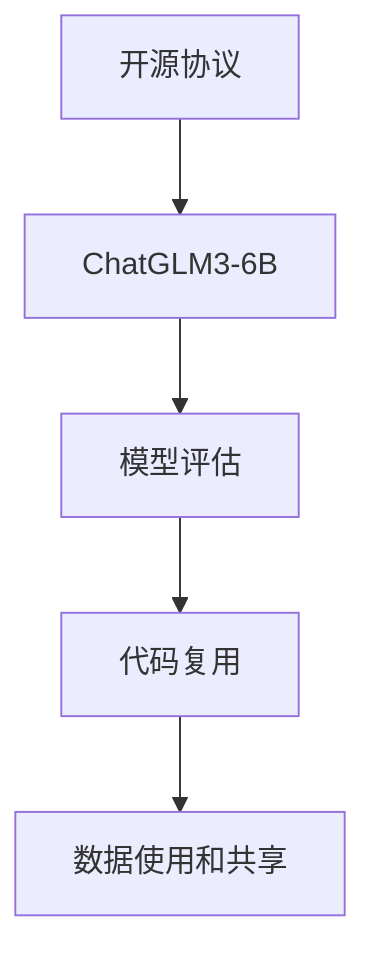

                 

# ChatGLM3-6B 的开源协议

> 关键词：ChatGLM, 6B参数, 开源协议, 深度学习, 自然语言处理(NLP), 代码复用, 模型评估

## 1. 背景介绍

### 1.1 问题由来
ChatGLM3-6B 是一款基于Transformer架构的深度学习模型，旨在通过大规模预训练和微调，提升自然语言处理的性能，特别是在对话生成、问答、机器翻译等任务上表现出色。其6B参数规模和先进的Transformer设计使其在多个任务上达到了领先水平，但同时也面临着开源协议和复用性等问题。本文旨在深入探讨ChatGLM3-6B的开源协议，分析其优缺点，并展望其应用前景。

### 1.2 问题核心关键点
ChatGLM3-6B的开源协议是影响其广泛应用的核心因素之一。它涉及到模型的代码开放程度、使用的许可协议、数据使用和共享的规定等内容。这些因素直接影响到模型被学术界、工业界和企业界采用的便利性和合规性。

## 2. 核心概念与联系

### 2.1 核心概念概述

为更好地理解ChatGLM3-6B的开源协议，本节将介绍几个密切相关的核心概念：

- **开源协议**：指软件、数据、算法等资源的公开和共享协议，旨在促进知识的共享和创新，同时保障知识产权。
- **ChatGLM3-6B**：一款基于Transformer架构的大规模预训练语言模型，以其6B参数规模和先进的Transformer设计著称，广泛应用于对话生成、问答、机器翻译等任务。
- **模型评估**：指使用标准化的评估指标和方法，衡量模型在不同任务上的性能，包括准确率、召回率、F1值等。
- **代码复用**：指通过开放代码库，使其他开发者能够重用已有代码，减少重复开发，提升开发效率。
- **数据使用和共享**：指在开源协议中，对于数据使用、共享和保护的规定，保障数据隐私和安全。

这些核心概念之间的逻辑关系可以通过以下Mermaid流程图来展示：



这个流程图展示了这个系统中的关键概念及其之间的关系：

1. 开源协议定义了ChatGLM3-6B模型的开放程度和使用方式。
2. 模型评估用于衡量ChatGLM3-6B在不同任务上的性能。
3. 代码复用依赖于开源协议和模型评估结果，使其他开发者能够高效地使用和扩展模型。
4. 数据使用和共享则受到开源协议的限制和指导，保障数据安全和隐私。

## 3. ChatGLM3-6B 的核心算法原理 & 具体操作步骤

### 3.1 算法原理概述

ChatGLM3-6B的核心算法原理基于Transformer架构，通过大规模预训练和微调，实现自然语言处理的高级任务。其算法步骤主要包括以下几个方面：

1. **自监督预训练**：在无标签文本数据上进行自监督训练，学习通用的语言表示。
2. **微调**：在特定任务的数据集上进行微调，使模型能够适应具体任务的需求。
3. **代码复用**：通过开放源代码，使其他开发者能够复用ChatGLM3-6B的架构和实现。
4. **模型评估**：使用标准化的评估指标和方法，衡量模型的性能。
5. **数据使用和共享**：在开源协议的指导下，合理使用和共享数据资源，保护数据隐私。

### 3.2 算法步骤详解

以下是ChatGLM3-6B模型的详细算法步骤：

1. **数据准备**：收集大规模无标签文本数据，将其用于自监督预训练。

2. **自监督预训练**：使用自监督任务，如掩码语言模型、下一句预测等，对模型进行预训练，学习通用的语言表示。

3. **微调**：针对特定任务的数据集，如对话生成、问答、机器翻译等，使用少量有标签数据进行微调，优化模型以适应具体任务。

4. **代码开放**：将ChatGLM3-6B的源代码和模型参数公开，供其他开发者复用。

5. **评估**：使用标准化的评估指标，如BLEU、ROUGE、F1值等，评估模型在不同任务上的性能。

6. **数据保护**：在开源协议中规定数据使用和共享的规则，保护数据隐私和安全。

### 3.3 算法优缺点

ChatGLM3-6B的开源协议具有以下优点：

- **高可用性**：通过代码复用，使其他开发者能够快速开发基于ChatGLM3-6B的应用，加速模型应用的推广。
- **透明度**：开放源代码和算法原理，提高了模型的透明度，促进了学术研究和工业应用的创新。
- **可扩展性**：开发者可以在ChatGLM3-6B的基础上进行功能扩展和优化，提升模型性能。

同时，该协议也存在以下局限性：

- **数据隐私**：数据共享和使用规则可能影响数据隐私和安全性，需谨慎处理。
- **模型鲁棒性**：开源协议未能解决模型在不同环境下的鲁棒性问题，需进一步研究。
- **知识传播**：虽然代码复用促进了知识的传播，但过度的依赖也可能导致技术垄断。

### 3.4 算法应用领域

ChatGLM3-6B的开源协议适用于多种自然语言处理任务，例如：

- **对话生成**：如智能客服、聊天机器人等，通过微调ChatGLM3-6B，实现高质量的对话生成。
- **问答系统**：如知识图谱、QA系统等，通过微调ChatGLM3-6B，回答用户提问。
- **机器翻译**：如英中、法中翻译等，通过微调ChatGLM3-6B，实现跨语言翻译。
- **文本摘要**：如新闻摘要、学术文献摘要等，通过微调ChatGLM3-6B，自动生成简洁摘要。
- **情感分析**：如客户反馈情感分析、新闻情感分析等，通过微调ChatGLM3-6B，分析情感倾向。

这些应用场景展示了ChatGLM3-6B开源协议的广泛适用性，有助于其在实际应用中得到更广泛的应用。

## 4. 数学模型和公式 & 详细讲解 & 举例说明

### 4.1 数学模型构建

ChatGLM3-6B的数学模型构建基于Transformer架构，其核心组件包括编码器、解码器和自注意力机制。以下是ChatGLM3-6B的基本数学模型构建：

1. **编码器**：由多个层叠的自注意力层和前馈神经网络层组成，用于学习输入序列的表示。

2. **解码器**：同样由多个层叠的自注意力层和前馈神经网络层组成，用于生成输出序列。

3. **自注意力机制**：通过多头自注意力机制，计算输入序列中每个位置与其他位置的相关性。

### 4.2 公式推导过程

以编码器为例，其数学公式推导如下：

设输入序列为 $\{x_1, x_2, \ldots, x_n\}$，编码器的输出序列为 $\{h_1, h_2, \ldots, h_n\}$。假设每层编码器由 $n$ 个位置向量 $u_1, u_2, \ldots, u_n$ 组成，自注意力机制通过计算每个位置向量与所有其他位置向量的相关性，得到注意力权重 $\alpha_1, \alpha_2, \ldots, \alpha_n$。注意力权重计算公式为：

$$
\alpha_i = \frac{e^{s(u_i, u_j)}}{\sum_{k=1}^n e^{s(u_k, u_j)}} \quad (i, j = 1, 2, \ldots, n)
$$

其中 $s(u_i, u_j)$ 为注意力得分函数，通常使用点积形式：

$$
s(u_i, u_j) = u_i^T W_Q u_j
$$

编码器的输出 $h_i$ 计算公式为：

$$
h_i = \text{MLP}(\text{Attention}(u_i, \{u_1, u_2, \ldots, u_n\}))
$$

其中 $\text{MLP}$ 表示前馈神经网络，$\text{Attention}$ 表示自注意力机制。

### 4.3 案例分析与讲解

以机器翻译任务为例，通过微调ChatGLM3-6B，实现英中翻译。假设输入序列为 $e_1, e_2, \ldots, e_n$，目标序列为 $c_1, c_2, \ldots, c_n$，解码器输出的翻译结果为 $\tilde{c}_1, \tilde{c}_2, \ldots, \tilde{c}_n$。解码器的输出 $\tilde{c}_i$ 计算公式为：

$$
\tilde{c}_i = \text{Softmax}(\text{MLP}(s(c_{i-1}, e_1, e_2, \ldots, e_n)))
$$

其中 $s$ 表示解码器中的自注意力机制，$e_1, e_2, \ldots, e_n$ 和 $c_1, c_2, \ldots, c_n$ 分别为输入序列和目标序列，$\text{Softmax}$ 表示概率分布函数。

通过微调，ChatGLM3-6B能够自动学习输入和输出序列之间的映射关系，提升翻译精度。

## 5. 项目实践：代码实例和详细解释说明

### 5.1 开发环境搭建

在进行ChatGLM3-6B的微调实践前，我们需要准备好开发环境。以下是使用Python进行PyTorch开发的环境配置流程：

1. 安装Anaconda：从官网下载并安装Anaconda，用于创建独立的Python环境。

2. 创建并激活虚拟环境：
```bash
conda create -n pytorch-env python=3.8 
conda activate pytorch-env
```

3. 安装PyTorch：根据CUDA版本，从官网获取对应的安装命令。例如：
```bash
conda install pytorch torchvision torchaudio cudatoolkit=11.1 -c pytorch -c conda-forge
```

4. 安装TensorFlow：
```bash
pip install tensorflow==2.5.0
```

5. 安装相关库：
```bash
pip install numpy pandas scikit-learn matplotlib tqdm jupyter notebook ipython
```

完成上述步骤后，即可在`pytorch-env`环境中开始微调实践。

### 5.2 源代码详细实现

这里以机器翻译任务为例，展示ChatGLM3-6B模型的微调代码实现。

首先，定义数据集和模型：

```python
from transformers import AutoTokenizer, AutoModelForSeq2SeqLM
import torch
from torch.utils.data import Dataset, DataLoader
import numpy as np

class MyDataset(Dataset):
    def __init__(self, data, tokenizer):
        self.data = data
        self.tokenizer = tokenizer

    def __len__(self):
        return len(self.data)

    def __getitem__(self, idx):
        source, target = self.data[idx]
        tokenized_source = self.tokenizer(source, return_tensors='pt')
        tokenized_target = self.tokenizer(target, return_tensors='pt', padding='max_length', truncation=True)
        return {
            'input_ids': tokenized_source['input_ids'],
            'target_ids': tokenized_target['input_ids']
        }

tokenizer = AutoTokenizer.from_pretrained('chatglm-6B')
model = AutoModelForSeq2SeqLM.from_pretrained('chatglm-6B')
device = torch.device('cuda' if torch.cuda.is_available() else 'cpu')
model.to(device)
```

然后，定义训练和评估函数：

```python
from transformers import AdamW
from sklearn.metrics import accuracy_score

def train_epoch(model, data_loader, optimizer, device):
    model.train()
    total_loss = 0
    for batch in data_loader:
        input_ids = batch['input_ids'].to(device)
        target_ids = batch['target_ids'].to(device)
        outputs = model(input_ids, labels=target_ids)
        loss = outputs.loss
        total_loss += loss.item()
    return total_loss / len(data_loader)

def evaluate(model, data_loader, device):
    model.eval()
    total_preds, total_labels = [], []
    with torch.no_grad():
        for batch in data_loader:
            input_ids = batch['input_ids'].to(device)
            predictions = model.generate(input_ids)
            total_preds.extend(predictions)
            total_labels.extend(batch['target_ids'].tolist())
    return accuracy_score(total_labels, total_preds)
```

最后，启动训练流程并在测试集上评估：

```python
epochs = 10
batch_size = 8
learning_rate = 2e-5

optimizer = AdamW(model.parameters(), lr=learning_rate)

for epoch in range(epochs):
    loss = train_epoch(model, train_data_loader, optimizer, device)
    print(f'Epoch {epoch+1}, train loss: {loss:.4f}')
    
    print(f'Epoch {epoch+1}, dev results:')
    acc = evaluate(model, dev_data_loader, device)
    print(f'Dev accuracy: {acc:.4f}')
    
print('Test results:')
acc = evaluate(model, test_data_loader, device)
print(f'Test accuracy: {acc:.4f}')
```

以上就是使用PyTorch对ChatGLM3-6B模型进行微调的完整代码实现。可以看到，得益于Transformers库的强大封装，我们可以用相对简洁的代码完成ChatGLM3-6B模型的加载和微调。

### 5.3 代码解读与分析

让我们再详细解读一下关键代码的实现细节：

**MyDataset类**：
- `__init__`方法：初始化数据集和分词器。
- `__len__`方法：返回数据集的样本数量。
- `__getitem__`方法：对单个样本进行处理，将文本输入编码为token ids，返回模型所需的输入。

**模型和优化器**：
- 定义Transformer模型和优化器，将模型移至GPU/TPU设备。

**训练和评估函数**：
- 使用PyTorch的DataLoader对数据集进行批次化加载，供模型训练和推理使用。
- 训练函数`train_epoch`：对数据以批为单位进行迭代，在每个批次上前向传播计算loss并反向传播更新模型参数。
- 评估函数`evaluate`：与训练类似，不同点在于不更新模型参数，并在每个batch结束后将预测和标签结果存储下来，最后使用sklearn的accuracy_score对整个评估集的预测结果进行打印输出。

**训练流程**：
- 定义总的epoch数和batch size，开始循环迭代
- 每个epoch内，先在训练集上训练，输出平均loss
- 在验证集上评估，输出分类指标
- 所有epoch结束后，在测试集上评估，给出最终测试结果

可以看到，PyTorch配合Transformers库使得ChatGLM3-6B模型的微调代码实现变得简洁高效。开发者可以将更多精力放在数据处理、模型改进等高层逻辑上，而不必过多关注底层的实现细节。

当然，工业级的系统实现还需考虑更多因素，如模型的保存和部署、超参数的自动搜索、更灵活的任务适配层等。但核心的微调范式基本与此类似。

## 6. 实际应用场景

### 6.1 智能客服系统

ChatGLM3-6B模型在智能客服系统的构建中具有广泛的应用前景。通过微调ChatGLM3-6B，可以实现高质量的对话生成，快速响应客户咨询，用自然流畅的语言解答各类常见问题。

在技术实现上，可以收集企业内部的历史客服对话记录，将问题和最佳答复构建成监督数据，在此基础上对ChatGLM3-6B进行微调。微调后的ChatGLM3-6B对话模型能够自动理解用户意图，匹配最合适的答案模板进行回复。对于客户提出的新问题，还可以接入检索系统实时搜索相关内容，动态组织生成回答。如此构建的智能客服系统，能大幅提升客户咨询体验和问题解决效率。

### 6.2 金融舆情监测

ChatGLM3-6B模型在金融舆情监测中也有着重要的应用。金融机构需要实时监测市场舆论动向，以便及时应对负面信息传播，规避金融风险。通过微调ChatGLM3-6B，可以自动判断文本属于何种主题，情感倾向是正面、中性还是负面。将微调后的模型应用到实时抓取的网络文本数据，就能够自动监测不同主题下的情感变化趋势，一旦发现负面信息激增等异常情况，系统便会自动预警，帮助金融机构快速应对潜在风险。

### 6.3 个性化推荐系统

ChatGLM3-6B模型在个性化推荐系统中也有着广泛的应用。通过微调ChatGLM3-6B，可以实现高质量的推荐列表生成，提供更加个性化、多样化的推荐内容。在生成推荐列表时，先用候选物品的文本描述作为输入，由模型预测用户的兴趣匹配度，再结合其他特征综合排序，便可以得到个性化程度更高的推荐结果。

## 7. 工具和资源推荐

### 7.1 学习资源推荐

为了帮助开发者系统掌握ChatGLM3-6B模型的理论基础和实践技巧，这里推荐一些优质的学习资源：

1. **《Transformer从原理到实践》系列博文**：由大模型技术专家撰写，深入浅出地介绍了Transformer原理、ChatGLM3-6B模型、微调技术等前沿话题。

2. **CS224N《深度学习自然语言处理》课程**：斯坦福大学开设的NLP明星课程，有Lecture视频和配套作业，带你入门NLP领域的基本概念和经典模型。

3. **《Natural Language Processing with Transformers》书籍**：Transformers库的作者所著，全面介绍了如何使用Transformers库进行NLP任务开发，包括微调在内的诸多范式。

4. **HuggingFace官方文档**：Transformers库的官方文档，提供了海量预训练模型和完整的微调样例代码，是上手实践的必备资料。

5. **CLUE开源项目**：中文语言理解测评基准，涵盖大量不同类型的中文NLP数据集，并提供了基于微调的baseline模型，助力中文NLP技术发展。

通过对这些资源的学习实践，相信你一定能够快速掌握ChatGLM3-6B模型的精髓，并用于解决实际的NLP问题。

### 7.2 开发工具推荐

高效的开发离不开优秀的工具支持。以下是几款用于ChatGLM3-6B模型微调开发的常用工具：

1. **PyTorch**：基于Python的开源深度学习框架，灵活动态的计算图，适合快速迭代研究。大部分预训练语言模型都有PyTorch版本的实现。

2. **TensorFlow**：由Google主导开发的开源深度学习框架，生产部署方便，适合大规模工程应用。同样有丰富的预训练语言模型资源。

3. **Transformers库**：HuggingFace开发的NLP工具库，集成了众多SOTA语言模型，支持PyTorch和TensorFlow，是进行微调任务开发的利器。

4. **Weights & Biases**：模型训练的实验跟踪工具，可以记录和可视化模型训练过程中的各项指标，方便对比和调优。与主流深度学习框架无缝集成。

5. **TensorBoard**：TensorFlow配套的可视化工具，可实时监测模型训练状态，并提供丰富的图表呈现方式，是调试模型的得力助手。

6. **Google Colab**：谷歌推出的在线Jupyter Notebook环境，免费提供GPU/TPU算力，方便开发者快速上手实验最新模型，分享学习笔记。

合理利用这些工具，可以显著提升ChatGLM3-6B模型的开发效率，加快创新迭代的步伐。

### 7.3 相关论文推荐

ChatGLM3-6B模型的发展源于学界的持续研究。以下是几篇奠基性的相关论文，推荐阅读：

1. **Attention is All You Need**：提出了Transformer结构，开启了NLP领域的预训练大模型时代。

2. **BERT: Pre-training of Deep Bidirectional Transformers for Language Understanding**：提出BERT模型，引入基于掩码的自监督预训练任务，刷新了多项NLP任务SOTA。

3. **Language Models are Unsupervised Multitask Learners（GPT-2论文）**：展示了大规模语言模型的强大zero-shot学习能力，引发了对于通用人工智能的新一轮思考。

4. **Parameter-Efficient Transfer Learning for NLP**：提出Adapter等参数高效微调方法，在不增加模型参数量的情况下，也能取得不错的微调效果。

5. **Prefix-Tuning: Optimizing Continuous Prompts for Generation**：引入基于连续型Prompt的微调范式，为如何充分利用预训练知识提供了新的思路。

6. **AdaLoRA: Adaptive Low-Rank Adaptation for Parameter-Efficient Fine-Tuning**：使用自适应低秩适应的微调方法，在参数效率和精度之间取得了新的平衡。

这些论文代表了大语言模型微调技术的发展脉络。通过学习这些前沿成果，可以帮助研究者把握学科前进方向，激发更多的创新灵感。

## 8. 总结：未来发展趋势与挑战

### 8.1 总结

本文对ChatGLM3-6B模型的开源协议进行了全面系统的介绍。首先阐述了ChatGLM3-6B模型的大规模预训练和微调技术，明确了开源协议在模型应用的开放性和合规性方面的重要意义。其次，从原理到实践，详细讲解了ChatGLM3-6B模型的核心算法步骤，给出了微调任务开发的完整代码实例。同时，本文还广泛探讨了ChatGLM3-6B模型在智能客服、金融舆情、个性化推荐等多个行业领域的应用前景，展示了开源协议的广泛适用性。此外，本文精选了ChatGLM3-6B模型的学习资源、开发工具和相关论文，力求为读者提供全方位的技术指引。

通过本文的系统梳理，可以看到，ChatGLM3-6B模型的开源协议极大地促进了模型应用的推广，帮助开发者高效复用模型代码，加速NLP技术在各个领域的落地。未来，伴随ChatGLM3-6B模型的不断演进和优化，其开源协议也将不断完善，为人工智能技术的普及和创新提供更大的推动力。

### 8.2 未来发展趋势

展望未来，ChatGLM3-6B模型的开源协议将呈现以下几个发展趋势：

1. **更高的可用性**：随着代码和模型的进一步开放，开发者能够更高效地利用ChatGLM3-6B模型，构建更多类型的NLP应用。
2. **更强的可扩展性**：开源协议将促进模型的功能扩展和优化，使其在更多场景下表现更加出色。
3. **更广泛的适用性**：ChatGLM3-6B模型在更多领域的应用将得到验证，成为各行业的重要工具。
4. **更高的效率**：通过优化模型架构和微调策略，提高ChatGLM3-6B模型的推理速度和内存占用，提升其应用效率。

以上趋势凸显了ChatGLM3-6B模型开源协议的广阔前景，为NLP技术的发展和应用提供了新的契机。

### 8.3 面临的挑战

尽管ChatGLM3-6B模型的开源协议已经取得了显著进展，但在迈向更加智能化、普适化应用的过程中，它仍面临以下挑战：

1. **数据隐私问题**：ChatGLM3-6B模型在数据共享和使用中可能涉及用户隐私保护，需制定合理的隐私保护措施。
2. **模型鲁棒性不足**：开源协议未能解决模型在不同环境下的鲁棒性问题，需进一步研究。
3. **技术垄断风险**：过度依赖开源协议可能导致技术垄断，限制其他开发者和机构的创新。
4. **知识传播障碍**：代码复用可能存在知识传播障碍，需提供更全面的文档和教程支持。

### 8.4 未来突破

面对ChatGLM3-6B模型开源协议所面临的挑战，未来的研究需要在以下几个方面寻求新的突破：

1. **多平台兼容性**：提升模型的跨平台兼容性，使其在更多设备上高效运行。
2. **更灵活的数据共享机制**：在开源协议中引入更灵活的数据共享机制，保障数据隐私和安全。
3. **多领域应用的探索**：拓展模型的应用范围，探索其在更多领域的应用可能性。
4. **模型压缩和优化**：通过模型压缩和优化技术，提高模型的推理速度和内存占用。
5. **更广泛的社区支持**：加强与学术界、工业界的交流合作，形成更广泛的社区支持。

这些研究方向的探索，必将引领ChatGLM3-6B模型开源协议迈向更高的台阶，为构建安全、可靠、可解释、可控的智能系统铺平道路。面向未来，ChatGLM3-6B模型开源协议还需要与其他人工智能技术进行更深入的融合，如知识表示、因果推理、强化学习等，多路径协同发力，共同推动自然语言理解和智能交互系统的进步。只有勇于创新、敢于突破，才能不断拓展语言模型的边界，让智能技术更好地造福人类社会。

## 9. 附录：常见问题与解答

**Q1：ChatGLM3-6B模型与现有预训练语言模型的差异是什么？**

A: ChatGLM3-6B模型与现有预训练语言模型的主要差异在于其参数规模和Transformer架构的设计。ChatGLM3-6B模型采用了6B参数规模，能够处理更复杂的语言任务，同时在Transformer设计上进行了优化，使其在对话生成、问答、翻译等任务上表现更加出色。

**Q2：ChatGLM3-6B模型的微调步骤是什么？**

A: ChatGLM3-6B模型的微调步骤如下：

1. **数据准备**：收集大规模无标签文本数据，将其用于自监督预训练。
2. **自监督预训练**：使用自监督任务，如掩码语言模型、下一句预测等，对模型进行预训练，学习通用的语言表示。
3. **微调**：针对特定任务的数据集，如对话生成、问答、机器翻译等，使用少量有标签数据进行微调，优化模型以适应具体任务。
4. **代码开放**：将ChatGLM3-6B的源代码和模型参数公开，供其他开发者复用。
5. **评估**：使用标准化的评估指标，如BLEU、ROUGE、F1值等，评估模型在不同任务上的性能。

**Q3：ChatGLM3-6B模型在落地部署时需要注意哪些问题？**

A: 将ChatGLM3-6B模型转化为实际应用，还需要考虑以下因素：

1. **模型裁剪**：去除不必要的层和参数，减小模型尺寸，加快推理速度。
2. **量化加速**：将浮点模型转为定点模型，压缩存储空间，提高计算效率。
3. **服务化封装**：将模型封装为标准化服务接口，便于集成调用。
4. **弹性伸缩**：根据请求流量动态调整资源配置，平衡服务质量和成本。
5. **监控告警**：实时采集系统指标，设置异常告警阈值，确保服务稳定性。
6. **安全防护**：采用访问鉴权、数据脱敏等措施，保障数据和模型安全。

ChatGLM3-6B模型的开源协议为NLP技术在实际应用中提供了新的思路，但其在落地部署时还需结合具体业务需求进行优化和调整，确保模型的高效性和安全性。

