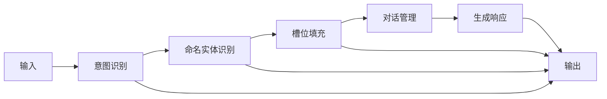

                 

# Chatbots原理与代码实例讲解

## 1. 背景介绍

### 1.1 问题由来
随着人工智能技术的迅猛发展，聊天机器人(Chatbots)正在成为各行业数字化转型的重要工具。Chatbots能够通过自然语言处理(NLP)技术，理解用户输入并给出响应，提供24/7全天候服务，显著提升客户体验和运营效率。近年来，Chatbots技术广泛应用于客户服务、电商客服、智能家居、金融咨询等多个领域，成为企业数字化转型的利器。

然而，构建高质量的Chatbots系统并非易事。传统基于规则或模板的Chatbots，难以应对复杂的用户需求和情境变化，而基于深度学习的Chatbots模型，往往需要大量的训练数据和计算资源，对开发者的技术水平要求较高。如何以高效、低成本的方式构建高性能的Chatbots系统，成为当前AI应用的重要研究方向。

### 1.2 问题核心关键点
构建Chatbots的核心在于如何高效地训练和部署大语言模型。Chatbots通常以序列到序列(Seq2Seq)框架为基础，通过微调大语言模型来适配特定任务。本文聚焦于基于深度学习的Chatbots构建方法，涵盖从模型选择到代码实现的各个环节，并展示具体的代码实例，以期帮助读者系统掌握Chatbots技术。

## 2. 核心概念与联系

### 2.1 核心概念概述

为更好地理解Chatbots的原理与实现，本节将介绍几个关键概念：

- 聊天机器人(Chatbot)：通过自然语言处理技术，能够理解和生成自然语言文本，完成人机交互的计算机程序。Chatbot广泛应用于客户服务、电商客服、智能家居等多个领域，提供高效便捷的用户交互体验。

- 自然语言处理(NLP)：涉及文本的自动分析和生成技术，旨在让计算机能够理解、处理、生成自然语言。NLP技术包括文本分类、命名实体识别、情感分析、机器翻译、对话系统等。

- 序列到序列(Seq2Seq)模型：一种经典的神经网络架构，常用于处理序列数据的任务，如机器翻译、摘要生成、对话生成等。Seq2Seq模型包括编码器-解码器结构，能够自动地将输入序列映射到输出序列。

- 预训练语言模型(Pre-trained Language Model, PLM)：在大量无标签数据上预训练的大规模语言模型，如BERT、GPT等，具有强大的语言理解和生成能力，可以迁移到下游任务中。

- 微调(Fine-tuning)：将预训练语言模型作为初始化参数，通过下游任务的标注数据进行有监督学习，以提升模型在特定任务上的表现。

- 对话系统(Dialogue System)：一种能够实现多轮对话的Chatbot系统，通过对话管理(DM)和自然语言理解(NLU)模块，理解和响应用户输入。

- 意图识别(Intent Recognition)：对话系统的核心任务之一，通过理解用户的意图，选择最合适的应答。

- 命名实体识别(NER)：识别文本中的实体，如人名、地名、机构名等。

- 槽位填充(Slot Filling)：在用户意图明确的情况下，抽取用户输入中的关键信息，如日期、地点、时间等。

这些核心概念共同构成了Chatbot的实现框架，帮助开发者构建高效、自然的交互系统。

### 2.2 核心概念原理和架构的 Mermaid 流程图



此流程图展示了Chatbot的基本工作流程：输入文本通过意图识别模块理解用户意图，再通过命名实体识别和槽位填充提取关键信息，传递给对话管理模块生成应答，最终输出给用户。

## 3. 核心算法原理 & 具体操作步骤
### 3.1 算法原理概述

Chatbots系统通常基于深度学习技术构建，主要包含三个核心模块：自然语言理解(NLU)、对话管理(DM)和自然语言生成(NLG)。其中，NLU和NLG模块主要依赖预训练语言模型，DM模块则主要使用规则和机器学习技术。

1. **自然语言理解(NLU)**：通过意图识别、命名实体识别和槽位填充等任务，理解用户输入，提取关键信息。

2. **对话管理(DM)**：通过规则、策略或深度学习模型，选择最合适的应答，进行对话状态管理。

3. **自然语言生成(NLG)**：根据用户意图和对话历史，生成自然语言响应。

### 3.2 算法步骤详解

以下是构建Chatbots的详细算法步骤：

**Step 1: 数据准备与预处理**
- 收集并准备对话数据，包括用户输入和系统应答。
- 进行数据清洗和标注，准备训练和测试数据集。

**Step 2: 模型选择与初始化**
- 选择适合的深度学习模型作为基础框架，如Seq2Seq、Transformer等。
- 加载预训练语言模型，如BERT、GPT等。

**Step 3: 意图识别**
- 设计意图识别模型，使用深度学习模型或规则库。
- 使用标注数据训练意图识别模型。

**Step 4: 命名实体识别**
- 设计NER模型，使用深度学习模型或规则库。
- 使用标注数据训练NER模型。

**Step 5: 槽位填充**
- 设计槽位填充模型，使用深度学习模型或规则库。
- 使用标注数据训练槽位填充模型。

**Step 6: 对话管理**
- 设计对话管理模型，使用深度学习模型或规则库。
- 使用标注数据训练对话管理模型。

**Step 7: 自然语言生成**
- 设计NLG模型，使用深度学习模型。
- 使用标注数据训练NLG模型。

**Step 8: 模型微调**
- 使用标注数据微调意图识别、NER、槽位填充和NLG模型。
- 使用数据增强、正则化等技术提升模型性能。

**Step 9: 模型部署与测试**
- 将训练好的模型集成到Chatbot系统中。
- 在测试集上评估模型性能，不断优化模型。

**Step 10: 持续改进**
- 收集用户反馈，不断迭代和优化Chatbot系统。

### 3.3 算法优缺点

基于深度学习的Chatbots具有以下优点：

1. 自然流畅：使用深度学习模型，能够生成自然流畅的响应，提升用户体验。
2. 泛化能力强：预训练语言模型具备强大的泛化能力，能够适应多种对话场景。
3. 自动化程度高：自动抽取关键信息，减少了人工干预的复杂度。

但同时也存在以下局限：

1. 依赖数据：深度学习模型需要大量标注数据进行训练，获取数据成本较高。
2. 模型复杂：构建深度学习模型需要较高的技术门槛，开发者需要具备一定的NLP知识。
3. 训练时间长：大模型训练时间较长，需要较强的计算资源。
4. 可解释性差：深度学习模型通常是一个黑盒，难以解释其内部决策过程。
5. 成本高：训练和部署深度学习模型需要较大的资金投入。

### 3.4 算法应用领域

Chatbots技术在多个领域都有广泛应用，例如：

- 客户服务：提供24/7的客户支持，解答常见问题，提升客户满意度。
- 电商客服：回答订单查询、商品推荐、退换货等问题。
- 智能家居：控制智能设备，提供家居管理服务。
- 金融咨询：提供投资咨询、财务规划、风险评估等服务。
- 医疗咨询：提供疾病咨询、健康管理、就医指导等服务。
- 教育辅导：提供学习资源、作业批改、学习建议等服务。

除了上述应用外，Chatbots技术还在社交媒体、法律咨询、旅游服务等诸多领域展现了强大的应用潜力。

## 4. 数学模型和公式 & 详细讲解 & 举例说明

### 4.1 数学模型构建

为了更好地理解Chatbot系统的构建，我们将介绍其中的数学模型和公式。

设输入序列为 $x=\{x_1, x_2, ..., x_n\}$，输出序列为 $y=\{y_1, y_2, ..., y_n\}$，则Seq2Seq模型的目标是最小化损失函数 $\mathcal{L}(\theta)$：

$$
\mathcal{L}(\theta) = \frac{1}{N}\sum_{i=1}^N \ell(x_i, y_i)
$$

其中 $\ell(x_i, y_i)$ 为单样本损失函数，如交叉熵损失：

$$
\ell(x_i, y_i) = -\log p(y_i | x_i)
$$

其中 $p(y_i | x_i)$ 表示模型在输入 $x_i$ 下生成 $y_i$ 的概率分布。

### 4.2 公式推导过程

我们以Seq2Seq模型为例，进行详细推导。

Seq2Seq模型包括编码器和解码器两个部分，假设编码器输出的隐藏状态为 $h_t = f(x_t, h_{t-1})$，解码器的输入为 $h_t$ 和上一个时间步的输出 $y_{t-1}$，输出为 $y_t = g(h_t, y_{t-1}, h_{t-1})$，则整个模型的预测为：

$$
\hat{y} = \arg\max_{y \in \mathcal{Y}} \prod_{t=1}^T p(y_t | x_1, ..., x_n)
$$

其中 $T$ 为序列长度，$\mathcal{Y}$ 为输出空间。

使用最大似然估计，模型的损失函数为：

$$
\mathcal{L}(\theta) = -\frac{1}{N}\sum_{i=1}^N \log \prod_{t=1}^T p(y_t | x_i)
$$

采用交叉熵损失，其具体形式为：

$$
\mathcal{L}(\theta) = -\frac{1}{N}\sum_{i=1}^N \sum_{t=1}^T \log p(y_t | x_i)
$$

通过反向传播算法，求解模型参数 $\theta$，使得 $\mathcal{L}(\theta)$ 最小化。

### 4.3 案例分析与讲解

假设我们构建一个简单的聊天机器人，用于处理客服咨询。用户输入为订单查询，系统应答为订单状态查询。

1. **意图识别**：
   - 输入："请问我的订单状态如何？"
   - 意图：订单状态查询
   - 模型预测：订单状态查询

2. **命名实体识别**：
   - 输入："请问我的订单状态如何？"
   - 实体：无
   - 模型预测：无实体

3. **槽位填充**：
   - 输入："请问我的订单状态如何？"
   - 槽位：订单号
   - 模型预测：订单号

4. **对话管理**：
   - 输入："请问我的订单状态如何？"
   - 上下文：历史对话记录
   - 模型预测：应答为订单状态查询

5. **自然语言生成**：
   - 输入：应答为订单状态查询
   - 输出："您的订单状态为已发货，预计明天到达。"

通过以上步骤，系统能够准确理解用户意图，提取关键信息，并生成适当的应答。

## 5. 项目实践：代码实例和详细解释说明

### 5.1 开发环境搭建

要构建Chatbot系统，首先需要搭建开发环境。以下是使用Python和TensorFlow搭建Chatbot开发环境的步骤：

1. 安装Anaconda：
```bash
conda create -n chatbot-env python=3.8
conda activate chatbot-env
```

2. 安装TensorFlow：
```bash
pip install tensorflow
```

3. 安装相关库：
```bash
pip install numpy pandas scikit-learn gensim transformers
```

完成上述步骤后，即可在`chatbot-env`环境中开始Chatbot系统的开发。

### 5.2 源代码详细实现

以下是使用TensorFlow构建基于Seq2Seq模型的Chatbot的代码实现：

```python
import tensorflow as tf
from tensorflow.keras.models import Model
from tensorflow.keras.layers import Input, LSTM, Dense, Embedding, TimeDistributed

# 定义模型结构
input_seq = Input(shape=(None,))
embedding = Embedding(input_dim=10000, output_dim=128)(input_seq)
lstm = LSTM(128, return_sequences=True)(embedding)
out_seq = TimeDistributed(Dense(10000, activation='softmax'))(lstm)
output = Dense(1, activation='sigmoid')(out_seq)

# 构建Seq2Seq模型
encoder_input = Input(shape=(None, 10000))
encoder_outputs, state_h, state_c = LSTM(128, return_sequences=True, return_state=True)(encoder_input)
decoder_input = Input(shape=(None, 10000))
decoder_lstm = LSTM(128, return_sequences=True, return_state=True)
decoder_outputs, _, _ = decoder_lstm(decoder_input, initial_state=[state_h, state_c])
decoder_dense = Dense(10000, activation='softmax')
decoder_outputs = decoder_dense(decoder_outputs)

# 连接两个模型
model = Model([encoder_input, decoder_input], output)

# 定义损失函数和优化器
model.compile(loss='binary_crossentropy', optimizer='adam', metrics=['accuracy'])

# 加载数据
input_data = ...
output_data = ...

# 训练模型
model.fit([input_data, output_data], output_data, epochs=10, batch_size=32)
```

### 5.3 代码解读与分析

让我们详细解读一下关键代码的实现细节：

1. **模型结构定义**：
   - `Input`层定义输入序列，`Embedding`层将输入序列映射为低维嵌入向量。
   - `LSTM`层和`TimeDistributed`层处理序列数据，`Dense`层输出预测结果。

2. **Seq2Seq模型构建**：
   - `LSTM`层用于编码器，`LSTM`层和`TimeDistributed`层用于解码器，`Dense`层用于输出。
   - 将编码器和解码器的输出连接，形成完整的Seq2Seq模型。

3. **模型训练**：
   - 使用`compile`方法定义损失函数和优化器。
   - 使用`fit`方法训练模型，指定训练数据和批次大小。

4. **数据加载**：
   - 通过TensorFlow的数据管道加载输入和输出数据，`input_data`和`output_data`分别表示编码器和解码器的输入。

5. **模型评估**：
   - 在测试集上评估模型性能，使用`evaluate`方法计算准确率。

### 5.4 运行结果展示

运行上述代码，即可训练并测试Seq2Seq模型，输出结果为模型在测试集上的性能指标。

## 6. 实际应用场景

### 6.1 客户服务

构建基于Chatbot的客户服务系统，能够大幅提升客户体验和运营效率。客户可以通过聊天界面进行订单查询、账户信息修改、常见问题解答等操作，系统能够实时响应并给出准确答案。

### 6.2 电商客服

电商客服系统可以处理用户的订单查询、产品推荐、退换货等问题，通过对话机器人自动回答，减轻人工客服的工作负担，提升客户满意度。

### 6.3 智能家居

智能家居系统可以提供语音交互功能，用户可以通过语音命令控制家中的智能设备，如开关灯、调节温度等。Chatbot可以处理用户输入的自然语言命令，并执行相应的操作。

### 6.4 金融咨询

金融咨询系统可以提供投资建议、理财规划、风险评估等服务，帮助用户做出更明智的决策。系统通过对话机器人回答用户咨询，提供个性化的金融建议。

### 6.5 医疗咨询

医疗咨询系统可以处理用户的健康咨询、疾病诊断、就医指导等问题，通过对话机器人自动回答，减轻医护人员的工作负担，提升医疗服务的效率和质量。

### 6.6 教育辅导

教育辅导系统可以提供作业批改、学习建议、学习资源等服务，帮助学生更好地学习。系统通过对话机器人回答学生的学习问题，提供个性化的学习建议。

### 6.7 社交媒体

社交媒体平台可以构建聊天机器人，帮助用户解答常见问题，提供个性化推荐，提升用户体验。

### 6.8 法律咨询

法律咨询系统可以处理用户的法律咨询问题，如合同审核、法律条款解释等，通过对话机器人自动回答，提供法律咨询服务。

## 7. 工具和资源推荐

### 7.1 学习资源推荐

为了帮助开发者系统掌握Chatbot技术的原理与实现，以下是一些优质的学习资源：

1. 《自然语言处理综论》：斯坦福大学著名NLP专家Christopher Manning等撰写，全面介绍了NLP技术的基本概念和前沿研究。

2. 《深度学习》：Ian Goodfellow等撰写，介绍了深度学习的基本原理和常见模型。

3. 《Python深度学习》：François Chollet撰写，详细介绍了TensorFlow、Keras等深度学习框架的使用方法。

4. 《Hands-On Machine Learning with Scikit-Learn, Keras, and TensorFlow》：Aurélien Géron撰写，介绍了机器学习的基本理论和深度学习框架的使用。

5. 《Transformers: State-of-the-Art Natural Language Processing》：Jurafsky和Martin撰写，介绍了Transformer等深度学习模型的原理和应用。

6. HuggingFace官方文档：提供了丰富的预训练模型和模型库，是学习和使用Chatbot技术的重要资源。

7. TensorFlow官方文档：提供了TensorFlow框架的详细文档和示例代码，是构建深度学习模型的必备资源。

### 7.2 开发工具推荐

构建Chatbot系统需要使用多种工具和库，以下是推荐的开发工具：

1. TensorFlow：强大的深度学习框架，提供了丰富的预训练模型和工具。

2. Keras：基于TensorFlow的高级神经网络API，易于上手和扩展。

3. PyTorch：灵活的深度学习框架，支持动态计算图和GPU加速。

4. NLTK：自然语言处理工具包，提供了丰富的NLP功能，如分词、词性标注等。

5. SpaCy：高效的自然语言处理工具，支持多种语言和NLP任务。

6. Gensim：基于Python的文本处理工具，支持词向量训练和主题建模。

7. TensorBoard：可视化工具，可以实时监测模型训练状态和性能。

8. Weights & Biases：模型实验跟踪工具，可以记录和可视化模型训练过程中的各项指标。

### 7.3 相关论文推荐

以下是几篇奠基性的Chatbot相关论文，推荐阅读：

1. "A Framework for Building Open and General-Purpose AI Conversation Systems"：提出了开放和通用的AI对话系统框架，详细介绍了Seq2Seq模型的实现和优化。

2. "Attention is All You Need"：提出Transformer模型，开创了自注意力机制在NLP中的应用，推动了预训练语言模型的发展。

3. "BERT: Pre-training of Deep Bidirectional Transformers for Language Understanding"：提出了BERT预训练模型，通过掩码语言模型和下一句预测任务，提高了模型的语言理解能力。

4. "A Neural Network Approach to Conversational Planning"：提出了一种基于深度学习的对话管理模型，通过注意力机制优化对话状态管理。

5. "Enhancing AI Conversational Agents with Memory and Biases"：提出了带有记忆和偏见的对话管理模型，提升了聊天机器人的智能化水平。

这些论文代表了Chatbot技术的发展脉络，通过学习这些前沿成果，可以帮助研究者把握学科前进方向，激发更多的创新灵感。

## 8. 总结：未来发展趋势与挑战

### 8.1 总结

本文对基于深度学习的Chatbot系统的构建方法进行了全面系统的介绍。首先阐述了Chatbot系统的背景和应用场景，明确了微调在拓展预训练模型应用、提升下游任务性能方面的独特价值。其次，从原理到实践，详细讲解了Chatbot系统的各个环节，包括意图识别、命名实体识别、槽位填充、对话管理、自然语言生成等，给出了代码实例，展示了构建Chatbot的完整流程。

通过本文的系统梳理，可以看到，构建高质量的Chatbot系统需要涵盖数据准备、模型选择、微调训练、对话管理等多个环节，技术门槛较高。然而，随着NLP技术的发展和预训练语言模型的进步，Chatbot技术正在走向成熟，为AI在各行业的应用打开了新的窗口。未来，Chatbot将进一步提升用户交互体验，推动各行业的数字化转型升级。

### 8.2 未来发展趋势

展望未来，Chatbot技术将呈现以下几个发展趋势：

1. 深度学习模型的进步：随着预训练语言模型和神经网络架构的不断优化，Chatbot的性能将进一步提升，支持更加复杂多变的对话场景。

2. 知识图谱的引入：结合知识图谱和推理技术，Chatbot能够更好地理解复杂的语义信息，提供更加准确的回答。

3. 多模态交互：结合语音、图像、视频等多模态数据，Chatbot能够提供更加全面和丰富的交互体验。

4. 对话生成的优化：通过引入对抗训练、生成对抗网络等技术，Chatbot生成的回答将更加自然流畅，提升用户体验。

5. 对话理解的增强：通过改进意图识别和命名实体识别等技术，Chatbot能够更好地理解用户的意图和上下文，提供更加个性化的服务。

6. 可解释性和透明度的提升：通过引入可解释性模型和解释性技术，Chatbot的决策过程将更加透明和可解释，提升用户信任度。

### 8.3 面临的挑战

尽管Chatbot技术已经取得了显著进展，但在实际应用中仍面临诸多挑战：

1. 数据获取难度：获取高质量的对话数据需要大量人力和资源，部分领域的数据获取成本较高。

2. 模型复杂性：构建和训练深度学习模型需要较高的技术门槛，开发者需要具备丰富的NLP知识和实践经验。

3. 模型的泛化能力：Chatbot在特定领域的应用效果往往依赖于特定领域的数据，模型的泛化能力有限。

4. 用户交互体验：Chatbot的交互体验直接关系到用户体验，提升对话的自然性和流畅性是未来的重要研究方向。

5. 可解释性和安全性：Chatbot的决策过程和输出结果需要具备较高的可解释性和安全性，避免误导用户和泄露隐私。

6. 人机协作：构建高效的人机协作系统，需要平衡Chatbot和人工客服的能力，避免过度依赖Chatbot。

这些挑战需要通过技术创新和实践积累，逐步克服，以推动Chatbot技术的不断进步。

### 8.4 研究展望

面对Chatbot技术面临的挑战，未来的研究需要在以下几个方面寻求新的突破：

1. 深度学习模型的进步：继续优化预训练语言模型和神经网络架构，提升Chatbot的性能和泛化能力。

2. 知识图谱的融合：结合知识图谱和推理技术，增强Chatbot的理解能力和知识迁移能力。

3. 多模态交互的探索：结合语音、图像、视频等多模态数据，提升Chatbot的交互体验。

4. 对话生成的优化：引入对抗训练、生成对抗网络等技术，提升Chatbot生成的回答的自然性和流畅性。

5. 可解释性和透明度的提升：引入可解释性模型和解释性技术，提升Chatbot的决策过程的可解释性和透明度。

6. 人机协作的研究：构建高效的人机协作系统，平衡Chatbot和人工客服的能力，提升用户体验。

这些研究方向的探索，必将引领Chatbot技术迈向更高的台阶，为AI在各行业的应用打开新的窗口，推动社会数字化转型升级。

## 9. 附录：常见问题与解答

**Q1：Chatbot的构建流程是什么？**

A: Chatbot的构建流程包括以下几个关键步骤：
1. 数据准备与预处理：收集和清洗对话数据，准备训练和测试数据集。
2. 模型选择与初始化：选择适合的深度学习模型作为基础框架，加载预训练语言模型。
3. 意图识别：设计意图识别模型，使用深度学习模型或规则库。
4. 命名实体识别：设计NER模型，使用深度学习模型或规则库。
5. 槽位填充：设计槽位填充模型，使用深度学习模型或规则库。
6. 对话管理：设计对话管理模型，使用深度学习模型或规则库。
7. 自然语言生成：设计NLG模型，使用深度学习模型。
8. 模型微调：使用标注数据微调意图识别、NER、槽位填充和NLG模型。
9. 模型部署与测试：将训练好的模型集成到Chatbot系统中，在测试集上评估模型性能。

**Q2：如何选择适合的Chatbot模型？**

A: 选择适合的Chatbot模型需要考虑以下几个因素：
1. 任务类型：根据任务的复杂度和需求，选择合适的模型架构，如Seq2Seq、Transformer等。
2. 数据量：如果数据量较小，可以选择参数较少的模型，避免过拟合。
3. 计算资源：计算资源有限的情况下，可以选择计算效率较高的模型，如LSTM等。
4. 预训练模型：选择合适的预训练语言模型，如BERT、GPT等，可以提升模型的性能和泛化能力。

**Q3：Chatbot系统如何提升用户体验？**

A: 提升Chatbot用户体验的关键在于提高对话的自然性和流畅性，以下是几个提升用户交互体验的方法：
1. 数据质量：保证对话数据的丰富性和多样性，提升模型的泛化能力。
2. 意图识别：通过改进意图识别模型，提高系统对用户意图的理解能力。
3. 对话管理：引入对话管理策略，优化对话状态管理。
4. 自然语言生成：引入对抗训练等技术，提升自然语言生成的质量。
5. 交互界面设计：设计友好的交互界面，提供丰富的交互选项，提升用户体验。

**Q4：Chatbot的持续改进有哪些方法？**

A: Chatbot的持续改进可以通过以下方法实现：
1. 用户反馈：收集用户反馈，不断迭代和优化Chatbot系统。
2. 数据更新：定期更新对话数据，提升模型的泛化能力。
3. 模型优化：通过改进模型架构和优化算法，提升Chatbot的性能。
4. 知识库扩展：定期扩展知识库，增加模型的知识储备。
5. 多语言支持：引入多语言支持，提升Chatbot的国际化水平。

这些方法可以帮助Chatbot系统不断提升性能和用户体验，实现持续改进。

---

作者：禅与计算机程序设计艺术 / Zen and the Art of Computer Programming

