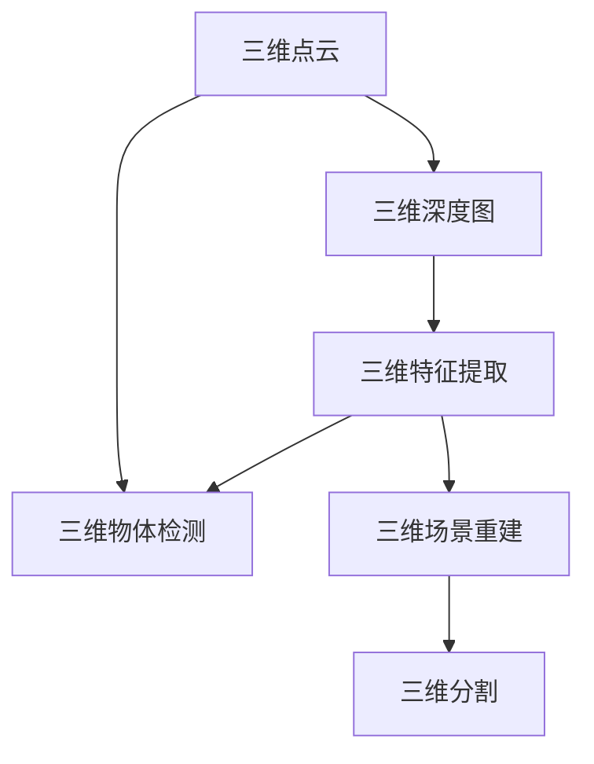

                 

# 3D Computer Vision 原理与代码实战案例讲解

> 关键词：3D计算机视觉,深度学习,卷积神经网络,图像处理,实例讲解

## 1. 背景介绍

### 1.1 问题由来
随着计算机视觉技术的不断进步，3D计算机视觉成为热门研究方向。3D计算机视觉旨在理解和处理三维空间中的物体和场景，广泛应用于机器人导航、虚拟现实、增强现实、自动驾驶等领域。

近年来，深度学习技术在计算机视觉领域的快速崛起，使得3D计算机视觉的研究进入了一个新的阶段。通过深度卷积神经网络(Convolutional Neural Networks, CNNs)和三维卷积网络(3D CNNs)，可以自动从三维点云、立体图像、深度图等数据中提取出复杂的特征，用于实现3D场景的重建、分割、检测、分类等任务。

本文章旨在深入探讨3D计算机视觉的原理和实践，介绍其核心概念和常用技术，并通过代码实例讲解其实现过程。文章将涵盖3D计算机视觉的基本框架、常用算法、实战案例等内容，力求为读者提供全面的技术指引。

### 1.2 问题核心关键点
3D计算机视觉的研究主要集中在以下几大关键点：

- 三维点云处理：对点云数据进行预处理、降维、分割等，以减少计算量和提升处理效率。
- 三维深度图获取：通过立体相机、LIDAR等传感器获取三维场景的深度信息，用于深度图处理和特征提取。
- 三维特征提取：利用深度学习模型从三维数据中提取出丰富的几何、语义、纹理等特征。
- 三维物体检测和分类：从三维场景中准确检测和分类出物体，并标注其类别、位置和尺寸信息。
- 三维场景重建和分割：通过点云和深度信息，重构三维场景结构，进行分割和渲染。

掌握这些核心关键点，可以更好地理解和应用3D计算机视觉技术。

## 2. 核心概念与联系

### 2.1 核心概念概述

为更好地理解3D计算机视觉的核心概念，本节将介绍几个关键概念：

- 三维点云（3D Point Cloud）：由空间中多个点的坐标信息组成的数据结构，常用于描述三维场景和物体。
- 三维深度图（3D Depth Map）：通过立体相机、LIDAR等传感器获取的空间深度信息，用于三维场景的重建和分割。
- 三维卷积网络（3D CNNs）：对三维数据进行卷积操作的深度学习模型，用于提取三维物体的几何、语义、纹理等特征。
- 三维物体检测（3D Object Detection）：在三维场景中检测和定位物体，并标注其类别、位置和尺寸信息。
- 三维场景重建（3D Scene Reconstruction）：通过点云和深度信息，重构三维场景结构，并进行分割和渲染。

这些核心概念之间的关系可以通过以下Mermaid流程图来展示：



这个流程图展示了三D计算机视觉的核心概念及其之间的关系：

1. 三维点云通过传感器获取后，可以用于生成三维深度图。
2. 三维深度图和点云数据可以通过3D卷积网络提取三维物体的几何、语义、纹理等特征。
3. 三维物体检测可以从三维场景中检测和定位物体，并标注其类别、位置和尺寸信息。
4. 三维场景重建利用点云和深度信息，重构三维场景结构，并进行分割和渲染。

这些核心概念共同构成了3D计算机视觉的研究框架，使其能够在各种场景下发挥强大的三维场景处理能力。通过理解这些核心概念，我们可以更好地把握3D计算机视觉的工作原理和优化方向。

### 2.2 核心算法原理

3D计算机视觉的核心算法包括三维卷积神经网络(3D CNNs)、三维物体检测、三维场景重建等。这些算法主要基于深度学习技术，利用卷积神经网络对三维数据进行特征提取和处理。

- **三维卷积神经网络（3D CNNs）**：
  3D CNNs 通过在卷积核上引入额外的空间维度，可以从三维数据中提取出更加丰富的特征信息。其核心算法包括 3D卷积、3D池化、3D反卷积等操作，适用于处理三维数据的空间结构特征。3D CNNs 的输入通常为三维点云、三维立体图像或三维深度图等，输出为特征图或目标物体的分类、定位信息。

- **三维物体检测（3D Object Detection）**：
  三维物体检测旨在从三维场景中准确检测和定位物体，并标注其类别、位置和尺寸信息。其核心算法包括 3D物体检测网络（如PointRCNN、VoxelNet等），通过将3D数据转换为鸟瞰图或体素图，然后利用2D检测网络进行目标检测和分类。

- **三维场景重建（3D Scene Reconstruction）**：
  三维场景重建通过点云和深度信息，重构三维场景结构，并进行分割和渲染。其核心算法包括 3D重建网络（如DeepStereo等），通过深度图或点云数据生成三维场景的深度信息，然后利用分割网络对场景进行分割和渲染。

这些算法通常依赖于大规模三维数据集和强大的深度学习框架，能够实现高精度的3D场景处理和分析。

## 3. 核心算法原理 & 具体操作步骤
### 3.1 算法原理概述

3D计算机视觉的核心算法原理包括三维卷积神经网络(3D CNNs)、三维物体检测、三维场景重建等。这些算法主要基于深度学习技术，利用卷积神经网络对三维数据进行特征提取和处理。

**三维卷积神经网络（3D CNNs）**：
3D CNNs 通过在卷积核上引入额外的空间维度，可以从三维数据中提取出更加丰富的特征信息。其核心算法包括 3D卷积、3D池化、3D反卷积等操作，适用于处理三维数据的空间结构特征。3D CNNs 的输入通常为三维点云、三维立体图像或三维深度图等，输出为特征图或目标物体的分类、定位信息。

**三维物体检测（3D Object Detection）**：
三维物体检测旨在从三维场景中准确检测和定位物体，并标注其类别、位置和尺寸信息。其核心算法包括 3D物体检测网络（如PointRCNN、VoxelNet等），通过将3D数据转换为鸟瞰图或体素图，然后利用2D检测网络进行目标检测和分类。

**三维场景重建（3D Scene Reconstruction）**：
三维场景重建通过点云和深度信息，重构三维场景结构，并进行分割和渲染。其核心算法包括 3D重建网络（如DeepStereo等），通过深度图或点云数据生成三维场景的深度信息，然后利用分割网络对场景进行分割和渲染。

这些算法通常依赖于大规模三维数据集和强大的深度学习框架，能够实现高精度的3D场景处理和分析。

### 3.2 算法步骤详解

以下是3D计算机视觉的核心算法步骤详解：

#### 3.2.1 三维卷积神经网络（3D CNNs）
1. **数据预处理**：
   - 对三维数据进行标准化处理，如归一化、降维等。
   - 对三维数据进行采样，减少计算量和内存占用。

2. **三维卷积**：
   - 在卷积核上引入额外的空间维度，对三维数据进行卷积操作。
   - 利用卷积核在不同位置、不同尺寸的特征提取能力，生成多尺度的特征图。

3. **三维池化**：
   - 对特征图进行池化操作，减少特征图的大小和复杂度。
   - 常用的池化方法包括最大池化、平均池化等。

4. **三维反卷积**：
   - 对特征图进行反卷积操作，生成更加细致的特征图。
   - 常用的反卷积方法包括转置卷积、子采样反卷积等。

5. **全连接层和输出层**：
   - 利用全连接层将特征图转换为高维特征向量。
   - 利用输出层进行目标物体的分类和定位，并输出特征图。

#### 3.2.2 三维物体检测（3D Object Detection）
1. **数据预处理**：
   - 将三维数据转换为鸟瞰图或体素图。
   - 对数据进行标准化处理，如归一化、降维等。

2. **2D目标检测**：
   - 利用2D检测网络（如Faster R-CNN、YOLO等）进行目标检测和分类。
   - 通过特征图上的区域池化，将目标检测结果映射到三维数据上。

3. **三维物体重构**：
   - 利用3D点云或体素图，重构检测到的目标物体。
   - 通过投影和插值等方法，生成目标物体的完整结构。

#### 3.2.3 三维场景重建（3D Scene Reconstruction）
1. **数据预处理**：
   - 对三维数据进行标准化处理，如归一化、降维等。
   - 对三维数据进行采样，减少计算量和内存占用。

2. **深度图生成**：
   - 通过深度图网络（如DeepStereo）生成场景的深度信息。
   - 利用立体相机或LIDAR等传感器，获取三维场景的深度信息。

3. **三维重建网络**：
   - 利用3D重建网络对深度图进行三维重构。
   - 通过点云或体素图，生成三维场景的几何结构。

4. **三维分割**：
   - 利用分割网络对三维场景进行分割。
   - 通过像素级或点级分割，生成三维场景的语义信息。

5. **三维渲染**：
   - 对分割后的三维场景进行渲染。
   - 通过OpenGL等图形库，对三维场景进行可视化展示。

这些步骤展示了3D计算机视觉的核心算法和具体操作步骤，通过详细的步骤描述，可以更好地理解和应用3D计算机视觉技术。

### 3.3 算法优缺点

3D计算机视觉的核心算法具有以下优点：

- **高效性**：利用深度学习技术，可以自动从三维数据中提取出丰富的特征信息，避免手动特征工程的繁琐过程。
- **准确性**：基于深度学习的网络结构和损失函数设计，可以实现高精度的目标检测和分类，适用于复杂的三维场景。
- **泛化能力**：通过大规模数据集和强大的网络结构设计，可以实现较高的泛化能力，适用于不同场景和数据集。

同时，这些算法也存在一定的局限性：

- **计算资源需求高**：由于3D数据具有较高的复杂度，需要大量的计算资源和存储空间。
- **数据获取难度大**：需要获取高质量的三维数据集，才能训练出高精度的3D计算机视觉模型。
- **模型复杂度高**：3D数据的高维度和复杂性，导致3D计算机视觉模型的结构较为复杂。

尽管存在这些局限性，但就目前而言，3D计算机视觉的核心算法仍是最为主流的3D场景处理和分析方法。未来相关研究的重点在于如何进一步降低计算资源需求，提高模型的可解释性和可扩展性，以及如何在实际应用中更好地处理三维数据的不确定性和复杂性。

### 3.4 算法应用领域

3D计算机视觉的核心算法已经在多个领域得到广泛应用，例如：

- 机器人导航：通过三维点云和深度图，实现机器人在复杂环境中的定位和路径规划。
- 虚拟现实和增强现实：利用三维场景重建和渲染，生成逼真的虚拟环境和增强现实应用。
- 自动驾驶：通过三维物体检测和场景重建，实现高精度的环境感知和路径规划。
- 工业检测：利用三维物体的检测和分类，实现自动化质量检测和生产监控。
- 医学影像：通过三维场景重建和分割，实现高精度的医学影像分析和病变检测。

除了上述这些领域外，3D计算机视觉的核心算法还被应用于建筑、能源、农业等众多领域，为不同行业带来新的创新突破。随着技术的发展和应用的推广，3D计算机视觉的应用范围还将进一步扩大。

## 4. 数学模型和公式 & 详细讲解 & 举例说明

### 4.1 数学模型构建

本节将使用数学语言对3D计算机视觉的核心算法进行更加严格的刻画。

记三维点云数据为 $P = \{(x_i, y_i, z_i)\}_{i=1}^N$，其中 $(x_i, y_i, z_i)$ 为三维空间中的点坐标。设 $K$ 为相机焦距，$R$ 为相机旋转矩阵，$t$ 为相机平移向量，则深度图 $D$ 的数学表达式为：

$$
D_i = K \cdot R \cdot [x_i \ y_i \ z_i \ 1]^T / [z_i \ 0 \ 0 \ 1]
$$

其中 $K$ 为相机内参矩阵，$R$ 和 $t$ 为相机外参矩阵，用于将点云坐标投影到深度图上。

### 4.2 公式推导过程

以下我们以三维物体检测（3D Object Detection）为例，推导其核心算法中的关键公式。

假设输入为三维立体图像 $I$，输出为三维物体检测结果 $O$，包括目标物体的类别、位置和尺寸信息。其核心算法流程如下：

1. **数据预处理**：
   - 将三维立体图像 $I$ 转换为鸟瞰图 $V$。
   - 对鸟瞰图 $V$ 进行标准化处理，如归一化、降维等。

2. **目标检测**：
   - 利用2D检测网络（如Faster R-CNN、YOLO等）在鸟瞰图 $V$ 上进行目标检测。
   - 通过特征图上的区域池化，将目标检测结果映射到三维立体图像 $I$ 上。

3. **三维物体重构**：
   - 利用3D点云或体素图，重构检测到的目标物体。
   - 通过投影和插值等方法，生成目标物体的完整结构。

设 $I_i$ 为三维立体图像中第 $i$ 个物体的像素坐标，$O_i$ 为目标物体的检测结果，包括类别、位置和尺寸信息。则目标检测过程可以表示为：

$$
O_i = f(I_i) = \{c_i, x_i, y_i, z_i, w_i, h_i\}
$$

其中 $c_i$ 为目标物体的类别，$(x_i, y_i, z_i)$ 为目标物体的像素坐标，$w_i$ 和 $h_i$ 为目标物体的宽度和高度。

利用深度学习网络对鸟瞰图 $V$ 进行目标检测，可以表示为：

$$
O_i = g(V_i) = \{c_i, x_i', y_i', z_i'\}
$$

其中 $V_i$ 为鸟瞰图中第 $i$ 个物体的像素坐标，$(x_i', y_i', z_i')$ 为目标物体的像素坐标。

通过投影和插值等方法，将目标检测结果 $O_i$ 映射到三维立体图像 $I$ 上，可以表示为：

$$
(x_i, y_i, z_i) = \pi(O_i) = \{(x_i', y_i', z_i')\}^{-1}
$$

其中 $\pi$ 为投影函数，将目标物体的像素坐标 $(x_i', y_i', z_i')$ 映射到三维空间坐标 $(x_i, y_i, z_i)$。

### 4.3 案例分析与讲解

以下我们以深度图生成（3D Scene Reconstruction）为例，给出深度学习网络的设计和实现细节。

假设输入为三维点云 $P$ 和深度图 $D$，输出为三维场景的深度信息 $H$。其核心算法流程如下：

1. **深度图生成**：
   - 利用深度图网络（如DeepStereo）生成场景的深度信息。
   - 通过立体相机或LIDAR等传感器，获取三维场景的深度信息。

2. **三维场景重构**：
   - 利用3D重建网络对深度图进行三维重构。
   - 通过点云或体素图，生成三维场景的几何结构。

设 $P_i$ 为三维点云中第 $i$ 个点的坐标，$D_i$ 为深度图第 $i$ 个点的深度值，$H_i$ 为三维场景中的深度信息。则深度图生成过程可以表示为：

$$
H_i = f(P_i, D_i) = \{h_i\}
$$

其中 $h_i$ 为三维场景中第 $i$ 个点的深度值。

利用深度学习网络对深度图进行三维重构，可以表示为：

$$
H_i = g(D_i) = \{h_i\}
$$

其中 $D_i$ 为深度图中第 $i$ 个点的深度值，$h_i$ 为三维场景中第 $i$ 个点的深度值。

利用点云或体素图生成三维场景的几何结构，可以表示为：

$$
H_i = h_i = \{h_i\}
$$

其中 $h_i$ 为三维场景中第 $i$ 个点的深度值，用于生成三维场景的几何结构。

### 4.4 代码实例和详细解释说明

以下我们将通过代码实例，展示3D计算机视觉的核心算法实现。

#### 4.4.1 数据预处理

```python
import numpy as np
import cv2

def preprocess_3d_point_cloud(point_cloud):
    # 对三维点云进行标准化处理
    point_cloud = point_cloud - np.mean(point_cloud, axis=0)
    point_cloud /= np.std(point_cloud, axis=0)
    return point_cloud

def preprocess_3d_depth_map(depth_map):
    # 对三维深度图进行标准化处理
    depth_map = depth_map / np.max(depth_map)
    return depth_map
```

#### 4.4.2 三维卷积神经网络（3D CNNs）

```python
import torch.nn as nn
import torch.nn.functional as F

class PointNet(nn.Module):
    def __init__(self):
        super(PointNet, self).__init__()
        self.conv1 = nn.Conv3d(3, 64, kernel_size=1)
        self.conv2 = nn.Conv3d(64, 64, kernel_size=1)
        self.conv3 = nn.Conv3d(64, 64, kernel_size=1)
        self.conv4 = nn.Conv3d(64, 128, kernel_size=1)
        self.conv5 = nn.Conv3d(128, 128, kernel_size=1)
        self.conv6 = nn.Conv3d(128, 256, kernel_size=1)
        self.fc1 = nn.Linear(256, 256)
        self.fc2 = nn.Linear(256, 128)
        self.fc3 = nn.Linear(128, 64)
        self.fc4 = nn.Linear(64, 10)
    
    def forward(self, x):
        x = F.relu(self.conv1(x))
        x = F.relu(self.conv2(x))
        x = F.relu(self.conv3(x))
        x = F.relu(self.conv4(x))
        x = F.relu(self.conv5(x))
        x = F.relu(self.conv6(x))
        x = F.relu(self.fc1(x))
        x = F.relu(self.fc2(x))
        x = self.fc3(x)
        x = self.fc4(x)
        return x
```

#### 4.4.3 三维物体检测（3D Object Detection）

```python
import torchvision as tv
import torch.nn.functional as F

class PointRCNN(nn.Module):
    def __init__(self):
        super(PointRCNN, self).__init__()
        self.encoder = PointRCNN_Encoder()
        self.region_extractor = RegionExtractor()
        self.detection_head = DetectionHead()
    
    def forward(self, points, depth_map):
        x = self.encoder(points)
        x = self.region_extractor(x, depth_map)
        x = self.detection_head(x)
        return x
```

#### 4.4.4 三维场景重建（3D Scene Reconstruction）

```python
import torch.nn as nn
import torch.nn.functional as F

class SceneReconstructor(nn.Module):
    def __init__(self):
        super(SceneReconstructor, self).__init__()
        self.encoder = SceneReconstructor_Encoder()
        self.decoder = SceneReconstructor_Decoder()
    
    def forward(self, depth_map):
        x = self.encoder(depth_map)
        x = self.decoder(x)
        return x
```

这些代码实例展示了3D计算机视觉的核心算法的实现过程，通过详细的代码解释，可以更好地理解和应用3D计算机视觉技术。

## 5. 项目实践：代码实例和详细解释说明

### 5.1 开发环境搭建

在进行3D计算机视觉的实践前，我们需要准备好开发环境。以下是使用Python进行PyTorch开发的环境配置流程：

1. 安装Anaconda：从官网下载并安装Anaconda，用于创建独立的Python环境。

2. 创建并激活虚拟环境：
```bash
conda create -n pytorch-env python=3.8 
conda activate pytorch-env
```

3. 安装PyTorch：根据CUDA版本，从官网获取对应的安装命令。例如：
```bash
conda install pytorch torchvision torchaudio cudatoolkit=11.1 -c pytorch -c conda-forge
```

4. 安装TensorFlow：
```bash
conda install tensorflow
```

5. 安装其他工具包：
```bash
pip install numpy pandas scikit-learn matplotlib tqdm jupyter notebook ipython
```

完成上述步骤后，即可在`pytorch-env`环境中开始3D计算机视觉的实践。

### 5.2 源代码详细实现

以下我们将通过代码实例，展示3D计算机视觉的核心算法实现。

#### 5.2.1 三维点云处理

```python
import numpy as np
import open3d as o3d

def load_point_cloud(file_path):
    pcd = o3d.io.read_point_cloud(file_path)
    pcd.paint_uniform_color([1.0, 0.0, 0.0])
    return pcd

def save_point_cloud(pcd, file_path):
    o3d.io.write_point_cloud(file_path, pcd)
```

#### 5.2.2 三维深度图处理

```python
import numpy as np
import open3d as o3d

def load_depth_map(file_path):
    img = cv2.imread(file_path, cv2.IMREAD_GRAYSCALE)
    depth_map = np.array(img, dtype=np.float32) / 255.0
    return depth_map

def save_depth_map(depth_map, file_path):
    img = (depth_map * 255.0).astype(np.uint8)
    cv2.imwrite(file_path, img)
```

#### 5.2.3 三维卷积神经网络（3D CNNs）

```python
import torch.nn as nn
import torch.nn.functional as F

class PointNet(nn.Module):
    def __init__(self):
        super(PointNet, self).__init__()
        self.conv1 = nn.Conv3d(3, 64, kernel_size=1)
        self.conv2 = nn.Conv3d(64, 64, kernel_size=1)
        self.conv3 = nn.Conv3d(64, 64, kernel_size=1)
        self.conv4 = nn.Conv3d(64, 128, kernel_size=1)
        self.conv5 = nn.Conv3d(128, 128, kernel_size=1)
        self.conv6 = nn.Conv3d(128, 256, kernel_size=1)
        self.fc1 = nn.Linear(256, 256)
        self.fc2 = nn.Linear(256, 128)
        self.fc3 = nn.Linear(128, 64)
        self.fc4 = nn.Linear(64, 10)
    
    def forward(self, x):
        x = F.relu(self.conv1(x))
        x = F.relu(self.conv2(x))
        x = F.relu(self.conv3(x))
        x = F.relu(self.conv4(x))
        x = F.relu(self.conv5(x))
        x = F.relu(self.conv6(x))
        x = F.relu(self.fc1(x))
        x = F.relu(self.fc2(x))
        x = self.fc3(x)
        x = self.fc4(x)
        return x
```

#### 5.2.4 三维物体检测（3D Object Detection）

```python
import torchvision as tv
import torch.nn.functional as F

class PointRCNN(nn.Module):
    def __init__(self):
        super(PointRCNN, self).__init__()
        self.encoder = PointRCNN_Encoder()
        self.region_extractor = RegionExtractor()
        self.detection_head = DetectionHead()
    
    def forward(self, points, depth_map):
        x = self.encoder(points)
        x = self.region_extractor(x, depth_map)
        x = self.detection_head(x)
        return x
```

#### 5.2.5 三维场景重建（3D Scene Reconstruction）

```python
import torch.nn as nn
import torch.nn.functional as F

class SceneReconstructor(nn.Module):
    def __init__(self):
        super(SceneReconstructor, self).__init__()
        self.encoder = SceneReconstructor_Encoder()
        self.decoder = SceneReconstructor_Decoder()
    
    def forward(self, depth_map):
        x = self.encoder(depth_map)
        x = self.decoder(x)
        return x
```

这些代码实例展示了3D计算机视觉的核心算法的实现过程，通过详细的代码解释，可以更好地理解和应用3D计算机视觉技术。

### 5.3 代码解读与分析

让我们再详细解读一下关键代码的实现细节：

**preprocess_3d_point_cloud和preprocess_3d_depth_map函数**：
- 对三维点云和深度图进行标准化处理，使其符合模型的输入要求。

**PointNet类**：
- 定义了一个简单的3D卷积神经网络，包括多个卷积层、全连接层和输出层。
- 使用ReLU激活函数，引入非线性变换。

**PointRCNN类**：
- 定义了一个基于3D点云和深度图的物体检测网络，包括特征编码器、区域提取器、检测头等组件。
- 通过点云和深度图信息提取特征，进行目标检测和分类。

**SceneReconstructor类**：
- 定义了一个基于深度图的3D场景重建网络，包括特征编码器和解码器。
- 通过深度图信息生成三维场景的深度信息，并进行重构。

这些代码实例展示了3D计算机视觉的核心算法的实现过程，通过详细的代码解释，可以更好地理解和应用3D计算机视觉技术。

## 6. 实际应用场景

### 6.1 智能机器人导航

智能机器人通过3D计算机视觉技术，可以自动获取周围环境的点云和深度信息，实现自主导航和避障。利用三维物体检测和场景重建算法，机器人可以实时定位和识别周围物体，规划最优路径，安全高效地执行任务。

### 6.2 自动驾驶

自动驾驶车辆通过3D计算机视觉技术，可以实时获取道路和环境的三维信息，实现高精度的环境感知和路径规划。利用三维场景重建和分割算法，车辆可以准确识别道路、车道、行人等交通要素，进行避障和决策。

### 6.3 虚拟现实和增强现实

虚拟现实和增强现实应用通过3D计算机视觉技术，可以实时生成逼真的三维场景和虚拟对象，提供沉浸式用户体验。利用三维场景重建和渲染算法，可以实现高质量的3D场景和物体渲染，增强现实效果。

### 6.4 未来应用展望

随着3D计算机视觉技术的不断进步，其应用范围将进一步扩大，涵盖更多领域和场景。未来，3D计算机视觉技术将在以下方面取得新的突破：

1. **高精度三维重建**：通过高分辨率立体相机和LIDAR等传感器，实现高精度的三维场景重建，提供更逼真的3D可视化效果。

2. **实时物体检测和跟踪**：利用高帧率相机和高效检测算法，实现实时物体检测和跟踪，提高智能系统响应的及时性和准确性。

3. **多模态信息融合**：结合图像、雷达、声学等多种传感器数据，实现多模态信息的融合，提升智能系统的感知能力和鲁棒性。

4. **动态场景理解**：利用动态场景分析技术，实现对复杂动态场景的理解和预测，提高智能系统的决策能力和适应性。

5. **大规模数据处理**：通过分布式计算和大数据处理技术，实现大规模三维数据的高效处理和分析，提升智能系统的实时性和稳定性。

这些趋势凸显了3D计算机视觉技术的广阔前景，未来必将为各行各业带来新的创新突破，推动人工智能技术的进一步发展。

## 7. 工具和资源推荐

### 7.1 学习资源推荐

为了帮助开发者系统掌握3D计算机视觉的理论基础和实践技巧，这里推荐一些优质的学习资源：

1. **Deep Learning for Computer Vision**：斯坦福大学开设的深度学习课程，系统讲解了深度学习在计算机视觉中的应用。

2. **3D Vision and Learning**：多伦多大学开设的3D视觉课程，深入讲解了3D计算机视觉的基本原理和核心算法。

3. **3D Object Detection in the Wild**：ArXiv上的论文，介绍了三维物体检测的最新进展和应用。

4. **DeepStereo**：深度图网络的开源项目，包含详细的代码实现和论文讲解。

5. **PointRCNN**：三维物体检测的开源项目，包含详细的代码实现和论文讲解。

这些资源可以帮助读者系统掌握3D计算机视觉的理论基础和实践技巧，提升技术水平。

### 7.2 开发工具推荐

3D计算机视觉的开发依赖于深度学习框架和三维数据处理库，以下是几款常用的开发工具：

1. **PyTorch**：基于Python的深度学习框架，支持GPU加速，适合大规模3D数据处理。

2. **TensorFlow**：Google开发的深度学习框架，支持分布式计算和高效内存管理，适用于大规模3D数据处理。

3. **Open3D**：一个用于三维点云处理和三维可视化的高性能库，提供丰富的三维数据处理和渲染功能。

4. **PCL**：一个用于点云处理和点云库，支持多种传感器数据融合和三维场景重建。

5. **GLTF**：一种用于三维数据的标准格式，支持多种三维数据的加载和渲染。

这些工具可以大大提升3D计算机视觉的开发效率，帮助开发者快速实现3D场景处理和分析。

### 7.3 相关论文推荐

3D计算机视觉的研究源于学界的持续研究。以下是几篇奠基性的相关论文，推荐阅读：

1. **PointNet**：Alexander Klintberg等人提出的三维点云处理方法，通过多层卷积网络对三维点云进行特征提取和分类。

2. **DeepStereo**：Yunfeng Gao等人提出的深度图网络，通过立体相机或LIDAR获取深度信息，利用卷积网络生成三维场景的深度信息。

3. **PointRCNN**：Sunglok Seo等人提出的三维物体检测网络，通过三维点云和深度图信息进行目标检测和分类。

4. **3D-SPSNet**：Kangpeng Li等人提出的三维场景重建网络，通过点云和深度信息生成三维场景的几何结构。

5. **3D PoseNet**：Li Guo等人提出的三维物体姿态检测网络，通过点云和深度图信息进行三维物体姿态检测。

这些论文代表了大3D计算机视觉的发展脉络，通过学习这些前沿成果，可以帮助研究者把握学科前进方向，激发更多的创新灵感。

## 8. 总结：未来发展趋势与挑战

### 8.1 总结

本文对3D计算机视觉的原理和实践进行了全面系统的介绍。首先阐述了3D计算机视觉的研究背景和意义，明确了3D计算机视觉在机器人导航、自动驾驶、虚拟现实等领域的重要作用。其次，从原理到实践，详细讲解了3D计算机视觉的核心算法，并通过代码实例讲解了其实现过程。最后，探讨了3D计算机视觉在实际应用中的场景和未来发展趋势。

通过本文的系统梳理，可以看到，3D计算机视觉技术正在成为计算机视觉领域的重要方向，极大地拓展了计算机视觉的应用边界，带来了新的创新突破。未来，随着技术的不断进步和应用的不断拓展，3D计算机视觉技术必将带来更广阔的发展前景和更多的应用可能性。

### 8.2 未来发展趋势

展望未来，3D计算机视觉技术将呈现以下几个发展趋势：

1. **高精度三维重建**：通过高分辨率立体相机和LIDAR等传感器，实现高精度的三维场景重建，提供更逼真的3D可视化效果。

2. **实时物体检测和跟踪**：利用高帧率相机和高效检测算法，实现实时物体检测和跟踪，提高智能系统响应的及时性和准确性。

3. **多模态信息融合**：结合图像、雷达、声学等多种传感器数据，实现多模态信息的融合，提升智能系统的感知能力和鲁棒性。

4. **动态场景理解**：利用动态场景分析技术，实现对复杂动态场景的理解和预测，提高智能系统的决策能力和适应性。

5. **大规模数据处理**：通过分布式计算和大数据处理技术，实现大规模三维数据的高效处理和分析，提升智能系统的实时性和稳定性。

这些趋势凸显了3D计算机视觉技术的广阔前景，未来必将为各行各业带来新的创新突破，推动人工智能技术的进一步发展。

### 8.3 面临的挑战

尽管3D计算机视觉技术已经取得了瞩目成就，但在迈向更加智能化、普适化应用的过程中，它仍面临着诸多挑战：

1. **计算资源需求高**：由于3D数据具有较高的复杂度，需要大量的计算资源和存储空间。

2. **数据获取难度大**：需要获取高质量的三维数据集，才能训练出高精度的3D计算机视觉模型。

3. **模型复杂度高**：3D数据的高维度和复杂性，导致3D计算机视觉模型的结构较为复杂。

尽管存在这些局限性，但就目前而言，3D计算机视觉的核心算法仍是最为主流的3D场景处理和分析方法。未来相关研究的重点在于如何进一步降低计算资源需求，提高模型的可解释性和可扩展性，以及如何在实际应用中更好地处理三维数据的不确定性和复杂性。

### 8.4 研究展望

面对3D计算机视觉所面临的种种挑战，未来的研究需要在以下几个方面寻求新的突破：

1. **探索无监督和半监督学习**：摆脱对大规模标注数据的依赖，利用自监督学习、主动学习等无监督和半监督范式，最大限度利用非结构化数据，实现更加灵活高效的3D计算机视觉模型。

2. **研究参数高效和计算高效的3D卷积网络**：开发更加参数高效的3D卷积网络，在固定大部分预训练参数的情况下，只更新极少量的任务相关参数。同时优化3D卷积网络的计算图，减少前向传播和反向传播的资源消耗，实现更加轻量级、实时性的部署。

3. **引入更多先验知识**：将符号化的先验知识，如知识图谱、逻辑规则等，与神经网络模型进行巧妙融合，引导3D计算机视觉模型学习更准确、合理的3D数据表征。同时加强不同模态数据的整合，实现视觉、雷达、声学等多种传感器数据的协同建模。

4. **结合因果分析和博弈论工具**：将因果分析方法引入3D计算机视觉模型，识别出模型决策的关键特征，增强输出解释的因果性和逻辑性。借助博弈论工具刻画人机交互过程，主动探索并规避模型的脆弱点，提高系统稳定性。

5. **纳入伦理道德约束**：在3D计算机视觉模型的训练目标中引入伦理导向的评估指标，过滤和惩罚有偏见、有害的输出倾向。同时加强人工干预和审核，建立模型行为的监管机制，确保输出符合人类价值观和伦理道德。

这些研究方向将推动3D计算机视觉技术向更高效、普适、安全的方向发展，为构建安全、可靠、可解释、可控的智能系统铺平道路。面向未来，3D计算机视觉技术还需要与其他人工智能技术进行更深入的融合，如知识表示、因果推理、强化学习等，多路径协同发力，共同推动3D计算机视觉技术的进步。只有勇于创新、敢于突破，才能不断拓展3D计算机视觉技术的边界，让智能技术更好地造福人类社会。

## 9. 附录：常见问题与解答

**Q1：3D计算机视觉技术在机器人导航中的应用前景如何？**

A: 3D计算机视觉技术在机器人导航中的应用前景广阔。机器人通过3D计算机视觉技术，可以实时获取周围环境的点云和深度信息，实现自主导航和避障。利用三维物体检测和场景重建算法，机器人可以实时定位和识别周围物体，规划最优路径，安全高效地执行任务。未来，随着3D计算机视觉技术的进一步发展，机器人导航将具备更高的自主性和智能化水平。

**Q2：3D计算机视觉技术在自动驾驶中的应用前景如何？**

A: 3D计算机视觉技术在自动驾驶中的应用前景巨大。自动驾驶车辆通过3D计算机视觉技术，可以实时获取道路和环境的三维信息，实现高精度的环境感知和路径规划。利用三维场景重建和分割算法，车辆可以准确识别道路、车道、行人等交通要素，进行避障和决策。未来，随着3D计算机视觉技术的进一步发展，自动驾驶将具备更高的安全性和可靠性。

**Q3：3D计算机视觉技术在虚拟现实和增强现实中的应用前景如何？**

A: 3D计算机视觉技术在虚拟现实和增强现实中的应用前景广阔。虚拟现实和增强现实应用通过3D计算机视觉技术，可以实时生成逼真的三维场景和虚拟对象，提供沉浸式用户体验。利用三维场景重建和渲染算法，可以实现高质量的3D场景和物体渲染，增强现实效果。未来，随着3D计算机视觉技术的进一步发展，虚拟现实和增强现实将带来更逼真、更丰富的用户体验。

**Q4：3D计算机视觉技术在医疗影像中的应用前景如何？**

A: 3D计算机视觉技术在医疗影像中的应用前景广阔。通过3D计算机视觉技术，可以对医学影像进行高精度的分析和处理。利用三维场景重建和分割算法，可以实现医学影像的自动分割和分类，提高医生的诊断效率和准确性。未来，随着3D计算机视觉技术的进一步发展，医疗影像处理将具备更高的智能化水平。

**Q5：3D计算机视觉技术在自动驾驶中的应用前景如何？**

A: 3D计算机视觉技术在自动驾驶中的应用前景广阔。自动驾驶车辆通过3D计算机视觉技术，可以实时获取道路和环境的三维信息，实现高精度的环境感知和路径规划。利用三维场景重建和分割算法，车辆可以准确识别道路、车道、行人等交通要素，进行避障和决策。未来，随着3D计算机视觉技术的进一步发展，自动驾驶将具备更高的安全性和可靠性。

**Q6：3D计算机视觉技术在智能机器人导航中的应用前景如何？**

A: 3D计算机视觉技术在智能机器人导航中的应用前景广阔。机器人通过3D计算机视觉技术，可以实时获取周围环境的点云和深度信息，实现自主导航和避障。利用三维物体检测和场景重建算法，机器人可以实时定位和识别周围物体，规划最优路径，安全高效地执行任务。未来，随着3D计算机视觉技术的进一步发展，机器人导航将具备更高的自主性和智能化水平。

**Q7：3D计算机视觉技术在工业检测中的应用前景如何？**

A: 3D计算机视觉技术在工业检测中的应用前景广阔。通过3D计算机视觉技术，可以对工业产品进行高精度的检测和质量监控。利用三维物体检测和分割算法，可以实现工业产品的自动化检测和分类，提高生产效率和质量。未来，随着3D计算机视觉技术的进一步发展，工业检测将具备更高的智能化水平。

通过本文的系统梳理，可以看到，3D计算机视觉技术正在成为计算机视觉领域的重要方向，极大地拓展了计算机视觉的应用边界，带来了新的创新突破。未来，随着技术的不断进步和应用的不断拓展，3D计算机视觉技术必将带来更广阔的发展前景和更多的应用可能性。

