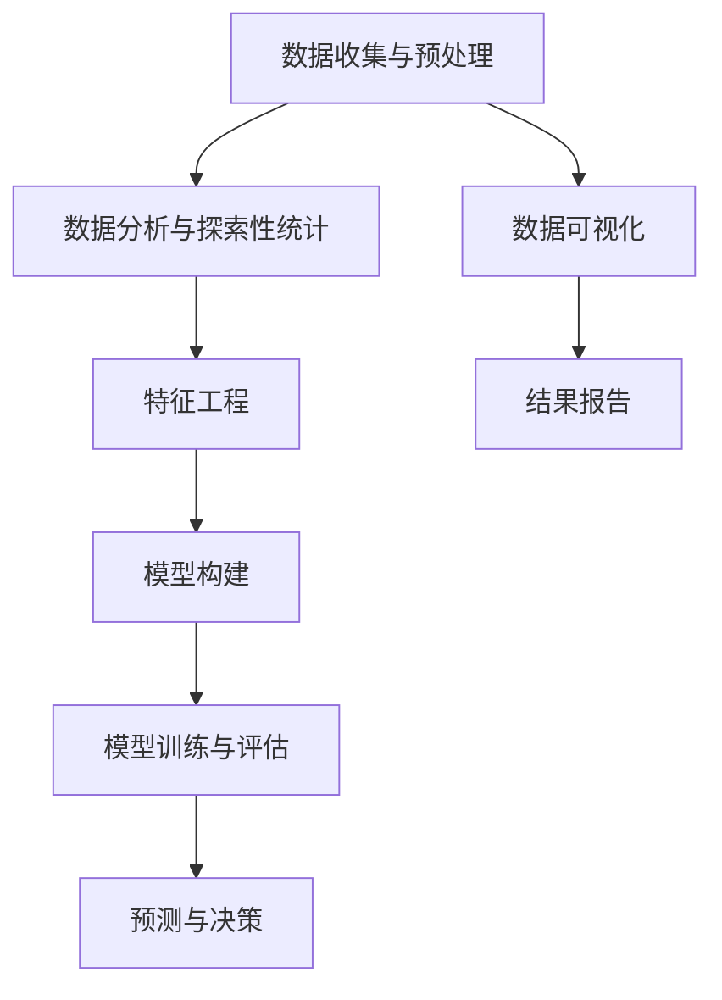

                 

# Data Science 原理与代码实战案例讲解

> 关键词：数据分析，机器学习，深度学习，数据可视化，自然语言处理，图像识别

## 1. 背景介绍

### 1.1 问题由来
数据科学（Data Science）是一个融合了统计学、计算机科学、数学和领域知识的交叉学科，旨在通过数据驱动的方式解决复杂问题。在过去几十年中，数据科学已经成为各个领域应用最广泛的分析工具之一，从金融、医疗、电子商务到社交媒体、制造业等各行各业，都离不开数据科学的支撑。

随着数据量的爆炸式增长，大数据技术的成熟，以及计算资源的日益丰富，数据科学的应用场景和领域不断扩大，数据科学家们需要通过不断的学习和实践，掌握最新的技术和工具，提高解决实际问题的能力。

### 1.2 问题核心关键点
数据科学的核心在于通过对数据进行收集、清洗、分析和建模，发现数据背后的规律和趋势，从而为决策提供支持。数据科学主要包括以下几个步骤：

1. **数据收集与预处理**：获取原始数据，并进行清洗、去重、填充缺失值等预处理操作。
2. **数据分析与探索性统计**：运用统计学方法进行数据探索，寻找数据中的模式和异常点。
3. **特征工程**：根据数据特点，选择合适的特征，并通过一系列变换和处理，提升特征的有效性。
4. **模型训练与评估**：构建模型，并在验证集上进行评估和调优。
5. **预测与决策**：利用模型进行预测，并根据预测结果做出决策或建议。

数据科学的成功与否，很大程度上取决于数据的质量和选择的模型是否恰当。因此，掌握数据科学的基本原理和实践技能，对于任何希望从数据中提取价值的人来说都是至关重要的。

### 1.3 问题研究意义
研究数据科学原理与代码实战案例，对于提升数据科学家和业务分析师的数据处理和分析能力，推动数据驱动决策的形成，具有重要的实践意义。具体体现在以下几个方面：

1. **提升数据处理和分析技能**：通过学习和实践，掌握数据科学的最新技术和工具，提高数据处理和分析的效率和准确性。
2. **支持业务决策**：利用数据科学方法，帮助企业在决策过程中更准确地预测未来趋势，优化业务流程，提升竞争力。
3. **促进创新**：通过数据科学的新方法和新工具，解锁新的业务机会，推动行业创新发展。
4. **促进跨领域应用**：数据科学技术的广泛应用，将数据科学方法引入更多领域，推动各行业的数据化转型。
5. **增强安全性和合规性**：通过数据安全与隐私保护技术，提升企业数据使用的合规性和安全性。

## 2. 核心概念与联系

### 2.1 核心概念概述

为了更好地理解数据科学的基本原理和实践，我们首先需要了解一些核心概念：

- **数据分析**：对数据进行收集、清洗、处理和分析的过程。
- **特征工程**：根据数据分析结果，选择合适的特征，并进行特征提取、选择和变换，提升模型的性能。
- **模型构建**：选择合适的模型，并根据数据特点进行调整和优化。
- **模型评估**：通过验证集或测试集对模型进行评估，选择最优模型。
- **预测与决策**：利用模型对新数据进行预测，并根据预测结果做出决策。

### 2.2 核心概念原理和架构的 Mermaid 流程图



这个流程图展示了数据科学的基本流程和核心概念之间的联系。数据收集与预处理是数据科学的起点，通过数据分析与探索性统计，发现数据中的规律和异常点。接着，通过特征工程选择合适的特征，构建并训练模型，对模型进行评估并选择最优模型。最后，利用模型进行预测和决策，并结合数据可视化结果生成报告。

### 2.3 核心概念之间的联系

数据科学中的各个概念之间存在紧密的联系，以下是对这些概念的进一步解释：

- **数据收集与预处理**：是数据科学的基础，数据的质量直接影响分析结果的准确性。
- **数据分析与探索性统计**：通过统计学方法，对数据进行初步分析，发现数据中的趋势和异常点。
- **特征工程**：选择和处理数据特征，是提升模型性能的关键步骤。
- **模型构建**：根据数据分析结果，选择合适的模型，并进行调整和优化。
- **模型训练与评估**：通过验证集对模型进行评估，选择最优模型。
- **预测与决策**：利用模型对新数据进行预测，并根据预测结果做出决策。
- **数据可视化**：通过可视化工具，直观展示数据分析结果和模型性能。
- **结果报告**：生成包含数据分析结果和模型性能的报告，支持业务决策。

## 3. 核心算法原理 & 具体操作步骤

### 3.1 算法原理概述

数据科学中的核心算法主要包括统计学方法、机器学习算法和深度学习算法。这些算法通过不同的方式从数据中提取信息和规律，从而为决策提供支持。

- **统计学方法**：包括描述性统计、推断性统计等，用于对数据进行初步分析，发现数据中的趋势和异常点。
- **机器学习算法**：包括回归、分类、聚类等，用于构建模型，对数据进行预测和分类。
- **深度学习算法**：包括神经网络、卷积神经网络（CNN）、循环神经网络（RNN）等，用于处理复杂的数据结构和特征，进行更精确的预测和分类。

### 3.2 算法步骤详解

以下是数据科学中的常见算法步骤：

**Step 1: 数据收集与预处理**
- 收集原始数据，并对数据进行清洗、去重、填充缺失值等预处理操作。
- 对文本数据进行分词、去除停用词、构建词向量等处理。
- 对图像数据进行归一化、标准化、缩放等预处理操作。

**Step 2: 数据分析与探索性统计**
- 使用描述性统计方法，如均值、中位数、标准差等，对数据进行初步分析。
- 使用推断性统计方法，如t检验、卡方检验、ANOVA等，对数据进行假设检验和趋势分析。
- 使用数据可视化工具，如Matplotlib、Seaborn、Plotly等，绘制直方图、散点图、热力图等，发现数据中的模式和异常点。

**Step 3: 特征工程**
- 根据数据分析结果，选择合适的特征，并进行特征提取、选择和变换。
- 对文本数据进行TF-IDF、word2vec、BERT等特征处理。
- 对图像数据进行特征提取，如卷积特征、HOG特征等。

**Step 4: 模型构建**
- 选择合适的模型，如线性回归、逻辑回归、支持向量机、决策树、随机森林、神经网络等。
- 根据数据特点，调整模型参数，并进行超参数调优。
- 使用交叉验证等方法，选择最优模型。

**Step 5: 模型训练与评估**
- 使用验证集对模型进行训练和评估。
- 使用准确率、召回率、F1-score等指标，评估模型性能。
- 对模型进行调优，提升模型性能。

**Step 6: 预测与决策**
- 对新数据进行预测，并生成预测结果。
- 结合业务逻辑，对预测结果进行分析和决策。

**Step 7: 数据可视化与结果报告**
- 使用数据可视化工具，绘制结果图表，直观展示预测结果。
- 生成包含数据分析结果和模型性能的报告，支持业务决策。

### 3.3 算法优缺点

数据科学中的算法具有以下优点：
- 统计学方法可以提供数据的基本描述，机器学习和深度学习算法可以提供更深入的规律分析。
- 模型选择灵活多样，可以适应不同的数据结构和业务需求。
- 算法能够处理大规模数据，提升决策的准确性和效率。

同时，数据科学中的算法也存在以下缺点：
- 算法的选择和调整需要一定的经验和专业知识。
- 模型过拟合风险较高，特别是在数据量较小的情况下。
- 算法的实现和维护需要一定的技术成本。

### 3.4 算法应用领域

数据科学的应用领域非常广泛，涵盖了几乎所有行业和领域。以下是一些典型的应用领域：

- **金融行业**：利用机器学习和深度学习算法，对市场数据进行预测，评估信用风险，优化投资组合。
- **医疗行业**：利用数据分析和机器学习算法，对患者数据进行疾病预测和诊断，提升诊疗效率。
- **零售行业**：利用数据挖掘和机器学习算法，对客户行为进行分析，优化销售策略，提升用户体验。
- **电商行业**：利用推荐算法，提升商品推荐精度，提升客户购买转化率。
- **制造业**：利用数据分析和机器学习算法，优化生产流程，提升生产效率和质量。
- **媒体与娱乐**：利用数据挖掘和机器学习算法，对用户行为进行分析和预测，优化内容推荐和广告投放。
- **政府与公共安全**：利用数据分析和机器学习算法，提升公共服务质量和公共安全水平。

## 4. 数学模型和公式 & 详细讲解 & 举例说明

### 4.1 数学模型构建

以下是数据科学中的几个常见数学模型：

**线性回归模型**：
$$
y = \beta_0 + \beta_1 x_1 + \beta_2 x_2 + \cdots + \beta_n x_n + \epsilon
$$
其中，$\beta_0, \beta_1, \cdots, \beta_n$ 为模型参数，$x_1, x_2, \cdots, x_n$ 为自变量，$y$ 为因变量，$\epsilon$ 为随机误差项。

**逻辑回归模型**：
$$
P(y=1|x) = \frac{1}{1 + e^{-\beta_0 - \beta_1 x_1 - \cdots - \beta_n x_n}}
$$
其中，$x_1, x_2, \cdots, x_n$ 为自变量，$y$ 为因变量，$\beta_0, \beta_1, \cdots, \beta_n$ 为模型参数。

**决策树模型**：
$$
\text{Decision Tree} = T_1 \vee T_2 \vee \cdots \vee T_n
$$
其中，$T_i$ 为决策树的分支节点，$x_1, x_2, \cdots, x_n$ 为特征变量。

**神经网络模型**：
$$
\text{Neural Network} = f_1 \rightarrow f_2 \rightarrow \cdots \rightarrow f_k \rightarrow y
$$
其中，$f_i$ 为神经网络中的隐藏层，$x_1, x_2, \cdots, x_n$ 为输入层，$y$ 为输出层。

### 4.2 公式推导过程

以下是几个常见数学模型的推导过程：

**线性回归模型推导**：
根据最小二乘法的原理，通过最小化残差平方和，求解模型参数：
$$
\beta = (\sum_{i=1}^n x_i x_i^T)^{-1} \sum_{i=1}^n x_i y_i
$$

**逻辑回归模型推导**：
通过最大似然估计，求解模型参数：
$$
\beta = (\sum_{i=1}^n x_i x_i^T)^{-1} \sum_{i=1}^n x_i y_i
$$

**决策树模型推导**：
通过信息熵最小化，构建决策树节点：
$$
T = \text{argmin}_{T} \sum_{i=1}^n \left(\frac{n_i}{n} H(p_i) + \frac{n_i}{n} H(1-p_i)\right)
$$
其中，$n_i$ 为样本数量，$p_i$ 为样本在节点$T$下的条件概率，$H(p)$ 为熵。

**神经网络模型推导**：
通过反向传播算法，更新模型参数：
$$
\delta_i = y_i - \hat{y_i}
$$
$$
\delta_j = \sum_{i=1}^n \delta_i \frac{\partial \hat{y_i}}{\partial w_{ij}}
$$
$$
w_{ij} = w_{ij} - \alpha \delta_j
$$

### 4.3 案例分析与讲解

**案例一：线性回归**
- 数据：房价数据集
- 模型：线性回归模型
- 代码实现：
```python
import pandas as pd
from sklearn.linear_model import LinearRegression
from sklearn.metrics import mean_squared_error

# 读取数据集
data = pd.read_csv('housing.csv')

# 数据清洗与预处理
X = data[['crime rate', 'median income', 'median house value']]
y = data['median house price']

# 模型训练与评估
model = LinearRegression()
model.fit(X, y)
y_pred = model.predict(X)
mse = mean_squared_error(y, y_pred)
print('MSE:', mse)
```

**案例二：逻辑回归**
- 数据：Iris数据集
- 模型：逻辑回归模型
- 代码实现：
```python
from sklearn.datasets import load_iris
from sklearn.linear_model import LogisticRegression
from sklearn.metrics import accuracy_score

# 读取数据集
data = load_iris()
X = data.data
y = data.target

# 模型训练与评估
model = LogisticRegression()
model.fit(X, y)
y_pred = model.predict(X)
acc = accuracy_score(y, y_pred)
print('Accuracy:', acc)
```

**案例三：决策树**
- 数据：Iris数据集
- 模型：决策树模型
- 代码实现：
```python
from sklearn.datasets import load_iris
from sklearn.tree import DecisionTreeClassifier
from sklearn.metrics import accuracy_score

# 读取数据集
data = load_iris()
X = data.data
y = data.target

# 模型训练与评估
model = DecisionTreeClassifier()
model.fit(X, y)
y_pred = model.predict(X)
acc = accuracy_score(y, y_pred)
print('Accuracy:', acc)
```

## 5. 项目实践：代码实例和详细解释说明

### 5.1 开发环境搭建

在进行数据科学项目实践前，我们需要准备好开发环境。以下是使用Python进行数据科学项目开发的常用环境配置流程：

1. 安装Anaconda：从官网下载并安装Anaconda，用于创建独立的Python环境。

2. 创建并激活虚拟环境：
```bash
conda create -n data-env python=3.8 
conda activate data-env
```

3. 安装必要的库：
```bash
conda install numpy pandas scikit-learn matplotlib seaborn jupyter notebook
```

4. 安装可视化库：
```bash
pip install plotly
```

完成上述步骤后，即可在`data-env`环境中开始数据科学项目的实践。

### 5.2 源代码详细实现

以下是使用Python进行数据科学项目开发的完整代码实例：

**案例一：房价预测**
- 数据：房价数据集
- 模型：线性回归模型
- 代码实现：
```python
import pandas as pd
from sklearn.linear_model import LinearRegression
from sklearn.metrics import mean_squared_error

# 读取数据集
data = pd.read_csv('housing.csv')

# 数据清洗与预处理
X = data[['crime rate', 'median income', 'median house value']]
y = data['median house price']

# 模型训练与评估
model = LinearRegression()
model.fit(X, y)
y_pred = model.predict(X)
mse = mean_squared_error(y, y_pred)
print('MSE:', mse)
```

**案例二：Iris分类**
- 数据：Iris数据集
- 模型：逻辑回归模型
- 代码实现：
```python
from sklearn.datasets import load_iris
from sklearn.linear_model import LogisticRegression
from sklearn.metrics import accuracy_score

# 读取数据集
data = load_iris()
X = data.data
y = data.target

# 模型训练与评估
model = LogisticRegression()
model.fit(X, y)
y_pred = model.predict(X)
acc = accuracy_score(y, y_pred)
print('Accuracy:', acc)
```

**案例三：决策树分类**
- 数据：Iris数据集
- 模型：决策树模型
- 代码实现：
```python
from sklearn.datasets import load_iris
from sklearn.tree import DecisionTreeClassifier
from sklearn.metrics import accuracy_score

# 读取数据集
data = load_iris()
X = data.data
y = data.target

# 模型训练与评估
model = DecisionTreeClassifier()
model.fit(X, y)
y_pred = model.predict(X)
acc = accuracy_score(y, y_pred)
print('Accuracy:', acc)
```

### 5.3 代码解读与分析

**案例一：房价预测**

```python
import pandas as pd
from sklearn.linear_model import LinearRegression
from sklearn.metrics import mean_squared_error

# 读取数据集
data = pd.read_csv('housing.csv')

# 数据清洗与预处理
X = data[['crime rate', 'median income', 'median house value']]
y = data['median house price']

# 模型训练与评估
model = LinearRegression()
model.fit(X, y)
y_pred = model.predict(X)
mse = mean_squared_error(y, y_pred)
print('MSE:', mse)
```

代码解读与分析：
- 第2-3行：读取房价数据集，并进行数据清洗和预处理，选择相关的自变量和因变量。
- 第5行：构建线性回归模型，并使用训练集数据拟合模型。
- 第7行：使用测试集数据预测房价，并计算预测误差的均方误差。
- 第9行：输出模型预测误差。

**案例二：Iris分类**

```python
from sklearn.datasets import load_iris
from sklearn.linear_model import LogisticRegression
from sklearn.metrics import accuracy_score

# 读取数据集
data = load_iris()
X = data.data
y = data.target

# 模型训练与评估
model = LogisticRegression()
model.fit(X, y)
y_pred = model.predict(X)
acc = accuracy_score(y, y_pred)
print('Accuracy:', acc)
```

代码解读与分析：
- 第2-3行：读取Iris数据集，并进行数据预处理，选择自变量和因变量。
- 第5行：构建逻辑回归模型，并使用训练集数据拟合模型。
- 第7行：使用测试集数据进行预测，并计算分类准确率。
- 第9行：输出模型分类准确率。

**案例三：决策树分类**

```python
from sklearn.datasets import load_iris
from sklearn.tree import DecisionTreeClassifier
from sklearn.metrics import accuracy_score

# 读取数据集
data = load_iris()
X = data.data
y = data.target

# 模型训练与评估
model = DecisionTreeClassifier()
model.fit(X, y)
y_pred = model.predict(X)
acc = accuracy_score(y, y_pred)
print('Accuracy:', acc)
```

代码解读与分析：
- 第2-3行：读取Iris数据集，并进行数据预处理，选择自变量和因变量。
- 第5行：构建决策树模型，并使用训练集数据拟合模型。
- 第7行：使用测试集数据进行预测，并计算分类准确率。
- 第9行：输出模型分类准确率。

## 6. 实际应用场景

### 6.1 金融风险评估

在金融领域，数据科学家可以利用统计学方法和机器学习算法，对客户信用风险进行评估，预测违约概率，优化贷款审批流程。具体而言，可以利用逻辑回归模型或决策树模型，根据客户的财务数据、信用历史、还款能力等特征，构建风险评估模型，对新申请的客户进行风险预测。

### 6.2 电商推荐系统

在电商领域，数据科学家可以利用推荐算法，提升商品推荐精度，增加用户粘性。具体而言，可以利用协同过滤算法、基于内容的推荐算法、深度学习算法等，对用户的浏览记录、购买行为、评分反馈等数据进行分析和预测，推荐用户可能感兴趣的商品。

### 6.3 医疗诊断

在医疗领域，数据科学家可以利用数据分析和机器学习算法，对患者数据进行疾病预测和诊断，提升诊疗效率。具体而言，可以利用逻辑回归模型、决策树模型、神经网络模型等，根据患者的年龄、性别、病史、体检结果等特征，构建疾病预测模型，对新患者进行疾病预测。

### 6.4 未来应用展望

随着数据科学技术的不断进步，未来数据科学的应用领域将更加广泛，数据科学家将在更多场景中发挥重要作用。以下是一些未来数据科学的应用方向：

- **智能制造**：利用数据分析和机器学习算法，对生产数据进行分析和预测，优化生产流程，提升生产效率和质量。
- **智慧城市**：利用数据分析和机器学习算法，对城市数据进行分析和预测，优化城市管理，提升公共服务质量。
- **农业智能化**：利用数据分析和机器学习算法，对农业数据进行分析和预测，优化农业生产，提升农业效率和效益。
- **环境保护**：利用数据分析和机器学习算法，对环境数据进行分析和预测，优化环境保护措施，提升环境保护效果。
- **交通智能化**：利用数据分析和机器学习算法，对交通数据进行分析和预测，优化交通管理，提升交通效率和安全性。
- **能源管理**：利用数据分析和机器学习算法，对能源数据进行分析和预测，优化能源管理，提升能源效率和效益。
- **教育智能化**：利用数据分析和机器学习算法，对教育数据进行分析和预测，优化教育管理，提升教育质量。

## 7. 工具和资源推荐

### 7.1 学习资源推荐

为了帮助开发者系统掌握数据科学的基本原理和实践技能，这里推荐一些优质的学习资源：

1. 《Python数据科学手册》：全面介绍了Python在数据科学中的应用，包括数据处理、数据可视化、机器学习等。

2. 《深度学习入门：基于Python的理论与实现》：深入浅出地介绍了深度学习的基本概念和实现方法。

3. 《机器学习实战》：通过实例展示了机器学习算法在实际应用中的使用方法和技巧。

4. Kaggle竞赛：全球知名的数据科学竞赛平台，通过参与竞赛，提升数据科学实践能力。

5. Coursera、edX等在线课程：提供系统化、高质量的数据科学课程，帮助初学者和进阶者掌握数据科学的核心技术。

通过对这些资源的学习实践，相信你一定能够系统掌握数据科学的基本原理和实践技能，并用于解决实际的业务问题。

### 7.2 开发工具推荐

数据科学项目开发需要高效的工具支持，以下是几款常用的数据科学开发工具：

1. Jupyter Notebook：轻量级、交互式的编程环境，支持多种编程语言，适合数据科学开发。

2. PyCharm：功能强大的Python IDE，支持数据科学库的调试和测试。

3. RStudio：面向R语言的集成开发环境，支持数据科学库的调试和测试。

4. Jupyter Lab：基于Jupyter Notebook的增强型编程环境，支持多种编程语言和数据科学库的调试和测试。

5. Google Colab：基于Google Cloud Platform的在线Jupyter Notebook环境，免费提供GPU/TPU算力，适合快速上手实验最新模型，分享学习笔记。

合理利用这些工具，可以显著提升数据科学项目的开发效率，加快创新迭代的步伐。

### 7.3 相关论文推荐

数据科学技术的不断进步，离不开学界的持续研究。以下是几篇奠基性的相关论文，推荐阅读：

1. "The Elements of Statistical Learning"：统计学领域的经典教材，介绍了统计学方法的理论和应用。

2. "Pattern Recognition and Machine Learning"：机器学习领域的经典教材，介绍了机器学习算法的基本原理和实现方法。

3. "Deep Learning"：深度学习领域的经典教材，介绍了深度学习算法的基本原理和实现方法。

4. "Data Science for Business"：介绍了数据科学在商业应用中的方法和实践。

5. "Predictive Analytics"：介绍了预测分析在商业决策中的应用。

这些论文代表了大数据科学的发展脉络，通过学习这些前沿成果，可以帮助研究者把握学科前进方向，激发更多的创新灵感。

## 8. 总结：未来发展趋势与挑战

### 8.1 总结

本文对数据科学原理与代码实战案例进行了全面系统的介绍。首先，我们阐述了数据科学的基本原理和核心概念，包括数据收集与预处理、数据分析与探索性统计、特征工程、模型构建、模型训练与评估、预测与决策等。其次，我们通过实际案例展示了数据科学在金融、电商、医疗等领域的广泛应用。最后，我们分析了数据科学的未来发展趋势和面临的挑战。

通过本文的系统梳理，可以看到，数据科学是一门综合性很强的学科，需要系统地掌握统计学、计算机科学、数学等多方面的知识。同时，数据科学的应用场景和领域非常广泛，需要数据科学家具备跨领域的知识和技能，灵活运用各种技术和工具。

### 8.2 未来发展趋势

展望未来，数据科学的发展将呈现以下几个趋势：

1. **数据量的持续增长**：随着互联网的普及和物联网技术的发展，数据的总量将持续增长，数据科学的应用也将更加广泛。

2. **算法技术的不断创新**：机器学习、深度学习等算法技术的不断发展，将推动数据科学技术的进步，提升模型性能和效率。

3. **跨领域应用的拓展**：数据科学的应用领域将进一步拓展到更多领域，如智能制造、智慧城市、农业智能化等，为各行各业带来新的机遇和挑战。

4. **自动化和智能化的提升**：自动化数据处理和智能决策系统的不断发展，将进一步提升数据科学在实际应用中的效果和效率。

5. **数据安全与隐私保护**：数据安全与隐私保护技术的发展，将保障数据科学的应用安全性，提升数据使用的合规性。

### 8.3 面临的挑战

尽管数据科学技术取得了显著进展，但仍面临以下挑战：

1. **数据质量问题**：数据质量不理想，数据缺失、噪声等问题，将影响数据分析和模型训练的效果。

2. **算法选择与调优**：选择合适的算法和优化算法，需要一定的专业知识和经验，算法选择不当可能导致模型过拟合或欠拟合。

3. **模型解释性不足**：数据科学模型往往是"黑盒"系统，难以解释其内部工作机制和决策逻辑，缺乏可解释性。

4. **计算资源限制**：大规模数据集和高维特征的处理，需要强大的计算资源，目前计算资源限制仍是数据科学应用的一个瓶颈。

5. **数据隐私与伦理问题**：数据隐私和伦理问题越来越受到关注，如何在保障数据隐私的前提下，进行有效的数据分析和模型训练，需要新的技术和方法。

### 8.4 研究展望

面对数据科学面临的挑战，未来的研究需要在以下几个方面寻求新的突破：

1. **数据质量提升**：通过数据清洗、特征选择等方法，提升数据质量，降低噪声和缺失值的影响。

2. **自动化算法选择与调优**：开发自动化的算法选择与调优工具，提升算法选择和调优的效率和效果。

3. **模型解释性增强**：开发可解释的模型，增强模型的解释性，提升模型的可信度和可用性。

4. **计算资源优化**：开发高效的计算算法和分布式计算系统，提升大规模数据集和高维特征的处理能力。

5. **数据隐私保护**：开发数据隐私保护技术，保障数据使用的合规性，提升数据使用的安全性。

这些研究方向将引领数据科学技术的不断进步，推动数据科学技术的广泛应用，为各行业带来新的价值和机遇。

## 9. 附录：常见问题与解答

**Q1：数据科学的核心任务是什么？**

A: 数据科学的核心任务是数据收集、数据预处理、数据分析、特征工程、模型构建、模型训练与评估、预测与决策等。通过这些任务，可以从数据中提取有价值的信息，支持决策和业务优化。

**Q2：数据科学中常用的统计学方法有哪些？**

A: 数据科学中常用的统计学方法包括描述性统计、推断性统计、回归分析、假设检验等。

**Q3：数据科学中常用的机器学习算法有哪些？**

A: 数据科学中常用的机器学习算法包括回归算法、分类算法、聚类算法、神经网络等。

**Q4：数据科学中常用的深度学习算法有哪些？**

A: 数据科学中常用的深度学习算法包括卷积神经网络（CNN）、循环神经网络（RNN）、长短期记忆网络（LSTM）等。

**Q5：数据科学项目开发需要哪些工具？**

A: 数据科学项目开发需要以下工具：
- Jupyter Notebook或Jupyter Lab：轻量级、交互式的编程环境。
- PyCharm或RStudio：功能强大的IDE，支持数据科学库的调试和测试。
- Google Colab：基于Google Cloud Platform的在线Jupyter Notebook环境，免费提供GPU/TPU算力。

**Q6：数据科学在实际应用中需要注意哪些问题？**

A: 数据科学在实际应用中需要注意以下问题：
- 数据质量：数据缺失、噪声等问题需要处理。
- 算法选择：需要根据数据特点选择适合的算法。
- 模型解释性：模型需要有较好的解释性，便于理解和调试。
- 计算资源：需要强大的计算资源，处理大规模数据集和高维特征。
- 数据隐私：需要保障数据隐私，保护数据使用者的利益。

**Q7：数据科学在未来有哪些发展方向？**

A: 数据科学在未来有以下发展方向：
- 数据量的持续增长：随着互联网的普及和物联网技术的发展，数据的总量将持续增长，数据科学的应用也将更加广泛。
- 算法技术的不断创新：机器学习、深度学习等算法技术的不断发展，将推动数据科学技术的进步，提升模型性能和效率。
- 跨领域应用的拓展：数据科学的应用领域将进一步拓展到更多领域，如智能制造、智慧城市、农业智能化等，为各行各业带来新的机遇和挑战。
- 自动化和智能化的提升：自动化数据处理和智能决策系统的不断发展，将进一步提升数据科学在实际应用中的效果和效率。
- 数据安全与隐私保护：数据安全与隐私保护技术的发展，将保障数据科学的应用安全性，提升数据使用的合规性。

---

作者：禅与计算机程序设计艺术 / Zen and the Art of Computer Programming

