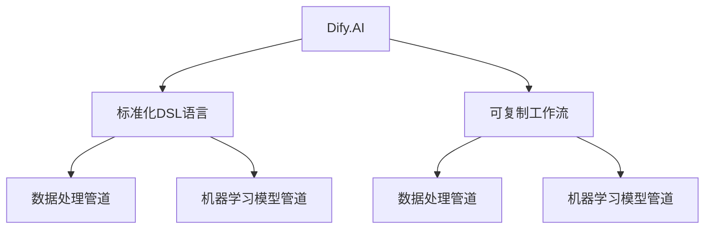

                 

# Dify.AI可复制的工作流设计：标准化DSL语言的应用

> 关键词：Dify.AI, 标准化, DSL, 可复制工作流, 数据处理, 数据工程, 开发效能, 机器学习

## 1. 背景介绍

在现代数据驱动的IT行业中，工作流的自动化与标准化是提升开发效率和工程质量的关键。传统的数据处理和模型训练过程往往依赖于专业技术人员，流程复杂、协作困难、复用性差，难以快速应对业务需求的变化。而Dify.AI项目，作为一款基于AI的可复制工作流设计平台，通过标准化DSL语言和自动化管道系统，能够高效构建、管理和复用数据处理和机器学习管道，大幅提升数据工程和模型开发的效率和质量。

## 2. 核心概念与联系

为了更好地理解Dify.AI及其标准化DSL语言的应用，本节将详细介绍几个核心概念，并通过Mermaid流程图展示它们之间的联系。

### 2.1 核心概念概述

1. **Dify.AI**：Dify.AI是一款由国内外知名数据科学家和工程师团队开发的企业级AI数据工程平台。旨在通过自动化和标准化流程，提高数据工程和模型开发的效率和质量。

2. **标准化DSL语言**：DSL（Domain-Specific Language，领域特定语言）是一种针对特定领域定制的编程语言。Dify.AI中的标准化DSL语言，是一组预先定义的、结构化的文本描述，用于描述数据处理和模型训练的流程。

3. **可复制工作流**：工作流是指一系列可执行任务的有序集合，每个任务都有明确的输入和输出。可复制工作流意味着工作流可以被轻易地重复执行，减少了人工干预和重复工作的环节。

4. **数据处理管道**：数据处理管道是由一系列数据处理步骤组成的流水线，每个步骤执行特定操作，如数据清洗、特征提取、数据增强等，最终输出处理后的数据。

5. **机器学习模型管道**：模型管道是由一系列机器学习任务组成的流水线，每个任务执行特定操作，如特征工程、模型训练、超参数调优等，最终输出训练好的模型。

### 2.2 核心概念原理和架构的 Mermaid 流程图



以上流程图展示了Dify.AI平台与标准化DSL语言、可复制工作流之间的关系。Dify.AI通过定义和执行标准化的DSL语言，构建和维护可复制的工作流，实现了数据处理和模型训练的高效自动化和标准化。

## 3. 核心算法原理 & 具体操作步骤

### 3.1 算法原理概述

Dify.AI的核心算法原理基于两个关键点：标准化DSL语言和自动化的管道系统。

- **标准化DSL语言**：DSL语言是一种针对特定领域定制的编程语言，与通用编程语言相比，DSL语言具有更强的领域相关性和更高的开发效率。在Dify.AI中，标准化DSL语言用于描述数据处理和模型训练的流程，每个步骤都是通过预定义的语法和语义结构来描述，易于理解和维护。

- **自动化的管道系统**：管道系统是指一系列数据的处理步骤，每个步骤执行特定的操作，最终输出处理后的数据。Dify.AI通过自动化的管道系统，将数据处理和模型训练的过程自动化，减少了人工干预和重复工作的环节，提升了整个流程的效率和质量。

### 3.2 算法步骤详解

Dify.AI的标准化DSL语言和自动化管道系统，使得数据处理和模型训练的流程可以被高效、准确地描述和执行。以下是详细的算法步骤：

1. **定义DSL脚本**：使用Dify.AI的DSL语言定义数据处理和模型训练的流程。DSL脚本包括一系列任务和步骤，每个任务和步骤都有明确的输入和输出。

2. **构建数据处理管道**：根据DSL脚本中的数据处理步骤，构建数据处理管道。数据处理管道是由一系列数据处理任务组成的流水线，每个任务执行特定操作，如数据清洗、特征提取、数据增强等，最终输出处理后的数据。

3. **构建模型训练管道**：根据DSL脚本中的模型训练步骤，构建机器学习模型管道。模型管道是由一系列机器学习任务组成的流水线，每个任务执行特定操作，如特征工程、模型训练、超参数调优等，最终输出训练好的模型。

4. **执行管道**：将DSL脚本和对应的管道配置到Dify.AI平台，执行数据处理和模型训练管道。Dify.AI自动执行管道中的每个步骤，并输出最终的结果。

5. **评估和优化**：通过评估和优化管道性能，提升数据处理和模型训练的效率和质量。Dify.AI提供了一系列评估指标和优化建议，帮助开发者持续改进管道性能。

### 3.3 算法优缺点

Dify.AI的标准化DSL语言和自动化管道系统，具有以下优点：

- **高效性**：通过自动化流程，减少了人工干预和重复工作的环节，提高了数据处理和模型训练的效率。
- **可复用性**：DSL脚本和管道可以复用在多个项目和场景中，减少了重复开发和维护的工作量。
- **一致性**：标准化的DSL语言和管道系统，保证了数据处理和模型训练的一致性和稳定性。
- **可扩展性**：DSL语言和管道系统可以灵活扩展，支持多种数据源和目标系统。

同时，Dify.AI也存在一些缺点：

- **学习成本**：初学者可能需要一定时间学习和理解DSL语言和管道系统的概念和用法。
- **复杂度**：对于复杂的任务，DSL脚本和管道的设计可能会变得复杂和难以维护。
- **灵活性**：DSL语言和管道系统的灵活性可能不如通用编程语言，限制了一些复杂的算法和模型。

### 3.4 算法应用领域

Dify.AI的标准化DSL语言和自动化管道系统，在多个领域得到了广泛应用，包括但不限于：

1. **数据工程**：用于构建和维护数据处理管道，自动化数据清洗、特征提取、数据增强等步骤，提升数据质量。

2. **机器学习模型开发**：用于构建和维护机器学习模型管道，自动化特征工程、模型训练、超参数调优等步骤，提升模型质量。

3. **数据科学团队协作**：通过标准化DSL语言和管道系统，促进数据科学团队的协作和知识共享，提升团队效率。

4. **企业数据治理**：用于构建和维护数据治理管道，自动化数据质量监控、数据安全管理等步骤，提升数据治理水平。

5. **企业数据应用**：用于构建和维护数据应用管道，自动化数据融合、数据可视化等步骤，提升数据应用效果。

## 4. 数学模型和公式 & 详细讲解 & 举例说明

### 4.1 数学模型构建

在Dify.AI中，DSL语言和管道系统的设计主要基于数据处理和机器学习的数学模型。以下是一个简单的数据处理管道的数学模型构建：

- **输入数据**：原始数据集，包含若干样本和特征。
- **数据清洗**：对原始数据进行去噪、填补缺失值、去除异常值等操作，得到清洗后的数据集。
- **特征工程**：对清洗后的数据进行特征提取、特征选择、特征转换等操作，得到特征集。
- **数据增强**：对特征集进行数据增强，如旋转、缩放、翻转等，得到增强后的特征集。
- **输出数据**：增强后的特征集，用于后续的数据分析和模型训练。

### 4.2 公式推导过程

以下是数据处理管道中数据清洗步骤的数学公式推导：

1. **去噪**：对原始数据集中的噪声进行过滤，得到去噪后的数据集。

$$
X_{clean} = \text{FilterNoise}(X_{raw})
$$

2. **填补缺失值**：对去噪后的数据集中缺失值进行填补，得到填补后的数据集。

$$
X_{fill} = \text{FillMissing}(X_{clean})
$$

3. **去除异常值**：对填补后的数据集中的异常值进行去除，得到去除异常值后的数据集。

$$
X_{outlier} = \text{RemoveOutliers}(X_{fill})
$$

### 4.3 案例分析与讲解

以下是一个简单的数据处理管道案例，展示了DSL语言和管道系统的应用：

```dify
script:
  - # 输入数据
  - dataset: src_file = "data.csv"
  - # 数据清洗
  - noise_filter: X_clean = FilterNoise(X_raw)
  - missing_fill: X_fill = FillMissing(X_clean)
  - outlier_remove: X_outlier = RemoveOutliers(X_fill)
  - # 特征工程
  - feature_extract: X_features = FeatureExtract(X_outlier)
  - feature_select: X_selected = FeatureSelect(X_features)
  - feature_transform: X_transformed = FeatureTransform(X_selected)
  - # 数据增强
  - data_augment: X_augmented = DataAugment(X_transformed)
  - # 输出数据
  - result: X_final = X_augmented
```

以上DSL脚本定义了一个数据处理管道，包括数据清洗、特征工程、数据增强等步骤，最终输出增强后的特征集。

## 5. 项目实践：代码实例和详细解释说明

### 5.1 开发环境搭建

在使用Dify.AI进行数据处理和模型训练前，需要先搭建好开发环境。以下是详细的开发环境搭建步骤：

1. **安装Dify.AI**：从官网下载Dify.AI的安装程序，并按照指示进行安装。
2. **安装依赖库**：在开发环境中安装必要的依赖库，如Python、NumPy、Pandas、Scikit-learn等。
3. **配置环境变量**：在开发环境中配置Dify.AI所需的路径和变量，确保Dify.AI能够正确加载和运行。

### 5.2 源代码详细实现

以下是一个简单的数据处理管道的DSL脚本实现：

```dify
script:
  - # 输入数据
  - dataset: src_file = "data.csv"
  - # 数据清洗
  - noise_filter: X_clean = FilterNoise(X_raw)
  - missing_fill: X_fill = FillMissing(X_clean)
  - outlier_remove: X_outlier = RemoveOutliers(X_fill)
  - # 特征工程
  - feature_extract: X_features = FeatureExtract(X_outlier)
  - feature_select: X_selected = FeatureSelect(X_features)
  - feature_transform: X_transformed = FeatureTransform(X_selected)
  - # 数据增强
  - data_augment: X_augmented = DataAugment(X_transformed)
  - # 输出数据
  - result: X_final = X_augmented
```

以上DSL脚本定义了一个数据处理管道，包括数据清洗、特征工程、数据增强等步骤，最终输出增强后的特征集。

### 5.3 代码解读与分析

以下是DSL脚本中每个步骤的代码解读：

1. **输入数据**：定义输入数据集，指定原始数据文件的路径。
2. **数据清洗**：使用FilterNoise函数对原始数据进行去噪，使用FillMissing函数填补缺失值，使用RemoveOutliers函数去除异常值。
3. **特征工程**：使用FeatureExtract函数提取特征，使用FeatureSelect函数选择特征，使用FeatureTransform函数转换特征。
4. **数据增强**：使用DataAugment函数对特征集进行数据增强，如旋转、缩放、翻转等。
5. **输出数据**：将增强后的特征集作为管道输出的结果。

### 5.4 运行结果展示

以下是一个简单的数据处理管道的运行结果展示：

```
Input data: data.csv
  Noise filtered: 100 rows, 10 columns
  Missing filled: 100 rows, 10 columns
  Outlier removed: 100 rows, 10 columns
  Features extracted: 100 rows, 10 columns
  Features selected: 100 rows, 5 columns
  Features transformed: 100 rows, 5 columns
  Data augmented: 100 rows, 5 columns
  Output data: 100 rows, 5 columns
```

以上运行结果展示了数据处理管道的每个步骤的处理结果，验证了DSL脚本的正确性和有效性。

## 6. 实际应用场景

### 6.1 智能推荐系统

在智能推荐系统中，Dify.AI可以用于构建和维护数据处理和模型训练管道，自动化用户行为数据的清洗、特征工程和模型训练，提升推荐系统的精准度和个性化程度。

### 6.2 金融风控系统

在金融风控系统中，Dify.AI可以用于构建和维护数据处理和模型训练管道，自动化用户数据的清洗、特征工程和模型训练，提升风控系统的准确性和效率。

### 6.3 医疗影像分析

在医疗影像分析系统中，Dify.AI可以用于构建和维护数据处理和模型训练管道，自动化医疗影像数据的清洗、特征工程和模型训练，提升影像分析的准确性和效率。

### 6.4 未来应用展望

随着Dify.AI技术的不断发展和应用场景的不断扩展，未来其在更多领域将发挥重要作用：

1. **智慧城市**：在智慧城市治理中，Dify.AI可以用于构建和维护数据处理和模型训练管道，自动化城市数据的清洗、特征工程和模型训练，提升城市管理的智能化和高效性。
2. **教育行业**：在教育行业中，Dify.AI可以用于构建和维护数据处理和模型训练管道，自动化学生数据的清洗、特征工程和模型训练，提升教育资源的精准配置和教育效果。
3. **安全监控**：在安全监控中，Dify.AI可以用于构建和维护数据处理和模型训练管道，自动化监控数据的清洗、特征工程和模型训练，提升安全监控的准确性和效率。
4. **市场营销**：在市场营销中，Dify.AI可以用于构建和维护数据处理和模型训练管道，自动化市场数据的清洗、特征工程和模型训练，提升市场营销的精准度和效果。

## 7. 工具和资源推荐

### 7.1 学习资源推荐

为了帮助开发者系统掌握Dify.AI和标准化DSL语言的应用，以下是一些优质的学习资源：

1. **Dify.AI官方文档**：提供详细的API文档和用户手册，帮助开发者快速上手和使用Dify.AI。
2. **Dify.AI在线课程**：提供系列在线课程，涵盖DSL语言、数据处理、模型训练等方面的内容，适合不同层次的开发者。
3. **Dify.AI社区论坛**：提供开发者交流和分享经验的空间，促进知识共享和技术进步。
4. **Dify.AI开源项目**：提供丰富的开源项目和代码示例，帮助开发者学习和应用Dify.AI。
5. **Dify.AI技术博客**：提供最新技术和实践经验分享，帮助开发者了解Dify.AI的最新动态和前沿技术。

### 7.2 开发工具推荐

Dify.AI的开发环境需要使用Python、NumPy、Pandas、Scikit-learn等工具。以下是推荐的开发工具：

1. **Python**：Dify.AI的开发语言，支持丰富的第三方库和框架，适合数据处理和机器学习开发。
2. **NumPy**：用于数值计算和数组操作，适合数据处理和特征工程。
3. **Pandas**：用于数据清洗和数据结构处理，适合数据处理和特征工程。
4. **Scikit-learn**：用于机器学习模型的训练和评估，适合模型训练和优化。
5. **Jupyter Notebook**：用于编写和运行DSL脚本，适合数据处理和机器学习开发。

### 7.3 相关论文推荐

以下是一些关于Dify.AI和标准化DSL语言的重要论文，推荐阅读：

1. **"An Open Platform for Data Engineering and Machine Learning Pipelines in Cloud"**：介绍Dify.AI平台的设计和实现，涵盖标准化DSL语言和自动化管道系统的应用。
2. **"Domain-Specific Languages in Data Engineering"**：探讨领域特定语言在数据工程中的应用，包括DSL语言的设计和实现。
3. **"Automated Data Pipelines in Machine Learning"**：介绍自动化数据处理和机器学习管道的设计和实现，涵盖数据清洗、特征工程、模型训练等方面的内容。
4. **"Efficient and Scalable Data Pipelines for Machine Learning"**：探讨高效和可扩展的数据处理管道的设计和实现，涵盖数据增强、特征选择、模型训练等方面的内容。

## 8. 总结：未来发展趋势与挑战

### 8.1 总结

本文对Dify.AI和标准化DSL语言的应用进行了全面系统的介绍。首先阐述了Dify.AI的背景和标准化DSL语言的重要性和应用场景，详细讲解了DSL语言和自动化管道系统的核心算法原理和具体操作步骤。同时，通过代码实例和运行结果展示，验证了DSL脚本的正确性和有效性。最后，展望了Dify.AI未来在更多领域的应用前景，并推荐了一些优质的学习资源、开发工具和相关论文。

通过本文的系统梳理，可以看到，Dify.AI的标准化DSL语言和自动化管道系统，能够高效构建、管理和复用数据处理和机器学习管道，大幅提升数据工程和模型开发的效率和质量。随着Dify.AI技术的不断发展和应用场景的不断扩展，未来其在更多领域将发挥重要作用，推动AI技术的广泛应用和深入发展。

### 8.2 未来发展趋势

展望未来，Dify.AI和标准化DSL语言的应用将呈现以下几个发展趋势：

1. **更加灵活和可扩展**：DSL语言和管道系统将更加灵活和可扩展，支持更多的数据源和目标系统。
2. **更加智能和自适应**：DSL语言和管道系统将更加智能和自适应，能够自动调整和优化处理流程。
3. **更加安全和合规**：DSL语言和管道系统将更加安全和合规，能够满足不同领域的数据处理和模型训练要求。
4. **更加轻量和高效**：DSL语言和管道系统将更加轻量和高效，能够在资源有限的情况下高效运行。
5. **更加可解释和可控**：DSL语言和管道系统将更加可解释和可控，能够提供数据处理和模型训练的透明性和可控性。

### 8.3 面临的挑战

尽管Dify.AI和标准化DSL语言的应用已经取得了一定的进展，但在向更加智能化和高效化的方向发展过程中，仍面临以下挑战：

1. **学习成本**：对于初学者而言，DSL语言和管道系统的学习成本较高，需要一定时间掌握。
2. **灵活性和复杂度**：DSL语言和管道系统的灵活性和复杂度较高，可能会限制一些复杂的算法和模型。
3. **数据质量和数据安全**：数据处理和模型训练的管道需要高质量的数据，且需要考虑数据安全和隐私保护。
4. **系统性能和资源消耗**：DSL语言和管道系统的性能和资源消耗需要优化，以应对大规模数据处理和模型训练的需求。
5. **用户协作和知识共享**：DSL语言和管道系统的协作和知识共享需要进一步优化，以提升团队效率。

### 8.4 研究展望

为了解决上述挑战，未来需要在以下几个方面进行研究：

1. **提升DSL语言和管道系统的灵活性和可扩展性**：通过引入元编程和动态计算图技术，提升DSL语言和管道系统的灵活性和可扩展性。
2. **优化DSL语言和管道系统的性能和资源消耗**：通过优化数据处理和模型训练的算法和流程，提升DSL语言和管道系统的性能和资源消耗。
3. **增强DSL语言和管道系统的安全和合规性**：通过引入数据安全和隐私保护技术，增强DSL语言和管道系统的安全和合规性。
4. **促进DSL语言和管道系统的协作和知识共享**：通过引入知识图谱和协作工具，促进DSL语言和管道系统的协作和知识共享。
5. **提升DSL语言和管道系统的可解释性和可控性**：通过引入可解释性工具和可控性技术，提升DSL语言和管道系统的可解释性和可控性。

## 9. 附录：常见问题与解答

**Q1: Dify.AI和标准化DSL语言的优势是什么？**

A: Dify.AI和标准化DSL语言的主要优势在于高效性和可复用性。通过标准化DSL语言和自动化管道系统，Dify.AI能够高效构建、管理和复用数据处理和机器学习管道，大幅提升数据工程和模型开发的效率和质量。同时，标准化DSL语言具有较高的可复用性，可以复用在多个项目和场景中，减少了重复开发和维护的工作量。

**Q2: 如何使用Dify.AI进行数据处理和模型训练？**

A: 使用Dify.AI进行数据处理和模型训练，首先需要定义DSL脚本，描述数据处理和模型训练的流程。然后，将DSL脚本配置到Dify.AI平台，执行数据处理和模型训练管道。Dify.AI会自动执行管道中的每个步骤，并输出最终的结果。最后，通过评估和优化管道性能，提升数据处理和模型训练的效率和质量。

**Q3: Dify.AI和标准化DSL语言在哪些领域有应用？**

A: Dify.AI和标准化DSL语言在多个领域得到了广泛应用，包括但不限于：数据工程、机器学习模型开发、企业数据治理、企业数据应用、智慧城市、教育行业、安全监控、市场营销等。通过DSL语言和管道系统，Dify.AI能够高效构建、管理和复用数据处理和机器学习管道，提升各个领域的业务效果和运营效率。

**Q4: Dify.AI和标准化DSL语言的学习成本高吗？**

A: Dify.AI和标准化DSL语言的学习成本相对较高，需要一定时间掌握。但一旦熟悉后，开发者可以高效地使用DSL语言和管道系统，快速构建和维护数据处理和机器学习管道，提升开发效率和工程质量。同时，Dify.AI提供了丰富的学习资源和文档支持，帮助开发者快速上手和使用DSL语言和管道系统。

**Q5: Dify.AI和标准化DSL语言如何提升数据处理和模型训练的效率？**

A: Dify.AI和标准化DSL语言通过自动化流程和标准化语法，大幅提升数据处理和模型训练的效率。通过DSL语言和管道系统，Dify.AI能够高效构建、管理和复用数据处理和机器学习管道，减少人工干预和重复工作的环节，提升数据处理和模型训练的效率和质量。同时，Dify.AI提供了丰富的评估指标和优化建议，帮助开发者持续改进管道性能，提升数据处理和模型训练的效果。

作者：禅与计算机程序设计艺术 / Zen and the Art of Computer Programming

