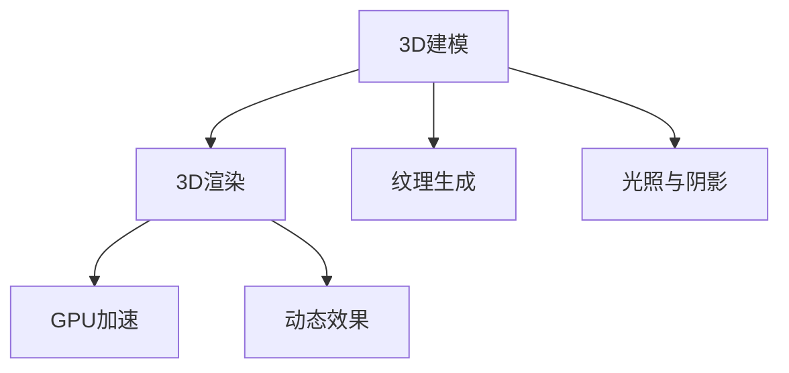

                 

# 3D建模与渲染：虚拟世界的构建

## 1. 背景介绍

### 1.1 问题由来

随着虚拟现实(VR)和增强现实(AR)技术的快速发展和普及，3D建模与渲染技术在虚拟世界的构建中扮演了至关重要的角色。无论是虚拟游戏场景、虚拟培训环境，还是虚拟博物馆、数字城市，都离不开高效的3D建模和逼真渲染。然而，3D建模与渲染仍然是一个复杂且具有挑战性的领域，需要掌握众多技术细节，才能实现高质量的3D内容生成和渲染。

### 1.2 问题核心关键点

在3D建模与渲染中，关键问题在于如何高效生成高质量的3D模型，并使用合适的算法对其进行渲染，以营造逼真的视觉体验。主要关键点包括：

1. 模型几何结构生成：从原始3D扫描数据或2D手绘数据生成高质量的几何模型。
2. 纹理与材质生成：为几何模型添加逼真的纹理和材质，以增强真实感。
3. 光照与阴影处理：利用复杂的物理光照模型和阴影算法，生成逼真光照效果。
4. 渲染算法优化：选择合适的渲染算法，以实现高效的渲染和光照计算。
5. 多材质与细节处理：合理处理不同材质和细节，以增强渲染效果的真实性。
6. 实时渲染与动态效果：实现实时渲染和动态效果，以提升用户体验。

### 1.3 问题研究意义

掌握3D建模与渲染技术，对于构建高质量的虚拟世界至关重要。其研究意义体现在以下几个方面：

1. 提升虚拟现实体验：3D建模与渲染技术能够提升虚拟现实的沉浸感和真实感，增强用户体验。
2. 促进数字内容创作：为艺术家和设计师提供强大的工具，创作出更丰富、更逼真的数字内容。
3. 支持跨学科应用：3D建模与渲染技术支持跨学科应用，如医学、建筑设计、电影制作等。
4. 推动教育与培训：在教育与培训领域，3D建模与渲染技术支持虚拟实验室、虚拟教室的创建，实现交互式学习。
5. 促进虚拟世界产业：为虚拟世界产业的发展提供技术支持，如虚拟游戏、虚拟旅游等。

## 2. 核心概念与联系

### 2.1 核心概念概述

为更好地理解3D建模与渲染，本节将介绍几个密切相关的核心概念：

- 3D建模：从原始数据生成几何模型，是构建虚拟世界的基础。
- 3D渲染：利用光线追踪、材质贴图等技术，对3D模型进行视觉呈现，是构建虚拟世界的关键。
- 纹理生成：为3D模型添加逼真纹理，提升模型视觉效果。
- 光照与阴影：通过复杂的物理光照模型和阴影算法，生成逼真光照效果。
- 实时渲染：在有限时间内完成高质量渲染，提升用户体验。
- GPU加速：利用图形处理器(GPU)的高并行性，加速渲染计算。
- 动态效果：实现动态特效，如烟、火、水流等，增强渲染效果的真实性。

这些核心概念之间的逻辑关系可以通过以下Mermaid流程图来展示：



这个流程图展示了大语言模型的核心概念及其之间的关系：

1. 3D建模是基础，生成的几何模型是渲染的素材。
2. 纹理生成和光照与阴影处理为渲染提供更逼真的材质和光照效果。
3. GPU加速和动态效果处理提升渲染速度和效果，实现实时渲染。

这些概念共同构成了3D建模与渲染的学习框架，使其能够实现高效、逼真的3D内容生成和渲染。通过理解这些核心概念，我们可以更好地把握3D建模与渲染的工作原理和优化方向。

## 3. 核心算法原理 & 具体操作步骤
### 3.1 算法原理概述

3D建模与渲染的核心算法原理包括：

- 几何结构生成算法：如点云处理、三角化、拓扑优化等。
- 纹理生成算法：如纹理映射、纹理过滤等。
- 光照与阴影算法：如光追算法、全局光照算法等。
- 渲染算法：如光栅化、深度缓存、抗锯齿等。
- 实时渲染优化：如动态光照、动态阴影、光子映射等。

这些算法相互配合，共同完成从几何模型生成到逼真渲染的全过程。

### 3.2 算法步骤详解

3D建模与渲染的具体步骤包括：

**Step 1: 几何结构生成**

- 点云处理：收集原始3D扫描数据或2D手绘数据，生成点云模型。
- 三角化：将点云模型三角化，生成拓扑结构。
- 拓扑优化：进行拓扑优化，提高模型质量和渲染效率。

**Step 2: 纹理生成**

- 纹理映射：将纹理映射到三角化后的几何模型表面。
- 纹理过滤：对纹理进行过滤和压缩，减少渲染时的计算量。

**Step 3: 光照与阴影处理**

- 光照计算：使用物理光照模型计算光源与几何模型之间的光照关系。
- 阴影处理：使用阴影算法计算几何模型上的阴影效果。

**Step 4: 渲染计算**

- 光栅化：将几何模型转换成2D像素，进行图像生成。
- 抗锯齿：消除锯齿效应，提升渲染效果。
- 动态光照与阴影：实时计算动态光照与阴影效果。

**Step 5: GPU加速**

- 并行计算：利用GPU的高并行性，加速渲染计算。
- 渲染管线优化：优化渲染管线，提升渲染效率。

### 3.3 算法优缺点

3D建模与渲染算法具有以下优点：

1. 高逼真度：利用复杂的物理光照模型和阴影算法，生成逼真光照效果，提升渲染的真实感。
2. 动态效果：实现动态特效，如烟、火、水流等，增强渲染效果的真实性。
3. 实时渲染：实现实时渲染，提升用户体验。
4. 广泛应用：支持各种应用场景，如虚拟游戏、虚拟培训、虚拟城市等。

同时，这些算法也存在一定的局限性：

1. 计算复杂度高：复杂的物理光照模型和阴影算法计算复杂度较高，可能导致渲染时间较长。
2. 数据需求量大：需要大量的3D扫描数据和纹理数据，数据获取成本较高。
3. 软件复杂度高：实现复杂的渲染算法和动态效果处理，需要较高的软件编程能力。

尽管存在这些局限性，但就目前而言，3D建模与渲染算法仍然是实现高质量3D内容生成和渲染的主流手段。未来相关研究的重点在于如何进一步降低计算复杂度，提升渲染效率，同时兼顾逼真度和实时性等因素。

### 3.4 算法应用领域

3D建模与渲染技术已经在多个领域得到了广泛的应用，例如：

- 虚拟游戏：通过3D建模与渲染技术，实现逼真的虚拟游戏场景和角色。
- 虚拟培训：利用3D建模与渲染技术，创建虚拟培训环境，支持交互式学习。
- 虚拟旅游：构建虚拟旅游景点，让用户在家中即可体验到世界各地的美景。
- 医学可视化：将人体器官和病灶等医学数据进行3D建模与渲染，辅助医生诊断和治疗。
- 建筑设计：利用3D建模与渲染技术，创建虚拟建筑模型，进行设计方案评估和演示。
- 电影制作：在电影制作过程中，使用3D建模与渲染技术，生成逼真的特效和场景。
- 教育科普：制作3D科普动画和虚拟实验室，提高科普教育的效果。

除了上述这些经典应用外，3D建模与渲染技术还在不断扩展应用领域，如虚拟会议、数字文化遗产保护等，为虚拟世界的发展提供了强大的技术支持。

## 4. 数学模型和公式 & 详细讲解  
### 4.1 数学模型构建

3D建模与渲染的数学模型涉及几何、光照、纹理等多个方面。以下以三角形法线和法向量计算为例，详细讲解3D建模与渲染的数学模型构建。

记三角形顶点坐标为 $\vec{v_1}=(x_1,y_1,z_1)$，$\vec{v_2}=(x_2,y_2,z_2)$，$\vec{v_3}=(x_3,y_3,z_3)$。则三角形法线和法向量的计算公式为：

$$
\vec{n} = \frac{\vec{v_1} \times \vec{v_2}}{|\vec{v_1} \times \vec{v_2}|}
$$

其中 $\vec{v_1} \times \vec{v_2}$ 表示向量叉积，$|\vec{v_1} \times \vec{v_2}|$ 表示向量的模长。

法向量的计算公式为：

$$
\vec{n} = \frac{\vec{n_x}, \vec{n_y}, \vec{n_z}}
$$

其中 $\vec{n_x} = \vec{v_1}_y\vec{v_2}_z - \vec{v_1}_z\vec{v_2}_y$，$\vec{n_y} = \vec{v_1}_z\vec{v_2}_x - \vec{v_1}_x\vec{v_2}_z$，$\vec{n_z} = \vec{v_1}_x\vec{v_2}_y - \vec{v_1}_y\vec{v_2}_x$。

通过这些公式，可以方便地计算出三角形的法线和法向量，从而支持光照与阴影处理、纹理映射等渲染操作。

### 4.2 公式推导过程

以下我们以三角形法线和法向量计算为例，推导其计算公式：

假设三角形顶点坐标为 $\vec{v_1}=(x_1,y_1,z_1)$，$\vec{v_2}=(x_2,y_2,z_2)$，$\vec{v_3}=(x_3,y_3,z_3)$。则三角形法线和法向量的计算公式为：

$$
\vec{n} = \frac{\vec{v_1} \times \vec{v_2}}{|\vec{v_1} \times \vec{v_2}|}
$$

其中 $\vec{v_1} \times \vec{v_2}$ 表示向量叉积，$|\vec{v_1} \times \vec{v_2}|$ 表示向量的模长。

法向量的计算公式为：

$$
\vec{n} = \frac{\vec{n_x}, \vec{n_y}, \vec{n_z}}
$$

其中 $\vec{n_x} = \vec{v_1}_y\vec{v_2}_z - \vec{v_1}_z\vec{v_2}_y$，$\vec{n_y} = \vec{v_1}_z\vec{v_2}_x - \vec{v_1}_x\vec{v_2}_z$，$\vec{n_z} = \vec{v_1}_x\vec{v_2}_y - \vec{v_1}_y\vec{v_2}_x$。

通过这些公式，可以方便地计算出三角形的法线和法向量，从而支持光照与阴影处理、纹理映射等渲染操作。

### 4.3 案例分析与讲解

以电影制作中的3D渲染为例，分析其数学模型和公式的应用。

在电影制作中，需要对场景进行3D建模与渲染，以生成逼真的特效和场景。电影场景通常包含大量的复杂几何模型、动态特效和复杂光照关系。

首先，使用3D建模软件（如Maya、Blender等）生成场景中的几何模型，并进行拓扑优化和纹理映射。

其次，利用物理光照模型和阴影算法，计算场景中的光照关系，生成逼真光照效果。在渲染过程中，使用光线追踪技术，模拟光线在场景中的传播路径，计算每个像素的最终颜色。

最后，进行动态特效处理，如烟雾、爆炸、水流等，增强渲染效果的真实性。动态特效通常使用粒子系统或流体动力学算法实现，需要实时计算大量动态数据，对渲染性能提出较高要求。

## 5. 项目实践：代码实例和详细解释说明
### 5.1 开发环境搭建

在进行3D建模与渲染实践前，我们需要准备好开发环境。以下是使用Blender进行3D建模与渲染的环境配置流程：

1. 安装Blender：从官网下载并安装Blender，免费且功能强大，支持3D建模与渲染。

2. 安装OpenGL：确保系统已安装OpenGL库，用于渲染图形。

3. 安装CUDA和NVIDIA驱动：如果要在GPU上进行渲染，需要安装CUDA和NVIDIA驱动，支持CUDA计算加速。

4. 安装Python和相关库：使用Python进行编程，安装Blender Python API等必要库。

5. 安装Blender Add-ons：安装一些常用的Blender Add-ons，如OpenGL Tools、Python脚本等，扩展Blender的功能。

完成上述步骤后，即可在Blender中进行3D建模与渲染实践。

### 5.2 源代码详细实现

下面我们以制作一个简单的3D场景为例，展示在Blender中使用Python进行3D建模与渲染的完整代码实现。

```python
import bpy
import bpy_extras

# 创建场景
bpy.ops.wm.read_factory_settings(use_empty=True)

# 创建材质
mat_cube = bpy.data.materials.new(name="Cube Material")
mat_cube.use_nodes = True
nodes = mat_cube.node_tree.nodes
node_col = nodes.new(type='ShaderNodeBsdfPrincipled')
node_col.inputs['BSDF"].default_value = 'PRINCIPLED'
node_col.inputs['Base Color'].default_value = (0.5, 0.5, 0.5, 1)
node_col.inputs['Specular'].default_value = (0.5, 0.5, 0.5, 1)
node_col.inputs['Roughness'].default_value = 0.1
mat_cube.node_tree.links.new(node_col.outputs['Color'], nodes['Principled BSDF'].inputs['Base Color'])
mat_cube.node_tree.links.new(node_col.outputs['Specular'], nodes['Principled BSDF'].inputs['Specular'])
mat_cube.node_tree.links.new(node_col.outputs['Roughness'], nodes['Principled BSDF'].inputs['Roughness'])

# 创建立方体
bpy.ops.mesh.primitive_cube_add(size=1.0)
cube = bpy.context.object
cube.data.materials.append(mat_cube)

# 渲染场景
bpy.data.objects['Cube'].select_set(True)
bpy.context.scene.render.lampdata.new()
lamp = bpy.context.scene.render.lampdata
lamp.type = 'POINT'
lamp.distance = 10
bpy.data.objects['Cube'].parent = lamp
bpy.context.scene.render.engine = 'BLENDER_EEVEE'
bpy.context.scene.render.resolution_x = 1920
bpy.context.scene.render.resolution_y = 1080
bpy.context.scene.render.resolution_percentage = 100
bpy.ops.render.render(write_still = True)
```

### 5.3 代码解读与分析

让我们再详细解读一下关键代码的实现细节：

**创建场景**

- `bpy.ops.wm.read_factory_settings(use_empty=True)`：重置场景为空白状态，删除所有已有对象和材料。

**创建材质**

- `mat_cube = bpy.data.materials.new(name="Cube Material")`：创建新的材质，命名为"Cube Material"。
- `mat_cube.use_nodes = True`：启用材质的节点树。
- `nodes = mat_cube.node_tree.nodes`：获取材质节点树。
- `node_col = nodes.new(type='ShaderNodeBsdfPrincipled')`：创建新的BSDF（双向散射反射分布函数）节点，使用Principled shader。
- `node_col.inputs['BSDF'].default_value = 'PRINCIPLED'`：设置BSDF类型为Principled shader。
- `node_col.inputs['Base Color'].default_value = (0.5, 0.5, 0.5, 1)`：设置基本颜色。
- `node_col.inputs['Specular'].default_value = (0.5, 0.5, 0.5, 1)`：设置反射颜色。
- `node_col.inputs['Roughness'].default_value = 0.1`：设置粗糙度。
- `mat_cube.node_tree.links.new(node_col.outputs['Color'], nodes['Principled BSDF'].inputs['Base Color'])`：将基本颜色连接到Principled BSDF节点的Base Color输入。
- `mat_cube.node_tree.links.new(node_col.outputs['Specular'], nodes['Principled BSDF'].inputs['Specular'])`：将反射颜色连接到Principled BSDF节点的Specular输入。
- `mat_cube.node_tree.links.new(node_col.outputs['Roughness'], nodes['Principled BSDF'].inputs['Roughness'])`：将粗糙度连接到Principled BSDF节点的Roughness输入。

**创建立方体**

- `bpy.ops.mesh.primitive_cube_add(size=1.0)`：创建一个边长为1的立方体。
- `cube = bpy.context.object`：获取新创建的立方体对象。
- `cube.data.materials.append(mat_cube)`：为立方体对象添加材质。

**渲染场景**

- `bpy.data.objects['Cube'].select_set(True)`：选中立方体对象。
- `bpy.context.scene.render.lampdata.new()`：创建新的光源。
- `lamp = bpy.context.scene.render.lampdata`：获取新创建的光源数据。
- `lamp.type = 'POINT'`：设置光源类型为点光源。
- `lamp.distance = 10`：设置光源距离。
- `bpy.data.objects['Cube'].parent = lamp`：将立方体对象设置为光源的子对象，实现光照效果。
- `bpy.context.scene.render.engine = 'BLENDER_EEVEE'`：设置渲染引擎为Eevee。
- `bpy.context.scene.render.resolution_x = 1920`：设置渲染分辨率为1920x1080。
- `bpy.context.scene.render.resolution_percentage = 100`：设置渲染分辨率百分比为100%。
- `bpy.ops.render.render(write_still = True)`：渲染场景，保存为静态图像。

以上就是一个简单的3D场景制作和渲染的完整代码实现。可以看到，使用Blender Python API可以方便地实现3D建模与渲染，扩展Blender的功能，开发出更加复杂的渲染场景。

### 5.4 运行结果展示

完成上述代码后，保存并运行脚本，Blender会自动渲染场景，生成一个包含立方体和光源的3D场景。可以通过Blender界面观察渲染结果，调整光源和材质参数，优化渲染效果。


## 6. 实际应用场景

### 6.1 智能制造

3D建模与渲染技术在智能制造领域的应用，主要体现在以下几个方面：

- 产品设计与仿真：使用3D建模与渲染技术，进行产品设计与仿真，优化设计方案。
- 原型制作：通过3D打印技术，将3D模型快速制作成实物原型，用于测试和验证。
- 可视化展示：利用3D建模与渲染技术，创建逼真的产品展示，提升用户体验。

在智能制造中，3D建模与渲染技术能够帮助企业提高设计效率，降低设计成本，提升产品质量。

### 6.2 医疗领域

3D建模与渲染技术在医疗领域的应用，主要体现在以下几个方面：

- 医学成像：将医学影像数据进行3D建模与渲染，生成逼真的医学图像，支持医生诊断和治疗。
- 手术模拟：利用3D建模与渲染技术，进行手术模拟和培训，提高手术成功率。
- 教学辅助：制作3D医学模型和动画，用于教学和培训，提升教学效果。

在医疗领域，3D建模与渲染技术能够帮助医生更好地理解病情，提高诊断和治疗的准确性，降低医疗风险。

### 6.3 数字影视

3D建模与渲染技术在数字影视领域的应用，主要体现在以下几个方面：

- 特效制作：通过3D建模与渲染技术，制作逼真的特效和场景，增强影片的视觉效果。
- 虚拟拍摄：利用虚拟场景和虚拟人物，进行虚拟拍摄，降低拍摄成本和风险。
- 动画制作：使用3D建模与渲染技术，制作高质量的动画，支持电影和动画制作。

在数字影视中，3D建模与渲染技术能够帮助制作公司提高制作效率，降低制作成本，提升影片质量。

### 6.4 未来应用展望

随着3D建模与渲染技术的不断发展，其应用领域将进一步扩展，为多个行业带来新的变革。

- 智慧城市：利用3D建模与渲染技术，构建智慧城市模型，实现城市管理、规划和设计。
- 教育培训：制作3D教育资源和虚拟实验室，支持个性化学习和交互式培训，提升教育效果。
- 数字文化遗产：利用3D建模与渲染技术，制作数字文化遗产资源，实现文化遗产的保护和传承。
- 虚拟现实：通过3D建模与渲染技术，构建虚拟现实场景，支持虚拟旅游、虚拟培训等应用。
- 工业设计：利用3D建模与渲染技术，进行工业设计，提升设计效率和质量。

未来，3D建模与渲染技术将与更多新技术融合，如AR/VR、AI等，实现更智能、更逼真的虚拟世界构建，为各行各业提供新的技术解决方案。

## 7. 工具和资源推荐

### 7.1 学习资源推荐

为了帮助开发者系统掌握3D建模与渲染的技术基础和实践技巧，这里推荐一些优质的学习资源：

1. CGAL课程：由知名3D图形学专家开设的在线课程，系统讲解3D建模与渲染的原理和算法。
2. 《3D Computer Graphics》书籍：经典的3D图形学教材，全面介绍3D建模与渲染的基本概念和算法。
3. Blender官方文档：Blender的官方文档，提供详细的3D建模与渲染API和插件介绍，帮助开发者快速上手。
4. CGMA课程：卡内基梅隆大学开设的3D图形学高级课程，涵盖多个3D建模与渲染算法。
5. GPU Gems系列书籍：汇总了多篇GPU图形学领域的经典论文和技术案例，提供丰富的3D建模与渲染实践经验。

通过对这些资源的学习实践，相信你一定能够快速掌握3D建模与渲染的精髓，并用于解决实际的3D建模与渲染问题。

### 7.2 开发工具推荐

高效的开发离不开优秀的工具支持。以下是几款用于3D建模与渲染开发的常用工具：

1. Blender：开源3D建模与渲染软件，功能强大且免费，支持多种格式和插件。
2. Maya：工业级的3D建模与渲染软件，广泛用于电影、游戏、影视等领域。
3. 3ds Max：工业级的3D建模与渲染软件，支持复杂的几何建模和渲染效果。
4. Autodesk Maya：商业级的3D建模与渲染软件，支持专业的几何建模和动画效果。
5. ZBrush：专业的数字雕刻软件，支持复杂的纹理和细节处理，常用于电影和游戏制作。
6. Substance Painter：专业的纹理处理软件，支持高质量纹理生成和细节处理，常用于电影和游戏制作。

合理利用这些工具，可以显著提升3D建模与渲染任务的开发效率，加快创新迭代的步伐。

### 7.3 相关论文推荐

3D建模与渲染技术的发展源于学界的持续研究。以下是几篇奠基性的相关论文，推荐阅读：

1. The Architecture of Open Source Animation（Open Source Animation论文）：提出了基于OpenGL的动画渲染管线，支持实时动画制作。
2. Real-time Rendering in Interactive 3D Environments（实时渲染论文）：提出基于光线追踪和动态贴图技术的实时渲染算法，支持高质量实时渲染。
3. OpenGL（OpenGL论文）：阐述了OpenGL图形编程接口的基本概念和算法，支持3D图形渲染。
4. GPU Gems（GPU图形学论文）：汇集多篇GPU图形学领域的经典论文，提供丰富的3D建模与渲染实践经验。
5. Procedural Modeling（程序化建模论文）：提出程序化建模方法，通过程序生成逼真的3D几何模型。

这些论文代表了大语言模型微调技术的发展脉络。通过学习这些前沿成果，可以帮助研究者把握学科前进方向，激发更多的创新灵感。

## 8. 总结：未来发展趋势与挑战

### 8.1 总结

本文对3D建模与渲染技术进行了全面系统的介绍。首先阐述了3D建模与渲染技术的研究背景和意义，明确了其对虚拟世界构建的重要性。其次，从原理到实践，详细讲解了3D建模与渲染的数学模型和核心算法，提供了完整的3D建模与渲染代码实例。同时，本文还广泛探讨了3D建模与渲染技术在多个领域的应用前景，展示了其广泛的应用价值。此外，本文精选了3D建模与渲染技术的各类学习资源，力求为读者提供全方位的技术指引。

通过本文的系统梳理，可以看到，3D建模与渲染技术正在成为3D内容生成和渲染的主流手段，极大地推动了虚拟世界的构建和发展。

### 8.2 未来发展趋势

展望未来，3D建模与渲染技术将呈现以下几个发展趋势：

1. 高逼真度渲染：利用先进的物理光照和阴影算法，实现高逼真度渲染，提升用户体验。
2. 实时渲染：利用GPU加速和优化算法，实现实时渲染，支持高效的3D内容生成和交互式应用。
3. 动态特效：实现动态特效，如烟、火、水流等，增强渲染效果的真实性。
4. 跨平台应用：支持跨平台应用，支持各种设备（如PC、手机、VR设备等）的3D渲染。
5. 数据驱动渲染：利用大数据和深度学习技术，实现数据驱动的3D建模与渲染，提升渲染效率和效果。
6. 跨学科融合：与AI、AR/VR、计算机视觉等技术结合，实现更智能、更逼真的3D渲染。

这些趋势将推动3D建模与渲染技术迈向更高的台阶，为虚拟世界的构建和应用带来更多的可能性。

### 8.3 面临的挑战

尽管3D建模与渲染技术已经取得了显著进展，但在迈向更加智能化、普适化应用的过程中，它仍面临诸多挑战：

1. 计算复杂度高：复杂的几何建模和物理光照计算，导致渲染时间较长，难以实现实时渲染。
2. 数据需求量大：需要大量的3D扫描数据和纹理数据，数据获取成本较高。
3. 软件复杂度高：实现复杂的3D建模与渲染算法和动态效果处理，需要较高的软件编程能力。
4. 精度要求高：对渲染精度和效果要求较高，需要不断优化算法和参数。
5. 跨平台兼容：支持跨平台应用，不同设备之间的渲染效果可能存在差异。
6. 软件生态不够完善：缺乏完善的软件生态和插件支持，开发和应用成本较高。

尽管存在这些挑战，但3D建模与渲染技术仍在不断进步，相关研究也在不断突破，未来有望在多个领域实现大规模落地应用。

### 8.4 研究展望

未来，3D建模与渲染技术的研究方向包括：

1. 实时渲染优化：利用GPU加速和优化算法，实现高效的实时渲染，支持动态特效和交互式应用。
2. 数据驱动渲染：利用大数据和深度学习技术，实现数据驱动的3D建模与渲染，提升渲染效率和效果。
3. 跨学科融合：与AI、AR/VR、计算机视觉等技术结合，实现更智能、更逼真的3D渲染。
4. 多尺度渲染：支持多尺度渲染，实现从宏观看图到细节渲染的全面支持。
5. 分布式渲染：利用分布式计算技术，实现高效的分布式渲染，支持大规模3D场景的实时渲染。
6. 跨平台应用：支持跨平台应用，支持各种设备（如PC、手机、VR设备等）的3D渲染。

这些研究方向将推动3D建模与渲染技术迈向更高的台阶，为虚拟世界的构建和应用带来更多的可能性。

## 9. 附录：常见问题与解答

**Q1：3D建模与渲染的计算复杂度如何？**

A: 3D建模与渲染的计算复杂度较高，特别是在复杂的几何建模和物理光照计算时。为了降低计算复杂度，可以使用GPU加速和优化算法，如抗锯齿、贴图过滤等技术。同时，可以采用分块渲染、动态光照等技术，进一步提升渲染效率。

**Q2：如何提高3D建模与渲染的实时性？**

A: 提高3D建模与渲染的实时性需要从多个方面进行优化：

1. 使用GPU加速：利用GPU的高并行性，加速渲染计算。
2. 优化渲染算法：使用高效的渲染算法，如光子映射、动态光照等，降低渲染时间。
3. 使用贴图过滤：对纹理进行过滤和压缩，减少渲染时的计算量。
4. 动态效果优化：使用动态效果优化算法，如动态光照、动态阴影等，提升渲染效果。
5. 模型简化：对复杂的几何模型进行简化，减少渲染数据量。

**Q3：如何实现高质量的3D建模与渲染？**

A: 实现高质量的3D建模与渲染需要掌握以下关键技术：

1. 几何建模：使用高级几何建模算法，生成逼真的几何模型。
2. 纹理生成：使用高级纹理生成算法，生成高质量的纹理。
3. 光照与阴影处理：使用先进的物理光照模型和阴影算法，生成逼真光照效果。
4. 渲染优化：使用高效的渲染算法和优化技术，提升渲染效率和质量。
5. 动态特效处理：实现动态特效，如烟、火、水流等，增强渲染效果的真实性。

通过这些技术的综合运用，可以生成高质量的3D内容，提升用户体验。

**Q4：3D建模与渲染技术有哪些常见的应用场景？**

A: 3D建模与渲染技术已经在多个领域得到了广泛的应用，主要包括以下几个方面：

1. 虚拟游戏：通过3D建模与渲染技术，实现逼真的虚拟游戏场景和角色。
2. 虚拟培训：利用3D建模与渲染技术，创建虚拟培训环境，支持交互式学习。
3. 虚拟旅游：构建虚拟旅游景点，让用户在家中即可体验到世界各地的美景。
4. 医学可视化：将人体器官和病灶等医学数据进行3D建模与渲染，辅助医生诊断和治疗。
5. 建筑设计：利用3D建模与渲染技术，创建虚拟建筑模型，进行设计方案评估和演示。
6. 电影制作：在电影制作过程中，使用3D建模与渲染技术，生成逼真的特效和场景。
7. 教育科普：制作3D科普动画和虚拟实验室，提高科普教育的效果。

除了上述这些经典应用外，3D建模与渲染技术还在不断扩展应用领域，如虚拟会议、数字文化遗产保护等，为虚拟世界的发展提供了强大的技术支持。

**Q5：3D建模与渲染技术如何与AI结合？**

A: 3D建模与渲染技术可以与AI结合，实现更智能、更逼真的3D渲染，具体包括以下几个方面：

1. 虚拟角色动画：使用AI技术生成虚拟角色的动画和动作，实现自然流畅的互动。
2. 智能渲染：使用AI技术进行动态光照、动态阴影等优化，提升渲染效果。
3. 自动建模：使用AI技术自动生成高质量的3D几何模型和纹理。
4. 情感渲染：使用AI技术进行情感驱动的渲染，生成逼真的情感效果。
5. 多模态渲染：利用AI技术进行跨模态渲染，实现视觉、听觉等多模态的3D渲染。

这些技术的结合，将使3D建模与渲染技术更加智能化、多样化，为虚拟世界的构建带来新的突破。

