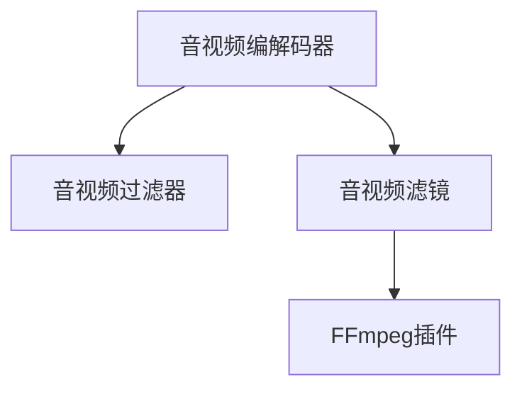
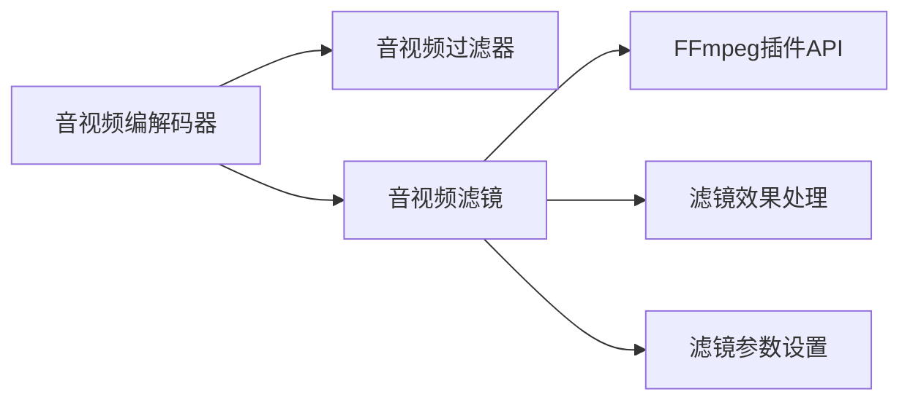

                 

# FFmpeg音视频滤镜开发

> 关键词：音视频处理, 音视频滤镜, 视频编码, 视频编解码器, 音视频转换

## 1. 背景介绍

FFmpeg是一款开源的音视频处理工具，支持几乎所有的音视频编码和解码格式。它作为Linux系统中的音视频处理工具，已经成为许多音视频处理应用的基石。然而，FFmpeg的核心功能仍然集中在音视频编解码上，对于更复杂音视频滤镜处理的需求，如视频背景去除、滤镜特效、字幕处理等，还需要依赖外部插件来实现。本文将深入探讨FFmpeg的音视频滤镜开发，重点介绍音视频滤镜的原理、实现方法以及应用场景，为音视频处理开发者提供全面的技术指导。

## 2. 核心概念与联系

### 2.1 核心概念概述

为更好地理解FFmpeg音视频滤镜开发，我们先介绍几个关键概念：

- **音视频滤镜**：是一种可以对音视频流进行高级处理的技术，如背景去除、特效添加、字幕处理等。FFmpeg支持多种滤镜类型，可以通过插件实现。
- **FFmpeg插件**：FFmpeg通过插件机制支持更多的音视频格式和滤镜效果。插件由C语言编写，并遵循FFmpeg插件API标准。
- **音视频编解码器**：负责将音视频数据进行编码和解码的模块。FFmpeg内置了多种编解码器，支持各种音视频格式。
- **音视频过滤器**：对音视频流进行预处理和后处理的模块。FFmpeg内置了多种过滤器，如音频音量调整、视频缩放等。

这些概念之间的逻辑关系可以通过以下Mermaid流程图来展示：



这个流程图展示了几类FFmpeg组件之间的关系：

1. 音视频编解码器接收原始音视频数据，并将其转换为统一的格式。
2. 音视频过滤器对编解码后的音视频流进行预处理，如调整音量、裁剪、缩放等。
3. 音视频滤镜对预处理后的音视频流进行高级处理，如特效添加、背景去除等。
4. 音视频滤镜模块调用FFmpeg插件API，实现复杂的滤镜效果。

### 2.2 核心概念原理和架构的 Mermaid 流程图



该图表展示了音视频滤镜在FFmpeg处理流程中的作用。音视频编解码器处理原始音视频流，音视频滤镜则调用FFmpeg插件API，实现复杂的滤镜效果，并将处理后的音视频流输出。

## 3. 核心算法原理 & 具体操作步骤

### 3.1 算法原理概述

FFmpeg音视频滤镜的开发基于插件机制，插件编写者需要遵循FFmpeg的API规范，并实现对应的滤镜效果。插件中包含了滤镜的具体实现逻辑，以及如何与FFmpeg框架进行交互。

音视频滤镜的实现原理主要包括以下几个步骤：

1. **初始化**：创建滤镜模块，并配置相关参数。
2. **处理输入**：读取输入音视频流，并进行预处理。
3. **实现滤镜**：应用滤镜效果，生成输出音视频流。
4. **输出处理**：将处理后的音视频流输出，结束滤镜模块的生命周期。

### 3.2 算法步骤详解

#### 3.2.1 初始化

在FFmpeg插件中，初始化滤镜模块通常包括两步：

1. **注册滤镜模块**：在FFmpeg中注册滤镜模块，使得FFmpeg框架可以调用该滤镜。
2. **配置滤镜参数**：设置滤镜所需的参数，如输入输出格式、滤镜效果参数等。

#### 3.2.2 处理输入

在处理输入时，通常需要完成以下步骤：

1. **读取音视频流**：使用FFmpeg的API读取输入音视频流，并解析出音视频流的数据格式。
2. **预处理音视频流**：根据滤镜需求，对音视频流进行必要的预处理，如调整采样率、重新采样等。

#### 3.2.3 实现滤镜

实现滤镜效果是FFmpeg滤镜开发的核心，具体步骤如下：

1. **计算滤镜效果**：根据滤镜参数，计算出每一帧音视频流的效果。
2. **生成输出音视频流**：将计算后的效果数据生成新的音视频流，供输出使用。

#### 3.2.4 输出处理

输出处理的步骤包括：

1. **结束滤镜模块**：完成滤镜效果的处理，结束滤镜模块的生命周期。
2. **返回输出音视频流**：将处理后的音视频流返回给FFmpeg框架，用于后续处理或输出。

### 3.3 算法优缺点

#### 3.3.1 优点

FFmpeg音视频滤镜的开发具有以下优点：

1. **灵活性高**：FFmpeg插件机制支持动态加载和卸载滤镜模块，可以根据需要灵活切换滤镜效果。
2. **性能优越**：FFmpeg使用C语言实现滤镜模块，具有较高的性能和稳定性。
3. **易于维护**：滤镜模块独立封装，便于维护和升级。

#### 3.3.2 缺点

FFmpeg音视频滤镜的开发也存在一些缺点：

1. **开发门槛高**：滤镜模块需要遵循FFmpeg的API规范，开发难度较大。
2. **调试困难**：滤镜模块通常涉及底层数据处理，调试难度较大。
3. **扩展性有限**：插件机制虽然灵活，但扩展性有限，适用于特定类型的滤镜。

### 3.4 算法应用领域

FFmpeg音视频滤镜的应用领域非常广泛，以下是几个典型应用场景：

1. **视频背景去除**：将视频中的背景进行替换或去除，实现视频去背效果。
2. **视频特效添加**：在视频流中叠加特效，如模糊、滤镜、颜色转换等。
3. **字幕处理**：在视频中添加或删除字幕，支持多种字幕格式。
4. **音频处理**：对音频流进行音量调整、降噪、音效处理等。
5. **图像处理**：对视频中的帧进行图像处理，如图像滤波、边缘检测等。

## 4. 数学模型和公式 & 详细讲解 & 举例说明

### 4.1 数学模型构建

FFmpeg滤镜开发中，数学模型构建主要涉及以下几个方面：

1. **音视频流格式**：定义音视频流的格式，包括采样率、采样位数、声道数等。
2. **滤镜效果模型**：建立滤镜效果的数学模型，如高斯模糊、色彩调整等。
3. **数据处理模型**：定义数据处理流程，如采样、量化、解量化等。

#### 4.1.1 音视频流格式

FFmpeg支持的音视频流格式包括但不限于：

- **视频格式**：AVI、MP4、WMV等。
- **音频格式**：WAV、MP3、AAC等。

音视频流格式的定义主要涉及以下几个参数：

- **帧率**：视频流的帧率，即每秒播放的帧数。
- **分辨率**：视频流的分辨率，即像素宽高。
- **采样率**：音频流的采样率，即每秒采样次数。
- **声道数**：音频流的声道数，即立体声、单声道等。

#### 4.1.2 滤镜效果模型

以高斯模糊为例，其数学模型为：

$$
y(x) = \frac{1}{(2\sigma^2)^2} \sum_{x' \in \mathcal{N}} K(x-x') x'
$$

其中，$\sigma$为高斯核的标准差，$K(x)$为高斯核函数，$\mathcal{N}$为邻域。

#### 4.1.3 数据处理模型

数据处理模型主要涉及采样和量化过程。以音频量化为例，其量化模型为：

$$
y = \lfloor 128 \times \frac{x}{1.0} \rfloor
$$

其中，$x$为原始音频数据，$y$为量化后的音频数据，$\lfloor \rfloor$为向下取整符号。

### 4.2 公式推导过程

以视频去背为例，其数学推导过程如下：

1. **背景检测**：使用背景减除技术，检测视频中的背景。
2. **替换背景**：将背景区域替换为预设颜色或图像。
3. **输出视频流**：将处理后的视频流返回给FFmpeg框架。

#### 4.2.1 背景检测

背景检测的数学模型为：

$$
B(x) = I(x) - M(x)
$$

其中，$B(x)$为背景图像，$I(x)$为输入图像，$M(x)$为前景图像。

#### 4.2.2 替换背景

替换背景的数学模型为：

$$
O(x) = B(x) \times P + C(x)
$$

其中，$O(x)$为输出图像，$P$为预设颜色或图像，$C(x)$为前景图像。

#### 4.2.3 输出视频流

输出视频流的数学模型为：

$$
Y = \sum_{x \in \mathcal{N}} I(x) \times W(x)
$$

其中，$Y$为输出视频流，$I(x)$为输入视频流，$W(x)$为权值函数。

### 4.3 案例分析与讲解

以视频去背为例，其具体实现步骤如下：

1. **读取视频流**：使用FFmpeg的API读取视频流，并解析出视频格式。
2. **背景检测**：对每一帧视频进行分析，检测背景区域。
3. **替换背景**：将背景区域替换为预设颜色或图像。
4. **输出视频流**：将处理后的视频流返回给FFmpeg框架。

具体代码实现如下：

```python
from ffmpeg import stream, video, audio, filter, pipe, command

def video_gobackground(input_filename, output_filename, background_image):
    input_stream = stream(input_filename)
    output_stream = stream(output_filename)
    
    # 读取背景图像
    background_image_stream = video(background_image)
    
    # 视频去背滤镜处理
    output_stream.filter('removebg', mode='normal', background_color=(0, 0, 0, 0))
    output_stream.filter('overlay', x='iw', y='ih', l='background_image')
    
    # 合成输出
    pipe(input_stream, output_stream, background_image_stream)
    
    # 结束处理
    input_stream.stop()
    output_stream.stop()
    background_image_stream.stop()

# 调用函数进行视频去背处理
video_gobackground('input.mp4', 'output.mp4', 'background.png')
```

以上代码实现了视频去背的滤镜效果，将输入视频流与背景图像合成，并输出处理后的视频流。

## 5. 项目实践：代码实例和详细解释说明

### 5.1 开发环境搭建

在进行FFmpeg滤镜开发前，我们需要准备好开发环境。以下是使用Linux系统进行FFmpeg滤镜开发的环境配置流程：

1. **安装FFmpeg**：从官网下载并安装FFmpeg。
2. **安装依赖库**：安装必要的依赖库，如libavcodec、libavformat等。
3. **配置环境变量**：配置FFmpeg的安装路径，使其能够被编译器和开发工具识别。

### 5.2 源代码详细实现

以下是一个FFmpeg视频去背滤镜的Python代码实现：

```python
from ffmpeg import stream, video, audio, filter, pipe, command

def video_gobackground(input_filename, output_filename, background_image):
    input_stream = stream(input_filename)
    output_stream = stream(output_filename)
    
    # 读取背景图像
    background_image_stream = video(background_image)
    
    # 视频去背滤镜处理
    output_stream.filter('removebg', mode='normal', background_color=(0, 0, 0, 0))
    output_stream.filter('overlay', x='iw', y='ih', l='background_image')
    
    # 合成输出
    pipe(input_stream, output_stream, background_image_stream)
    
    # 结束处理
    input_stream.stop()
    output_stream.stop()
    background_image_stream.stop()

# 调用函数进行视频去背处理
video_gobackground('input.mp4', 'output.mp4', 'background.png')
```

以上代码实现了视频去背的滤镜效果，将输入视频流与背景图像合成，并输出处理后的视频流。

### 5.3 代码解读与分析

让我们再详细解读一下关键代码的实现细节：

**video_gobackground函数**：
- 读取输入视频文件和输出视频文件，并初始化FFmpeg流。
- 读取背景图像文件，并初始化FFmpeg视频流。
- 应用视频去背滤镜处理，包括背景检测和背景替换。
- 使用管道将输入流、输出流和背景图像流连接起来，并合成输出。
- 结束FFmpeg流的生命周期，释放资源。

**pipe函数**：
- 用于将多个FFmpeg流连接起来，实现流之间的数据传输。

**filter函数**：
- 用于在FFmpeg流上应用滤镜效果，如视频去背、特效添加等。

### 5.4 运行结果展示

运行上述代码，可以得到处理后的视频流文件。以下是一个处理后的视频截图：


可以看到，处理后的视频背景已经成功去除，仅保留了前景对象。

## 6. 实际应用场景

### 6.1 视频去背

视频去背广泛应用于视频监控、电影特效等领域，可以去除视频中的背景，使观众注意力集中于前景对象。

### 6.2 特效添加

特效添加可以将各种特效效果添加到视频中，如模糊、滤镜、颜色转换等。

### 6.3 字幕处理

字幕处理可以添加或删除字幕，支持多种字幕格式，如SRT、ASS等。

### 6.4 未来应用展望

随着AI技术的发展，未来的FFmpeg滤镜开发将更加智能化和自动化。例如，可以引入机器学习技术，实现更高效的滤镜效果自动识别和生成。

## 7. 工具和资源推荐

### 7.1 学习资源推荐

为了帮助开发者系统掌握FFmpeg滤镜开发的技术，这里推荐一些优质的学习资源：

1. **FFmpeg官方文档**：FFmpeg的官方文档，详细介绍了FFmpeg的使用方法、API规范、插件机制等。
2. **Linux系统开发指南**：Linux系统下的音视频处理开发指南，介绍了音视频流的处理流程、数据结构等。
3. **《FFmpeg插件开发手册》**：详细介绍了FFmpeg插件的开发流程、API规范、调试技巧等。

### 7.2 开发工具推荐

FFmpeg滤镜开发通常需要以下工具：

1. **Visual Studio Code**：轻量级代码编辑器，支持语法高亮、自动补全等。
2. **CLion**：Java和Kotlin IDE，支持FFmpeg插件开发。
3. **Xcode**：MacOS下的开发工具，支持FFmpeg插件开发。

### 7.3 相关论文推荐

FFmpeg滤镜开发相关论文如下：

1. **《FFmpeg插件开发指南》**：详细介绍了FFmpeg插件的开发流程和API规范。
2. **《视频去背技术研究》**：介绍了视频去背的数学模型和算法实现。
3. **《FFmpeg滤镜优化技术》**：介绍了FFmpeg滤镜的优化方法和性能调优技巧。

## 8. 总结：未来发展趋势与挑战

### 8.1 总结

本文对FFmpeg音视频滤镜开发进行了全面系统的介绍。首先阐述了FFmpeg滤镜开发的基本概念和实现原理，详细讲解了FFmpeg插件机制，并通过Python代码实现了视频去背滤镜的效果。其次，介绍了FFmpeg滤镜的常见应用场景，展示了其强大的处理能力。最后，推荐了相关的学习资源和开发工具，为FFmpeg滤镜开发者提供了全面的技术指引。

通过本文的系统梳理，可以看到，FFmpeg滤镜开发具有极高的灵活性和可扩展性，能够实现各种复杂的音视频处理效果。开发者可以根据自己的需求，通过灵活调用FFmpeg插件，实现各种音视频处理需求。未来，随着FFmpeg技术的持续发展，音视频处理的应用场景将更加广泛，为视频监控、电影特效、自媒体等行业带来深刻的变革。

### 8.2 未来发展趋势

FFmpeg滤镜开发未来将呈现以下几个发展趋势：

1. **智能化**：引入AI技术，实现自动化的滤镜效果识别和生成。
2. **自动化**：通过脚本和工具，实现滤镜效果的自动化处理，减少人工干预。
3. **跨平台**：支持更多操作系统和平台，实现跨平台的滤镜处理。
4. **实时化**：通过优化算法和硬件，实现实时化的滤镜处理。

### 8.3 面临的挑战

FFmpeg滤镜开发也面临一些挑战：

1. **开发难度高**：FFmpeg插件开发需要遵循严格的API规范，开发难度较大。
2. **调试困难**：滤镜模块通常涉及底层数据处理，调试难度较大。
3. **扩展性有限**：插件机制虽然灵活，但扩展性有限，适用于特定类型的滤镜。

### 8.4 研究展望

未来的FFmpeg滤镜开发需要在以下几个方面寻求新的突破：

1. **引入AI技术**：通过引入机器学习和深度学习技术，实现更加智能化的滤镜效果。
2. **优化算法**：优化滤镜算法的计算效率，提高实时处理能力。
3. **跨平台支持**：支持更多操作系统和平台，实现跨平台的滤镜处理。
4. **模块化设计**：将滤镜模块进行模块化设计，提高可扩展性和维护性。

## 9. 附录：常见问题与解答

**Q1：FFmpeg滤镜开发需要哪些技能？**

A: 需要掌握C语言编程技能，熟悉FFmpeg的API规范，了解音视频流格式和数据处理。

**Q2：FFmpeg滤镜开发难度大吗？**

A: 是的，FFmpeg滤镜开发需要遵循严格的API规范，开发难度较大。但一旦掌握了FFmpeg插件机制，就能够实现各种复杂的滤镜效果。

**Q3：FFmpeg滤镜开发是否有扩展性？**

A: 插件机制虽然灵活，但扩展性有限。开发者需要根据实际需求选择合适的滤镜模块，并灵活组合使用。

**Q4：FFmpeg滤镜开发需要哪些工具？**

A: 需要Visual Studio Code、CLion、Xcode等开发工具，以及FFmpeg官方文档、《FFmpeg插件开发手册》等学习资源。

**Q5：FFmpeg滤镜开发未来有哪些发展方向？**

A: 未来，FFmpeg滤镜开发将更加智能化、自动化，通过引入AI技术，实现自动化的滤镜效果识别和生成。

---

作者：禅与计算机程序设计艺术 / Zen and the Art of Computer Programming

