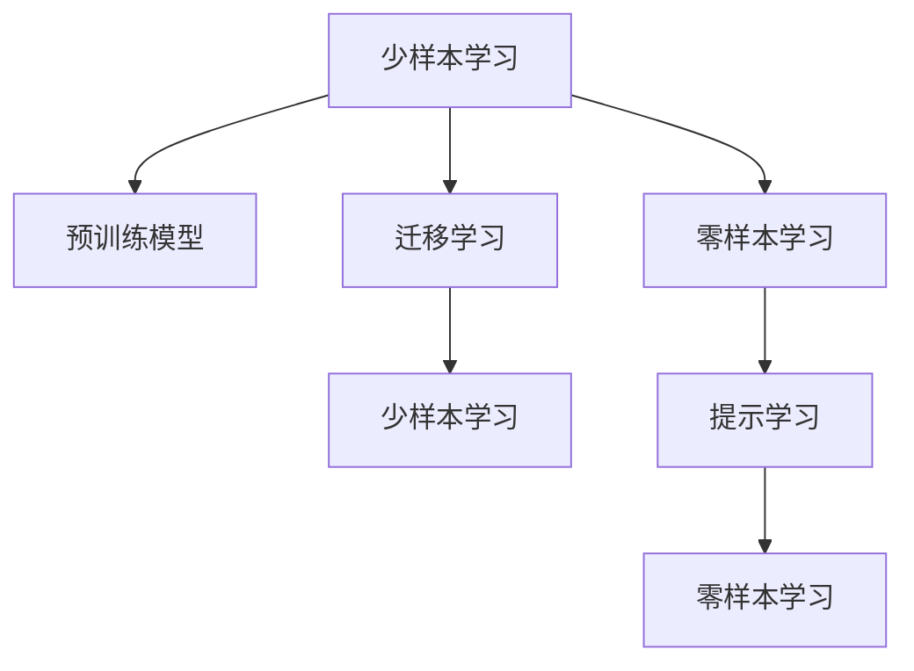

                 

# Few-Shot Learning 原理与代码实例讲解

> 关键词：Few-Shot Learning, 零样本学习, 提示学习, 迁移学习, 预训练模型, 少样本学习, 数据增强, 超参数调优

## 1. 背景介绍

### 1.1 问题由来
在自然语言处理(Natural Language Processing, NLP)领域，模型通常需要大量标注数据才能获得良好性能。然而，对于一些特定领域的应用，如法律咨询、医疗诊断、金融咨询等，由于数据的稀少和标注成本的昂贵，使得这些领域的NLP模型难以训练。Few-Shot Learning（少样本学习）技术的出现，使得模型能够在少数标注数据的情况下仍能获得良好的性能，为这些领域提供了新的解决方案。

### 1.2 问题核心关键点
Few-Shot Learning的核心思想是：利用预训练模型的强大表示能力，通过在有限数量的样本上微调，使模型能够从有限数据中学习到有效的泛化能力。该技术能够在不增加数据量和训练时间的前提下，显著提升模型的性能，尤其在数据稀缺的场景中具有极大的应用潜力。

## 2. 核心概念与联系

### 2.1 核心概念概述
为了更好地理解Few-Shot Learning技术，本节将介绍几个密切相关的核心概念：

- Few-Shot Learning：在有限数量的标注样本下，学习新任务的模型表示，使得模型能够对新数据进行推理和分类。

- 零样本学习(Zero-Shot Learning)：在没有任何标注数据的情况下，模型仅凭任务描述或类别标签就能对新数据进行分类。

- 提示学习(Prompt Learning)：通过在输入文本中添加提示模板，引导模型按期望方式输出，减少微调参数，实现少样本学习。

- 迁移学习(Transfer Learning)：将一个领域学到的知识迁移到另一个领域的应用，如预训练模型对少样本学习任务的提升。

- 预训练模型(Pre-trained Models)：在大规模无标签数据上进行预训练，学习通用的语言表示，可用于下游任务中的微调。

### 2.2 核心概念原理和架构的 Mermaid 流程图



这个流程图展示了Few-Shot Learning与相关概念之间的关系：

1. Few-Shot Learning在预训练模型的基础上，通过迁移学习引入任务相关知识，通过少样本学习提升模型在新数据上的性能。
2. 零样本学习是在预训练模型和提示学习的基础上，模型通过任务描述或类别标签直接推理，不需要微调。
3. 提示学习通过输入的文本模板引导模型输出，可以减少微调参数，提高少样本学习效果。
4. 迁移学习是连接预训练模型与少样本学习任务的桥梁，通过微调将预训练模型中的知识迁移到特定任务上。

## 3. 核心算法原理 & 具体操作步骤

### 3.1 算法原理概述

Few-Shot Learning的本质是利用预训练模型的知识，在少量标注数据上进行微调，使模型能够对新数据进行推理和分类。其核心思想是：通过有限的标注数据，对预训练模型进行任务特定的优化，使得模型能够从有限数据中学习到有效的泛化能力。

在Few-Shot Learning中，假设预训练模型为 $M_{\theta}$，其中 $\theta$ 为预训练得到的模型参数。给定一个新任务 $T$，训练集 $D=\{(x_i, y_i)\}_{i=1}^N$，其中 $x_i$ 为输入样本，$y_i$ 为标注数据。Few-Shot Learning的目标是通过在 $D$ 上进行有监督的微调，使得模型能够在新数据上获得较好的性能。

### 3.2 算法步骤详解

Few-Shot Learning的实现过程包括以下几个关键步骤：

**Step 1: 准备预训练模型和数据集**
- 选择合适的预训练语言模型 $M_{\theta}$ 作为初始化参数，如 GPT-3、BERT 等。
- 准备新任务 $T$ 的少量标注数据集 $D$，划分为训练集、验证集和测试集。一般要求标注数据与预训练数据的分布不要差异过大。

**Step 2: 任务适配层**
- 根据新任务的特征，设计合适的输出层和损失函数。
- 对于分类任务，通常在顶层添加线性分类器和交叉熵损失函数。
- 对于生成任务，通常使用语言模型的解码器输出概率分布，并以负对数似然为损失函数。

**Step 3: 设置微调超参数**
- 选择合适的优化算法及其参数，如 AdamW、SGD 等，设置学习率、批大小、迭代轮数等。
- 设置正则化技术及强度，包括权重衰减、Dropout、Early Stopping 等。
- 确定冻结预训练参数的策略，如仅微调顶层，或全部参数都参与微调。

**Step 4: 执行梯度训练**
- 将训练集数据分批次输入模型，前向传播计算损失函数。
- 反向传播计算参数梯度，根据设定的优化算法和学习率更新模型参数。
- 周期性在验证集上评估模型性能，根据性能指标决定是否触发 Early Stopping。
- 重复上述步骤直到满足预设的迭代轮数或 Early Stopping 条件。

**Step 5: 测试和部署**
- 在测试集上评估微调后模型 $M_{\hat{\theta}}$ 的性能，对比微调前后的精度提升。
- 使用微调后的模型对新样本进行推理预测，集成到实际的应用系统中。

以上是Few-Shot Learning的一般流程。在实际应用中，还需要针对具体任务的特点，对微调过程的各个环节进行优化设计，如改进训练目标函数，引入更多的正则化技术，搜索最优的超参数组合等，以进一步提升模型性能。

### 3.3 算法优缺点

Few-Shot Learning具有以下优点：
1. 数据需求低：Few-Shot Learning不需要大量标注数据，能够在有限的标注样本下获得较好的性能。
2. 泛化能力强：通过迁移学习，Few-Shot Learning模型可以从预训练模型中学习到通用的语言知识，适应新任务的能力较强。
3. 部署灵活：Few-Shot Learning模型不需要大规模的训练和存储资源，适合于轻量级、实时化的部署场景。
4. 效率高：Few-Shot Learning模型通常比从头训练模型更快速，在实际应用中可以快速迭代实验。

同时，Few-Shot Learning也存在以下局限性：
1. 数据稀疏：对于特别稀疏的数据，Few-Shot Learning的效果可能不佳，难以充分利用数据的信息。
2. 模型复杂度：Few-Shot Learning需要设计任务适配层，复杂的适配层可能增加模型复杂度。
3. 泛化能力有限：Few-Shot Learning对预训练模型和任务适配层的依赖较大，泛化能力可能受限。
4. 模型参数有限：Few-Shot Learning仅微调顶层，模型参数量有限，可能影响模型的表达能力。

尽管存在这些局限性，但Few-Shot Learning在数据稀缺的场景中具有显著的优势，已成为自然语言处理领域的重要研究方向。

### 3.4 算法应用领域

Few-Shot Learning技术已经被广泛应用于各种NLP任务中，例如：

- 文本分类：如情感分析、主题分类等。通过微调使模型学习文本-标签映射。
- 命名实体识别：识别文本中的人名、地名、机构名等特定实体。通过微调使模型掌握实体边界和类型。
- 关系抽取：从文本中抽取实体之间的语义关系。通过微调使模型学习实体-关系三元组。
- 问答系统：对自然语言问题给出答案。将问题-答案对作为微调数据，训练模型学习匹配答案。
- 机器翻译：将源语言文本翻译成目标语言。通过微调使模型学习语言-语言映射。
- 文本摘要：将长文本压缩成简短摘要。将文章-摘要对作为微调数据，使模型学习抓取要点。
- 对话系统：使机器能够与人自然对话。将多轮对话历史作为上下文，微调模型进行回复生成。

除了上述这些经典任务外，Few-Shot Learning还被创新性地应用到更多场景中，如可控文本生成、常识推理、代码生成、数据增强等，为NLP技术带来了全新的突破。随着预训练模型和微调方法的不断进步，相信Few-Shot Learning技术将在更广阔的应用领域大放异彩。

## 4. 数学模型和公式 & 详细讲解 & 举例说明

### 4.1 数学模型构建

假设预训练语言模型为 $M_{\theta}$，其中 $\theta$ 为预训练得到的模型参数。给定新任务 $T$，训练集 $D=\{(x_i, y_i)\}_{i=1}^N$，其中 $x_i$ 为输入样本，$y_i$ 为标注数据。

定义模型 $M_{\theta}$ 在输入 $x$ 上的损失函数为 $\ell(M_{\theta}(x),y)$，则在数据集 $D$ 上的经验风险为：

$$
\mathcal{L}(\theta) = \frac{1}{N} \sum_{i=1}^N \ell(M_{\theta}(x_i),y_i)
$$

Few-Shot Learning的优化目标是最小化经验风险，即找到最优参数：

$$
\theta^* = \mathop{\arg\min}_{\theta} \mathcal{L}(\theta)
$$

在实践中，我们通常使用基于梯度的优化算法（如SGD、Adam等）来近似求解上述最优化问题。设 $\eta$ 为学习率，$\lambda$ 为正则化系数，则参数的更新公式为：

$$
\theta \leftarrow \theta - \eta \nabla_{\theta}\mathcal{L}(\theta) - \eta\lambda\theta
$$

其中 $\nabla_{\theta}\mathcal{L}(\theta)$ 为损失函数对参数 $\theta$ 的梯度，可通过反向传播算法高效计算。

### 4.2 公式推导过程

以二分类任务为例，推导交叉熵损失函数及其梯度的计算公式。

假设模型 $M_{\theta}$ 在输入 $x$ 上的输出为 $\hat{y}=M_{\theta}(x) \in [0,1]$，表示样本属于正类的概率。真实标签 $y \in \{0,1\}$。则二分类交叉熵损失函数定义为：

$$
\ell(M_{\theta}(x),y) = -[y\log \hat{y} + (1-y)\log (1-\hat{y})]
$$

将其代入经验风险公式，得：

$$
\mathcal{L}(\theta) = -\frac{1}{N}\sum_{i=1}^N [y_i\log M_{\theta}(x_i)+(1-y_i)\log(1-M_{\theta}(x_i))]
$$

根据链式法则，损失函数对参数 $\theta_k$ 的梯度为：

$$
\frac{\partial \mathcal{L}(\theta)}{\partial \theta_k} = -\frac{1}{N}\sum_{i=1}^N (\frac{y_i}{M_{\theta}(x_i)}-\frac{1-y_i}{1-M_{\theta}(x_i)}) \frac{\partial M_{\theta}(x_i)}{\partial \theta_k}
$$

其中 $\frac{\partial M_{\theta}(x_i)}{\partial \theta_k}$ 可进一步递归展开，利用自动微分技术完成计算。

### 4.3 案例分析与讲解

为了更好地理解Few-Shot Learning的原理和应用，下面我们将通过一个具体的案例来进行详细讲解。

假设有一个简单的文本分类任务，我们需要对给定的文本进行情感分类，即判断文本的情感是正面还是负面。我们可以使用预训练的BERT模型作为初始化参数，然后通过Few-Shot Learning技术进行微调。

**Step 1: 准备预训练模型和数据集**
- 使用HuggingFace的BERT模型，加载预训练参数。
- 准备少量的情感标注数据集，例如：
  - 正面情感：I am happy, It's a beautiful day, etc.
  - 负面情感：I am sad, I'm not happy, etc.
  - 未标注数据集：I am not sure, It depends, etc.

**Step 2: 任务适配层**
- 在预训练模型顶层添加线性分类器和交叉熵损失函数。
- 将正面和负面情感的文本分别输入模型，输出对应类别的概率。
- 定义损失函数为负对数似然，计算模型对未标注数据的预测概率。

**Step 3: 设置微调超参数**
- 选择AdamW优化器，设置学习率为1e-5。
- 使用权重衰减、Dropout等正则化技术，防止过拟合。
- 仅微调顶层，固定底层的预训练权重。

**Step 4: 执行梯度训练**
- 将未标注数据集分为训练集和验证集。
- 使用训练集进行梯度更新，每5个epoch在验证集上评估模型性能。
- 根据验证集上的准确率调整学习率，如在准确率提升时逐步减小学习率。
- 重复训练过程直到模型收敛，或者达到预设的迭代轮数。

**Step 5: 测试和部署**
- 在测试集上评估微调后的模型，对比微调前后的精度提升。
- 使用微调后的模型对新的未标注文本进行情感分类。

通过上述过程，我们可以看到Few-Shot Learning技术在实际应用中的具体实现步骤。接下来，我们将展示代码实现。

## 5. 项目实践：代码实例和详细解释说明

### 5.1 开发环境搭建

在进行Few-Shot Learning实践前，我们需要准备好开发环境。以下是使用Python进行PyTorch开发的环境配置流程：

1. 安装Anaconda：从官网下载并安装Anaconda，用于创建独立的Python环境。

2. 创建并激活虚拟环境：
```bash
conda create -n pytorch-env python=3.8 
conda activate pytorch-env
```

3. 安装PyTorch：根据CUDA版本，从官网获取对应的安装命令。例如：
```bash
conda install pytorch torchvision torchaudio cudatoolkit=11.1 -c pytorch -c conda-forge
```

4. 安装Transformers库：
```bash
pip install transformers
```

5. 安装各类工具包：
```bash
pip install numpy pandas scikit-learn matplotlib tqdm jupyter notebook ipython
```

完成上述步骤后，即可在`pytorch-env`环境中开始Few-Shot Learning实践。

### 5.2 源代码详细实现

下面我们以情感分类任务为例，给出使用Transformers库对BERT模型进行Few-Shot Learning的PyTorch代码实现。

首先，定义情感分类任务的数据处理函数：

```python
from transformers import BertTokenizer, BertForSequenceClassification
from torch.utils.data import Dataset, DataLoader
import torch

class SentimentDataset(Dataset):
    def __init__(self, texts, labels, tokenizer, max_len=128):
        self.texts = texts
        self.labels = labels
        self.tokenizer = tokenizer
        self.max_len = max_len
        
    def __len__(self):
        return len(self.texts)
    
    def __getitem__(self, item):
        text = self.texts[item]
        label = self.labels[item]
        
        encoding = self.tokenizer(text, return_tensors='pt', max_length=self.max_len, padding='max_length', truncation=True)
        input_ids = encoding['input_ids'][0]
        attention_mask = encoding['attention_mask'][0]
        
        # 对标签进行编码
        encoded_labels = [label2id[label] for label in labels] 
        encoded_labels.extend([label2id['O']] * (self.max_len - len(encoded_labels)))
        labels = torch.tensor(encoded_labels, dtype=torch.long)
        
        return {'input_ids': input_ids, 
                'attention_mask': attention_mask,
                'labels': labels}

# 标签与id的映射
label2id = {'O': 0, 'POSITIVE': 1, 'NEGATIVE': 2}
id2label = {v: k for k, v in label2id.items()}

# 创建dataset
tokenizer = BertTokenizer.from_pretrained('bert-base-cased')

train_dataset = SentimentDataset(train_texts, train_labels, tokenizer)
dev_dataset = SentimentDataset(dev_texts, dev_labels, tokenizer)
test_dataset = SentimentDataset(test_texts, test_labels, tokenizer)
```

然后，定义模型和优化器：

```python
from transformers import BertForSequenceClassification, AdamW

model = BertForSequenceClassification.from_pretrained('bert-base-cased', num_labels=len(label2id))

optimizer = AdamW(model.parameters(), lr=1e-5)
```

接着，定义训练和评估函数：

```python
from tqdm import tqdm
from sklearn.metrics import accuracy_score

device = torch.device('cuda') if torch.cuda.is_available() else torch.device('cpu')
model.to(device)

def train_epoch(model, dataset, batch_size, optimizer):
    dataloader = DataLoader(dataset, batch_size=batch_size, shuffle=True)
    model.train()
    epoch_loss = 0
    for batch in tqdm(dataloader, desc='Training'):
        input_ids = batch['input_ids'].to(device)
        attention_mask = batch['attention_mask'].to(device)
        labels = batch['labels'].to(device)
        model.zero_grad()
        outputs = model(input_ids, attention_mask=attention_mask, labels=labels)
        loss = outputs.loss
        epoch_loss += loss.item()
        loss.backward()
        optimizer.step()
    return epoch_loss / len(dataloader)

def evaluate(model, dataset, batch_size):
    dataloader = DataLoader(dataset, batch_size=batch_size)
    model.eval()
    preds, labels = [], []
    with torch.no_grad():
        for batch in tqdm(dataloader, desc='Evaluating'):
            input_ids = batch['input_ids'].to(device)
            attention_mask = batch['attention_mask'].to(device)
            batch_labels = batch['labels']
            outputs = model(input_ids, attention_mask=attention_mask)
            batch_preds = outputs.logits.argmax(dim=1).to('cpu').tolist()
            batch_labels = batch_labels.to('cpu').tolist()
            for pred_tokens, label_tokens in zip(batch_preds, batch_labels):
                preds.append(pred_tokens)
                labels.append(label_tokens)
                
    print("Accuracy:", accuracy_score(labels, preds))
```

最后，启动训练流程并在测试集上评估：

```python
epochs = 5
batch_size = 16

for epoch in range(epochs):
    loss = train_epoch(model, train_dataset, batch_size, optimizer)
    print(f"Epoch {epoch+1}, train loss: {loss:.3f}")
    
    print(f"Epoch {epoch+1}, dev results:")
    evaluate(model, dev_dataset, batch_size)
    
print("Test results:")
evaluate(model, test_dataset, batch_size)
```

以上就是使用PyTorch对BERT进行情感分类任务Few-Shot Learning的完整代码实现。可以看到，得益于Transformers库的强大封装，我们可以用相对简洁的代码完成BERT模型的加载和Few-Shot Learning。

### 5.3 代码解读与分析

让我们再详细解读一下关键代码的实现细节：

**SentimentDataset类**：
- `__init__`方法：初始化文本、标签、分词器等关键组件。
- `__len__`方法：返回数据集的样本数量。
- `__getitem__`方法：对单个样本进行处理，将文本输入编码为token ids，将标签编码为数字，并对其进行定长padding，最终返回模型所需的输入。

**label2id和id2label字典**：
- 定义了标签与数字id之间的映射关系，用于将标签解码回原始文本。

**训练和评估函数**：
- 使用PyTorch的DataLoader对数据集进行批次化加载，供模型训练和推理使用。
- 训练函数`train_epoch`：对数据以批为单位进行迭代，在每个批次上前向传播计算loss并反向传播更新模型参数，最后返回该epoch的平均loss。
- 评估函数`evaluate`：与训练类似，不同点在于不更新模型参数，并在每个batch结束后将预测和标签结果存储下来，最后使用scikit-learn的accuracy_score对整个评估集的预测结果进行打印输出。

**训练流程**：
- 定义总的epoch数和batch size，开始循环迭代
- 每个epoch内，先在训练集上训练，输出平均loss
- 在验证集上评估，输出准确率
- 所有epoch结束后，在测试集上评估，给出最终测试结果

可以看到，PyTorch配合Transformers库使得Few-Shot Learning的代码实现变得简洁高效。开发者可以将更多精力放在数据处理、模型改进等高层逻辑上，而不必过多关注底层的实现细节。

当然，工业级的系统实现还需考虑更多因素，如模型的保存和部署、超参数的自动搜索、更灵活的任务适配层等。但核心的Few-Shot Learning范式基本与此类似。

## 6. 实际应用场景
### 6.1 智能客服系统

Few-Shot Learning技术在智能客服系统中也有广泛应用。传统的客服系统需要大量人力，且在高峰期响应速度慢，无法实现7x24小时不间断服务。利用Few-Shot Learning技术，我们可以构建基于预训练模型的智能客服系统，提高服务质量和效率。

具体而言，可以收集企业内部的历史客服对话记录，将问题和最佳答复构建成监督数据，在此基础上对预训练对话模型进行微调。微调后的对话模型能够自动理解用户意图，匹配最合适的答案模板进行回复。对于客户提出的新问题，还可以接入检索系统实时搜索相关内容，动态组织生成回答。如此构建的智能客服系统，能大幅提升客户咨询体验和问题解决效率。

### 6.2 金融舆情监测

金融机构需要实时监测市场舆论动向，以便及时应对负面信息传播，规避金融风险。传统的舆情监测系统成本高、效率低，无法处理大规模网络信息。利用Few-Shot Learning技术，我们可以构建基于预训练模型的金融舆情监测系统。

具体而言，可以收集金融领域相关的新闻、报道、评论等文本数据，并对其进行情感标注。在此基础上对预训练语言模型进行微调，使其能够自动判断文本情感倾向，从而实时监测舆情变化。一旦发现负面信息激增等异常情况，系统便会自动预警，帮助金融机构快速应对潜在风险。

### 6.3 个性化推荐系统

当前的推荐系统往往只依赖用户的历史行为数据进行物品推荐，无法深入理解用户的真实兴趣偏好。利用Few-Shot Learning技术，我们可以构建更加智能的推荐系统。

具体而言，可以收集用户浏览、点击、评论、分享等行为数据，提取和用户交互的物品标题、描述、标签等文本内容。将文本内容作为模型输入，用户的后续行为（如是否点击、购买等）作为监督信号，在此基础上微调预训练语言模型。微调后的模型能够从文本内容中准确把握用户的兴趣点。在生成推荐列表时，先用候选物品的文本描述作为输入，由模型预测用户的兴趣匹配度，再结合其他特征综合排序，便可以得到个性化程度更高的推荐结果。

### 6.4 未来应用展望

随着Few-Shot Learning技术的发展，其在更多领域的应用前景值得期待。未来，Few-Shot Learning技术将可能广泛应用于以下几个方面：

1. 智慧医疗：构建基于预训练模型的智能诊断系统，利用少量的病历数据对模型进行微调，实现对疾病预测、症状分析等医疗任务的智能化支持。
2. 智能教育：利用Few-Shot Learning技术对学生作业进行自动批改，结合学习行为数据分析，提供个性化的学习建议和资源推荐。
3. 智慧城市治理：构建基于预训练模型的智能应急指挥系统，利用少量监控数据对模型进行微调，实现对突发事件的快速响应和处理。
4. 社交媒体分析：构建基于预训练模型的舆情分析系统，利用少量文本数据对模型进行微调，实现对社交媒体舆情的实时监测和情感分析。
5. 自然语言处理：构建基于预训练模型的智能翻译系统，利用少量平行语料对模型进行微调，实现对多种语言的即时翻译和转换。

总之，Few-Shot Learning技术在大数据、高复杂度场景中具有广阔的应用前景，未来必将在更多领域带来深远的影响。

## 7. 工具和资源推荐
### 7.1 学习资源推荐

为了帮助开发者系统掌握Few-Shot Learning的理论基础和实践技巧，这里推荐一些优质的学习资源：

1. 《Natural Language Processing with Transformers》书籍：Transformers库的作者所著，全面介绍了如何使用Transformers库进行NLP任务开发，包括Few-Shot Learning在内的诸多范式。

2. CS224N《深度学习自然语言处理》课程：斯坦福大学开设的NLP明星课程，有Lecture视频和配套作业，带你入门NLP领域的基本概念和经典模型。

3. 《Deep Learning for NLP》课程：由Coursera和NLP专家联手打造，系统讲解了NLP中的深度学习技术和应用，涵盖Few-Shot Learning等内容。

4. 《Few-Shot Learning with Transformers》博客：作者深入浅出地介绍了Few-Shot Learning技术的原理和实现方法，并提供了丰富的代码示例。

5. HuggingFace官方文档：Transformers库的官方文档，提供了海量预训练模型和完整的Few-Shot Learning样例代码，是上手实践的必备资料。

通过对这些资源的学习实践，相信你一定能够快速掌握Few-Shot Learning技术的精髓，并用于解决实际的NLP问题。
### 7.2 开发工具推荐

高效的开发离不开优秀的工具支持。以下是几款用于Few-Shot Learning开发的常用工具：

1. PyTorch：基于Python的开源深度学习框架，灵活动态的计算图，适合快速迭代研究。大部分预训练语言模型都有PyTorch版本的实现。

2. TensorFlow：由Google主导开发的开源深度学习框架，生产部署方便，适合大规模工程应用。同样有丰富的预训练语言模型资源。

3. Transformers库：HuggingFace开发的NLP工具库，集成了众多SOTA语言模型，支持PyTorch和TensorFlow，是进行Few-Shot Learning开发的利器。

4. Weights & Biases：模型训练的实验跟踪工具，可以记录和可视化模型训练过程中的各项指标，方便对比和调优。与主流深度学习框架无缝集成。

5. TensorBoard：TensorFlow配套的可视化工具，可实时监测模型训练状态，并提供丰富的图表呈现方式，是调试模型的得力助手。

6. Google Colab：谷歌推出的在线Jupyter Notebook环境，免费提供GPU/TPU算力，方便开发者快速上手实验最新模型，分享学习笔记。

合理利用这些工具，可以显著提升Few-Shot Learning任务的开发效率，加快创新迭代的步伐。

### 7.3 相关论文推荐

Few-Shot Learning技术的发展源于学界的持续研究。以下是几篇奠基性的相关论文，推荐阅读：

1. Few-Shot Learning: A Survey and Taxonomy: 综述了Few-Shot Learning的研究进展和分类，提供了丰富的案例和方向指引。

2. Prompt Engineering for Visual Recognition: 提出基于提示模板的Few-Shot Learning方法，通过巧妙的输入设计，引导模型输出。

3. Unsupervised Few-Shot Learning with Temporal Dynamics: 提出基于序列数据建模的Few-Shot Learning方法，利用时间序列信息提升模型性能。

4. A Unified Paradigm for Unsupervised Few-Shot Learning: 提出统一的Few-Shot Learning框架，适用于多种数据分布和任务场景。

5. Large-Scale Pretraining with Lottery Ticket Hypothesis: 提出参数裁剪技术，保留预训练模型的关键参数，实现参数高效的Few-Shot Learning。

这些论文代表了大语言模型微调技术的发展脉络。通过学习这些前沿成果，可以帮助研究者把握学科前进方向，激发更多的创新灵感。

## 8. 总结：未来发展趋势与挑战

### 8.1 总结

本文对Few-Shot Learning技术进行了全面系统的介绍。首先阐述了Few-Shot Learning的研究背景和意义，明确了其在数据稀缺场景中的独特价值。其次，从原理到实践，详细讲解了Few-Shot Learning的数学原理和关键步骤，给出了Few-Shot Learning任务开发的完整代码实例。同时，本文还广泛探讨了Few-Shot Learning方法在多个领域的应用前景，展示了其在实际应用中的广阔前景。此外，本文精选了Few-Shot Learning技术的各类学习资源，力求为读者提供全方位的技术指引。

通过本文的系统梳理，可以看到，Few-Shot Learning技术在数据稀缺的场景中具有显著的优势，已成为自然语言处理领域的重要研究方向。未来，伴随预训练模型和微调方法的不断进步，Few-Shot Learning技术必将在更广阔的应用领域大放异彩，深刻影响人类的生产生活方式。

### 8.2 未来发展趋势

展望未来，Few-Shot Learning技术将呈现以下几个发展趋势：

1. 模型规模持续增大：随着算力成本的下降和数据规模的扩张，预训练语言模型的参数量还将持续增长。超大批次的训练和推理也可能遇到显存不足的问题，因此需要采用一些资源优化技术。

2. 数据增强技术发展：随着深度学习技术的发展，数据增强技术不断进步，能够利用生成对抗网络等方法，生成更多的样本，进一步提升模型的泛化能力。

3. 多模态Few-Shot Learning：Few-Shot Learning技术不仅限于文本数据，将逐步拓展到图像、视频、语音等多模态数据微调。多模态信息的融合，将显著提升语言模型对现实世界的理解和建模能力。

4. 参数高效微调范式：为了解决数据稀缺问题，未来的Few-Shot Learning方法可能会更注重参数高效微调，减少微调过程中的计算和存储资源消耗。

5. 持续学习和动态调整：随着数据分布的不断变化，Few-Shot Learning模型需要持续学习新知识以保持性能。如何在不遗忘原有知识的同时，高效吸收新样本信息，将成为重要的研究课题。

6. 零样本学习能力的提升：零样本学习是Few-Shot Learning的一个重要方向，未来研究将更关注如何构建更加鲁棒和高效的零样本学习模型。

以上趋势凸显了Few-Shot Learning技术的广阔前景。这些方向的探索发展，必将进一步提升Few-Shot Learning系统的性能和应用范围，为NLP技术带来新的突破。

### 8.3 面临的挑战

尽管Few-Shot Learning技术已经取得了瞩目成就，但在迈向更加智能化、普适化应用的过程中，它仍面临诸多挑战：

1. 数据稀疏：对于特别稀疏的数据，Few-Shot Learning的效果可能不佳，难以充分利用数据的信息。

2. 模型复杂度：Few-Shot Learning需要设计任务适配层，复杂的适配层可能增加模型复杂度。

3. 泛化能力有限：Few-Shot Learning对预训练模型和任务适配层的依赖较大，泛化能力可能受限。

4. 模型参数有限：Few-Shot Learning仅微调顶层，模型参数量有限，可能影响模型的表达能力。

5. 对抗性攻击：Few-Shot Learning模型可能受到对抗性攻击，即输入恶意样本，使得模型输出错误结果。

6. 伦理和安全性问题：Few-Shot Learning模型可能学习到有害信息，输出有害内容，存在一定的伦理和安全性风险。

尽管存在这些挑战，但Few-Shot Learning技术在数据稀缺的场景中具有显著的优势，已成为自然语言处理领域的重要研究方向。未来，伴随预训练模型和微调方法的不断进步，这些挑战将逐步得到解决。

### 8.4 研究展望

面向未来，Few-Shot Learning技术需要在以下几个方面寻求新的突破：

1. 探索更高效的数据增强技术：通过生成对抗网络等技术，进一步提升模型的泛化能力。

2. 融合多模态信息：将视觉、语音等多模态信息与文本信息结合，构建更加全面、准确的模型。

3. 引入对抗训练技术：通过对抗样本训练，提升模型的鲁棒性和抗干扰能力。

4. 改进任务适配层设计：设计更加轻量级、灵活的任务适配层，减少模型复杂度。

5. 强化零样本学习：通过更巧妙的提示设计，提升零样本学习模型的性能。

6. 引入因果推断技术：通过因果推断，提升模型的推理能力和可解释性。

这些研究方向将进一步推动Few-Shot Learning技术的发展，拓展其在实际应用中的潜力。通过不断创新和突破，相信Few-Shot Learning技术将会在更多领域带来革命性变革，推动人工智能技术的深入应用。

## 9. 附录：常见问题与解答

**Q1：Few-Shot Learning与零样本学习有什么区别？**

A: Few-Shot Learning和零样本学习都是利用预训练模型在少量或无标注数据上进行推理和分类的技术。区别在于，Few-Shot Learning需要少量标注数据进行微调，而零样本学习则完全不需要标注数据，仅通过任务描述或类别标签引导模型推理。Few-Shot Learning在标注数据很少的情况下仍能获得较好的性能，适用于数据稀缺的场景；而零样本学习则更关注模型的推理能力和泛化能力，适用于无需标注数据的应用场景。

**Q2：Few-Shot Learning和迁移学习有何不同？**

A: Few-Shot Learning和迁移学习都是利用预训练模型进行下游任务适应的技术。区别在于，Few-Shot Learning主要关注在少量标注数据上进行微调，提升模型在特定任务上的性能；而迁移学习更侧重于将预训练模型中的知识迁移到下游任务上，不局限于数据量的多少。Few-Shot Learning需要设计任务适配层，微调参数；而迁移学习可以通过简单的微调或前向传播，使预训练模型直接应用于新任务。

**Q3：Few-Shot Learning是否需要大量的计算资源？**

A: Few-Shot Learning需要设计任务适配层，并进行微调，因此计算资源需求较高。但是，相比于从头训练新模型，Few-Shot Learning通常需要的计算资源较少。可以利用GPU等高性能设备进行快速迭代实验，也可以采用参数高效微调等技术，减少计算资源消耗。

**Q4：Few-Shot Learning在实际应用中有哪些挑战？**

A: Few-Shot Learning在实际应用中面临以下挑战：

1. 数据稀缺：对于特别稀疏的数据，Few-Shot Learning的效果可能不佳，难以充分利用数据的信息。

2. 模型复杂度：Few-Shot Learning需要设计任务适配层，复杂的适配层可能增加模型复杂度。

3. 泛化能力有限：Few-Shot Learning对预训练模型和任务适配层的依赖较大，泛化能力可能受限。

4. 模型参数有限：Few-Shot Learning仅微调顶层，模型参数量有限，可能影响模型的表达能力。

5. 对抗性攻击：Few-Shot Learning模型可能受到对抗性攻击，即输入恶意样本，使得模型输出错误结果。

6. 伦理和安全性问题：Few-Shot Learning模型可能学习到有害信息，输出有害内容，存在一定的伦理和安全性风险。

这些挑战需要通过算法创新、模型优化和应用实践不断克服。

**Q5：Few-Shot Learning在数据稀疏的情况下如何处理？**

A: 在数据稀疏的情况下，Few-Shot Learning可以通过以下方法进行处理：

1. 数据增强：通过回译、近义替换等方式扩充训练集。

2. 参数高效微调：仅微调顶层，固定底层的预训练权重，减少计算资源消耗。

3. 引入对抗训练：通过对抗样本训练，提升模型的鲁棒性和抗干扰能力。

4. 引入多任务学习：通过同时学习多个相关任务，增强模型的泛化能力。

5. 引入先验知识：将符号化的先验知识，如知识图谱、逻辑规则等，与神经网络模型进行融合，增强模型的表达能力。

这些方法可以结合使用，根据具体应用场景选择适合的技术，提升Few-Shot Learning模型的性能。

---

作者：禅与计算机程序设计艺术 / Zen and the Art of Computer Programming

