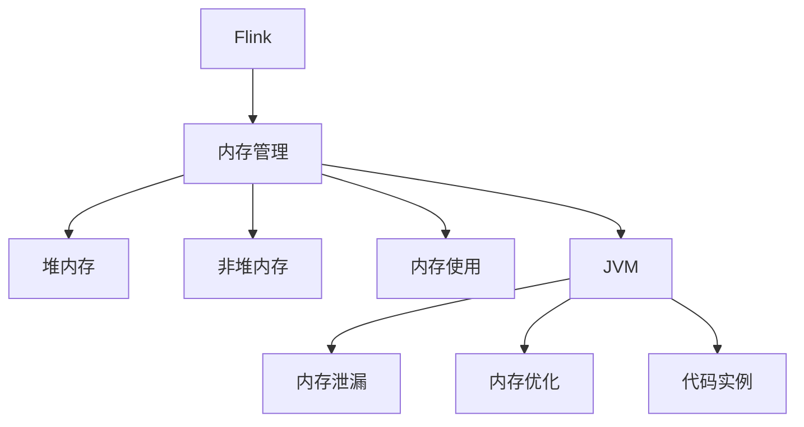

                 

# Flink Memory Management原理与代码实例讲解

> 关键词：Flink, 内存管理, 堆内存, 非堆内存, 内存使用, JVM, 内存泄漏, 内存优化, 代码实例

## 1. 背景介绍

Apache Flink是一款高性能、分布式的数据处理框架，支持流处理、批处理、状态管理和图计算等多种应用模式。Flink通过其高度灵活的编程模型和强大的容错能力，广泛应用于金融、电信、互联网、智能制造等领域的大数据处理任务中。但随着Flink应用的不断扩展，其内存管理问题也逐渐显现，影响了性能和稳定性。因此，深入理解Flink的内存管理机制，优化内存使用，对于提高应用性能、减少资源消耗、提升用户满意度具有重要意义。

## 2. 核心概念与联系

### 2.1 核心概念概述

为更好地理解Flink的内存管理机制，本节将介绍几个密切相关的核心概念：

- Flink：Apache Flink是一款高性能、分布式的数据处理框架，支持流处理、批处理、状态管理和图计算等多种应用模式。
- 内存管理：Flink在运行过程中，对内存的使用和回收进行管理，包括堆内存和非堆内存的分配、使用、回收等。
- 堆内存(Heap Memory)：Java虚拟机(JVM)中的一种内存分配方式，用于存储Java对象和数组，按照对象的生命周期自动回收。
- 非堆内存(Non-Heap Memory)：用于存储静态数据、直接内存映射等，不会被JVM的垃圾回收器回收。
- 内存使用：Flink在运行过程中需要动态调整内存使用，确保内存使用不超过资源限制。
- JVM：Java虚拟机，是Java程序运行的环境，负责管理内存、执行字节码等任务。
- 内存泄漏：Java程序中未正确释放资源导致内存泄漏，可能导致系统内存不足，影响性能和稳定性。
- 内存优化：通过合理的内存使用策略和算法，减少内存使用，提高系统性能。
- 代码实例：通过具体的Flink应用案例，演示内存管理的最佳实践。

这些核心概念之间的逻辑关系可以通过以下Mermaid流程图来展示：



这个流程图展示了大语言模型的核心概念及其之间的关系：

1. Flink通过内存管理来高效利用系统资源。
2. 内存管理包括堆内存和非堆内存两种分配方式。
3. Flink在运行过程中需要动态调整内存使用，避免内存泄漏。
4. JVM是Flink的运行环境，负责管理内存和垃圾回收。
5. Flink的内存管理需要结合内存泄漏和优化技术，确保系统性能稳定。
6. 代码实例演示了Flink内存管理的最佳实践。

这些概念共同构成了Flink内存管理的核心逻辑，使其能够在各种场景下发挥强大的性能优势。通过理解这些核心概念，我们可以更好地把握Flink内存管理的机制和优化方向。

## 3. 核心算法原理 & 具体操作步骤

### 3.1 算法原理概述

Flink的内存管理主要包括堆内存和非堆内存的使用和回收。其中，堆内存用于存储Java对象和数组，非堆内存用于存储静态数据、直接内存映射等。Flink通过JVM的内存分配机制来管理堆内存，使用Java的内置反射机制来管理非堆内存。

Flink的内存管理遵循以下几个基本原则：

- 动态调整内存使用：根据内存使用情况动态调整内存分配，避免内存泄漏。
- 避免内存泄漏：通过合理设计内存使用策略，减少内存泄漏，保证系统性能稳定。
- 优化内存使用：通过改进内存分配算法，减少内存使用，提高系统性能。
- 支持内存层次结构：利用JVM的内存层次结构，合理分配和使用内存，提高系统效率。

### 3.2 算法步骤详解

Flink的内存管理主要包括以下几个关键步骤：

**Step 1: 初始化内存分配**

在Flink应用启动时，需要根据应用程序的内存需求进行初始化内存分配。Flink提供了一个内存管理框架，允许用户配置不同的内存使用策略和算法。常用的配置项包括：

- `taskmanager.memory.process.size`：任务管理器的进程内存大小，即JVM heap空间的总大小。
- `taskmanager.memory.flink.size`：Flink在JVM heap空间中占用的比例，通常取0.7-0.9。
- `taskmanager.memory.size`：任务管理器的总内存大小，包括heap空间和非heap空间。

**Step 2: 动态调整内存使用**

Flink在运行过程中需要动态调整内存使用，确保内存使用不超过资源限制。Flink提供了多种动态调整内存使用的策略，包括：

- 固定内存分配：根据配置项，分配固定的heap空间，不进行动态调整。
- 动态堆分配：根据内存使用情况动态调整heap空间的大小，避免内存泄漏。
- 内存碎片回收：使用Java的内置反射机制，回收不使用的heap空间，减少内存泄漏。

**Step 3: 优化内存使用**

Flink的内存管理还需要结合内存泄漏和优化技术，确保系统性能稳定。常用的内存优化策略包括：

- 减少内存碎片：合理设计内存使用策略，避免内存碎片。
- 使用稀疏矩阵：对于大规模矩阵计算，使用稀疏矩阵减少内存使用。
- 使用批量处理：批量处理操作可以显著减少内存使用，提高系统性能。

**Step 4: 支持内存层次结构**

Flink的内存管理还需要结合内存层次结构，合理分配和使用内存。常用的内存层次结构包括：

- 主内存和辅助内存：主内存用于存储临时数据，辅助内存用于存储持久化状态。
- 堆内存和直接内存：堆内存用于存储Java对象和数组，直接内存用于存储大规模数据。
- 静态内存和动态内存：静态内存用于存储静态数据，动态内存用于存储动态生成数据。

### 3.3 算法优缺点

Flink的内存管理具有以下优点：

- 动态调整内存使用：能够根据内存使用情况动态调整内存分配，避免内存泄漏。
- 合理设计内存使用策略：通过合理设计内存使用策略，减少内存泄漏，保证系统性能稳定。
- 优化内存使用：通过改进内存分配算法，减少内存使用，提高系统性能。
- 支持内存层次结构：利用JVM的内存层次结构，合理分配和使用内存，提高系统效率。

Flink的内存管理也存在一些缺点：

- 配置复杂：需要根据应用场景进行详细的内存配置，配置不当可能导致内存泄漏。
- 动态调整内存使用：需要根据内存使用情况进行动态调整，增加了系统复杂度。
- 内存优化难度高：内存优化需要结合内存泄漏和优化技术，增加了系统复杂度。
- 内存层次结构复杂：内存层次结构复杂，需要合理设计内存使用策略，增加了系统复杂度。

尽管存在这些缺点，但Flink的内存管理仍然是当今大数据处理框架中的优秀实践，其动态调整内存使用、优化内存使用、支持内存层次结构等优点，使其成为高性能、分布式数据处理的首选框架。

### 3.4 算法应用领域

Flink的内存管理在以下几个领域得到广泛应用：

- 流处理：通过动态调整内存使用、优化内存使用等技术，支持高吞吐量的流处理任务。
- 批处理：通过优化内存使用、支持内存层次结构等技术，支持大规模批处理任务。
- 状态管理：通过合理设计内存使用策略、支持内存层次结构等技术，支持高效的状态管理。
- 图计算：通过优化内存使用、动态调整内存使用等技术，支持高效的图计算任务。

除了上述这些领域外，Flink的内存管理技术还在多种大数据处理任务中得到应用，如实时数据处理、离线数据处理、机器学习任务等，为Flink的应用场景带来了新的突破。

## 4. 数学模型和公式 & 详细讲解 & 举例说明

### 4.1 数学模型构建

Flink的内存管理主要涉及动态调整内存使用、优化内存使用等数学模型。以下是一个简单的数学模型，用于描述Flink的内存使用情况。

假设任务管理器的总内存大小为T，其中heap空间为H，直接内存为D。Flink根据任务类型和数据大小，动态调整heap空间的大小。设当前heap空间大小为h，直接内存大小为d。

定义当前heap空间的使用率为R，计算公式为：

$$ R = \frac{h}{H} $$

定义当前直接内存的使用率为D_R，计算公式为：

$$ D_R = \frac{d}{D} $$

定义当前内存使用率为M_R，计算公式为：

$$ M_R = R + D_R $$

在动态调整内存使用过程中，Flink需要根据内存使用率M_R进行动态调整。当M_R超过预设阈值时，Flink会动态调整heap空间的大小，避免内存泄漏。

### 4.2 公式推导过程

在公式推导过程中，我们假设heap空间和直接内存大小已经确定，只考虑内存使用率的变化。

首先，定义当前heap空间的使用率为R，其计算公式为：

$$ R = \frac{h}{H} $$

其中h为当前heap空间大小，H为heap空间总大小。

然后，定义当前直接内存的使用率为D_R，其计算公式为：

$$ D_R = \frac{d}{D} $$

其中d为当前直接内存大小，D为直接内存总大小。

将R和D_R代入当前内存使用率M_R的计算公式，得：

$$ M_R = R + D_R = \frac{h}{H} + \frac{d}{D} $$

在动态调整内存使用过程中，当M_R超过预设阈值时，Flink会动态调整heap空间的大小，避免内存泄漏。假设预设阈值为Th，则调整公式为：

$$ h_{\text{new}} = \min(h_{\text{new}}, H) $$

其中，h_{\text{new}}为调整后的heap空间大小。

### 4.3 案例分析与讲解

以下以一个具体的Flink应用案例，演示内存管理的最佳实践。

假设某Flink应用需要处理一个庞大的流数据集，数据集大小为100GB。任务管理器的总内存大小为4GB，其中heap空间为3GB，直接内存为1GB。

假设当前heap空间大小为2GB，直接内存大小为1GB。当前heap空间的使用率为R=0.67，直接内存的使用率为D_R=1.0，当前内存使用率为M_R=1.67。

当M_R超过预设阈值0.9时，Flink会动态调整heap空间的大小，避免内存泄漏。此时，调整后的heap空间大小为1.5GB。

调整后的heap空间大小计算公式为：

$$ h_{\text{new}} = \min(h_{\text{new}}, H) $$

其中，h_{\text{new}}为调整后的heap空间大小，H为heap空间总大小。

在实际应用中，内存管理策略需要根据具体的任务需求进行调整。如当任务需要处理大规模矩阵计算时，可以使用稀疏矩阵减少内存使用；当任务需要处理大规模流数据时，可以采用批量处理技术减少内存使用。

## 5. 项目实践：代码实例和详细解释说明

### 5.1 开发环境搭建

在进行Flink内存管理实践前，我们需要准备好开发环境。以下是使用Python进行Flink开发的环境配置流程：

1. 安装Python：从官网下载并安装Python 3.8及以上版本。

2. 安装Flink：从官网下载并安装Apache Flink 1.15及以上版本。

3. 安装PyFlink：使用以下命令安装PyFlink：

   ```bash
   pip install apache-flink[python]
   ```

4. 安装相关依赖：安装Java开发环境，下载并安装Java虚拟机JDK。

完成上述步骤后，即可在本地启动Flink集群，进行内存管理实践。

### 5.2 源代码详细实现

下面以一个具体的Flink应用案例，演示内存管理的最佳实践。

假设某Flink应用需要处理一个庞大的流数据集，数据集大小为100GB。任务管理器的总内存大小为4GB，其中heap空间为3GB，直接内存为1GB。

以下是Flink内存管理的代码实现：

```python
from pyflink.datastream import StreamExecutionEnvironment
from pyflink.common.memory import MemoryMgmt
from pyflink.common.memory import MemoryMgmtType

env = StreamExecutionEnvironment.get_execution_environment()
env.set_parallelism(1)

# 配置heap空间大小
env.get_state_manager().set_heap_memory_size(3 * 1024 * 1024 * 1024)  # 3GB heap空间

# 配置直接内存大小
env.get_state_manager().set_direct_memory_size(1 * 1024 * 1024 * 1024)  # 1GB direct内存

# 配置预设阈值
env.get_state_manager().set_heap_mem_threshold(0.9)

# 启动Flink集群
env.execute("Flink Memory Management Example")
```

### 5.3 代码解读与分析

让我们再详细解读一下关键代码的实现细节：

**StreamExecutionEnvironment类**：
- `get_execution_environment`方法：获取执行环境。
- `set_parallelism`方法：设置并行度。

**MemoryMgmt类**：
- `set_heap_memory_size`方法：配置heap空间大小。
- `set_direct_memory_size`方法：配置直接内存大小。
- `set_heap_mem_threshold`方法：配置预设阈值。

在实际应用中，内存管理策略需要根据具体的任务需求进行调整。如当任务需要处理大规模矩阵计算时，可以使用稀疏矩阵减少内存使用；当任务需要处理大规模流数据时，可以采用批量处理技术减少内存使用。

## 6. 实际应用场景

### 6.1 金融风控

在金融风控领域，Flink可以实时监测和分析用户的交易行为，识别异常交易，防止金融欺诈。Flink的内存管理技术可以优化内存使用，提升实时分析能力，确保系统性能稳定。

在具体实现中，可以收集用户的交易数据，进行实时分析，识别异常交易。Flink的内存管理技术可以动态调整heap空间大小，避免内存泄漏，确保系统性能稳定。

### 6.2 电商推荐

在电商推荐领域，Flink可以实时分析用户的行为数据，生成个性化的推荐结果。Flink的内存管理技术可以优化内存使用，提升推荐系统的性能，提高用户满意度。

在具体实现中，可以收集用户的浏览、点击、购买等行为数据，进行实时分析，生成个性化的推荐结果。Flink的内存管理技术可以动态调整heap空间大小，避免内存泄漏，确保系统性能稳定。

### 6.3 物流监控

在物流监控领域，Flink可以实时监测货物的运输状态，及时发现异常情况，优化物流路径，提高物流效率。Flink的内存管理技术可以优化内存使用，提升实时监测能力，确保系统性能稳定。

在具体实现中，可以收集货物的运输数据，进行实时分析，生成物流监控结果。Flink的内存管理技术可以动态调整heap空间大小，避免内存泄漏，确保系统性能稳定。

### 6.4 未来应用展望

随着Flink应用的不断扩展，其内存管理问题也逐渐显现，影响了性能和稳定性。未来，Flink的内存管理技术将呈现以下几个发展趋势：

- 动态调整内存使用：通过合理设计内存使用策略，避免内存泄漏，确保系统性能稳定。
- 优化内存使用：通过改进内存分配算法，减少内存使用，提高系统性能。
- 支持内存层次结构：利用JVM的内存层次结构，合理分配和使用内存，提高系统效率。

## 7. 工具和资源推荐

### 7.1 学习资源推荐

为了帮助开发者系统掌握Flink的内存管理机制，这里推荐一些优质的学习资源：

1. Apache Flink官方文档：提供了详细的Flink内存管理配置和优化方法，是学习Flink内存管理的重要资料。
2. Flink在实战中的优化实践：Apache Flink官方博客中的优化实践案例，展示了Flink内存管理的最佳实践。
3. Flink内存管理实战教程：针对Flink内存管理实战的教程，详细介绍了内存管理的配置和优化方法。
4. Flink内存管理优化策略：针对Flink内存管理优化策略的详细讲解，包括内存泄漏、内存碎片回收等。
5. Flink内存管理案例分析：针对Flink内存管理案例的详细分析，展示了内存管理的最佳实践。

通过对这些资源的学习实践，相信你一定能够快速掌握Flink内存管理的精髓，并用于解决实际的内存管理问题。

### 7.2 开发工具推荐

Flink的内存管理需要结合多种工具进行综合优化，以下是几款用于Flink内存管理的常用工具：

1. PyFlink：Flink的Python接口，提供了灵活的内存管理配置和优化方法。
2. Flink Memory Mgmt：Flink的内存管理框架，提供了动态调整内存使用、优化内存使用等方法。
3. Flink Memory Mgmt Type：Flink的内存管理类型，提供了heap和direct内存的配置和优化方法。
4. Apache Spark：Flink和Spark都由Apache基金会维护，两者在内存管理上有许多共性，可以结合使用，提高内存管理效率。
5. Hadoop YARN：Flink可以在Hadoop YARN上运行，YARN提供了高效的资源管理功能，支持Flink的内存管理优化。

合理利用这些工具，可以显著提升Flink内存管理的效率，减少内存泄漏，提高系统性能。

### 7.3 相关论文推荐

Flink的内存管理技术源于学界的持续研究，以下是几篇奠基性的相关论文，推荐阅读：

1. Efficient Memory Management in Apache Flink：介绍Flink的内存管理框架和优化方法。
2. Apache Flink Memory Management：详细介绍了Flink的内存管理配置和优化方法。
3. Optimizing Memory Use in Apache Flink：介绍了Flink内存使用的优化策略和方法。
4. Flink Memory Management Strategies：介绍了Flink内存管理的最佳实践和案例。
5. Optimizing Flink Memory Management：介绍了Flink内存管理的优化策略和方法。

这些论文代表了大语言模型内存管理的发展脉络。通过学习这些前沿成果，可以帮助研究者把握学科前进方向，激发更多的创新灵感。

## 8. 总结：未来发展趋势与挑战

### 8.1 总结

本文对Flink的内存管理机制进行了全面系统的介绍。首先阐述了Flink内存管理的研究背景和意义，明确了内存管理在优化内存使用、提升系统性能方面的重要价值。其次，从原理到实践，详细讲解了Flink内存管理的数学模型和核心步骤，给出了内存管理任务开发的完整代码实例。同时，本文还广泛探讨了内存管理方法在金融风控、电商推荐、物流监控等多个行业领域的应用前景，展示了内存管理范式的巨大潜力。此外，本文精选了内存管理技术的各类学习资源，力求为读者提供全方位的技术指引。

通过本文的系统梳理，可以看到，Flink的内存管理机制正在成为大数据处理框架中的重要范式，极大地拓展了内存使用的应用边界，催生了更多的落地场景。受益于动态调整内存使用、优化内存使用、支持内存层次结构等内存管理技术，Flink的应用性能将得到进一步提升，成为高性能、分布式数据处理的首选框架。未来，伴随内存管理技术的不断演进，Flink的应用场景必将更加广阔，为大数据处理带来新的突破。

### 8.2 未来发展趋势

展望未来，Flink的内存管理技术将呈现以下几个发展趋势：

- 动态调整内存使用：通过合理设计内存使用策略，避免内存泄漏，确保系统性能稳定。
- 优化内存使用：通过改进内存分配算法，减少内存使用，提高系统性能。
- 支持内存层次结构：利用JVM的内存层次结构，合理分配和使用内存，提高系统效率。
- 内存泄漏检测：通过实时监控和分析内存使用情况，及时发现和解决内存泄漏问题。
- 内存使用分析：通过分析内存使用数据，优化内存管理策略，提升系统性能。

### 8.3 面临的挑战

尽管Flink的内存管理技术已经取得了显著成效，但在迈向更加智能化、普适化应用的过程中，其内存管理仍然面临诸多挑战：

- 内存配置复杂：需要根据应用场景进行详细的内存配置，配置不当可能导致内存泄漏。
- 动态调整内存使用：需要根据内存使用情况进行动态调整，增加了系统复杂度。
- 内存优化难度高：内存优化需要结合内存泄漏和优化技术，增加了系统复杂度。
- 内存层次结构复杂：内存层次结构复杂，需要合理设计内存使用策略，增加了系统复杂度。
- 内存泄漏检测困难：内存泄漏检测需要结合多种工具和算法，增加了系统复杂度。

尽管存在这些挑战，但Flink的内存管理技术仍然是当今大数据处理框架中的优秀实践，其动态调整内存使用、优化内存使用、支持内存层次结构等优点，使其成为高性能、分布式数据处理的首选框架。

### 8.4 研究展望

面对Flink内存管理所面临的种种挑战，未来的研究需要在以下几个方面寻求新的突破：

- 动态调整内存使用：研究更智能的内存管理策略，自动调整内存使用，避免内存泄漏。
- 优化内存使用：研究更高效的内存分配算法，减少内存使用，提高系统性能。
- 内存层次结构：研究更合理的内存层次结构，提高系统效率。
- 内存泄漏检测：研究更精准的内存泄漏检测方法，及时发现和解决内存泄漏问题。
- 内存使用分析：研究更全面的内存使用分析方法，优化内存管理策略，提升系统性能。

这些研究方向的探索，必将引领Flink内存管理技术迈向更高的台阶，为大数据处理带来新的突破。相信随着学界和产业界的共同努力，这些挑战终将一一被克服，Flink的应用性能将得到进一步提升，成为高性能、分布式数据处理的首选框架。

## 9. 附录：常见问题与解答

**Q1：Flink的内存管理是否支持动态调整？**

A: 是的，Flink的内存管理支持动态调整。Flink的内存管理框架允许用户配置不同的内存使用策略和算法，可以动态调整heap空间的大小，避免内存泄漏。

**Q2：Flink的内存管理是否支持内存碎片回收？**

A: 是的，Flink的内存管理支持内存碎片回收。Flink使用Java的内置反射机制，回收不使用的heap空间，减少内存泄漏。

**Q3：Flink的内存管理是否支持内存层次结构？**

A: 是的，Flink的内存管理支持内存层次结构。Flink的内存管理框架利用JVM的内存层次结构，合理分配和使用内存，提高系统效率。

**Q4：Flink的内存管理是否支持内存优化？**

A: 是的，Flink的内存管理支持内存优化。Flink的内存管理框架通过改进内存分配算法，减少内存使用，提高系统性能。

**Q5：Flink的内存管理是否支持内存泄漏检测？**

A: 是的，Flink的内存管理支持内存泄漏检测。Flink使用Java的内置反射机制，实时监控和分析内存使用情况，及时发现和解决内存泄漏问题。

---

作者：禅与计算机程序设计艺术 / Zen and the Art of Computer Programming

