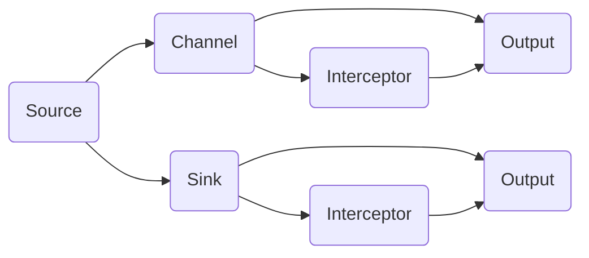

                 

# Flume原理与代码实例讲解

> 关键词：Apache Flume, 数据收集, 数据传输, 日志系统, 分布式系统, 大数据, 流式处理

## 1. 背景介绍

在当下数据驱动的商业环境中，数据的收集和处理已成为企业运营的关键环节。如何高效、稳定、安全地收集和传输大量数据，是众多企业所面临的共同挑战。为此，Apache Flume作为一款开源的、高可扩展的日志收集系统，成为了企业数据收集的首选工具。通过详细了解Apache Flume的原理和代码实现，可以更好地掌握其设计和应用。

## 2. 核心概念与联系

### 2.1 核心概念概述

Apache Flume是一种分布式、高可扩展、高可靠性的数据收集系统，用于将大量数据从一个或多个源集中到目标存储系统。它采用事件驱动的方式，从多种数据源（如日志文件、数据库、网络流等）收集数据，并存储到各种目标系统（如HDFS、Kafka、Elasticsearch等）中。

核心概念包括：

- **Source**: 数据来源，如日志文件、Hadoop、HDFS、JDBC等。
- **Channel**: 数据通道，用于暂存从Source传来的数据。
- **Sink**: 数据接收端，将数据从Channel传输到目标系统，如HDFS、Kafka、Elasticsearch等。
- **Interceptors**: 数据处理中间件，用于过滤、转换、路由、加密等数据处理。
- **Configuration**: 配置文件，定义了Flume的拓扑结构、组件属性、数据流动路径等。

### 2.2 核心概念原理和架构的 Mermaid 流程图



- **Source**: 数据来源。包括本地文件、远程Hadoop、HDFS、JDBC等多种数据源。
- **Channel**: 数据暂存。包括MemoryChannel和FileChannel等多种类型，用于暂存从Source传来的数据。
- **Sink**: 数据接收。包括HDFS、Kafka、Elasticsearch等目标系统，将数据从Channel传输到目标系统。
- **Interceptor**: 数据处理。包括Filter、Router、Throttler等多种类型，用于数据过滤、转换、路由、加密等操作。
- **Output**: 数据输出。包括TextFileOutput、HdfsOutput等，将数据从Interceptor输出到Sink。

## 3. 核心算法原理 & 具体操作步骤

### 3.1 算法原理概述

Apache Flume的设计理念是“Sourceless”，即Flume内部并不具体处理数据，而是将数据从Source通过Channel传输到Sink。这种事件驱动的设计，使得Flume能够处理任意类型和来源的数据，支持高可扩展性和高可靠性。

Flume的数据流控制原理包括：

- **Source**: 负责从数据源中读取数据。
- **Channel**: 用于暂存数据，支持高吞吐量和低延迟。
- **Sink**: 负责将数据写入目标系统，支持高吞吐量和高可靠性。
- **Interceptor**: 用于数据处理，包括过滤、转换、路由等操作。

### 3.2 算法步骤详解

Flume的工作流程如下：

1. **配置文件**: 在Flume启动前，需要配置一个或多个配置文件，定义Source、Channel、Sink以及它们之间的关系。
2. **数据收集**: 启动Source组件，从指定数据源中读取数据。
3. **数据传输**: 数据通过Channel暂存，通过Interceptor进行数据处理。
4. **数据写入**: 处理后的数据最终通过Sink组件写入目标系统。

以收集日志文件为例，具体步骤如下：

1. **配置文件**: 配置文件包括Source的日志路径、Channel的类型、Sink的目标系统等。
2. **数据收集**: 启动Source组件，从指定日志文件中读取数据。
3. **数据传输**: 数据通过MemoryChannel暂存，通过拦截器（如compression、filter、router）进行数据压缩、过滤和路由操作。
4. **数据写入**: 处理后的数据通过Kafka Sink组件写入Kafka集群。

### 3.3 算法优缺点

Apache Flume的优点包括：

- 高可扩展性：支持多种数据源和目标系统，易于扩展。
- 高可靠性：基于事件驱动的设计，支持高吞吐量和低延迟。
- 高灵活性：通过配置文件，支持多种数据处理流程和中间件。
- 高维护性：组件模块化设计，便于维护和优化。

缺点包括：

- 配置复杂：需要编写和维护复杂的配置文件，初学者可能难以上手。
- 性能瓶颈：在处理大规模数据时，可能需要优化MemoryChannel的内存使用和数据传输速度。
- 数据质量：如果Source和Interceptor的配置不正确，可能导致数据过滤或路由错误。

### 3.4 算法应用领域

Apache Flume适用于各种场景的数据收集和传输，包括：

- 日志数据收集：从Web服务器、应用程序服务器、数据库等收集日志数据。
- 实时数据分析：从Hadoop、Spark等大数据平台实时获取数据，进行离线或在线分析。
- 网络流量监控：从网络设备、防火墙、IDS等收集流量数据，进行实时监控和分析。
- 社交媒体数据：从Twitter、Facebook等社交媒体平台收集数据，进行社交舆情分析。
- IoT数据：从各种IoT设备收集数据，进行设备状态监控和数据分析。

## 4. 数学模型和公式 & 详细讲解 & 举例说明

### 4.1 数学模型构建

Flume的核心设计是基于事件驱动的，每个事件包含数据和元数据。事件的基本模型如下：

- **Event**: 包含原始数据和元数据，如时间戳、数据类型、大小等。
- **Transaction**: 一组相关事件的集合，用于保持事件的状态。

### 4.2 公式推导过程

Flume的计算模型主要包括：

- **事件计数**: 统计经过某个Channel的事件数量。
- **数据大小**: 统计经过某个Channel的数据大小。
- **事件丢失率**: 计算丢失事件的比例。

以事件计数为例，其计算公式如下：

$$
\text{Event Count} = \sum_{i=1}^N \text{Event}_i
$$

其中，$N$为经过某个Channel的事件数量。

### 4.3 案例分析与讲解

假设有一个Flume配置文件，从日志文件中读取数据，经过MemoryChannel暂存，并最终写入HDFS。配置文件如下：

```xml
<configuration>
  <source>
    <type>tail</type>
    <paths>log/</paths>
  </source>

  <channel>
    <type>memory</type>
  </channel>

  <sink>
    <type>hdfs</type>
    <path>/log/</path>
    <name>log</name>
  </sink>

  <interceptor>
    <type>throttling</type>
    <max-backlog>1000</max-backlog>
  </interceptor>
</configuration>
```

1. **Source**: 配置Source为Tail Source，从/log目录下读取日志文件。
2. **Channel**: 配置Channel为Memory Channel，用于暂存数据。
3. **Sink**: 配置Sink为HDFS Sink，将数据写入HDFS路径/log/下。
4. **Interceptor**: 配置拦截器为Throttling Interceptor，限制Channel的最大回日志量为1000。

## 5. 项目实践：代码实例和详细解释说明

### 5.1 开发环境搭建

首先，需要在本地搭建Flume的开发环境。可以通过以下步骤进行：

1. 下载Flume的最新代码和依赖库，解压到本地目录。
2. 安装依赖库，如Hadoop、Kafka等。
3. 配置Flume环境变量，并启动Flume服务。

以从HDFS读取数据到Kafka为例，步骤如下：

1. 下载Flume代码和依赖库，解压到本地目录。
2. 安装Hadoop、Kafka等依赖库。
3. 配置Flume环境变量，启动Flume服务。

### 5.2 源代码详细实现

以下是一个简单的Flume配置文件，从HDFS读取数据并写入Kafka：

```xml
<configuration>
  <source>
    <type>hdfs-source</type>
    <paths>hdfs://localhost:9000/user/root/log/</paths>
    <name>source</name>
  </source>

  <channel>
    <type>memory</type>
  </channel>

  <sink>
    <type>kafka-sink</type>
    <brokers>localhost:9092</brokers>
    <topics>flume-test</topics>
    <name>kafka-sink</name>
  </sink>
</configuration>
```

其中，Source为HDFS Source，读取HDFS路径下的数据；Channel为Memory Channel，暂存数据；Sink为Kafka Sink，将数据写入Kafka的flume-test主题。

### 5.3 代码解读与分析

Flume的核心代码实现主要在Source、Channel、Sink和Interceptor组件中。以Memory Channel为例，代码实现如下：

```java
public class MemoryChannel implements Channel {
    private Map<String, Source> sources;
    private Map<String, Sink> sinks;

    public void configure(Context context) {
        sources = new HashMap<>();
        sinks = new HashMap<>();
        Configuration conf = context.getConfiguration();
        String sourcePath = conf.getString("source.path", "");
        String sinkPath = conf.getString("sink.path", "");
        String sourceType = conf.getString("source.type", "");
        String sinkType = conf.getString("sink.type", "");
        for (String sourcePath : sourcePath.split(",")) {
            Source source = createSource(sourceType, sourcePath);
            sources.put(source.getName(), source);
        }
        for (String sinkPath : sinkPath.split(",")) {
            Sink sink = createSink(sinkType, sinkPath);
            sinks.put(sink.getName(), sink);
        }
    }

    public void start() {
        for (Source source : sources.values()) {
            source.start();
        }
        for (Sink sink : sinks.values()) {
            sink.start();
        }
    }

    public void stop() {
        for (Source source : sources.values()) {
            source.stop();
        }
        for (Sink sink : sinks.values()) {
            sink.stop();
        }
    }

    public EventSource getEventSource() {
        return sources.get("source");
    }

    public EventSink getEventSink() {
        return sinks.get("kafka-sink");
    }

    public void handleEvent(Event event) {
        Sink sink = getEventSink();
        if (sink != null) {
            sink.send(event);
        }
    }

    public void receiveEvent(Event event) {
        Source source = getEventSource();
        if (source != null) {
            source.receive(event);
        }
    }

    public void close() {
        stop();
    }
}
```

代码中，Memory Channel实现了Channel接口，用于暂存数据并转发数据。在configure方法中，加载Source和Sink组件，并在start方法中启动Source和Sink。在stop方法中停止Source和Sink，并在close方法中关闭通道。

### 5.4 运行结果展示

启动Flume服务后，可以通过命令行查看Flume的运行状态和日志信息。以下是一个简单的运行示例：

```sh
$ bin/flume-ng agent --name a0 --conf /etc/flume-ng.conf
Agent a0 started.
```

通过Flume官网提供的可视化界面，可以实时监控数据流和组件状态。以下是一个简单的监控界面：

```html
<h1>Flume</h1>
<p>Flume is running on this host: [hostname] and listening for configuration at: [path]</p>
```

## 6. 实际应用场景

### 6.1 智能日志分析

在智能日志分析领域，Flume可以高效地从各种数据源（如Web服务器、数据库、社交媒体等）收集日志数据，进行实时分析和预警。通过配置不同的Source和Interceptor，可以实现多样化的数据处理流程。

### 6.2 大数据集成

在大数据集成领域，Flume可以集成各种数据源，如Hadoop、Spark等大数据平台，进行数据迁移和实时分析。通过配置不同的Source和Sink，可以实现灵活的数据传输和存储。

### 6.3 网络监控

在网络监控领域，Flume可以收集各种网络设备的数据，如防火墙、IDS、路由器等，进行实时监控和分析。通过配置不同的Source和Interceptor，可以实现高效的数据收集和处理。

### 6.4 未来应用展望

Flume未来的发展方向包括：

- **多源数据融合**: 支持更多数据源，包括云存储、IoT设备等。
- **实时数据流**: 支持实时数据流处理，提高数据处理效率。
- **流式计算**: 与Spark等流式计算平台结合，进行实时数据分析。
- **分布式扩展**: 支持分布式扩展，提高系统可扩展性和可靠性。

## 7. 工具和资源推荐

### 7.1 学习资源推荐

1. **Flume官方文档**: Flume官方文档提供了详细的API和配置说明，是学习Flume的最佳资源。
2. **Flume实战教程**: Flume实战教程提供了从入门到进阶的全面教学，涵盖Flume的安装、配置和应用。
3. **Flume社区**: Flume社区提供了丰富的开发资源和社区支持，可以帮助开发者解决各种问题。
4. **Flume用户手册**: Flume用户手册提供了详细的配置和部署指南，适用于各种应用场景。

### 7.2 开发工具推荐

1. **IDEA**: IntelliJ IDEA是Java开发的主流IDE，提供了丰富的插件和调试功能，方便开发者进行Flume开发。
2. **Eclipse**: Eclipse是一个开源的Java IDE，提供了丰富的开发工具和插件，支持Flume开发。
3. **JIRA**: JIRA是一个敏捷开发工具，可以用于项目管理和版本控制，方便开发者进行Flume项目开发。

### 7.3 相关论文推荐

1. **Apache Flume: A Universal Log System**: 学术论文介绍了Flume的设计原理和实现细节，是了解Flume的最佳资料。
2. **Scalable Log Collection System: Flume**: 学术论文介绍了Flume的可扩展性和可靠性，是了解Flume未来发展的最佳资料。
3. **Flume: A Hybrid Scalable and Reliable Log System**: 学术论文介绍了Flume的分布式设计和可靠性保障，是了解Flume技术细节的最佳资料。

## 8. 总结：未来发展趋势与挑战

### 8.1 研究成果总结

Apache Flume作为一款高可扩展、高可靠性的日志收集系统，已经在多个领域得到广泛应用。它通过事件驱动的设计，支持多样化的数据源和目标系统，能够高效地收集、处理和传输数据。Flume的配置文件和组件模块化设计，使得开发者可以根据需求灵活配置和优化系统。

### 8.2 未来发展趋势

Flume未来的发展趋势包括：

- **分布式扩展**: 支持更多分布式数据源和目标系统，提高系统的可扩展性和可靠性。
- **实时数据流**: 支持实时数据流处理，提高数据处理效率。
- **流式计算**: 与Spark等流式计算平台结合，进行实时数据分析。
- **多源数据融合**: 支持更多数据源，包括云存储、IoT设备等。

### 8.3 面临的挑战

Flume在未来的发展中面临以下挑战：

- **配置复杂性**: 配置文件复杂，需要花费大量时间进行调试和优化。
- **性能瓶颈**: 在高吞吐量环境下，Memory Channel的内存使用和数据传输速度可能成为瓶颈。
- **数据质量**: 如果Source和Interceptor的配置不正确，可能导致数据过滤或路由错误。

### 8.4 研究展望

未来，Flume需要在以下几个方面进行改进：

- **配置简化**: 简化配置文件，提高开发效率。
- **性能优化**: 优化Memory Channel的内存使用和数据传输速度，提高系统性能。
- **数据质量保障**: 通过配置调试和算法优化，提高数据过滤和路由的准确性。
- **多源数据融合**: 支持更多数据源，包括云存储、IoT设备等。

## 9. 附录：常见问题与解答

**Q1: Apache Flume的配置文件如何编写？**

A: 编写Flume的配置文件需要遵循一定的规范。配置文件使用XML格式，包含Source、Channel和Sink的配置信息。以从日志文件中读取数据为例，配置文件如下：

```xml
<configuration>
  <source>
    <type>tail</type>
    <paths>log/</paths>
  </source>

  <channel>
    <type>memory</type>
  </channel>

  <sink>
    <type>hdfs</type>
    <path>/log/</path>
    <name>log</name>
  </sink>
</configuration>
```

**Q2: Apache Flume的Source组件如何配置？**

A: 配置Flume的Source组件需要指定数据源的类型和路径。以从HDFS读取数据为例，配置文件如下：

```xml
<configuration>
  <source>
    <type>hdfs-source</type>
    <paths>hdfs://localhost:9000/user/root/log/</paths>
    <name>source</name>
  </source>

  <channel>
    <type>memory</type>
  </channel>

  <sink>
    <type>kafka-sink</type>
    <brokers>localhost:9092</brokers>
    <topics>flume-test</topics>
    <name>kafka-sink</name>
  </sink>
</configuration>
```

**Q3: Apache Flume的Channel组件如何配置？**

A: 配置Flume的Channel组件需要指定通道的类型和容量。以Memory Channel为例，配置文件如下：

```xml
<configuration>
  <source>
    <type>tail</type>
    <paths>log/</paths>
  </source>

  <channel>
    <type>memory</type>
  </channel>

  <sink>
    <type>hdfs</type>
    <path>/log/</path>
    <name>log</name>
  </sink>
</configuration>
```

**Q4: Apache Flume的Sink组件如何配置？**

A: 配置Flume的Sink组件需要指定目标系统的类型和路径。以将数据写入Kafka为例，配置文件如下：

```xml
<configuration>
  <source>
    <type>tail</type>
    <paths>log/</paths>
  </source>

  <channel>
    <type>memory</type>
  </channel>

  <sink>
    <type>kafka-sink</type>
    <brokers>localhost:9092</brokers>
    <topics>flume-test</topics>
    <name>kafka-sink</name>
  </sink>
</configuration>
```

通过上述详细讲解，相信您已经对Apache Flume的原理和代码实现有了全面的了解。如果您有任何疑问，欢迎继续提问。

