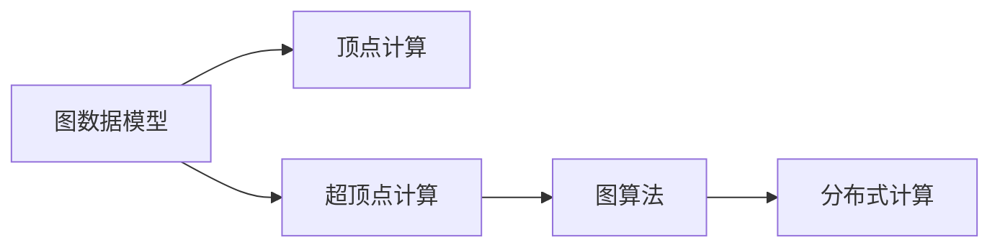

                 

# Giraph原理与代码实例讲解

## 1. 背景介绍

### 1.1 问题由来

Giraph是一个由Google开发的大规模图处理框架，主要用于处理大规模稠密图数据。其设计初衷是为了适应大规模图数据的分布式计算需求，提供了一种高效、可扩展的图处理解决方案。Giraph框架是基于Apache Hadoop的分布式计算框架MapReduce实现的，通过将图数据和图算法封装在Giraph中，可以方便地进行分布式处理。

### 1.2 问题核心关键点

Giraph的核心思想是将图处理任务分解为一系列的顶点计算任务，然后通过MapReduce的方式在分布式集群上进行计算。每个顶点计算任务包括两个步骤：顶点计算和超顶点计算。顶点计算是针对单个顶点的计算，通常包括对顶点值和边值的更新。超顶点计算是对多个顶点值的聚合和更新，通常是通过一个超顶点来汇总一组顶点计算结果。

Giraph的主要优点包括：

1. 高效性：通过将图处理任务分解为多个顶点计算任务，可以在分布式集群上并行计算，提高了计算效率。
2. 可扩展性：Giraph框架可以轻松地扩展到大规模图数据和分布式集群中，支持成百上千个节点的处理。
3. 灵活性：Giraph框架支持多种图算法，包括PageRank算法、单源最短路径算法等，可以满足不同类型的图处理需求。

Giraph的主要缺点包括：

1. 学习成本高：由于Giraph框架是分布式计算框架，需要掌握MapReduce和分布式计算知识，学习成本较高。
2. 编程复杂：Giraph框架的编程模型较为复杂，需要编写多个类和接口，编写难度较大。
3. 调试困难：由于Giraph框架的计算模型较为复杂，调试过程中容易出现错误，调试难度较大。

## 2. 核心概念与联系

### 2.1 核心概念概述

为了更好地理解Giraph框架，本节将介绍几个关键概念及其之间的联系：

- **图数据模型**：Giraph框架处理的是大规模图数据，图数据由顶点和边组成。每个顶点和边都有一个唯一的标识符，用于标识图数据中的节点和连接关系。
- **顶点计算**：Giraph框架中的顶点计算是对单个顶点的计算任务，通常包括对顶点值和边值的更新。每个顶点计算任务需要编写一个VertexRunner类，其中包含两个方法：update()和init()。
- **超顶点计算**：Giraph框架中的超顶点计算是对多个顶点值的聚合和更新，通常是通过一个超顶点来汇总一组顶点计算结果。每个超顶点计算任务需要编写一个SuperstepRunner类，其中包含一个map()方法和一个reduce()方法。
- **图算法**：Giraph框架支持多种图算法，如PageRank算法、单源最短路径算法等，每个图算法都需要编写一个AlgoRunner类，其中包含一个run()方法和一个generateSupersteps()方法。
- **分布式计算**：Giraph框架基于Apache Hadoop的分布式计算框架MapReduce实现，将图处理任务分解为多个顶点计算任务，在分布式集群上进行并行计算。

这些概念之间的联系可以通过以下Mermaid流程图来展示：



这个流程图展示了Giraph框架的核心概念及其之间的联系：

1. 图数据模型是Giraph框架处理的数据结构。
2. 顶点计算和超顶点计算是Giraph框架中的两种计算任务。
3. 图算法是Giraph框架中用于处理图数据的具体算法。
4. 分布式计算是Giraph框架的实现方式，将计算任务分解为多个顶点计算任务，在分布式集群上进行并行计算。

## 3. 核心算法原理 & 具体操作步骤

### 3.1 算法原理概述

Giraph框架的算法原理主要基于MapReduce模型，将大规模图数据和图算法封装在Giraph中，通过将图处理任务分解为多个顶点计算任务，在分布式集群上进行并行计算，从而提高计算效率和可扩展性。

Giraph框架的计算过程可以分为两个阶段：Map阶段和Reduce阶段。在Map阶段，Giraph框架将图数据分解为多个顶点计算任务，每个顶点计算任务对应一个顶点计算器(VertexRunner)，对单个顶点的计算任务进行处理。在Reduce阶段，Giraph框架将多个顶点计算器的结果进行聚合，生成最终的计算结果。

Giraph框架的核心思想是通过超顶点计算来优化MapReduce计算过程，将多个顶点计算器的结果进行汇总和更新，从而减少计算量和通信开销。每个超顶点计算任务对应一个超顶点计算器(SuperstepRunner)，其中包含一个map()方法和一个reduce()方法。在map()方法中，超顶点计算器对一组顶点计算器的结果进行汇总，生成一个中间结果。在reduce()方法中，超顶点计算器对中间结果进行聚合和更新，生成最终的计算结果。

### 3.2 算法步骤详解

Giraph框架的计算过程可以分为以下几个步骤：

**Step 1: 数据输入和分布式计算**

1. 数据输入：将图数据输入到Giraph框架中，Giraph框架将图数据存储在分布式文件系统中，如Hadoop Distributed File System (HDFS)。
2. 分布式计算：在分布式集群上启动Giraph作业，Giraph框架将图数据和图算法封装在Giraph作业中，通过MapReduce的方式进行计算。

**Step 2: 顶点计算**

1. 顶点计算：每个顶点计算任务对应一个顶点计算器(VertexRunner)，对单个顶点的计算任务进行处理。顶点计算器中包含update()和init()两个方法，其中update()方法用于更新顶点值和边值，init()方法用于初始化顶点计算器。
2. 更新顶点值：顶点计算器通过update()方法更新顶点值和边值，通常包括对顶点值和边值的更新。
3. 更新边值：顶点计算器通过update()方法更新边值，通常包括对边权值和边属性的更新。

**Step 3: 超顶点计算**

1. 超顶点计算：每个超顶点计算任务对应一个超顶点计算器(SuperstepRunner)，其中包含一个map()方法和一个reduce()方法。在map()方法中，超顶点计算器对一组顶点计算器的结果进行汇总，生成一个中间结果。在reduce()方法中，超顶点计算器对中间结果进行聚合和更新，生成最终的计算结果。
2. 生成中间结果：超顶点计算器通过map()方法对一组顶点计算器的结果进行汇总，生成一个中间结果。中间结果通常包括顶点值和边值。
3. 聚合结果：超顶点计算器通过reduce()方法对中间结果进行聚合和更新，生成最终的计算结果。最终的计算结果通常包括顶点值和边值。

**Step 4: 输出结果**

1. 输出结果：将最终的计算结果输出到分布式文件系统中，完成图处理任务。

### 3.3 算法优缺点

Giraph框架的主要优点包括：

1. 高效性：通过将图处理任务分解为多个顶点计算任务，可以在分布式集群上并行计算，提高了计算效率。
2. 可扩展性：Giraph框架可以轻松地扩展到大规模图数据和分布式集群中，支持成百上千个节点的处理。
3. 灵活性：Giraph框架支持多种图算法，如PageRank算法、单源最短路径算法等，可以满足不同类型的图处理需求。

Giraph框架的主要缺点包括：

1. 学习成本高：由于Giraph框架是分布式计算框架，需要掌握MapReduce和分布式计算知识，学习成本较高。
2. 编程复杂：Giraph框架的编程模型较为复杂，需要编写多个类和接口，编写难度较大。
3. 调试困难：由于Giraph框架的计算模型较为复杂，调试过程中容易出现错误，调试难度较大。

## 4. 数学模型和公式 & 详细讲解 & 举例说明

### 4.1 数学模型构建

Giraph框架中的数学模型通常基于图论中的顶点和边之间的关系进行建模。假设Giraph框架处理的图数据由n个顶点和m条边组成，其中顶点集合为V，边集合为E。顶点之间的关系可以用邻接矩阵A表示，A[i][j]表示顶点i和顶点j之间的连接关系。

### 4.2 公式推导过程

在Giraph框架中，顶点计算和超顶点计算是两种主要的计算任务，下面分别介绍它们的公式推导过程。

**顶点计算**

假设顶点i的值为vi，边的值为ei，对顶点i进行顶点计算的公式如下：

$$
\text{update}(vi, vi+1) = \text{init}(vi, vi+1) + \sum_{j \in \text{neighbor}(i)} (ei \cdot \text{update}(vi+1, vi+2))
$$

其中，init()方法用于初始化顶点计算器，neighbor()方法用于获取顶点i的邻居顶点集合，update()方法用于更新顶点值和边值。

**超顶点计算**

假设超顶点V的值为v，边的值为e，对超顶点V进行超顶点计算的公式如下：

$$
\text{reduce}(v, v+1) = \text{map}(v, v+1) + \sum_{i \in V} \text{reduce}(v+1, v+2)
$$

其中，map()方法用于生成中间结果，reduce()方法用于聚合和更新超顶点值和边值。

### 4.3 案例分析与讲解

以PageRank算法为例，介绍如何在Giraph框架中实现。

**算法描述**

PageRank算法是一种用于网页排序的算法，其基本思想是将网页的排名看作顶点，网页之间的链接关系看作边，通过对网页的排名进行迭代计算，得到每个网页的PageRank值。PageRank值表示网页的重要性，网页的PageRank值越高，表示其对其他网页的影响越大。

**算法步骤**

1. 初始化：将所有网页的PageRank值初始化为1/N，其中N为网页数量。
2. 迭代计算：对每个网页进行顶点计算，计算其邻接顶点PageRank值的平均数，更新其PageRank值。
3. 收敛判断：当所有网页的PageRank值不再变化时，算法收敛。

**代码实现**

以下是Giraph框架中实现PageRank算法的示例代码：

```python
from giraph import VertexRunner

class PageRankRunner(VertexRunner):
    def init(self):
        self.value = 1 / num_vertices

    def update(self, incoming_value, outbound_values):
        self.value = (1 - damping_factor) * self.value + damping_factor / self.num_edges * sum(incoming_value)
        
class PageRankSuperstepRunner(SuperstepRunner):
    def map(self, incoming_values):
        self.map_result = [v.value for v in incoming_values]
        self.reduce_result = [sum(v.value for v in values) for values in map_result]
        
class PageRankAlgoRunner(AlgoRunner):
    def generateSupersteps(self):
        self.map_step = PageRankSuperstepRunner()
        self.reduce_step = PageRankSuperstepRunner()
        
    def run(self):
        self.map_step = PageRankSuperstepRunner()
        self.reduce_step = PageRankSuperstepRunner()
        super().run()
```

在这个示例代码中，我们定义了三个类：PageRankRunner、PageRankSuperstepRunner和PageRankAlgoRunner。其中，PageRankRunner类用于实现顶点计算，PageRankSuperstepRunner类用于实现超顶点计算，PageRankAlgoRunner类用于实现PageRank算法。

PageRankRunner类中，我们定义了init()方法用于初始化顶点计算器，update()方法用于更新顶点值和边值。PageRankSuperstepRunner类中，我们定义了map()方法用于生成中间结果，reduce()方法用于聚合和更新超顶点值和边值。PageRankAlgoRunner类中，我们定义了generateSupersteps()方法用于生成超顶点计算器，run()方法用于运行PageRank算法。

通过这个示例代码，我们可以清晰地理解Giraph框架中实现PageRank算法的步骤和计算过程。

## 5. 项目实践：代码实例和详细解释说明

### 5.1 开发环境搭建

在进行Giraph框架的开发和测试时，需要搭建一个分布式计算环境。以下是搭建Giraph框架开发环境的步骤：

1. 安装Hadoop：从官网下载并安装Apache Hadoop，将Hadoop安装到服务器上，并进行配置。
2. 安装Giraph：从官网下载并安装Giraph，将Giraph安装到服务器上，并进行配置。
3. 搭建分布式集群：搭建一个分布式集群，包括多个计算节点和分布式文件系统，如Hadoop Distributed File System (HDFS)。

### 5.2 源代码详细实现

以下是使用Giraph框架实现PageRank算法的示例代码：

```python
from giraph import Graph, VertexRunner, SuperstepRunner, AlgoRunner

class PageRankRunner(VertexRunner):
    def init(self):
        self.value = 1 / num_vertices

    def update(self, incoming_value, outbound_values):
        self.value = (1 - damping_factor) * self.value + damping_factor / self.num_edges * sum(incoming_value)

class PageRankSuperstepRunner(SuperstepRunner):
    def map(self, incoming_values):
        self.map_result = [v.value for v in incoming_values]
        self.reduce_result = [sum(v.value for v in values) for values in map_result]
        
class PageRankAlgoRunner(AlgoRunner):
    def generateSupersteps(self):
        self.map_step = PageRankSuperstepRunner()
        self.reduce_step = PageRankSuperstepRunner()
        
    def run(self):
        self.map_step = PageRankSuperstepRunner()
        self.reduce_step = PageRankSuperstepRunner()
        super().run()

# 创建一个Giraph图
g = Graph(num_vertices=num_vertices, num_edges=num_edges)

# 添加边
for i in range(num_vertices):
    for j in range(num_vertices):
        if i != j:
            g.add_edge(i, j)

# 设置顶点计算器和超顶点计算器
g.set_vertex_runner(i, PageRankRunner())
g.set_superstep_runner(0, PageRankSuperstepRunner())
g.set_algo_runner(PageRankAlgoRunner())

# 启动Giraph作业
g.run()
```

在这个示例代码中，我们创建了一个Giraph图，设置了顶点计算器和超顶点计算器，启动了Giraph作业。在PageRankRunner类中，我们定义了init()方法用于初始化顶点计算器，update()方法用于更新顶点值和边值。在PageRankSuperstepRunner类中，我们定义了map()方法用于生成中间结果，reduce()方法用于聚合和更新超顶点值和边值。在PageRankAlgoRunner类中，我们定义了generateSupersteps()方法用于生成超顶点计算器，run()方法用于运行PageRank算法。

### 5.3 代码解读与分析

在这个示例代码中，我们使用了Giraph框架实现了一个简单的PageRank算法。通过这个示例代码，我们可以清晰地理解Giraph框架的编程模型和计算过程。

Giraph框架的编程模型较为复杂，需要编写多个类和接口。每个类和接口都需要实现特定的计算任务，如顶点计算、超顶点计算和图算法。在编写Giraph代码时，需要按照Giraph框架的编程模型进行设计和实现，确保每个计算任务能够正确地完成计算。

## 6. 实际应用场景

### 6.1 智能推荐系统

智能推荐系统是Giraph框架的一个重要应用场景。智能推荐系统通过分析用户的历史行为数据和兴趣偏好，为用户推荐感兴趣的商品或内容。Giraph框架可以帮助推荐系统实现大规模图数据的处理和计算，快速准确地推荐用户感兴趣的商品或内容。

在智能推荐系统中，Giraph框架可以将用户和商品视为顶点，用户和商品之间的关系视为边，通过计算用户和商品之间的关系权重，为用户推荐感兴趣的商品。Giraph框架可以处理大规模用户数据和商品数据，快速计算用户和商品之间的关系权重，从而提高推荐系统的性能和效果。

### 6.2 社交网络分析

社交网络分析是Giraph框架的另一个重要应用场景。社交网络分析通过分析社交网络中的关系和数据，研究社交网络的结构和行为。Giraph框架可以帮助社交网络分析实现大规模图数据的处理和计算，快速准确地分析社交网络的结构和行为。

在社交网络分析中，Giraph框架可以将用户和用户之间的关系视为顶点，用户和用户之间的关系视为边，通过计算用户之间的关系权重，分析社交网络的结构和行为。Giraph框架可以处理大规模社交网络数据，快速计算用户之间的关系权重，从而提高社交网络分析的性能和效果。

### 6.3 金融风险管理

金融风险管理是Giraph框架的另一个重要应用场景。金融风险管理通过分析金融市场中的数据和关系，预测金融市场的风险和变化。Giraph框架可以帮助金融风险管理实现大规模图数据的处理和计算，快速准确地预测金融市场的风险和变化。

在金融风险管理中，Giraph框架可以将金融市场中的公司和关系视为顶点，公司和关系之间的关系视为边，通过计算公司和关系之间的关系权重，预测金融市场的风险和变化。Giraph框架可以处理大规模金融市场数据，快速计算公司和关系之间的关系权重，从而提高金融风险管理的性能和效果。

## 7. 工具和资源推荐

### 7.1 学习资源推荐

为了帮助开发者系统掌握Giraph框架的理论基础和实践技巧，这里推荐一些优质的学习资源：

1. Giraph官方文档：Giraph框架的官方文档，提供了海量预训练模型和完整的微调样例代码，是上手实践的必备资料。
2. Apache Hadoop官方文档：Apache Hadoop的官方文档，提供了Hadoop分布式计算框架的详细介绍，是学习Giraph框架的基础。
3. 《Hadoop分布式编程》：讲解Hadoop分布式计算框架的书籍，详细介绍了MapReduce和Hadoop的编程模型，是学习Giraph框架的重要参考资料。
4. 《Giraph框架编程与实战》：讲解Giraph框架的书籍，详细介绍了Giraph框架的编程模型和实践技巧，是学习Giraph框架的必读书籍。

### 7.2 开发工具推荐

以下是几款用于Giraph框架开发和测试的常用工具：

1. Eclipse：流行的Java IDE，支持Giraph框架的开发和测试，提供丰富的开发工具和调试功能。
2. IntelliJ IDEA：流行的Java IDE，支持Giraph框架的开发和测试，提供丰富的开发工具和调试功能。
3. JUnit：Java单元测试框架，支持Giraph框架的单元测试，确保代码的正确性和稳定性。
4. Apache Hadoop：Apache Hadoop的官方实现，支持Giraph框架的分布式计算，提供高效的大数据处理能力。

### 7.3 相关论文推荐

Giraph框架的发展源于学界的持续研究。以下是几篇奠基性的相关论文，推荐阅读：

1. PageRank: A PageRank Algorithm for Large-Scale Networks：PageRank算法的研究论文，介绍了PageRank算法的思想和实现方法，是Giraph框架的源代码实现基础。
2. Giraph: A Distributed Computational Framework for Large-Scale Graph Processing：Giraph框架的研究论文，介绍了Giraph框架的编程模型和计算过程，是Giraph框架的理论基础。
3. Large-Scale Distributed Computing on HDFS with YARN：Hadoop分布式计算的研究论文，介绍了Hadoop分布式计算框架的实现方法，是Giraph框架的基础。

这些论文代表了大规模图处理技术的演进脉络。通过学习这些前沿成果，可以帮助研究者把握学科前进方向，激发更多的创新灵感。

## 8. 总结：未来发展趋势与挑战

### 8.1 总结

本文对Giraph框架的原理与代码实例进行了全面系统的介绍。首先阐述了Giraph框架的背景和核心概念，明确了Giraph框架在大规模图数据处理中的重要作用。其次，从原理到实践，详细讲解了Giraph框架的算法原理和具体操作步骤，给出了Giraph框架的代码实现示例。同时，本文还广泛探讨了Giraph框架在智能推荐系统、社交网络分析、金融风险管理等多个领域的应用前景，展示了Giraph框架的广泛应用。最后，本文精选了Giraph框架的学习资源、开发工具和相关论文，力求为读者提供全方位的技术指引。

通过本文的系统梳理，可以看到，Giraph框架作为一种高效的大规模图处理框架，为分布式计算和图数据处理提供了强大的技术支持，具备广泛的应用前景。然而，Giraph框架的学习成本和编程难度较高，需要具备一定的分布式计算和图处理知识，才能熟练使用Giraph框架。未来，随着技术的发展，Giraph框架将有望进一步简化编程模型，降低学习成本，提升应用效果。

### 8.2 未来发展趋势

展望未来，Giraph框架的发展趋势包括以下几个方面：

1. 更加高效的图处理算法：随着数据量的不断增加，Giraph框架需要进一步优化图处理算法，提高计算效率和可扩展性。
2. 更加灵活的编程模型：Giraph框架需要进一步简化编程模型，降低学习成本，提高编程效率。
3. 更加强大的分布式计算能力：Giraph框架需要进一步优化分布式计算能力，提高分布式计算的性能和稳定性。
4. 更加智能的资源管理：Giraph框架需要进一步优化资源管理能力，提高资源利用率和计算效率。
5. 更加多样化的应用场景：Giraph框架需要进一步扩展应用场景，支持更多类型的图处理任务和数据处理任务。

### 8.3 面临的挑战

尽管Giraph框架已经取得了一定的成就，但在迈向更加智能化、普适化应用的过程中，它仍面临着诸多挑战：

1. 学习成本高：Giraph框架需要掌握MapReduce和分布式计算知识，学习成本较高。
2. 编程复杂：Giraph框架的编程模型较为复杂，编写难度较大。
3. 调试困难：Giraph框架的计算模型较为复杂，调试过程中容易出现错误，调试难度较大。
4. 资源管理复杂：Giraph框架需要优化资源管理能力，提高资源利用率和计算效率。
5. 应用场景有限：Giraph框架目前主要用于大规模图数据处理，应用场景相对有限，需要进一步扩展。

### 8.4 研究展望

面对Giraph框架面临的挑战，未来的研究需要在以下几个方面寻求新的突破：

1. 探索更加高效的图处理算法：研究更加高效的图处理算法，提高Giraph框架的计算效率和可扩展性。
2. 简化编程模型：简化Giraph框架的编程模型，降低学习成本，提高编程效率。
3. 优化分布式计算能力：优化Giraph框架的分布式计算能力，提高分布式计算的性能和稳定性。
4. 改进资源管理：改进Giraph框架的资源管理能力，提高资源利用率和计算效率。
5. 扩展应用场景：扩展Giraph框架的应用场景，支持更多类型的图处理任务和数据处理任务。

这些研究方向的探索，将推动Giraph框架的不断进步和发展，为大规模图数据处理提供更高效、更灵活、更智能的解决方案。

## 9. 附录：常见问题与解答

**Q1：Giraph框架的学习成本高，是否值得投入？**

A: Giraph框架的学习成本确实较高，需要掌握MapReduce和分布式计算知识，但一旦掌握了Giraph框架，其强大的图处理能力可以显著提高数据处理的效率和效果。因此，如果数据处理的需求比较大，Giraph框架是一个值得投入的技术。

**Q2：Giraph框架的编程模型复杂，如何编写高效的代码？**

A: 编写Giraph框架的代码需要具备一定的编程能力和图处理知识。以下是一些编写高效Giraph代码的建议：

1. 熟悉Giraph框架的编程模型：掌握Giraph框架的编程模型，熟悉VertexRunner、SuperstepRunner和AlgoRunner三个类和接口的实现方法。
2. 使用Giraph框架提供的函数和工具：Giraph框架提供了许多常用的函数和工具，如Graph、add_edge、set_vertex_runner、set_superstep_runner等，可以有效提高编程效率。
3. 编写高效的代码：编写Giraph代码需要考虑算法的复杂度和计算效率，尽可能简化算法实现，优化代码性能。

**Q3：Giraph框架在实际应用中存在哪些问题？**

A: Giraph框架在实际应用中存在以下问题：

1. 学习成本高：Giraph框架需要掌握MapReduce和分布式计算知识，学习成本较高。
2. 编程复杂：Giraph框架的编程模型较为复杂，编写难度较大。
3. 调试困难：Giraph框架的计算模型较为复杂，调试过程中容易出现错误，调试难度较大。
4. 资源管理复杂：Giraph框架需要优化资源管理能力，提高资源利用率和计算效率。
5. 应用场景有限：Giraph框架目前主要用于大规模图数据处理，应用场景相对有限，需要进一步扩展。

**Q4：Giraph框架是否可以与其他分布式计算框架结合使用？**

A: Giraph框架可以与其他分布式计算框架结合使用，如Apache Spark、Apache Flink等，提高分布式计算的性能和稳定性。Giraph框架与其他分布式计算框架结合使用时，需要注意接口和功能的兼容性和协作性。

综上所述，Giraph框架作为一种高效的大规模图处理框架，具有广泛的应用前景，但也需要开发者具备一定的分布式计算和图处理知识，才能熟练使用Giraph框架。未来，随着技术的发展，Giraph框架将有望进一步简化编程模型，降低学习成本，提升应用效果。

---

作者：禅与计算机程序设计艺术 / Zen and the Art of Computer Programming

