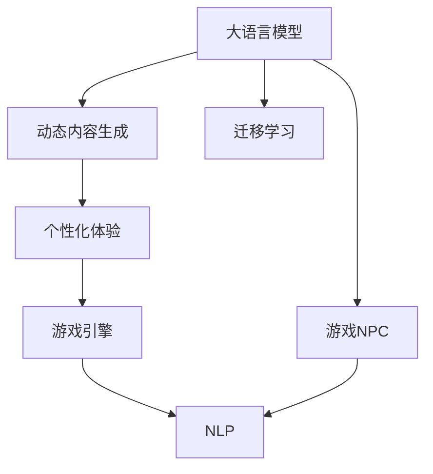

                 

## 1. 背景介绍

随着人工智能技术的快速发展，大语言模型（LLM）在游戏行业的应用正逐渐兴起。相较于传统的基于规则和脚本的NPC行为生成，LLM能够通过深度学习的方式，动态生成符合游戏世界观、逻辑和规则的复杂行为和内容。这不仅提高了游戏的丰富度，还为玩家提供了更加个性化的游戏体验。然而，LLM在游戏行业的应用仍处于起步阶段，面临诸多挑战。本文将从LLM在游戏行业的应用背景、核心概念、算法原理、实际应用等方面进行深入探讨。

## 2. 核心概念与联系

### 2.1 核心概念概述

为帮助读者更好地理解LLM在游戏行业的应用，本节将介绍几个关键概念：

- 大语言模型（Large Language Model, LLM）：基于自回归模型（如GPT）或自编码模型（如BERT）构建的大型预训练语言模型。通过大规模无标签文本数据的预训练，LLM可以学习到丰富的语言知识，具备强大的自然语言理解和生成能力。

- 游戏NPC（Non-Player Character）：指在游戏中扮演角色并执行特定任务的虚拟角色。NPC的行为和语言是影响游戏体验的关键因素。

- 动态内容生成：指在游戏中实时生成动态变化的文本、对话、剧情等内容，以提升游戏的沉浸感和互动性。

- 个性化体验：根据玩家的行为和偏好，实时调整游戏内容和难度，提供量身定制的游戏体验。

- 自然语言处理（NLP）：包括文本分析、语音识别、情感分析等，涉及将自然语言转化为计算机可处理的数据。

- 游戏引擎（Game Engine）：用于构建和运行游戏内容的软件框架。

- 迁移学习（Transfer Learning）：指将预训练模型应用于特定领域或任务的过程。

以上概念之间的联系和作用可以通过以下Mermaid流程图来展示：



这个流程图展示了LLM在游戏行业中的作用和应用流程：

1. LLM通过预训练学习语言知识，应用于游戏NPC的行为生成。
2. 动态内容生成利用LLM生成实时变化的文本、对话和剧情，提升游戏互动性。
3. 个性化体验通过分析玩家行为和偏好，调整游戏内容和难度。
4. 游戏引擎集成LLM和NLP技术，驱动游戏内容的动态生成和玩家交互。
5. 迁移学习将预训练模型应用于特定游戏任务，提升模型性能。

## 3. 核心算法原理 & 具体操作步骤

### 3.1 算法原理概述

LLM在游戏NPC行为生成和动态内容生成中的应用，主要基于以下算法原理：

- 预训练：通过大规模无标签文本数据，预训练出一个具有丰富语言知识和语境理解能力的LLM模型。

- 迁移学习：将预训练的LLM模型应用于特定游戏任务，通过少量的标注数据进行微调，以适应游戏场景和规则。

- 动态生成：在游戏运行时，将LLM作为内容生成器，根据游戏世界的状态和玩家行为，生成动态变化的文本、对话和剧情。

- 个性化调整：根据玩家的反馈和行为，动态调整游戏内容和难度，提供个性化的游戏体验。

### 3.2 算法步骤详解

下面详细介绍LLM在游戏行业应用的具体算法步骤：

**Step 1: 数据准备**

- 收集游戏相关数据：包括游戏剧本、对话、背景故事等，作为预训练数据。
- 数据预处理：清洗、分词、标注等，将数据转化为可用于预训练和微调的形式。

**Step 2: 模型预训练**

- 选择合适的预训练模型（如GPT、BERT等），并进行大规模预训练。
- 预训练任务设计：包括掩码语言模型、下一句预测等，使模型学习到丰富的语言知识和语境理解能力。

**Step 3: 模型微调**

- 选择合适的游戏任务，准备标注数据。
- 将预训练模型应用于游戏任务，通过少量标注数据进行微调。
- 调整超参数，如学习率、批大小、迭代轮数等，以获得最佳微调效果。

**Step 4: 动态内容生成**

- 在游戏运行时，将微调后的模型应用于NPC行为生成和动态内容生成。
- 动态生成文本、对话和剧情，根据游戏世界的状态和玩家行为进行调整。

**Step 5: 个性化体验**

- 通过分析玩家行为和偏好，实时调整游戏内容和难度。
- 提供个性化的游戏体验，增强游戏的吸引力和沉浸感。

**Step 6: 评估与优化**

- 在游戏测试阶段，评估动态内容和个性化体验的效果。
- 根据评估结果，对模型和算法进行优化，以提升游戏体验。

### 3.3 算法优缺点

LLM在游戏行业中的应用具有以下优点：

- 动态生成能力强：LLM可以实时生成动态变化的文本、对话和剧情，提高游戏的沉浸感和互动性。
- 个性化体验丰富：通过分析玩家行为和偏好，提供量身定制的游戏体验。
- 学习能力强：LLM具备强大的语境理解和生成能力，适应复杂的游戏场景。

同时，LLM在游戏行业中也存在一些缺点：

- 数据需求大：LLM的预训练和微调需要大量标注数据，在游戏开发初期可能难以满足。
- 计算资源消耗大：预训练和微调过程需要大量的计算资源，可能增加游戏开发的成本。
- 过拟合风险高：LLM在游戏环境中的表现可能受到特定场景的限制，存在过拟合风险。

### 3.4 算法应用领域

LLM在游戏行业的应用领域非常广泛，以下是几个主要方向：

- 游戏NPC行为生成：通过LLM生成NPC的对话和行为，使NPC更加智能化和富有互动性。
- 动态剧情生成：利用LLM生成随机剧情和对话，增强游戏的故事情节和互动性。
- 个性化推荐：根据玩家的行为和偏好，提供个性化的游戏推荐和道具。
- 情感分析：分析玩家情感和行为，优化游戏内容和难度，提升玩家满意度。
- 客服机器人：通过LLM构建游戏客服机器人，提供实时帮助和客服支持。

## 4. 数学模型和公式 & 详细讲解 & 举例说明

### 4.1 数学模型构建

为了更好地理解LLM在游戏行业的应用，我们将从数学模型角度进行详细讲解。

假设我们有一个游戏场景，NPC需要根据玩家的行为和游戏世界的状态，生成对话和行为。我们可以将NPC的行为生成视为一个优化问题，目标是最小化NPC行为和玩家行为的差异度。

### 4.2 公式推导过程

设$x$为玩家行为，$y$为NPC行为，我们可以构建以下优化目标函数：

$$
\min_{y} \sum_{i=1}^{n} \| y_i - f(x_i) \|^2
$$

其中，$n$为玩家行为的数量，$y_i$为NPC在玩家行为$i$下的行为，$f(x_i)$为LLM根据玩家行为$x_i$生成的NPC行为。

为了简化计算，我们可以引入注意力机制，对玩家行为进行加权处理：

$$
y_i = \sum_{j=1}^{m} \alpha_{ij} f(x_j)
$$

其中，$m$为玩家行为的历史长度，$\alpha_{ij}$为注意力权重，$f(x_j)$为LLM对玩家行为$x_j$的生成结果。

### 4.3 案例分析与讲解

假设我们要生成一个NPC在玩家选择一条道具后的对话，我们可以将玩家的选择作为输入，通过LLM生成对话内容。具体步骤如下：

1. 收集玩家选择道具的样本，作为训练数据。
2. 将训练数据输入LLM进行预训练。
3. 准备游戏场景，将玩家选择作为输入，LLM输出对应的NPC对话。
4. 根据玩家反馈，调整LLM的注意力权重，优化NPC对话生成。

## 5. 项目实践：代码实例和详细解释说明

### 5.1 开发环境搭建

在进行LLM在游戏行业的应用实践时，我们需要准备好开发环境。以下是使用Python进行PyTorch开发的环境配置流程：

1. 安装Anaconda：从官网下载并安装Anaconda，用于创建独立的Python环境。

2. 创建并激活虚拟环境：
```bash
conda create -n pytorch-env python=3.8 
conda activate pytorch-env
```

3. 安装PyTorch：根据CUDA版本，从官网获取对应的安装命令。例如：
```bash
conda install pytorch torchvision torchaudio cudatoolkit=11.1 -c pytorch -c conda-forge
```

4. 安装Transformer库：
```bash
pip install transformers
```

5. 安装各类工具包：
```bash
pip install numpy pandas scikit-learn matplotlib tqdm jupyter notebook ipython
```

完成上述步骤后，即可在`pytorch-env`环境中开始应用实践。

### 5.2 源代码详细实现

以下是一个简单的代码示例，展示如何使用Transformers库进行NPC行为生成和动态剧情生成：

```python
from transformers import GPT2LMHeadModel, GPT2Tokenizer

# 加载预训练模型和分词器
model = GPT2LMHeadModel.from_pretrained('gpt2')
tokenizer = GPT2Tokenizer.from_pretrained('gpt2')

# 定义NPC对话生成函数
def generate_npc_dIALOGUE(player_choice):
    # 将玩家选择转换为分词器可处理的形式
    inputs = tokenizer(player_choice, return_tensors='pt')
    
    # 生成NPC对话
    outputs = model.generate(**inputs, max_length=50, temperature=0.9)
    
    # 将生成结果转换为文本形式
    npc_dIALOGUE = tokenizer.decode(outputs[0], skip_special_tokens=True)
    return npc_dIALOGUE

# 测试NPC对话生成
player_choice = "选择道具：剑"
npc_dIALOGUE = generate_npc_dIALOGUE(player_choice)
print(npc_dIALOGUE)
```

### 5.3 代码解读与分析

这里我们详细解读一下关键代码的实现细节：

**generate_npc_dIALOGUE函数**：
- 将玩家选择转换为分词器可处理的形式，并作为输入。
- 使用GPT2模型生成NPC对话，并控制生成结果的随机性。
- 将生成结果解码为文本形式，并返回。

**NPC对话生成**：
- 我们首先定义了一个NPC对话生成函数，通过接收玩家选择作为输入，调用LLM模型生成对应的NPC对话。
- 通过设置温度参数控制生成结果的随机性，使其更加自然流畅。
- 最后将生成结果解码为文本形式，返回给游戏。

## 6. 实际应用场景

### 6.1 智能客服系统

在游戏开发过程中，智能客服系统是不可或缺的一部分。传统客服系统依赖人工客服，难以满足24小时不间断的需求，且客服质量和效率难以保证。通过LLM在游戏中的应用，可以构建智能客服系统，提高玩家咨询体验和问题解决效率。

在技术实现上，可以收集游戏历史客服数据，将常见问题和最佳答复构建成监督数据，在此基础上对预训练模型进行微调。微调后的模型能够自动理解玩家意图，匹配最合适的答案模板进行回复。对于复杂问题，可以接入检索系统实时搜索相关内容，动态组织生成回答。如此构建的智能客服系统，能大幅提升玩家咨询体验和问题解决效率。

### 6.2 情感分析

情感分析是游戏开发中非常重要的一环，可以帮助开发者及时了解玩家情感状态，优化游戏内容和难度，提升玩家满意度。通过LLM在游戏中的应用，可以实现实时情感分析，提供个性化的游戏体验。

具体而言，可以收集玩家在游戏中的行为数据，并对其进行情感分析。通过分析玩家的情绪变化，优化游戏内容和难度，提升玩家满意度。例如，如果玩家在游戏中表现出负面情绪，可以调整游戏难度或增加奖励，以鼓励玩家继续游戏。

### 6.3 动态剧情生成

动态剧情生成是游戏开发中的一个重要功能，可以使游戏更加丰富和有趣。通过LLM在游戏中的应用，可以实现动态剧情生成，增强游戏的故事情节和互动性。

具体而言，可以收集游戏剧情数据，并对其进行预训练。在玩家进行游戏时，将玩家行为作为输入，LLM生成对应的剧情内容。通过动态生成剧情，增加游戏的变数和惊喜，提升玩家的参与度和体验感。

### 6.4 未来应用展望

随着LLM在游戏行业的应用不断深入，未来将会有更多的应用场景和创新实践。

1. 智能推荐系统：通过分析玩家行为和偏好，提供个性化的游戏推荐和道具。
2. 游戏内容优化：根据玩家反馈和行为，实时调整游戏内容和难度，提升游戏体验。
3. 虚拟世界构建：通过LLM构建虚拟世界，增强游戏的沉浸感和互动性。
4. 人工智能开发：利用LLM在游戏开发中积累的经验，提升人工智能技术的开发和应用。

未来，LLM在游戏行业的应用将更加广泛，推动游戏产业的技术进步和创新发展。

## 7. 工具和资源推荐

### 7.1 学习资源推荐

为了帮助开发者系统掌握LLM在游戏行业的应用，这里推荐一些优质的学习资源：

1. 《Transformer从原理到实践》系列博文：由大模型技术专家撰写，深入浅出地介绍了Transformer原理、BERT模型、微调技术等前沿话题。

2. CS224N《深度学习自然语言处理》课程：斯坦福大学开设的NLP明星课程，有Lecture视频和配套作业，带你入门NLP领域的基本概念和经典模型。

3. 《Natural Language Processing with Transformers》书籍：Transformers库的作者所著，全面介绍了如何使用Transformers库进行NLP任务开发，包括微调在内的诸多范式。

4. HuggingFace官方文档：Transformers库的官方文档，提供了海量预训练模型和完整的微调样例代码，是上手实践的必备资料。

5. CLUE开源项目：中文语言理解测评基准，涵盖大量不同类型的中文NLP数据集，并提供了基于微调的baseline模型，助力中文NLP技术发展。

通过对这些资源的学习实践，相信你一定能够快速掌握LLM在游戏行业的应用精髓，并用于解决实际的NLP问题。

### 7.2 开发工具推荐

高效的开发离不开优秀的工具支持。以下是几款用于LLM在游戏行业开发常用的工具：

1. PyTorch：基于Python的开源深度学习框架，灵活动态的计算图，适合快速迭代研究。大部分预训练语言模型都有PyTorch版本的实现。

2. TensorFlow：由Google主导开发的开源深度学习框架，生产部署方便，适合大规模工程应用。同样有丰富的预训练语言模型资源。

3. Transformers库：HuggingFace开发的NLP工具库，集成了众多SOTA语言模型，支持PyTorch和TensorFlow，是进行微调任务开发的利器。

4. Weights & Biases：模型训练的实验跟踪工具，可以记录和可视化模型训练过程中的各项指标，方便对比和调优。与主流深度学习框架无缝集成。

5. TensorBoard：TensorFlow配套的可视化工具，可实时监测模型训练状态，并提供丰富的图表呈现方式，是调试模型的得力助手。

6. Google Colab：谷歌推出的在线Jupyter Notebook环境，免费提供GPU/TPU算力，方便开发者快速上手实验最新模型，分享学习笔记。

合理利用这些工具，可以显著提升LLM在游戏行业的应用开发效率，加快创新迭代的步伐。

### 7.3 相关论文推荐

LLM在游戏行业的应用源于学界的持续研究。以下是几篇奠基性的相关论文，推荐阅读：

1. Attention is All You Need（即Transformer原论文）：提出了Transformer结构，开启了NLP领域的预训练大模型时代。

2. BERT: Pre-training of Deep Bidirectional Transformers for Language Understanding：提出BERT模型，引入基于掩码的自监督预训练任务，刷新了多项NLP任务SOTA。

3. Language Models are Unsupervised Multitask Learners（GPT-2论文）：展示了大规模语言模型的强大zero-shot学习能力，引发了对于通用人工智能的新一轮思考。

4. Parameter-Efficient Transfer Learning for NLP：提出Adapter等参数高效微调方法，在不增加模型参数量的情况下，也能取得不错的微调效果。

5. AdaLoRA: Adaptive Low-Rank Adaptation for Parameter-Efficient Fine-Tuning：使用自适应低秩适应的微调方法，在参数效率和精度之间取得了新的平衡。

这些论文代表了大语言模型在游戏行业的应用发展脉络。通过学习这些前沿成果，可以帮助研究者把握学科前进方向，激发更多的创新灵感。

## 8. 总结：未来发展趋势与挑战

### 8.1 总结

本文对LLM在游戏行业的应用进行了全面系统的介绍。首先阐述了LLM在游戏行业的应用背景，明确了动态内容和个性化体验的独特价值。其次，从原理到实践，详细讲解了LLM在游戏行业应用的数学模型和算法步骤，给出了微调任务开发的完整代码实例。同时，本文还广泛探讨了LLM在游戏行业的应用场景和未来发展趋势，展示了LLM在游戏行业的应用潜力。

通过本文的系统梳理，可以看到，LLM在游戏行业的应用为游戏内容动态生成和个性化体验提供了新的解决方案，极大地提升了游戏的丰富度和互动性。未来，伴随LLM在游戏行业的应用不断深入，将带来更多的创新实践和应用突破。

### 8.2 未来发展趋势

展望未来，LLM在游戏行业的应用将呈现以下几个发展趋势：

1. 动态内容生成能力更强：随着LLM技术的不断发展，动态内容生成将变得更加智能和丰富，游戏剧情和互动性将进一步提升。

2. 个性化体验更加精准：通过更深入的玩家行为分析，LLM将能够提供更加精准和个性化的游戏体验，提升玩家满意度和忠诚度。

3. 虚拟世界构建更加真实：利用LLM构建虚拟世界，实现更真实的游戏场景和角色互动，增强游戏的沉浸感和吸引力。

4. 跨领域应用更广泛：LLM在游戏行业的应用将推动NLP技术在更多领域的应用，推动人工智能技术的全面发展。

以上趋势凸显了LLM在游戏行业的应用前景，为游戏产业的技术进步和创新发展提供了新的方向。

### 8.3 面临的挑战

尽管LLM在游戏行业的应用已经取得了显著成果，但在迈向更加智能化、普适化应用的过程中，它仍面临着诸多挑战：

1. 数据需求量大：LLM在游戏环境中的表现需要大量标注数据，在游戏开发初期可能难以满足。

2. 计算资源消耗大：预训练和微调过程需要大量的计算资源，可能增加游戏开发的成本。

3. 过拟合风险高：LLM在游戏环境中的表现可能受到特定场景的限制，存在过拟合风险。

4. 知识整合能力不足：现有的LLM模型往往局限于游戏数据，难以灵活吸收和运用更广泛的先验知识。

5. 伦理和安全问题：LLM在游戏行业的应用可能涉及隐私和伦理问题，需要进一步完善相关机制。

6. 系统稳定性问题：LLM在游戏中的表现可能会受到环境变化的影响，需要进一步优化系统稳定性。

### 8.4 研究展望

面对LLM在游戏行业面临的挑战，未来的研究需要在以下几个方面寻求新的突破：

1. 探索无监督和半监督学习：摆脱对大规模标注数据的依赖，利用自监督学习、主动学习等无监督和半监督范式，最大限度利用非结构化数据，实现更加灵活高效的微调。

2. 研究参数高效和计算高效的微调范式：开发更加参数高效的微调方法，在固定大部分预训练参数的情况下，只更新极少量的任务相关参数。同时优化微调模型的计算图，减少前向传播和反向传播的资源消耗，实现更加轻量级、实时性的部署。

3. 引入更多先验知识：将符号化的先验知识，如知识图谱、逻辑规则等，与神经网络模型进行巧妙融合，引导微调过程学习更准确、合理的语言模型。同时加强不同模态数据的整合，实现视觉、语音等多模态信息与文本信息的协同建模。

4. 结合因果分析和博弈论工具：将因果分析方法引入微调模型，识别出模型决策的关键特征，增强输出解释的因果性和逻辑性。借助博弈论工具刻画人机交互过程，主动探索并规避模型的脆弱点，提高系统稳定性。

5. 纳入伦理道德约束：在模型训练目标中引入伦理导向的评估指标，过滤和惩罚有偏见、有害的输出倾向。同时加强人工干预和审核，建立模型行为的监管机制，确保输出符合人类价值观和伦理道德。

这些研究方向将推动LLM在游戏行业的应用向更深层次发展，为游戏产业带来更多的创新和突破。只有勇于创新、敢于突破，才能不断拓展LLM在游戏行业的边界，让智能技术更好地造福人类社会。

## 9. 附录：常见问题与解答

**Q1：LLM在游戏行业中是否适用于所有游戏类型？**

A: LLM在游戏行业中的应用并不是所有的游戏类型都适用。对于需要高度精确控制和逻辑复杂的游戏，如MOBA、RPG等，LLM可能无法完全替代传统的游戏设计。但对于注重故事叙述和角色互动的游戏，如ARPG、角色扮演游戏等，LLM能够提供丰富多样的游戏内容和动态生成能力，增强游戏的沉浸感和互动性。

**Q2：LLM在游戏开发中的成本是否较高？**

A: LLM在游戏开发中的成本主要来自两个方面：数据准备和计算资源消耗。数据准备需要收集和标注大量的游戏数据，这些数据通常需要专业人员进行人工标注，成本较高。计算资源消耗主要体现在预训练和微调过程中，需要使用高性能的GPU/TPU设备，成本也较高。因此，在开发初期需要合理规划，确保数据质量和计算资源充足。

**Q3：LLM在游戏中的应用是否会导致游戏出现bug？**

A: LLM在游戏中的应用可能会导致一些bug，但通过合理的设计和优化，可以减少bug的出现。例如，可以引入模型监控机制，实时监测模型输出，发现异常及时调整。同时，对于重要的游戏功能，建议采用多模型集成的方式，提高系统的稳定性和可靠性。

**Q4：如何优化LLM在游戏中的应用？**

A: 优化LLM在游戏中的应用可以从以下几个方面入手：

1. 数据优化：通过数据增强、数据清洗等手段，提高数据的质量和多样性。

2. 模型优化：使用更高效的模型结构，如参数高效的微调方法、自适应低秩适应等，减少计算资源消耗。

3. 系统优化：合理设计系统架构，优化计算图，减少前向和反向传播的资源消耗。

4. 运行优化：采用梯度积累、混合精度训练等技术，提高模型的训练效率和推理速度。

通过以上优化措施，可以显著提升LLM在游戏中的应用效果和稳定性。

**Q5：LLM在游戏中的应用是否会带来伦理和安全问题？**

A: LLM在游戏中的应用可能会涉及隐私和伦理问题。例如，在游戏中的对话生成可能会涉及玩家的个人信息，需要合理保护。同时，游戏中的NPC行为可能会受到玩家的行为影响，需要考虑伦理道德和公平性问题。为了解决这些问题，建议在设计和实现LLM应用时，加入伦理导向的评估指标，确保模型的行为符合人类价值观和伦理道德。

---

作者：禅与计算机程序设计艺术 / Zen and the Art of Computer Programming

