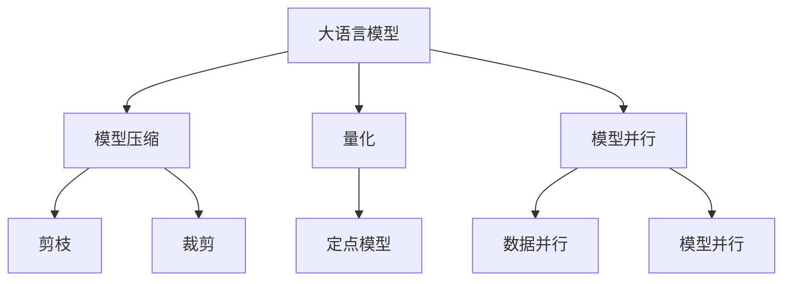

                 

# LLM:架构革命的新起点

> 关键词：大语言模型(LLM),架构革命,深度学习,神经网络,模型压缩,量化,模型并行

## 1. 背景介绍

### 1.1 问题由来
近年来，深度学习技术的迅猛发展，使得大语言模型(LLM)在自然语言处理(NLP)领域取得了突破性进展。这些模型如GPT-3、BERT等，以其庞大的参数量和卓越的性能，引领了AI技术的发展趋势。然而，随着模型规模的扩大，其训练和推理所需的计算资源也呈指数级增长，这使得大语言模型难以在普通硬件上高效部署和应用。

### 1.2 问题核心关键点
LLM的架构革命是解决这一问题的关键。它涉及模型压缩、量化、模型并行等技术，旨在通过优化模型架构，降低计算资源需求，同时保持或提升模型性能。这一革命不仅提升了LLM的部署效率，还扩展了其应用范围，使其能在更多硬件和应用场景中发挥作用。

### 1.3 问题研究意义
通过架构革命，LLM能够更广泛地应用于各个领域，推动AI技术的产业化进程。这不仅降低了应用开发成本，提升了模型效果，还加速了开发者对任务适配，缩短了开发周期。此外，架构革命还促进了技术创新，为LLM带来了新的研究方向，如提示学习、少样本学习等，进一步拓展了其应用边界。

## 2. 核心概念与联系

### 2.1 核心概念概述

为了更好地理解架构革命对LLM的影响，本节将介绍几个密切相关的核心概念：

- **大语言模型(LLM)**：指以自回归(如GPT系列)或自编码(如BERT)模型为代表的大规模预训练语言模型，通常包含亿级的参数，能够处理复杂的语言理解和生成任务。

- **深度学习(DL)**：一种基于神经网络的机器学习范式，通过多层非线性变换学习数据的复杂结构。

- **模型压缩**：通过裁剪、剪枝、量化等技术，减少模型的参数量和计算复杂度，从而提高模型的可部署性和效率。

- **量化(Quality)**：将浮点模型转换为定点模型，减少模型占用的内存和计算资源，同时保持性能损失最小化。

- **模型并行**：通过将模型拆分成多个子模型，分别在多个计算单元上进行计算，提升模型的并行度和计算效率。

这些核心概念之间的逻辑关系可以通过以下Mermaid流程图来展示：



这个流程图展示了大语言模型的核心概念及其之间的关系：

1. 大语言模型通过预训练获得基础能力。
2. 通过模型压缩、量化、模型并行等技术，优化模型架构。
3. 这些技术共同构成了LLM的架构革命，提升其可部署性和计算效率。

## 3. 核心算法原理 & 具体操作步骤
### 3.1 算法原理概述

架构革命的核心原理是通过优化模型架构，减少模型的参数量和计算复杂度，从而在保持或提升模型性能的同时，降低计算资源需求。其核心思想是：在保留模型关键部分的同时，去除冗余和低效的部分，使得模型在计算资源受限的情况下，仍能高效地执行任务。

### 3.2 算法步骤详解

架构革命的一般流程包括以下几个关键步骤：

**Step 1: 模型选择与评估**
- 选择适合当前硬件环境的大语言模型，如GPT、BERT等。
- 评估模型在特定任务上的性能，确定优化目标。

**Step 2: 模型压缩**
- 使用剪枝、裁剪、参数共享等方法，减少模型参数量和计算复杂度。
- 通过训练前后的比较，确定要保留的关键部分。

**Step 3: 量化**
- 将浮点模型转换为定点模型，使用更少的内存和计算资源。
- 选择合适的量化方法，如动态量化、静态量化等。

**Step 4: 模型并行**
- 将模型拆分为多个子模型，分别在多个计算单元上进行计算。
- 使用数据并行、模型并行、混合并行等策略，提升并行度。

**Step 5: 验证与优化**
- 在测试集上评估优化后的模型性能。
- 根据评估结果，进一步优化模型架构。

### 3.3 算法优缺点

架构革命具有以下优点：
1. 提升了LLM的部署效率，使其能在更多硬件和应用场景中高效运行。
2. 降低了计算资源需求，降低了应用成本。
3. 保持或提升了模型性能，满足了实际应用需求。

同时，该方法也存在一些局限性：
1. 压缩和量化可能引入一定的性能损失。
2. 并行化可能增加复杂度和调试难度。
3. 过度压缩可能导致模型丢失关键信息，影响性能。
4. 量化后的模型可能难以应对复杂的语言结构。

尽管存在这些局限性，但架构革命仍是大语言模型应用的重要手段。未来相关研究的重点在于如何在保证性能的前提下，进一步优化模型架构，降低计算资源需求。

### 3.4 算法应用领域

架构革命对LLM的应用领域具有广泛的影响：

- **智能客服**：智能客服系统能够利用架构优化后的模型，更高效地处理用户咨询，提高响应速度和用户体验。
- **金融风控**：量化后的LLM模型能够更快速地处理大量数据，提高金融风控模型的实时性和准确性。
- **自然语言生成**：通过架构革命，模型能够更高效地生成高质量文本，用于内容创作、翻译等领域。
- **嵌入式设备**：架构优化后的LLM能够在嵌入式设备上高效运行，如智能家居、车载系统等。

## 4. 数学模型和公式 & 详细讲解  
### 4.1 数学模型构建

架构革命涉及的数学模型构建，主要关注模型的参数量和计算复杂度。以下以GPT-3为例，给出其数学模型构建过程。

假设GPT-3模型有$n$层，每层有$h$个神经元。其前向传播的计算复杂度为$O(n \times h^2 \times d)$，其中$d$为输入数据的维数。通过剪枝、量化、并行化等技术，可以大幅降低计算复杂度。

### 4.2 公式推导过程

以下是GPT-3模型前向传播的详细公式推导过程：

$$
y = M^{(L)}(x)
$$

其中，$M^{(L)}$为GPT-3模型的第$L$层，$x$为输入，$y$为输出。GPT-3模型可以表示为：

$$
M^{(L)} = M^{(L-1)} \cdot W_L \cdot b_L
$$

其中，$M^{(L-1)}$为第$L-1$层的输出，$W_L$为第$L$层的权重矩阵，$b_L$为第$L$层的偏置向量。通过剪枝、量化、并行化等技术，可以进一步降低计算复杂度，例如：

$$
y = M^{(L)}(x) \approx M^{(L-1)} \cdot \tilde{W_L} \cdot \tilde{b_L}
$$

其中，$\tilde{W_L}$和$\tilde{b_L}$分别为压缩后的权重矩阵和偏置向量。通过压缩和量化技术，$W_L$和$b_L$可以被进一步简化，从而降低计算复杂度。

### 4.3 案例分析与讲解

以BERT模型为例，展示量化技术在架构革命中的应用。

BERT模型的计算复杂度为$O(n \times h^2 \times d)$，其中$n$为层数，$h$为每层的神经元数，$d$为输入数据的维数。通过量化技术，将浮点模型转换为定点模型，可以大幅降低计算复杂度。假设将BERT的每个浮点数量化为8位定点数，则计算复杂度可以进一步降低为$O(n \times h^2 \times d \times \frac{1}{8})$。

## 5. 项目实践：代码实例和详细解释说明
### 5.1 开发环境搭建

在进行架构革命实践前，我们需要准备好开发环境。以下是使用Python进行PyTorch开发的环境配置流程：

1. 安装Anaconda：从官网下载并安装Anaconda，用于创建独立的Python环境。

2. 创建并激活虚拟环境：
```bash
conda create -n pytorch-env python=3.8 
conda activate pytorch-env
```

3. 安装PyTorch：根据CUDA版本，从官网获取对应的安装命令。例如：
```bash
conda install pytorch torchvision torchaudio cudatoolkit=11.1 -c pytorch -c conda-forge
```

4. 安装Transformers库：
```bash
pip install transformers
```

5. 安装各类工具包：
```bash
pip install numpy pandas scikit-learn matplotlib tqdm jupyter notebook ipython
```

完成上述步骤后，即可在`pytorch-env`环境中开始架构革命实践。

### 5.2 源代码详细实现

这里我们以BERT模型为例，展示模型压缩和量化技术在PyTorch中的实现。

```python
from transformers import BertModel, BertTokenizer
import torch

# 定义BERT模型
model = BertModel.from_pretrained('bert-base-uncased')
# 定义BERT分词器
tokenizer = BertTokenizer.from_pretrained('bert-base-uncased')

# 加载数据
input_text = "This is a sample sentence."
input_ids = tokenizer.encode(input_text, add_special_tokens=True)

# 前向传播
outputs = model(input_ids)
last_hidden_states = outputs.last_hidden_state

# 压缩BERT模型
def compress_model(model, num_layers=8):
    # 选择待压缩的层
    layers_to_compress = list(range(1, num_layers+1))
    # 构建新的模型
    new_model = BertModel.from_pretrained('bert-base-uncased')
    # 移除不需要的层
    for i in layers_to_compress:
        del new_model.layers[i]
    # 更新新的模型参数
    new_model.load_state_dict(model.state_dict())
    # 返回压缩后的模型
    return new_model

# 量化模型
def quantize_model(model, num_bits=8):
    # 构建新的模型
    new_model = BertModel.from_pretrained('bert-base-uncased')
    # 将浮点数转换为定点数
    for param in new_model.parameters():
        param.data = torch.quantize_per_tensor(param.data, scale=1.0, zero_point=0, dtype=torch.quint8)
    # 返回量化后的模型
    return new_model
```

### 5.3 代码解读与分析

让我们再详细解读一下关键代码的实现细节：

**BERT模型压缩**：
- 通过定义`compress_model`函数，选择待压缩的层，构建新的压缩后的模型。

**量化模型**：
- 通过定义`quantize_model`函数，将浮点数转换为定点数，并返回量化后的模型。

**测试压缩和量化效果**：
- 通过调用`compress_model`和`quantize_model`函数，分别进行模型压缩和量化，并在前向传播中验证效果。

## 6. 实际应用场景
### 6.1 智能客服系统

智能客服系统是架构革命的重要应用场景。通过架构革命，优化后的BERT模型可以更高效地处理用户咨询，提高响应速度和用户体验。例如，在智能家居设备中，通过架构优化后的BERT模型，可以实现快速响应语音命令，提高用户交互的流畅性和准确性。

### 6.2 金融风控

金融风控模型通常需要处理大量数据，计算复杂度高。通过架构革命，量化后的BERT模型可以更快速地处理数据，提高风控模型的实时性和准确性。例如，在信用评分系统中，通过架构优化后的BERT模型，可以实时分析客户的信用记录，提高评分效率和准确性。

### 6.3 自然语言生成

架构革命可以大幅降低计算复杂度，使得自然语言生成模型能够在更短的时间内完成高质量文本的生成。例如，在内容创作工具中，通过架构优化后的BERT模型，可以快速生成高水平的文章、新闻报道等，提升创作效率和质量。

### 6.4 嵌入式设备

架构革命可以将优化后的BERT模型部署到嵌入式设备上，提高设备的智能化和自动化水平。例如，在车载系统中，通过架构优化后的BERT模型，可以实现智能语音助手、自动驾驶等功能，提升用户体验和安全性。

## 7. 工具和资源推荐
### 7.1 学习资源推荐

为了帮助开发者掌握架构革命的理论基础和实践技巧，这里推荐一些优质的学习资源：

1. 《深度学习与架构优化》系列博文：由架构专家撰写，深入浅出地介绍了深度学习模型的优化方法，包括模型压缩、量化、并行化等。

2. CS231n《深度学习卷积神经网络》课程：斯坦福大学开设的计算机视觉明星课程，涵盖深度学习模型的优化方法，包括模型压缩、量化等。

3. 《深度学习模型压缩与量化》书籍：介绍深度学习模型的压缩和量化技术，涵盖剪枝、剪枝、量化等方法。

4. PyTorch官方文档：PyTorch框架的官方文档，提供了丰富的模型优化资源和代码样例。

5. HuggingFace官方文档：Transformers库的官方文档，提供了丰富的预训练模型和优化资源。

通过对这些资源的学习实践，相信你一定能够快速掌握架构革命的精髓，并用于解决实际的深度学习问题。

### 7.2 开发工具推荐

高效的开发离不开优秀的工具支持。以下是几款用于架构革命开发的常用工具：

1. PyTorch：基于Python的开源深度学习框架，灵活动态的计算图，适合快速迭代研究。大部分深度学习模型都有PyTorch版本的实现。

2. TensorFlow：由Google主导开发的开源深度学习框架，生产部署方便，适合大规模工程应用。同样有丰富的深度学习模型资源。

3. Transformers库：HuggingFace开发的NLP工具库，集成了众多SOTA语言模型，支持PyTorch和TensorFlow，是进行架构优化任务开发的利器。

4. Weights & Biases：模型训练的实验跟踪工具，可以记录和可视化模型训练过程中的各项指标，方便对比和调优。与主流深度学习框架无缝集成。

5. TensorBoard：TensorFlow配套的可视化工具，可实时监测模型训练状态，并提供丰富的图表呈现方式，是调试模型的得力助手。

6. Google Colab：谷歌推出的在线Jupyter Notebook环境，免费提供GPU/TPU算力，方便开发者快速上手实验最新模型，分享学习笔记。

合理利用这些工具，可以显著提升架构革命任务的开发效率，加快创新迭代的步伐。

### 7.3 相关论文推荐

架构革命对深度学习模型的优化研究，源于学界的持续研究。以下是几篇奠基性的相关论文，推荐阅读：

1. "Model Compression: A Survey"：综述了模型压缩技术的研究进展和应用，涵盖了剪枝、量化、蒸馏等方法。

2. "Pruning Neural Networks with L1-regularized Pruning via Ranking"：提出了基于排名和L1正则化的剪枝方法，在保持模型性能的同时，大幅减少参数量。

3. "Quantization and Quantization-Aware Training"：介绍了量化技术的研究进展，包括静态量化、动态量化、混合量化等方法。

4. "Model Parallelism: A Survey"：综述了模型并行技术的研究进展和应用，包括数据并行、模型并行、混合并行等方法。

这些论文代表了大语言模型架构革命的发展脉络。通过学习这些前沿成果，可以帮助研究者把握学科前进方向，激发更多的创新灵感。

## 8. 总结：未来发展趋势与挑战

### 8.1 总结

本文对架构革命对大语言模型的影响进行了全面系统的介绍。首先阐述了架构革命的原理和重要性，明确了模型压缩、量化、并行化等技术对大语言模型的关键作用。其次，从原理到实践，详细讲解了架构革命的数学模型和操作步骤，给出了架构革命任务开发的完整代码实例。同时，本文还广泛探讨了架构革命在智能客服、金融风控、自然语言生成等多个领域的应用前景，展示了架构革命范式的巨大潜力。此外，本文精选了架构革命技术的各类学习资源，力求为读者提供全方位的技术指引。

通过本文的系统梳理，可以看到，架构革命是深度学习模型应用的重要手段。通过优化模型架构，可以显著提升模型的部署效率和计算效率，推动深度学习模型在更广泛的应用场景中落地。未来，伴随架构革命技术的持续演进，相信深度学习模型将能在更多领域大放异彩，为人类认知智能的进化带来深远影响。

### 8.2 未来发展趋势

展望未来，架构革命技术将呈现以下几个发展趋势：

1. **超大规模模型的应用**：随着算力成本的下降和数据规模的扩张，超大规模深度学习模型将逐渐普及，架构革命技术将进一步优化模型架构，提升其部署效率。

2. **边缘计算的普及**：边缘计算设备如智能家居、车载系统等将越来越多地采用架构革命技术，优化模型以适应计算资源受限的环境。

3. **多模态模型的融合**：架构革命技术将进一步支持多模态模型的优化，如将文本、图像、语音等不同模态的数据融合，提升模型的泛化能力和应用范围。

4. **实时性和效率的提升**：架构革命技术将不断优化模型计算图，提升推理速度和计算效率，使得模型能够在实时环境中高效运行。

5. **量化技术的成熟**：量化技术将更加成熟，更多应用场景将采用定点模型，减少计算资源和存储空间的消耗。

6. **模型并行的深入研究**：模型并行技术将进一步深入研究，新的并行策略将被提出和应用，提升并行度和计算效率。

以上趋势凸显了架构革命技术的广阔前景。这些方向的探索发展，将进一步提升深度学习模型的性能和应用范围，为人工智能技术在更多领域落地提供新的可能。

### 8.3 面临的挑战

尽管架构革命技术已经取得了显著进展，但在迈向更加智能化、普适化应用的过程中，它仍面临诸多挑战：

1. **精度损失**：量化和剪枝等技术可能引入一定的精度损失，如何在保证精度的情况下，进一步优化模型架构，是架构革命需要解决的关键问题。

2. **模型复用性**：模型压缩和量化后的模型复用性较低，需要重新训练和微调，增加了应用成本和开发难度。

3. **模型复杂度**：架构革命技术使得模型结构更加复杂，调试和优化变得更加困难。

4. **硬件兼容性**：不同的硬件平台对模型架构的要求不同，如何设计通用的模型架构，适应多种硬件环境，是架构革命需要解决的问题。

5. **模型部署成本**：架构革命虽然降低了计算资源需求，但优化后的模型部署成本较高，需要专业的工程师进行适配和优化。

6. **模型更新和维护**：架构革命技术使得模型更新和维护变得更加复杂，需要考虑新的架构策略和优化方法。

这些挑战需要研究者和工程师共同努力，不断优化和改进架构革命技术，才能使得深度学习模型在更广泛的场景中得到应用。

### 8.4 研究展望

面对架构革命面临的挑战，未来的研究需要在以下几个方面寻求新的突破：

1. **模型的混合量化**：结合浮点数和定点数，设计新的量化方法，进一步降低计算资源消耗。

2. **模型的动态优化**：设计能够动态优化模型架构的算法，适应不同应用场景的需求。

3. **模型的跨平台优化**：设计通用的模型架构，适应多种硬件平台的需求，提升模型的可移植性和可扩展性。

4. **模型的自动化优化**：开发自动化的模型优化工具，减少人工干预和优化成本。

5. **模型的实时优化**：设计能够实时优化模型的算法，适应动态变化的数据和任务需求。

这些研究方向的探索，将引领架构革命技术迈向更高的台阶，为深度学习模型在更多领域的应用提供新的动力。面向未来，架构革命技术还需要与其他人工智能技术进行更深入的融合，如知识表示、因果推理、强化学习等，多路径协同发力，共同推动深度学习模型的进步。只有勇于创新、敢于突破，才能不断拓展深度学习模型的边界，让人工智能技术更好地造福人类社会。

## 9. 附录：常见问题与解答

**Q1：大语言模型架构革命是否适用于所有NLP任务？**

A: 架构革命在大多数NLP任务上都能取得不错的效果，特别是对于数据量较小的任务。但对于一些特定领域的任务，如医学、法律等，仅仅依靠通用语料预训练的模型可能难以很好地适应。此时需要在特定领域语料上进一步预训练，再进行架构革命，才能获得理想效果。此外，对于一些需要时效性、个性化很强的任务，如对话、推荐等，架构革命方法也需要针对性的改进优化。

**Q2：架构革命过程中如何选择合适的模型压缩技术？**

A: 选择合适的模型压缩技术需要考虑模型类型、应用场景和计算资源等因素。常见的模型压缩技术包括剪枝、量化、混合精度等。在实际应用中，通常会根据任务特点，选择一种或多种技术进行组合，以达到最佳效果。例如，在资源受限的嵌入式设备上，量化和剪枝是常用的技术。在需要保持高精度的医疗领域，混合精度是更合适的选择。

**Q3：量化后的模型如何保持精度？**

A: 量化后的模型可以通过多种方法保持精度。例如，使用更小的量化位宽（如2位、4位）可以减少精度损失。此外，还可以使用校准技术，通过训练和测试数据集上的微调，提高模型的精度。校准技术可以在量化过程中动态调整量化参数，从而优化模型性能。

**Q4：架构革命是否会影响模型的泛化能力？**

A: 架构革命可能会对模型的泛化能力产生影响。过度压缩和量化可能导致模型丢失关键信息，影响性能。因此，在架构革命过程中，需要保持对模型性能的监控，选择合适的压缩和量化方法，以平衡性能和资源消耗。

**Q5：架构革命是否会提高模型的部署难度？**

A: 架构革命可能会增加模型的部署难度，特别是在模型并行化和量化过程中。然而，通过合理的设计和优化，可以大大降低部署难度。例如，使用静态量化、模型并行等技术，可以在模型训练和推理时同时进行优化，减少调试成本。

通过本文的系统梳理，可以看到，架构革命是深度学习模型应用的重要手段。通过优化模型架构，可以显著提升模型的部署效率和计算效率，推动深度学习模型在更广泛的应用场景中落地。未来，伴随架构革命技术的持续演进，相信深度学习模型将能在更多领域大放异彩，为人类认知智能的进化带来深远影响。

---

作者：禅与计算机程序设计艺术 / Zen and the Art of Computer Programming

