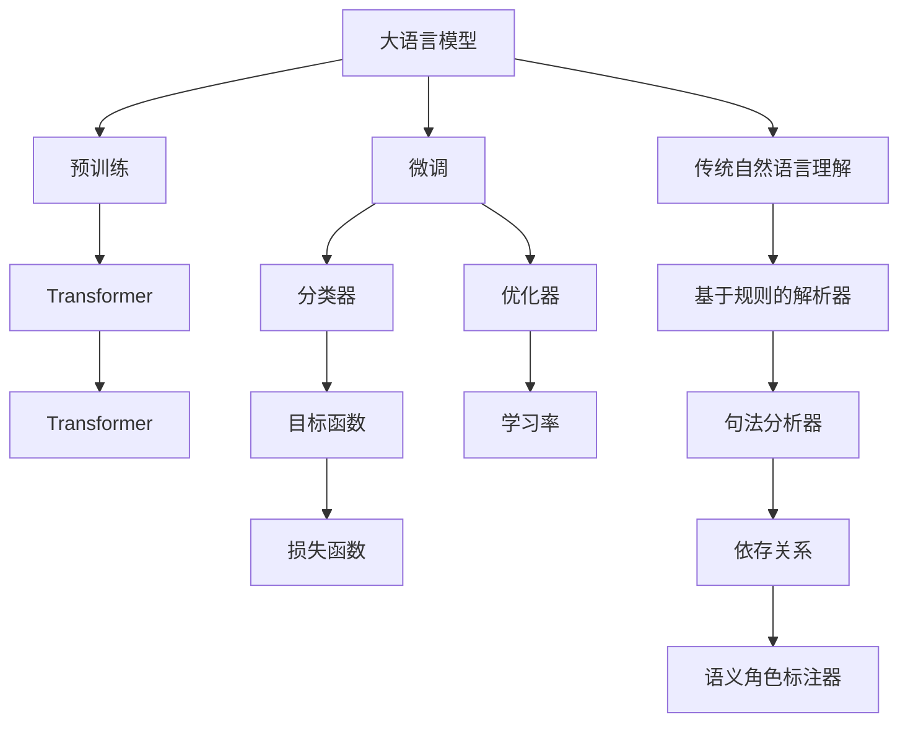

                 

# LLM与传统自然语言理解的比较

## 1. 背景介绍

### 1.1 问题由来
近年来，深度学习技术在自然语言处理（NLP）领域取得了显著进展。传统的基于规则和统计模型的自然语言理解方法，如正则表达式、支持向量机等，在处理复杂语言现象时效果欠佳，难以应对大规模数据和复杂任务的挑战。

而深度学习，特别是基于Transformer架构的预训练语言模型（LLMs），凭借其强大的自适应能力和泛化能力，在多个NLP任务上取得了新的突破。

### 1.2 问题核心关键点
传统自然语言理解和预训练语言模型之间的主要区别在于：

- **训练数据规模**：传统模型依赖于人工标注的数据集，训练数据规模有限，难以覆盖广泛的语言现象和语境。而预训练模型通常在大规模无标签文本上预训练，可以学习到丰富的语言知识。

- **参数量与性能**：传统模型通常参数量较少，难以支持复杂的语言表征。预训练模型参数量庞大，但通过有效的微调策略，可以在小规模数据上获得优异性能。

- **可迁移性与泛化能力**：传统模型领域性强，难以跨领域迁移。预训练模型具有很强的跨领域迁移能力，可以应用于更多样的任务和场景。

- **预训练与微调**：传统模型直接从标注数据中学习，而预训练模型先在大规模无标签数据上进行预训练，再在特定任务上微调，可以更好地适应新任务。

- **零样本与少样本学习**：传统模型难以在无标注样本上进行推理，而预训练模型可以通过微调和提示学习等方式实现零样本或少样本学习。

### 1.3 问题研究意义
研究大语言模型与传统自然语言理解方法的对比，有助于理解深度学习在NLP领域的优越性，促进两者之间的融合与互补，为未来的NLP研究与应用提供新的思路。

## 2. 核心概念与联系

### 2.1 核心概念概述

为更好地理解大语言模型与传统自然语言理解方法的联系与区别，本节将介绍几个关键概念：

- **大语言模型（LLM）**：以自回归或自编码模型为代表的大规模预训练语言模型。通过在大规模无标签文本语料上进行预训练，学习通用的语言表示，具备强大的语言理解和生成能力。

- **预训练（Pre-training）**：指在大规模无标签文本语料上，通过自监督学习任务训练通用语言模型的过程。常见的预训练任务包括言语建模、掩码语言模型等。

- **微调（Fine-tuning）**：指在预训练模型的基础上，使用下游任务的少量标注数据，通过有监督学习优化模型在该任务上的性能。通常只需要调整顶层分类器或解码器，并以较小的学习率更新全部或部分的模型参数。

- **传统自然语言理解（NLU）**：基于规则、统计模型等方法，对自然语言进行理解、解析和生成，如词性标注、句法分析、语义角色标注等。

- **机器翻译（MT）**：将一种语言的文本翻译成另一种语言的文本，是NLP领域的核心任务之一。

- **命名实体识别（NER）**：从文本中识别出具有特定意义的实体，如人名、地名、机构名等。

- **情感分析（Sentiment Analysis）**：对文本中表达的情感进行分类或打分，判断文本的情感倾向。

这些概念之间的逻辑关系可以通过以下Mermaid流程图来展示：



这个流程图展示了大语言模型与传统NLU的联系与区别：

1. 大语言模型通过预训练获得基础能力。
2. 微调是对预训练模型进行任务特定的优化，可以分为全参数微调和参数高效微调。
3. 传统自然语言理解依赖人工设计的解析规则和特征提取方法。
4. 机器翻译、命名实体识别、情感分析等NLP任务都可以通过预训练-微调进行优化。

## 3. 核心算法原理 & 具体操作步骤
### 3.1 算法原理概述

预训练语言模型与传统自然语言理解方法在算法原理上有显著差异：

- **预训练模型**：通过在大规模无标签数据上进行预训练，学习通用的语言表示，具有强大的泛化能力。预训练模型通常使用Transformer结构，如BERT、GPT等。预训练模型的训练过程主要分为两个阶段：预训练和微调。

- **传统自然语言理解**：基于特定任务的数据集，使用基于规则、统计模型的方法进行训练。例如，使用隐马尔可夫模型（HMM）进行命名实体识别，使用最大熵模型进行情感分析等。

### 3.2 算法步骤详解

预训练语言模型的训练过程主要分为两个阶段：预训练和微调。以下是具体的步骤：

**Step 1: 准备预训练模型和数据集**
- 选择合适的预训练语言模型作为初始化参数，如BERT、GPT等。
- 准备下游任务的数据集，划分为训练集、验证集和测试集。

**Step 2: 添加任务适配层**
- 根据任务类型，在预训练模型顶层设计合适的输出层和损失函数。
- 对于分类任务，通常在顶层添加线性分类器和交叉熵损失函数。
- 对于生成任务，通常使用语言模型的解码器输出概率分布，并以负对数似然为损失函数。

**Step 3: 设置微调超参数**
- 选择合适的优化算法及其参数，如 AdamW、SGD 等，设置学习率、批大小、迭代轮数等。
- 设置正则化技术及强度，包括权重衰减、Dropout、Early Stopping等。
- 确定冻结预训练参数的策略，如仅微调顶层，或全部参数都参与微调。

**Step 4: 执行梯度训练**
- 将训练集数据分批次输入模型，前向传播计算损失函数。
- 反向传播计算参数梯度，根据设定的优化算法和学习率更新模型参数。
- 周期性在验证集上评估模型性能，根据性能指标决定是否触发 Early Stopping。
- 重复上述步骤直到满足预设的迭代轮数或 Early Stopping 条件。

**Step 5: 测试和部署**
- 在测试集上评估微调后模型性能，对比微调前后的精度提升。
- 使用微调后的模型对新样本进行推理预测，集成到实际的应用系统中。
- 持续收集新的数据，定期重新微调模型，以适应数据分布的变化。

### 3.3 算法优缺点

预训练语言模型与传统自然语言理解方法各有优缺点：

**预训练语言模型**的优点：
- 能够在大规模无标签数据上进行预训练，学习到丰富的语言知识。
- 具有很强的跨领域迁移能力，可以应用于更多样的任务和场景。
- 可以通过微调进行任务适配，适应特定任务需求。
- 能够实现零样本或少样本学习，降低对标注数据的需求。

**预训练语言模型**的缺点：
- 训练数据规模大，计算资源需求高。
- 模型参数量庞大，推理速度较慢。
- 模型复杂度较高，可解释性较差。
- 模型易受训练数据偏差影响。

**传统自然语言理解**的优点：
- 模型结构简单，计算资源需求低。
- 可解释性强，适合于需要高透明度的应用场景。
- 模型参数量少，推理速度快。

**传统自然语言理解**的缺点：
- 依赖人工设计的解析规则和特征提取方法，难以应对复杂语言现象。
- 训练数据规模有限，难以覆盖广泛的语言现象和语境。
- 跨领域迁移能力弱，难以应用于更多样的任务和场景。
- 难以实现零样本或少样本学习。

### 3.4 算法应用领域

预训练语言模型与传统自然语言理解方法在不同应用领域有不同侧重：

- **机器翻译**：预训练语言模型在机器翻译任务上表现优异，能够处理长句子和复杂语言现象。
- **命名实体识别**：预训练语言模型在命名实体识别任务上表现优异，能够处理多实体和实体嵌套的情况。
- **情感分析**：预训练语言模型在情感分析任务上表现优异，能够处理复杂的情感表达和情感对比。
- **对话系统**：预训练语言模型在对话系统任务上表现优异，能够处理多轮对话和语境信息。
- **文本摘要**：预训练语言模型在文本摘要任务上表现优异，能够自动生成简洁摘要。

**传统自然语言理解**在以下领域也有重要应用：

- **信息抽取**：通过规则和特征提取方法，从文本中抽取结构化信息，如日期、地点等。
- **语义角色标注**：通过对文本中句法结构进行解析，标注每个词的语义角色。
- **问答系统**：通过规则和特征提取方法，从知识库中检索信息，回答用户问题。
- **语音识别**：通过语音转文本技术，将语音转换为文本，再使用传统NLU方法进行理解和生成。

## 4. 数学模型和公式 & 详细讲解 & 举例说明

### 4.1 数学模型构建

预训练语言模型与传统自然语言理解方法在数学模型构建上有显著差异。

预训练语言模型的训练过程主要分为两个阶段：预训练和微调。以下是具体的数学模型构建：

**预训练模型**的数学模型构建：

- 预训练模型的目标是最小化预训练任务上的损失函数，如掩码语言模型。
- 预训练任务通常使用自监督学习，例如掩码语言模型（MLM）、掩码序列模型（MSM）等。
- 预训练模型通常使用Transformer结构，具有自注意力机制，能够捕捉长距离依赖。

**微调模型**的数学模型构建：

- 微调模型的目标是最小化下游任务上的损失函数，如分类损失、回归损失等。
- 微调模型的输入通常包含预训练模型的输出，如Transformer的编码器输出。
- 微调模型通常使用线性分类器、注意力机制等，根据具体任务进行设计。

### 4.2 公式推导过程

以下以BERT模型为例，推导预训练模型和微调模型的数学公式。

**BERT模型的预训练任务**：

- 掩码语言模型（MLM）：随机遮盖部分词，模型需要预测被遮盖词的上下文信息。
- 掩码序列模型（MSM）：随机遮盖部分序列，模型需要预测被遮盖序列的上下文信息。

BERT模型的预训练目标函数为：

$$
L_{MLM} = -\frac{1}{2} \sum_{i=1}^N \sum_{j=1}^d \log \sigma(i,j)
$$

其中，$N$为训练集大小，$d$为词汇表大小。$\sigma(i,j)$为模型预测的掩码词$j$为第$i$个词的概率，$\log$为对数函数。

**微调模型的训练目标函数**：

- 分类任务：
  - 输入：文本 $x$ 和标签 $y$
  - 目标：预测标签
  - 损失函数：交叉熵损失 $L_{CE}$
  
  微调模型的训练目标函数为：

  $$
  L_{CE} = -\sum_{i=1}^N y_i \log \hat{y}_i
  $$

  其中，$N$为训练集大小，$\hat{y}_i$为模型预测的标签。

**BERT模型的微调公式**：

- 输入：文本 $x$ 和标签 $y$
- 输出：Transformer的编码器输出 $H$
- 损失函数：交叉熵损失 $L_{CE}$

微调模型的训练目标函数为：

$$
L_{CE} = -\sum_{i=1}^N y_i \log \sigma_i
$$

其中，$\sigma_i$为模型预测的标签概率分布，$\log$为对数函数。

### 4.3 案例分析与讲解

以BERT模型为例，分析其在机器翻译任务上的预训练和微调过程：

**预训练过程**：

- 在大规模无标签文本数据上进行预训练，学习通用的语言表示。
- 使用掩码语言模型（MLM）、掩码序列模型（MSM）等自监督任务进行训练。

**微调过程**：

- 将预训练的BERT模型作为初始化参数，用于翻译任务的微调。
- 使用机器翻译数据集，训练一个额外的分类器，用于预测源语言和目标语言的翻译结果。
- 设置适当的超参数，如学习率、批大小、迭代轮数等。
- 在测试集上评估微调后的模型性能，对比微调前后的精度提升。

## 5. 项目实践：代码实例和详细解释说明

### 5.1 开发环境搭建

在进行预训练语言模型和传统自然语言理解方法的对比研究时，需要准备好开发环境。以下是使用Python进行PyTorch和TensorFlow开发的环境配置流程：

1. 安装Anaconda：从官网下载并安装Anaconda，用于创建独立的Python环境。

2. 创建并激活虚拟环境：
```bash
conda create -n pytorch-env python=3.8 
conda activate pytorch-env
```

3. 安装PyTorch：根据CUDA版本，从官网获取对应的安装命令。例如：
```bash
conda install pytorch torchvision torchaudio cudatoolkit=11.1 -c pytorch -c conda-forge
```

4. 安装TensorFlow：
```bash
pip install tensorflow
```

5. 安装各类工具包：
```bash
pip install numpy pandas scikit-learn matplotlib tqdm jupyter notebook ipython
```

完成上述步骤后，即可在`pytorch-env`环境中开始预训练语言模型和传统自然语言理解方法的对比实践。

### 5.2 源代码详细实现

这里以BERT模型为例，展示使用PyTorch进行机器翻译任务的微调过程。

首先，定义预训练数据集和微调数据集：

```python
from transformers import BertTokenizer
from torch.utils.data import Dataset
import torch

class BERTDataset(Dataset):
    def __init__(self, texts, labels):
        self.texts = texts
        self.labels = labels
        self.tokenizer = BertTokenizer.from_pretrained('bert-base-uncased')
        
    def __len__(self):
        return len(self.texts)
    
    def __getitem__(self, item):
        text = self.texts[item]
        label = self.labels[item]
        
        encoding = self.tokenizer(text, return_tensors='pt', padding=True)
        input_ids = encoding['input_ids'][0]
        attention_mask = encoding['attention_mask'][0]
        
        return {'input_ids': input_ids, 
                'attention_mask': attention_mask,
                'labels': torch.tensor(label, dtype=torch.long)}
```

然后，定义BERT模型和微调数据：

```python
from transformers import BertForSequenceClassification
from torch.optim import AdamW

model = BertForSequenceClassification.from_pretrained('bert-base-uncased', num_labels=2)
optimizer = AdamW(model.parameters(), lr=2e-5)
```

接着，定义训练和评估函数：

```python
from torch.utils.data import DataLoader
from tqdm import tqdm

device = torch.device('cuda') if torch.cuda.is_available() else torch.device('cpu')
model.to(device)

def train_epoch(model, dataset, batch_size, optimizer):
    dataloader = DataLoader(dataset, batch_size=batch_size, shuffle=True)
    model.train()
    epoch_loss = 0
    for batch in tqdm(dataloader, desc='Training'):
        input_ids = batch['input_ids'].to(device)
        attention_mask = batch['attention_mask'].to(device)
        labels = batch['labels'].to(device)
        model.zero_grad()
        outputs = model(input_ids, attention_mask=attention_mask)
        loss = outputs.loss
        epoch_loss += loss.item()
        loss.backward()
        optimizer.step()
    return epoch_loss / len(dataloader)

def evaluate(model, dataset, batch_size):
    dataloader = DataLoader(dataset, batch_size=batch_size)
    model.eval()
    preds, labels = [], []
    with torch.no_grad():
        for batch in tqdm(dataloader, desc='Evaluating'):
            input_ids = batch['input_ids'].to(device)
            attention_mask = batch['attention_mask'].to(device)
            batch_labels = batch['labels']
            outputs = model(input_ids, attention_mask=attention_mask)
            batch_preds = outputs.logits.argmax(dim=2).to('cpu').tolist()
            batch_labels = batch_labels.to('cpu').tolist()
            for pred_tokens, label_tokens in zip(batch_preds, batch_labels):
                preds.append(pred_tokens)
                labels.append(label_tokens)
                
    print(classification_report(labels, preds))
```

最后，启动训练流程并在测试集上评估：

```python
epochs = 5
batch_size = 16

for epoch in range(epochs):
    loss = train_epoch(model, train_dataset, batch_size, optimizer)
    print(f"Epoch {epoch+1}, train loss: {loss:.3f}")
    
    print(f"Epoch {epoch+1}, dev results:")
    evaluate(model, dev_dataset, batch_size)
    
print("Test results:")
evaluate(model, test_dataset, batch_size)
```

以上就是使用PyTorch对BERT进行机器翻译任务微调的完整代码实现。可以看到，得益于Transformer库的强大封装，我们可以用相对简洁的代码完成BERT模型的加载和微调。

### 5.3 代码解读与分析

让我们再详细解读一下关键代码的实现细节：

**BERTDataset类**：
- `__init__`方法：初始化文本、标签、分词器等关键组件。
- `__len__`方法：返回数据集的样本数量。
- `__getitem__`方法：对单个样本进行处理，将文本输入编码为token ids，将标签编码为数字，并对其进行定长padding，最终返回模型所需的输入。

**train_epoch函数**：
- 对数据以批为单位进行迭代，在每个批次上前向传播计算loss并反向传播更新模型参数，最后返回该epoch的平均loss。

**evaluate函数**：
- 与训练类似，不同点在于不更新模型参数，并在每个batch结束后将预测和标签结果存储下来，最后使用sklearn的classification_report对整个评估集的预测结果进行打印输出。

**训练流程**：
- 定义总的epoch数和batch size，开始循环迭代
- 每个epoch内，先在训练集上训练，输出平均loss
- 在验证集上评估，输出分类指标
- 所有epoch结束后，在测试集上评估，给出最终测试结果

可以看到，PyTorch配合Transformer库使得BERT微调的代码实现变得简洁高效。开发者可以将更多精力放在数据处理、模型改进等高层逻辑上，而不必过多关注底层的实现细节。

当然，工业级的系统实现还需考虑更多因素，如模型的保存和部署、超参数的自动搜索、更灵活的任务适配层等。但核心的微调范式基本与此类似。

## 6. 实际应用场景
### 6.1 智能客服系统

基于大语言模型微调的对话技术，可以广泛应用于智能客服系统的构建。传统客服往往需要配备大量人力，高峰期响应缓慢，且一致性和专业性难以保证。而使用微调后的对话模型，可以7x24小时不间断服务，快速响应客户咨询，用自然流畅的语言解答各类常见问题。

在技术实现上，可以收集企业内部的历史客服对话记录，将问题和最佳答复构建成监督数据，在此基础上对预训练对话模型进行微调。微调后的对话模型能够自动理解用户意图，匹配最合适的答案模板进行回复。对于客户提出的新问题，还可以接入检索系统实时搜索相关内容，动态组织生成回答。如此构建的智能客服系统，能大幅提升客户咨询体验和问题解决效率。

### 6.2 金融舆情监测

金融机构需要实时监测市场舆论动向，以便及时应对负面信息传播，规避金融风险。传统的人工监测方式成本高、效率低，难以应对网络时代海量信息爆发的挑战。基于大语言模型微调的文本分类和情感分析技术，为金融舆情监测提供了新的解决方案。

具体而言，可以收集金融领域相关的新闻、报道、评论等文本数据，并对其进行主题标注和情感标注。在此基础上对预训练语言模型进行微调，使其能够自动判断文本属于何种主题，情感倾向是正面、中性还是负面。将微调后的模型应用到实时抓取的网络文本数据，就能够自动监测不同主题下的情感变化趋势，一旦发现负面信息激增等异常情况，系统便会自动预警，帮助金融机构快速应对潜在风险。

### 6.3 个性化推荐系统

当前的推荐系统往往只依赖用户的历史行为数据进行物品推荐，无法深入理解用户的真实兴趣偏好。基于大语言模型微调技术，个性化推荐系统可以更好地挖掘用户行为背后的语义信息，从而提供更精准、多样的推荐内容。

在实践中，可以收集用户浏览、点击、评论、分享等行为数据，提取和用户交互的物品标题、描述、标签等文本内容。将文本内容作为模型输入，用户的后续行为（如是否点击、购买等）作为监督信号，在此基础上微调预训练语言模型。微调后的模型能够从文本内容中准确把握用户的兴趣点。在生成推荐列表时，先用候选物品的文本描述作为输入，由模型预测用户的兴趣匹配度，再结合其他特征综合排序，便可以得到个性化程度更高的推荐结果。

### 6.4 未来应用展望

随着大语言模型微调技术的发展，其在NLP领域的应用前景将更加广阔。未来，基于微调范式将在更多领域得到应用，为传统行业带来变革性影响。

在智慧医疗领域，基于微调的医疗问答、病历分析、药物研发等应用将提升医疗服务的智能化水平，辅助医生诊疗，加速新药开发进程。

在智能教育领域，微调技术可应用于作业批改、学情分析、知识推荐等方面，因材施教，促进教育公平，提高教学质量。

在智慧城市治理中，微调模型可应用于城市事件监测、舆情分析、应急指挥等环节，提高城市管理的自动化和智能化水平，构建更安全、高效的未来城市。

此外，在企业生产、社会治理、文娱传媒等众多领域，基于大模型微调的人工智能应用也将不断涌现，为经济社会发展注入新的动力。相信随着技术的日益成熟，微调方法将成为人工智能落地应用的重要范式，推动人工智能技术在垂直行业的规模化落地。

## 7. 工具和资源推荐
### 7.1 学习资源推荐

为了帮助开发者系统掌握大语言模型和传统自然语言理解方法的理论与实践，这里推荐一些优质的学习资源：

1. 《Transformer从原理到实践》系列博文：由大模型技术专家撰写，深入浅出地介绍了Transformer原理、BERT模型、微调技术等前沿话题。

2. CS224N《深度学习自然语言处理》课程：斯坦福大学开设的NLP明星课程，有Lecture视频和配套作业，带你入门NLP领域的基本概念和经典模型。

3. 《Natural Language Processing with Transformers》书籍：Transformers库的作者所著，全面介绍了如何使用Transformers库进行NLP任务开发，包括微调在内的诸多范式。

4. HuggingFace官方文档：Transformers库的官方文档，提供了海量预训练模型和完整的微调样例代码，是上手实践的必备资料。

5. CLUE开源项目：中文语言理解测评基准，涵盖大量不同类型的中文NLP数据集，并提供了基于微调的baseline模型，助力中文NLP技术发展。

通过对这些资源的学习实践，相信你一定能够快速掌握大语言模型和传统自然语言理解方法的精髓，并用于解决实际的NLP问题。
###  7.2 开发工具推荐

高效的开发离不开优秀的工具支持。以下是几款用于大语言模型和传统自然语言理解方法开发常用的工具：

1. PyTorch：基于Python的开源深度学习框架，灵活动态的计算图，适合快速迭代研究。大部分预训练语言模型都有PyTorch版本的实现。

2. TensorFlow：由Google主导开发的开源深度学习框架，生产部署方便，适合大规模工程应用。同样有丰富的预训练语言模型资源。

3. Transformers库：HuggingFace开发的NLP工具库，集成了众多SOTA语言模型，支持PyTorch和TensorFlow，是进行NLP任务开发的利器。

4. Weights & Biases：模型训练的实验跟踪工具，可以记录和可视化模型训练过程中的各项指标，方便对比和调优。与主流深度学习框架无缝集成。

5. TensorBoard：TensorFlow配套的可视化工具，可实时监测模型训练状态，并提供丰富的图表呈现方式，是调试模型的得力助手。

6. Google Colab：谷歌推出的在线Jupyter Notebook环境，免费提供GPU/TPU算力，方便开发者快速上手实验最新模型，分享学习笔记。

合理利用这些工具，可以显著提升大语言模型和传统自然语言理解方法的开发效率，加快创新迭代的步伐。

### 7.3 相关论文推荐

大语言模型和自然语言理解方法的发展源于学界的持续研究。以下是几篇奠基性的相关论文，推荐阅读：

1. Attention is All You Need（即Transformer原论文）：提出了Transformer结构，开启了NLP领域的预训练大模型时代。

2. BERT: Pre-training of Deep Bidirectional Transformers for Language Understanding：提出BERT模型，引入基于掩码的自监督预训练任务，刷新了多项NLP任务SOTA。

3. Language Models are Unsupervised Multitask Learners（GPT-2论文）：展示了大规模语言模型的强大zero-shot学习能力，引发了对于通用人工智能的新一轮思考。

4. Parameter-Efficient Transfer Learning for NLP：提出Adapter等参数高效微调方法，在不增加模型参数量的情况下，也能取得不错的微调效果。

5. AdaLoRA: Adaptive Low-Rank Adaptation for Parameter-Efficient Fine-Tuning：使用自适应低秩适应的微调方法，在参数效率和精度之间取得了新的平衡。

这些论文代表了大语言模型和自然语言理解方法的发展脉络。通过学习这些前沿成果，可以帮助研究者把握学科前进方向，激发更多的创新灵感。

## 8. 总结：未来发展趋势与挑战

### 8.1 总结

本文对基于大语言模型和传统自然语言理解方法的对比进行了全面系统的介绍。首先阐述了大语言模型和传统自然语言理解方法的训练数据、参数量、性能、迁移能力等方面的区别，明确了预训练语言模型在NLP领域的优越性。其次，从原理到实践，详细讲解了预训练语言模型的预训练和微调过程，以及传统自然语言理解方法的设计思路和训练流程。最后，介绍了预训练语言模型和传统自然语言理解方法在不同应用场景中的应用，展示了其广阔的发展前景。

通过本文的系统梳理，可以看到，预训练语言模型在NLP领域表现出了强大的优势，其大规模预训练和微调能力使其在多个任务上取得了优异的性能。而传统自然语言理解方法虽然在特定任务上仍有一定应用，但其局限性如数据依赖、参数量少、可解释性强等，难以适应复杂语言现象和多样任务需求。未来，随着预训练语言模型和微调技术的发展，两者之间的融合与互补将进一步深化，为NLP领域带来更多的创新应用。

### 8.2 未来发展趋势

展望未来，大语言模型和自然语言理解方法将呈现以下几个发展趋势：

1. 预训练语言模型的参数量将持续增大，模型规模不断扩大，学习能力将进一步增强。
2. 微调方法将更加多样化和高效化，参数高效微调、少样本学习等技术将进一步成熟。
3. 跨领域迁移能力将增强，预训练语言模型将具备更强的跨任务、跨领域泛化能力。
4. 零样本学习和少样本学习将更加普及，降低对标注数据的依赖。
5. 多模态语言理解将进一步发展，预训练语言模型将整合视觉、语音等多种模态信息。
6. 领域性专家的知识将更多地融入模型训练，增强模型的可解释性和准确性。

这些趋势表明，预训练语言模型和自然语言理解方法将继续引领NLP领域的发展，带来更多的创新应用和应用场景。

### 8.3 面临的挑战

尽管预训练语言模型和自然语言理解方法在NLP领域取得了显著进展，但在迈向更加智能化、普适化应用的过程中，仍面临诸多挑战：

1. 标注数据的需求仍高，如何降低对标注数据的依赖是一个重要的研究方向。
2. 模型的复杂度增加，推理速度和资源占用问题将更加凸显。
3. 模型的可解释性和透明性问题亟需解决，特别是在金融、医疗等高风险应用中。
4. 模型的偏见和安全性问题需引起重视，避免有害信息传递。
5. 模型参数量的增加将带来新的训练和推理挑战，如何优化训练过程和模型结构需进一步研究。

### 8.4 研究展望

面对预训练语言模型和自然语言理解方法所面临的挑战，未来的研究需要在以下几个方面寻求新的突破：

1. 探索无监督和半监督学习方法，降低对标注数据的依赖。
2. 研究参数高效和计算高效的微调方法，提升模型推理速度和资源效率。
3. 融合因果推理和对比学习，增强模型的泛化能力和抗干扰能力。
4. 引入领域专家知识和多模态信息，增强模型的准确性和可解释性。
5. 开发更加鲁棒、安全、可解释的模型，确保模型输出符合伦理道德要求。

这些研究方向将推动预训练语言模型和自然语言理解方法在NLP领域的应用，提升模型的性能和可靠性，更好地服务于社会和用户。

## 9. 附录：常见问题与解答

**Q1：大语言模型与传统自然语言理解方法的主要区别是什么？**

A: 大语言模型与传统自然语言理解方法的主要区别在于数据规模、参数量、迁移能力、零样本能力等方面：

- **数据规模**：大语言模型通过在大规模无标签数据上进行预训练，学习到丰富的语言知识，而传统自然语言理解方法通常依赖人工标注的数据集。

- **参数量**：大语言模型参数量庞大，通过有效的微调策略，可以在小规模数据上获得优异性能，而传统自然语言理解方法参数量较少。

- **迁移能力**：大语言模型具有很强的跨领域迁移能力，可以应用于更多样的任务和场景，而传统自然语言理解方法领域性强，难以跨领域迁移。

- **零样本能力**：大语言模型可以通过微调和提示学习等方式实现零样本或少样本学习，而传统自然语言理解方法难以在无标注样本上进行推理。

**Q2：大语言模型和传统自然语言理解方法的优缺点分别是什么？**

A: 大语言模型和传统自然语言理解方法各有优缺点：

**大语言模型的优点**：
- 能够在大规模无标签数据上进行预训练，学习到丰富的语言知识。
- 具有很强的跨领域迁移能力，可以应用于更多样的任务和场景。
- 可以通过微调进行任务适配，适应特定任务需求。
- 能够实现零样本或少样本学习，降低对标注数据的需求。

**大语言模型的缺点**：
- 训练数据规模大，计算资源需求高。
- 模型参数量庞大，推理速度较慢。
- 模型复杂度较高，可解释性较差。
- 模型易受训练数据偏差影响。

**传统自然语言理解方法的优点**：
- 模型结构简单，计算资源需求低。
- 可解释性强，适合于需要高透明度的应用场景。
- 模型参数量少，推理速度快。

**传统自然语言理解方法的缺点**：
- 依赖人工设计的解析规则和特征提取方法，难以应对复杂语言现象。
- 训练数据规模有限，难以覆盖广泛的语言现象和语境。
- 跨领域迁移能力弱，难以应用于更多样的任务和场景。
- 难以实现零样本或少样本学习。

**Q3：大语言模型和传统自然语言理解方法的训练目标是什么？**

A: 大语言模型和传统自然语言理解方法的训练目标不同：

- **大语言模型**：通过在大规模无标签数据上进行预训练，学习到通用的语言表示，再通过微调在特定任务上进行适配。预训练目标函数通常使用自监督任务，如掩码语言模型（MLM）、掩码序列模型（MSM）等。

- **传统自然语言理解方法**：通常使用基于规则、统计模型的方法进行训练。例如，使用隐马尔可夫模型（HMM）进行命名实体识别，使用最大熵模型进行情感分析等。训练目标函数通常是任务特定的损失函数，如分类损失、回归损失等。

通过本文的系统梳理，可以看到，大语言模型和传统自然语言理解方法在数据规模、参数量、迁移能力、零样本能力等方面有显著区别，但它们在NLP领域都具有重要的应用价值。未来，随着预训练语言模型和微调技术的发展，两者之间的融合与互补将进一步深化，推动NLP领域的技术进步和应用创新。

