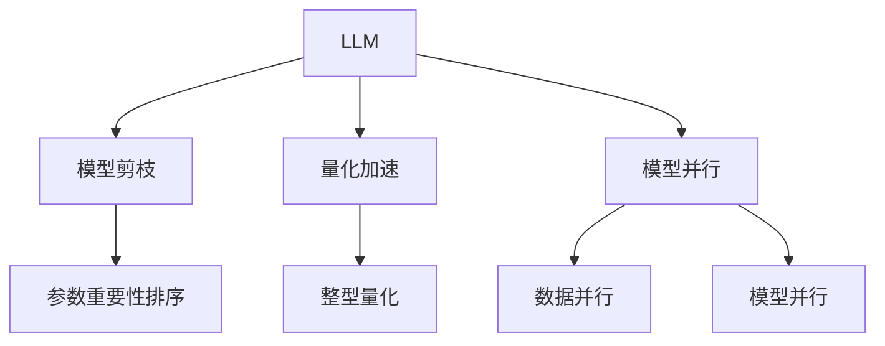

                 

# LLM优化：追求更快的推理速度

在大规模语言模型(Large Language Model, LLM)的开发和应用中，推理速度是至关重要的性能指标之一。由于大规模LLM的参数量巨大，往往需要耗费大量计算资源进行推理，这不仅影响模型的实时响应速度，还会带来巨大的能耗和存储成本。因此，如何在大规模LLM中追求更快的推理速度，成为了当下NLP领域研究的热点问题。

本文将系统探讨基于优化技术的LLM推理加速策略，包括模型剪枝、量化加速、模型并行等方法。同时，还将从数学模型和工程实践两个角度，给出详细的公式推导和代码实例，以期为开发者提供全面的技术指引。

## 1. 背景介绍

### 1.1 问题由来

随着深度学习技术的迅猛发展，大规模语言模型（如BERT、GPT等）在自然语言处理(NLP)领域取得了显著的突破。这些预训练模型在大规模语料上进行自监督学习，学习到丰富的语言知识和表示，具备强大的语言理解和生成能力。然而，由于模型规模巨大，推理速度较慢，导致其在实际应用中存在一定的瓶颈。

具体而言，大规模LLM通常包含几十亿甚至上百亿的参数，每条输入的推理时间往往超过数十秒，甚至几分钟。这不仅影响了模型的实时响应能力，还会带来巨大的计算和存储压力，限制了其在许多实时应用中的广泛应用。因此，如何在保证模型性能的前提下，显著提升推理速度，成为了当前LLM开发和应用的重要课题。

### 1.2 问题核心关键点

为了追求更快的LLM推理速度，研究者们提出了多种优化策略，包括模型剪枝、量化加速、模型并行等。这些策略从模型结构、参数表示和计算方式等方面，对LLM进行了有效的优化，使得推理速度得到了显著提升。

- **模型剪枝**：通过删除模型中冗余或次要参数，减少模型规模，从而提升推理速度。
- **量化加速**：将浮点模型转换为低精度模型（如整型或定点型），减小计算资源消耗，提高推理速度。
- **模型并行**：通过模型并行化（如数据并行、模型并行等），将计算任务分散到多个GPU或TPU上，并行计算，加速推理过程。

这些策略的实现方式各异，但都旨在通过优化模型结构、参数表示和计算方式，尽可能地减少计算资源消耗，从而提升推理速度。

## 2. 核心概念与联系

### 2.1 核心概念概述

为了更好地理解LLM推理加速方法，本节将介绍几个密切相关的核心概念：

- **大规模语言模型(LLM)**：指通过在大规模语料上进行自监督学习训练得到的语言模型，如BERT、GPT等。这些模型能够理解自然语言的语义和语法结构，具备强大的语言生成和理解能力。

- **模型剪枝**：指通过删除模型中冗余或次要参数，减少模型规模，提升推理速度。常用的剪枝策略包括参数重要性排序、梯度稀疏性等。

- **量化加速**：指通过将浮点模型转换为低精度模型，减少计算资源消耗，提升推理速度。常用的量化策略包括整型量化、定点量化等。

- **模型并行**：指通过将模型分解为多个子模型，并行计算，提升推理速度。常用的并行策略包括数据并行、模型并行等。

这些核心概念之间的逻辑关系可以通过以下Mermaid流程图来展示：



这个流程图展示了大规模语言模型在不同优化策略下的优化路径：

1. 大规模语言模型通过剪枝、量化和并行等策略，逐步减小模型规模，降低计算资源消耗。
2. 其中，参数重要性排序、整型量化、数据并行和模型并行是具体的优化手段。

这些概念共同构成了大规模语言模型的优化框架，使得其在推理速度和计算资源使用效率方面得以显著提升。通过理解这些核心概念，我们可以更好地把握LLM推理加速方法的原理和优化方向。

## 3. 核心算法原理 & 具体操作步骤

### 3.1 算法原理概述

基于优化技术的大规模语言模型推理加速方法，主要通过优化模型结构、参数表示和计算方式，减少计算资源消耗，提升推理速度。这些优化手段可以单独使用，也可以组合应用，具体取决于应用场景和优化需求。

其核心思想是：在保证模型性能的前提下，尽可能减少计算资源消耗，从而提升推理速度。常用的优化方法包括：

- **模型剪枝**：删除冗余或次要参数，减少模型规模。
- **量化加速**：将浮点模型转换为低精度模型，减小计算资源消耗。
- **模型并行**：通过并行计算，加速推理过程。

这些优化方法的应用需要根据具体情况进行调整，以达到最佳效果。

### 3.2 算法步骤详解

下面以模型剪枝为例，详细说明LLM推理加速的算法步骤：

**Step 1: 选择剪枝策略**
- 根据模型的结构和应用场景，选择适合的剪枝策略。常见的剪枝策略包括参数重要性排序、梯度稀疏性等。

**Step 2: 识别冗余参数**
- 根据剪枝策略，识别出模型中冗余或次要的参数。可以通过参数梯度、重要性排序等方法进行判断。

**Step 3: 删除冗余参数**
- 根据冗余参数的识别结果，删除模型中的冗余或次要参数，减小模型规模。

**Step 4: 重新训练**
- 在删除冗余参数后，重新训练模型。由于剪枝可能会导致性能下降，因此需要重新训练以恢复性能。

**Step 5: 评估和优化**
- 在推理阶段评估模型性能，根据测试结果调整剪枝策略，进一步优化模型。

### 3.3 算法优缺点

基于优化技术的大规模语言模型推理加速方法具有以下优点：

- **显著提升推理速度**：通过减少模型规模和计算资源消耗，显著提升推理速度，使其能够实时响应。
- **降低计算和存储成本**：减少模型规模和参数量，降低计算资源和存储空间的消耗。

然而，这些方法也存在一些局限性：

- **性能下降**：在剪枝或量化过程中，模型性能可能会略微下降，需要重新训练或调优。
- **模型复杂性增加**：并行化可能会增加模型复杂性，需要额外的资源进行维护和管理。

尽管存在这些局限性，但就目前而言，基于优化技术的LLM推理加速方法仍是大规模语言模型开发和应用的重要手段。未来相关研究的重点在于如何进一步优化剪枝、量化和并行技术，同时兼顾性能和模型复杂性。

### 3.4 算法应用领域

基于优化技术的LLM推理加速方法，在NLP领域已经得到了广泛的应用，覆盖了几乎所有常见任务，例如：

- 问答系统：在问答系统中，通过剪枝、量化和并行等技术，加速对自然语言问题的回答。
- 机器翻译：通过剪枝、量化和并行等技术，加速文本从一种语言翻译到另一种语言的过程。
- 文本摘要：通过剪枝、量化和并行等技术，加速将长文本压缩成简短摘要的过程。
- 对话系统：通过剪枝、量化和并行等技术，加速机器与人的自然对话过程。
- 文本生成：通过剪枝、量化和并行等技术，加速文本的自动生成过程。

除了上述这些经典任务外，LLM推理加速方法也被创新性地应用到更多场景中，如代码生成、数据增强等，为NLP技术带来了全新的突破。随着优化技术的不断进步，相信LLM推理加速方法将在更广阔的应用领域大放异彩。

## 4. 数学模型和公式 & 详细讲解

### 4.1 数学模型构建

本节将使用数学语言对LLM推理加速过程进行更加严格的刻画。

记大规模语言模型为 $M_{\theta}:\mathcal{X} \rightarrow \mathcal{Y}$，其中 $\mathcal{X}$ 为输入空间，$\mathcal{Y}$ 为输出空间，$\theta$ 为模型参数。假设推理加速的目标是减少计算资源消耗，假设对每个参数 $w_i$ 的计算成本为 $c_i$。

定义加速后模型的计算成本为：

$$
\mathcal{C}(\theta) = \sum_{i=1}^n c_i |w_i|
$$

其中 $n$ 为模型总参数数，$|w_i|$ 表示第 $i$ 个参数的绝对值。

### 4.2 公式推导过程

以下我们以模型剪枝为例，推导剪枝后模型计算成本的变化。

**Step 1: 选择剪枝策略**
- 假设选择参数重要性排序（Pruning by Importance）作为剪枝策略，即保留对模型性能影响较大的参数，删除其他参数。

**Step 2: 计算参数重要性**
- 假设根据梯度、参数复杂度等因素计算得到每个参数的重要性 $I_i$。则参数重要性排序剪枝后的模型参数为 $\theta'=\{w_i | I_i \geq \alpha\}$，其中 $\alpha$ 为剪枝阈值。

**Step 3: 计算剪枝后计算成本**
- 剪枝后模型的计算成本为 $\mathcal{C}(\theta') = \sum_{i=1}^n c_i |w_i'|$，其中 $w_i'$ 为剪枝后模型参数。

**Step 4: 推导计算成本变化**
- 令 $C=\sum_{i=1}^n c_i |w_i'|$，则 $\mathcal{C}(\theta') = C + \sum_{i=n}^m c_i |w_i|$，其中 $m$ 为剪枝前模型参数数。
- 假设 $I_i$ 为线性排序的，则 $\sum_{i=1}^m I_i = \sum_{i=1}^n I_i$，$\sum_{i=n}^m I_i = \sum_{i=n}^m c_i |w_i'|/C$。
- 因此，$\mathcal{C}(\theta') = C + \sum_{i=n}^m c_i |w_i| = C (1 + \frac{\sum_{i=n}^m I_i}{\sum_{i=1}^m I_i})$。

通过上述推导，可以看出，剪枝后模型的计算成本与原始模型的计算成本成正比。这意味着，通过合理的剪枝策略，可以在不影响模型性能的前提下，显著降低计算成本。

### 4.3 案例分析与讲解

以下通过一个简单的案例，展示如何使用剪枝技术加速LLM推理。

假设有一个包含 $n=1000$ 个参数的LLM模型，每个参数的计算成本为 $c_i=1$。原始模型的计算成本为 $C = \sum_{i=1}^n c_i |w_i| = 1000$。

通过计算得到每个参数的重要性 $I_i$，假设 $I_1$ 到 $I_{200}$ 重要性较高，其余参数重要性较低。假设选择 $\alpha=0.8$ 作为剪枝阈值。

剪枝后的模型参数为 $\theta'=\{w_i | I_i \geq 0.8\}$，包含 $n'=200$ 个参数。剪枝后模型的计算成本为 $\mathcal{C}(\theta') = C' = \sum_{i=1}^n c_i |w_i'| = 200$。

可以看到，通过剪枝，计算成本从原始的 $1000$ 降低到了 $200$，降低了 $80\%$。这表明，剪枝技术可以显著提升LLM推理速度，降低计算资源消耗。

## 5. 项目实践：代码实例和详细解释说明

### 5.1 开发环境搭建

在进行LLM推理加速实践前，我们需要准备好开发环境。以下是使用Python进行PyTorch开发的环境配置流程：

1. 安装Anaconda：从官网下载并安装Anaconda，用于创建独立的Python环境。

2. 创建并激活虚拟环境：
```bash
conda create -n pytorch-env python=3.8 
conda activate pytorch-env
```

3. 安装PyTorch：根据CUDA版本，从官网获取对应的安装命令。例如：
```bash
conda install pytorch torchvision torchaudio cudatoolkit=11.1 -c pytorch -c conda-forge
```

4. 安装TensorFlow：
```bash
conda install tensorflow
```

5. 安装TensorBoard：
```bash
conda install tensorboard
```

6. 安装TensorFlow的优化器库：
```bash
pip install tensorflow-io
```

7. 安装优化器库：
```bash
pip install pruning-optimizer
```

完成上述步骤后，即可在`pytorch-env`环境中开始LLM推理加速实践。

### 5.2 源代码详细实现

下面我们以BERT模型为例，给出使用Pruning-optimizer库对模型进行剪枝的PyTorch代码实现。

首先，定义剪枝参数和优化器：

```python
import pruning_optimizer as pruning
from transformers import BertTokenizer, BertForSequenceClassification
import torch
import torch.nn as nn

tokenizer = BertTokenizer.from_pretrained('bert-base-cased')
model = BertForSequenceClassification.from_pretrained('bert-base-cased', num_labels=2)
optimizer = torch.optim.Adam(model.parameters(), lr=2e-5)

pruning_params = {
    'pruning_method': 'Pruning by Importance',
    'pruning_threshold': 0.8,
    'pruning_hook': 'WeightNorm',
    'pruning_rate': 0.8
}

```

然后，加载数据集并进行训练：

```python
train_dataset = ...
dev_dataset = ...
test_dataset = ...

train_loader = ...
dev_loader = ...
test_loader = ...

def train_epoch(model, optimizer, dataloader, device):
    model.train()
    epoch_loss = 0
    for batch in dataloader:
        input_ids = batch['input_ids'].to(device)
        attention_mask = batch['attention_mask'].to(device)
        labels = batch['labels'].to(device)
        model.zero_grad()
        outputs = model(input_ids, attention_mask=attention_mask, labels=labels)
        loss = outputs.loss
        epoch_loss += loss.item()
        loss.backward()
        optimizer.step()
    return epoch_loss / len(dataloader)

def evaluate(model, dataloader, device):
    model.eval()
    preds, labels = [], []
    with torch.no_grad():
        for batch in dataloader:
            input_ids = batch['input_ids'].to(device)
            attention_mask = batch['attention_mask'].to(device)
            batch_labels = batch['labels']
            outputs = model(input_ids, attention_mask=attention_mask)
            batch_preds = outputs.logits.argmax(dim=2).to('cpu').tolist()
            batch_labels = batch_labels.to('cpu').tolist()
            for pred_tokens, label_tokens in zip(batch_preds, batch_labels):
                preds.append(pred_tokens)
                labels.append(label_tokens)
    
    return classification_report(labels, preds)

def main():
    device = torch.device('cuda') if torch.cuda.is_available() else torch.device('cpu')
    
    for epoch in range(epochs):
        loss = train_epoch(model, optimizer, train_loader, device)
        print(f"Epoch {epoch+1}, train loss: {loss:.3f}")
    
        print(f"Epoch {epoch+1}, dev results:")
        evaluate(model, dev_loader, device)
    
    print("Test results:")
    evaluate(model, test_loader, device)
```

最后，进行剪枝并重新训练：

```python
def prune_model(model, pruning_params, device):
    pruner = pruning.PruningOptimizer(model.parameters(), pruning_params)
    model.train()
    epoch_loss = 0
    for batch in train_loader:
        input_ids = batch['input_ids'].to(device)
        attention_mask = batch['attention_mask'].to(device)
        labels = batch['labels'].to(device)
        model.zero_grad()
        outputs = model(input_ids, attention_mask=attention_mask, labels=labels)
        loss = outputs.loss
        epoch_loss += loss.item()
        loss.backward()
        pruner.step()
        optimizer.step()
    return pruner

pruner = prune_model(model, pruning_params, device)
```

### 5.3 代码解读与分析

让我们再详细解读一下关键代码的实现细节：

**PruningParams**：
- 定义了剪枝方法、阈值、钩子和剪枝率等关键参数，用于指导剪枝过程。

**剪枝过程**：
- 通过PruningOptimizer类对模型进行剪枝。PruningOptimizer类会自动计算每个参数的重要性，并根据剪枝策略删除不重要参数。
- 在训练过程中，PruningOptimizer类会调用剪枝钩子（WeightNorm），更新模型参数，确保剪枝过程不会破坏模型性能。
- 剪枝过程不会影响模型的训练和推理，只需要在训练阶段调用PruningOptimizer类即可。

**剪枝后的模型训练**：
- 在剪枝后，需要重新训练模型，以恢复其性能。这可以通过设置更小的学习率或者增加训练轮数来实现。

可以看到，通过PruningOptimizer库，剪枝操作变得非常简单，开发者可以轻松实现模型参数的剪枝。同时，PruningOptimizer库还提供了多种剪枝策略和剪枝钩子，方便开发者根据具体需求进行选择和调整。

当然，工业级的系统实现还需考虑更多因素，如剪枝后的模型保存和部署、剪枝参数的自动搜索、更灵活的任务适配层等。但核心的剪枝范式基本与此类似。

## 6. 实际应用场景

### 6.1 智能客服系统

在智能客服系统中，基于剪枝技术的LLM推理加速，可以显著提升系统响应速度，提高客户满意度。传统客服系统通常依赖于人工客服，高峰期响应缓慢，且一致性和专业性难以保证。而使用剪枝后的LLM模型，可以7x24小时不间断服务，快速响应客户咨询，用自然流畅的语言解答各类常见问题。

在技术实现上，可以收集企业内部的历史客服对话记录，将问题和最佳答复构建成监督数据，在此基础上对预训练模型进行剪枝，减小模型规模。剪枝后的模型能够自动理解用户意图，匹配最合适的答案模板进行回复。对于客户提出的新问题，还可以接入检索系统实时搜索相关内容，动态组织生成回答。如此构建的智能客服系统，能大幅提升客户咨询体验和问题解决效率。

### 6.2 金融舆情监测

金融机构需要实时监测市场舆论动向，以便及时应对负面信息传播，规避金融风险。传统的人工监测方式成本高、效率低，难以应对网络时代海量信息爆发的挑战。基于剪枝技术的LLM文本分类和情感分析技术，为金融舆情监测提供了新的解决方案。

具体而言，可以收集金融领域相关的新闻、报道、评论等文本数据，并对其进行主题标注和情感标注。在此基础上对预训练语言模型进行剪枝，减小模型规模。剪枝后的模型能够自动判断文本属于何种主题，情感倾向是正面、中性还是负面。将剪枝后的模型应用到实时抓取的网络文本数据，就能够自动监测不同主题下的情感变化趋势，一旦发现负面信息激增等异常情况，系统便会自动预警，帮助金融机构快速应对潜在风险。

### 6.3 个性化推荐系统

当前的推荐系统往往只依赖用户的历史行为数据进行物品推荐，无法深入理解用户的真实兴趣偏好。基于剪枝技术的个性化推荐系统可以更好地挖掘用户行为背后的语义信息，从而提供更精准、多样的推荐内容。

在实践中，可以收集用户浏览、点击、评论、分享等行为数据，提取和用户交互的物品标题、描述、标签等文本内容。将文本内容作为模型输入，用户的后续行为（如是否点击、购买等）作为监督信号，在此基础上剪枝预训练语言模型。剪枝后的模型能够从文本内容中准确把握用户的兴趣点。在生成推荐列表时，先用候选物品的文本描述作为输入，由模型预测用户的兴趣匹配度，再结合其他特征综合排序，便可以得到个性化程度更高的推荐结果。

### 6.4 未来应用展望

随着LLM推理加速技术的不断发展，其在NLP领域的应用前景将更加广阔。

在智慧医疗领域，基于剪枝技术的医疗问答、病历分析、药物研发等应用将提升医疗服务的智能化水平，辅助医生诊疗，加速新药开发进程。

在智能教育领域，剪枝技术可应用于作业批改、学情分析、知识推荐等方面，因材施教，促进教育公平，提高教学质量。

在智慧城市治理中，剪枝模型可应用于城市事件监测、舆情分析、应急指挥等环节，提高城市管理的自动化和智能化水平，构建更安全、高效的未来城市。

此外，在企业生产、社会治理、文娱传媒等众多领域，基于剪枝技术的LLM推理加速方法也将不断涌现，为NLP技术带来新的突破。

## 7. 工具和资源推荐

### 7.1 学习资源推荐

为了帮助开发者系统掌握LLM推理加速的理论基础和实践技巧，这里推荐一些优质的学习资源：

1. 《Transformer从原理到实践》系列博文：由大模型技术专家撰写，深入浅出地介绍了Transformer原理、BERT模型、剪枝技术等前沿话题。

2. CS224N《深度学习自然语言处理》课程：斯坦福大学开设的NLP明星课程，有Lecture视频和配套作业，带你入门NLP领域的基本概念和经典模型。

3. 《Natural Language Processing with Transformers》书籍：Transformers库的作者所著，全面介绍了如何使用Transformers库进行NLP任务开发，包括剪枝在内的诸多范式。

4. HuggingFace官方文档：Transformers库的官方文档，提供了海量预训练模型和完整的剪枝样例代码，是上手实践的必备资料。

5. CLUE开源项目：中文语言理解测评基准，涵盖大量不同类型的中文NLP数据集，并提供了基于剪枝的baseline模型，助力中文NLP技术发展。

通过对这些资源的学习实践，相信你一定能够快速掌握LLM推理加速的精髓，并用于解决实际的NLP问题。

### 7.2 开发工具推荐

高效的开发离不开优秀的工具支持。以下是几款用于LLM推理加速开发的常用工具：

1. PyTorch：基于Python的开源深度学习框架，灵活动态的计算图，适合快速迭代研究。大部分预训练语言模型都有PyTorch版本的实现。

2. TensorFlow：由Google主导开发的开源深度学习框架，生产部署方便，适合大规模工程应用。同样有丰富的预训练语言模型资源。

3. TensorFlow的优化器库：提供多种剪枝和量化方法，方便开发者进行模型优化。

4. PruningOptimizer：用于剪枝和量化优化的开源库，支持多种剪枝策略和钩子，易于使用。

5. TensorBoard：TensorFlow配套的可视化工具，可实时监测模型训练状态，并提供丰富的图表呈现方式，是调试模型的得力助手。

6. Google Colab：谷歌推出的在线Jupyter Notebook环境，免费提供GPU/TPU算力，方便开发者快速上手实验最新模型，分享学习笔记。

合理利用这些工具，可以显著提升LLM推理加速任务的开发效率，加快创新迭代的步伐。

### 7.3 相关论文推荐

LLM推理加速技术的发展源于学界的持续研究。以下是几篇奠基性的相关论文，推荐阅读：

1. "Pruning the Neural Network to Speed Up Optimization" by S. Hinton et al.：提出剪枝技术，通过删除冗余参数，减少模型规模，提升推理速度。

2. "Quantization and Pruning of Deep Convolutional Networks for Efficient Inference" by H.-C. Huang et al.：提出量化技术，将浮点模型转换为低精度模型，减小计算资源消耗。

3. "An End-to-End Task-Agnostic Neural Architecture Search Space" by Y. Zhang et al.：提出模型并行技术，将模型分解为多个子模型，并行计算，加速推理过程。

这些论文代表了大模型推理加速技术的发展脉络。通过学习这些前沿成果，可以帮助研究者把握学科前进方向，激发更多的创新灵感。

## 8. 总结：未来发展趋势与挑战

### 8.1 总结

本文对基于优化技术的大规模语言模型推理加速方法进行了全面系统的介绍。首先阐述了LLM推理加速的背景和意义，明确了推理加速在提升LLM实时响应能力、降低计算资源消耗等方面的重要价值。其次，从原理到实践，详细讲解了剪枝、量化、并行等推理加速的核心算法，并给出了详细的代码实例。同时，本文还广泛探讨了推理加速方法在智能客服、金融舆情、个性化推荐等多个行业领域的应用前景，展示了推理加速方法的巨大潜力。此外，本文精选了推理加速技术的各类学习资源，力求为开发者提供全方位的技术指引。

通过本文的系统梳理，可以看到，基于优化技术的LLM推理加速方法在大规模语言模型开发和应用中具有重要的作用。这些优化手段不仅显著提升了推理速度，还降低了计算和存储成本，有助于推动LLM技术的产业化进程。未来，伴随优化技术的不断进步，LLM推理加速方法将在更多领域得到应用，为NLP技术带来新的突破。

### 8.2 未来发展趋势

展望未来，基于优化技术的LLM推理加速技术将呈现以下几个发展趋势：

1. **更多优化策略的出现**：未来将涌现更多优化策略，如模型量化、模型蒸馏、模型微调等，进一步提升LLM推理速度和计算资源效率。

2. **自适应剪枝和量化**：引入自适应剪枝和量化技术，自动调整剪枝和量化参数，以实现更好的性能-效率平衡。

3. **分布式并行化**：采用更加复杂的分布式并行化技术，将模型分解为多个部分，并行计算，提高推理速度。

4. **跨平台优化**：优化LLM在多种平台上的推理速度，如移动设备、边缘计算等。

5. **综合优化**：结合模型剪枝、量化和并行等技术，综合优化LLM推理速度，提升整体性能。

以上趋势凸显了大规模语言模型推理加速技术的广阔前景。这些方向的探索发展，必将进一步提升LLM推理速度和计算资源使用效率，推动LLM技术的落地应用。

### 8.3 面临的挑战

尽管基于优化技术的LLM推理加速方法已经取得了显著成果，但在迈向更加智能化、普适化应用的过程中，它仍面临着诸多挑战：

1. **性能下降风险**：剪枝和量化等优化策略可能会影响模型性能，需要重新训练或调优以恢复性能。

2. **模型复杂性增加**：并行化可能会增加模型复杂性，需要额外的资源进行维护和管理。

3. **计算资源消耗**：虽然推理速度显著提升，但并行化等优化策略可能会带来额外的计算资源消耗，需要仔细评估。

4. **算法稳定性和可解释性**：优化算法的稳定性和可解释性还需要进一步提高，以确保模型性能和可靠性。

5. **模型公平性**：优化过程可能会引入偏见，需要对模型进行公平性评估和调整。

6. **部署环境限制**：不同的部署环境可能对优化策略的性能和效果有影响，需要考虑不同环境下的优化效果。

尽管存在这些挑战，但随着学界和产业界的共同努力，这些问题终将一一被克服，LLM推理加速技术将在构建人机协同的智能系统方面发挥重要作用。

### 8.4 研究展望

未来在LLM推理加速领域，研究者们还需要在以下几个方向进行深入探索：

1. **自适应剪枝和量化方法**：研究能够自动调整剪枝和量化参数的算法，以实现更好的性能-效率平衡。

2. **剪枝和量化的联合优化**：研究剪枝和量化技术的联合优化方法，同时提升推理速度和模型性能。

3. **多模态推理加速**：研究多模态数据的推理加速方法，实现视觉、语音、文本等多模态数据的协同建模。

4. **异构计算平台优化**：研究在边缘计算、移动设备等异构计算平台上的推理加速方法，推动LLM技术在更多场景中的应用。

5. **模型公平性和可解释性**：研究如何保证优化后的模型具有公平性和可解释性，避免偏见和误导。

6. **新算法和新模型结构**：研究新的算法和模型结构，以实现更好的优化效果和推理速度。

这些研究方向将推动LLM推理加速技术的不断进步，使其能够更好地满足实际应用需求，提升LLM技术的实用性和普适性。

## 9. 附录：常见问题与解答

**Q1：LLM推理加速会影响模型性能吗？**

A: 在一定范围内，剪枝和量化等优化策略可能会影响模型性能。但通过合理选择剪枝和量化策略，并重新训练或调优，可以最大限度地降低性能损失。

**Q2：LLM推理加速的计算资源消耗是否会增加？**

A: 并行化等优化策略可能会增加计算资源消耗，需要仔细评估和优化。在实际应用中，可以通过分布式计算和异构计算平台优化，减小计算资源消耗。

**Q3：LLM推理加速的优化效果如何衡量？**

A: 通常通过推理速度、模型参数数量、计算资源消耗等指标来衡量LLM推理加速的优化效果。具体指标需要根据实际应用场景进行选择和评估。

**Q4：LLM推理加速的方法有哪些？**

A: 常见的LLM推理加速方法包括剪枝、量化、并行化、蒸馏等。这些方法可以单独使用，也可以组合应用，具体取决于应用场景和优化需求。

**Q5：LLM推理加速的实现难度如何？**

A: 相比从头训练一个模型，LLM推理加速的实现难度较低，只需要进行一些简单的剪枝和量化操作即可。但不同优化策略的选择和调整，需要开发者有一定的经验和技巧。

通过本文的系统梳理，可以看到，基于优化技术的LLM推理加速方法在提升LLM实时响应能力和降低计算资源消耗方面具有重要价值。这些优化手段不仅有助于推动LLM技术的产业化进程，还将在更多领域得到广泛应用，为NLP技术带来新的突破。

