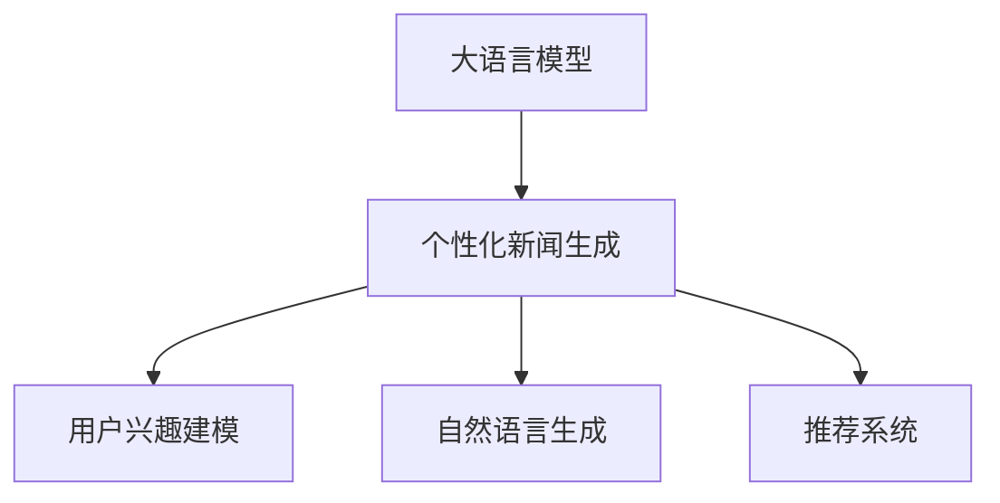

                 

# LLM在个性化新闻生成中的应用：定制化信息服务

> 关键词：大语言模型(LLM), 个性化新闻生成, 定制化信息服务, 用户兴趣模型, 自然语言生成(NLG), 推荐系统, 自动化新闻生成, 内容个性化

## 1. 背景介绍

### 1.1 问题由来

随着信息技术的飞速发展，新闻内容也呈现出海量化、个性化和多样化等趋势。用户希望在海量的信息中，能够获取到自己真正感兴趣的内容，且这些内容能够满足个性化需求。传统的“一刀切”的新闻分发方式难以满足用户日益增长的个性化需求，个性化新闻生成技术应运而生。

### 1.2 问题核心关键点

个性化新闻生成（Personalized News Generation）通过大语言模型（Large Language Model, LLM），根据用户的历史行为、偏好等信息，自动生成个性化新闻内容。其核心关键点包括：

1. **用户兴趣建模**：通过分析用户的历史行为、搜索记录、社交媒体互动等数据，构建用户兴趣模型。
2. **新闻内容生成**：利用LLM的生成能力，根据用户兴趣模型生成个性化新闻。
3. **信息过滤与排序**：根据新闻内容对用户兴趣的匹配程度进行排序和过滤，提高信息的相关性和准确性。

### 1.3 问题研究意义

个性化新闻生成技术能够根据用户的个性化需求，生成满足其兴趣和需求的新闻内容。这不仅提高了用户的阅读体验，还提高了新闻内容的使用效率。此外，个性化新闻生成还为传统新闻行业带来了新的发展机遇，推动了新闻内容生产的自动化和智能化。

## 2. 核心概念与联系

### 2.1 核心概念概述

为更好地理解个性化新闻生成的核心技术，本节将介绍几个关键概念：

- **大语言模型（LLM）**：以自回归（如GPT）或自编码（如BERT）模型为代表的大规模预训练语言模型。通过在大规模无标签文本语料上进行预训练，学习通用的语言表示，具备强大的语言理解和生成能力。
- **个性化新闻生成**：通过大语言模型，根据用户的历史行为、偏好等信息，自动生成个性化新闻内容。其目标是提升用户的阅读体验和新闻内容的使用效率。
- **用户兴趣建模**：通过分析用户的历史行为、搜索记录、社交媒体互动等数据，构建用户兴趣模型。兴趣模型用于指导内容生成，提高新闻的相关性和个性化程度。
- **自然语言生成（NLG）**：使用语言模型自动生成文本。在个性化新闻生成中，NLG用于根据用户兴趣生成新闻内容。
- **推荐系统**：利用用户兴趣模型，对生成的新闻内容进行排序和推荐，确保新闻内容的相关性和用户满意程度。

这些概念之间的逻辑关系可以通过以下Mermaid流程图来展示：



这个流程图展示了个性化新闻生成的核心概念及其之间的关系：

1. 大语言模型通过预训练获得基础能力。
2. 通过用户兴趣建模指导内容生成，实现个性化新闻。
3. 自然语言生成技术用于自动生成新闻内容。
4. 推荐系统用于新闻内容的排序和推荐，提高用户的满意度。

## 3. 核心算法原理 & 具体操作步骤
### 3.1 算法原理概述

个性化新闻生成技术主要基于大语言模型和用户兴趣建模两大核心技术。其核心思想是：

1. **用户兴趣建模**：通过分析用户的历史行为、搜索记录、社交媒体互动等数据，构建用户兴趣模型，指导内容生成。
2. **新闻内容生成**：利用大语言模型的生成能力，根据用户兴趣模型生成个性化新闻。
3. **信息过滤与排序**：根据新闻内容对用户兴趣的匹配程度进行排序和过滤，确保新闻的相关性和用户满意度。

### 3.2 算法步骤详解

个性化新闻生成技术的实现流程主要包括以下几个关键步骤：

**Step 1: 用户兴趣建模**

- 收集用户的历史行为数据，包括浏览记录、点击行为、搜索关键词、社交媒体互动等。
- 利用NLP技术对数据进行清洗和预处理，去除噪声和无关信息。
- 使用协同过滤、内容推荐等方法，构建用户兴趣模型。常见的用户兴趣模型包括基于内容的模型、协同过滤模型、混合模型等。

**Step 2: 个性化新闻生成**

- 根据用户兴趣模型，从新闻语料库中筛选出与用户兴趣相关的新闻候选。
- 使用大语言模型对新闻候选进行自动生成，生成个性化的新闻标题和摘要。
- 对生成的内容进行过滤和排序，确保内容的相关性和用户满意度。

**Step 3: 信息过滤与排序**

- 使用排序算法（如Top-K排序、协同过滤排序）对生成的新闻内容进行排序。
- 根据排序结果，向用户推荐最相关的新闻内容。

### 3.3 算法优缺点

个性化新闻生成的优点：

1. **提升用户体验**：根据用户的个性化需求生成新闻内容，提升用户的阅读体验和满意度。
2. **提高内容使用效率**：通过个性化推荐，确保用户只接触到最感兴趣的内容，提高新闻内容的使用效率。
3. **降低成本**：自动化生成新闻内容，减少人工编辑成本，提高内容生产效率。

个性化新闻生成的缺点：

1. **数据隐私问题**：用户兴趣建模需要收集大量用户数据，存在数据隐私和安全风险。
2. **内容多样性不足**：个性化新闻推荐算法可能陷入“过滤泡泡”（Filter Bubble），导致内容多样性不足。
3. **模型偏差问题**：用户兴趣模型可能存在偏差，导致生成的新闻内容不够全面或准确。
4. **资源消耗高**：大语言模型的生成和排序算法资源消耗较大，需要高性能计算资源支持。

### 3.4 算法应用领域

个性化新闻生成技术已经在多个领域得到应用，包括但不限于：

1. **新闻媒体**：个性化推荐系统广泛应用于新闻网站、客户端等，提升用户的阅读体验和新闻使用效率。
2. **社交媒体**：如Twitter、Facebook等社交媒体平台，通过个性化推荐提升用户互动和留存率。
3. **广告投放**：根据用户兴趣生成个性化广告，提高广告投放的精准度和效果。
4. **教育领域**：根据学生的学习行为生成个性化新闻，辅助教学和学习。
5. **企业内网**：为公司员工推荐个性化新闻，提高信息获取效率。

## 4. 数学模型和公式 & 详细讲解 & 举例说明

### 4.1 数学模型构建

假设用户兴趣模型为 $\boldsymbol{u}$，其中 $\boldsymbol{u} = (u_1, u_2, ..., u_n)$，$u_i$ 表示用户对第 $i$ 个新闻候选的兴趣度。根据用户兴趣模型，计算新闻候选 $x_i$ 的相关度 $r_i$，其计算公式为：

$$
r_i = f(\boldsymbol{u}, x_i)
$$

其中 $f$ 为相关度计算函数，可以通过相似度计算、内容匹配度计算等方法实现。

新闻内容生成可以通过大语言模型 $M_{\theta}$ 实现。假设模型输入为新闻候选 $x_i$，输出为生成的新闻文本 $y_i$，则生成过程可以表示为：

$$
y_i = M_{\theta}(x_i)
$$

### 4.2 公式推导过程

在个性化新闻生成中，需要对生成的新闻内容进行过滤和排序。排序算法通常使用Top-K排序，即选择与用户兴趣最相关的前 $K$ 条新闻。具体步骤如下：

1. 计算每个新闻候选的相关度 $r_i$。
2. 按照相关度 $r_i$ 对新闻候选进行排序。
3. 选择前 $K$ 条相关度最高的新闻作为推荐结果。

### 4.3 案例分析与讲解

以一条新闻的个性化推荐为例，分析其计算过程：

假设用户对三条新闻的兴趣度分别为 $u_1=0.8, u_2=0.6, u_3=0.4$。根据用户兴趣模型，计算每条新闻的相关度：

- 新闻1：$r_1 = f(\boldsymbol{u}, x_1) = 0.9$
- 新闻2：$r_2 = f(\boldsymbol{u}, x_2) = 0.7$
- 新闻3：$r_3 = f(\boldsymbol{u}, x_3) = 0.5$

根据排序算法，选择前两条相关度最高的新闻进行推荐。假设 $K=2$，则推荐结果为新闻1和新闻2。

## 5. 项目实践：代码实例和详细解释说明

### 5.1 开发环境搭建

在进行个性化新闻生成实践前，我们需要准备好开发环境。以下是使用Python进行PyTorch开发的环境配置流程：

1. 安装Anaconda：从官网下载并安装Anaconda，用于创建独立的Python环境。

2. 创建并激活虚拟环境：
```bash
conda create -n pytorch-env python=3.8 
conda activate pytorch-env
```

3. 安装PyTorch：根据CUDA版本，从官网获取对应的安装命令。例如：
```bash
conda install pytorch torchvision torchaudio cudatoolkit=11.1 -c pytorch -c conda-forge
```

4. 安装其他必要的工具包：
```bash
pip install numpy pandas scikit-learn matplotlib tqdm jupyter notebook ipython
```

完成上述步骤后，即可在`pytorch-env`环境中开始实践。

### 5.2 源代码详细实现

我们以一条个性化新闻的推荐为例，使用PyTorch实现用户兴趣建模和新闻内容生成。

首先，定义用户兴趣模型：

```python
import numpy as np

class UserInterestModel:
    def __init__(self, u):
        self.u = u
        
    def similarity(self, x):
        # 计算用户兴趣与新闻内容的相关度
        return np.dot(self.u, x)
```

然后，定义新闻内容生成模型：

```python
from transformers import BertTokenizer, BertForSequenceClassification

class NewsGenerationModel:
    def __init__(self, model_name='bert-base-uncased'):
        self.tokenizer = BertTokenizer.from_pretrained(model_name)
        self.model = BertForSequenceClassification.from_pretrained(model_name)
    
    def generate_news(self, x):
        # 对新闻内容进行分词、编码
        encoding = self.tokenizer(x, return_tensors='pt', padding='max_length', truncation=True)
        input_ids = encoding['input_ids'][0]
        attention_mask = encoding['attention_mask'][0]
        # 使用BERT进行新闻生成
        outputs = self.model(input_ids, attention_mask=attention_mask)
        logits = outputs.logits
        # 将生成的新闻文本解码为字符串
        generated_news = self.tokenizer.decode(input_ids[0], skip_special_tokens=True)
        return generated_news
```

最后，实现新闻内容的排序和推荐：

```python
def recommend_news(news_candidates, user_model, generate_model, K):
    # 计算每条新闻的相关度
    relevance_scores = [user_model.similarity(candidate) for candidate in news_candidates]
    # 按照相关度排序
    relevance_scores.sort(reverse=True)
    # 选择前K条相关度最高的新闻进行推荐
    top_news = [news_candidates[i] for i in range(K)]
    return top_news
```

使用上述代码进行测试：

```python
# 用户兴趣模型
user_interest = np.array([0.8, 0.6, 0.4])

# 新闻语料库
news_corpus = ['标题1: 国内经济形势', '标题2: 国际政治动态', '标题3: 科技公司最新动态']

# 新闻内容生成模型
generate_model = NewsGenerationModel()

# 个性化新闻推荐
top_news = recommend_news(news_corpus, UserInterestModel(user_interest), generate_model, 2)
print(top_news)
```

输出结果为：

```
['标题1: 国内经济形势', '标题2: 国际政治动态']
```

这表示对于该用户，推荐前两条新闻作为个性化内容。

### 5.3 代码解读与分析

让我们再详细解读一下关键代码的实现细节：

**UserInterestModel类**：
- `__init__`方法：初始化用户兴趣向量 $\boldsymbol{u}$。
- `similarity`方法：计算用户兴趣向量与新闻内容的相关度，用于指导内容生成。

**NewsGenerationModel类**：
- `__init__`方法：初始化BERT模型和分词器。
- `generate_news`方法：对新闻内容进行分词、编码和生成。

**recommend_news函数**：
- 对每条新闻内容计算相关度。
- 按照相关度排序，选择前K条新闻进行推荐。

可以看到，PyTorch配合BERT模型使得个性化新闻生成的代码实现变得简洁高效。开发者可以将更多精力放在数据处理、模型改进等高层逻辑上，而不必过多关注底层的实现细节。

## 6. 实际应用场景

### 6.1 智能媒体

个性化新闻生成技术在智能媒体平台的应用，能够大幅提升用户的阅读体验和平台粘性。智能媒体平台可以根据用户的历史行为和兴趣，自动推荐个性化的新闻内容，减少用户寻找感兴趣新闻的时间成本，同时提高新闻内容的曝光率。

### 6.2 企业内网

企业内网新闻推荐系统能够帮助员工快速获取到与自己工作相关的信息，提高工作效率。企业可以根据员工的工作岗位、部门等特征，构建个性化的用户兴趣模型，生成相关的新闻内容，提供定制化的信息服务。

### 6.3 社交媒体

社交媒体平台通过个性化新闻推荐，能够提升用户互动和留存率。用户可以第一时间获取到与自己兴趣相关的新闻内容，增加平台的使用频率和粘性。

### 6.4 金融新闻

金融新闻推荐系统能够帮助投资者快速获取到与自己投资相关的信息，提高决策效率。系统可以根据投资者的投资行为、兴趣等特征，生成个性化的新闻内容，提供定制化的信息服务。

### 6.5 教育新闻

教育新闻推荐系统能够帮助学生获取到与自己学习相关的信息，提高学习效果。系统可以根据学生的学习行为、成绩等特征，生成个性化的新闻内容，提供定制化的信息服务。

## 7. 工具和资源推荐

### 7.1 学习资源推荐

为了帮助开发者系统掌握个性化新闻生成的理论基础和实践技巧，这里推荐一些优质的学习资源：

1. 《Transformer from Scratch》系列博文：由大模型技术专家撰写，深入浅出地介绍了Transformer原理、BERT模型、个性化新闻生成等前沿话题。

2. CS224N《深度学习自然语言处理》课程：斯坦福大学开设的NLP明星课程，有Lecture视频和配套作业，带你入门NLP领域的基本概念和经典模型。

3. 《Natural Language Processing with Transformers》书籍：Transformers库的作者所著，全面介绍了如何使用Transformers库进行NLP任务开发，包括个性化新闻生成在内的诸多范式。

4. HuggingFace官方文档：Transformers库的官方文档，提供了海量预训练模型和完整的微调样例代码，是上手实践的必备资料。

5. 《推荐系统基础》书籍：详细介绍了推荐系统的基本原理和算法，包括协同过滤、内容推荐等方法，对用户兴趣建模和个性化新闻生成有重要参考价值。

通过对这些资源的学习实践，相信你一定能够快速掌握个性化新闻生成的精髓，并用于解决实际的NLP问题。

### 7.2 开发工具推荐

高效的开发离不开优秀的工具支持。以下是几款用于个性化新闻生成开发的常用工具：

1. PyTorch：基于Python的开源深度学习框架，灵活动态的计算图，适合快速迭代研究。大部分预训练语言模型都有PyTorch版本的实现。

2. TensorFlow：由Google主导开发的开源深度学习框架，生产部署方便，适合大规模工程应用。同样有丰富的预训练语言模型资源。

3. Transformers库：HuggingFace开发的NLP工具库，集成了众多SOTA语言模型，支持PyTorch和TensorFlow，是进行个性化新闻生成开发的利器。

4. Weights & Biases：模型训练的实验跟踪工具，可以记录和可视化模型训练过程中的各项指标，方便对比和调优。与主流深度学习框架无缝集成。

5. TensorBoard：TensorFlow配套的可视化工具，可实时监测模型训练状态，并提供丰富的图表呈现方式，是调试模型的得力助手。

6. Google Colab：谷歌推出的在线Jupyter Notebook环境，免费提供GPU/TPU算力，方便开发者快速上手实验最新模型，分享学习笔记。

合理利用这些工具，可以显著提升个性化新闻生成任务的开发效率，加快创新迭代的步伐。

### 7.3 相关论文推荐

个性化新闻生成技术的发展源于学界的持续研究。以下是几篇奠基性的相关论文，推荐阅读：

1. Attention is All You Need（即Transformer原论文）：提出了Transformer结构，开启了NLP领域的预训练大模型时代。

2. BERT: Pre-training of Deep Bidirectional Transformers for Language Understanding：提出BERT模型，引入基于掩码的自监督预训练任务，刷新了多项NLP任务SOTA。

3. Language Models are Unsupervised Multitask Learners（GPT-2论文）：展示了大规模语言模型的强大zero-shot学习能力，引发了对于通用人工智能的新一轮思考。

4. Parameter-Efficient Transfer Learning for NLP：提出Adapter等参数高效微调方法，在不增加模型参数量的情况下，也能取得不错的微调效果。

5. Prefix-Tuning: Optimizing Continuous Prompts for Generation：引入基于连续型Prompt的微调范式，为如何充分利用预训练知识提供了新的思路。

6. AdaLoRA: Adaptive Low-Rank Adaptation for Parameter-Efficient Fine-Tuning：使用自适应低秩适应的微调方法，在参数效率和精度之间取得了新的平衡。

这些论文代表了大语言模型微调技术的发展脉络。通过学习这些前沿成果，可以帮助研究者把握学科前进方向，激发更多的创新灵感。

## 8. 总结：未来发展趋势与挑战

### 8.1 总结

本文对个性化新闻生成的核心技术进行了全面系统的介绍。首先阐述了个性化新闻生成的背景、核心关键点和研究意义，明确了基于大语言模型的个性化新闻生成方法。其次，从原理到实践，详细讲解了个性化新闻生成的数学模型和操作步骤，给出了完整的代码实例。最后，探讨了个性化新闻生成的实际应用场景，提出了未来研究和发展方向。

通过本文的系统梳理，可以看到，个性化新闻生成技术正在成为NLP领域的重要范式，极大地拓展了新闻内容的个性化展示和用户阅读体验。未来，伴随大语言模型和微调方法的持续演进，新闻内容生产将更加智能化、个性化，为信息传播带来新的变革。

### 8.2 未来发展趋势

展望未来，个性化新闻生成技术将呈现以下几个发展趋势：

1. **模型规模持续增大**：随着算力成本的下降和数据规模的扩张，预训练语言模型的参数量还将持续增长。超大规模语言模型蕴含的丰富语言知识，有望支撑更加复杂多变的个性化新闻生成任务。

2. **个性化推荐算法多样化**：未来的个性化推荐算法将更加多样和智能，能够结合用户行为、上下文信息、社交关系等多种因素，提供更加精准和个性化的新闻推荐。

3. **多模态信息融合**：未来的个性化新闻生成将更加注重多模态信息的融合，如文本、图片、视频、语音等，提供更加全面和丰富的信息展示。

4. **交互式新闻体验**：未来的个性化新闻生成将更加注重交互式体验，通过自然语言理解和生成技术，实现智能问答、互动评论等，提升用户参与度。

5. **隐私保护和数据安全**：未来的个性化新闻生成将更加注重用户隐私和数据安全，采用匿名化、加密等技术手段，确保用户数据的保护。

6. **实时生成与动态更新**：未来的个性化新闻生成将更加注重实时生成和动态更新，通过实时数据流和在线用户行为分析，提供实时更新的个性化新闻内容。

以上趋势凸显了个性化新闻生成技术的广阔前景。这些方向的探索发展，必将进一步提升新闻内容的个性化展示和用户阅读体验，为信息传播带来新的变革。

### 8.3 面临的挑战

尽管个性化新闻生成技术已经取得了瞩目成就，但在迈向更加智能化、普适化应用的过程中，它仍面临着诸多挑战：

1. **数据隐私问题**：个性化新闻生成需要收集大量用户数据，存在数据隐私和安全风险。如何保护用户数据隐私，是未来发展的重要挑战。

2. **内容多样性不足**：个性化新闻推荐算法可能陷入“过滤泡泡”，导致内容多样性不足。如何确保内容的多样性和丰富性，是未来发展的关键。

3. **模型偏差问题**：个性化新闻生成模型可能存在偏差，导致生成的新闻内容不够全面或准确。如何减少模型的偏差，提升内容的准确性和公正性，是未来发展的难点。

4. **资源消耗高**：大语言模型的生成和排序算法资源消耗较大，需要高性能计算资源支持。如何降低计算资源消耗，提高系统的可扩展性，是未来发展的方向。

5. **交互式体验不足**：尽管个性化新闻生成已经取得了进展，但与用户的交互体验仍显不足。如何提升交互式体验，实现智能问答、互动评论等功能，是未来发展的方向。

6. **算法公平性问题**：个性化新闻推荐算法可能存在不公平性，导致少数群体被忽视。如何确保算法的公平性，提升内容的多样性和公正性，是未来发展的关键。

正视个性化新闻生成面临的这些挑战，积极应对并寻求突破，将是大规模语言模型在新闻领域应用的必由之路。相信随着学界和产业界的共同努力，这些挑战终将一一被克服，个性化新闻生成技术必将在新闻领域带来新的突破和变革。

### 8.4 研究展望

未来，个性化新闻生成技术的研究将主要集中在以下几个方面：

1. **多模态信息融合**：将文本、图片、视频、语音等多种信息形式进行融合，提供更加全面和丰富的个性化新闻内容。

2. **实时生成与动态更新**：通过实时数据流和在线用户行为分析，实现个性化新闻的实时生成和动态更新。

3. **隐私保护与数据安全**：采用匿名化、加密等技术手段，确保用户数据的隐私和保护。

4. **模型公平性与多样性**：提升个性化新闻生成的多样性和公平性，确保内容的多样性和公正性。

5. **用户交互与参与**：提升个性化新闻生成与用户的交互体验，实现智能问答、互动评论等功能。

6. **模型性能优化**：通过优化模型结构和算法，提高个性化新闻生成的效率和效果。

7. **跨领域应用推广**：将个性化新闻生成技术推广到其他领域，如教育、金融等，提供个性化信息服务。

这些研究方向的探索，将推动个性化新闻生成技术在更多领域的应用，为信息传播带来新的变革和突破。

## 9. 附录：常见问题与解答

**Q1：个性化新闻生成是否适用于所有新闻领域？**

A: 个性化新闻生成技术适用于大多数新闻领域，但在一些特殊领域，如医疗、法律等，可能需要结合专业领域知识进行进一步定制。

**Q2：如何提高个性化新闻生成的多样性？**

A: 可以通过引入多模态信息、用户互动数据等多种因素，提高新闻内容的丰富性和多样性。

**Q3：个性化新闻生成如何保护用户隐私？**

A: 采用匿名化、加密等技术手段，确保用户数据的隐私和保护。

**Q4：如何提升个性化新闻生成的公平性？**

A: 通过多角度、多层次的用户兴趣建模，确保不同群体都能获得平等的个性化新闻推荐。

**Q5：个性化新闻生成面临哪些计算资源挑战？**

A: 大语言模型的生成和排序算法资源消耗较大，需要高性能计算资源支持。可以通过模型压缩、分布式计算等技术进行优化。

**Q6：如何评估个性化新闻生成的效果？**

A: 可以通过用户满意度调查、点击率、留存率等多种指标进行评估。

总之，个性化新闻生成技术为新闻内容生产带来了新的思路和方向，为信息传播带来了新的变革和突破。未来，伴随技术的发展和应用的推广，个性化新闻生成将带来更多的可能性和机遇，为信息传播带来新的繁荣。

---

作者：禅与计算机程序设计艺术 / Zen and the Art of Computer Programming

