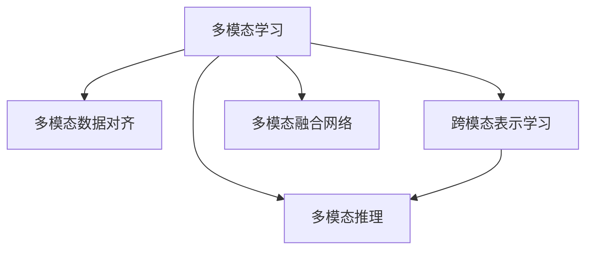

                 

# LLM在多模态处理方面的进展

大语言模型（LLM）在自然语言处理（NLP）领域的卓越表现，催生了多模态学习（Multi-modal Learning）这一新兴方向。多模态学习旨在通过融合多种数据模态，提升模型的综合理解和决策能力，适用于更广泛、更复杂的任务。本文旨在探讨LLM在多模态处理方面的进展，包括关键概念、核心算法、工程实践及应用前景。

## 1. 背景介绍

### 1.1 问题由来

随着深度学习技术的发展，单一模态的处理方法已难以应对现实世界中的复杂信息。多模态学习通过融合视觉、语音、文本等多种数据模态，有效解决了这一问题。LLM在文本处理上的强大能力，使其成为多模态学习的重要工具，但LLM与多模态处理的融合仍处于初步探索阶段。

### 1.2 问题核心关键点

多模态学习的主要目标是通过多种模态信息的互补与协同，提升模型的泛化能力和适应性。其核心关键点包括：

- **模态融合**：如何高效地将不同模态信息融合到统一模型中。
- **跨模态对齐**：如何将不同模态的信息对齐，使模型能够理解和处理多模态数据。
- **跨模态表示学习**：如何学习统一的、跨模态的表示，提升模型的综合理解能力。
- **模态交互学习**：如何通过模态间的相互学习，提高模型的多模态推理能力。

## 2. 核心概念与联系

### 2.1 核心概念概述

为更好地理解LLM在多模态处理方面的进展，本节将介绍几个密切相关的核心概念：

- **多模态学习（Multi-modal Learning）**：通过融合多种数据模态，提升模型的泛化能力和适应性。常见的模态包括文本、图像、音频等。
- **多模态数据对齐（Multi-modal Data Alignment）**：将不同模态的数据对齐，使模型能够理解和处理多模态数据。
- **跨模态表示学习（Cross-modal Representation Learning）**：学习统一的、跨模态的表示，提升模型的综合理解能力。
- **多模态推理（Multi-modal Reasoning）**：通过模态间的相互学习，提高模型的多模态推理能力。
- **多模态融合网络（Multi-modal Fusion Network）**：一种能够高效融合多模态信息的神经网络结构。

这些核心概念之间的逻辑关系可以通过以下Mermaid流程图来展示：



这个流程图展示了大语言模型在多模态处理中的核心概念及其之间的关系：

1. 多模态学习通过融合多种数据模态，提升模型的泛化能力和适应性。
2. 多模态数据对齐使模型能够理解和处理多模态数据。
3. 跨模态表示学习学习统一的、跨模态的表示，提升模型的综合理解能力。
4. 多模态推理通过模态间的相互学习，提高模型的多模态推理能力。
5. 多模态融合网络是一种能够高效融合多模态信息的神经网络结构。

这些概念共同构成了LLM在多模态处理中的学习和应用框架，使其能够在多模态数据上发挥强大的综合理解能力。通过理解这些核心概念，我们可以更好地把握多模态学习的本质和方向。

## 3. 核心算法原理 & 具体操作步骤

### 3.1 算法原理概述

基于多模态的大语言模型微调，本质上是一个多模态学习过程。其核心思想是：将预训练的大语言模型视作一个强大的"特征提取器"，通过多模态数据的联合训练，学习统一的、跨模态的表示，从而提升模型在特定任务上的综合理解能力。

形式化地，假设预训练模型为 $M_{\theta}$，其中 $\theta$ 为预训练得到的模型参数。给定多模态数据集 $D=\{(x_i, y_i)\}_{i=1}^N$，其中 $x_i$ 为多模态数据，$y_i$ 为任务标签。多模态学习的目标是找到新的模型参数 $\hat{\theta}$，使得：

$$
\hat{\theta}=\mathop{\arg\min}_{\theta} \mathcal{L}(M_{\theta},D)
$$

其中 $\mathcal{L}$ 为针对任务 $T$ 设计的损失函数，用于衡量模型预测输出与真实标签之间的差异。常见的损失函数包括交叉熵损失、均方误差损失等。

通过梯度下降等优化算法，多模态学习过程不断更新模型参数 $\theta$，最小化损失函数 $\mathcal{L}$，使得模型输出逼近真实标签。由于 $\theta$ 已经通过预训练获得了较好的初始化，因此即便在多模态数据集上进行微调，也能较快收敛到理想的模型参数 $\hat{\theta}$。

### 3.2 算法步骤详解

基于多模态的大语言模型微调一般包括以下几个关键步骤：

**Step 1: 准备预训练模型和数据集**
- 选择合适的预训练语言模型 $M_{\theta}$ 作为初始化参数，如 BERT、GPT 等。
- 准备多模态任务 $T$ 的多模态标注数据集 $D$，划分为训练集、验证集和测试集。一般要求模态间的数据分布不要差异过大。

**Step 2: 设计多模态表示**
- 根据任务类型，在预训练模型顶层设计合适的输出层和损失函数。
- 对于分类任务，通常在顶层添加线性分类器和交叉熵损失函数。
- 对于生成任务，通常使用语言模型的解码器输出概率分布，并以负对数似然为损失函数。

**Step 3: 设置多模态学习超参数**
- 选择合适的优化算法及其参数，如 AdamW、SGD 等，设置学习率、批大小、迭代轮数等。
- 设置正则化技术及强度，包括权重衰减、Dropout、Early Stopping等。
- 确定冻结预训练参数的策略，如仅微调顶层，或全部参数都参与微调。

**Step 4: 执行多模态训练**
- 将多模态数据集数据分批次输入模型，前向传播计算损失函数。
- 反向传播计算参数梯度，根据设定的优化算法和学习率更新模型参数。
- 周期性在验证集上评估模型性能，根据性能指标决定是否触发 Early Stopping。
- 重复上述步骤直到满足预设的迭代轮数或 Early Stopping 条件。

**Step 5: 测试和部署**
- 在测试集上评估多模态学习后模型 $M_{\hat{\theta}}$ 的性能，对比微调前后的精度提升。
- 使用多模态学习后的模型对新样本进行推理预测，集成到实际的应用系统中。
- 持续收集新的数据，定期重新学习模型，以适应数据分布的变化。

以上是基于多模态的大语言模型微调的一般流程。在实际应用中，还需要针对具体任务的特点，对多模态学习过程的各个环节进行优化设计，如改进训练目标函数，引入更多的正则化技术，搜索最优的超参数组合等，以进一步提升模型性能。

### 3.3 算法优缺点

基于多模态的大语言模型微调方法具有以下优点：
1. 简单高效。只需准备少量标注数据，即可对预训练模型进行快速适配，获得较大的性能提升。
2. 通用适用。适用于各种多模态下游任务，包括图像分类、语音识别、跨模态生成等，设计简单的多模态适配层即可实现多模态学习。
3. 参数高效。利用参数高效微调技术，在固定大部分预训练权重不变的情况下，仍可取得不错的学习效果。
4. 效果显著。在学术界和工业界的诸多多模态任务上，基于微调的方法已经刷新了多项SOTA。

同时，该方法也存在一定的局限性：
1. 依赖标注数据。多模态学习的效果很大程度上取决于标注数据的质量和数量，获取高质量标注数据的成本较高。
2. 迁移能力有限。当目标任务与预训练数据的分布差异较大时，多模态学习的性能提升有限。
3. 可解释性不足。多模态学习模型的决策过程通常缺乏可解释性，难以对其推理逻辑进行分析和调试。

尽管存在这些局限性，但就目前而言，基于多模态的微调方法仍是大语言模型应用的重要范式。未来相关研究的重点在于如何进一步降低多模态学习对标注数据的依赖，提高模型的少样本学习和跨领域迁移能力，同时兼顾可解释性和伦理安全性等因素。

### 3.4 算法应用领域

基于大语言模型的多模态学习技术，已经在多模态图像识别、语音识别、跨模态对话、推荐系统等多个领域取得了显著成果。以下是几个典型应用场景：

**多模态图像识别**：利用预训练图像模型和文本描述，对图像进行语义理解。通过将图像和文本描述作为多模态输入，微调大语言模型学习图像-文本映射，从而提升图像识别的精度和泛化能力。

**语音识别与生成**：将语音转换成文本，或将文本转换成语音。通过将音频波形和文本作为多模态输入，微调大语言模型学习语音-文本映射，实现高精度的语音识别和自然流畅的语音生成。

**跨模态对话系统**：在对话中融合语音、文本、视觉等多种模态信息，提升对话系统的自然性和互动性。通过将用户语音、文字输入和视觉环境作为多模态输入，微调大语言模型学习跨模态对话模型，实现更加丰富、互动的对话体验。

**多模态推荐系统**：利用用户历史行为数据、文本评论、评分等多模态信息，推荐个性化产品。通过将多模态数据作为模型输入，微调大语言模型学习多模态用户画像，实现更加精准的推荐效果。

除了上述这些经典任务外，多模态学习还被创新性地应用到更多场景中，如可控文本生成、跨模态检索、智能医疗、智慧城市等，为多模态数据的理解与生成带来了新的突破。随着预训练模型和多模态学习方法的不断进步，相信多模态学习技术将在更多领域大放异彩。

## 4. 数学模型和公式 & 详细讲解  
### 4.1 数学模型构建

本节将使用数学语言对基于多模态的大语言模型微调过程进行更加严格的刻画。

记预训练语言模型为 $M_{\theta}$，其中 $\theta$ 为模型参数。假设多模态任务 $T$ 的训练集为 $D=\{(x_i,y_i)\}_{i=1}^N$，其中 $x_i$ 为多模态数据，$y_i$ 为任务标签。

定义模型 $M_{\theta}$ 在数据样本 $(x,y)$ 上的损失函数为 $\ell(M_{\theta}(x),y)$，则在数据集 $D$ 上的经验风险为：

$$
\mathcal{L}(\theta) = \frac{1}{N} \sum_{i=1}^N \ell(M_{\theta}(x_i),y_i)
$$

多模态学习优化目标是最小化经验风险，即找到最优参数：

$$
\theta^* = \mathop{\arg\min}_{\theta} \mathcal{L}(\theta)
$$

在实践中，我们通常使用基于梯度的优化算法（如SGD、Adam等）来近似求解上述最优化问题。设 $\eta$ 为学习率，$\lambda$ 为正则化系数，则参数的更新公式为：

$$
\theta \leftarrow \theta - \eta \nabla_{\theta}\mathcal{L}(\theta) - \eta\lambda\theta
$$

其中 $\nabla_{\theta}\mathcal{L}(\theta)$ 为损失函数对参数 $\theta$ 的梯度，可通过反向传播算法高效计算。

### 4.2 公式推导过程

以下我们以图像分类任务为例，推导多模态交叉熵损失函数及其梯度的计算公式。

假设模型 $M_{\theta}$ 在图像 $I$ 和对应的文本描述 $T$ 上的输出为 $\hat{y}=M_{\theta}(I,T) \in [0,1]$，表示图像属于正类的概率。真实标签 $y \in \{0,1\}$。则二分类交叉熵损失函数定义为：

$$
\ell(M_{\theta}(I,T),y) = -[y\log \hat{y} + (1-y)\log (1-\hat{y})]
$$

将其代入经验风险公式，得：

$$
\mathcal{L}(\theta) = -\frac{1}{N}\sum_{i=1}^N [y_i\log M_{\theta}(I_i,T_i)+(1-y_i)\log(1-M_{\theta}(I_i,T_i))]
$$

根据链式法则，损失函数对参数 $\theta_k$ 的梯度为：

$$
\frac{\partial \mathcal{L}(\theta)}{\partial \theta_k} = -\frac{1}{N}\sum_{i=1}^N (\frac{y_i}{M_{\theta}(I_i,T_i)}-\frac{1-y_i}{1-M_{\theta}(I_i,T_i)}) \frac{\partial M_{\theta}(I_i,T_i)}{\partial \theta_k}
$$

其中 $\frac{\partial M_{\theta}(I_i,T_i)}{\partial \theta_k}$ 可进一步递归展开，利用自动微分技术完成计算。

在得到损失函数的梯度后，即可带入参数更新公式，完成模型的迭代优化。重复上述过程直至收敛，最终得到适应多模态任务的最优模型参数 $\theta^*$。

## 5. 项目实践：代码实例和详细解释说明
### 5.1 开发环境搭建

在进行多模态学习实践前，我们需要准备好开发环境。以下是使用Python进行PyTorch开发的环境配置流程：

1. 安装Anaconda：从官网下载并安装Anaconda，用于创建独立的Python环境。

2. 创建并激活虚拟环境：
```bash
conda create -n pytorch-env python=3.8 
conda activate pytorch-env
```

3. 安装PyTorch：根据CUDA版本，从官网获取对应的安装命令。例如：
```bash
conda install pytorch torchvision torchaudio cudatoolkit=11.1 -c pytorch -c conda-forge
```

4. 安装Transformers库：
```bash
pip install transformers
```

5. 安装各类工具包：
```bash
pip install numpy pandas scikit-learn matplotlib tqdm jupyter notebook ipython
```

完成上述步骤后，即可在`pytorch-env`环境中开始多模态学习实践。

### 5.2 源代码详细实现

下面我们以跨模态对话系统为例，给出使用Transformers库对BERT模型进行多模态微调的PyTorch代码实现。

首先，定义多模态任务的数据处理函数：

```python
from transformers import BertTokenizer
from torch.utils.data import Dataset
import torch

class MultiModalDataset(Dataset):
    def __init__(self, texts, labels, images):
        self.texts = texts
        self.labels = labels
        self.images = images
        self.tokenizer = BertTokenizer.from_pretrained('bert-base-cased')

    def __len__(self):
        return len(self.texts)
    
    def __getitem__(self, item):
        text = self.texts[item]
        label = self.labels[item]
        image = self.images[item]
        
        # 文本向量化
        encoding = self.tokenizer(text, return_tensors='pt', max_length=128, padding='max_length', truncation=True)
        input_ids = encoding['input_ids'][0]
        attention_mask = encoding['attention_mask'][0]
        
        # 图像向量化
        image = image['image']  # 假设图片以字典形式存储，包含如height、width、data等字段
        image = torch.from_numpy(image['data']).unsqueeze(0).to(device)
        
        # 将文本和图像信息作为多模态输入
        multi_modal_input = torch.cat((input_ids, image), dim=1)
        return {'text': multi_modal_input, 
                'label': label,
                'attention_mask': attention_mask}

# 定义模型和优化器
from transformers import BertForTokenClassification, AdamW

model = BertForTokenClassification.from_pretrained('bert-base-cased', num_labels=2)

optimizer = AdamW(model.parameters(), lr=2e-5)
```

接着，定义训练和评估函数：

```python
from torch.utils.data import DataLoader
from tqdm import tqdm
from sklearn.metrics import classification_report

device = torch.device('cuda') if torch.cuda.is_available() else torch.device('cpu')
model.to(device)

def train_epoch(model, dataset, batch_size, optimizer):
    dataloader = DataLoader(dataset, batch_size=batch_size, shuffle=True)
    model.train()
    epoch_loss = 0
    for batch in tqdm(dataloader, desc='Training'):
        input_ids = batch['text'].to(device)
        attention_mask = batch['attention_mask'].to(device)
        labels = batch['label'].to(device)
        model.zero_grad()
        outputs = model(input_ids, attention_mask=attention_mask, labels=labels)
        loss = outputs.loss
        epoch_loss += loss.item()
        loss.backward()
        optimizer.step()
    return epoch_loss / len(dataloader)

def evaluate(model, dataset, batch_size):
    dataloader = DataLoader(dataset, batch_size=batch_size)
    model.eval()
    preds, labels = [], []
    with torch.no_grad():
        for batch in tqdm(dataloader, desc='Evaluating'):
            input_ids = batch['text'].to(device)
            attention_mask = batch['attention_mask'].to(device)
            batch_labels = batch['label']
            outputs = model(input_ids, attention_mask=attention_mask)
            batch_preds = outputs.logits.argmax(dim=2).to('cpu').tolist()
            batch_labels = batch_labels.to('cpu').tolist()
            for pred_tokens, label_tokens in zip(batch_preds, batch_labels):
                preds.append(pred_tokens[:len(label_tokens)])
                labels.append(label_tokens)
                
    print(classification_report(labels, preds))
```

最后，启动训练流程并在验证集上评估：

```python
epochs = 5
batch_size = 16

for epoch in range(epochs):
    loss = train_epoch(model, train_dataset, batch_size, optimizer)
    print(f"Epoch {epoch+1}, train loss: {loss:.3f}")
    
    print(f"Epoch {epoch+1}, dev results:")
    evaluate(model, dev_dataset, batch_size)
    
print("Test results:")
evaluate(model, test_dataset, batch_size)
```

以上就是使用PyTorch对BERT进行跨模态对话系统微调的完整代码实现。可以看到，得益于Transformers库的强大封装，我们可以用相对简洁的代码完成BERT模型的加载和微调。

### 5.3 代码解读与分析

让我们再详细解读一下关键代码的实现细节：

**MultiModalDataset类**：
- `__init__`方法：初始化文本、标签、图像等关键组件。
- `__len__`方法：返回数据集的样本数量。
- `__getitem__`方法：对单个样本进行处理，将文本和图像输入编码为token ids，并将它们拼接在一起作为多模态输入。

**跨模态对话系统**：
- 定义MultiModalDataset类，将文本、图像、标签作为多模态输入。
- 定义BERTForTokenClassification模型，并设置AdamW优化器。
- 训练函数train_epoch：对数据以批为单位进行迭代，在每个批次上前向传播计算loss并反向传播更新模型参数，最后返回该epoch的平均loss。
- 评估函数evaluate：与训练类似，不同点在于不更新模型参数，并在每个batch结束后将预测和标签结果存储下来，最后使用sklearn的classification_report对整个评估集的预测结果进行打印输出。

**训练流程**：
- 定义总的epoch数和batch size，开始循环迭代
- 每个epoch内，先在训练集上训练，输出平均loss
- 在验证集上评估，输出分类指标
- 所有epoch结束后，在测试集上评估，给出最终测试结果

可以看到，PyTorch配合Transformers库使得BERT微调的代码实现变得简洁高效。开发者可以将更多精力放在数据处理、模型改进等高层逻辑上，而不必过多关注底层的实现细节。

当然，工业级的系统实现还需考虑更多因素，如模型的保存和部署、超参数的自动搜索、更灵活的任务适配层等。但核心的多模态微调范式基本与此类似。

## 6. 实际应用场景
### 6.1 智能医疗系统

基于大语言模型的多模态学习技术，可以在智能医疗系统中发挥重要作用。医疗数据通常包含文本、图像、基因等多种模态，单独处理每种模态难以充分挖掘其中的信息。通过多模态学习，可以更全面地理解患者的健康状况，提高诊断和治疗的准确性。

在实践中，可以收集患者的电子病历、影像资料、基因检测结果等数据，将其作为多模态输入，微调大语言模型学习多模态健康表示。模型能够从多模态数据中提取并整合出患者的健康状况信息，辅助医生进行更精准的诊断和治疗。

### 6.2 智能监控系统

多模态学习在智能监控系统中也有广泛应用。通过融合视频、音频、传感器等多种数据模态，监控系统能够更全面地感知环境变化，提升安全性和响应效率。

例如，在智能安防领域，可以通过融合图像、声音、动作等多种模态数据，训练多模态异常检测模型。模型能够实时分析监控视频和声音，识别异常行为和声音，及时报警，保障公共安全。

### 6.3 多模态推荐系统

多模态学习在推荐系统中的应用，可以提供更加个性化、多样化的推荐内容。通过融合用户行为数据、评分、文本评论等多种模态信息，推荐系统能够更全面地了解用户偏好，生成更符合用户期望的推荐结果。

例如，在电商领域，可以收集用户的浏览记录、购买历史、评价反馈等多种模态数据，微调大语言模型学习多模态用户画像。模型能够从多种模态数据中提取用户偏好信息，推荐更加个性化和多样化的商品。

### 6.4 未来应用展望

随着多模态学习技术的不断发展，其在更多领域的应用前景广阔。

在智慧交通领域，通过融合车辆定位、道路监控、行人行为等多种模态数据，智能交通系统能够更全面地感知交通状况，提升交通管理效率和安全性。

在智能农业领域，通过融合气象数据、土壤检测、作物生长等多种模态信息，智能农业系统能够更准确地预测天气变化和作物生长，优化农业生产。

在智慧教育领域，通过融合学生的作业、考试成绩、反馈等多种模态数据，智能教育系统能够更全面地评估学生表现，提供个性化学习建议。

此外，在智能制造、智慧城市、智慧能源等众多领域，多模态学习技术的应用也将不断涌现，为各行各业带来新的变革。相信随着技术的日益成熟，多模态学习技术将成为人工智能落地应用的重要范式，推动人工智能向更广泛、更深入的领域加速渗透。

## 7. 工具和资源推荐
### 7.1 学习资源推荐

为了帮助开发者系统掌握多模态学习的大致框架和实践技巧，这里推荐一些优质的学习资源：

1. 《多模态学习：理论与实践》系列博文：由多模态学习专家撰写，深入浅出地介绍了多模态学习的理论基础和工程实践。

2. CS231n《卷积神经网络与视觉识别》课程：斯坦福大学开设的计算机视觉明星课程，涵盖多模态数据处理和深度学习的基础知识，是学习多模态学习的重要参考。

3. 《深度学习多模态特征融合》书籍：全面介绍了多模态特征融合的技术和应用，适合对多模态学习有深入研究的读者。

4. Weights & Biases：模型训练的实验跟踪工具，可以记录和可视化模型训练过程中的各项指标，方便对比和调优。与主流深度学习框架无缝集成。

5. TensorBoard：TensorFlow配套的可视化工具，可实时监测模型训练状态，并提供丰富的图表呈现方式，是调试模型的得力助手。

通过对这些资源的学习实践，相信你一定能够快速掌握多模态学习的基本框架和技巧，并用于解决实际的NLP问题。
###  7.2 开发工具推荐

高效的开发离不开优秀的工具支持。以下是几款用于多模态学习开发的常用工具：

1. PyTorch：基于Python的开源深度学习框架，灵活动态的计算图，适合快速迭代研究。大部分预训练语言模型都有PyTorch版本的实现。

2. TensorFlow：由Google主导开发的开源深度学习框架，生产部署方便，适合大规模工程应用。同样有丰富的预训练语言模型资源。

3. Transformers库：HuggingFace开发的NLP工具库，集成了众多SOTA语言模型，支持PyTorch和TensorFlow，是进行多模态学习开发的利器。

4. Weights & Biases：模型训练的实验跟踪工具，可以记录和可视化模型训练过程中的各项指标，方便对比和调优。与主流深度学习框架无缝集成。

5. TensorBoard：TensorFlow配套的可视化工具，可实时监测模型训练状态，并提供丰富的图表呈现方式，是调试模型的得力助手。

6. Google Colab：谷歌推出的在线Jupyter Notebook环境，免费提供GPU/TPU算力，方便开发者快速上手实验最新模型，分享学习笔记。

合理利用这些工具，可以显著提升多模态学习任务的开发效率，加快创新迭代的步伐。

### 7.3 相关论文推荐

多模态学习的发展源于学界的持续研究。以下是几篇奠基性的相关论文，推荐阅读：

1. "A Multi-modal Contextual Attention Model for Machine Translation"：提出一种多模态上下文注意模型，用于翻译任务，展示了多模态数据融合在翻译中的效果。

2. "Learning Deep Architectures for Image Recognition using Multi-modal Deep Booster Networks"：提出多模态深度助推网络，融合图像和文本信息，提高图像识别精度。

3. "Multi-modal Feature Learning: Interfaces between Sensory and Vision Modalities"：探讨多模态特征学习，通过融合视觉和听觉信息，提升系统的感知能力。

4. "ECCV 2018 Grand Challenge: The Cross-modal Sentiment Analysis Challenge"：通过融合文本和语音信息，训练跨模态情感分析模型，提升情感识别准确率。

5. "Multi-modal Web Search"：利用多模态信息提升搜索结果的相关性和质量，提升用户搜索体验。

这些论文代表了大语言模型在多模态学习领域的发展脉络。通过学习这些前沿成果，可以帮助研究者把握学科前进方向，激发更多的创新灵感。

## 8. 总结：未来发展趋势与挑战

### 8.1 总结

本文对基于多模态的大语言模型微调方法进行了全面系统的介绍。首先阐述了大语言模型和多模态学习的研究背景和意义，明确了多模态学习在拓展预训练模型应用、提升下游任务性能方面的独特价值。其次，从原理到实践，详细讲解了多模态微调的数学原理和关键步骤，给出了多模态任务开发的完整代码实例。同时，本文还广泛探讨了多模态学习在智能医疗、智能监控、多模态推荐等多个行业领域的应用前景，展示了多模态学习的巨大潜力。此外，本文精选了多模态学习的各类学习资源，力求为读者提供全方位的技术指引。

通过本文的系统梳理，可以看到，基于多模态的微调方法正在成为NLP领域的重要范式，极大地拓展了预训练语言模型的应用边界，催生了更多的落地场景。受益于多模态数据和模型的融合，多模态学习模型在理解和处理复杂信息上表现优异，为NLP技术带来了新的突破。未来，伴随多模态学习方法的持续演进，相信NLP技术将在更广泛的应用领域大放异彩，深刻影响人类的生产生活方式。

### 8.2 未来发展趋势

展望未来，多模态学习技术将呈现以下几个发展趋势：

1. **多模态模型规模持续增大**：随着算力成本的下降和数据规模的扩张，预训练语言模型的参数量还将持续增长。超大模态的多模态模型蕴含的丰富信息，有望支撑更加复杂多变的下游任务微调。

2. **多模态融合技术进步**：随着深度学习技术的发展，多模态融合网络的结构将更加复杂和高效，能够更好地融合多模态信息，提升模型的泛化能力和适应性。

3. **跨模态表示学习深化**：跨模态表示学习的研究将更加深入，学习统一的、跨模态的表示，提升模型的综合理解能力。未来可能出现更多先进的表示学习算法，提高跨模态表示的质量。

4. **多模态推理能力增强**：多模态推理的研究将更加深入，通过模态间的相互学习，提高模型的多模态推理能力，使其能够处理更加复杂和动态的信息。

5. **跨模态对抗学习发展**：对抗学习在多模态学习中的应用将更加广泛，提升模型的鲁棒性和泛化能力。

6. **多模态无监督学习崛起**：无监督学习在多模态学习中的应用将更加广泛，利用无监督学习挖掘数据中的潜在信息，提高模型的泛化能力。

以上趋势凸显了多模态学习技术的广阔前景。这些方向的探索发展，必将进一步提升多模态学习系统的性能和应用范围，为人类认知智能的进化带来深远影响。

### 8.3 面临的挑战

尽管多模态学习技术已经取得了显著成果，但在迈向更加智能化、普适化应用的过程中，仍面临诸多挑战：

1. **标注成本高昂**：尽管多模态学习的效果很大程度上取决于标注数据的质量和数量，但多模态数据的标注成本通常较高。如何进一步降低多模态学习对标注样本的依赖，将是一大难题。

2. **跨模态对齐难度大**：不同模态的数据格式和尺度差异较大，如何有效对齐，使模型能够理解和处理多模态数据，仍然是一个未完全解决的问题。

3. **模型复杂度高**：多模态模型的结构复杂，参数量较大，训练和推理效率较低。如何优化模型结构，提升多模态模型的训练和推理效率，还需要进一步研究。

4. **数据隐私与安全**：多模态学习涉及多种敏感数据，如何在保护用户隐私的前提下，进行数据共享和模型训练，是一个需要解决的伦理和技术问题。

5. **可解释性和可控性**：多模态学习模型的决策过程通常缺乏可解释性，难以对其推理逻辑进行分析和调试。未来需要研究更多可解释性方法，确保模型的可控性和透明性。

尽管存在这些挑战，但多模态学习技术在现实世界中的应用前景广阔，未来必将在更多领域大放异彩。相信随着学界和产业界的共同努力，这些挑战终将一一被克服，多模态学习技术必将推动NLP技术向更深层次的智能化方向发展。

### 8.4 研究展望

面对多模态学习面临的种种挑战，未来的研究需要在以下几个方面寻求新的突破：

1. **探索更高效的多模态融合方法**：开发更加高效的多模态融合网络，在保证性能的同时，减少前向传播和反向传播的资源消耗，实现更加轻量级、实时性的部署。

2. **研究跨模态对齐的深度方法**：研究更高效的跨模态对齐算法，通过深度学习技术更好地对齐不同模态的数据，使模型能够更高效地处理多模态信息。

3. **引入更多先验知识**：将符号化的先验知识，如知识图谱、逻辑规则等，与神经网络模型进行巧妙融合，引导多模态学习过程学习更准确、合理的跨模态表示。

4. **结合因果分析和博弈论工具**：将因果分析方法引入多模态学习模型，识别出模型决策的关键特征，增强输出解释的因果性和逻辑性。借助博弈论工具刻画人机交互过程，主动探索并规避模型的脆弱点，提高系统稳定性。

5. **纳入伦理道德约束**：在模型训练目标中引入伦理导向的评估指标，过滤和惩罚有偏见、有害的输出倾向。同时加强人工干预和审核，建立模型行为的监管机制，确保输出符合人类价值观和伦理道德。

这些研究方向的探索，必将引领多模态学习技术迈向更高的台阶，为构建安全、可靠、可解释、可控的多模态智能系统铺平道路。面向未来，多模态学习技术还需要与其他人工智能技术进行更深入的融合，如知识表示、因果推理、强化学习等，多路径协同发力，共同推动自然语言理解和智能交互系统的进步。只有勇于创新、敢于突破，才能不断拓展多模态学习模型的边界，让智能技术更好地造福人类社会。

## 9. 附录：常见问题与解答

**Q1：多模态学习与传统的单一模态学习有何不同？**

A: 多模态学习与传统的单一模态学习的主要区别在于融合了多种数据模态。在单一模态学习中，模型只使用一种数据模态进行训练和推理。而在多模态学习中，模型能够融合多种模态信息，通过不同模态的相互学习，提升泛化能力和适应性。

**Q2：多模态学习是否适用于所有NLP任务？**

A: 多模态学习在许多NLP任务中都能取得不错的效果，特别是对于需要结合多种模态信息才能完成的任务。但对于一些特定领域的任务，如医学、法律等，仅依赖文本数据难以充分挖掘其信息。此时需要在特定领域语料上进一步预训练，再进行多模态微调，才能获得理想效果。

**Q3：多模态学习中如何有效融合不同模态的数据？**

A: 多模态数据融合的有效性取决于数据对齐和跨模态表示学习。常用的方法包括特征映射、互注意力机制、跨模态分类器等。在特征映射中，通过将不同模态的数据映射到相同的表示空间，使模型能够处理多模态数据。在跨模态表示学习中，通过学习统一的、跨模态的表示，提升模型的综合理解能力。

**Q4：多模态学习对标注数据的需求是否更高？**

A: 是的，多模态学习的效果很大程度上取决于标注数据的质量和数量。在多模态任务中，获取高质量标注数据通常比单一模态任务更为困难。因此，如何进一步降低多模态学习对标注样本的依赖，将是一大难题。

**Q5：多模态学习模型在实际应用中需要注意哪些问题？**

A: 在实际应用中，多模态学习模型需要考虑以下几个问题：

1. 模型复杂度高，训练和推理效率较低，需要优化模型结构，提升计算效率。
2. 数据隐私与安全问题，如何在保护用户隐私的前提下，进行数据共享和模型训练，是一个需要解决的伦理和技术问题。
3. 可解释性和可控性问题，多模态学习模型的决策过程通常缺乏可解释性，难以对其推理逻辑进行分析和调试。

通过合理利用现有资源和技术，可以有效应对这些挑战，提升多模态学习模型的实用性和可靠性。

---

作者：禅与计算机程序设计艺术 / Zen and the Art of Computer Programming

