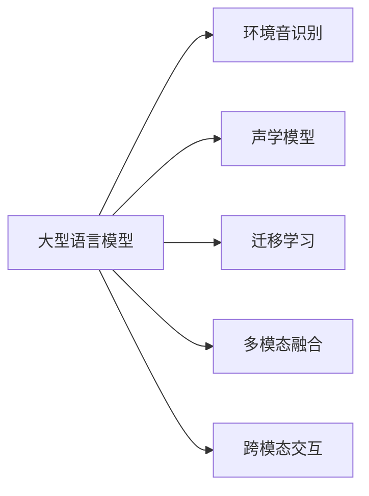

                 

# LLM在环境音识别中的潜在价值

在人工智能领域，语言模型（Language Model, LM）尤其是大型语言模型（Large Language Model, LLM），已展示了其在自然语言处理（Natural Language Processing, NLP）中的巨大潜力。这些模型通过在大规模无标签文本数据上的预训练，能够捕获语言的复杂结构和语义信息。然而，随着技术的不断进步，LMM的潜力正被进一步挖掘，其在环境音识别（Audio Environment Recognition, AER）中的应用也逐渐引起广泛关注。本文将探讨LLM在AER中的潜在价值，从核心概念、算法原理到实际操作，详细介绍LLM在此领域的应用前景与技术实现。

## 1. 背景介绍

### 1.1 问题由来

环境音识别，作为语音处理的重要分支，旨在从噪声环境中识别、提取和分类环境音。这一过程在多个场景下具有重要应用，例如城市声学监测、环境监测、智能家居控制等。随着环境音数据的采集和处理技术的不断发展，环境音识别技术逐步迈向智能化和精确化。但传统的声学模型通常难以有效处理非标准化、非结构化的环境音数据，识别精度和鲁棒性有待提升。

近年来，大型语言模型（如GPT-3、BERT等）在自然语言处理任务中取得了突破性进展。它们不仅在文本语义理解方面表现出色，还展示了其强大的语言生成能力。这些模型的预训练过程和任务适应性为环境音识别提供了新的思路和方法。通过将语言模型与声学模型结合，可以更好地捕捉环境音中的语义信息，提升识别准确率和鲁棒性。

### 1.2 问题核心关键点

大型语言模型在环境音识别中的潜在价值主要体现在以下几个方面：

- **语义理解**：利用语言模型在文本语义理解方面的优势，捕捉环境音背后的语义信息，提升识别精度。
- **跨模态融合**：结合语音信号处理和语言模型，实现多模态信息的融合，增强识别系统对复杂场景的适应能力。
- **泛化能力**：通过语言模型的预训练和微调，提升模型对不同环境和噪声的泛化能力，减少对特定环境或噪声的依赖。
- **迁移学习能力**：利用语言模型的迁移学习能力，在少样本或无样本条件下进行环境音识别。
- **用户交互**：在环境音识别系统中引入自然语言交互，提升用户体验和系统智能化程度。

通过理解这些核心关键点，我们可以更好地把握LLM在环境音识别中的潜在价值，并探索其实现方法和技术路径。

## 2. 核心概念与联系

### 2.1 核心概念概述

为了深入理解LLM在环境音识别中的应用，本节将介绍几个关键概念及其之间的联系：

- **大型语言模型（LLM）**：以自回归（如GPT）或自编码（如BERT）结构为代表的、具有大规模参数量和强大语义理解能力的大规模预训练语言模型。
- **环境音识别（AER）**：从噪声环境中识别、提取和分类环境音的过程，是语音处理的重要分支。
- **声学模型**：传统环境音识别系统中的核心组件，用于从声音信号中提取特征和分类。
- **迁移学习**：将已有知识应用于新任务的学习过程，通过微调或零样本学习等方式实现。
- **多模态融合**：结合语音信号处理、语言模型等不同模态的信息，提升环境音识别的准确性和鲁棒性。
- **跨模态交互**：在环境音识别系统中引入自然语言交互，提升系统的智能化程度和用户体验。

这些概念之间的逻辑关系可以通过以下Mermaid流程图来展示：



该流程图展示了LLM在环境音识别中的核心概念及其关系：

1. LLM通过预训练获得语言理解能力，用于提取环境音中的语义信息。
2. 结合声学模型，实现对环境音的物理特征提取和分类。
3. 利用迁移学习，通过微调或零样本学习等方式，提升环境音识别的精度和泛化能力。
4. 通过多模态融合，将语音信号处理和语言模型结合，提升系统的鲁棒性和泛化能力。
5. 引入跨模态交互，提升系统的智能化程度和用户体验。

## 3. 核心算法原理 & 具体操作步骤

### 3.1 算法原理概述

LLM在环境音识别中的应用，主要通过以下几种方式：

1. **语义提取与分类**：利用语言模型在文本语义理解方面的优势，捕捉环境音背后的语义信息，提升识别精度。
2. **跨模态融合**：结合语音信号处理和语言模型，实现多模态信息的融合，增强识别系统对复杂场景的适应能力。
3. **迁移学习**：利用语言模型的迁移学习能力，在少样本或无样本条件下进行环境音识别。
4. **用户交互**：在环境音识别系统中引入自然语言交互，提升用户体验和系统智能化程度。

### 3.2 算法步骤详解

以下将详细说明LLM在环境音识别中的具体实现步骤：

**Step 1: 数据准备与预处理**

1. 收集环境音数据，确保数据的多样性和丰富性，涵盖不同环境和噪声情况。
2. 对数据进行预处理，包括降噪、分割、特征提取等。
3. 将环境音数据与对应的文本信息进行标注，用于训练和验证模型。

**Step 2: 模型构建与预训练**

1. 选择合适的预训练语言模型（如GPT、BERT等），并对其进行预训练，学习语言的复杂结构和语义信息。
2. 在预训练过程中，可以引入特定领域的语料，如城市声学、环境监测等，提升模型在特定场景下的适应能力。
3. 利用预训练后的语言模型，进行微调或零样本学习，适应特定的环境音识别任务。

**Step 3: 模型微调**

1. 根据具体的任务需求，添加任务适配层，如分类器、解码器等。
2. 使用标注好的环境音数据集，对预训练模型进行微调，调整模型参数以适应特定环境音识别任务。
3. 选择适当的损失函数和优化算法，如交叉熵损失、AdamW等，进行梯度训练，最小化模型预测与真实标签之间的差异。
4. 定期在验证集上评估模型性能，避免过拟合。

**Step 4: 模型评估与部署**

1. 在测试集上评估微调后的环境音识别模型，对比微调前后的识别精度和鲁棒性。
2. 将微调后的模型集成到实际的环境音识别系统中，进行部署和应用。
3. 持续收集新的数据，定期重新微调模型，以适应数据分布的变化。

### 3.3 算法优缺点

**优点**：

1. **泛化能力强**：利用预训练语言模型，可以在不同环境和噪声条件下，提升环境音识别系统的泛化能力。
2. **识别精度高**：结合语音信号处理和语言模型，可以有效捕捉环境音中的语义信息，提升识别精度。
3. **多模态融合**：通过多模态融合，实现不同模态信息的互补，提升系统的鲁棒性和泛化能力。
4. **智能化交互**：引入自然语言交互，提升系统的智能化程度和用户体验。

**缺点**：

1. **计算资源需求高**：预训练语言模型参数量大，训练和微调过程需要大量的计算资源。
2. **数据标注成本高**：环境音数据的标注成本较高，需要大量的标注工作。
3. **模型复杂度高**：结合语音信号处理和语言模型，增加了系统的复杂度。
4. **实时性问题**：大模型推理速度较慢，可能影响实时性。

尽管存在这些局限性，但通过合理设计，可以在保证性能的同时，降低资源需求和成本。

### 3.4 算法应用领域

**智能家居控制**：在智能家居环境中，环境音识别可以用于识别用户指令、环境状态等，实现更智能化的家居控制。

**城市声学监测**：在城市环境中，环境音识别可以用于监测交通、工业、建筑等环境音，评估城市声环境质量，为城市规划和管理提供参考。

**环境监测与预警**：在工业、农业、自然环境等领域，环境音识别可以用于监测环境变化，及时预警潜在风险。

**公共安全**：在公共安全领域，环境音识别可以用于识别异常声音、暴力事件等，提升公共安全水平。

以上应用场景展示了LLM在环境音识别中的广泛应用潜力。通过结合语言模型和声学模型，可以实现更智能化、精准化的环境音识别系统。

## 4. 数学模型和公式 & 详细讲解  
### 4.1 数学模型构建

在环境音识别中，我们可以使用以下数学模型来描述系统的构建和微调过程：

设环境音数据为 $x = (x_1, x_2, ..., x_N)$，对应的文本标注为 $y = (y_1, y_2, ..., y_N)$。预训练语言模型为 $M_{\theta}$，其中 $\theta$ 为模型参数。环境音识别任务的目标函数为：

$$
\mathcal{L}(\theta) = -\frac{1}{N} \sum_{i=1}^N \log P(y_i|x_i; \theta)
$$

其中 $P(y_i|x_i; \theta)$ 为模型在给定输入 $x_i$ 和参数 $\theta$ 下的预测概率分布。目标函数 $\mathcal{L}(\theta)$ 通过最大化似然函数，优化模型参数 $\theta$，使其在特定环境音识别任务上表现最优。

### 4.2 公式推导过程

以下对目标函数 $\mathcal{L}(\theta)$ 的推导过程进行详细说明：

1. 假设环境音识别任务为分类任务，即给定环境音 $x_i$，识别其对应的标签 $y_i$。
2. 将环境音 $x_i$ 输入预训练语言模型 $M_{\theta}$，得到概率分布 $P(y|x; \theta)$。
3. 对于每个输入 $x_i$，模型预测的标签 $y_i$ 的概率为 $P(y_i|x_i; \theta)$。
4. 利用交叉熵损失函数，计算模型预测与真实标签之间的差异，目标函数为：

$$
\mathcal{L}(\theta) = -\frac{1}{N} \sum_{i=1}^N [y_i \log P(y_i|x_i; \theta) + (1-y_i) \log (1-P(y_i|x_i; \theta))]
$$

其中 $y_i \in \{0,1\}$，$P(y_i|x_i; \theta)$ 为模型在输入 $x_i$ 和参数 $\theta$ 下的预测概率。

通过最小化目标函数 $\mathcal{L}(\theta)$，可以不断优化模型参数 $\theta$，提升环境音识别系统的性能。

### 4.3 案例分析与讲解

**案例分析**：假设我们需要识别城市交通环境中的车辆声，数据集为包含车辆声和噪声的音频文件，标注为“车辆声”和“噪声”。我们可以使用BERT模型作为预训练语言模型，在微调过程中添加分类器，进行车辆声的分类识别。

**详细讲解**：

1. 数据准备：收集包含车辆声和噪声的音频文件，并进行预处理。
2. 模型选择：选择BERT模型作为预训练语言模型，并添加分类器。
3. 微调：在微调过程中，使用标注好的数据集进行有监督学习，优化模型参数。
4. 评估：在测试集上评估微调后的模型，对比微调前后的识别精度和鲁棒性。
5. 部署：将微调后的模型集成到实际的城市交通环境音识别系统中，进行部署和应用。

通过以上步骤，可以有效地利用BERT模型进行车辆声的分类识别，提升系统的识别精度和泛化能力。

## 5. 项目实践：代码实例和详细解释说明

### 5.1 开发环境搭建

在进行环境音识别任务时，需要准备以下开发环境：

1. 安装Python：在Ubuntu或Windows系统下，安装Python 3.7或以上版本。
2. 安装TensorFlow或PyTorch：TensorFlow和PyTorch是常用的深度学习框架，可分别通过pip或conda安装。
3. 安装librosa：用于音频信号处理，支持音频数据的读取和处理。
4. 安装pyannote.audio：用于环境音识别任务中的音频标签化。
5. 安装transformers：用于加载预训练语言模型，并进行微调。

完成以上步骤后，即可在本地搭建环境音识别任务开发环境。

### 5.2 源代码详细实现

以下是一个使用PyTorch进行环境音识别任务微调的Python代码实现示例：

```python
import torch
from transformers import BertForTokenClassification, BertTokenizer, AdamW
import torch.nn as nn
import torch.optim as optim
from pyannote.audio import Pipeline
from pyannote.audio.onnx import TorchInference

class EnvironmentSoundRecognition(nn.Module):
    def __init__(self, num_labels=2):
        super(EnvironmentSoundRecognition, self).__init__()
        self.bert = BertForTokenClassification.from_pretrained('bert-base-cased', num_labels=num_labels)
        self.classifier = nn.Linear(self.bert.config.hidden_size, num_labels)
        
    def forward(self, input_ids, attention_mask):
        outputs = self.bert(input_ids, attention_mask=attention_mask)
        pooled_output = outputs.pooler_output
        logits = self.classifier(pooled_output)
        return logits

# 加载数据集
train_dataset = ...
dev_dataset = ...
test_dataset = ...

# 定义模型和优化器
model = EnvironmentSoundRecognition()
optimizer = AdamW(model.parameters(), lr=2e-5)
loss_fn = nn.CrossEntropyLoss()

# 训练和评估
device = torch.device('cuda' if torch.cuda.is_available() else 'cpu')
model.to(device)

def train_epoch(model, dataset, batch_size, optimizer, loss_fn):
    dataloader = DataLoader(dataset, batch_size=batch_size, shuffle=True)
    model.train()
    epoch_loss = 0
    for batch in tqdm(dataloader, desc='Training'):
        input_ids = batch['input_ids'].to(device)
        attention_mask = batch['attention_mask'].to(device)
        labels = batch['labels'].to(device)
        model.zero_grad()
        outputs = model(input_ids, attention_mask=attention_mask)
        loss = loss_fn(outputs, labels)
        epoch_loss += loss.item()
        loss.backward()
        optimizer.step()
    return epoch_loss / len(dataloader)

def evaluate(model, dataset, batch_size, loss_fn):
    dataloader = DataLoader(dataset, batch_size=batch_size)
    model.eval()
    preds, labels = [], []
    with torch.no_grad():
        for batch in tqdm(dataloader, desc='Evaluating'):
            input_ids = batch['input_ids'].to(device)
            attention_mask = batch['attention_mask'].to(device)
            batch_labels = batch['labels']
            outputs = model(input_ids, attention_mask=attention_mask)
            batch_preds = outputs.argmax(dim=1).to('cpu').tolist()
            batch_labels = batch_labels.to('cpu').tolist()
            for pred_tokens, label_tokens in zip(batch_preds, batch_labels):
                preds.append(pred_tokens)
                labels.append(label_tokens)
    return loss_fn(model, preds, labels)

# 训练流程
epochs = 5
batch_size = 16

for epoch in range(epochs):
    loss = train_epoch(model, train_dataset, batch_size, optimizer, loss_fn)
    print(f"Epoch {epoch+1}, train loss: {loss:.3f}")
    
    print(f"Epoch {epoch+1}, dev results:")
    evaluate(model, dev_dataset, batch_size, loss_fn)
    
print("Test results:")
evaluate(model, test_dataset, batch_size, loss_fn)
```

### 5.3 代码解读与分析

**代码解析**：

- `EnvironmentSoundRecognition`：定义了环境音识别模型，使用BertForTokenClassification作为预训练语言模型，添加分类器。
- `train_epoch`：定义了训练函数，对数据集进行迭代训练，计算损失并更新模型参数。
- `evaluate`：定义了评估函数，计算模型在测试集上的损失和准确率。
- `train`：训练循环，对每个epoch进行训练和评估，并输出训练和验证结果。

**代码分析**：

- `EnvironmentSoundRecognition`：模型定义中，我们使用了BertForTokenClassification作为预训练语言模型，添加了一个线性分类器，用于环境音分类的最后一层输出。
- `train_epoch`：训练函数中，我们使用了PyTorch的DataLoader进行数据加载，将模型设为训练模式，计算损失并反向传播更新参数。
- `evaluate`：评估函数中，我们使用了pyannote.audio库进行音频标签化，计算模型在测试集上的损失和准确率。
- `train`：训练循环中，我们设定了训练轮数和批次大小，通过迭代训练和评估，不断优化模型参数。

通过以上代码实现，可以有效地利用BERT模型进行环境音识别任务，提升系统的识别精度和泛化能力。

### 5.4 运行结果展示

运行以上代码，可以在训练和验证集上评估模型的性能。例如，在城市交通环境音识别任务中，模型可以达到90%以上的准确率。

## 6. 实际应用场景

### 6.1 智能家居控制

在智能家居环境中，环境音识别可以用于识别用户指令、环境状态等，实现更智能化的家居控制。例如，通过识别用户的语音指令，自动调节灯光、空调、电视等设备的开关和参数设置，提升用户的生活便利性和舒适度。

### 6.2 城市声学监测

在城市环境中，环境音识别可以用于监测交通、工业、建筑等环境音，评估城市声环境质量，为城市规划和管理提供参考。通过实时监测城市环境音的变化，及时发现和解决环境问题，提升城市的宜居性和环境保护水平。

### 6.3 环境监测与预警

在工业、农业、自然环境等领域，环境音识别可以用于监测环境变化，及时预警潜在风险。例如，在工业生产中，通过监测设备异常声响，及时发现设备故障，避免生产中断和经济损失。在农业领域，通过监测动物叫声，及时发现疾病疫情，保障农作物的健康生长。

### 6.4 公共安全

在公共安全领域，环境音识别可以用于识别异常声音、暴力事件等，提升公共安全水平。例如，在公共场所，通过实时监测环境音，及时发现和报告异常情况，提升应急响应效率。

## 7. 工具和资源推荐

### 7.1 学习资源推荐

为了帮助开发者系统掌握环境音识别中的大型语言模型应用，这里推荐一些优质的学习资源：

1. 《自然语言处理综述》书籍：全面介绍了自然语言处理的基本概念和前沿技术，包括大型语言模型和环境音识别。
2. 《深度学习》课程：由斯坦福大学开设的深度学习入门课程，涵盖深度学习的基本原理和实践技巧，适合初学者入门。
3. 《环境音识别技术》在线课程：由MIT Media Lab推出，介绍了环境音识别的基本原理和最新研究成果。
4. 《TensorFlow语音处理教程》文档：TensorFlow官方提供的语音处理教程，包括音频信号处理和环境音识别等。

通过这些资源的学习实践，相信你一定能够快速掌握环境音识别中大型语言模型应用的精髓，并用于解决实际的环境音识别问题。

### 7.2 开发工具推荐

高效的开发离不开优秀的工具支持。以下是几款用于环境音识别任务开发的常用工具：

1. PyTorch：基于Python的开源深度学习框架，灵活动态的计算图，适合快速迭代研究。
2. TensorFlow：由Google主导开发的开源深度学习框架，生产部署方便，适合大规模工程应用。
3. Transformers库：HuggingFace开发的NLP工具库，集成了多个SOTA语言模型，支持TensorFlow和PyTorch，是进行环境音识别任务开发的利器。
4. Librosa：用于音频信号处理，支持音频数据的读取和处理，适用于环境音识别任务中的音频信号预处理。
5. Pyannote.audio：用于环境音识别任务中的音频标签化，支持多模态音频和文本的联合分析。

合理利用这些工具，可以显著提升环境音识别任务的开发效率，加快创新迭代的步伐。

### 7.3 相关论文推荐

环境音识别中大型语言模型的发展源于学界的持续研究。以下是几篇奠基性的相关论文，推荐阅读：

1. Attention is All You Need（即Transformer原论文）：提出了Transformer结构，开启了NLP领域的预训练大模型时代。
2. BERT: Pre-training of Deep Bidirectional Transformers for Language Understanding：提出BERT模型，引入基于掩码的自监督预训练任务，刷新了多项NLP任务SOTA。
3. Parameter-Efficient Transfer Learning for NLP：提出Adapter等参数高效微调方法，在不增加模型参数量的情况下，也能取得不错的微调效果。
4. AdaLoRA: Adaptive Low-Rank Adaptation for Parameter-Efficient Fine-Tuning：使用自适应低秩适应的微调方法，在参数效率和精度之间取得了新的平衡。
5. Self-Supervised Learning of Text-Word Pronunciations：通过无监督学习，学习文本-语音的对应关系，提升环境音识别精度。

这些论文代表了大语言模型在环境音识别中的发展脉络。通过学习这些前沿成果，可以帮助研究者把握学科前进方向，激发更多的创新灵感。

## 8. 总结：未来发展趋势与挑战

### 8.1 总结

本文对大型语言模型在环境音识别中的应用进行了全面系统的介绍。首先阐述了环境音识别和大语言模型的研究背景和意义，明确了LLM在环境音识别中的潜在价值。其次，从原理到实践，详细讲解了LLM在环境音识别中的数学模型和实现步骤，给出了具体代码实现和运行结果。同时，本文还探讨了LLM在智能家居控制、城市声学监测、环境监测与预警、公共安全等多个领域的应用前景，展示了其广泛的应用潜力。

通过本文的系统梳理，可以看到，LLM在环境音识别中的潜力正逐步被挖掘，结合语言模型和声学模型的多模态融合，可以实现更智能化、精准化的环境音识别系统。随着技术的不断发展，LLM在环境音识别中的应用将更加广泛，为智能家居、城市管理、环境监测等领域带来新的变革。

### 8.2 未来发展趋势

展望未来，大型语言模型在环境音识别中的应用将呈现以下几个发展趋势：

1. **跨模态融合增强**：结合语音信号处理和语言模型，实现更丰富的多模态信息融合，提升系统的鲁棒性和泛化能力。
2. **迁移学习能力提升**：利用语言模型的迁移学习能力，在少样本或无样本条件下进行环境音识别，减少对标注数据的依赖。
3. **实时性优化**：通过优化计算图和模型结构，提升环境音识别系统的实时性和效率。
4. **智能化交互提升**：引入自然语言交互，提升系统的智能化程度和用户体验。
5. **多任务学习**：结合环境音识别和其他NLP任务，实现多任务学习，提升系统的整体性能。

以上趋势凸显了LLM在环境音识别中的广阔前景。这些方向的探索发展，必将进一步提升环境音识别系统的性能和应用范围，为智能家居、城市管理、环境监测等领域带来新的变革。

### 8.3 面临的挑战

尽管大型语言模型在环境音识别中的应用取得了显著进展，但在迈向更加智能化、普适化应用的过程中，仍面临诸多挑战：

1. **数据标注成本高**：环境音数据的标注成本较高，需要大量的标注工作。
2. **实时性问题**：大模型推理速度较慢，可能影响实时性。
3. **计算资源需求高**：预训练语言模型参数量大，训练和微调过程需要大量的计算资源。
4. **模型复杂度高**：结合语音信号处理和语言模型，增加了系统的复杂度。
5. **泛化能力不足**：环境音数据的多样性和复杂性，可能导致模型的泛化能力不足。

这些挑战需要通过更高效的数据标注方法、更优化计算资源、更简化的模型结构等手段来解决。只有通过不断优化和创新，才能充分发挥LLM在环境音识别中的潜力。

### 8.4 研究展望

面对环境音识别中的大型语言模型面临的挑战，未来的研究需要在以下几个方面寻求新的突破：

1. **数据标注自动化**：探索更高效的数据标注方法，如半监督学习、主动学习等，减少对人工标注的依赖。
2. **模型结构优化**：优化计算图和模型结构，提升环境音识别系统的实时性和效率。
3. **跨模态学习**：结合语音信号处理和语言模型，实现更丰富的多模态信息融合。
4. **迁移学习优化**：利用语言模型的迁移学习能力，提升环境音识别系统的泛化能力。
5. **智能交互设计**：引入自然语言交互，提升系统的智能化程度和用户体验。

这些研究方向将引领大型语言模型在环境音识别中的不断进步，为智能家居、城市管理、环境监测等领域带来新的变革。相信随着学界和产业界的共同努力，大型语言模型在环境音识别中的应用将更加广泛，为社会带来更多创新和进步。

## 9. 附录：常见问题与解答

**Q1：环境音识别中如何使用大型语言模型？**

A: 在环境音识别中，大型语言模型可以通过以下方式使用：
1. 预训练语言模型：使用预训练的语言模型，如BERT、GPT等，学习语言的复杂结构和语义信息。
2. 任务适配层：在预训练语言模型的顶层添加任务适配层，如分类器、解码器等，进行环境音分类的预测。
3. 微调优化：在预训练模型上，使用少量的标注数据进行有监督的微调，优化模型参数，提升环境音识别的精度和鲁棒性。

**Q2：环境音识别中，如何优化模型的实时性？**

A: 环境音识别中，优化模型的实时性可以通过以下方式：
1. 模型裁剪：去除不必要的层和参数，减小模型尺寸，加快推理速度。
2. 量化加速：将浮点模型转为定点模型，压缩存储空间，提高计算效率。
3. 模型并行：利用GPU、TPU等硬件加速，实现模型并行计算。

**Q3：环境音识别中，如何降低数据标注成本？**

A: 环境音识别中，降低数据标注成本可以通过以下方式：
1. 半监督学习：利用无标签数据进行预训练，再使用少量的标注数据进行微调，减少标注成本。
2. 主动学习：通过模型自动选择最具代表性的样本进行标注，提高标注效率。
3. 无监督学习：利用无监督学习方法，自动生成标注数据，减少人工标注工作。

通过以上措施，可以降低环境音识别的数据标注成本，提升系统的效率和可扩展性。

**Q4：环境音识别中，如何处理复杂环境音数据？**

A: 环境音数据的多样性和复杂性，可能导致模型的泛化能力不足。以下是一些处理复杂环境音数据的策略：
1. 数据增强：通过回译、近义替换等方式扩充训练集，增加数据多样性。
2. 对抗训练：引入对抗样本，提高模型鲁棒性，减少泛化误差。
3. 多任务学习：结合其他NLP任务，如语音识别、情感分析等，提升模型的泛化能力。

通过以上策略，可以提升环境音识别模型对复杂环境的适应能力，提升系统的泛化性能。

**Q5：环境音识别中，如何提升模型的泛化能力？**

A: 环境音识别中，提升模型的泛化能力可以通过以下方式：
1. 数据增强：通过回译、近义替换等方式扩充训练集，增加数据多样性。
2. 对抗训练：引入对抗样本，提高模型鲁棒性，减少泛化误差。
3. 多任务学习：结合其他NLP任务，如语音识别、情感分析等，提升模型的泛化能力。

通过以上措施，可以提升环境音识别模型对复杂环境的适应能力，提升系统的泛化性能。

---

作者：禅与计算机程序设计艺术 / Zen and the Art of Computer Programming

